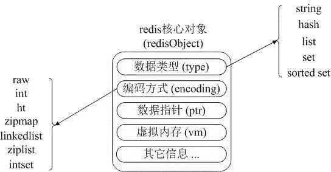
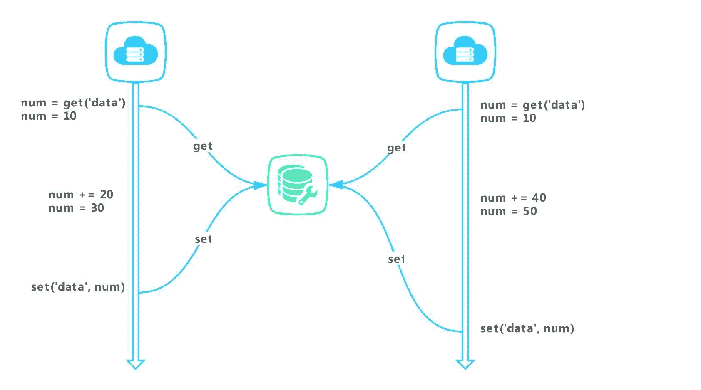

# 为什么我们要用 Redis

> 原文：[`developer.ibm.com/zh/articles/db-redis-from-basic-to-advanced-01/`](https://developer.ibm.com/zh/articles/db-redis-from-basic-to-advanced-01/)

本文将会从 Redis 的几大特性开始讲起，分别讲解 Redis 的速度快、支持多种数据类型、功能多样、服务简单、客户端语言丰富、支持持久化及主从复制、高可用、分布式这几大特点。从这几大特点中，读者可以详细的知道为什么要学习 Redis 以及学习 Redis 有什么用。下面正式开始本文的学习。先介绍本文的思维导图。


## 速度快

1.  数据都在内存中：计算机由运算器，控制器，存储器，输入设备，输出设备这五大部分组成。存储器又是由闪存，硬盘，内存这三部分组成，而这三部分当中读取速度最快的是内存，Redis 正是利用了这一点，所以读取速度才会更快。

2.  单线程，避免出现线程竞争问题：Redis 客户端每次调用都会经历发送、执行、返回结果的三个阶段，由于 Redis 是单线程模型，所以当请求来临时，所有的命令进入到一个对列中，然后依次按照对列执行。由于不会有两条命令同时执行，所以不会产生并发问题。 备注：单线程模型，指的是网路请求模块使用的是一个线程，即，一个线程处理所有的网络请求，其余模块仍然使用多个线程。

3.  采用非阻塞 IO：Redis 由于是 C 语言实现，其速度上更快，更加接近于系统底层。Redis Build 相当的快，使用了内置容器，即 stl，使用了大量的模板，由于使用了 C 可移植性更高。


如上图所示，Redis 有一个全局管理者——reactor，负责管理全局的请求，当没有请求的时候，进入到阻塞状态，即 acceptor 状态，当有请求来临的时候，会自动调用一个新的线程，重新启动新的程序。由于是多线程调用处理，速度会更快。

一言以蔽之，就是把事件注册到监听器上，当请求来临时候，直接触发事件，调用新的线程进行处理。

## 支持多种数据类型

Redis 支持五大基础数据类型（ string，字符串类型，hash 哈希，list 列表，set 集合）以及 zset 有序集合，如下图所示：



### string

string 是 redis 的基本数据类型，即一个 key 对应于一个 value，常用的命令有 get、set、incr、decr、mget 等。应用场景主要是进行系统的缓存，如微博计数，粉丝计数等。 使用示例如下

```
redis 127.0.0.1:6379> SET name "runoob"
"OK" redis 127.0.0.1:6379> GET name
"runoob" 
```

### hash

哈希是一个键值对的集合，redis hash 是一个 string 类型的 field 和 value 的映射表，hash 用于存储对象，常用命令有，hget，hset，hgetall。主要使用场景有存储一个用户信息的对象数据。例如 key 为用户 id，value 为用户序列化后的姓名数据，年龄数据，生日数据等。

使用示例如下：

```
redis> HSET myhash field1 "Hello" field2 "World"
"OK" redis> HGET myhash field1
"Hello" redis> HGET myhash field2
"World" 
```

### list

list 列表是简单的字符串列表，按照插入的顺序排序，可以添加一个元素到列表的头部或尾部。常用命令有 ipush，rpush，ipop，rpop，lrange 等。微博的关注列表，粉丝列表都可以使用 redis 的 list 进行实现。

使用示例如下

```
redis 127.0.0.1:6379> lpush runoob redis
(integer) 1 redis 127.0.0.1:6379> lpush runoob mongodb
(integer) 2 redis 127.0.0.1:6379> lpush runoob rabitmq
(integer) 3 redis 127.0.0.1:6379> lrange runoob 0 10
1) "rabitmq"
2) "mongodb"
3) "redis" redis 127.0.0.1:6379> 
```

### set

set 是 string 类型的无序集合，通过 hashtable 实现，与概念和数学中的集合基本类似，可以进行交集，并集，差集等操作，set 中的元素没有顺序，添加，删除，查找其复杂度都为 O（1）。

常用命令有 sadd，spop，smembers，sunion。常用的使用场景有微博中，把一个用户所有关注的人都保存为一个集合，把其所有的粉丝都保存为一个集合，因为 redis 还提供求交集，并集，差集，所以可以实现共同关注、共同喜好等功能。

使用示例如下

```
redis 127.0.0.1:6379> sadd runoob redis
(integer) 1 redis 127.0.0.1:6379> sadd runoob mongodb
(integer) 1 redis 127.0.0.1:6379> sadd runoob rabitmq
(integer) 1 redis 127.0.0.1:6379> sadd runoob rabitmq
(integer) 0 redis 127.0.0.1:6379> smembers runoob
1) "redis"
2) "rabitmq"
3) "mongodb" 
```

### zset

zset 和 set 一样也是 string 类型的元素集合，并且不允许有重复成员，可以用 zadd 命令添加元素到集合，元素在集合中会更新对应的 score，常用的命令有 zadd，zrange，zrem，zcard 等。使用场景有，排行榜的使用，带权重的消息队列的使用。

使用示例如下

```
redis 127.0.0.1:6379> zadd runoob 0 redis
(integer) 1 redis 127.0.0.1:6379> zadd runoob 0 mongodb
(integer) 1 redis 127.0.0.1:6379> zadd runoob 0 rabitmq
(integer) 1 redis 127.0.0.1:6379> zadd runoob 0 rabitmq
(integer) 0 redis 127.0.0.1:6379> > ZRANGEBYSCORE runoob 0 1000
1) "mongodb"
2) "rabitmq"
3) "redis" 
```

### 其余数据类型

其余数据类型有位图、hyperloglog、geo，由于这些数据类型一般不太常用，所以本文不介绍。

## 功能丰富

redis 功能相当丰富，拥有键过期功能、基于发布订阅实现消息队列功能、通过 Lua 创建命令功能、pipeline 功能等。

### 设置键过期

redis 可以设置键过期功能，其示例代码如下

```
redis> SET cache_page "www.google.com"
OK
redis> EXPIRE cache_page 30  # 设置过期时间为 30 秒
(integer) 1
redis> TTL cache_page    # 查看剩余生存时间
(integer) 23
redis> EXPIRE cache_page 30000   # 更新过期时间
(integer) 1
redis> TTL cache_page
(integer) 29996 
```

### 基于发布订阅实现消息队列

redis 可以基于发布订阅实现消息队列功能，其实现方案如下：

使用 redis 的 ipush 命令，实现简单的左进右出，或者右进左出的 list 列表，然后需要开启一个线程任务或者定时任务，不停的调用 rpop 方法查看 list 中是否有待处理的消息，如果有进行处理，如果没有则继续调用查看。

### 通过 lua 创建命令

以一个例子作为验证，使用 lua 脚本实现 redis 的自乘。 书写 Lua 脚本如下

```
local curVal = redis.call("get", KEYS[1]); 
if curVal == false 
   then curVal = 0 
   else curVal = tonumber(curVal) 
end;
curVal = curVal * tonumber(ARGV[1]); 
redis.call("set", KEYS[1], curVal);
return curVal; 
```

执行验证，上面的 lua 脚本去掉换行即可。

```
127.0.0.1:6379> SCRIPT LOAD 'local curVal = redis.call("get", KEYS[1]); if curVal == false then curVal = 0 else curVal = tonumber(curVal) end;curVal = curVal * tonumber(ARGV[1]);redis.call("set",KEYS[1], curVal);return curVal;'
"3ffdd17da7e77aa3249ac0d0b05d6e8fc348e8f3"
127.0.0.1:6379> 
```

设置两年 10 岁，然后调用 lua 缓存命令乘以 3.得出结果为 30

```
127.0.0.1:6379> SCRIPT LOAD 'local curVal = redis.call("get", KEYS[1]); if curVal == false then curVal = 0 else curVal = tonumber(curVal) end;curVal = curVal * tonumber(ARGV[1]);redis.call("set",KEYS[1], curVal);return curVal;'
"3ffdd17da7e77aa3249ac0d0b05d6e8fc348e8f3"
127.0.0.1:6379> set gaoxinfu_age 10
OK
127.0.0.1:6379> EVALSHA 3ffdd17da7e77aa3249ac0d0b05d6e8fc348e8f3 1 gaoxinfu_age 3
(integer) 30
127.0.0.1:6379> 
```

## Redis 高级特性

Redis 除了上文介绍的一些比较初级的特性以外，还具有服务简单、客户端语言丰富、支持持久化、支持主从复制等一些高级特性。下面依次介绍这些高级特性。

1.  服务简单：redis 服务相当简单，其源代码优雅，拥有多个操作系统的版本故而在一定意义上来说不依赖于操作系统，例如 windows 版本的 redis，linux 版本的 redis，还有 docker 容器版本的 redis，这些版本，随用随取，相当方便。
2.  客户端语言丰富：redis 具有多语言客户端，有支持 Java 的 jredis，php 的 phpredis，python 的 redis-py 客户端，以及 node 的 redis 客户端 node_redis 等，客户端语言相当的丰富。
3.  支持持久化：redis 支持持久化，主要有两种持久化方式：RDB 持久化和 AOF 持久化。这两种持久化方式一个为记录命令，一个为把当前的 redis 进行快照保存到磁盘中。
4.  支持主从复制，高可用，分布式：redis 支持主从复制，哨兵机制，高可用机制，分布式机制。如图所示：



## 小结

本文通过介绍 redis 支持多种数据类型、功能丰富、服务简单、客户端语言丰富、支持持久化、支持分布式等特点详解了我们为什么要用 redis，从而帮助您为后续 redis 的学习奠定了基础。