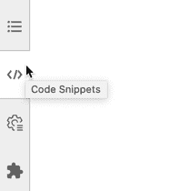
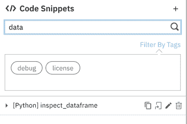
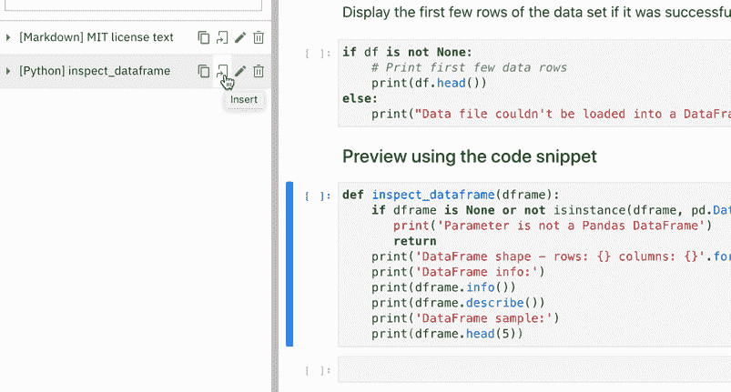

# 在 Jupyterlab 中重用代码片段

> 原文：[`developer.ibm.com/zh/articles/reuse-code-snippets-in-jupyterlab/`](https://developer.ibm.com/zh/articles/reuse-code-snippets-in-jupyterlab/)

在我的前一篇文章[使用 Elyra 和 Kubeflow Pipelines 创建 AI 管道](https://developer.ibm.com/zh/articles/create-ai-pipelines-using-elyra-and-kubeflow-pipelines/)中，我介绍了 Elyra 开源项目以及它的一个主要功能 —— Visual Pipelines 编辑器。在本文中，我将回顾 Elyra 代码片段扩展功能，此扩展功能可以在 JupyterLab 中的 Notebook、源代码或 Markdown 文件中重用任意代码片段。

为什么这很重要？假设您正在处理一个 Notebook，并希望在其中包含您之前创建的标准页眉/页脚（例如许可文本）或者代码。从我个人经验来看，这通常会导致大量搜索。我在哪个 Notebook 中使用该代码？我需要在哪里添加最新版本的免责声明？虽然维护“便签本”可能会对您有所帮助（我有时会使用 Slack 来执行此操作），但最好是使用 JupyterLab 中提供的本机可重用代码或文档资产支持功能。

下面我将介绍它的使用方法。

## 安装代码片断扩展

您可以将代码片段扩展作为 Elyra 的一部分进行安装，也可以使用 `pip` 或 `conda` 单独进行安装。在本文撰写之时，需要重建 JupyterLab 才能使用该扩展。

### 使用 pip 安装代码片段扩展

您可以在以下两种方式之中选择一种，使用 `pip` 安装该扩展：

使用以下命令来安装所有 Elyra 扩展：

```
$ pip install elyra && jupyter lab build 
```

或者，仅安装代码片段扩展：

```
$ pip install elyra-code-snippet-extension && jupyter lab build 
```

### 使用 Conda 安装代码片段扩展

使用以下代码，使用 `conda` 来安装所有 Elyra 扩展：

```
$ conda install -c conda-forge elyra && jupyter lab build 
```

或者，仅安装代码片段扩展：

```
$ conda install -c conda-forge elyra-code-snippet-extension && jupyter lab build 
```

## 管理和使用代码片段

安装 Elyra 或代码片段扩展后，可以通过打开 JupyterLab 侧边栏上的 `code snippets` 标签来访问代码片段：



代码片段用户界面分为以下两部分：

*   快速搜索面板
*   代码片段列表，其提供对特定于代码片段操作（例如复制、插入、编辑和删除）的访问


下面来看看可使用代码片段用户界面来执行的一些操作。

### 创建代码片段

要创建代码片段，可单击搜索栏上方的 **`+`** 并提供所需的信息。您也可以选择标记代码片段，这样更容易发现它们。


### 查找代码片段

要查找代码片段，可输入搜索词或选择某个列出的标签。



### 将代码片段复制到剪贴板

要将代码片段内容复制到剪贴板，可单击代码片段的*复制*图标。

### 插入代码片段

要将代码片段内容粘贴到所需的目标位置（例如 Notebook 中的某个单元格或某个打开的编辑器窗口），可单击代码片段的插入图标。



注意，编辑器不会跟踪您插入代码片段的位置。还要注意，代码片段的行为与宏不一样，代码片段的更改不会反映在嵌入代码片段的位置。

### 编辑代码片段

要编辑代码片段，可单击代码片段的画笔图标。

### 删除代码片段

要删除代码片段，可单击代码片段的回收站图标。

## 共享代码片段

代码片段扩展目前未提供任何导入或导出功能。但是，您可以访问包含定义的相关元数据文件。

这些定义存储在 `$JUPYTER_DATA_DIR/metadata/code-snippets` 目录中，其中 `$JUPYTER_DATA_DIR` 是指 [Jupyter 数据目录](https://jupyter.readthedocs.io/en/latest/use/jupyter-directories.html#id2)。您可以通过在终端窗口中运行以下命令来识别此目录：

```
$ jupyter --data-dir 
```

在我的环境中，代码片段存储在 `/Users/patti/Library/Jupyter/metadata/code-snippets/` 中。如果要备份或共享代码片段，我通常会针对该目录的内容创建一个归档。

## 结束语

如果您对代码片段扩展有疑问或遇到任何问题，可访问 [GitHub](https://github.com/elyra-ai/elyra/issues) 或[在 Gitter 上 Ping 我们](https://gitter.im/elyra-ai/community)。要了解其他 Elyra 功能，可查看[文档](https://elyra.readthedocs.io/en/latest/getting_started/overview.html)。

本文翻译自：[Reuse code snippets in Jupyterlab](https://developer.ibm.com/articles/reuse-code-snippets-in-jupyterlab/)（2020-12-03）