# 使用 Elyra 和 Kubeflow Pipelines 创建 AI 管道

> 原文：[`developer.ibm.com/zh/articles/create-ai-pipelines-using-elyra-and-kubeflow-pipelines/`](https://developer.ibm.com/zh/articles/create-ai-pipelines-using-elyra-and-kubeflow-pipelines/)

数据科学家经常使用 Jupyter Notebook 来完成工作。无论您是加载或处理数据、分析数据、使用数据训练模型还是执行数据科学工作流程的其他任务，Notebook 通常都是关键。

假设您创建了一组 Notebook 来用于加载、清理和分析定期提供的时间序列数据。您无需手动运行每个 Notebook（或执行单个 Notebook 中的所有任务，这会限制任务特定代码的可重用性），即可创建并运行可重用的机器学习管道，如下所示：

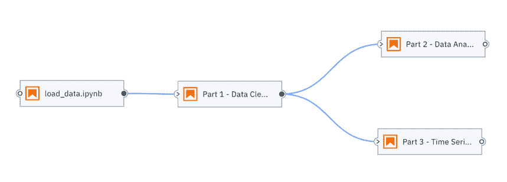

借助开源 Elyra 项目，您可以在 JupyterLab 中执行此操作，也可以使用 [Kubeflow Pipelines](https://www.kubeflow.org/docs/pipelines/overview/pipelines-overview/) 来执行此操作。Kubeflow Pipelines 是一种受欢迎的平台，可用于构建和部署基于 Docker 容器、可移植、可扩展的机器学习工作流程。在本文中，我将介绍 JupyterLab 和 Elyra，并展示如何创建并运行管道。

## Jupyterlab 和 Elyra 快速入门

通过使用 JupyterLab [扩展](https://jupyterlab.readthedocs.io/en/stable/user/extensions.html)，任何人都可以自定义用户体验。这些扩展提供了新的功能（例如 CSV 文件编辑器或可视化），并集成了一些服务（例如用于共享和版本控制的 git）或主题。

[Elyra](https://github.com/elyra-ai/elyra) 是一组以 AI 为中心的 JupyterLab 扩展，旨在简化日常活动。其主要功能是 Visual Pipeline Editor，您可以使用这种编辑器，通过 Python Notebook 或脚本来创建工作流程，并在 JupyterLab 或 Kubeflow Pipelines 上本地运行这些工作流程。

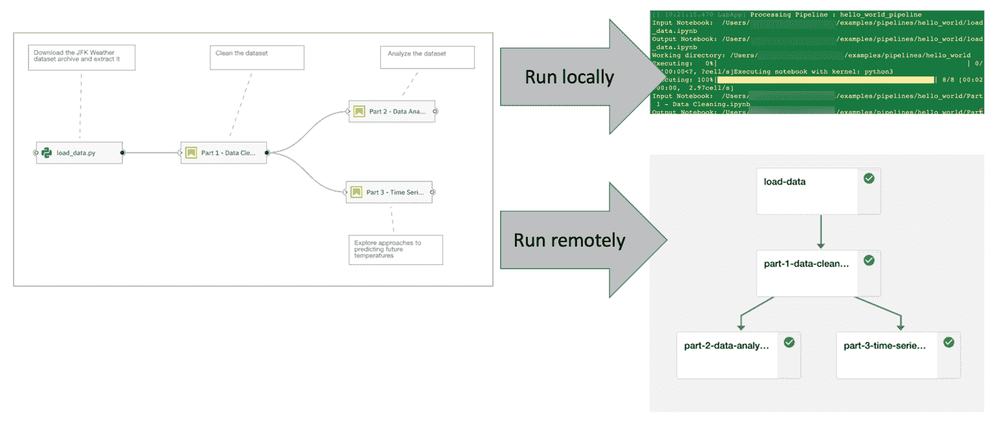

### 组装管道

您将使用 Visual Pipeline Editor 在 Elyra 中组装管道。管道组装流程通常包括：

*   创建新管道
*   添加 Python Notebook 或 Python 脚本并定义其运行时属性
*   连接 Notebook 和脚本以定义执行依赖关系

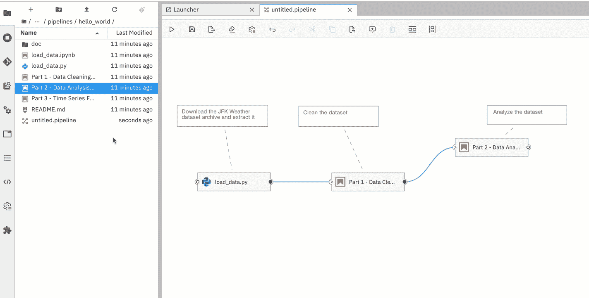

#### 创建管道

要在 Elyra 中创建新管道，可以从 Launcher 中打开 Pipeline Editor。

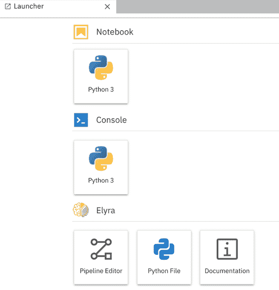

#### 将 Python Notebook 和脚本添加到管道中

您可以通过将 Python Notebook 和脚本从 JupyterLab 文件浏览器拖动到画布上的方式将它们添加到管道中。

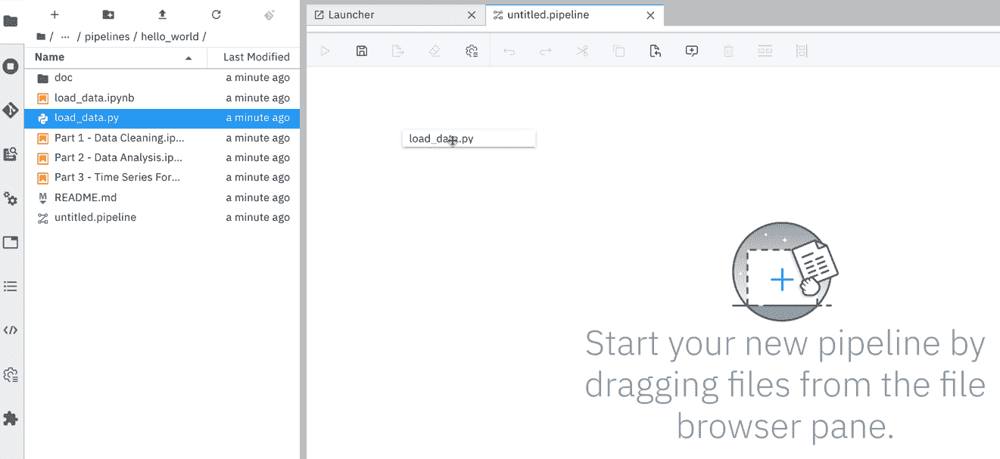

每个 Notebook 或文件都由一个节点（包括一个输入端口和一个输出端口）来表示。

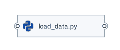

您可以通过上下文菜单来访问节点运行时属性。这些节点运行时属性定义了要在远程执行期间在其中运行 Notebook 或脚本的执行环境（Docker 镜像），以及输入文件（文件依赖关系和环境变量）和输出文件。


您可以选择将节点与用于描述其用途的注释相关联。

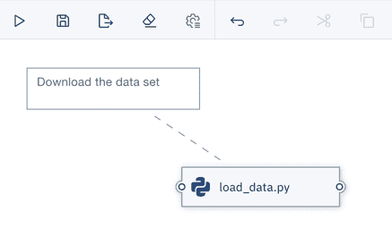

#### 定义 Notebook 和脚本之间的依赖关系

可通过将输出端口（位于节点右侧）连接到输入端口（位于节点左侧）来定义 Notebook 或脚本之间的依赖关系。

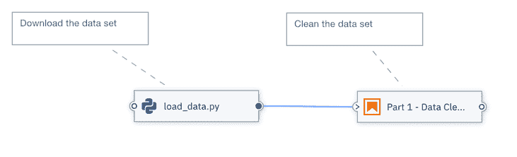

将通过依赖关系来确定在管道运行期间节点的执行顺序。

遵循以下规则：

*   不允许循环依赖关系
*   如果两个节点未连接在一起（直接或间接），则可以并行执行这些节点
*   如果两个节点连接在一起，则首先执行为其他节点生成输入的节点

在 JupyterLab 和第三方工作流程编排框架（例如 Kubeflow Pipelines）上执行管道的方式之间存在一些明显的差异。

### 在 JupyterLab 中运行管道

只要环境提供了对管道必备条件的访问权限，就可以在 JupyterLab 中执行管道。例如，必须已安装了与 Notebook 相关联的内核，就像必需的软件包一样（如果尚未在 Notebook 中安装的话）。

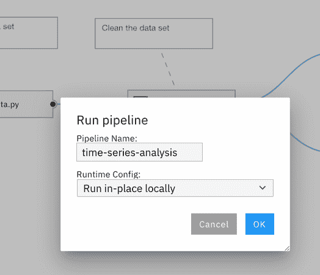

在下列情况下，应该可以在 JupyterLab 环境中运行管道：

*   您正在组装新管道并使用相对较少的数据来测试该管道
*   管道任务不需要超出可用资源的硬件资源
*   鉴于现有资源限制，管道任务将在可接受的时间内完成

在 JupyterLab 环境中：

*   节点在 JupyterLab 环境中作为子流程执行，并且始终按顺序处理。
*   输出文件（例如，处理过的数据文件或训练工件）存储在本地文件系统中，并且可使用 JupyterLab 文件浏览器进行访问。
*   处理过的 Notebook 将就地进行更新，这意味着它们的输出单元会反映执行结果。
*   Python 脚本输出（例如，发送到 STDOUT 或 STDERR 的消息）将显示在 JupyterLab 控制台中。

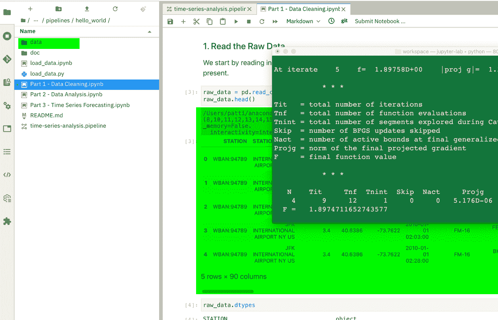

除完成处理后的消息外，Elyra 当前在 JupyterLab UI 中不提供管道监视功能。但是，在 JupyterLab 控制台输出中会提供相关信息。

要了解有关如何创建管道并在 JupyterLab 中运行管道的更多信息，可查看[在 JupyterLab 中运行 Notebook 管道](https://elyra.readthedocs.io/en/latest/getting_started/tutorials.html)教程。

### 在 Kubeflow Pipelines 上运行管道

虽然在某些情况下可以在本地运行管道，但是如果需要处理大量数据或者计算任务需要专用硬件（例如 GPU 或 TPU）来执行资源密集型计算，则这是不切实际的。

您可以通过定义运行时配置来将 Elyra 配置为访问安全和不安全的 Kubeflow Pipelines 实例。配置完毕后，将使用所选配置来运行管道。

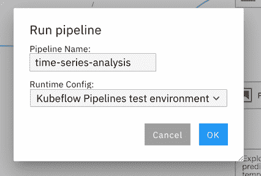

在本地执行管道与在 Kubeflow Pipelines 上执行管道之间的主要区别在于：使用 Kubeflow Pipelines 时，每个节点都在单独的 Docker 容器中进行处理，因此可以实现更好的可移植性、可扩展性和可管理性。

以下图表针对两个从属 Notebook 节点说明了此情况。

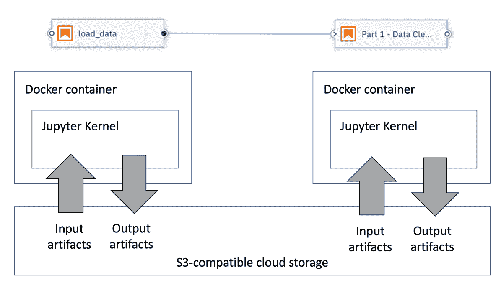

可在使用 S3 兼容云存储器的节点之间交换数据。在执行 Notebook 或 Python 脚本之前，会自动将已声明的*输入文件依赖关系*从云存储器下载到容器中。完成处理后，会自动将已声明的*输出文件*从容器上传到云存储器中。

由于 Elyra 尚不成熟，因此目前是依靠 Kubeflow Pipelines UI 来监视管道执行。

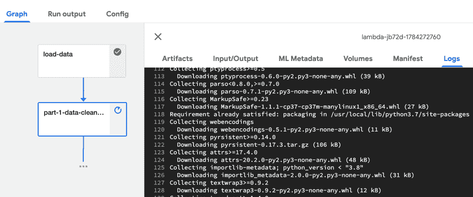

可以在[在 Kubeflow Pipelines 上运行 Notebook 管道](https://elyra.readthedocs.io/en/latest/getting_started/tutorials.html)教程中找到更多详细信息以及分步说明。

### 试用 Elyra 和管道的方法

利用上述教程，您可以轻松地开始使用管道。如果您需要更复杂的示例，则此 [COVID-19 时间序列管道](https://github.com/CODAIT/covid-notebooks)可能适合您。

如果您想要试用 Elyra 并开始构建自己的管道，则可以使用以下三个选项：

*   使用云上托管的沙箱环境
*   使用 Elyra Docker 镜像
*   在本地计算机上安装 JupyterLab 和 Elyra

所有 Elyra 安装选项都不包含 Kubeflow Pipelines。

#### 在云端的沙箱环境中运行 Elyra

无需安装任何工具，即可在 [mybinder.org](https://mybinder.readthedocs.io/en/latest/) 上试用 Elyra。打开[此链接](https://github.com/elyra-ai/elyra#using-binder)，在沙箱环境中试用最新的稳定版本或最新的开发版本（如果您喜欢冒险的话）。

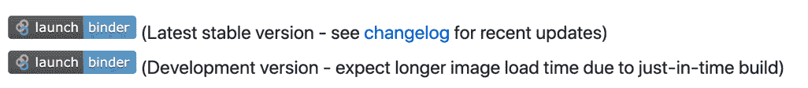

沙箱环境包含一个 `getting_started` MD 文档，它简要介绍了 Elyra 的功能：

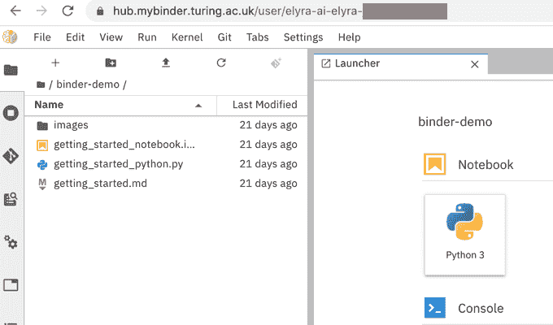

需要注意以下几点：

*   由于这是一个共享环境，因此有时性能可能会下降。
*   沙箱环境不具备持久性，在关闭该环境时，您所做的所有更改都将丢失。

如果在计算机上安装了 Docker，则可以考虑改用其中一个 Docker 镜像。

#### 运行 Elyra Docker 镜像

Elyra 社区在 Docker Hub 上发布了[现成的 Docker 镜像](https://hub.docker.com/r/elyra/elyra/tags)，其中预先安装了 JupyterLab 和 Elyra 扩展。Docker 镜像的大小约为 1 GB，其标记如下：

*   `elyra / elyra：latest` 是最新的稳定版本
*   `elyra / elyra：x.y.z` 已安装 `x.y.z` 版本
*   `elyra / elyra：dev` 是在每次提交更改时自动构建的。

一旦确定了要使用的镜像（`elyra / elyra：latest` 始终是一个不错的选择，因为您不会错过最新功能！），您可以按如下所示启动沙箱容器：

```
docker run -it -p 8888:8888\
 -v ${HOME}/jupyter-notebooks/:/home/jovyan/work\
 -w /home/jovyan/work\
 elyra/elyra:latest jupyter lab 
```

在 Web 浏览器中打开所显示的 URL，然后您就可以开始了。

```
To access the notebook, open this file in a browser:
        file:///home/jovyan/.local/share/jupyter/runtime/nbserver-6-open.html
    Or copy and paste one of these URLs:
        http://4d17829ecd4c:8888/?token=d690bde267ec75d6f88c64a39825f8b05b919dd084451f82
     or http://127.0.0.1:8888/?token=d690bde267ec75d6f88c64a39825f8b05b919dd084451f82 
```

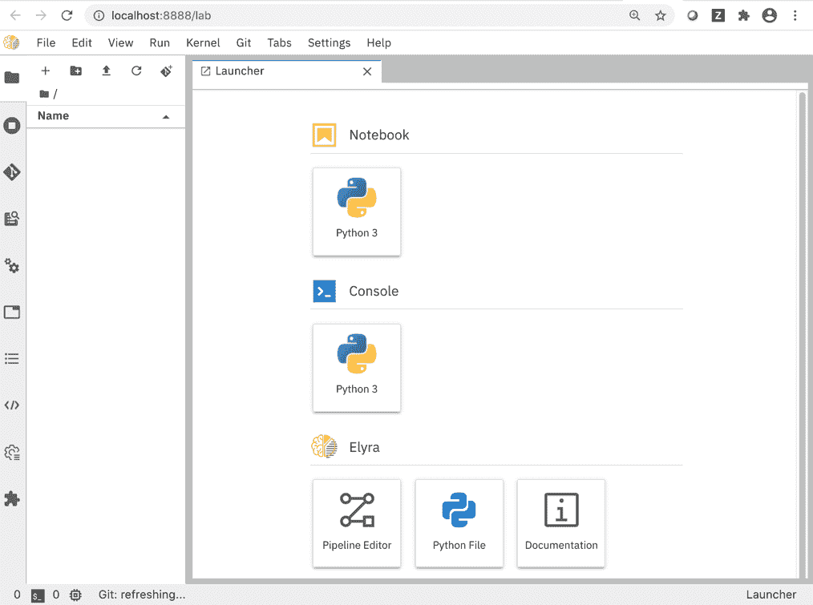

警告：在沙箱模式下，您无法访问本地计算机上的现有文件（例如 Notebook），并且在关闭容器时，您所做的所有更改都将丢失。

因此，最好按如下所示启动 Docker 容器，并用现有本地目录的名称替换 `${HOME}/jupyter-notebooks/` 和 `${HOME}/jupyter-data-dir`：

```
docker run -it -p 8888:8888\
 -v ${HOME}/jupyter-notebooks/:/home/jovyan/work\
 -w /home/jovyan/work\
 -v ${HOME}/jupyter-data-dir:/home/jovyan/.local/share/jupyter\
 elyra/elyra:latest jupyter lab 
```

这样，在关闭容器时，所有更改都会保留下来；当再次启动容器时，您无需从头开始。

#### 在本地安装 Elyra

如果您的本地环境满足前提条件，则可以按照[安装指南](https://elyra.readthedocs.io/en/)中的说明，使用 `pip`、`conda` 或通过源代码安装 JupyterLab 和 Elyra。

### 结束语

Elyra 是社区推动的成果。我们欢迎任何形式的贡献：错误报告、功能请求、拉取请求。前往 [`github.com/elyra-ai/elyra`](https://github.com/elyra-ai/elyra) 并开始试用吧。

本文翻译自：[Create AI pipelines using Elyra and Kubeflow pipelines](https://developer.ibm.com/articles/create-ai-pipelines-using-elyra-and-kubeflow-pipelines/)（2020-10-27）