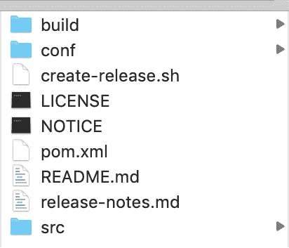
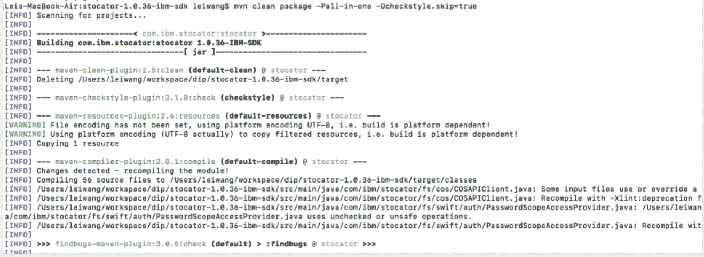
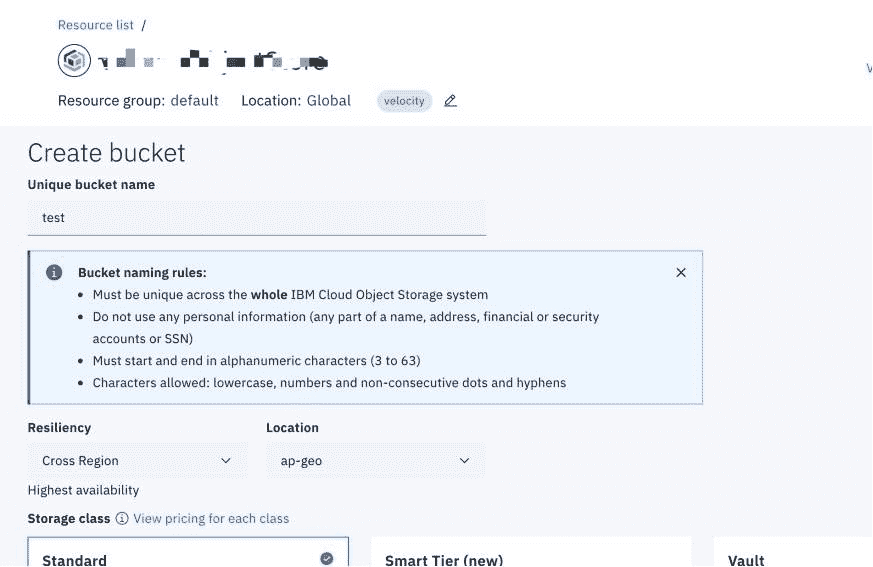

# Hadoop 中使用 Cloud Object Storage 作为外部存储引擎

> 原文：[`developer.ibm.com/zh/articles/ba-lo-hadoop-cloud-object-storage/`](https://developer.ibm.com/zh/articles/ba-lo-hadoop-cloud-object-storage/)

## 技术背景介绍

### 什么是 HDFS

Hadoop 分布式文件系统（HDFS）是指被设计成适合运行在通用硬件（commodity hardware）上的分布式文件系统（Distributed File System）。

不难理解，HDFS 是一个文件系统，被用于文件的存储。其分布式的特色是由各种服务器联合起来，各个服务器又有自己的角色，从而实现其各种各样的功能。

在 HDFS 集群中，角色可以分成两种：NameNode 和 DataNode，他们共同构成了 master-worker 模式。其中，NameNode 负责构建命名空间，管理整个文件系统的元数据，DataNode 负责管理文件数据模块，存储数据和读写。

### Cloud Object Storage 及 HDFS 的优缺点

Cloud Object Storage 非常适合对象，例如照片，Word 文档和视频。

*   **HDFS 的可扩展性**：NameNode 的架构使得 HDFS 在集群扩展性上有潜在问题。HDFS 将计算能力和存储在同一节点上一起运行。当我们需要添加更多的存储空间时，还必然要添加额外的计算能力，也就是说，计算能力和存储需要同步扩展的特性使得很难在特定时间内立刻扩大集群。Cloud Object Storage 却能改变这一切，只需要随着需求添加存储节点，计算能力仍然可以保持不变。
*   **成本降低**：出于数据保护，HDFS 会为每个数据集提供 3 个副本。单单是这样就意味着存储的代价会很大。加上因为无法确定存储量只能进行估算，使用 HDFS 的存储成本相对是很高的。而使用 Cloud Object Storage 的另一个显著好处就是存储成本大大降低。不需要通过猜测来估算数据的存储量，一切可以根据实际的情况进行动态的调节，而弹性的存储机制是 HDFS 所不能实现的。同样是保护数据，Cloud Object Storage 的擦除编码（erasure coding）更是减少需要额外存储的数据数量。
*   **计算能力与存储分离**：Cloud Object Storage 的引入将存储分离出来。多个集群直接访问数据而无需移动数据，集群的变更也将变得更加轻松。
*   **消除主节点故障时的不可用**：Hadoop 具有一个主节点和许多个从节点，所有的数据信息都在主节点上，从节点处理数据并将结果发送到主节点。这也就意味着，主节点必须保持高可用性。因为主节点一旦出现问题，实际上就约等于是整个集群目前无法使用。Cloud Object Storage 与 HDFS 的区别就在于对主节点的依赖上，因为所有在主节点上的数据都可以移动并存储在 Cloud Object Storage 的任何位置上，而且在不损失性能的情况下进行全局复制。这就意味着，在主节点发生故障的时候，从节点可以很快的成为主节点。

然而，Cloud Object Storage 并不是完美无缺的，超大型数据集的交互，高带宽，复杂的分析，这些场景中 HDFS 的优势相对突出。

*   **会面临更大的请求延迟**：与 HDFS 相比，Cloud Object Storage 通常具有更大的请求往返延迟。尤其是对每个请求的延迟都很敏感情况，这个问题会更加严重，例如请求大量小型文件。
*   **不支持文件增量更新**：在 Cloud Object Storage 中，对象是不可变的。也就是说，我们无法对存储对象进行增量的更新。对象被存储后，整个都无法改变。但也并不是说完全无法实现增量更新。实际上，我们可以使用所需更新重写对象，覆盖对象，从而实现增量更新。

## 配置 hadoop S3/COS 存储

### 基于 Stocator 的 COS 存储配置

Stocator 是由 IBM 提供的一个 Apache Hadoop Storage 的存储连接器，支持 IBM Cloud Object Storage、OpenStack Swift 等存储器的连接。在本文中，我们只关注连接 IBM Cloud Object Storage 作为外部存储器的场景。

作为一个 Apache Hadoop 生态系统下的第三方存储连接器，我们需要先下载 Stocator 的源码到我们的工作电脑下。需要额外指出的是，我们需要选取 IBM 的版本来支持 IBM Cloud Object Storage 的连接。这里我选用的是 1.0.36-ibm-sdk 版本。

##### 图 1\. 下载完源码后的工程路径



进入到相应的工作路径下，执行编译命令生成我们需要的目标 jar 包。

```
mvn clean package -Pall-in-one -Dcheckstyle.skip=true 
```

##### 图 2\. 打包编译 stocator



在命令执行成功后，我们可以在 target 路径下找到我们的目标文件 stocator-1.0.36-jar-with-dependencies.jar。需要指出的是，这里采用 -pall-in-one 的模式意味着在生成的 jar 包中，所有的依赖库变会同时打包进来，这样后续在 Hadoop 中运行的时候不需要外部其他依赖包的支持。我们需要把这个 jar 包放置到 Hadoop 集群下的 hive 相应的 library 路径下。

#### 配置 Hadoop 的 Cloud Object Storage 连接器 Stocator

这里假定我们已经直接申请好了 Cloud Object Storage，具体申请办法可以查看 Cloud Object Storage 的站点，这里不再详述。Stocator 在 Hadoop 中可以直接配置 cos://协议，协议的格式为

```
cos://<bucket>.<service>/object(s) 
```

这里需要指出的是 bucket 是我们在 Cloud Object Storage 中分配的 bucket，service 是 Cloud Object Storage 的服务实例，最后的 objects 是具体的数据存储路径，可以是多级路径的组合。

找到你的 Cloud Object Storage 的 Credential 页面，在里面定位到你的 bucket 访问的相关权限信息，我们需要在 Hadoop 的 Ambari 页面里做相关的配置。

##### 图 3\. Cloud Object Storage Credential 信息


##### 图 4\. Hadoop 基于 stocator 的配置


在配置完 Hadoop 的 conf/core-site.xml 后，系统会提示需要重新启动 hdfs 服务，按照提示的步骤重启全部需要重启的服务。

在工程实际使用中，我们发现在 Hive 里建立好基于 cos location 的 external table 后，表的创建和查询都没有问题，但是当我们尝试往表中插入数据的时候，会报错。原因是因为 Hive 在执行插入操作时使用的是 tez 来执行 mr 翻译插入语句后的操作，所以我们需要把 stocator-1.0.36-jar-with-dependencies.jar 这个包放入到 tez 包中，tez 的包在 Hadoop 服务器上是以 gz 包的形式存在的，我们需要把 tez 包解压后，放入 stocator 包后再次使用。

因为本身在 Hadoop 生态环境下，stocator 是作为第三方的工具包来提供的，所以在使用到 Hive，Spark 等其他服务时，都需要做类似的操作，把 stocator 包引导到相关的工具库下面，所以我们在技术调研时引入了下面一种做法，使用 Hadoop 生态环境下自带的 hadoop-aws 包。

### 基于 hadoop-aws 的 COS 存储配置

因为 Hadoop 自带了 hadoop-aws.jar 包，所以我们并不需要额外的引入第三方的工具包。同时因为 hadoop-aws 是支持的 S3 协议，而本身 Cloud Object Storage 是一款 S3 产品，所以我们可以直接进行 Hadoop 的配置。

在 Hadoop 中可以使用 cos://协议，协议的格式为

```
cos://<bucket>/object(s) 
```

可以看出与 stocator 的区别是在这里我们不能额外指定<service>，与上文的协议不同。</service>

在 Cloud Object Storage 中我们需要重新生成一个基于 hmac 的 credential，这个是作为外部基于 S3 协议访问这个 bucket 所需要的权鉴信息。

##### 图 5\. Cloud Object Storage hmac Credential 信息


##### 图 6\. Hadoop 基于 hadoop-aws 的配置


在配置完成后，系统会提示我们部分服务需要重启，按照系统引导重启相关服务后，我们就可以在 Hive 里做相关的操作了。

## COS 关联到 Hive 的实战操作

在 COS 服务中创建一个新的 bucket，如下图：

##### 图 7\. COS 创建 bucket



在 COS 的 bucket 中可以直接使用浏览器打开对应的 bucket 站点，上传和下载数据。

##### 图 8\. Bucket 数据管理


我们在 hive 中创建一张 external table，同时只需要额外指定 location 的地址为上文中提到的 cos 地址即可。

```
CREATE EXTERNAL TABLE `test`(   
   `id` string,                               
   `name` string)
ROW FORMAT DELIMITED FIELDS TERMINATED BY ',' LINES TERMINATED BY '\n'
STORED AS TEXTFILE LOCATION 'cos://test/adam/test'; 
```

在 external table 中插入一条数据

```
INSERT INTO test (id, name) VALUES (`1`, `ABC`); 
```

执行完成后，可以通过查询语句确认数据在 hive 中是否已插入成功。

```
SELECT * from test; 
```

同时可以返回到浏览器的 bucket 页面中确认相应的数据已经被插入到 COS 中。

## 总结

本文对比分析了 HDFS 和 CLoud Object Storage 在各方面的差异与优劣，并详细介绍了如何在 Hadoop 中引入并使用 Cloud Object Storage 作为外部存储引擎。