# 多元线性回归建立 PM2.5 预测模型

> 原文：[`developer.ibm.com/zh/articles/ba-lo-ml-multiple-linear-regression/`](https://developer.ibm.com/zh/articles/ba-lo-ml-multiple-linear-regression/)

## 概述

线性回归是机器学习的最基本算法，本文向读者介绍多元线性回归的原理和使用，以及如何通过 python 语言来实现梯度下降、解析解方式算法。很多人认为，线性回归太过于简单，解决不了实际问题。但事实上，在大家熟知的经济学领域，很多模型都是线性回归模型，比如宏观经济学基石之一 IS(投资-储蓄)-LM（流动性偏好-货币供给）模型[1]。这些模型的结果深刻的影响着政府的经济决策，进而影响我们生活的方方面面。本文以与大家生活息息相关的空气质量预测为例构，造出一个预测模型。通过建模过程，介绍了机器学习的基本概念，如线性回归、解析解和梯度下降算法。本文可以作为机器学习甚至是深度学习的入门文章。

## 本文应用场景

近年来，我国国民经济的飞速增长，伴随经济快速发展带来的各种环境问题也逐渐暴露出来，环境污染问题日益严重。空气中 PM2.5 浓度高时会对人类的身体健康构成严重的危害。中国各大城市均已经建立起对 PM2.5 数据的监测和通报机制，能否对其有效预测及防护已成为当前气象科学领域的研究热点。本文利用多元线性回归方法，对所在城市深圳近年来的雾霾天气的影响因子 PM2.5 浓度进行研究并建立更有效的预测模型。

## 多元线性回归

**回归分析**是一种预测性的建模技术，它研究的是因变量（目标）和自变量（预测器）之间的关系。这种技术通常用于预测分析，发现变量之间的因果关系，通常使用曲线来拟合数据。 求解最佳曲线参数时，需要一个标准来对结果进行衡量，为此我们需要定量化一个目标函数式，使得计算机可以在求解过程中不断地优化。针对任何模型求解问题，最终都是可以得到一组预测值 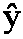，对比已有的真实值 y ，数据行数为 n ，可以将**损失函数**定义如下：

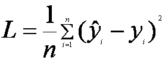

即预测值与真实值之间的平均的平方距离，统计中一般称其为 MAE(mean square error) ——均方误差。把之前的函数式代入损失函数，并且将需要求解的参数 w 和 b 看做是函数 L 的自变量，可得：

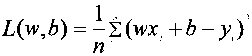

现在的任务是求解最小化 L 时 w 和 b 的值，即核心目标优化式为

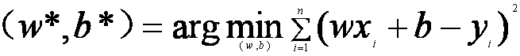

**线性回归**是回归问题中的一种，线性回归假设目标值与特征之间线性相关，即满足一个多元一次方程。通过构建损失函数，来求解损失函数最小时的参数 w 和 b 。通常我们可以表达成如下公式：

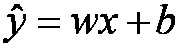

 为预测值，自变量 x 和因变量 y 是已知的，而我们想实现的是预测新增一个 x，其对应的 y 是多少。因此，为了构建这个函数关系，目标是通过已知数据点，求解线性模型中 w 和 b 两个参数。

多元线性回归，是线性回归的一种，是研究一个因变量依赖两个或两个以上自变量而变化的数学回归模型。描述因变量 Y 如何依赖于自变量 X[1]，X[2]，X[3]…X[n] 的方程称为多元回归模型。其一般形式可表示为，Y=A[0]+A[1]X[1]+A[2]X[2]+A[3]X[3]+…A[n]X[n] 其中 A[0]，A[1]，A[2]…，A[n] 是模型的参数，ε 为误差项。我们将 Y 对应为 PM2.5 的预测值，自变量，X[1]，X[2]，X[3]…X[n]，对应为 PM10，SO[2]，CO，NO[2]，O[3]，等的浓度值，并通过最小二乘法估计来得到各个回归系数，则可通过上述公式计算和预测 Y 的值了。对于线性回归、最小二乘法估计的介绍见参考资料 1，这里不再重复。

线性回归模型看上去很简单，简单到让不少人觉得它并没有什么研究和使用的价值。其实并不是这样的，线性回归可以说是最重要的数学模型之一，其他很多模型都建立在它的基础之上。为了更好地理解这一点，让我们先来看一个有关数学家的笑话：

一天，数学家觉得自己已受够了数学，于是他跑到消防队去宣布他想当消防员。消防队长说：“您看上去不错，可是我得先给您一个测试”。消防队长带数学家到消防队后院小巷，巷子里有一个货栈、一只消防栓和一卷软管。消防队长问：“假设货栈起火，您怎么办”？数学家回答：“我把消防栓接到软管上，打开水龙，把火浇灭”。消防队长说：“完全正确！最后一个问题：假设您走进小巷，而货栈没有起火，您怎么办”？数学家疑惑地思索了半天，终于答道：“我就把货栈点着”。消防队长大叫起来：“什么？太可怕了！您为什么要把货栈点着”？数学家回答：“这样我就把问题化简为一个我已经解决过的问题了”。

搭建模型的思路和笑话中数学家的思路一样。当遇到一个新问题时，总是考虑通过某种数学上的变换，将未知问题转化为已知模型能解决的问题。所以任何一个复杂模型，一层层拨开来，里面可能藏着好多个线性回归模型。因此，线性回归模型很有研究的必要。深入了解它的模型细节能帮助我们理解其他模型，进而指引我们根据实际场景搭建有效的模型。

## 求解多元线性回归

在参考资料 1 中，介绍了梯度下降法，并结合最小二乘法，来估计各回归系数。

通过最小二乘法，我知道通过这个函数对所有样本进行计算，得到一个误差 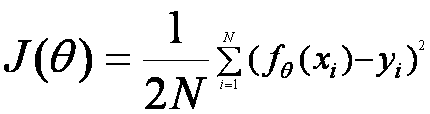，这个误差也称为损失函数。我们要让这个误差尽量最小才能得到模型公式最好的一组参数，也就是求 minJ([θ])。

对于求解多元线性回归通常有 2 种方法：

*   解析解求解
*   梯度下降法求解

有同学可能会问，既然已经有解析解的方法可以求得精确解，为什么还要用梯度下降法求近似解呢？我认为主要有三点：

1.  解析解存在是有前提的，这有个前提是 x 和 y 服从联合正态分布。如果不是联合正态分布，那么这个解析解就不是精确的。实际中 x 和 y 的分布有可能不知道或者太复杂，不能化简一步得到解析解，所以还是要靠梯度下降法的循环算法去逼近最优解。
2.  用解析解求精确解是需要求矩阵乘积和矩阵逆的，当数据量大时这个计算量是比较耗时的。而采用梯度下降法会快很多。
3.  梯度下降法是线上算法（online）。有新数据进入的时候，不需要重新计算，而精确的矩阵求解是做不到线上算法的。

### 解析解求解法

解析解就是指通过公式就可以求得方程的解。我们只需要将方程的参数带入到公式中，计算公式结果就可以得到方程的解。

求一个函数在某一点上的导数，就是求在这个函数的图像上，过这一点所做切线的斜率。这一点的导函数就是切线的函数。一个二次函数的图像是一个抛物线，则通过图像的顶点所做的切线是一条与 x 轴平行的直线，此时这条直线的斜率为 0。

所以，我们可以通过对最小二乘函数求导，导函数为 0 时的解，就是最小二乘函数的解。求导过程如下：

首先对最小二乘进行变形，变为矩阵表达形式：

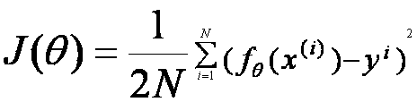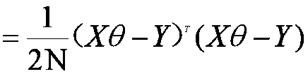，将矩阵乘法展开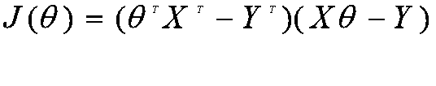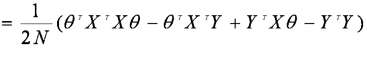，我们对最小二乘函数求导，并令其为 0，则

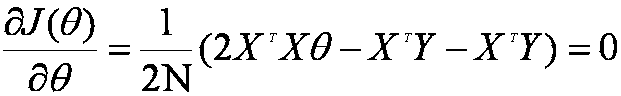，X^TXθ=X^TY，所以最终可以导出：θ=(X^TX)^(-1)X^TY。

### 梯度下降法求解

梯度下降是迭代法的一种，可以用于求解最小二乘问题（线性和非线性都可以）。在求解机器学习算法的模型参数，即无约束优化问题时，梯度下降（Gradient Descent）是最常采用的方法之一。 梯度下降就是让梯度中所有偏导函数都下降到最低点的过程。都下降到最低点了，最优解就得到了，所以他是解决函数最优化问题的算法。

fθ=θ[0]+θ[1]X[1]+θ[2]X[2]+…+θ[n]X[n]，为了便于写成矩阵向量形式，定义 X[0]=1

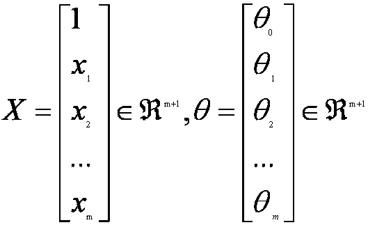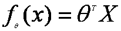

回归系数，按照梯度下降法进行迭代，梯度方向就是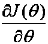，进行迭代，其中 α 是学习步长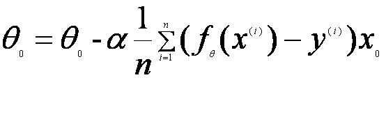，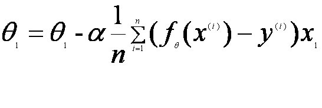 …… 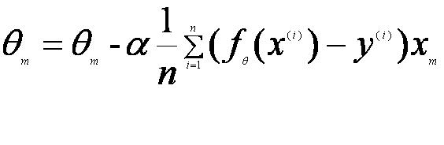

## 建立多元线性回归模型

空气质量的监测数据，可以从 `https://www.aqistudy.cn` 网站免费获取，该网站提供月度还有每天的历史数据，基本涵盖了全国各大城市。我们来看如下表 1 中的一部分空气质量的样本数据：

##### 表 1\. 空气质量部分数据样本

| 月份 | PM2.5 | PM10 | SO2 | CO | NO2 | O3 |
| --- | --- | --- | --- | --- | --- | --- |
| 2013 年 12 月 | 77 | 109 | 19 | 1.433 | 51 | 87 |
| 2014 年 1 月 | 60 | 90 | 14 | 1.248 | 42 | 96 |
| 2014 年 2 月 | 31 | 45 | 7 | 1.157 | 30 | 63 |
| 2014 年 3 月 | 37 | 61 | 8 | 0.919 | 37 | 64 |
| 2014 年 4 月 | 32 | 53 | 8 | 0.92 | 34 | 81 |
| 2014 年 5 月 | 17 | 32 | 6 | 0.874 | 28 | 51 |
| 2014 年 6 月 | 20 | 42 | 6 | 0.943 | 26 | 61 |
| 2014 年 7 月 | 20 | 43 | 7 | 1.097 | 27 | 70 |

其中 PM10、SO[2]、CO、NO[2]、O[3] 是自变量，我们求出，他们与 PM2.5 之间的线性回归模型。

首先我们打印出，2013 年 12 月到 2020 年 3 月深圳市月度空气质量数据散点图，如下图：

##### 图 1\. 空气质量部分数据样本散点图本

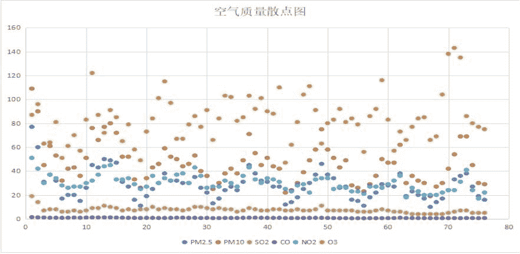

大家可以大略看出，其自变量与 PM2.5 变化趋同，说明其具有比较明显的线性关系，可以考虑采用多元线性回归来建立模型。将整个数据划分为训练数据集，和验证数据集。

## 模型代码的实现

对于梯度下降法，在很多库中已经有现成的算法调用了，但这里为了让大家更好的理解算法，我们采用 python 来重新实现这些算法并求解。

首先读取数据文件中的文件构建矩阵：

```
def transCvsToMarix(url):
    csv_data = pd.read_excel(url)
    csv_df = pd.DataFrame(csv_data)
    for i in range(train_datalen):
        y_real[i]=csv_df['PM2.5'].values[i]
        x[i,0]=1
        x[i,1]=csv_df['PM10'].values[i]
        x[i,2]=csv_df['SO2'].values[i]
        x[i,3]=csv_df['CO'].values[i]
        x[i,4]=csv_df['NO2'].values[i]
        x[i,5]=csv_df['O3_8h'].values[i]
        for t in range(5):
            x1[i,t]=x[i,t+1] 
```

### 解析解的方式实现

这里我应用了 python 的 sympy 库，可以直接进行矩阵运算，按照上述的求解公式 θ=(X^TX)^(-1)X^TY，可以直接转为代码：

```
def slov1(x,y):
        wt=(x.T*x)**(-1)*x.T*y_real
        loss=(x*wt-y).T*(x*wt-y)/2/m #损失函数
        return wt 
```

求解结果：

[[-3.96384478855105], [0.573233683943103], [-0.595234311461483], [13.6517705986401], [-0.104872864785132], [0.0135836026637196]]

所以，其回归方方程定义为：

PM2.5=-3.96384478855105+0.573233683943103*PM10-0.595234311461483*SO[2]+13.6517705986401*CO-0.104872864785132*NO[2]+0.0135836026637196*O[3]_8h

也可以应用 sklearn 直接通过线性回归函数来求解：

```
 from sklearn.linear_model import LinearRegression
    lin_reg=LinearRegression() #创建线性回归对象
       lin_reg.fit(x,y)  #拟合训练数据
       print("斜率  %f  截距 %",lin_reg.coef_,lin_reg.intercept_) 
```

斜率 [[ 5.73233684e-01 -5.95234311e-01 1.36517706e+01 -1.04872865e-01 1.35836027e-02]] ，截距 [-3.96384479]

注意：这里的截距就是对应的回归系数 θ[0]，而斜率分别对应 PM10、SO[2]、CO、NO[2]、O[3] 8h 的斜率。

大家可以看到，采用 sklearn 库直接求解的与采用解析解的方式求解的结果是一致的。

### 梯度求解的方式

```
def bgd(x, y, step_size, max_iteration_count):
       w=sp.zeros(6,1) #回归系数矩阵
       err=0.0   #方差
       iteration_count=0  #迭代次数
       while iteration_count<max_iteration_count:
           sum=0.0
           for i in range(len(w)):
               for t in range(train_datalen): #训练数据数
                   s=(x.row(t)*w)[0,0]-y[t]
                   xi=x[t,i]
                   sum+=s*xi
               sum=sum/train_datalen
               w[i]-=step_size*sum
           iteration_count+=1
           print(iteration_count)
           loss = x * w - y
           loss = loss.T * loss
           err=loss[0,0]/2/train_datalen
           print(err)
           print(w)
           if err<5.0:
               break; 
```

梯度法求解，进行 50 次迭代，可以发现值基本已经收敛，但步长对收敛过程有明显影响，见下面图 2。

##### 图 2.不同步长收敛图

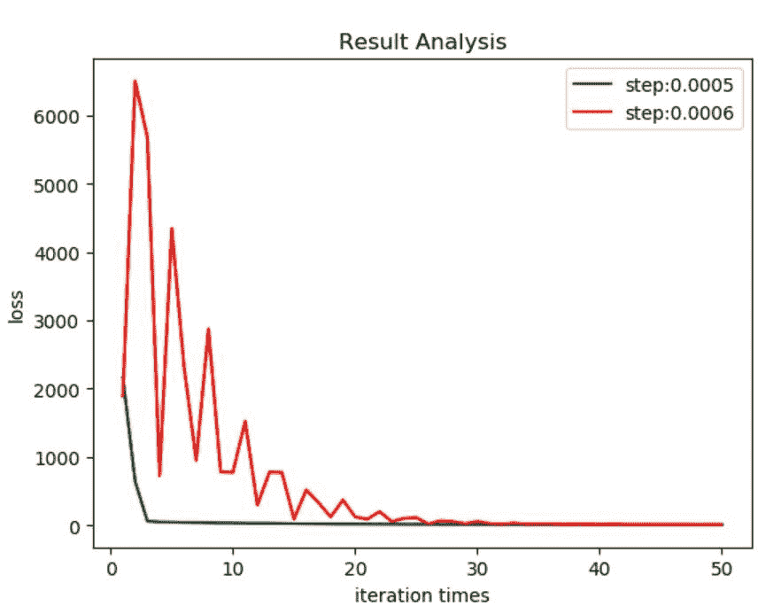

当初始值选择相同的情况下，本实验中是选择的全 1 向量。但选择 2 种不同的步长，当步长设置为 0.0005，非常平滑的下降，但 0.0006，出现震荡的现象。 迭代选择步长是 0.0005 损失函数值：7.95533008693924 回归系数向量：([[0.938845951839946], [0.436138624729377], [0.819141297981708], [0.976240675570618], [0.0109151621855139], [0.000912714284430623]])

迭代选择步长是 0.0006 损失函数值：8.03839230941155 回归系数向量：([[0.931413387690367], [0.478761169261735], [0.799729317658093], [0.973956555356711], [-0.0475522411567956], [0.00947965257111970]])

##### 图 3\. 小幅增加步长后的迭代收敛图

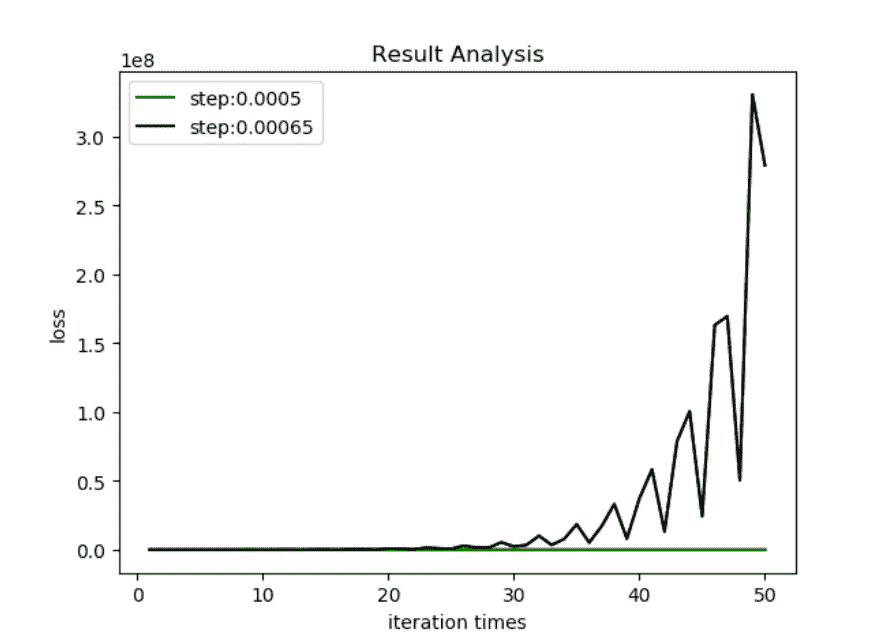

当把步长设置 0.00065 时，则经过 50 次迭代后，发现其会不仅没有收敛反而逐渐的快速增长。

因此，在使用梯度下降法的时候，需要对迭代步长进行选择和调整，找到较为适合的步长和初始值。

## 模型验证

我们分别用解析求解法和梯度求解法来对 2020 年 3 月至 2019 年 3 月，1 年的数据进行回归验证，数据样本如下表 2：

##### 表 2\. 验证样本数据

| 月份 | AQI | 范围 | 质量等级 | PM2.5 | PM10 | SO2 | CO | NO2 | O3 |
| --- | --- | --- | --- | --- | --- | --- | --- | --- | --- |
| 2019 年 3 月 | 46 | 29~75 | 优 | 23 | 36 | 4 | 0.655 | 26 | 77 |
| 2019 年 4 月 | 46I | 22~102 | 优 | 20 | 32 | 4 | 0.577 | 23 | 84 |
| 2019 年 5 月 | 46 | 24~98 | 优 | 17 | 30 | 4 | 0.574 | 20 | 85 |
| 2019 年 6 月 | 38 | 20~110 | 优 | 10 | 19 | 4 | 0.533 | 20 | 66 |
| 2019 年 7 月 | 40 | 21~150 | 优 | 14 | 27 | 4 | 0.535 | 20 | 69 |
| 2019 年 8 月 | 61 | 23~176 | 良 | 17 | 30 | 4 | 0.574 | 22 | 104 |
| 2019 年 9 月 | 86 | 19~169 | 良 | 24 | 42 | 5 | 0.58 | 24 | 138 |
| 2019 年 10 月 | 88 | 45~180 | 良 | 33 | 54 | 6 | 0.677 | 24 | 143 |
| 2019 年 11 月 | 81 | 41~110 | 良 | 36 | 69 | 7 | 0.6 | 31 | 135 |
| 2019 年 12 月 | 62 | 46~93 | 良 | 38 | 69 | 7 | 0.7 | 41 | 86 |
| 2020 年 1 月 | 47 | 19~67 | 优 | 27 | 45 | 5 | 0.674 | 24 | 80 |
| 2020 年 2 月 | 41 | 24~75 | 优 | 19 | 30 | 5 | 0.552 | 17 | 77 |
| 2020 年 3 月 | 37 | 29~45 | 优 | 18 | 30 | 5 | 0.622 | 21 | 71 |

##### 图 4\. 验证结果

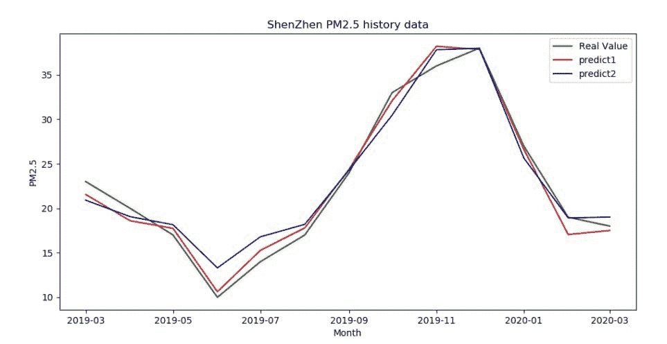

从图像看，整体的线下回归拟合情况良好。其中，采用解析解回归系数 predict1，得出的损失函数值 0.663517082706947；梯度下降法，损失函数值 1.51616721486133。解析解的预测精度显然更高。

## 结束语

前面已经提到，解析解方案有其局限性，而梯度下降，求解更为通用。从实际模型数据验证来看，解析解的精确度确实比较梯度下降法要高。

不例外，梯度算法也是有缺点的，如靠近极小值时收敛速度减慢、直线搜索时可能会产生一些问题、可能会“之字形”地下降等，另外下降或上升步长的选择也会影响最后得到的回归系数，我们需要通过调整一些初始值与步长参数来测试回归的效果。

实际真正的空气质量监控数据种类，远远比我现在提供的自变量数据要多，但经过分析后，对数据进行预处理，剔除掉数据中的无效部分，最终保留上述数据项作为特征因子。

在搭建模型的过程中，为了提高预测的准确度，数据科学家们常常从已知的特征华提取更多新的特征，并以此搭建复杂的模型。特别是随着深度学习这一概念的传播，大家似乎都热衷于使用复杂度更高的模型，即使面对的是很简单的场景。但是模型越复杂，越容易引起过度拟合的问题。一旦发生了过度拟合，模型越复杂，其实错得也就越多。

在大数据时代，我们能获得比以前更多的变量，这给了我们更多的建模选择。在建模实践中，数据科学家们会寻找新的可能与被预测值相关的自变量，并将它们加入模型中。但由于模型训练从本质上讲，只是一些数字的运算。即使将毫不相关的变量放到模型里，也会得到相应的参数估计，而且这个估计值几乎不可能等于 0。这就造成了所谓的模型幻觉，表面上得到了很多变量间的联动效应，但事实上这些效应并不存在，只是由随机变量引起的数字巧合。模型幻觉会造成分析结果，特别是模型参数的不可靠。它不仅会把不存在的效应估计为存在，而且更严重的是，新加入的变量有可能将原本比较正确的估计扭曲为错误，比如将模型中原来变量的正效应估计为负效应（变量对应的参数为正时，称为正效应，否则为负效应）。

在实际应用中，当模型太过简单时，无论训练误差还是测试误差都比较高，模型无法捕捉数据里的复杂关系。而当模型过于复杂是，训练误差小，但测试误差可能很高，这就是过度拟合，与模型太过简单相比，可能过度拟合更加需要提高警惕，因为它具有极强的迷惑性，容易让人误以为模型结果理想。所以，我们需要选择复杂度时候的模型，使得测试误差达到最小。

## 下载资源

*   [空气质量数据.xls（69KB）](https://s3.us.cloud-object-storage.appdomain.cloud/developer/default/articles/ba-lo-ml-multiple-linear-regression/static/air-quality-data.xls)
*   [空气质量数据验证.xls（20KB）](https://s3.us.cloud-object-storage.appdomain.cloud/developer/default/articles/ba-lo-ml-multiple-linear-regression/static/air-quality-data-verification.xls)

## 参考资料

*   [机器学习代码实战：使用线性回归检测水泥质量](https://developer.ibm.com/zh/articles/ba-lo-machine-learning-cement-quality/)
*   [梯度下降与随机梯度下降概念及推导过程](https://blog.csdn.net/weixin_39445556/article/details/83661219)
*   唐亘.《精通数据科学：从线性回归到深度学习》.北京：人民邮电出版社，2018:63