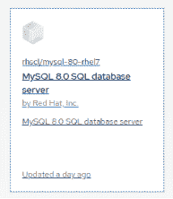
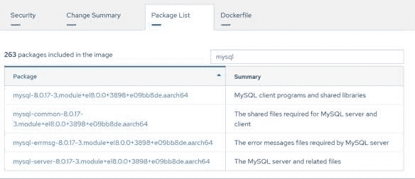
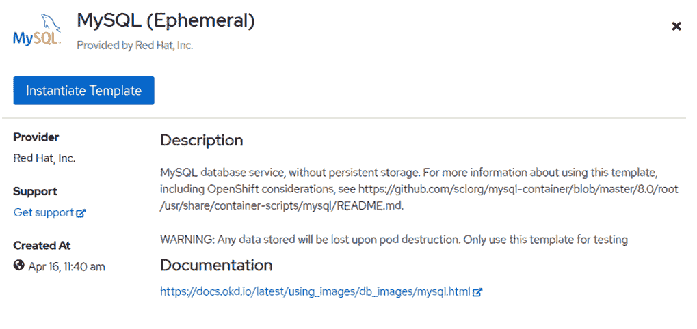
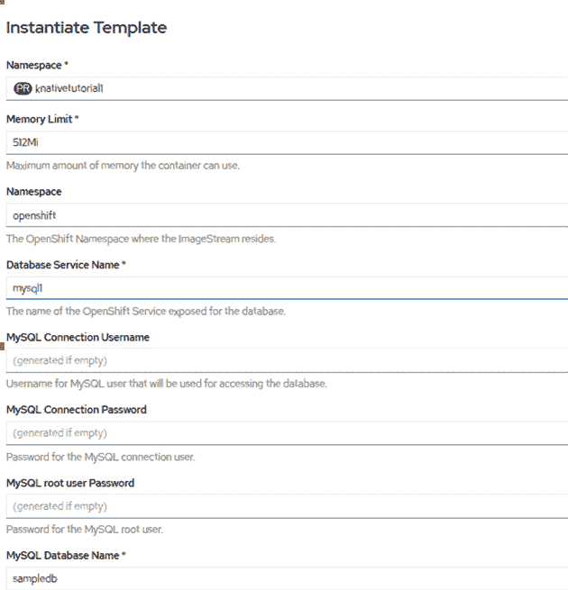
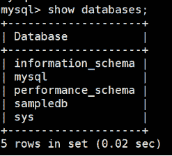
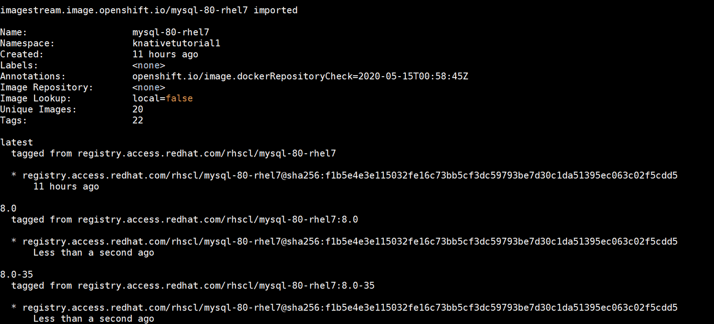
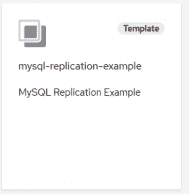
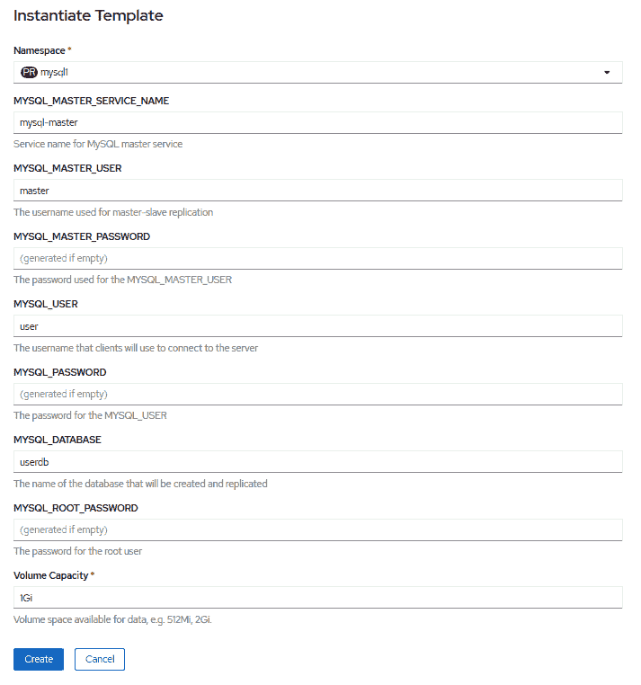
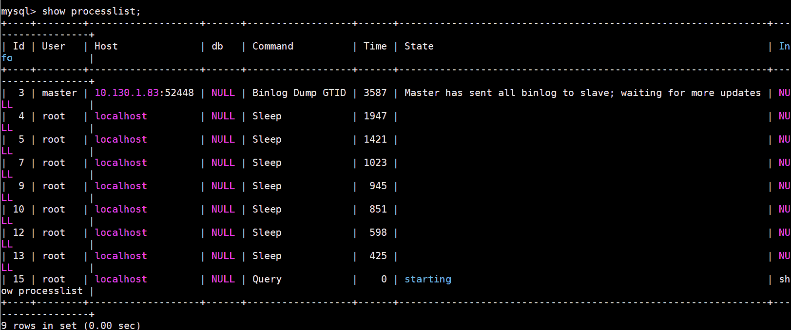

# MySQL 复制技术以及容器化探究

> 原文：[`developer.ibm.com/zh/articles/cl-lo-mysql-replication-technology-and-containerization/`](https://developer.ibm.com/zh/articles/cl-lo-mysql-replication-technology-and-containerization/)

## MySQL 的复制技术

随着容器的发展，越来越多的前端应用向容器云迁移。那么，MySQL 作为轻量级数据库，是否支持容器化呢？容器复制在容器云上如何实现呢？接下来，我们介绍在 OpenShift 上如何运行 MySQL。

MySQL 有多重复制技术，广为使用的模式主要有三种：

*   主备复制：在这种模式中主备实例的复制是异步复制，主实例可读写，备实例可读。从库起 IO 线程连接主库，获取主库二进制日志写到本地中继日志，并更新 master-info 文件（存放主库相关信息），从库再利用 SQL 线程执行中继日志。
*   半同步复制在第一种主从复制的基础上、利用插件完成半同步复制。传统的主从复制，不管从库是否正确获取到二进制日志，主库不断更新。而半同步复制则当确认了从库把二进制日志写入中继日志才会允许提交，如果从库迟迟不返回 ack，主库会自动将半同步复制状态取消，进入最基本的主从复制模式。
*   组复制 (MySQL Group Replication，简称 MGR)。MGR 是 MySQL 官方于 2016 年 12 月推出的一个全新的高可用与高扩展的解决方案。MGR 是 MySQL 官方在 5.7.17 版本引进的一个数据库高可用与高扩展的解决方案。MGR 在原生复制技术之上引入分布式强一致性协议 Paxos，以插件的方式提供。官方还基于 MGR 推出了 MySQL InnoDB Cluster 为 MySQL 提供了完整的高可用性解决方案。

接下来，我们介绍如何 OpenShift 实现 MySQL 容器化部署、定制化部署和主备复制模式部署。

## OpenShift 上运行 MySQL

红帽 OpenShift 提供 MySQL 的容器化镜像，可以看到最新的是 MySQL 8.0。如下图 1 所示，第一个镜像基于 RHEL7，第二个镜像基于 RHEL8。

**图 1\. 红帽提供的 MySQL 容器镜像**

 

我们查看第一个 rhel8/mysql-80 镜像的部分 dockerfile 内容，如清单 1 所示：

**清单 1\. rhel8/mysql-80 镜像部分 dockerfile**

```
FROM ubi8/s2i-core:rhel8.2

ENV MYSQL_VERSION=8.0 \
    APP_DATA=/opt/app-root/src \
    HOME=/var/lib/mysql
RUN yum -y module enable mysql:$MYSQL_VERSION && \
    INSTALL_PKGS="policycoreutils rsync tar gettext hostname bind-utils groff-base mysql-server" && \
    yum install -y --setopt=tsflags=nodocs $INSTALL_PKGS && \
    rpm -V $INSTALL_PKGS && \
    yum -y clean all --enablerepo='*' && \
    mkdir -p /var/lib/mysql/data && chown -R mysql.0 /var/lib/mysql && \
test "$(id mysql)" = "uid=27(mysql) gid=27(mysql) groups=27(mysql)"
COPY 8.0/root-common /
COPY 8.0/s2i-common/bin/ $STI_SCRIPTS_PATH
COPY 8.0/root / 
```

从清单 1 内容我们可以看出，该镜像基于红帽 RHEL8.2 的 UBI，并且具备 S2I 的能力。我们查看容器镜像的 package list，如下图 2 所示，我们可以看到 MySQL 的版本是 8.0.17：

**图 2\. rhel8/mysql-80 的 package list**



### 以最简单的方式运行 MySQL 容器镜像

使用红帽提供的 MySQL 镜像，最简单的方法是使用 podman 直接运行（实验的时候，我们使用基于 rhel7 的 mysql8 镜像）：

```
podman run -d --nam mysql_database -e MYSQL_USER=user -e MYSQL_PASSWORD=pass -e MYSQL_DATABASE=db -p 3306:3306 rhscl/mysql-80-rhel7 
```

查看运行的 mysql 容器，如下图 3 所示：

**图 3\. 运行的 MySQL 容器镜像**


使用 podman 直接运行 MySQL 容器镜像，在生产上这样做显然是不合适的。我们可以通过 MySQL 的模板在 OpenShift 上进行部署。

### 以模板的方式运行 MySQL 容器镜像

在 OpenShift 中查看 MySQL 模板，如下图 4 所示：

**图 4\. 使用 MySQL 模板**



使用模板传递参数，如下图 5 所示：

**图 5\. 通过模板传递参数**



通过模板创建成功后，可以查看 pod：

```
# oc get pods |grep -i mysql1
mysql1-1-4mkc4                         1/1     Running            0          37m 
```

登录 MySQL pod 查看数据库，如下图 6 所示：

```
#oc rsh mysql1-1-4mkc4
sh-4.2$  mysql -u root 
```

**图 6\. 查看数据库**



通过模板方式部署 MySQL 很方便，可以传递参数。但这种方法无法定制化部署 MySQL。接下来，我们介绍通过 S2I 的方式在 OpenShift 中部署 MySQL。

### S2I 方式定制化部署 MySQL

接下来，我们展示通过 S2I builder image 的方式进行定制化。builder image 就是本文开头展示的 mysql8.0 镜像。在部署时，我们指定源码地址：`https://github.com/sclorg/mysql-container.git`。

首先导入红帽 mysql 容器镜像的 ImageStrea，以便后续使用。

```
oc import-image rhscl/mysql-80-rhel7 --from=registry.access.redhat.com/rhscl/mysql-80-rhel7 --confirm –all -n openshift 
```

ImageStream 导入成功，如下图 7 所示：

**图 7\. ImageStream 导入成功**



查看 openshift 项目中的 mysql ImageStream：

```
# oc get is -n openshift
NAME             IMAGE REPOSITORY   TAGS                                              UPDATED
mysql-80-rhel7                      8.0,8.0-13,8.0-14,8.0-15,8.0-18,8.0-20 + 16 more...   About a minute ago 
```

接下来，利用 image stream、通过 S2I 的方式定制化部署 mysql：

```
 oc new-app mysql-80-rhel7:8.0-15~https://github.com/sclorg/mysql-container.git \
--name my-mysql-rhel7 \
--context-dir=examples/extend-image \
--env MYSQL_OPERATIONS_USER=opuser \
--env MYSQL_OPERATIONS_PASSWORD=oppass \
--env MYSQL_DATABASE=opdb \
--env MYSQL_USER=user \
--env MYSQL_PASSWORD=pass 
```

我们查看上面输入参数 `--context-dir`，即将 `examples/extend-image` 目录对应的内容注入。接下来，我们分析这个目录中所包含的脚本。

查看 github 上源码中 `examples/extend-image` 所包含的四个子目录，如下图 8 所示：

**图 8\. 查看 examples/extend-image 子目录**


接下来，我们分析 4 个目录的内容： `mysql-cfg` 目录下包含文件 `myconfig.cnf`，该文件内容如下：

```
[mysqld] 
stored_program_cache = 524288 
```

启动 MySQL 容器时，myconfig.cnf 将用作 mysqld 守护程序的配置注入。

`mysql-pre-init` 目录中包含两个 Shell 脚本（`80-add-arbitrary-users.sh` 和 `90-init-db.sh`），是在启动 mysqld 守护程序之前执行的。脚本中使用到如下变量：

*   $ {mysql_flags}变量在脚本使用$ {mysql_flags}连接到本地运行的守护进行。
*   $ MYSQL_RUNNING_AS_MASTER 变量在使用 run-mysqld-master 命令运行容器时定义。
*   $ MYSQL_RUNNING_AS_SLAVE 变量，在使用 run-mysqld-slave 命令运行容器时定义。

`80-add-arbitrary-users.sh` 内容如下，该脚本用于创建 MySQL 用户：

**清单 2\. 80-add-arbitrary-users.sh 脚本内容**

```
create_arbitrary_users() { 
 # Do not care what option is compulsory here, just create what is specified 
 log_info "Creating user specified by MYSQL_OPERATIONS_USER (${MYSQL_OPERATIONS_USER}) ..." 
 mysql $mysql_flags <<EOSQL 
 CREATE USER '${MYSQL_OPERATIONS_USER}'@'%' IDENTIFIED BY '${MYSQL_OPERATIONS_PASSWORD}'; 
 EOSQL 
   log_info "Granting privileges to user ${MYSQL_OPERATIONS_USER} for ${MYSQL_DATABASE} ..." 
 mysql $mysql_flags <<EOSQL 
 GRANT ALL ON \`${MYSQL_DATABASE}\`.* TO '${MYSQL_OPERATIONS_USER}'@'%' ; 
 FLUSH PRIVILEGES ; 
 EOSQL 
 } 
   if ! [ -v MYSQL_RUNNING_AS_SLAVE ]; then 
 create_arbitrary_users 
 fi 
```

`90-init-db.sh` 的内容如清单 3 所示，该脚本调用 mysql-data/init.sql 脚本创建数据库。

**清单 3\. 90-init-db.sh 脚本内容**

```
init_arbitrary_database() { 
 local thisdir 
 local init_data_file 
 thisdir=$(dirname ${BASH_SOURCE[0]}) 
 init_data_file=$(readlink -f ${thisdir}/../mysql-data/init.sql) 
 log_info "Initializing the arbitrary database from file ${init_data_file}..." 
 mysql $mysql_flags ${MYSQL_DATABASE} < ${init_data_file} 
 } 
   if ! [ -v MYSQL_RUNNING_AS_SLAVE ] && $MYSQL_DATADIR_FIRST_INIT ; then 
 init_arbitrary_database 
 fi 
```

`mysql-data` 目录中包含 `init.sql`，这是一个创建数据库表 SQL 语句，创建名为 products 的数据库表，并注入数据，该脚本被 `90-init-db.sh` 脚本调用。`init.sql` 脚本内容清单 4 所示：

**清单 4\. init.sql 语句**

```
CREATE TABLE products (id INTEGER, name VARCHAR(256), price FLOAT, variant INTEGER);
CREATE TABLE products_variant (id INTEGER, name VARCHAR(256));
INSERT INTO products_variant (id, name) VALUES ('1', 'blue'), ('2', 'green'); 
```

`mysql-pre-init` 目录中包含脚本 `80-check-arbitrary-users.sh`，这个脚本判断部署 MySQL 时，是否指定参数，如果不指定，则会有提示报错。

**清单 5\. 80-check-arbitrary-users.sh 脚本**

```
check_arbitrary_users() {
  if ! [[ -v MYSQL_OPERATIONS_USER && -v MYSQL_OPERATIONS_PASSWORD && -v MYSQL_DATABASE ]]; then
    echo "You need to specify all these variables: MYSQL_OPERATIONS_USER, MYSQL_OPERATIONS_PASSWORD, and MYSQL_DATABASE"
    return 1
  fi
}

if ! [ -v MYSQL_RUNNING_AS_SLAVE ]; then
  check_arbitrary_users 
```

我们查看部署 MySQL 命令执行结果，pod 部署成功：

```
# oc get pods
NAME                      READY   STATUS      RESTARTS   AGE
my-mysql-rhel7-1-4v9dk    1/1     Running     0          9m24s
my-mysql-rhel7-1-build    0/1     Completed   0          10m
my-mysql-rhel7-1-deploy   0/1     Completed   0          9m28s 
```

查看 pod 部署的部分日志，我们看到在 S2I 源码仓库定义的脚本被执行：

**清单 6\. 查看 MySQL 部署日志**

```
=> sourcing 20-validate-variables.sh ...
=> sourcing 25-validate-replication-variables.sh ...
=> sourcing 30-base-config.sh ...
---> 01:39:10     Processing basic MySQL configuration files ...
=> sourcing 60-replication-config.sh ...
=> sourcing 70-s2i-config.sh ...
---> 01:39:10     Processing additional arbitrary  MySQL configuration provided by s2i ...
=> sourcing 40-paas.cnf ...
=> sourcing 50-my-tuning.cnf ...
=> sourcing myconfig.cnf ...
=> sourcing 80-check-arbitrary-users.sh ...
---> 01:39:10     Initializing database ...
---> 01:39:10     Running /opt/rh/rh-mysql80/root/usr/libexec/mysqld --initialize --datadir=/var/lib/mysql/data
---> 01:39:17     Starting MySQL server with disabled networking ...
---> 01:39:17     Waiting for MySQL to start ...
2020-05-15T01:39:17.779572Z 0 [Warning] [MY-011070] [Server] 'Disabling symbolic links using --skip-symbolic-links (or equivalent) is the default. Consider not using this option as it' is deprecated and will be removed in a future release.
2020-05-15T01:39:17.782325Z 0 [System] [MY-010116] [Server] /opt/rh/rh-mysql80/root/usr/libexec/mysqld (mysqld 8.0.13) starting as process 86

=> sourcing 40-datadir-action.sh ...
---> 01:39:40     Running datadir action: upgrade-warn
---> 01:39:40     MySQL server version check passed, both server and data directory are version 8.0.
=> sourcing 50-passwd-change.sh ...
---> 01:39:40     Setting passwords ...

=> sourcing 80-add-arbitrary-users.sh ...
---> 01:39:41     Creating user specified by MYSQL_OPERATIONS_USER (opuser) ...
---> 01:39:41     Granting privileges to user opuser for opdb ...

=> sourcing 90-init-db.sh ...
---> 01:39:41     Initializing the arbitrary database from file /opt/app-root/src/mysql-data/init.sql...
---> 01:39:41     Shutting down MySQL ... 
```

部署成功后，连接部署的数据库，验证 S2I 注入的数据库脚本是否执行成功：

```
mysql> show databases;
+--------------------+
| Database           |
+--------------------+
| information_schema |
| mysql              |
| opdb               |
| performance_schema |
| sys                |

mysql> use opdb;
Database changed 
```

我们看到，数据库表 products 被自动创建：

```
mysql> show tables;
+------------------+
| Tables_in_opdb   |
+------------------+
| products         |
| products_variant |
+------------------+
2 rows in set (0.02 sec)

mysql> select * from products_variant;
+------+-------+
| id   | name  |
+------+-------+
|    1 | blue  |
|    2 | green |
+------+-------+
2 rows in set (0.00 sec) 
```

从而证明在部署 MySQL 时，S2I 注入的脚本被执行。

通过这种 S2I 的方式，我们可以实现 MySQL 的定制化部署，甚至可以把 MySQL 的复制配置、数据库数据导入的脚本放进去。

### 使用模板部署 MySQL 主备复制

MySQL 主备复制可以通过模板进行部署。github 上有一主一从复制的[模板](https://github.com/sclorg/mysql-container/blob/master/examples/replica/mysql_replica.json)。我们可以基于这个模板进行定制化。

在 OpenShift 中借鉴这个模板部署 MySQL 主备复制，首先创建 MySQL Template：

```
#oc apply -f mysql_replica.json -n openshift
template.template.openshift.io/mysql-replication-example created 

# oc get template
NAME                        DESCRIPTION                 PARAMETERS        OBJECTS
mysql-replication-example   MySQL Replication Example   8 (3 generated)   6 
```

在 OpenShift UI 界面，选择创建的模板，如下图 9 所示：

**图 9\. 选择 MySQL 部署模板**



传递部署 MySQL 的参数，如下图 10 所示：

**图 10\. 使用 MySQL 模板传递参数**



Pod 部署成功如下所示，包含 mysql-master 和 mysql-slave，两个各运行 MySQL 实例，进行主备复制：

```
# oc get pods
NAME                    READY   STATUS      RESTARTS   AGE
mysql-master-1-deploy   0/1     Completed   0          8m16s
mysql-master-1-fdb9l    1/1     Running     5          8m13s
mysql-slave-1-deploy    0/1     Completed   0          8m16s
mysql-slave-1-zqjc5     1/1     Running     5          8m12s 
```

分别查看 Primary 和 Replica pod 的日志，可以看出主备复制关系已经建立。

Primary pod：

```
# oc logs -f mysql-master-1-fdb9l
2020-05-15T06:01:28.281730Z 0 [Note] /opt/rh/rh-mysql57/root/usr/libexec/mysqld: ready for connections.
Version: '5.7.24-log'  socket: '/var/lib/mysql/mysql.sock'  port: 3306  MySQL Community Server (GPL)
2020-05-15T06:01:35.879641Z 3 [Note] Start binlog_dump to master_thread_id(3) slave_server(3672989091), pos(, 4) 
```

Replica pod：

```
# oc logs -f mysql-slave-1-zqjc5mysql-slave-1-zqjc5
2020-05-15T06:01:35.875170Z 2 [Note] Slave I/O thread for channel '': connected to master 'master@mysql-master:3306',replication started in log 'FIRST' at position 4 
```

查看 MySQL 的 Binlog 状态，显示正常，如下图所示 11：

**图 11\. 查看 MySQL Binlog 状态**



至此，我们完成了 MySQL 主备复制在 OpenShift 上的实现。

## 结束语

通过阅读本文，相信读者对在 OpenShift 上部署 MySQL 单实例、通过 S2I 方式定制化部署 MySQL、通过模板方式部署 MySQL 主备复制有了较为深入的理解。读者可通过本文提供的范例，根据实际需求进行定制化。