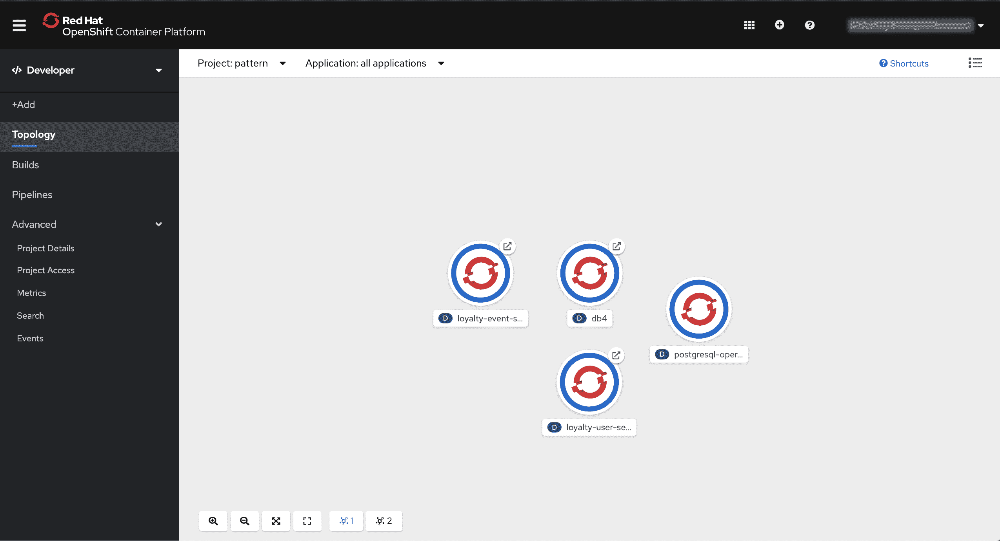
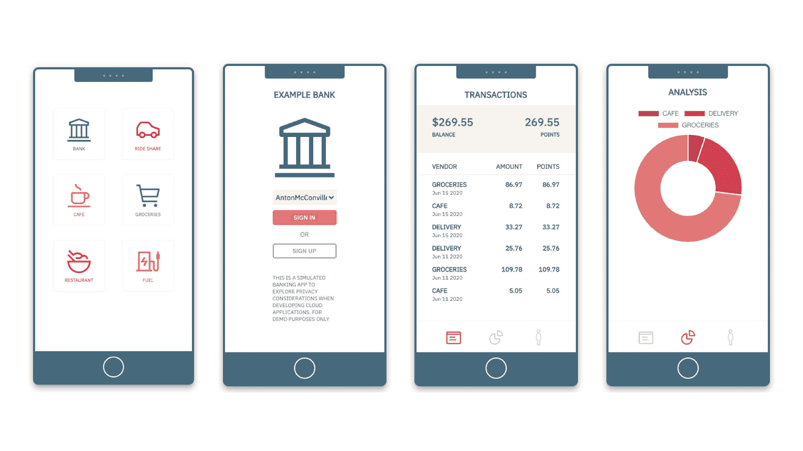

# OpenShift 4 简介

> 原文：[`developer.ibm.com/zh/articles/intro-to-openshift-4/`](https://developer.ibm.com/zh/articles/intro-to-openshift-4/)

Red Hat® OpenShift® 是创建安全的云原生开发环境的关键组件。正如我们去年发表的 [Kubernetes、OpenShift 与 IBM 简史](https://developer.ibm.com/zh/blogs/a-brief-history-of-red-hat-openshift/)博客文章所述，最新版本 OpenShift 4 是目前和未来十年内构建生产就绪应用程序的最佳企业平台。现在，OpenShift 4.3 [可在 IBM Cloud 上使用](https://www.ibm.com/cn-zh/cloud/openshift)。

通过示例信用卡应用程序的镜头了解如何使用 OpenShift 构建安全的公有云应用程序

[阅读系列](https://developer.ibm.com/zh/blogs/build-secure-applications-with-openshift-4-public-cloud/)

在本文中，我将重点介绍我认为 OpenShift 4 中对于构建安全的原生云应用程序最有帮助的一些新功能。下图主要显示了我认为 [OpenShift 4.3](https://docs.openshift.com/container-platform/4.3/release_notes/ocp-4-3-release-notes.html) 中对于企业开发者而言最有价值的一些新功能：

## 新仪表板

OpenShift 4 带来了视觉上焕然一新的的用户界面，更加整洁，更有条理，可以提高用户专注力，减少干扰。Red Hat 将其设计流程实现了开源，这对我很有启发。您可以阅读有关[仪表板设计意图](https://blog.openshift.com/openshift-4-3-dashboard-refinements-and-the-new-project-dashboard/)的更多信息，甚至可以参与到[正在进行的 OpenShift 设计流程](https://www.patternfly.org/v4/) 中。

下面是我们开发的示例银行应用的仪表板截屏，用于探索 OpenShift 4 的一些新功能。

下面是一个很酷的新拓扑视图的截屏，可以直观显示云原生应用的微服务架构，同时也显示了示例银行信用卡应用的已部署组件。

要了解更多信息，可参阅 [OpenShift 4.3 仪表板优化和新设计的项目仪表板](https://blog.openshift.com/openshift-4-3-dashboard-refinements-and-the-new-project-dashboard/)。我认为仪表板可以让我更轻松地浏览和使用 OpenShift 4.3。

## OperatorHub

[Operator Framework](https://github.com/operator-framework) 是一个开源工具包，用于以高效、自动化且可扩展的方式管理 Kubernetes 原生应用程序（称为 *operator*）。OpenShift 4 围绕 Operator 进行了重新架构。Kubernetes 使开发者能够有条不紊地使应用程序容器化，而 Operator 使开发者能够以一致、可重复和可扩展的方式自动管理应用程序相关组件（例如数据库或其他有状态的元素）。

在 OpenShift 4 中除了作为 Kubernetes Fabric 的一部分的 operator，Red Hat 还引入了一个 marketplace，用于查找[可加速应用程序开发的 Operator](https://enterprisersproject.com/article/2019/2/kubernetes-operators-plain-english?page=1)。这个新的 [OperatorHub](https://operatorhub.io/) 也是 OpenShift 的一部分。

要了解更多信息，可查看[玩转 OperatorHub 教程](https://developer.ibm.com/tutorials/operator-hub-openshift-4-operators-ibm-cloud/)。

## OpenShift 服务网格

服务网格可以灌输一致的开发方法，并为服务间通信注入安全性和其他特性。我注意到，这是解决大型应用程序和大型企业中的规模问题与顺序问题的一种可选方法，这些问题在去年的 KubeCon 大会北美演讲中提到过。

OpenShift 4 采用了 [Istio](https://istio.io/)，这是基于 Kubernetes 的系统可选择的一种新型服务网格，它基于该技术构建了自己的服务网格。此外，最新版本的 Istio 提供了许多有用的[安全功能](https://istio.io/docs/concepts/security/)，我们将在新的 Code Pattern 中深入探讨。

查看 Code Pattern [具有 OpenShift 服务网格的微服务](https://developer.ibm.com/patterns/microservices-with-the-openshift-service-mesh/)，以了解用于示例银行应用的部署 OpenShift 服务网格（ 基于 Istio）所需的步骤。

## OpenShift 无服务器计算

由于无服务器计算可以提供云计算的可靠性和规模，因此它越来越吸引开发者的注意。代码通常被编写为小型可执行函数，这种方法有时需要一些横向思维才能取得显著成果。OpenShift 4 通过采用[开源的 Knative 项目](https://knative.dev/)而支持无服务器开发。

阅读我们的 OpenShift 教程[使用 OpenShift Serverless Operator 构建无服务器 Node.js 应用程序](https://developer.ibm.com/tutorials/build-serverless-nodejs-applications-with-the-openshift-serverless-operator/)，了解这项新功能用于创建示例银行应用程序时如何工作。

## OpenShift 流水线

[OpenShift 4.1](https://blog.openshift.com/cloud-native-ci-cd-with-openshift-pipelines/) 中引入了云原生的持续集成 (CI) 和持续交付 (CD) 流水线。

OpenShift 流水线基于 [Tekton 开源项目](https://www.ibm.com/cloud/tekton)构建，使团队能够构建可以完全控制的云原生交付流水线。您的团队可以拥有微服务的完整生命周期，而不必依赖中央团队来维护和管理 CI 服务器、插件及其配置。

还增加了一个新的流水线 UI，可简化流水线的使用。

阅读我们的教程[构建 Tekton 流水线以将移动应用后端部署到 OpenShift 4](https://developer.ibm.com/tutorials/tekton-pipeline-deploy-a-mobile-app-backend-openshift-4/)，通过该教程，我们将向您展示如何将基本扫描步骤内置到部署流水线中，以及这种新方法在安全步骤中接受考验的潜力。

## 增强的安全性

如今，数据安全性是一个巨大的问题，尤其是对于处理成千上万个客户记录的企业而言。

OpenShift 4.3 提供[符合联邦信息处理标准 (FIPS) 的加密和其他安全性增强功能](https://blog.openshift.com/introducing-red-hat-openshift-4-3-to-enhance-kubernetes-security/)。当 OpenShift 在以 FIPS 模式启动的 Red Hat Enterprise Linux 上运行时，OpenShift 会调用经过 Red Hat Enterprise Linux FIPS 验证的密码库。支持此功能的 [Go 语言工具集](https://developers.redhat.com/blog/2019/06/24/go-and-fips-140-2-on-red-hat-enterprise-linux/?extIdCarryOver=true&sc_cid=701f2000001OH74AAG)适用于所有 Red Hat 客户。

尽管 OpenShift 4 的内置安全功能为您的应用程序奠定了坚实的安全基础，但构建云原生应用程序时最好还要使用其他安全措施。我的团队刚开始探索 OpenShift 的用途时，我们专注于通过使用威胁建模来增强云应用程序的安全性。

查看与威胁建模和 OpenShift 相关的资源：

*   [微服务架构环境中的威胁建模](https://developer.ibm.com/zh/articles/threat-modeling-microservices-openshift-4/)：关于隐私性和安全性设计的入门思想。
*   [通过移动银行应用的后端来关注数据隐私](https://developer.ibm.com/zh/patterns/privacy-backend-loyalty-app-openshift-4/)：利用这个 Code Pattern 在 Red Hat OpenShift on IBM Cloud 上构建和部署基于微服务的后端。

## 后续步骤

我们创建了一个内容集合，一方面介绍 Red Hat OpenShift 4.3 平台的一些主要新功能，一方面还思考了如何构建安全的云应用程序。为此，我们构建了一个示例银行应用程序，通过它来说明如何使用微服务，并着重介绍 OpenShift 的新功能。

[查看系列的其余内容](https://developer.ibm.com/zh/blogs/build-secure-applications-with-openshift-4-public-cloud/)，本系列从安全性角度探讨 OpenShift 4 的新功能，并演示我们如何构建示例银行应用程序。

本文翻译自：[An introduction to OpenShift 4](https://developer.ibm.com/articles/intro-to-openshift-4/)（2020-08-04）