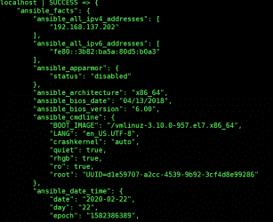
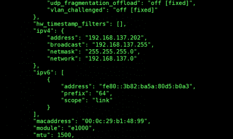
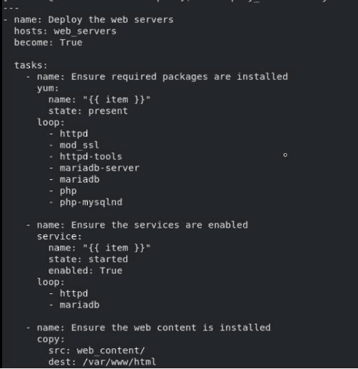
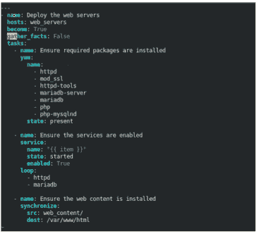

# Ansible 面向企业大规模使用探究

> 原文：[`developer.ibm.com/zh/articles/cl-lo-ansible-large-scale-use-of-enterprises-explore/`](https://developer.ibm.com/zh/articles/cl-lo-ansible-large-scale-use-of-enterprises-explore/)

## 前言

近年来，Ansible 作为一个开源项目迅速发展，被广泛在数据中心、公有云中使用。随着 Ansible 纳管对象数量的增加，如何提高 Ansible 运行效率变得越来越重要。此外，Ansible 在使用过程中的安全问题，也是企业必须要考虑的问题。本文会围绕 Ansible 的优化与安全两个话题详细展开讨论。

## Ansible 的优化

在本节中，我们将从七个方面介绍 Ansible 进行优化的方式，并给出一个 Playbook 优化前后执行效率对比。

### 使用新版本 Ansible

红帽 Ansible 引擎的每一个发行版都会添加功能增强和改进。运行最新版本的 Ansible 可帮助提高作为 Ansible 核心组成部分的 Playbook 的速度，特别是 Ansible 附带的模块会不时得到优化。所以如果可以的话，尽量安装新版本的 Ansible。截至目前，红帽 Ansible 引擎的最新版本是 2.9，如下图 1 所示：

**图 1\. 查看 Ansible 版本**


### 禁用 Fact 收集

每个 Playbook 都有一个前置运行的隐藏任务，它使用 setup 模块从各个主机收集 fact。这些 facts 提供了有关 Playbook 可通过 ansible_facts 变量使用的节点的一些信息。为了方便理解，我们手工收集 facts 信息进行查看：

[root@repo ~]# ansible localhost -m setup

执行结果一共 575 行，信息量很大。我们仅以部分输出信息为例。 首先可以看到主机整体信息，如下图 2 所示：

**图 2\. 查看 facts 输出主机部分信息**



还可以看到网络相关信息，如下图所示：

**图 3\. 查看 facts 输出网络部分信息**



收集每个远程主机的 fact 需要花费时间，尤其当纳管主机较多时，花费的时间呈线性增长。如果我们的 Playbook 中不使用这些 fact，可以通过将 gather_facts 指令设为 False （或 no）来跳过 fact 收集。

实际上，Playbook 通常以如下变量方式使用 fact 收集的信息：`ansible_facts['hostname']`、`ansible_hostname`、`ansible_facts['nodename']` 或 `ansible_nodename`。这些信息，我们也可以使用 `inventory_hostname` 和 `inventory_hostname_short` 变量进行替换。

### 增加并行度

当 Ansible 运行 Playbook 时，它将在当前批处理中的每一主机上运行第一项任务，然后在当前批处理中的每个主机上运行第二个任务，依此类推，直到该 Playbook 完成为止。forks 参数控制 Ansible 可以有多少个连接同时处于活动状态。forks 默认值为 5 ，这意味着即使在当前任务中要处理 100 个主机，Ansible 也以 5 个为一组与它们进行通信。一旦完成与所有 100 个主机的通信，Ansible 将移动到下一任务。

如果我们增大 forks 值，Ansible 一次性可在更多主机上同时运行每一项任务，这样 Playbook 会在以更快的速度完成。例如，如果我们将 forks 设为 100 ，则 Ansible 可以尝试同时打开与上一示例中的所有 100 个主机的连接，当然这将给控制节点和网络带来更大负载。

配置 Ansible 的 forks 值，可以在 Ansible 配置文件中指定，也可以在执行 Playbook 时，通过将 `-f` 选项传递给 `ansible-playbook`。

我们在 Ansible 配置文件 `ansible.cfg` 中将 `forks` 参数设为 100，如下所示：

```
#cat ansible.cfg
[defaults]
inventory=inventory
remote_user=devops
forks=100 
```

如果我们将 `forks` 值决定了 Ansible 要启动的工作程序进程数量，因此太高的数字可能会导致 Ansible 管理节点和网络的性能问题，因此在实际操作中，可以先尝试较小的值（例如 20），然后在每次监控系统时逐步增加这个数字，找到一个临界的最佳值。

### 安装软件包时避免循环

通过 Ansible 安装 Linux 系统软件包，通过会调用 `yum`。当批量安装软件包时，要避免使用循环的方式。使用如下清单所示的安装方式，`yum` 会被调用 7 次。

**清单 1\. 使用 loop 方式安装软件包**

```
---
- name: Install the packages on the web servers
hosts: web_servers
become: True
gather_facts: False

tasks:
- name: Ensure the packages are installed
yum:
name: "{{ item }}"
state: present
loop:
- httpd
- mod_ssl
- httpd-tools
- mariadb-server
- mariadb
- php
- php-mysqlnd 
```

在 Ansible 中很多模块支持处理的项的列表方式，从而避免使用循环。在这种模式下，模块将被调用一次，因此可以提升 Ansible 运行效率，如清单所示，在这种方式下，`yum` 只被调用一次。

**清单 2\. 使用列表方式安装软件包**

```
---
- name: Install the packages on the web servers
hosts: web_servers
become: True
gather_facts: False

tasks:
- name: Ensure the packages are installed
yum:
name:
- httpd
- mod_ssl
- httpd-tools
- mariadb-server
- mariadb
- php
- php-mysqlnd
state: present 
```

通过第二种方式，我们可以提升安装软件包的效率，从而提升 Ansible 的运行效率。

### 提高拷贝文件的效率

在 Ansible 中 `copy` 模块可将目录递归复制到受管主机。当目录很大并且文件数量很多时，可能需要花费很长时间才能完成复制。在将大量文件复制到受管主机时，使用 `synchronize` 模块更为高效。`synchronize` 模块在后台使用 `rsync` 的方式，它的速度比 `copy` 模块更快。

在清单 3 中，我们在 Playbook 使用 `synchronize` 模块将 `web_content` 目录递归复制到 Web 服务器上。

**清单 3\. 复制目录到被管主机上**

```
---
- name: Deploy the web content on the web servers
hosts: web_servers
become: True
gather_facts: False

tasks:
- name: Ensure web content is updated
synchronize:
src: web_content/
dest: /var/www/html 
```

### 优化 SSH 连接

当 Ansible 执行 Playbook 时，Ansible 管理节点和被管节点首先要创建 SSH 连接。建立 SSH 连接是一个速度较慢的过程，尤其当被管节点数量很多的时候，会大幅增加 Ansible 运行的总时长。

因此，我们需要对 SSH 连接进行优化。Ansible 依赖于 SSH 提供的两个功能：

*   ControlMaster 允许多个同时与远程主机连接的 SSH 会话使用单一网络连接。第一个 SSH 会话建立连接，与同一主机连接的其他会话则重复利用该连接，从而绕过较慢的初始过程。SSH 在最后一个会话关闭后，立即销毁共享的连接。
*   ControlPersist 可以使 SSH 连接在后台保持打开，而不是在上一次会话后销毁连接。这样稍后的 SSH 会话重用该连接。ControlPersis 控制空闲连接保持打开的时间长度，每个新会话将重置此空闲计时器。

我们在 Ansible 配置文件 `ansible.cfg` 的 `[ssh_connection]` 部分，进行如下配置：

```
[ssh_connection]
ssh_args = -o ControlMaster=auto -o ControlPersist=60s 
```

设置后，Ansible 在最后一次会话完成后使 SSH 连接保持打开 60 秒。如果被管主机数量较多，可以适当增加 ControlPersist。

如果 `forks` 值或 ControlPersist 设置比较大，控制节点可能会使用更多的并发连接。确保控制节点配置有足够的文件句柄，可用于支持许多活动的网络连接。

### 使用滚动更新

Ansible 在执行任务时具有幂等性。幂等性指的是：一次和多次请求某一个资源对于资源本身应该具有同样的结果（网络超时等问题除外）。也就是说，任意多次执行对资源本身所产生的影响均与一次执行的影响相同。

举例说明，我们对 10 个被管主机执行一个 Playbook，其中 5 台成功了，5 台失败了。找出 5 主机执行失败的原因，再次新执行 Playbook，Playbook 仅对执行失败的机器进行操作，此前执行成功的机器上不会做任何操作。但如果当纳管主机很多时，这种操作方式会降低效率（因为我们不能保证第二次执行一定能成功）。

此外，Ansible 自身的模块是幂等性的，但是如果 Ansible 调用了 shell 或者系统的命令行，这就不能保证完全幂等性了。因此我们要避免大规模执行 Playbook 时大量节点执行任务失败的情况。

为了解决类似的问题，Ansible 执行 Playbook 时可以进行滚动更新。这样做的好处是：发生不可预见的问题时，Ansible 可以暂停部署，并且任何错误都仅限于特定批中的服务器。通过实施测试和监控，以便进行如下操作：

*   对受影响的批处理中的主机进行回滚配置。
*   隔离受影响的主机，以启用对失败部署的分析。
*   向相关负责人发送部署通知。

滚动更新模式下，我们对一堆机器分批执行任务，只有当第一批中所有的机器执行任务都失败了，Ansible 才会认为这批机器上执行的任务失败了并终止对下一批机器的操作。如果一批中只有部分机器失败了，Ansible 会对下一批机器执行任务。我们有两种配置滚动更新的方法：设定固定批处理大小和设置批处理百分比。

#### 设置固定的批处理大小

在 Playbook 的配置中，serial 关键字指定每个批处理中有多少个主机。在开始下一批处理之前，Ansible 将全程通过 Playbook 处理每一批主机。如果当前批处理中的所有主机都失败，则整个 play 将中止，并且 Ansible 不会启动下一个批处理，配置如下所示：

```
---
- name: Update Webservers
  hosts: web_servers
  serial: 2 
```

在上面配置中，`serial` 为 2 表示 Ansible 每次对 `web_servers` 组中的两台主机进行操作，这 2 台成功以后，再对另外 2 台进行操作。此过程将继续，直到所有主机都操作完成。因此，如果 Playbook 中的主机总数不能被批处理大小整除，则最后一个批处理包含的主机可能比 `serial` 关键字的指定值少。

#### 将批处理大小设置为百分比

除了设置 `serial` 数值，我们还可以为 `serial` 关键字的值指定百分比，如下所示：

```
---
- name: Update Webservers
  hosts: web_servers
  serial: 25% 
```

如果指定了百分比，则将在每一个批处理中处理的主机百分比。如果 `serial` 的值为 25%，那么无论 `web_servers` 组中是包含 20 个主机还是 200 个主机，都需要四个批处理来完成所有主机的 play。

Ansible 将该百分比应用到主机组中的主机总数。如果生成的值不是整数数量的主机，则值将被截断到最接近的整数。剩余的主机在最终的较小批处理中运行。批处理大小不能为零个主机。如果截断后的值为零，Ansible 会将批处理大小更改为一个主机。

## Ansible 调优效果展示

在本小节中，我们通过优化一个 Playbook 来展示优化的效果。

首先查看一个部署 webserver 的 Playbook，该 Playbook 将安装软件包、启动服务，并以递归方式将本地目录复制到受管节点。Playbook 的内容如下图 4 所示：

**图 4\. 优化之前的 Playbook**



为了统计 Playbook 执行时间，修改 Playbook 配置文件，启用两个 callback plugin，如下图 5 所示：

**图 5\. 启动 callback plugin**


运行 deploy_webservers.yml playbook，然后记下 Playbook 总的运行时间。

```
#ansible-Playbook deploy_webservers.yml 
```

从下图 6 我们看到执行 Playbook 一共需要 38 秒，如下图所示：

**图 6\. 查看 Playbook 的执行时间**


接下来从三个方面进行优化 `deploy_webservers.yml` Playbook：

1.  禁用 `facts` 收集，因为该 Playbook 不使用 `facts`。
2.  删除软件包安装任务中的 `loop`。
3.  将 `copy` 模块替换为 `synchronize` 模块。

将 Playbook 修改成下图 7 所示：

**图 7\. 优化后的 Playbook**



再次执行 Playbook，查看运行结果，Playbook 运行了 16 秒，如下图 8 所示：而优化之前，Playbook 的执行时间是 38 秒。

**图 8\. 查看 Playbook 的执行时间**


通过上述调优手段，Playbook 的执行速度大幅提升。

## Ansible 安全

执行 Ansible Playbook 需要配置在管理节点和被管节点之间的 ssh 信任。最简单的方式是在 Ansible Engine 和 Ansible 被管机之间配置 root 用户的无密码 ssh 信任。但是，显然这种方式太不安全了。如果配置 root 用户的无密码 ssh 信任，理论上如果 Ansible Engine 主机被黑客攻破，那所有被纳管的系统都可以被以超级用户访问。所以，Ansible 中默认会用普通权限用户执行 Playbook，当必须需要特权执行某些任务时，再使用特权升级。

### Ansible 特权升级的五个级别

Ansible 特权升级配置分为几个级别。全局级别配置、主机级别配置、单 Playbook 级别配置、roles 级别配置、任务中的级别配置。接下来，我们从介绍这五个级别的配置方式。

全局级别配置如下，通过配置 ansible.cfg 文件实现，如下所示：

```
#vi ansible.cfg
[privilege_escalation] 
become = True
become_method = su
become_user = root
become_password = root 
```

设置主机级别的特权升级可以在 inventory 中实现，如下所示：

```
webservers:
  hosts:
    servera.lab.example.com:
    serverb.lab.example.com:
  vars:
ansible_become: true 
```

在 Playbook 中设置特权升级，如下所示：

```
---
- name: Example play using connection variables
  hosts: webservers
  vars:
ansible_become: true
  tasks:
    - name: Play will use privilege escalation even if inventory says no
      yum:
        name: perl
        state: installed 
```

Roles 的特权升级可以有两种方式：

1.  第一个方式是针对角色本身，在其内部或者针对其任务设置特权升级变量。角色的文档可能会指定是否必须设置其他变量（如 `become_method`），才能使用该角色。 您也可以在 Ansible 配置或 Playbook 中自行指定此信息。
2.  第二个方式对调用该角色的 Playbook 设置特权升级设置：

在 Playbook 中设置 Role 的特权升级如下所示：

```
- name: Example play with one role
  hosts: localhost
  roles:
    - role: role-name
become: true 
```

任务中的特权升级，如下所示，我们为 Playbook 中的一个任务控制特权升级：

```
---
- name: Play with two tasks, one uses privilege escalation
  hosts: all
  become: false
  tasks:
    - name: This task needs privileges
      yum:
        name: perl
        state: installed
     become: true
    - name: This task does not need privileges
      shell: perl -v
      register: perlcheck
      failed_when: perlcheck.rc != 0 
```

在介绍了 Ansible 特权升级的五个级别后，接下来我们看一个特权升级配置示例。

### Ansible 特权升级示例

以下是包含三个任务的 Playbook 示例。第一个任务指定 `become: true` 以使用特权升级（覆盖 Ansible 配置文件或命令行选项）。第二个任务指定 `become: false` 即使配置文件或命令行选项指定为升级特权，也不使用特权升级。第三个任务没有 `become` 指令，就会根据 Ansible 配置文件或命令行中的默认设置使用特权升级。`ansible_user_id` 变量显示在受管主机上运行当前 play 的用户的用户名。

```
---
- name: Become the user "manager"
  hosts: webservers
become: true
  tasks:
    - name: Show the user used by this play
      debug:
        var: ansible_user_id

- name: Do not use privilege escalation
  hosts: webservers
become: false
  tasks:
    - name: Show the user used by this play
      debug:
        var: ansible_user_id

- name: Use privilege escalation based on defaults
  hosts: webservers
  tasks:
    - name: Show the user used by this play
      debug:
        var: ansible_user_id 
```

截止到目前，我们完成了对 Ansible 特权升级的展示。

## 结束语

通过本文，相信读者对 Ansible 的优化和安全有了一定的理解。随着 Ansible 在企业中大规模使用，优化和安全是企业需要考虑的两个点。