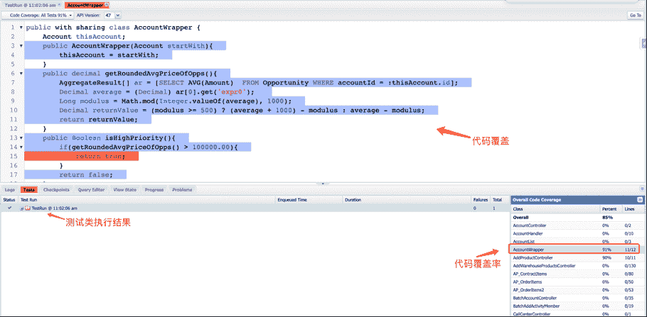
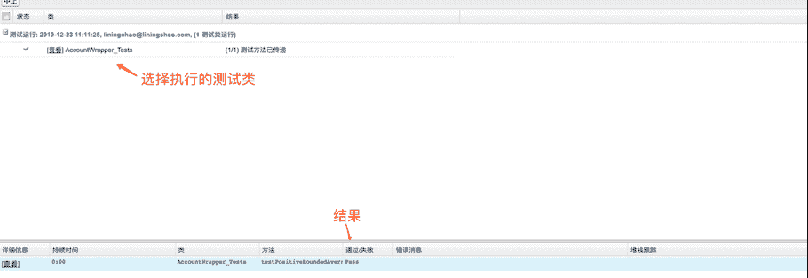

# Salesforce Unit Test 披荆斩棘之路

> 原文：[`developer.ibm.com/zh/articles/wa-salesforce-development-3-unit-test/`](https://developer.ibm.com/zh/articles/wa-salesforce-development-3-unit-test/)

## 什么是单元测试

通过 Salesforce 开发系列的 [Apex 基础知识合辑](https://developer.ibm.com/zh/articles/wa-salesforce-development-2-apex/)，我们已经简单地解到了 Unit Test（单元测试，简称 UT）的概念及语法结构。Apex 单元测试是开发过程中的关键组成部分, 是 Apex 代码质量的决定因素，同时也是确保 Salesforce DX (Developer Experience) Apex 自动化部署效率保驾护航的基石。

## 单元测试的基本方法

Salesforce 专门为 Apex 类提供了测试框架，即可以通过书写 Apex Test Class 的方式来进行单元测试。Apex 单元测试将通过代码覆盖率、断言等形式来保证 Apex 代码的质量。UT 是类方法，用于验证特定代码段是否按照既定的逻辑正常工作，但是 UT 既不会和数据库进行交互，也不会发送电子邮件。Apex Test Class 在类定义中用 `@isTest` 标记, 而且测试方法必须在单独的测试类中定义。

### 创建 Test Class

创建 Test Class 的基本步骤:

1.  创建系统内的模拟数据。
2.  执行 `Test.startTest()` 方法。
3.  测试类中调用需要被测试的代码。
4.  执行 `Test.stopTest()` 方法。

以下是编写测试类的关键点：

*   必须以`@isTest` 标识 class，Salesforce 才会将该类视为测试类。
*   将类保持为 private，建议将测试类命名为原始 Class 或 Trigger 名称+“Test”，使得测试类更易读。
*   测试类的方法必须是静态的，必须使用 `void` 和 `testMethod` 关键字。
*   使用 `Test.startTest()` 和 `Test.stopTest()` 来重置系统限制，确保在执行测试业务代码的时候不易超出限制。
*   应该在测试类中编写多个方法，少数方法应该测试消极（negative）用例，其他方法应该测试积极（positive）用例。
*   每个测试方法结束中必须包含一个以上的断言, 断言的三种写法如下： `assert(condition, msg)` `assertEquals(expected, actual, msg)` `assertNotEquals(expected, actual, msg)`
*   尽量在一个 TestMethod 中只测试一段业务逻辑，这样做会更符合单元测试思想。

例如，编写一个简单的测试类，main class 代码如下：

```
public class TemperatureConverter 
{
public static Decimal FahrenheitToCelsius(Decimal fh) 
{
        Decimal cs = (fh - 32) * 5/9;
        return cs.setScale(2);
    }
} 
```

对以上 class 编写测试类，测试 `FahrenheitToCelsius` 方法，新建一个测试类并且命名为 `TemperatureConverterTest`，编写不同的测试方法来测试代码的不同情景下的输出值，并使用断言来保证测试类得到预期的输出结果，代码如下：

```
@isTest
private class TemperatureConverterTest 
{
@isTest static void testWarmTemp() 
{
        Decimal celsius = TemperatureConverter.FahrenheitToCelsius(70);
        System.assertEquals(21.11,celsius);
    }

@isTest static void testFreezingPoint() 
{
        Decimal celsius = TemperatureConverter.FahrenheitToCelsius(32);
        System.assertEquals(0,celsius);
    }
@isTest static void testBoilingPoint() 
{
        Decimal celsius = TemperatureConverter.FahrenheitToCelsius(212);        
        System.assertEquals(100,celsius,'Boiling point temperature is not expected.');
    } 

@isTest static void testNegativeTemp() 
{
        Decimal celsius = TemperatureConverter.FahrenheitToCelsius(-10);
        System.assertEquals(-23.33,celsius);
    }

} 
```

### 测试数据准备

在测试类中需要同时准备 positive 和 negative 的测试数据。

*   Positive 测试数据：通过正向的测试数据在提供有效数据时返回预期结果的测试，保证代码可以按照我们的预期的来响应。
*   Negative 测试数据：不仅仅是为了确保每一行代码的覆盖率，更重要的是确保代码具有容错性，可以正确地捕获各种异常情况, 例如无效数据、意外的用户输入等。

可以通过`@testSetup` 方法来构造测试方法中公用的测试数据，以下为注意点：

*   `@testSetup`：使用 `@testSetup` 注释定义的方法用于创建可用于类中所有测试方法的公共测试数据。

    ```
    @testSetup
    static void loadTestData(){
        List<Account> accounts = new List<Account>();
        Account acc = new Account();
        acc.Name = 'Test';
        accounts.add(acc);
        insert accounts;
    } 
    ```

*   尽量避免使用 `seeAllDate=true`，而是通过 DML（Insert、Update、Delete、Upsert）操作初始化测试数据。因为数据在不同的环境是不一样的，非常可能导致异常情况发生。

    ```
    // All test methods in this class can access all data.
    @isTest(SeeAllData=true)
    public class TestDataAccessClass 
    {
        @isTest static void testMethod() 
        {
            Decimal celsius = TemperatureConverter.FahrenheitToCelsius(70);
            System.assertEquals(21.11,celsius);
        }

    } 
    ```

*   如果数据复杂多变，使用 `Test.loadData` 加载文件来创建数据会使代码变得更简洁。使用 `loadTestData` 方法中创建的数据，减少重复代码。

    ```
    @testSetup
    static void loadTestData()
    {
        List<Account> accounts = (List<Account>) Test.loadData(Account.SObjectType, 'accountData');
    } 
    ```

### 测试数据准备示例

构建一个 `AccountWrapper` 的 class，将 Account 所有相关联的所有业务机会价格做平均计算。代码如下：

```
public with sharing class AccountWrapper 
{
    Account thisAccount;
public AccountWrapper(Account startWith)
{
        thisAccount = startWith;
    }
public decimal getRoundedAvgPriceOfOpps()
{
        AggregateResult[] ar = [SELECT AVG(Amount)  FROM Opportunity WHERE accountId = :thisAccount.id];
        Decimal average = (Decimal) ar[0].get('expr0'); 
        Long modulus = Math.mod(Integer.valueOf(average), 1000);
        Decimal returnValue = (modulus >= 500) ? (average + 1000) - modulus : average - modulus;
        return returnValue;
    }
public Boolean isHighPriority()
{
        if(getRoundedAvgPriceOfOpps() > 100000.00){
            return true;
        }
        return false;
    }
} 
```

通过 `@testSetup` 构建公用的测试数据，在当前测试类下的所有测试方法均可以公用到`@testSetup` 中已经构建好的数据。在执行需要测试的 `getRoundedAvgPriceOfOpps` 方法之前，使用 `Test.startTest()` 方法重置系统限制，当测试方法执行完毕执行 `Test.stopTest()`。

```
@isTest
private class AccountWrapper_Tests 
{
    @testSetup
static void loadTestData()
{
        List<Account> accounts = new List<Account>();
        Account acc = new Account();
        acc.Name = 'Test';
        accounts.add(acc);
        insert accounts;
        List<Opportunity> opps = new List<Opportunity>();
        for(Account a : accounts){
            opps.addAll(generateOppsForAccount(a.id, 1000.00, 5));
        }
        insert opps;
    }
@isTest static void testPositiveRoundedAveragePrice() 
{
        List<AccountWrapper> accounts = new List<AccountWrapper>();
        for(Account a : [SELECT ID, Name FROM ACCOUNT]){
            accounts.add(new AccountWrapper(a));
        }
        List<Opportunity> sanityCheckListOfOpps = [SELECT ID FROM Opportunity];
        System.assert(sanityCheckListOfOpps.size() > 0, 'You need an opportunity to continue');
        Test.startTest();
        for(AccountWrapper a : accounts){
            System.assertEquals(a.getRoundedAvgPriceOfOpps(), 1000.00, 'Expected to get 1000.00');
            System.assert(!a.isHighPriority());
        }
        Test.stopTest();
}

private static Opportunity[] generateOppsForAccount(id accountId, Decimal amount, Integer numOpps)
{
        List<Opportunity> opps = new List<Opportunity>();
        for(Integer i = 0; i < numOpps; i++){
            Opportunity o = new Opportunity();
            o.name = 'Account ' + i;
            o.accountId = accountid;
            o.amount = amount;
            o.closeDate = Date.today().addDays(5);
            o.stageName = 'Prospecting';
            opps.add(o);
        }
        return opps;
    }
} 
```

### 执行 Test class

测试类编写完成后需要运行 Test Class 来检查代码的覆盖情况以及是否能正常执行 Test Class，所有从 Salesforce 用户界面（包括开发者控制台）启动的 Apex 测试都是异步和并行运行的。Apex 测试类被放置在 Apex 作业队列中以供执行。下面将介绍运行 Test Class 的两种方式。

#### 通过 Developer Console 执行测试类

1.  登录系统，然后打开 Developer Console。
2.  选择 Test，然后点击 New Run 打开执行测试类页面。
3.  选择需要执行的测试类以及测试方法，最后点击 Run 按钮。
4.  当测试类执行完毕后，通过页面查看测试类的执行状态，以及被测试代码的覆盖情况。

    **图 1\. 查看测试类覆盖率**

    

#### 通过 “Apex 测试执行” 执行测试类

1.  选择 Setup, 在快速搜索栏中搜索并选择 Apex 测试执行。
2.  点击选择测试按钮，选择需要执行的测试类。
3.  最后点击运行按钮。
4.  在此页上启动的测试以异步方式运行，待测试类执行完毕后，在当前页面查看执行结果。

    **图 2\. 查看 Apex 测试执行**

    

## 测试 Apex Trigger

在 Salesforce 平台的使用中也会经常用到 trigger，但是 trigger 都是在真正的 DML 操作或者存在其他的真实触发条件下才会跳转过去，所以在对于 trigger 进行测试时，一般都不会使用 mock 数据的方式，而直接采用执行真正的触发条件的操作，这点是值得我们注意也是后续需要改进的地方。

## 单元测试的优化之路

前文已经介绍了 UT 在 Salesforce 中的基本知识和应用实践。在实际项目开发过程中，UT 的代码量会随着项目代码量的增加而增加，从而可能会导致各种各样的异常，比如常见的 `Too Many SOQL Queries` 异常；另一个问题是代码部署到生产环境需要运行 Full UT，大量 UT 运行时间长达数小时，导致上线困难。为了能够解决上述问题，我们对 UT 进行了优化，大概可以分为三个阶段，希望能够帮助到您。

## 使用 Test Data Factory

想必大家掌握了写 UT 的步骤，其中有一步是准备测试数据，想象一下，如果您的测试数据不止一个测试类需要用到，是否可以考虑提取为公共的方法，答案是肯定的。为了能够简化准备测试数据的过程，我们可以创建一个可被多个测试类重用的工厂类，其中包含创建多个 Record 的方法，这样当测试类需要测试数据时，只需要调用工厂测试类即可。接下来看一下 `TestFactoryV1`：

```
@isTest
public class TestFactoryV1 {
    public static Account getAccount(String name){
        Account acc = new Account();
        acc.Name = name;
        insert acc;
        return acc;
    }
    public static Contact getContact(Id accountId, String fname, String lname){
        Contact con = new Contact();
        con.FirstName = fname;
        con.LastName = lname;
        con.AccountId = accountId;
        insert con;
        return con;
    }
} 
```

在这个 class 中包含两个方法，分别用于创建 `Account` 和 `Contact`，调用者只需要通过 `TestFactoryV1.getAccount('TestMyAccount')` 语句调用即可。注意，当您每次调用的时候，该方法都会向数据库插入一条数据，随着方法调用次数的增加，DML 操作次数也会增加，那么就可能会导致 DML 操作超出系统限制，从而导致 UT 运行失败。下面来看一下怎么改进这个 `Factory`:

```
@isTest
public class TestFactoryV2 {
    public static Account getAccount(String name,Boolean doInsert){
        Account acc = new Account();
        acc.Name = name;
        if(doInsert){
            insert acc;
        }
        return acc;
    }
    public static Contact getContact(Id accountId, String fname, String lname,Boolean doInsert){
        Contact con = new Contact();
        con.FirstName = fname;
        con.LastName = lname;
        con.AccountId = accountId;
        if(doInsert){
            insert con;
        }
        return con;
    }
} 
```

经过改进，在 `TestFactoryV2` 的方法中，包含了一个 `doInsert`参数，这个参数作用是由调用者来决定是否在调用工厂类方法时插入数据，从而在一定程度减少 DML 操作次数，避免 DML 次数超限而导致 UT 运行失败。在程序开发过程中，代码能够被更多的组件复用，会更利于代码开发和维护，针对 UT 也是如此，这也是我们提到用 `TestDataFactory` 的原因。如果要保证 `Factory` 更有意义，需要遵循一定的规范，否则会改代码带来隐患，下面来看看这个例子：

```
@isTest
public class TestFactoryV3 {
    public static Account getAccount(){
        Account acc = new Account();
        acc.Name = 'Test';
        return acc;
    }

    public static Contact getContact(){
        Account acc = new Account();
        acc.Name = 'Test';
        insert acc;
        Contact con = new Contact();
        con.FirstName = 'FirstName';
        con.LastName = 'LastName';
        con.AccountId = acc.Id;
        return con;
    }
} 
```

我们来看一下 `TestDataFactorV3` 犯的错误：

*   没有申明 `doInsert` 变量，这意味着调用者的 UT 存在潜在的风险，容易超出系统限制。
*   调用者创建一个 `Account` 变的很容易，只需要简单的语句 `TestFactoryV3.getAccount()`，不过如果系统中存在验证规则、重复规则将会导致 UT 失败，尤其是在生产环境中，后果可想而知。

上面 `TestDataFactorV3` 例子失败的原因在于，UT 的数据没有做好隔离，所以更推崇的是不同的 UT 的 Test Data 应该能够保持独立性，如果用 Factory 是没有问题的，前提得保证 Test Data Factory 的规范，最大程度地降低 DML 和 SOQL 操作，从而保证 UT 的正常运行。一个项目中如果跨多个 Team，更要注意 Test Data Factory 的使用，它在带来便利的同时也增加了彼此的依赖。下文提供另外一种准备测试数据的方法，接下来看一下当测试数据准备好后，需要执行代码逻辑，Salesforce 中在运行 UT 时，需要考虑以下两个问题：

*   单元测试应该能够保证功能代码逻辑没有问题，此外，Salesforce 会强制要求功能代码覆盖率应该超过 75%。
*   数据库操作（DML、SQOL）容易超出系统限制。

当系统中存在大量不规范测试类的时候，不仅数据库操作次数更容易超出系统限制，导致 UT 运行失败，而且在系统上线运行 UT 耗时过长。UT 运行时间的延长，很大程度也是上由数据库操作次数过多导致的，下面来看一下怎么降低 UT 与数据库交互的频率。

**图 3\. 单元测试 DML 超出系统限制错误**


### 使用 Test.isRunningTest 方法

通过上一节，我们已经知道了频繁的数据库访问会给 UT 带来的潜在的风险和上线时执行 UT 耗时过长，那怎样才能在 UT 中避免频繁的 DML 和 SOQL 操作呢？下面来看看怎样通过 `Test.isRunningTest` 方法来实现：

```
public with sharing class AccountWrapper {
    Account accountInstance;
    public AccountWrapper(Account acc){
      accountInstance = acc;
    }
    //使用 Test.isRunningTest 之前
    public decimal getAccountAmount(){
        List<Opportunity> oppList = [select id,Amount from Opportunity where Accountid=:accountInstance.Id];
        Decimal amount = 0;
        for(Opportunity opp:oppList){
            amount = amount + opp.Amount;
        }
        return amount;
    }
    //使用 Test.isRunningTest 之后
    public decimal getAccountAmountWithRunningTest(){
        List<Opportunity> oppList = new List<Opportunity>();
        if(Test.isRunningTest()){
            oppList = testFacotry.getOpportunity();
        }else{
            oppList = [select id,Amount from Opportunity where Accountid=:accountInstance.Id];
        }
        Decimal amount = 0;
        for(Opportunity opp:oppList){
            amount = amount + opp.Amount;
        }
        return amount;
    }
} 
```

这个例子实现的功能简单，计算一个 Account 下面所有 `Opportunity` 的 `Amount` 总值。先来看第一个方法 `getAccountAmount()`，要测试这个方法，需提前在 UT 中插入数据，因为这个方法用到查询操作，既然数据库操作次数增加了，应摒弃这种方式；接下来看看这个方法的改进 `getAccountAmountWithRunningTest()`，在这个方法中包含了 `Test.isRunningTest()` 方法，作用是检测当前运行上下文是否为测试，如果当前方法是由 UT 方法调用，返回 `True`，这就意味着测试时运行的代码和业务运行的的代码是隔离的。既然两种场景代码隔离了，那就可以在测试时替换为不访问数据库的代码。

使用 `Test.isRunningTest()` 达到了降低 DML 和 SOQL 操作次数目的，它可以满足下面两个需求：

*   当业务运行的时候，代码会与数据库发生交互；如果在 UT 上下文时，并不会真正的操作数据库。
*   运行 UT 时间大幅度降低。

看起来 `Test.isRunningTest` 可以解决问题了，但是这会带来另外两个问题：

*   重构已有的系统代码，如果包含了 SOQL 或者 DML 操作，都需要搭配 `Test.isRunningTest` 方法，至少会包含两段逻辑，导致代码冗余，不利于维护。
*   在业务代码同时需要测试代码，会导致开发过程效率低下。

那有没有更好的方法来保证，既能够减少 UT 测试数据与数据库发生交互，又能够最大程度的降低对原有代码的改造呢？截止目前，利用 Mock Framework 可以解决问题。

### 使用 Mock Testing

通过上述分析可以看出为了减少 UT 测试数据与数据库发生交互，又能够最大程度的降低对原有代码的改造并且提高 UT 的性能就需要采用 Mock Framework，下面将详细介绍项目中几种常用的 Mock Framework。

#### HTTP Callouts Testing

在 Salesforce 项目中我们经常会需要发送 HTTP 请求到其他应用，HTTP 一般会涉及到传输系统中其他类传递过来的信息作为 body 进行发送，这样就形成了对于其他类的依赖，当写 UT 时就需要依赖其他类完成此次 UT，这样会增加 UT 的耦合度。为了降低耦合度，我们可以通过实现 `HttpCalloutMock` 接口来 mock HTTP 请求，这样就不需要获取真实的 HTTP 请求。具体步骤如下：

1.  在测试类中创建一个内部类并且实现 `HttpCalloutMock` 接口，声明内部类使用 global 或者 public 修饰，并且添加 @isTest 注解，这个类则用来 mock 一个 HTTP 请求的返回值：

    ```
    @isTest
    global class YourHttpCalloutMockImpl implements HttpCalloutMock {
           global HTTPResponse respond(HTTPRequest req) {
                // 创建一个假的 response
                // 设置 response 的值并且返回 response
            }
        } 
    ```

2.  然后，在 test 方法中通过调用 `Test.setMock()` 方法将被测试类的方法加载到测试方法中。其中第一个参数固定为 `HttpCalloutMock.class`，第二个参数是上述实现 `HttpCalloutMock` 接口的内部类实例。

    ```
    Test.setMock(HttpCalloutMock.class, new YourHttpCalloutMockImpl()); 
    ```

3.  在测试类的测试方法中直接调用被测试类的 HTTP callout 方法并取得 `HttpResponse`，这样就获取到了 mock 的 HTTP 请求的返回值，例如被测试类为 `CalloutClass`，测试类的调用方法如下：

    ```
    public class CalloutClass {
        public static HttpResponse getInfoFromExternalService() {
            HttpRequest req = new HttpRequest();
            req.setEndpoint('http://example.com/example/test');
            req.setMethod('GET');
            Http h = new Http();
            HttpResponse res = h.send(req);
           return res;
        }
    }

    //测试类中的调用方法
    HttpResponse res = CalloutClass.getInfoFromExternalService(); 
    ```

#### SQLDMLRunner

在 Salesforce 中的很多 DML 操作一般都会放在一个单独处理数据信息的类中，在其他各个类中可以调用这个类的 DML 操作方法来实现所需的功能。DML 通常非常耗时的，所以我们需要 mock Salesforce 的 DML 操作方法，这样可以保证代码的覆盖，同时避免去 Salesforce 平台中操作或查询任何数据，具体操作步骤如下：

1.  在含有 DML 的被测试类中创建一个私有的虚拟内部类 SQLDMLRunner，将所有的 DML 操作方法全部放到这个类中，同时类与类包含的方法都需要用 `@testvisible` 注解修饰。

    ```
    @testvisible
        private virtual class SOQLDMLRunner {
            @testvisible
            private virtual List<Account> getAccount(){
              //真实数据操作;
              //返回结果;
            } 
    } 
    ```

2.  在被测试类中创建 SQLDMLRunner 的静态的实例化对象 `sqldmlRunner`，这样就可以在被测试类的方法中使用这个对象：

    ```
    @testvisible private static SOQLDMLRunner sqldmLRunner = new SOQLDMLRunner();

    List<Account> matrixEntryList= sqldmLRunner.getAccount(); 
    ```

3.  在测试类中同样创建一个 `TestSQLDMLRunner` 私有内部类并且继承自被测试类(假设被测试类为 `testClass)的 SQLDMLRunner`，然后重写 DML 操作的各个方法：

    ```
    private class TestSOQLDMLRunner extends testClass.SOQLDMLRunner {
        private override List<Account> getAccount(){
             //返回 mock 的数据信息
            } 
    } 
    ```

4.  将测试类中的 `TestSQLDMLRunner` 的实例对象指定到被测试类中的静态对象 `sqldmlRunner`，这样在测试类中所使用的的就是 `TestSQLDMLRunner` 类中的 DML 操作方法，也就实现了 mock DML 操作，如果被测试类为 `testClass` 具体代码如下：

    ```
    testClass.sqldmlRunner = new TestSOQLDMLRunner(); 
    ```

#### `sfab_FabricatedSObject` 与 `fflib_IDGenerator` 框架

通过上述已经了解到重写 DML 操作的方法，但是对于 mock 数据时，我们需要构造各种数据，Salesforce 目前已经为我们提供了两个框架，一个是 `sfab_FabricatedSObject`，它用来构造需要 mock 的 SObject，还有一个 `fflib_IDGenerator` 用来生成 `SObject` 对象的 ID，具体使用如下。

```
 sfab_FabricatedSObject fabricatedAccount = new sfab_FabricatedSObject(Account.class);
     Id accId = fflib_IDGenerator.generate(Account.SObjectType);
      fabricatedAccount.setField(Account.Id, accId);
      mockAcc = (Account)fabricatedAccount.toSObject(); 
```

其中 `sfab_FabricatedSObject` 还包括 `setParent()` 和 `setChildren()` 两种方法来设置 `SObject`对应的父类和子类的关系，具体如下所示。

```
 sfab_FabricatedSObject fabricatedOpportunity = new            sfab_FabricatedSObject(Opportunity.class);
      fabricatedOpportunity.setField(Opportunity.Id, 'OppId-3');
      fabricatedOpportunity.setParent('Account', fabricatedAccount);

      fabricatedAccount.setChildren('Opportunities', new List<sfab_FabricatedSObject> {
new sfab_FabricatedSObject(Opportunity.class).setField(Opportunity.Id, 'OppId-1'), 
new sfab_FabricatedSObject(Opportunity.class).setField(Opportunity.Id, 'OppId-2')}) 
```

#### FFLib ApexMocks

在写 UT 的过程中如果被测试类中存在多个类之间的依赖关系时，则可以使用这个框架来书写 UT，但是前提是我们需要将被调用类采用依赖注入的形式与被测试类进行关联。

FFLib ApexMock 框架是使用 Salesforce Stub API 来动态地将依赖关系的类作为 mock 的对象，并且可以通过 API 来 mock 依赖关系对象的被调用方法后的返回值，这样不必去获取返回值就可以验证结果，具体使用如下所示。

1.  用依赖注入的形式把被调用类与被测试类关联起来：

    ```
    public class FlightAttendant{
        private Greeting greeter;
        public FlightAttendant(Greeting attendant){
            greeter = attendant;
        }
        public string greetPassenger(){
            string randomGreeting = greeter.getRandomGreeting('English');
            return randomGreeting;
        }
    } 
    ```

2.  将被调用类通过 `fflib_ApexMocks API` 进行 mock 成一个仅供测试的类如下 `greetingMock`，通过 `when` 和 `then` 语句可以将 `greetingMock` 的 `getRandomGreeting` 方法进行设定，如当传入 English 时则会返回 `yes`，接下来则开始执行被测试类的方法，并且在构造时传入 mock 的被调用的类对象，这样就实现了 mock 类的注入，最后验证结果是否与 `yes` 一致。

    ```
    @isTest
    public class FlightAttendantTest{
        static testmethod void test1(){
            fflib_ApexMocks mocks = new fflib_ApexMocks();
            Greeting greetingMock = (Greeting)mocks.mock(Greeting.class);

            mocks.startStubbing();
            mocks.when(greetingMock.getRandomGreeting('English')).thenReturn('yes');
            mocks.stopStubbing();

            FlightAttendant attendant = new FlightAttendant(greetingMock);
            string yesGreeting = attendant.greetPassenger();

            ((Greeting) mocks.verify(greetingMock,1)).getRandomGreeting('English');
            System.assertEquals('yes'.yesGreeting);
        }
    } 
    ```

使用 `fflib_ApexMocks` 需要注意：

*   被 mock 的类必须含有一个不带参数的构造方法。
*   静态方法、私有方法和属性没有办法被 mock。

### Mock 与非 Mock 单元测试性能对比

前文提到，Apex 部署的时候对单元测试的覆盖率有严格的要求（高于 75%) 否则将会发生部署错误。由于在部署的时候需要执行全部单元测试（Full UT），执行完全部的单元测试是有时间花销的，所以执行的效率决定了部署的效率。如果单元测试质量不高，会对部署产生很严重的负面影响, 甚至阻碍新的功能上线。下面就上述 mock 与非 mock 单元测试的性能进行对比，可以帮助大家感受到 mock 单元测试的优势。

#### 非 Mock 单元测试性能

Apex 单元测试使用 Test Data Factory 和 `Test.isRunningTest` 方法来构造单元测试时，都是会真实的发生 DML 和 SOQL 操作。同时测试数据之间必不可少的会存在一些相互依赖，例如 mast-detail 的关系，这就导致了单元测试必须是按照既定的顺序来执行。如果项目功能比较复杂，也就意味着需要很长的时间来执行全部的单元测试。下图就是我们的项目在没有采用 mock 的测试框架之前执行部署时发生的常见问题：耗时长、效率低、而且容易出错。

**图 4\. 非 Mock 单元测试部署详情**


#### Mock 单元测试性能

将单元测试进行改造，采用 mock 的方式来熟悉单元测试单面讲很好的解决上面的代码部署时所碰到的问题，实现 CI/CD 流水线。从前文“使用 Mock Testing” 的讲解中，大家已经了解了 mock 测试其实没有发生真正的 DML 操作，只是根据既定的业务逻辑规则制造了假的测试数据，让单元测试根据这些假的数据来验证。这也就意味着数据之间没有强关联，所以无论多少单元测试都能够并行执行，可以很大程度上的提升部署的时间同时也减少了 DML 超限的问题。

**图 5\. Mock 单元测试部署详情**


## 单元测试规范总结

本章节将会给大家总结一下书写 Apex 单元测试的一些经验教训，希望可以帮助您快速解决在 Apex 单元测试任务时遇到的问题。

### 新建单元测试类

在 Salesforce 中 Apex 代码（Trigger、Batch、Apex controller 等）都需要书写 UT，以下总结了几点书写规范：

1.  测试方法的命名应正确描述他们正在测试的方法，可以使用主类名称+后面的单词 Test, 这样将有助于以后的代码维护。
2.  所有的测试类的方法都应该标记为私有，而类本身也应该标记为私有，因为测试类之类不应该来调用测试类。
3.  测试类避免使用静态变量。
4.  测试类必须是独立的，我们不应该创建任何应用程序来设置数据。
5.  为了保证业务逻辑代码的规整性，mock 的测试方法应当使用 fflib 框架来设置对象，而不是在测试方法中设置原始的 JSON。
6.  如果某一个特定的类由于发生过多而无法测试，这时需要重构该方法或者类，以使单元测试的工作量尽可能解耦。
7.  测试类应当尽可能的避免任何 DML 和 SOQL 操作, 以减少超限错误。

### 重构单元测试类

在重构所有测试类遵循上面的原则之前（即 mock 所有的 SOQL 和 DML），我们必须确保当前正在执行的“端到端”的测试能够正确的执行, 而不是仅引入一个新的 SOQL 就会引发 SOQL 101 的问题。虽然在理想的情况下，所有的测试类都需要经过重构，但是在此之前，我们需要遵循下面的规范，来确保不会破坏现有的测试类。

```
 @testvisible
private virtual class SOQLDMLRunner {
    @testvisible
    virtual List<SObject> someExistingSOQLMethod(Set<Id> lst) {
        // 这是没有重构的 SOQL 操作，顺其自然

        return [select Id from Account where Id in :lst];
    }

    @testvisible
    virtual List<SObject> someNewSOQLMethod(Set<Id> lst) {
        // 这是一段新的 SOQL 操作，不要在测试期间执行，只是在运行时执行
        return Test.isRunningTest() ? new List<SObject>() : [select Id from Account where Id in = :lst];
    }

    @testvisible
    virtual void doInsert(list<SObject> lst) {
        // 这是未重构之前的 DML 操作，顺其自然
        insert lst;
    }

    @testvisible
    virtual void doInsertNew(list<SObject> lst) {
        // 这是新的 DML 操作，不要在测试中执行
        if (!Test.isRunningTest()) {
            doInsert(lst);
        }
    }
} 
```

## 结束语

本文系统地介绍了 Apex 单元测试的基本知识，并且结合实际项目中演进经验为您展现了一条真实的涅槃之路。希望通过本文，您不仅可以对 Apex 单元测试有一个全方位了解，而且可以快速从入门到精通，掌握如何书写高效的 Apex 单元测试代码，为实现 Salesforce DX 添加一剂助推剂。