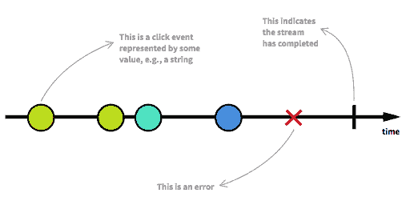
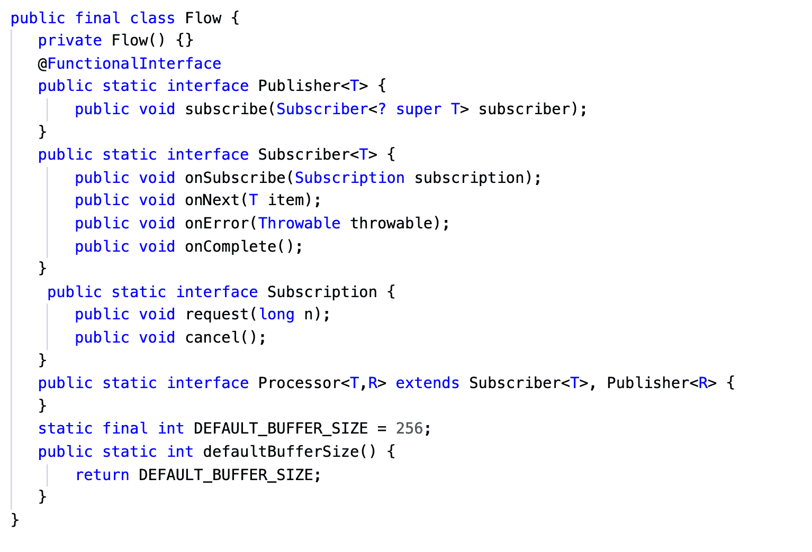

# 定义“反应式”一词

> 原文：[`developer.ibm.com/zh/articles/defining-the-term-reactive/`](https://developer.ibm.com/zh/articles/defining-the-term-reactive/)

“反应式”一词已成为一个广泛使用但有时却又令人困惑的术语，它通常用于指代许多不同的事物。对于反应式编程、反应式扩展、反应式流、反应式消息传递或反应式系统这些术语，您可能早有耳闻。但这些术语的真正含义是什么，它们又是如何组合在一起的呢？

在本文中，我们将尝试定义其中一些关键术语，了解它们会在哪些情况下组合使用。但值得注意的是，“反应式”是一个不断发展的领域，由于这其中的许多术语都与概念或规范（而不是实现）有关，因此很多人可能会各持己见。

## 反应式编程

用技术术语来说，*反应式编程* 是一种范式，在这种范式中，发布声明式代码来构造异步处理流水线。换句话说，它使用异步数据流进行编程，在数据可用时将其发送给使用者，这使开发人员能够编写可以快速、异步响应这些状态变化的代码。

流是按时间顺序排列的一系列进行中的事件（状态变化）。流可以发出三种不同的对象：值（某种类型）、错误或“已完成”信号。通过定义将在发出值时执行的函数、发出错误时执行的函数以及发出“已完成”信号时执行的函数，以异步方式捕获这些事件。对流的侦听被称为“订阅”。我们定义的功能是观测者。流是正在观测的主题（也称为“可观测项”）。

通过使用反应式编程，您可以为任何对象创建数据流，包括变量、用户输入、属性、缓存、数据结构等。然后可以观测到这些流，并可以采取相应的操作。反应式编程还提供了一个奇妙的功能工具箱，用于组合、创建和过滤其中任何流，比如：

*   可以将一个或多个流用作另一个流的输入。
*   可以合并两个流。
*   可以过滤流，以获取另一个仅包含感兴趣事件的流。
*   可以将数据值从一个流映射到另一个新的流。

可以使用许多模式和工具，以在微服务中启用反应式编程。它们包括：

*   **Futures**，这是一个 Promise，用于在操作完成后保存某些操作的结果。
*   **Observables**，这是一种软件设计模式，在这种模式中，对象（称为主题）维护其依赖项（称为观测者）的列表，并自动通知它们任何事件（状态变化），这通常是通过调用某种方法来完成的。
*   **发布和订阅**
*   **反应式流**（稍后再详细描述），这是一种编程概念，用来以非阻塞方式处理异步数据流，同时向流发布者提供背压。
*   **反应式编程库**，用于编写基于事件的异步程序（比如 [RxJava](https://github.com/ReactiveX/RxJava) 和 [SmallRye Mutiny](https://smallrye.io/smallrye-mutiny/)）。

反应式编程是一种有用的实现方法，通过这种异步和非阻塞执行，可以在诸如微服务（内部组件）之类的组件内部以本地方式管理内部逻辑和数据流转换。

## 反应式扩展

反应式编程可处理数据流，并通过数据流自动传播更改。这种范式是由反应式扩展实现的。

反应式扩展使命令式编程语言可以通过使用可观察的序列组成基于事件的异步程序。换句话说，这使您的代码可以创建和订阅名为 *observable* 的数据流。反应式扩展结合了观测者和迭代器模式以及功能习惯用语，为您提供了一种工具箱，支持应用程序创建、组合、合并、过滤和转换数据流。

Java 有一些流行的反应式扩展，例如 [ReactiveX](http://reactivex.io/)（包括 [RxJava](https://github.com/ReactiveX/RxJava)、[RxKotlin](https://github.com/ReactiveX/RxKotlin)、[Rx.NET](https://github.com/dotnet/reactive) 等等）和 [BaconJS](http://baconjs.github.io/)。由于有多种库可供选择，而且它们之间缺乏互操作性，因此很难选择要使用的库。正是为了解决这一问题，才发起了“反应式流”倡议。

## 反应式流

[反应式流](https://www.reactive-streams.org/)是为提供标准以统一反应式扩展并处理具有无阻塞背压的异步流处理而提出的方案，其中包括针对运行时环境以及网络协议开展的工作。`org.reactivestreams` API 最初于 2015 年创建，包含 4 个接口：`Publisher`、`Subscriber`、`Subscription` 和 `Processor`。RxJava、Reactor 和 [Akka Streams](https://doc.akka.io/docs/akka/current/stream/reactive-streams-interop.html) 之类的扩展框架全都实现了这些接口。

Java 开发人员希望在 JDK 中标准化反应式流 API，以便可以免费使用这些 API，而不必打包任何第三方库。为了满足这些要求，JDK9 在 [`java.util.concurrent.Flow`](https://docs.oracle.com/javase/9/docs/api/java/util/concurrent/Flow.html) 下提供了反应式流接口，这在语义上等效于 `org.reactivestreams` API。RxJava、Reactor 和 Akka Streams 都在 Flow 下实现了这些接口。

反应式流接口为：

*   **Subscriber 和 Publisher**。Subscriber 是流观测者。Subscriber 通过 `Publisher.subscribe()` 方法订阅 Publisher。然后，Publisher 调用 `Subscriber.onSubscribe` 以传递 Subscription，以便 Subscriber 调用 `subscription.request()`，用于处理背压或 `subscription.cancel()`。

    

*   **Subscription**。 如果 Subscriber 只能处理 4 个项目，则将通过 `Subscription.request(4)` 传递其容量。除非 Subscriber 请求更多的项目，否则 Publisher 不会发送 4 个以上的项目。发布一个项目时，Publisher 会调用 `onNext()`；如果不发布任何项目，则调用 `onComplete()`。

    

*   **Processor**。 Processor 是 Publisher 和 Subscriber 之间的中介。它订阅 Publisher，然后 Subscriber 订阅 Processor。

    

如上所示，反应式流引入了 *发布*、*订阅* 的概念，以及将它们结合在一起的方法。但是，这些流通常需要通过 map、filter、flatMap 等进行操作（类似于适用于非反应式流的 `java.util.stream`）。用户并不打算直接实现反应式流 API，因为这很复杂，不仅很难做到，也很难通过反应式流的 TCK（技术兼容性套件，这是一套测试、工具和文档，支持 Java 技术规范实现者确定实现是否符合规范）。因此，实现必须由第三方库提供，例如 [Akka Streams](https://doc.akka.io/docs/akka/current/stream/index.html)、[RxJava](https://github.com/ReactiveX/RxJava) 或 [Reactor](https://projectreactor.io/)。

但是，许多 MicroProfile 企业应用程序开发者并不希望或不能使用第三方依赖项，而是希望（需要）能够操纵反应式流。因此，为了标准化流操作，人们创建了 [MicroProfile Reactive Streams Operators](https://github.com/eclipse/microprofile-reactive-streams-operators/)，提供与 `java.util.stream` 等效的功能。下面显示了 Reactive Streams Operators 的使用示例。

## 反应式消息传递

反应式流规范和 [MicroProfile Reactive Streams Operators](https://github.com/eclipse/microprofile-reactive-streams-operators) 规范为 MicroProfile Reactive Messaging 规范奠定了基础。

如上所述，反应式流是用于在背压下进行异步流处理的规范。它定义了一组最小的接口，允许将执行此类流处理的组件连接在一起。MicroProfile Reactive Streams Operators 是 Eclipse MicroProfile 规范，它基于反应式流提供一组基本操作符，以将不同的反应式组件链接在一起，并对它们之间传递的数据进行处理。

[MicroProfile Reactive Messaging](https://github.com/eclipse/microprofile-reactive-messaging) 规范允许应用程序组件之间进行异步通信，从而实现微服务的时间解耦。如果无论通信中涉及的组件何时运行都能实现通信（不论这些组件是已加载还是过载，是已成功处理消息还是处理失败），则必须进行这种时间解耦。它提高了微服务之间的灾备能力，而这正是反应式系统的关键特征。

MicroProfile Reactive Messaging 旨在为消息传递提供轻量级的反应式解决方案，确保使用 MicroProfile 编写的微服务能够满足反应式架构的需求，从而提供一种将事件驱动的微服务连接在一起的方式。

它在应用程序的 bean 上使用带注解的方法（`@Incoming` 和 `@Outgoing`），并通过命名通道（表示要使用消息的源或目标的字符串/名称）将它们连接在一起。

## 反应式系统

反应式编程、反应式流和反应式消息传递都是设计和构建反应式系统的得力工具。

创造 *反应式系统* 这一术语是为了在系统级别描述用于交付响应式和反应式应用程序的架构样式。它旨在支持包含多个微服务的应用程序作为一个单元协同工作，以更好地对其周围环境和其他应用程序作出反应，从而在处理不断变化的工作负载需求时表现出更大的弹性，并在组件发生故障时体现出更强的灾备能力。它基于下图中概述的“反应式宣言”。

“反应式宣言”列出了反应式系统的四个关键高级特征：

*   响应式：反应式系统需要在合理的时间内处理请求
*   灾备：反应式系统必须在遇到故障（错误、崩溃、超时等）时积极做出响应，因此必须将其设计为能够妥善处理故障
*   弹性：反应式系统必须在各种负载下保持响应能力，即能够自如缩放。
*   消息驱动：反应式系统中的组件使用异步消息传递进行交互，实现了松散耦合、隔离和位置透明。

反应式系统的核心是异步消息驱动的系统。虽然反应式系统的基本原理看似简单，但要构建这些系统却很棘手。通常，每个节点都需要包含一个异步非阻塞开发模型（这是一个基于任务的并发模型），并使用非阻塞 I/O。因此，在设计和构建反应式系统时，必须认真考虑这几点。但是，使用反应式编程和反应式扩展有助于提供开发模型来解决这些异步难题。它们可以帮助确保您的代码保持可读性和可理解性。

实现所有这些目标似乎是一项相当艰巨的任务！为了较为轻松地完成这项任务，一些开源反应式框架或工具包可以派上用场，包括 [Vert.x](https://vertx.io/)、[Akka](https://akka.io/) 和 [Project Reactor](https://projectreactor.io/) 等等。这些框架或工具包提供的 API 实现可以在其他反应式工具和模式（包括反应式流规范、RxJava 等）之上带来更多价值。

## 结束语及后续步骤

在本文中，我们试图定义和区分“反应式”所表示的关键术语，并解释如何将这些规范一起使用，从而设计和构造非阻塞反应式系统。

如果您想深入了解反应式系统，可以下载免费电子书“[反应式系统解析](https://ibm.biz/reactivereport)”，也可以查看“[反应式系统入门（英文）](https://developer.ibm.com /articles/reactive-systems-getting-started)”一文。如果您想直接使用反应式 API，则可在[这里](https://openliberty.io/guides/)查看我们的交互式实验室。

本文翻译自：[Defining the term “reactive”](https://developer.ibm.com/articles/defining-the-term-reactive/)（2020-07-20）