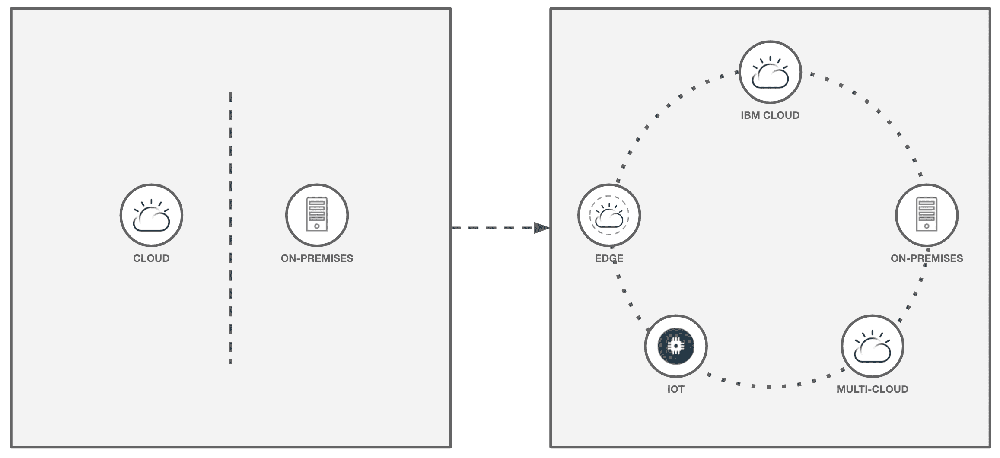

# 全新 IBM Cloud Satellite 分布式云的概述

> 原文：[`developer.ibm.com/zh/articles/overview-of-the-new-ibm-cloud-satellite-distributed-cloud/`](https://developer.ibm.com/zh/articles/overview-of-the-new-ibm-cloud-satellite-distributed-cloud/)

本文讨论了迁移到分布式云的动机和一个开始使用的新方法： IBM Cloud Satellite。

*分布式云*是指分散在多个地理位置的公有云服务，您可根据应用程序需求选择这些地理位置，但这些服务的操作和治理仍由单个公有云提供商集中控制。

在启动 [Cloud Satellite beta 程序](https://cloud.ibm.com/satellite?cm_sp=ibmdev-_-developer-articles-_-cloudreg)后，您可以在任何位置（IBM 公有云平台、本地或边缘）使用 IBM Cloud，并且可以通过单个控制点以服务形式提供 IBM Cloud。通过使用 Cloud Satellite，您可以专注于应用程序开发，而不必考虑平台差异。

## 公有云并不是套路

在过去十年里，公有云技术已经相当成熟。目前，在应用公有云的各种场景中，普遍认为公有云既可靠安全，又符合成本效益。公有云通常是开发者部署新应用程序的首选，也受到没有足够资金购买服务器机架的初创企业的青睐。企业也会使用公有云。根据 [IDG](https://www.idg.com/tools-for-marketers/2020-cloud-computing-study/) 提供的数据显示，有 81% 的企业会以某种方式使用云，有 55% 的企业当前正在使用多个公有云。但是，多年来，有几项研究调查表明，许多企业应用程序并没有迁移到公有云上，而是继续留在本地。为什么会这样？

值得注意的是，与技术行业相比，医疗、零售和银行业等非技术行业在采用云技术方面要相对落后一些。因为多种原因，使得这些行业中的企业无法将其工作负载迁移到公有云上。数据本地性要求（特别是对于医疗行业和银行业）和低延迟要求（特别是对于媒体和电信行业）都是常见的障碍。因此，大多数企业都在运行由本地环境和云环境组成的混合环境。目前，这种架构正逐步转变为包含多个公有云、数据中心和边缘组件的分布式环境。

但是，这种转变也会带来一些固有问题：

*   面向开发者和运维团队的公有云与本地环境之间不一致。
*   无法全面了解跨混合架构运行的应用程序。
*   无法在您需要的任何地方访问一流的公有云服务。
*   当尝试跨公有云、边缘和本地位置进行管理时，复杂性会增加。
*   无法在加快开发速度的需求与法规、安全性和合规性的现状之间取得平衡。

Cloud Satellite 可帮助您解决所有这些问题，让您保持“云不可知”思维模式，并在必要时继续使用本地环境。

## 全新 Cloud Satellite 分布式云的概述

此新产品的正式价值声明为：*IBM Cloud Satellite 可以在客户需要的**任何地方**提供 IBM Cloud 服务（在通过公有云控制的**单个窗格**中以服务形式提供）。*

Cloud Satellite 专为满足以下条件的企业设计：

*   具有跨越公有云、本地和边缘的复杂分布式环境。
*   希望获得简单的按需体验，以了解如何部署 AI、数据库、容器和对象存储器等核心应用程序服务。
*   希望将资源和技能都集中在业务上，而不必自行保护和管理这样的环境。
*   只需使用单个窗格来组织和管理跨环境的服务。

### Cloud Satellite 的工作原理

Cloud Satellite 将 IBM Cloud 控制面板的使用范围延伸到多个*位置*。位置是指 IBM 公有云之外可以运行服务和应用程序的地方。每个位置都配备了用于运行云服务和应用程序的*主机*。主机是指来自数据中心或边缘的 Red Hat Enterprise Linux 机器。位置将通过*链路*来连接到 IBM Cloud。

在以下视频中，开发大使 Sai Vennam 快速直观地概述了 Cloud Satellite 如何帮助您从任何位置管理关键应用程序。

[https://cdnapisec.kaltura.com/p/1773841/sp/177384100/embedIframeJs/uiconf_id/39954662/partner_id/1773841?iframeembed=true&playerId=kaltura_player&entry_id=1_grc4m2g2&flashvars[akamaiHD.loadingPolicy]=preInitialize&flashvars[akamaiHD.asyncInit]=true&flashvars[twoPhaseManifest]=true&flashvars[streamerType]=hdnetworkmanifest&flashvars[localizationCode]=en&flashvars[leadWithHTML5]=true&flashvars[sideBarContainer.plugin]=true&flashvars[sideBarContainer.position]=left&flashvars[sideBarContainer.clickToClose]=true&flashvars[chapters.plugin]=true&flashvars[chapters.layout]=vertical&flashvars[chapters.thumbnailRotator]=false&flashvars[streamSelector.plugin]=true&flashvars[EmbedPlayer.SpinnerTarget]=videoHolder&flashvars[dualScreen.plugin]=true&flashvars[Kaltura.addCrossoriginToIframe]=true&&wid=1_i9onaf69](https://cdnapisec.kaltura.com/p/1773841/sp/177384100/embedIframeJs/uiconf_id/39954662/partner_id/1773841?iframeembed=true&playerId=kaltura_player&entry_id=1_grc4m2g2&flashvars[akamaiHD.loadingPolicy]=preInitialize&flashvars[akamaiHD.asyncInit]=true&flashvars[twoPhaseManifest]=true&flashvars[streamerType]=hdnetworkmanifest&flashvars[localizationCode]=en&flashvars[leadWithHTML5]=true&flashvars[sideBarContainer.plugin]=true&flashvars[sideBarContainer.position]=left&flashvars[sideBarContainer.clickToClose]=true&flashvars[chapters.plugin]=true&flashvars[chapters.layout]=vertical&flashvars[chapters.thumbnailRotator]=false&flashvars[streamSelector.plugin]=true&flashvars[EmbedPlayer.SpinnerTarget]=videoHolder&flashvars[dualScreen.plugin]=true&flashvars[Kaltura.addCrossoriginToIframe]=true&&wid=1_i9onaf69)

### 注册主机

在 IBM 公有云中创建位置后，将生成一个要在主机上运行的脚本。通过运行此脚本，可以在新位置中注册您的主机。无需购买任何机架或设备，并且可以使用任何硬件。在注册主机后，您可以开始将 IBM Cloud 托管服务部署到该主机。

### 启用了 Cloud Satellite 的主机的可用服务

由于 IBM Cloud 是基于 Kubernetes 构建的，因此可以更轻松地将新的 IBM Cloud 服务引入到相关位置。启用了 Cloud Satellite 的主机将能够配置：

*   容器编排平台
*   托管的数据库
*   事件流服务
*   DevOps 工具

### Cloud Satellite 的优势

通过使用 IBM Cloud 作为分布式云的控制平面，可以跨环境进行一致的部署，并可以简化对云资源的管理，例如身份和访问管理、密钥管理（包括[自保管密钥](https://www.ibm.com/cloud/blog/announcements/keep-your-own-key-for-kubernetes-apps-with-highly-sensitive-data)）以及计费和计量。此外，企业还会受益于对应用程序和服务的集中观察，例如，使用 LogDNA 发送到 IBM Cloud Log Analysis 的日志记录数据，以及使用 Sysdig 发送到 IBM Cloud Monitoring 的监控数据。

## Cloud Satellite 和开源

作为开发者，我认为在构建企业软件的过程中必然会使用到开源软件。IBM [在开源方面具有悠久的历史并作出相应的承诺](https://www.ibm.com/opensource/story)，在构建 Cloud Satellite 方面也不例外。在设置方面，Cloud Satellite 使用 [Razee](https://razee.io/) 来管理配置，并使用 [Istio](https://www.ibm.com/cloud/istio) 来实现网状网络。在设置您的位置后，Cloud Satellite 将提供 [Red Hat OpenShift](https://www.ibm.com/cloud/openshift) 作为 Kubernetes 平台，并提供一些受欢迎的开源数据库作为选项。

## 结束语

如果贵企业关注的是数据本地性要求或低延迟要求，那么最好使用分布式云架构。考虑注册 [Cloud Satellite beta](https://cloud.ibm.com/satellite?cm_sp=ibmdev-_-developer-articles-_-cloudreg) 以测试该技术。

本文翻译自：[An overview of the new IBM Cloud Satellite distributed cloud](https://developer.ibm.com/articles/overview-of-the-new-ibm-cloud-satellite-distributed-cloud/)（2020-07-28）