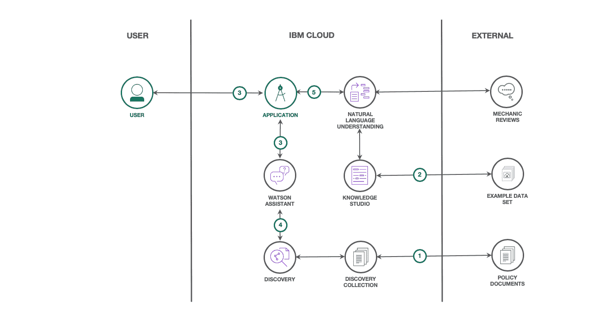
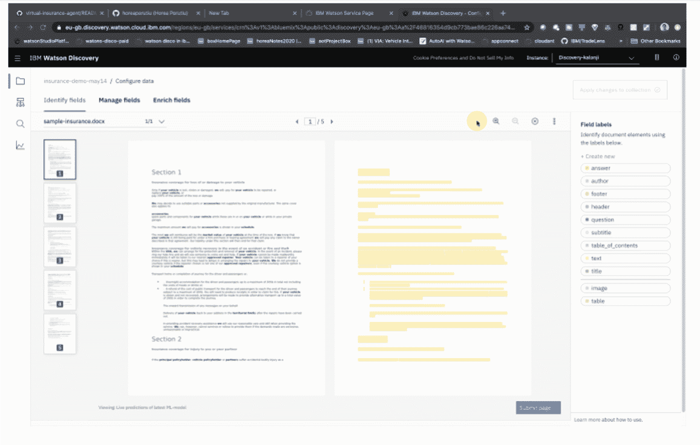
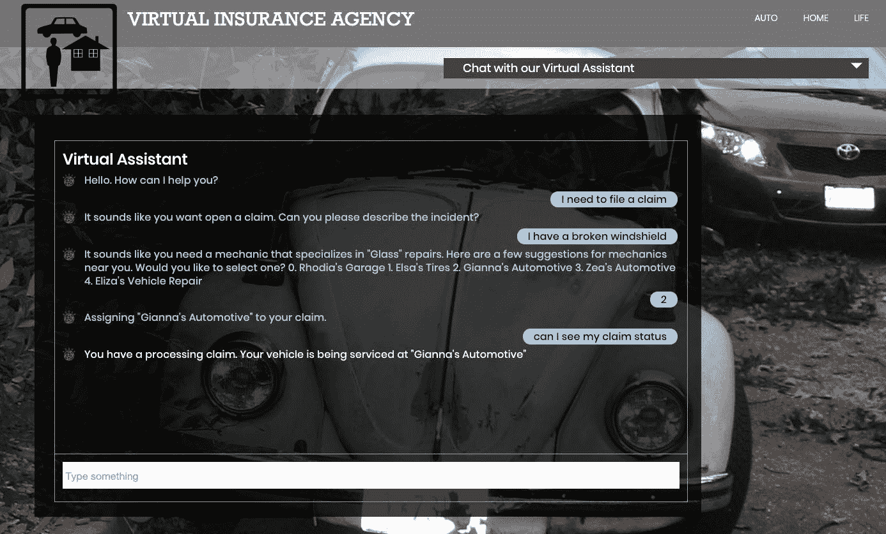

# 构建客户服务解决方案

> 原文：[`developer.ibm.com/zh/articles/insurance-industry-customer-care-solution/`](https://developer.ibm.com/zh/articles/insurance-industry-customer-care-solution/)

自助服务已成为许多行业的普遍趋势，这不仅是因为当前的健康危机，还因为公司需要提高其业务模型的效率，以便将有限的资源集中在更具战略性的复杂计划上。企业正在利用可用性和效率都在快速增长的人工智能 (AI) 服务来自动完成耗时的工作流程，并快速为客户提供帮助。

此解决方案演示了如何构建聊天机器人，该聊天机器人可以回答保单问题，可以帮助客户提交索赔申请，甚至可以根据所需的维修类型来推荐修理技师。以下演示展示了客户如何与虚拟助手进行互动。

在此解决方案中，汽车保险公司使用 AI 服务（IBM® Watson™ Discovery、Watson Knowledge Studio、Watson Natural Language Understanding 和 Watson Assistant）帮助客户管理保险索赔并及时获取汽车服务信息。客户可能很难理解汽车保单，因为保单的内容既复杂又冗长。而且，许多客户可能需要寻找信誉良好的修理技师。可以训练 AI 解决方案来汇总信息、过滤信息，并在需要时快速提供所需信息。

结合使用 Watson 技术，您可以：

*   帮助客户轻松过滤和查看与其当前需求相关的保单内容
*   帮助客户快速确定维修车辆的最佳人选
*   确定某个地区的汽车服务趋势，帮助设定或调整费用
*   确定客户需求并主动提供后续服务和附加服务

该解决方案使用 Watson Discovery 处理非结构化的保单文件以回答客户问题，使用 Watson Knowledge Studio 创建用于对修理技师评论进行分类的自定义模型，从而使保险索赔能够与相应的维修店类型匹配。它使用 Watson Natural Language Understanding 进行消费者情绪分析，从而对修理技师进行排名。

然后，将这些 Watson 服务与 Watson Assistant 集成以创建可添加到公司网站的自助式客户服务聊天机器人。客户可以与聊天机器人进行互动以获得所需的帮助，而无需等待坐席员。

## 架构流程

1.  开发者训练 Watson Discovery 识别保单文件。
2.  开发者收集领域语言示例并为其添加注释，然后将其发布到 Watson Natural Language Understanding 服务。
3.  客户加载 Web 应用程序并与 Watson Assistant 进行互动。
4.  Watson Assistant 将保单问题转发给 Watson Discovery 进行分析。
5.  Watson Assistant 将索赔说明转发给自定义 Watson Natural Language Understanding 模型进行分析。

虽然此内容的主题是围绕保险行业的，但是该框架可以应用于希望为客户提供自助选项的任何企业，例如健康和房屋保险。

此解决方案包含三个部分：

*   使用 Smart Document Understanding 处理、理解和回答保单问题
*   使用 Watson Natural Language Understanding 构建推荐引擎
*   构建可帮助处理索赔的虚拟保险助手

## 使用 Smart Document Understanding 处理、理解和回答保单问题

Watson Discovery 使用 AI 搜索技术来检索问题的答案。它包含语言处理功能，并且可以使用结构化和非结构化数据进行训练。用于训练 Watson Discovery 的数据包含在一个*集合*（即数据库）中。

第一步，该解决方案提取一个样本保险文件，并通过内置的 Smart Document Understanding 注解工具以使用保险文件的不同部分来训练 Watson。这样，您就可以分解文档，省略其中的某些部分并提高查询准确性。

您可以使用 Smart Document Understanding 工具提取文档中的自定义字段，这样您就可以自定义在 Watson Discovery 中对文档建立索引的方式，从而改进应用程序所返回的答案。

在[使用 Smart Document Understanding 处理、理解和回答保单问题](https://developer.ibm.com/zh/tutorials/analyze-and-answer-policy-questions-with-smart-document-understanding/)教程中，了解如何执行以下操作：

*   获取样本保单文件
*   通过上传保单文件来创建 Watson Discovery 集合
*   使用 Smart Document Understanding 来配置数据、为其添加注释并进行过滤，从而提高 Watson Assistant 响应的准确性，分解文档内容，过滤掉不必要的部分并为其添加注释
*   使用保险领域术语来训练 Watson Discovery
*   通过用自然语言询问基本保险问题，在 Watson Discovery 中测试模型

## 使用 Watson Natural Language Understanding 构建推荐引擎

Watson Knowledge Studio 可使用自定义模型向 Watson 传授特定于领域的语言，这些自定义模型可以识别非结构化文本中特定行业所特有的实体和关系。Watson Natural Language Understanding 使用深度学习从文本中提取元数据（例如实体、关键字和类别）。

在[使用 Watson Natural Language Understanding 构建推荐引擎](https://developer.ibm.com/zh/tutorials/build-a-recommendation-engine-with-watson-natural-language-understanding/)教程中，您将通过执行以下操作来扩展第一个教程：

*   收集并上传用于描述汽车损坏和维修的文本文档
*   使用 Watson Knowledge Studio 为汽车维修店评论添加注释和对其进行分类
*   训练机器学习模型，使其能够确定特定汽车维修的最佳维修店
*   通过将模型部署到 Watson Natural Language Understanding 云实例来测试模型

## 构建可帮助处理索赔的虚拟保险助手

要完成该解决方案，您需要将 Watson 服务与 Watson Assistant 集成以创建自助式客户服务聊天机器人。

Watson Assistant 使用 Watson Discovery 查询功能来帮助回答客户的保单问题。聊天机器人使用 Watson Natural Language Understanding 和自定义领域语言模型来帮助处理索赔并推荐修理技师。

在[构建可帮助处理索赔的虚拟保险助手](https://developer.ibm.com/zh/patterns/build-a-virtual-insurance-assistant-to-process-insurance-claims/) Code Pattern 中，您将通过执行以下操作来完成解决方案：

*   通过导入 Watson Assistant 对话技能来创建对话
*   将 Watson Discovery 实例与虚拟保险助手集成，以便助手可以通过 Watson Discovery 训练模型来搜索答案
*   部署应用程序并测试聊天机器人

本文翻译自：[Build a customer care solution](https://developer.ibm.com/components/watson-apis/articles/insurance-industry-customer-care-solution)（2020-06-29）