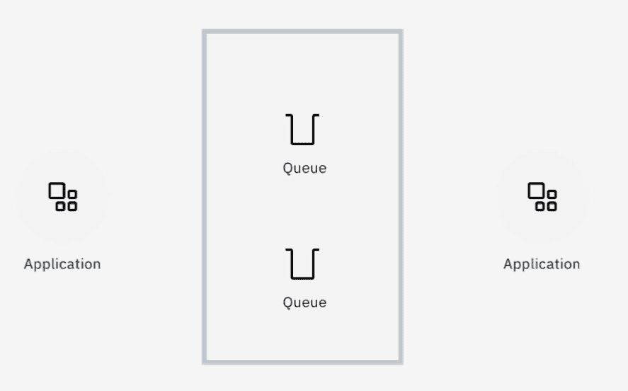
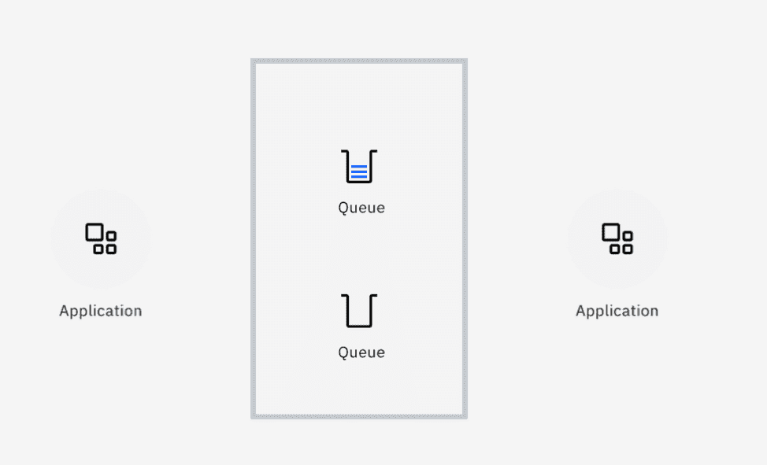
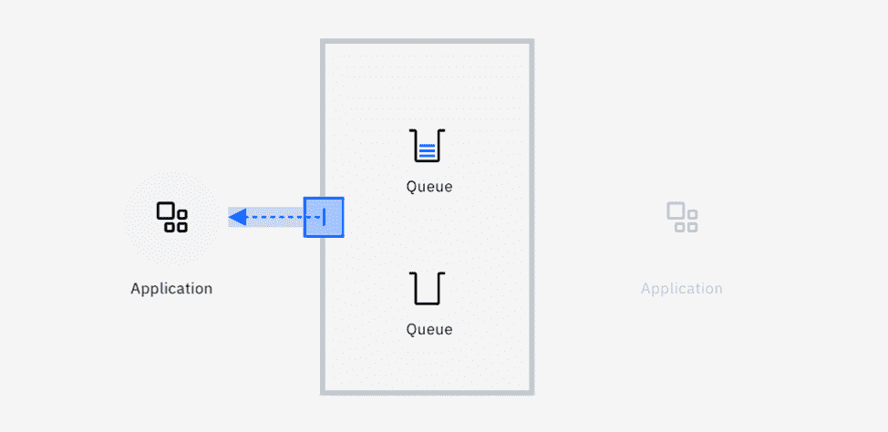
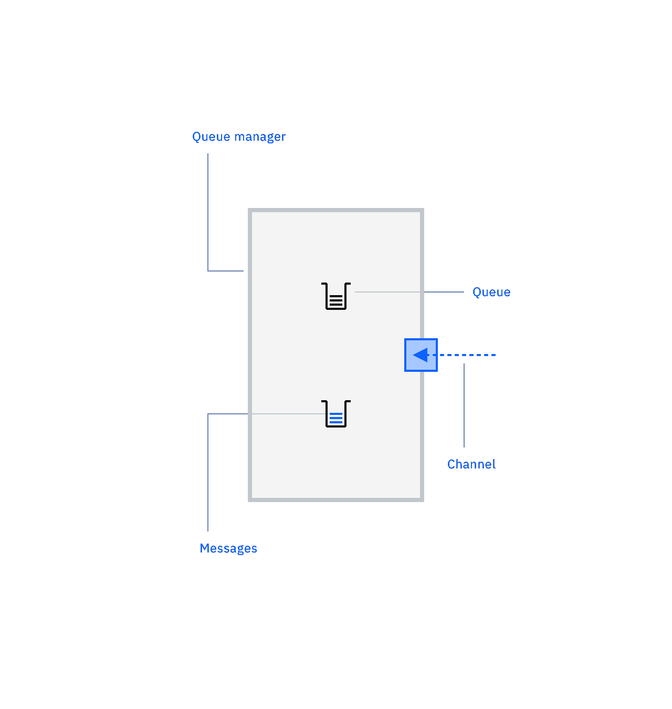
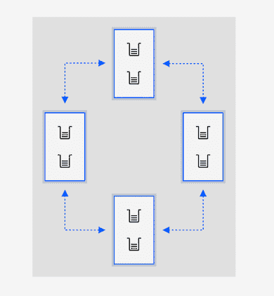
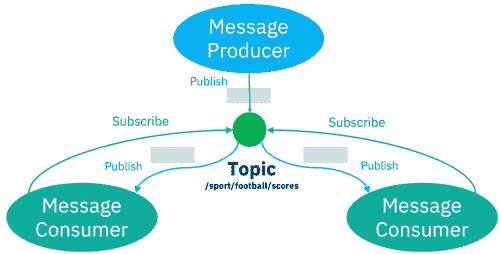

# IBM MQ 基础知识

> 原文：[`developer.ibm.com/zh/articles/mq-fundamentals/`](https://developer.ibm.com/zh/articles/mq-fundamentals/)

##### 学习路径：IBM MQ Developer Essentials 徽章

本文是 IBM MQ Developer Essentials 学习路径和徽章的一部分。

*   IBM MQ 基础知识（本文）
*   借助 MQ on Containers、MQ on Cloud、MQ on Ubuntu 或 MQ on Windows 快速启动并运行队列管理器。
*   准备使用 Java 编写代码
*   接受消息传递编码挑战
*   调试应用程序或环境

IBM MQ 是一个强大且安全可靠的消息传递解决方案。它可以简化并加速跨多个平台的不同应用程序的集成，并且支持多种 API 和语言。

IBM MQ 使应用程序能够以可靠且可扩展的方式进行通信和交换数据，从而使一个应用程序与另一个应用程序解耦。通过这种方式，MQ 可以帮助集成在不同框架、语言、平台、云和位置上运行的应用程序。您可以按照自己的方式编写应用程序，因为您知道 MQ 可以解决问题，并将这些应用程序集成起来。

IBM MQ 允许服务器基础架构跨越数据中心、大型机和云框架。IBM MQ 能够以软件和硬件两种方式实现，在独立应用程序之间提供企业级通信。此外，它还降低了开发这些应用程序的复杂性。

## IBM MQ 如何简化应用程序之间的通信方式？

在两个或多个应用程序之间搭建消息传递基础架构意味着这些应用程序不能直接通信。实际上，它们通过中间件进行交互。

更具体地说，就是一个应用程序将另一个应用程序的信息放置在消息中，而消息被放置在消息队列中。

因此，消息传递不需要应用程序同时可用，因为可以使用队列。这种模型称为异步消息传递。

无论是一个应用程序掉线，还是它比另一个应用程序速度慢，消息队列可以处理双方的不稳定性，从而提供“减震功能”。

## IBM MQ 基础知识

让我们来看看有助于了解 IBM MQ 的一些关键概念。

### 消息、队列和通道

**消息** 是应用程序生产和使用的数据包。

**队列** 是可寻址的位置，用于传递消息和在需要使用前可靠地存储消息。

**队列管理器** 是托管队列的 MQ 服务器。

**通道** 是队列管理器相互之间以及与应用程序之间进行通信的途径。

### MQ 网络

**MQ 网络**是相互连接的队列管理器的松散集合，所有网络协同工作以在应用程序和位置之间传递消息。

### MQ 集群

**MQ 集群**是队列管理器的紧密耦合，可实现更高级别的扩展和可用性。

## IBM MQ 消息传递模式

IBM MQ 支持以下消息传递模式：

*   点对点消息传递
*   发布/订阅消息传递

### 点对点消息传递

这种消息传递模式是基于消息队列的概念以及单个使用者处理消息而构建。

在点对点模式中，消息生产者被称为发送者，消息使用者则被称为接收者。发送者将消息生成到队列，而接收者异步使用该队列中的消息。

要使用点对点模式，相互连接的应用程序需要知道它们进行交互时所使用的队列名称。

一个队列可以有一个接收者，也可以扩展为多个接收者，在第二种情况下，每条消息只能由一个接收者使用，因此需要将工作负载分发给各个接收者。

### 发布/订阅消息传递

在这种消息传递模式中，会将消息副本传递给所有感兴趣的使用应用程序。

消息生产者被称为发布者，消息使用者被称为订阅者。基础架构内的发布和订阅应用程序共同协商主题名称。如果使用者示意希望接收有关该主题的消息，需要对该主题创建订阅。

发布到主题的任何消息都将被传递给所有订阅，因此每个订阅者都会得到一份副本。每个主题都可能有很多发布者和订阅者，MQ 负责处理所有主题之间的消息传递。

## IBM MQ 语言支持和功能

MQ 支持的语言和运行时非常广泛，您可以使用几乎任何语言或运行时进行开发。以下是受支持的语言和运行时：

*   [Java](https://github.com/ibm-messaging/mq-dev-patterns/tree/master/JMS)
*   [Node.js](https://github.com/ibm-messaging/mq-dev-patterns/tree/master/Node.js)
*   [COBOL](https://www.ibm.com/support/knowledgecenter/en/SSFKSJ_9.1.0/com.ibm.mq.dev.doc/q023750_.htm)
*   [C](https://www.ibm.com/support/knowledgecenter/en/SSFKSJ_9.1.0/com.ibm.mq.dev.doc/q027270_.htm)
*   [Go](https://github.com/ibm-messaging/mq-dev-patterns/tree/master/Go)
*   [.NET](https://github.com/ibm-messaging/mq-dev-patterns/tree/master/dotnet)
*   [Python](https://github.com/ibm-messaging/mq-dev-patterns/tree/master/Python)
*   [Ruby](https://github.com/mqlight/ruby-mqlight)
*   [C#](https://github.com/ibm-messaging/mq-dev-patterns/tree/master/dotnet)

MQ 支持多种 API：

*   JMS
*   [MQI](https://www.ibm.com/support/knowledgecenter/en/SSFKSJ_9.1.0/com.ibm.mq.dev.doc/q025710_.htm)
*   [MQ Light](https://github.com/mqlight)

MQ 还支持多种消息传递协议：

*   [MQ](https://www.ibm.com/support/knowledgecenter/en/SSFKSJ_9.1.0/com.ibm.mq.pro.doc/q001020_.htm)
*   [AMQP](https://www.ibm.com/support/knowledgecenter/en/SSFKSJ_9.1.0/com.ibm.mq.dev.doc/amqp_protocol.htm)
*   [MQTT](https://www.ibm.com/support/knowledgecenter/en/SSFKSJ_9.1.0/com.ibm.mq.pro.doc/q001030_.htm)
*   REST

MQ 还覆盖了许多操作环境：

*   [云](https://cloud.ibm.com/catalog/services/mq?cm_sp=ibmdev-_-developer-articles-_-cloudreg)
*   [容器](https://github.com/ibm-messaging/mq-container)
*   [Linux](https://www.ibm.com/support/knowledgecenter/en/SSFKSJ_9.1.0/com.ibm.mq.ins.doc/q129380_.htm)
*   [Windows](https://www.ibm.com/support/knowledgecenter/en/SSFKSJ_9.1.0/com.ibm.mq.ins.doc/q008670_.htm)
*   [AIX](https://www.ibm.com/support/knowledgecenter/en/SSFKSJ_9.1.0/com.ibm.mq.ins.doc/q008321_.htm)
*   [IBM i](https://www.ibm.com/support/knowledgecenter/en/SSFKSJ_9.1.0/com.ibm.mq.ins.doc/q008329_.htm)
*   [HP-UX](https://www.ibm.com/support/knowledgecenter/en/SSFKSJ_9.0.0/com.ibm.mq.ins.doc/q008324_.htm)
*   [HPI NonStop](https://www.ibm.com/support/knowledgecenter/en/SSFKSJ_9.1.0/com.ibm.mq.ins.doc/q008322_.htm)
*   [z/OS](https://www.ibm.com/support/knowledgecenter/en/SSFKSJ_9.1.0/com.ibm.mq.ins.doc/q009640_.htm)
*   [Solaris](https://www.ibm.com/support/knowledgecenter/en/SSFKSJ_9.1.0/com.ibm.mq.ins.doc/q008327_.htm)

## 结束语

关于 IBM MQ 您需要记住哪些内容？有三个主要优点：

*   **MQ 提供有保证的数据传输。** 信息丢失或重复可能会导致重大问题。比如银行转帐或交易：这些业务要求消息传递有且只有一次。MQ 在确保数据不会丢失或重复方面是全球领先的解决方案。MQ 系统拥有久经验证的可靠性，能够将这些关键消息集成到交易型交换中，从而保证数据不会丢失或重复。

*   **MQ 可以水平扩展。** 随着单个队列管理器工作负载的增加，它可以轻松添加更多队列管理器来共同分担任务，并将消息分发到各个管理器。MQ 集群甚至可以将消息智能路由到需要的位置。全球各地都在使用可水平扩展的 MQ 系统，每天能够处理数十亿条消息。

*   **MQ 具有高可用性。** 消息数据非常重要，MQ 通过支持在系统之间复制这类数据，以及自动重新启动在其他位置托管这些消息的队列管理器，能够确保消息数据始终高度可用。再结合一组紧密聚集的队列管理器（可以提供相同的队列和主题），您就将获得一个持续可用的系统。

本文翻译自：[IBM MQ fundamentals](https://developer.ibm.com/components/ibm-mq/articles/mq-fundamentals)（2020-06-23）