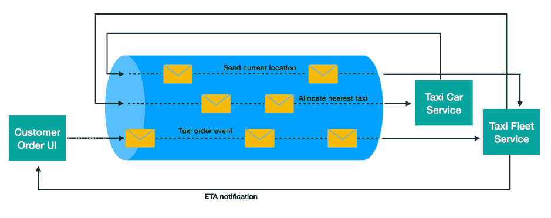
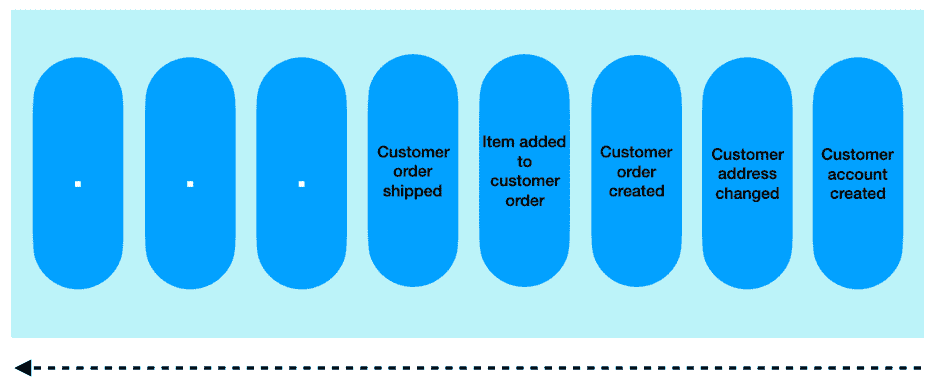

# 事件驱动架构的优势

> 原文：[`developer.ibm.com/zh/articles/advantages-of-an-event-driven-architecture/`](https://developer.ibm.com/zh/articles/advantages-of-an-event-driven-architecture/)

我们每天产生的数据量正在呈指数级增长。无论数据是来自传感器的更新、网站上的点击还是系统更改之类的内部输入，应用程序都应当能够处理这些永无休止的新事件流。那么我们能否以将事件置于系统核心的方式来设计应用程序的架构？此外，这种架构能给我们带来什么好处？

在本文中，我们将探讨这些问题，包括什么是事件驱动架构 (EDA) 以及该架构模式如何将事件置于系统的核心。然后，我们将探讨实现这种架构模式的几个最重要的优点。

## 什么是事件？

首先来解释一下什么是事件。事件是指对已经发生的事情、状态变化等等的记录。它们是不可变的（无法更改或删除），并且按其创建顺序排序。相关各方可以通过订阅已发布的事件来获取有关这些状态变化的通知，然后使用所选择的业务逻辑根据这些信息采取操作。

## 什么是事件驱动架构？

要了解有关微服务及其含义的更多信息，请查看我们的“微服务介绍”。

事件驱动架构是指松散耦合的微服务的系统，这些微服务通过生产和消费事件来相互交换信息。通过事件驱动系统，可以将消息摄入到事件驱动生态系统中，然后广播给任何有兴趣接收消息的服务。

为了更好地说明事件驱动架构，我们来看一个事件驱动架构的示例。下图显示了一个简化的出租车叫车场景。在此图中，该场景可能涉及 3 个微服务：一个供客户呼叫出租车的 UI 服务，一个将出租车分配给订单的车队服务，以及一个收集有关个体出租车的数据（例如其当前位置）的出租车服务。图中心的圆柱体链接了不同的微服务，代表了系统中事件驱动的消息传递主干（可以使用 Apache Kafka 之类的软件来实现）。图中的箭头表示系统内事件的流向（并进而表示状态的变化）。此流程可以解释如下：

*   客户通过 Customer Order UI（客户订单用户界面）发出一个出租车订单。该 UI 捕获客户的当前位置、姓名等信息。
*   Taxi Fleet Service（出租车队服务）订阅了`taxi order` 事件。
*   Taxi Car Service（出租车服务）从各个出租车收集数据，例如每辆出租车的当前位置，并发送 `send current location` 事件。
*   订阅了 `send current location` 事件的 Taxi Fleet Service 将位置最近的出租车分配给客户并发送 `allocate nearest taxi` 事件。
*   Taxi Car Service 订阅 `allocate nearest taxi` 事件，并提醒司机需要去接客户。
*   Taxi Fleet Service 可以持续监视出租车的位置，并通过 ETA 通知为客户更新 UI。

事件驱动架构利用消息传递主干将消息从生产者传递到消费者。该消息传递主干可以基于传统的发布-订阅消息代理（例如 IBM MQ）或分布式日志（例如 Apache Kafka）。发布-订阅消息代理允许多个消费者订阅成组的消息。消息通常会在所有订户都收到后删除。与之相反，日志是无限制的有序事件集。消费者使用偏移量来跟踪他们在流中的位置。在事件流中，事件是可重放的，因为理论上可以无限期地保留数据。这意味着新的消费者可以选择订阅事件，如果愿意，他们可以从头开始读取日志。

选择事件系统将取决于特定用例的性质。持久化、事件的大小和频率或生产者的性质（例如 IoT 传感器）等因素都是驱动因素。

## 使用事件驱动架构带来的优势

许多现代应用程序正在迅速支持事件驱动架构。为什么会这样？这些架构能提供什么好处？

事件驱动架构是一种架构方法。在任何平台上以任何语言编写的应用程序都可以使用这种架构模式。在这里，我们将探讨采用事件驱动架构的一些优势。

### 真正将生产者和消费者解耦

使用事件驱动架构的系统会将系统中的组件解耦，从而按域将数据所有权分离。利用这种解耦，可以在事件的生产和消费之间实现逻辑分离。

*   生产者无需关注自己生产的事件将如何被消费（因此可以添加更多消费者而不影响生产者）。
*   消费者无需关注事件的生产方式。

由于这种松散的耦合，微服务可以用不同的语言实现或使用适合特定工作的不同技术。因此，事件数据的编码无关紧要，可以是 JSON、XML、Avro，等等。

通过解耦应用程序的组件，组件可以在整个网络中彼此独立地轻松缩放扩展。开发者可以通过动态添加或删除事件生产者和消费者来修改其系统，而无需更改任何微服务中的任何逻辑。

任何生产服务都不需要了解使用它们所生产的事件的服务。同样，当任何服务消费消息时，它们只需要订阅事件流。

在上面的示例图中，我们可以轻松添加一个 Taxi Finance Service（出租车金融服务），该服务订阅 Taxi Car Service 事件并收集数据，其中可能包括燃料消耗情况。借助这项附加的微服务，Taxi Car Service 可以提供最优费用或发送有关驾驶员效率的新事件，Taxi Fleet Service 可以将这两者用作向驾驶员分配订单时的考虑因素。

### 弹性

事件驱动架构提供的组件之间的松散耦合还意味着服务无需担心其他服务的状态或运行状况。这种松散的耦合在系统内提供了一定程度的弹性，因此，如果一个微服务宕机而无法正常运作，该应用程序仍然可以继续运行。实现这一点的方式是，将事件存储在消息传递主干中，这样消费服务可在这个微服务恢复时获取这些事件。

尽管弹性并非事件驱动架构所独有，但事件到达方式的性质还带来了额外的优势。事件是异步的，这意味着事件在发生后就会被发布。服务将事件作为无限制的流进行消费，并且服务会跟踪事件的去向。因此，如果服务发生故障，可以从事件流入的位置获取事件，并在必要时重放可能已失败的事件。生产服务不受影响，可以继续生产事件。这与 REST 架构不同，REST 架构是同步的，因此必须启动对等服务，并且必须实现重试逻辑以应对网络故障。

要详细了解边缘计算，请查看“边缘计算架构和用例”一文。

例如，事件驱动架构在边缘设备容易脱机的情况下很有用。一旦边缘设备恢复正常，事件仍可以由客户端处理。以船运行业为例，让我们看一下智能船运集装箱。智能船运集装箱能够收集和分析有关集装箱健康状况的遥测数据，并定期将摘要数据发送回中央枢纽。船上的网络往往不太稳定可靠，因此，如果您在船上装有一些智能船运集装箱，即使这些集装箱离线，一旦它们重新联机之后，岸上的消费者仍然可以接收到消息。同样，如果您需要从岸上将某些更新发送到边缘，边缘服务重新联机后仍会收到这些更新。

### 基于推送的消息传递

在基于拉取（pull-based）的消息传递系统中，存在请求/响应机制。客户端会定期轮询消息。而事件驱动系统由于存在中介代理可以轻松进行基于推送的消息传递。

在事件驱动架构中，客户端无需轮询即可接收更新。可以在更新发生时接收更新，这对于实时数据转换、分析和数据科学过程来说是一个强大的功能。

在与客户端交互的 Web 服务示例中，客户端希望立即获得结果。无需持续轮询，事件一旦到达就将被推送。由于服务不再需要轮询，因此根据工作负载的类型，网络 I/O 也会减少。

### 商业叙事历史

我们可能都熟悉“单一事实来源”这个词（构造信息模型和关联数据，以便每个数据元素仅在一个位置进行编辑的做法）。通过使用事件驱动生态系统，您可以实现“单一事实来源”。

如上所述，事件流应该是事实的不变流，其中每个事实由流中的一个事件表示。每当实体状态发生变化时，都会发出一个新事件。这非常能够代表我们的日常生活如何通过一系列事件来发展演变。对于业务数据治理，这种“商业叙事”是一个优势，因为它可以保留系统中发生的所有事件的日志以供审核或用作参考。

公司越来越需要解释其“数据派生的”决策，例如解释为什么客户的融资或保险申请被拒绝。事件驱动架构可以通过实施[事件溯源](https://developer.ibm.com/articles/event-sourcing-introduction)之类的模式来提供不可变事件的日志，这是此审核的关键组成部分。如前所述，事件日志可以重放，并且此功能可用于说明决策的理由或纠正服务中导致数据损坏的缺陷。

### 适用于数据科学的实时事件流

事件驱动架构特别适合事件流，通过这种流内处理，企业可以快速制定决策，抓住稍纵即逝的宝贵机会。事件流处理使应用程序能够即时响应不断变化的业务解决方案，并根据所有可用的当前和历史数据实时做出决策。现在，可以将应用程序中的业务逻辑应用于动态数据，而无需等待数据放到某个地方后再进行分析。这种实时分析非常适合诸如欺诈检测、预测分析、即时解决安全威胁、自动化供应链等问题。

### 加快机器学习和数据科学进入生产环境的进程

最后，事件驱动架构提供了一种有效的方法，可以加快机器学习模型从开发到投入生产的进程。目前，将机器学习操作部署到生产中是该领域最大的挑战之一。

使用事件主干的机器学习操作模式（例如 [Rendezvous Architecture](https://towardsdatascience.com/rendezvous-architecture-for-data-science-in-production-79c4d48f12b)）允许针对数据同时测试多个模型，并能够在正确的时间提供最合适的模型。模型可以消费业务事件，然后将结果实时广播到另一个服务，该服务可以基于一组围绕速度、预测的准确性等设定的业务标准来选择要提供的模型。

由于可以不断测试和改进模型，因此这种架构允许实现速度更快的迭代式开发，可以在生产中快速部署。此外，由于事件的不变性，机器学习决策过程是可审核的。

## 结束语及后续步骤

本文概述了采用事件驱动方法进行软件开发的一些关键原因。使用事件驱动架构，可以构建一种基于微服务的弹性架构，这种架构真正做到了去耦合，从而为开发生命周期提供更高的敏捷性和灵活性。微服务之间的松散耦合是使用这种架构类型的主要好处之一（尤其是对于云原生应用程序），因此事件驱动架构被公认为微服务实现的最佳实践也就不足为奇了。

为了提高分析能力，事件驱动架构提供了通过事件流处理进行时间关键型决策的机会，并加快了机器学习操作进入生产阶段的步伐。我们还谈到了作为一项业务，它如何提供不可变且可审核的稳健的业务事件事实来源。

### 如何开始使用事件驱动架构

将应用程序转换为事件驱动架构样式显然带来了很多优势，解决了组织目前面临的一些关键问题，例如可审核性、成本和组织灵活性。但是，最大的挑战往往在于知道从何处下手。

要了解如何构建事件驱动应用程序，请查看 IBM Cloud Architecture 中的[参考架构、资源、代码模式和字段指南](https://www.ibm.com/cloud/architecture/architectures/eventDrivenArchitecture)。

另外，请查看新的事件驱动解决方案加速器，其中包括一个仅含示例代码的参考蓝图，可让您快速地完成事件驱动应用程序从设计到部署的过程。在我们的“[以闪电般速度设计和交付事件驱动云原生应用程序](https://developer.ibm.com/tutorials/accelerator-for-event-driven-solutions/)”教程中详细阅读关于 IBM Cloud Pak for Integration Accelerator 的内容。

### 事件驱动架构与 IBM

IBM 提供了诸如 [IBM Event Streams](https://www.ibm.com/cn-zh/cloud/event-streams) 等产品，可以用于设计事件驱动应用程序和系统的架构。IBM Event Streams 是一个事件流平台，基于开源 [Apache Kafka](https://kafka.apache.org/) 构建，旨在简化任务关键型工作负载的自动化。使用 IBM Event Streams，组织可以快速部署企业级事件流技术。

免费试用作为受管服务的 [Event Streams on IBM Cloud](https://www.ibm.com/cn-zh/cloud/event-streams)，或者在 Red Hat OpenShift Container Platform 上的 [IBM Cloud Pak for Integration 中部署您自己的 Event Streams 实例](https://www.ibm.com/cn-zh/cloud/cloud-pak-for-integration/event-streaming)。后者为 Apache Kafka 增添了宝贵的功能，包括强大的操作工具、模式注册表，屡获殊荣的用户体验以及广泛的连接器目录，可以支持与广泛的核心企业系统的连接。

### 反应式系统和 IBM

事件驱动架构引入的附加弹性和可伸缩性还有助于增强反应式系统的质量，因此在实现反应式应用程序时经常使用此模式。如果您想深入了解反应式系统的信息，可以下载免费的电子书“[反应式系统解析](https://ibm.biz/reactivereport)”，也可以查看“[反应式系统入门](https://developer.ibm.com/articles/reactive-systems-getting-started)”一文。

您还可以尝试在 openliberty.io（我们的轻量级开源 Web 应用程序服务器）上尝试我们的指南“[创建反应式 Java 微服务](https://openliberty.io/guides/microprofile-reactive-messaging.html)”，以探索如何将自己的应用程序转换为更具反应性。本指南向您介绍 [MicroProfile 反应式消息传递规范](https://download.eclipse.org/microprofile/microprofile-reactive-messaging-1.0/microprofile-reactive-messaging-spec.pdf)。或者，您也可以查看“[反应式编程实战](https://developer.ibm.com/series/reactive-in-practice)”教程系列，其中介绍了将 Stock Trader 应用程序转换为反应式系统的详细步骤。

如果您希望开始构建反应式系统，但又希望为您的企业应用程序使用受支持的运行时，我们也通过 Red Hat 运行时产品服务提供了多种选项，包括各种反应式 API，有 [OpenLiberty](https://openliberty.io/) 和 [MicroProfile](https://microprofile.io/)，也有 [Vert.x](https://vertx.io/) 和 [Quarkus](https://quarkus.io/)。这些 API 均作为我们的 [IBM Cloud Pak for Applications](https://www.ibm.com/cn-zh/ cloud/cloud-pak-for-applications) 产品服务的一部分来提供。

本文翻译自：[Advantages of event-driven architecture](https://developer.ibm.com/articles/advantages-of-an-event-driven-architecture/)（2020-06-18）