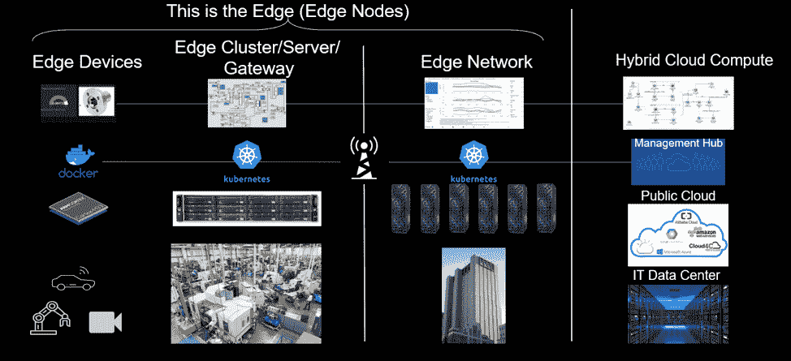
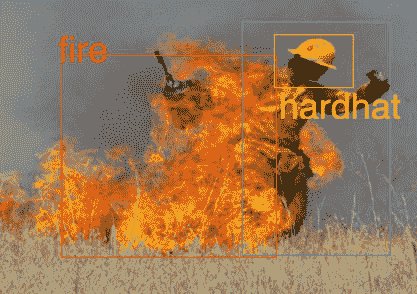
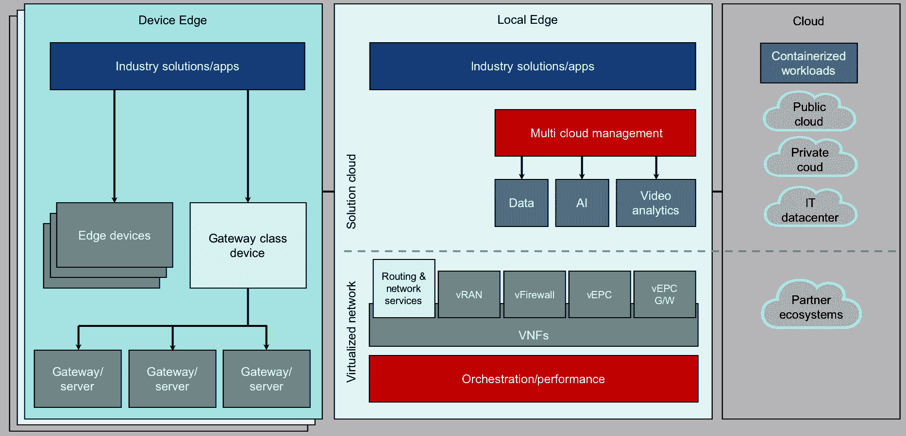
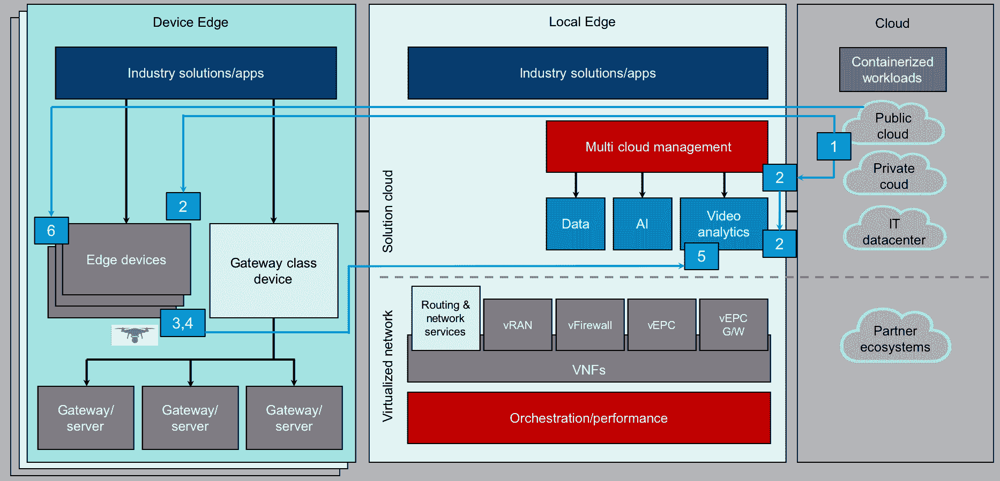

# 边缘计算架构和用例

> 原文：[`developer.ibm.com/zh/articles/edge-computing-architecture-and-use-cases/`](https://developer.ibm.com/zh/articles/edge-computing-architecture-and-use-cases/)

##### 实施边缘计算架构

本文是本系列文章的第 3 部分。

*   边缘计算架构和用例（本文）
*   在应用层和设备层构建边缘
*   为边缘应用构建和部署 5G 网络服务

对于当今的许多企业（尤其是电信和媒体公司）来说，开发的新服务若能利用边缘计算和 5G 等新兴技术，必将会为他们创造更多收入。IBM 与许多电信公司合作，帮助探索这些新技术，让他们能够更深入地了解这些技术与当前及未来的业务挑战有着怎样的关系。

令人欣慰的是，可信技术生态系统的不断演变为边缘计算奠定了基础。本文将解释什么是边缘计算，讲解电信和媒体行业的相关用例，以及其他行业可获得的好处，最后还将介绍集成边缘计算的端到端架构的面貌。

## 什么是边缘计算？

边缘计算由利用传统和云数据中心之外可用计算资源的技术组成，可使工作负载的所在位置更接近数据的创建位置，并且可以根据数据分析结果及时地采取操作。通过利用和管理可在远程场所（例如工厂、零售店、仓库、酒店、配送中心或车辆）使用的计算能力，开发者可以创建相应的应用程序来实现以下目标：

*   显著减少延迟
*   降低对网络带宽的需求
*   增加敏感信息的隐私性
*   即使网络中断也可正常运作

在将应用程序工作负载移到边缘时，可能需要多个边缘节点，如图 1 所示。

##### 图 1\. 边缘节点示例

以下是构成边缘生态系统的一些关键组件：

*   **云**
    这可以是公共云或私有云，可以是基于容器的工作负载（如应用程序和机器学习模型）的存储库。这些云还托管并运行用于编排和管理不同边缘节点的应用程序。边缘工作负载（本地和设备工作负载）将与这些云上的工作负载进行交互。云还可以是其他节点所需的任何数据的源和目标。

*   **边缘设备**
    边缘设备是一种专用的装置部件，它同时也具有集成到该设备中的计算能力。在边缘设备上可以执行很多有趣的工作，例如，工厂车间的装配机械、ATM、智能相机或汽车等设备。边缘设备通常受到经济因素的驱动，计算资源一般都比较有限。具有 ARM 或 x86 类 CPU（单核或双核）、128 MB 内存以及 1 GB 本地持久存储器的边缘设备比较常见。尽管边缘设备功能更强大，但目前它们还没有成为规范，而只是作为特例现象存在。

*   **边缘节点**
    边缘节点是指可以在其上执行边缘计算的任何边缘设备、边缘服务器或边缘网关的通用方式。

*   **边缘集群/服务器**
    边缘集群/服务器是位于远程运营设施（例如工厂、零售店、酒店、配送中心或银行）中的通用 IT 计算机。边缘集群/服务器通常由工业 PC 或机架式计算机构成。具有 8 核、16 核或更多核计算能力、16GB 内存和数百 GB 本地存储器的边缘服务器比较常见。边缘集群/服务器通常用于运行企业应用程序工作负载和共享服务。

*   **边缘网关** 边缘网关通常是边缘集群/服务器，除了能够托管企业应用程序工作负载和共享服务外，还具有可执行网络功能的服务，例如协议转换、网络终止、隧道技术、防火墙保护或无线连接。尽管某些边缘设备可以充当有限的网关或主机网络功能，但是边缘网关通常会与边缘设备分开。

IoT 传感器是固定功能的设备，可收集数据并将其传输到边缘/云，但没有板载计算、内存和存储。因此，无法在其上部署容器。这些边缘设备会连接到不同的节点，但由于它们是固定功能的设备，因此未在图 1 中反映出来。

在对边缘计算有了基本了解后，让我们先简要地讨论一下 5G 及其对边缘计算的影响，然后再讨论边缘计算存在的优势和面临的挑战。

## 边缘计算和 5G

5G 的出现使得边缘计算更加引人注目，这显著提高了网络容量、降低了延迟、提高了速度，也提升了效率。5G 的数据传输速度有望超过 20 Gbps，并且每平方公里能够连接超过一百万个设备。

通信服务提供商 (CSP) 可以使用边缘计算和 5G，以更加安全、高效的方式将用户流量路由到最低延迟的边缘节点。借助 5G，CSP 还可以满足下一代应用（如自动驾驶汽车、无人机或远程病人监护）的实时通信需求。通过结合使用 5G 和边缘计算，需要将大量数据上传到云的数据密集型应用程序可以更有效地运行。

随着 5G 和边缘计算的出现，开发者将需要继续着力于提高本地云应用程序的效率。随着持续增添更小的新型边缘设备，企业将需要对现有应用程序进行更改，以便能够充分利用 5G 和边缘计算的功能。在某些情况下，需要将应用程序容器化并在非常小的设备上运行。在另一些情况下，则需要重新设计虚拟化网络组件，才能充分利用 5G 网络。在制定应用程序开发路线图和未来架构时，还需要评估许多其他情况。

## 边缘计算存在的优势和面临的挑战

作为新兴技术，5G 和边缘计算为许多行业带来了很多好处，但同时也带来了一些挑战。

### 核心优势

边缘计算技术具有以下核心优势：

*   **性能：** 在边缘进行近乎即时的计算和分析可降低延迟，从而大大提高性能。随着 5G 的到来，与边缘快速通信成为可能，在边缘运行的应用程序也可以快速响应消费者不断增长的需求。

*   **可用性：** 关键系统需要持续运行，而不考虑连接性。当前的通信流程存在许多潜在的故障点。这些故障点包括公司的核心网络、跨多个网络节点的多个跃点及网络路径的安全风险，以及许多其他故障点。对于边缘计算，由于主要在消费者/请求者与设备/本地边缘节点之间进行通信，因而提高了系统的可用性。

*   **数据安全：** 在边缘计算架构中，分析数据可能永远不会离开在本地边缘内收集和使用该数据的物理区域。 仅边缘节点需要从根本上予以保护，这更便于管理和监视，也意味着数据更加安全。

### 其他优势及其他挑战

以下其他优势也伴随着其他一些挑战，例如：

*   大规模管理
*   使工作负载可移植
*   安全性
*   新兴技术和标准

#### 大规模管理

如果在您纳入边缘计算时工作负载位置发生变化，并且以更加分散的方式部署应用程序和分析功能，为了进行扩展，就需要使用编排和自动化工具，这样才能在架构上以一致的方式管理此更改。

例如，如果将应用程序从一个具有永续支持的数据中心转移到本地边缘的 100 多个不易访问的位置，或者不在具有这种本地技术支持的位置中，那么管理生命周期和支持应用程序的方式就必须更改。

为了应对这一挑战，就需要使用新工具并对技术支持团队进行培训，以便管理、编排和自动运行这个新的复杂环境。传统网络运营工具对团队来说已经力有不逮（甚至超出软件定义网络运营工具范畴），支持团队将需要别的工具来帮助管理各种分布式环境中网络背景下的应用程序工作负载（远远多于先前），而每个工具都有不同的优势和功能。在本系列的后续文章中，我们将更详细地介绍这些应用程序和网络工具。

#### 使工作负载可移植

为了实现大规模运行，就需要对考虑用于边缘计算本地化的工作负载加以修改，从而提高其可移植性。

*   首先，大小很重要。若要减少延迟，就需要将工作负载移至更靠近边缘的位置，而将其移至边缘组件也意味着运行该工作负载的计算资源会减少，因此各种工作负载的总体大小可能会限制边缘计算的潜力。

*   其次，由于要考虑许多不同的工作负载，因此很难采用可移植性标准或标准集。 此外，该标准还应允许管理应用程序从构建、运行一直到维护整个生命周期。

*   第三，需要完成相关工作，确定如何以最适宜的方式将工作负载细分为子组件，从而利用边缘计算的分布式架构。这将允许工作负载的某些部分在边缘设备上运行，而其他部分则在边缘集群/服务器或跨边缘组件的任何其他分布式系统上运行。在 CSP 中，这通常包括在适用且可行的情况下，迁移至网络功能虚拟化（针对网络工作负载）和容器工作负载（针对应用程序工作负载以及将来的网络工作负载）的组合方式。根据当前的应用程序环境，这一迁移过程可以需要耗费很大的精力。

为了以合理的方式应对这一挑战，可以基于许多因素划分工作负载的优先次序，这些因素包括迁移优势、复杂性以及迁移所需的资源/时间。许多网络和应用程序合作伙伴都已经在致力于将功能迁移到基于容器，这有助于应对这一挑战。

#### 安全性

尽管数据安全性的优势在于可以将数据限制在特定应用程序的某些物理位置，但是在采用边缘计算时，整体安全性则是另一项挑战。边缘物理设备由于功能有限，可能无法利用现有的安全标准或解决方案。

因此，为了应对这些安全挑战，本地边缘上游基础架构可能还需要解决其他安全问题。此外，由于具有多个设备边缘，安全问题现在已分散开来，处理起来更加复杂。

#### 新兴技术和标准

随着这一生态系统中新标准的不断制定或众多标准的迅速演变，企业很难长期坚持某些技术决策。特定边缘设备或技术的决策可能会被下一个竞争设备所取代，从而使其成为一个具有挑战性的运行环境。而有了适当的工具来管理这些不同的工作负载及其整个应用程序生命周期，就可以随着技术和标准的演变，更轻松地引入新设备/功能或替换现有设备。

## 跨行业用例

在任何复杂的环境中，都存在许多挑战，同时也有许多应对方法。企业需要根据具体情况来评估是否可以或应该使用边缘计算来解决业务问题或用例，确定继续操作是否有意义。

让我们来讨论一些潜在的行业用例，以供参考，其中包括示例和实际解决方案。 所有这些行业中的一个共同主题就是 CSP 将提供的网络。具有应用程序的设备需要在网络中运行，而 5G 的出现使之更具有吸引力，这些行业由此开始认真考虑边缘计算。

### 用例 1：视频监控

使用视频识别关键事件这一做法正在迅速蔓延至各个领域和各行各业。将所有数据传输到云或数据中心既成本高昂又速度缓慢。由智能摄像头组成的边缘计算节点可以进行初始分析，包括识别感兴趣的实体。然后，可以将感兴趣的镜头传输到本地边缘进行进一步分析，并对该镜头做出包括发出警报在内的适当响应。可以将无法在本地边缘处理的内容发送到云或数据中心进行深入分析。

*考虑以下示例：*发生重大火灾时，通常很难将人类与其他燃烧的物体分辨开来。此外，在此类情况下，网络也会变得负载沉重。利用边缘计算，接近事发地的摄像头可以通过识别人的典型特征和火灾幸存者通常可能会穿着的衣服来确定是否有人被困火中。摄像头一旦识别出视频内容中的人，就会将视频传输到本地边缘。由于仅当识别出人时才进行传输，因此减少了网络负载。此外，本地边缘靠近设备边缘，所以延迟几乎为零。最后，本地边缘可以联系相应当局，而不是将数据传输到数据中心，因为这会使速度变慢，并且从火灾现场到数据中心的网络可能已瘫痪。

##### 图 2\. 智能视频示例

### 用例 2：智慧城市

由于许多问题都相互关联，例如，因基础设施老化导致的运营成本增加、运营效率低下以及城市居民的期望值不断提高，城市的运营和治理已成为一项充满挑战的任务。物联网、边缘计算和移动连接等许多技术的进步，已经帮助智慧城市解决方案赢得了城市居民和政府机构的青睐及认可。

物联网设备是任何智慧城市解决方案的基本构建块。将这些设备嵌入城市的基础设施和资产中有助于监控基础设施的性能，围绕这些资产的行为提供富有洞察力的信息。由于需要提供实时决策并避免传输大量传感器数据，边缘计算已成为提供城市关键任务解决方案（如交通、洪水、安全与保障以及关键基础设施监控）的必要技术。

### 用例 3：联网汽车

联网汽车可以从车辆内的各种传感器收集数据，包括用户行为。可以在车辆内执行数据的初始分析和计算。可以将相关信息发送到基站，然后将数据传输到相关端点（可能是内容分发网络（如果是视频传输）或汽车制造商数据中心）。制造商也可能与 CSP 有关系，在这种情况下，计算节点可能会位于 CSP 拥有的基站上。

### 用例 4：制造

快速响应制造过程，对于减少产品缺陷和提高效率至关重要。分析算法可监视每台设备的运行状况，并调整运行参数以提高其效率。分析算法还可以检测并预测何时可能会发生故障，以便可以安排在两次运行之间对设备进行维护。不同的边缘设备能够进行不同级别的处理，并且可以将相关信息发送到包括云在内的多个边缘。

*考虑以下示例：*一家电动自行车制造商正在尝试减少停机时间。工厂车间有包括压力机、装配机、涂装机器人和传送带在内的 3,000 余台设备。 生产停运每小时会损失 250,000 美元。能否以最高效率运行且无计划外停运，决定了能否赚得利润。为了平稳运营，这家工厂需要在边缘运行以下分析算法：

*   可以监视每台设备的运行状况并调整运行参数以提高效率的分析算法。

*   可以检测并预测何时可能会发生故障，以便可以安排在两次运行之间对设备进行维护的分析算法。

预测故障可能很复杂，并且需要为每个用例自定义模型。可参阅以下 Code Pattern：[创建预测维护模型来检测设备故障风险](https://developer.ibm.com/zh/patterns/detect-equipment-breakdowns-using-predictive-maintenance-models)，获取有关如何创建这些类型模型的一个示例。其中一些模型需要在边缘运行，我们的下一组教程将说明如何执行此操作。

##### 图 3\. 制造示例

## 整体架构

如前所述，边缘计算由三个主要节点组成：

1.  **设备边缘**，即边缘设备所在的位置
2.  **本地边缘**，包括支持应用程序的基础架构和网络工作负载
3.  **云**或您环境的纽带，在此根据需要整合所有内容

图 4 表示了这些细节的架构概览，其中显示了表示工作负载的本地边缘。

##### 图 4\. 边缘计算架构概览

其中每个节点都是整个边缘计算架构的重要组成部分。

1.  **设备边缘**
    在边缘本地运行的实际设备，例如摄像头、传感器及其他收集数据或与边缘数据交互的物理设备。 简单的边缘设备用于收集和/或传输数据。更复杂的边缘设备则具有处理能力，可执行其他活动。无论哪种情况，重要的是能够在这些边缘设备上部署和管理应用程序。此类应用程序的示例包括专门的视频分析、深度学习 AI 模型和简单的实时处理应用程序。IBM 的方法（在其 [IBM 边缘计算](https://www.ibm.com/support/knowledgecenter/SSBS6K_3.2.0/supported_environments/edge_devices/edge_devices.html)解决方案中）是在这些边缘设备上部署和管理容器化的应用程序。

2.  **本地边缘**
    在本地或网络边缘运行的系统。边缘网络层和边缘集群/服务器可以是存在于各种物理位置的单独的物理或虚拟服务器，也可以将它们组合到超融合系统中。该架构层有两个主要的子层。在这些架构层中管理这些应用程序所需的系统组件以及设备边缘上的应用程序都将保存在此处。

    *   *应用程序层：*由于占用空间对于设备而言太大而无法在设备边缘运行的应用程序将在此处运行。示例应用程序包括复杂的视频分析和物联网处理。

    *   *网络层：*由于物理网络设备的管理很复杂，因此通常不会部署物理网络设备。整个网络层大多是虚拟化或容器化的。示例包括路由器、交换机或运行本地边缘所需的任何其他网络组件。

3.  **云**
    这个架构层一般被称为云，但它可以在本地运行，也可以在公共云中运行。该架构层是工作负载的来源，这些工作负载是需要处理其他边缘节点和管理层所无法完成操作的应用程序。工作负载包括将通过使用适当的编排层部署到不同边缘节点的应用程序和网络工作负载。

图 5 阐释了更详细的架构，展示了每个边缘节点中相关的组件。重复组件（例如行业解决方案/应用）存在于多个节点中，因为某些工作负载可能更适合设备边缘或本地边缘，而在某些情况下，另一些工作负载则可能会在节点之间动态移动（手动控制或自动进行）。务必要认识到谨慎管理工作负载的重要性，因为越不谨慎，部署和管理工作负载的方式也就越局限。

尽管本文的重点是应用程序和分析工作负载，但也应注意，网络功能是关键功能集，应将其整合到任何边缘策略以及边缘架构中。采用工具时，还应考虑到同时处理应用程序和网络工作负载的需求。

##### 图 5\. 边缘计算架构概览 – 细节

在后续文章中，我们将更详细地探讨此架构的各个方面。但现在，让我们简要介绍一下复杂边缘计算架构的实际实施。

## 边缘计算架构的样本实施

2019 年，IBM 与电信公司和其他技术参与者合作构建了业务运营系统解决方案。该项目的重点是支持 CSP 管理和交付多个高价值产品和服务，以便可以更快、更高效地将其交付到市场，包括 5G 相关功能。

因为需要在边缘提供关键服务，边缘计算也是整个架构的一部分。下面阐释了自构建以来的实施情况及进一步扩展。下面的数字与图 6 中的数字一一对应：

1.  B2B 客户进入门户网站，订购使用无人机进行视频分析的相关服务。
2.  将适当的容器部署到不同的边缘节点。这些容器包括可视化分析应用程序和网络层，用于管理新服务所需的底层网络功能。
3.  该服务经过配置，无人机开始捕获视频。
4.  初始视频处理由无人机和设备边缘来完成。
5.  当检测到感兴趣的项目时，会将其发送到本地边缘进行进一步处理。
6.  在某个时间点向边缘设备部署新模型（因为视频中开始出现意外的新特征，于是部署了新模型）。

##### 图 6\. 边缘计算架构概览 – TM Forum Catalyst 示例

随着我们在后续文章中继续探索边缘计算，我们将越来越关注边缘计算的细节，但须记住，边缘计算虽然在策略和架构中起着关键作用，是很重要的组成部分，但也只是其中一部分。

## 结束语

在这篇关于边缘计算技术的简要概述中，我们展示了边缘计算与许多行业（尤其是电信行业）面临的挑战之间存在的关系。

边缘计算架构明确了边缘的关键层：设备边缘（包括边缘设备）、本地边缘（包括应用程序和网络层）以及云边缘。但这还只是个开端。此边缘计算系列中的下一篇文章将更深入地介绍开发者实施边缘计算架构所需的不同层和工具。

本文翻译自：[Edge computing architecture and use cases](https://developer.ibm.com/articles/edge-computing-architecture-and-use-cases/)（2020-05-27）