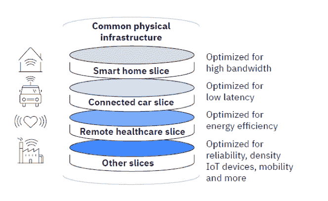
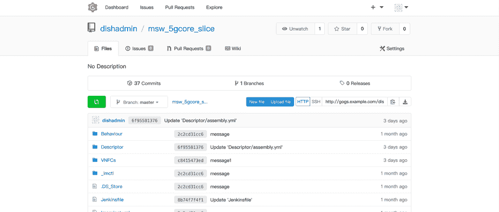
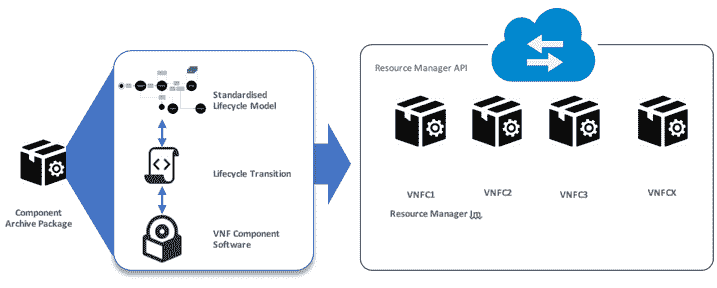
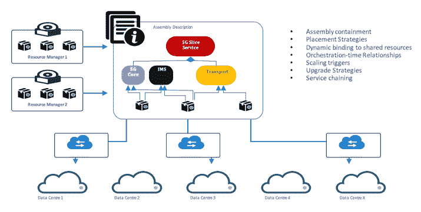
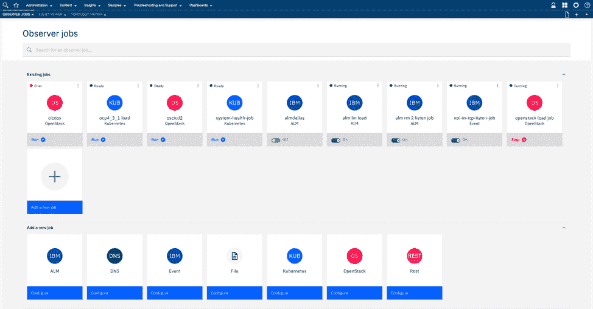
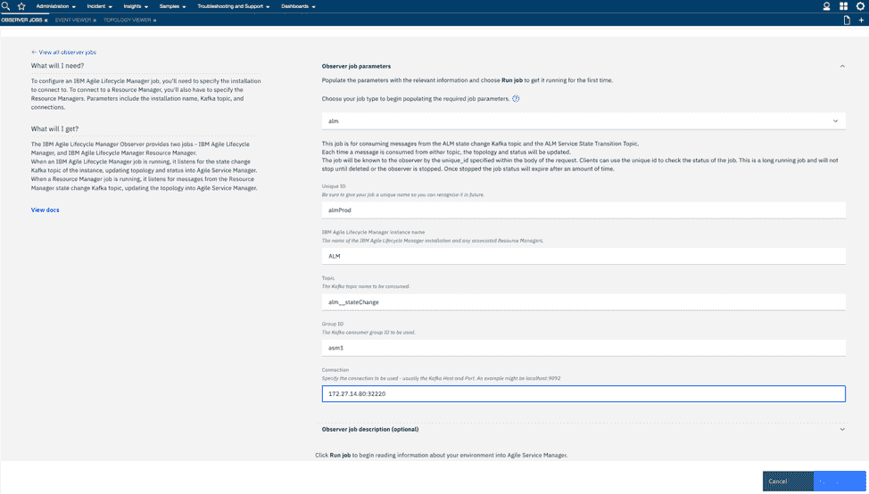

# 为边缘应用程序构建和部署 5G 网络服务

> 原文：[`developer.ibm.com/zh/articles/edge-computing-network-layer/`](https://developer.ibm.com/zh/articles/edge-computing-network-layer/)

##### 实施边缘计算架构

本文是本系列的第 3 部分。

*   边缘计算架构和用例
*   在应用层和设备层构建边缘
*   为边缘应用程序构建和部署 5G 网络服务（本文）

在此边缘计算系列中，我们探索了边缘计算架构和用例，帮助企业了解如何通过边缘计算和 5G 新兴技术来获益。由于 5G 是连接业务的核心，因此电信公司在边缘计算领域进行了大量投资，并将边缘计算作为整个 5G 部署的关键支柱。

在[第 1 部分](https://developer.ibm.com/zh/articles/edge-computing-architecture-and-use-cases/)中，我们展示了边缘计算与许多行业（特别是电信行业）所面临的挑战之间的关系。我们还讨论了边缘计算架构的三个关键层：设备边缘、局部边缘（包括应用层和设备层）和云边缘。

在[第 2 部分](https://developer.ibm.com/zh/articles/edge-computing-application-and-device-layer/)中，我们更详细地研究了应用层和设备层，并讨论了实现这两个层所需的工具。将在此层上部署和管理容器化应用程序。但是，底层网络层必须可用才能在边缘运行这些应用程序。第三篇文章将介绍网络层。

在创建边缘解决方案时，您必须考虑网络层。尤其需要了解网络层是如何与应用层集成的。

在本系列的最后一部分中，我们将讨论网络层的基础组件，以及如何编排、管理和监视网络组件。最后，我们将演示如何将各个边缘计算层组合在一起以提供一个集成边缘解决方案。

## 了解边缘计算架构的网络层

网络层包括运行局部边缘所需的网络组件（例如，路由器和交换机）。网络层的组件大部分都是虚拟化或容器化的。网络层用于管理边缘的网络。

因为管理边缘的物理网络设备是一项非常复杂的任务，网络层已实现虚拟化。下面是网络层的一些关键组件：

*   网络功能 (xNF) 组件，可为虚拟化网络功能 (vNF) 或容器化网络功能 (cNF)
*   虚拟基础架构管理器 (VIM)，即用于运行 xNF 的基础架构。
*   管理和编排 (MANO) 组件以及监控组件，用于网络上部署的 xNF。
*   持续集成和持续部署 (CI/CD) 管道，可使用 MANO 组件管理 VIM 上的 xNF

## 创建 5G 网络切片

我们将介绍如何构建和部署要在网络层上运行的网络服务。我们将概述如何在要部署在 5G 网络的某个 xNF 上创建网络切片。请注意，切片的整个创建过程相当复杂，这里只介绍了这个过程的一小部分，旨在说明可在边缘运行的服务。

5G 技术的一个关键功能是能够创建网络切片，而网络切片可以将多个逻辑网络作为共享物理基础架构上几乎独立的操作来运行。利用网络切片，运营商可以通过平衡不同的需求（如可用性/可靠性、带宽、连通性、成本、弹性和延迟），根据每个用例的需求在逻辑切片中灵活分配速度、容量和覆盖范围。

在我们的用例中，配置了一个 5G 网络切片，它在边缘提供低延迟和高可用性的网络服务，以确保工人安全应用程序正常运行。

下图显示了如何将网络切片专门用于各种类型的边缘应用程序。

要在更高级别上实现网络切片，需要执行以下操作：

1.  确定用于构成 5G 网络构建块的网络功能组件 (xNF)。
2.  使用基础架构管理器 (VIM) 来设置网络功能虚拟基础架构 (NFVi)。
3.  使用 Jenkins 和 Gogs 等工具创建一个 CI/CD 管道，用于管理 xNF 和网络服务的载入和测试。CI/CD 是用于快速安全地推送开发周期更新的过程/实践。
4.  在诸如 IBM Agile Lifecycle Manager 之类的编排器平台上载入 xNF，并创建 5G 网络切片所需的网络服务设计。
5.  使用编排器 (IBM Agile Lifecycle Manager)，以 VIM 环境为目标测试网络切片服务的部署。
6.  使用 IBM Netcool Operations Insights 和 IBM Netcool Agile Service Manager 等工具，通过创建观察者作业来监视网络事件和网络拓扑，以配置操作平台。

## 第 1 步：确定网络功能组件 (xNF)

网络层的关键组件是 xNF。xNF 可以是 vNF（虚拟化网络功能）或 cNF（容器化网络功能）。当前大多数 xNF 都是虚拟化网络功能，但是未来的 xNF 主要是容器化网络功能。因此，除非有足够的 cNF 来运行网络，否则边缘网络层必须同时支持这两种网络功能。xNF 示例包括防火墙、路由器和网关。5G 网络构建块是由 xNF 构成。

5G 网络中使用的关键 xNF 包括：

*   **网络核心：Evolved Packet Core 和 5G Core**。Metaswitch Fusion Core 是一种云原生功能，可提供完整的 5G Core 和基于服务的架构功能，并支持 4G-5G 互通。Metaswitch Fusion Core 包括四个关键的 5G 技术领域：用户层面、控制层面、基于服务的架构和管理。
*   **IP Multimedia Subsystem Core (IMS)**。Metaswitch Clearwater IMS Clearwater Core 已部署为虚拟化网络功能 (vNF)，可使用 OpenStack 进行部署。Clearwater Core 包括发出呼叫所需的关键 IMS 要素：

    *   查询呼叫会话控制功能 (I-CSCF)
    *   服务呼叫会话控制功能 (I-CSCF)
    *   出口网关控制功能 (BGCF)、离线计费触发功能 (CTF) 和归属用户系统 (HSS) 接口。
*   **传输层**。Juniper 的虚拟 SRX (vSRX) 已部署为边缘的虚拟机。它以扩展性更强的方式提供交换、路由和防火墙安全性，从而在私有云、公共云和混合云中提供安全保护。这会创建传输网络来连接部署中的 5G 网络组件。

需要使用上述所有的 xNF 才能创建网络切片。下面介绍了通过蜂窝网络的高级流程：

1.  数据经过 vRAN
2.  数据先发送到传输层，再发送到 5G 内核
3.  数据随后发送到 IMS 以便传送到端点。

我们将使用这个流程来说明如何在网络层中创建网络服务以及如何将服务连接在一起。但是，在这样做之前，我们需要先确定应在哪个 VIM 上运行这些 xNF。

## 第 2 步：设置网络功能虚拟化基础架构 (NFVi) 和虚拟基础架构管理器 (VIM)

利用 VMware vCenter 和 OpenStack 等虚拟基础架构管理器 (VIM)，用户可以部署虚拟机 (VM)、调整虚拟机的大小、将它们放置在特定网络拓扑中，等等。在 VMware vCenter 中，运行虚拟机的主机都具有 ESXi 操作系统。这种运行在裸机主机上的操作系统称为虚拟机管理器（类型 1）。OpenStack 将管理使用 KVM 虚拟机管理器的主机，KVM 虚拟机管理器本身不是操作系统，它只是 Linux 的一项附加功能。

虽然我们不会深入研究容器及其各种引擎（Docker、cri-o、rkt 等）的复杂之处，但值得一提的是，容器通常作为单个组件运行，可以组合形成更大的应用程序。可以将容器编排理解为让容器彼此以一种有利方式进行交互的过程，这就是 Kubernetes 诞生的契机。Kubernetes 可以跨集群轻松管理容器，而集群可以跨越多个物理机或虚拟机。要详细了解容器以及如何构建容器化应用程序，请参阅 [IBM Developer 上的入门指南](https://developer.ibm.com/zh/technologies/containers/gettingstarted/)。

OpenShift 采用基础 Kubernetes，并通过添加安全性和 DevOps 来将其扩展为企业级别。可以根据集群角色和其他控件向用户提供对某些名称空间或项目的受限访问权限。使用 Jenkins，只需点几下鼠标就可以直接从 Gizub 中为本地 OpenShift 集群创建应用程序。虽然可以在基础 Kubernetes 中添加这些服务，但是 OpenShift 默认提供这些服务及其他服务，这一点对我们很有帮助。

在我们的用例中，我们使用 OpenShift 和 OpenStack 作为 VIM 来管理网络层，并在 5G Core xNF 上部署 5G 网络切片的组件。

## 第 3 步：创建 CI/CD 管道

在这一步中，您需要使用 Jenkins 和 Gogs 等工具创建一个 CI/CD 管道，用于管理 xNF 和网络服务的载入和测试。

我们来深入研究如何使用 CI/CD Hub 来处理和自动完成 5G Core 网络组件的 DevOps 任务。使用 CI/CD Hub，我们可以在 Jenkins 组件中创建管道，这样，每次推送更新时，都会触发一组任务，这些任务可帮助确保正确打包和部署变更内容。它几乎无所不包，从 xNF 的打包方式到测试方式（在部署前使用行为测试进行测试）。CI/CD 管道还可以监视和更改 xNF，以及报告和解决所发现的问题。

以下工具位于 CI/CD Hub 中：

*   Gogs：轻量级自托管 Git 服务
*   Nexus：工件存储库管理器
*   Jenkins：启用 CICD 流程的自动化服务器
*   Openldap：轻量级目录访问协议的开源实现形式
*   Docker 注册表：用于托管 Docker 镜像的注册表
*   Nginx Ingress：入口控制器，支持使用 Ingress 访问某些服务

在构建 CI/CD Hub 后，将使用它在网络层中载入各个 xNF。在本文中，我们将逐步介绍如何为 5G Core xNF 执行此操作。

我们从加载该软件的网络工程师开始。使用 CI/CD Hub 中提供的 CI/CD DevOps 工具，工程师可以打包和测试 xNF 并最终将其发布到 xNF 目录中。

从这里开始，可以由服务设计人员来接手。服务设计人员可以使用 xNF 目录，利用 CI/CD Hub 创建服务。而且，设计人员还可以使用这些工具打包和测试新服务并最终将其发布到服务目录中。

现在，我们来从技术层面看一下这个过程。这是开发过程中的第 0 天，开发者还在对 xNF 组件进行打包。开发者会不断更新这些软件包，将其部署到目录中并在目录中提供，以便设计人员可以创建服务。

开发者将 5G Core 软件包的更新推送到 GoGs 存储库。

在将 5G Core 软件包的更新推送到 GoGs 存储库时，将触发一个 Webhook 来启动所创建的 Jenkins 管道。

从这里开始，Jenkins 将进行一些测试，并执行在管道中定义的所有任务。例如，它的一个关键功能是将程序集加载到 IBM Agile Lifecycle Manager 中，并执行行为测试以确保它仍然有效且可在目录中使用。从这里开始，生命周期管理员就可以使用它了，设计人员可以将它打包为一个服务。

## 第 4 步：载入和管理网络切片所需的 xNF 组件

要载入和管理 xNF 组件，可以使用以下 MANO 和操作产品：

*   IBM Agile Lifecycle Manager 通过管理虚拟网络服务的端到端生命周期（从第三方 xNF 软件包的发布管理一直到 vNF 和服务实例的持续编排或运行）来实现自动化操作。IBM Agile Lifecycle Manager 用于管理跨数据中心的网络编排。

*   IBM Netcool Operations 提供了本地环境、云环境和混合环境中事件的综合视图，并提供对服务性能及其相关的动态网络和 IT 基础架构的可行洞察。

*   IBM Netcool Agile Service Manager 以实时、动态更新或按需更新的方式提供复杂网络拓扑的可视化，能够对事件、事故和性能进行进一步调查。

我们已经确定了构建 5G 网络切片服务所需的 xNF 并建立了一个 CI/CD 管道，现在我们需要完成以下两个步骤，然后才能最终完成网络切片服务并将其添加到服务目录中。

*   在 MANO 平台上载入所有 xNF，并使用这些 xNF 来设计网络服务。

*   将这些服务部署到 OpenStack 和 OpenShift 上。

要载入 xNF 组件，需要打包 xNF 软件组件，并将它们推送到 Agile Lifecycle Manager 的资源存储库。这个步骤将第三方 xNF 软件打包到敏捷服务构建块中，这些构建块可以单独进行测试，从而提高了性能并减少了在生产中需要人工干预的错误。我们使用了 [Ansible 资源管理器](https://github.com/IBM/osslm-ansible-resource-manager)来实现自动化，因此创建了用于创建 xNF 软件包的 Ansible 操作手册。

要创建 Ansible 操作手册，首先需要创建一个描述符文件（请参阅图 5 的第 1 部分）。描述符文件用于定义 xNF 服务的输入属性和生命周期列表。然后，我们为诸如安装、启动、停止、配置和完整性检查等生命周期事件创建相应的脚本。这些脚本存放在 `lifecycle` 文件夹中。这些生命周期事件使用角色作为构建块。下面的示例（图 5 的第 2 部分）显示了使用 `createinstance` 角色的 5G Core 的 `Install` 生命周期脚本。角色的脚本存放在 `roles` 文件夹中，可以在这些脚本中定义多个任务。下面的 `createinstance` 角色示例（图 5 的第 3 部分）包含两个已定义的任务，分别用于登录到 RedHat OpenShift 和用于安装 5G Core 的 Helm 发行版。

***图 5：Ansible 操作手册中的关键脚本***

在完成 xNF 软件包后，可以使用其命令行工具 `lmctl`，通过指定目标资源管理器实例将其载入到 IBM Agile Lifecycle Manager。例如：

`lmctl project push <target_alm> --armname <resource_mngr>`

现在，xNF 应该已经载入到 IBM Agile Lifecycle Manager 并且可以作为资源使用。下图显示了属性的逻辑视图，这些属性在载入后由程序集描述符控制。

在测试 xNF 软件包并将其作为可用软件包载入之后，下一步是使用一个或多个 xNF 创建服务设计。可以从多个资源管理器获取这些 xNF，还可以通过定义相互依赖的属性来将这些 xNF 连接在一起，并且可以将这些 xNF 配置为跨多个数据中心部署。服务设计还包括定义 xNF 与基于意图的生命周期事件之间的关系。

IBM Agile Lifecycle Manager 服务设计器可用于将多个 xNF 连接起来以创建服务。要创建网络切片服务，需要将步骤 1 中基于 xNF 构建的 5G Core、IMS 和 Juniper xNF 程序集链接在一起。

## 第 5 步：测试用于将 xNF 组件部署到 OpenStack 和 OpenShift 以配置网络切片的过程

现在，为了测试网络切片的部署，需要使用 IBM Agile Lifecycle Manager 作为 MANO 引擎。我们将把 OpenStack 和 Red Hat OpenShift 配置为可以部署 xNF 的数据中心位置。OpenStack 和 OpenShift 都提供了 VIM 功能，以用于管理可以部署 vNF（到 OpenStack）和 cNF（到 OpenShift）的虚拟基础架构。

使用 Ansible 资源管理器的 API 来定义和配置部署位置。OpenStack 租户的位置属性示例：

可以在服务设计中使用这些部署位置作为参数，以定义用于部署特定 xNF 的位置。下面的截屏突出显示了 5G 切片服务的每个 xNF 组件在服务设计中的部署位置输入配置：5G Core、IMS 和 Juniper xNF。

下面的截屏显示了在配置新的 5G 网络切片服务时的部署位置输入示例。

## 第 6 步：配置操作平台

创建 5G 网络切片的最后一步是创建观察者，使用事件查看器来监视和管理由 5G Core 生成的事件，最后使用 IBM Netcool Operations Insights 和 IBM Netcool Agile Service Manager 查看 5G 切片的拓扑视图。

观察者是一种用于提取资源信息并将其插入 IBM Agile Service Manager 数据库的服务。在观察者加载数据之前，必须先定义并运行观察者作业。在我们的用例中，我们使用观察者来监视来自 IBM Agile Lifecycle Manager、Red Hat OpenShift 和 OpenStack 的事件。在本文中，下面的步骤展示了如何使用 IBM Agile Lifecycle Manager 的观察者配置 UI 来配置观察者作业，以用于载入和配置 5G Core xNF。

1.  使用您的用户凭证登录到 IBM Netcool Agile Service Manager 的 DASH Web 应用程序。
2.  单击 **Administration** 下拉菜单。
3.  在 **Agile Service Management** 部分下，单击 **Observer Jobs**。此时会显示观察者配置 UI，其中显示现有的观察者作业。
4.  单击 **Add a new job** 以显示所有可配置的作业。提供了多个可用选项，包括 IBM Agile Lifecycle Manager、OpenStack 和 Kubernetes 实例，如下所示。

根据类型的不同，每个观察者作业都需要填写略有不同的参数。在我们的示例中，要配置观察者作业，需要为作业提供一个唯一 ID，用于标识 IBM Agile Lifecycle Manager 的 IBM Agile Lifecycle Manager 实例名称、主题（Kafka 主题）、组 ID（Kafka 组 ID）以及要使用的连接详细信息（如 Kafka 主机和端口）

### 在事件查看器中监视事件

配置并运行观察者作业后，将在事件查看器中填充事件。下图显示了 5G Core xNF 组件的事件。使用事件查看器，可以通过交互式界面来监视和管理事件。根据过滤器和视图，将在事件列表中显示警报的相关信息。

摘要工具栏包含彩色编码的严重性指示器图标（每个定义的严重性级别都有一个图标）。每个图标的旁边有一个数字，表示具有该严重性的事件数。事件区域包含一张表格，其中列出了事件及其特征。每一行包含单个事件的特征。

### 在拓扑查看器中查看 5G 网络切片拓扑

IBM Netcool Agile Service Manager 用于显示拓扑数据。要打开拓扑查看器，请在“Agile Service Management”子标题下的“Incident”下拉菜单中选择“Topology Viewer”。要查看拓扑，需要定义视图所依据的种子资源。然后，选择要显示的种子周围的网络资源级别，然后单击“Render”按钮来呈现视图。这样，您可以实时地进一步展开或分析所显示的拓扑，或者在历史时间窗口中将其与以前的版本进行比较。下图显示了 5G 切片网络服务的拓扑视图。

## 集成边缘计算架构的所有层

在本系列文章中，我们讨论了 3 个边缘层。设备层包含一些可运行小型程序并将所需数据传输到应用层的设备。应用层包含一些更大的计算资源，因此能够对所提供的数据执行进一步分析和计算。在某些情况下，应用层可能需要与云或数据中心内的系统进行交互。所有这些层都是通过网络层进行通信的。

在我们的工人安全用例中，在设备层上部署了用于识别对象的模型。检测到对象时，视频流将发送到应用层以进行进一步分析。该流是通过网络层来传输的。网络流量可能会有所不同，因为有多个视频流在网络中流动，并且正在不断添加和删除设备。有些视频流展示了装配部件是如何在传送带上移动的，所以并不是很重要，但是任何与工人安全有关的视频流都至关重要，需要立即发出警报。所有这些视频流都由网络层管理。

部署到边缘设备的工人安全应用程序将使用边缘上提供的网络层。现在，假设由于工厂制造的元件数量增加，工厂内的视频工作负载也在增加，从而导致网络性能下降。此外，还会向网络中添加一些新设备来处理这些工作负载。这会对工人安全应用程序的视频分析产生不利影响。

此问题的解决方案是为工人安全应用程序创建一个网络切片。您将创建一个网络切片，用于监视安全情况的所有设备都专用于此切片。这意味着这些设备将获得更高的吞吐量，从而保证了工人的安全。其他系统的性能会有所下降，但因为它们不是关键的系统，因此几乎没有任何影响。

总之，边缘用例的完整端到端实现将包括以下任务：

*   部署和管理应用层（如本系列的第 2 部分中所述）。应用程序可以部署到应用层（包括服务器），也可以部署到设备层（例如摄像头）。

*   部署和管理网络层（如本文所述）。

*   在应用层中运行要使用网络层实现网络功能的应用程序。在我们的示例中，在摄像头上运行的模型将检测到感兴趣的对象。结果是将视频流式传输到应用层，以便使用网络层对其进行进一步分析。如果性能下降，那么可以使用我们所讨论的工具为网络上的特定设备创建切片，使它们能够获得所需的网络带宽，从而提高性能。

## 结束语

在此边缘计算系列中，我们深入介绍了边缘。在未来，边缘计算将是所有企业的重要组成部分。企业仍然需要高速计算，因为业务需求决定了要使用边缘计算设备来快速响应环境、数据和业务流程中的变化。

因为 5G 的出现以及能够在各种边缘节点上运行容器化应用程序，使得边缘计算成为现实。为确保成功实施边缘解决方案，关键是要清楚地了解该解决方案的业务用例，包括实现用例所带来的好处和 ROI。同时还要仔细考虑技术方面。需要慎重创建架构，并且必须考虑各种边缘节点、网络层、应用层和云/数据中心。对于其他层，需要考虑各种节点的外形规格、要部署的应用程序类型以及对这些层的编排、监视和管理。

要实现边缘计算，本系列文章中提供的信息显然还远远不够，但我们希望这些文章能够帮助您在企业中开始或逐步推广边缘计算解决方案。

本文翻译自：[Implementing an edge computing architecture](https://developer.ibm.com/articles/edge-computing-network-layer/)（2020-05-27）