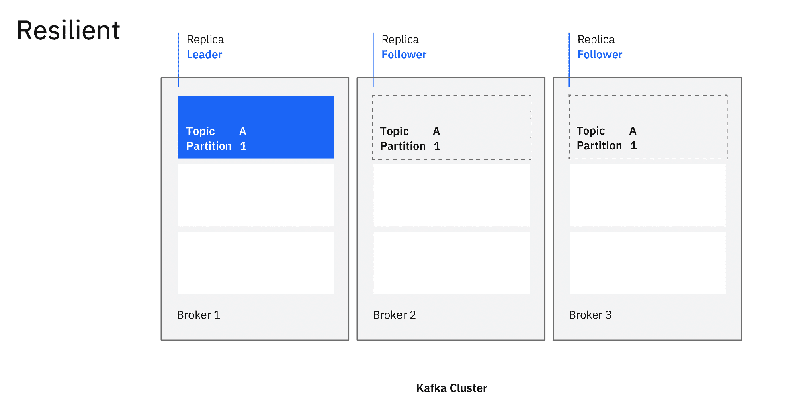
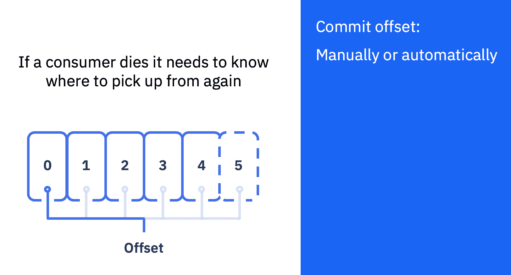
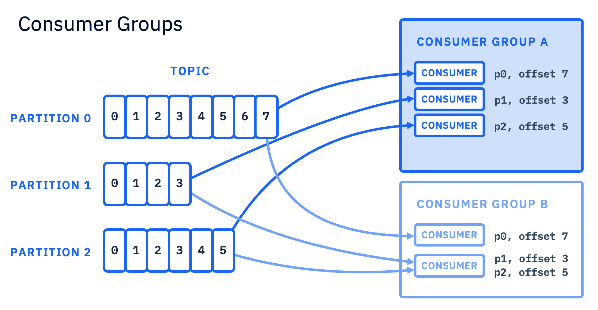

# 配置 Kafka 以实现反应式系统

> 原文：[`developer.ibm.com/zh/articles/configuring-kafka-for-reactive-applications/`](https://developer.ibm.com/zh/articles/configuring-kafka-for-reactive-applications/)

我们每天产生的数据量不断增长，其中大量数据是事件的形式。无论是来自传感器的更新、网站上的点击还是推文，源源不断流入的新事件让应用程序应接不暇。那么，我们应该如何设计应用程序，使其在面对波动性的负载时能够更快地反应和恢复，并更好地管理我们对数据的渴求？许多公司都在采用 Apache Kafka 作为关键技术来实现这一目标。

在本文中，您可以全面了解您为了确保应用程序尽可能提升响应性、弹性、恢复能力和反应性而需要考虑的 Kafka 配置。

## 为何要使用 Apache Kafka？

Apache Kafka 是一个开源的分布式流平台，非常适合处理事件流。您可以从技术文章 Apache Kafka 简介深入了解 Kafka。

虽然 Kafka 在处理事件流时是一个绝佳的工具，但是如果您需要以能够快速反应并极速响应的方式提供这些信息，那么 Kafka 需要通过最佳配置以正确的方式使用。

## 为什么使用反应式架构？

“反应式系统”一词指的是一种架构风格，支持由多个微服务组成的应用程序作为整体一起工作。这种架构风格的目的是支持应用程序更好地对其周围环境和其他应用程序作出反应，这在处理不断变化的工作负载需求和组件失败时的恢复能力方面表现出更大的弹性。

[Reactive Manifesto](https://www.reactivemanifesto.org/) 帮助定义创建真正的反应式系统时所涉及的关键特征：响应性、恢复能力、弹性和消息驱动。

您可以使用[反应式系统入门（英文）](https://developer.ibm.com/articles/reactive-systems-getting-started/)一文中的学习路径和 Code Pattern 来详细了解反应式系统的概念以及设计和构建这种系统的方式。 要获得更深入的解读，您也可以阅读报告[反应式系统解读（英文）](http://ibm.biz/reactivesystemsexplained)。

## Kafka 如何适应反应式系统

反应式系统依赖于非阻塞性异步消息传递的主干，这有助于在组件之间建立边界，以确保松散耦合、隔离和位置透明性。非阻塞性通信允许接收方仅在活跃时才消耗资源，从而减少系统开销。使用显式消息传递可以实现负载管理、弹性和流量控制，具体方法是对系统中的消息队列进行成形和监控，并在必要时施加背压。

Kafka 是一种卓越的工具，支持异步消息传递，而异步消息传递是反应式系统的主干。那么，我们如何配置 Kafka 才能使应用程序实现恢复能力和弹性，以便有效响应它所消耗的事件？

## 如何为反应式系统配置 Kafka

Kafka 是高度可配置的，因此可以根据应用程序进行定制。在构建反应式系统时，我们需要考虑恢复能力和弹性，以及需要注意哪些参数才能实现这些特性。通过让应用程序实现消息驱动（我们已经知道 Kafka 支持这一特性）以及恢复能力和弹性，我们可以创建能够快速响应事件并因此具备反应式的应用程序。

### 启用恢复能力

在恢复能力方面，Kafka 已经组合使用相互复制记录的多个分布式代理，内置了自然的恢复能力。然而，单靠使用一组分布式代理并不能保证记录的端到端恢复能力。为了启用这种恢复能力，需要在 Kafka 部署中恰当地设置确认、重试策略和偏移量提交策略等参数。

#### 确认和重试

可以将 Kafka 配置为以两种方式之一来传递记录：“至少一次”和“最多一次”。如果您的应用程序能够应对记录缺失的情况，“最多一次”就足够了。但是，在处理业务关键消息时，需要使用“至少一次”传递方式。这些记录传递选项是通过设置生产者的 `acks` 和 `retries` 配置选项来实现的。

`acks`（确认）配置选项可以设置为 `0`（表示不确认）、`1`（表示等待单个代理）或 `all`（表示等待所有代理确认新记录）。Producer API 还允许配置在生产者等待代理确认时发生超时的情况下的重试次数。

对于“最多一次”记录传递，可以将 `acks` 和 `retries` 都设置为 `0`。这是一种“即发即弃”的方法。对于“至少一次”传递（反应式应用程序中最常使用的方法），`acks` 应设置为 `all`。但是，这种配置确实引入了更高的延迟，因此根据您的应用程序，您可以选择将 `acks` 设置为 `1`，以实现一定的恢复能力和较低延迟。

要获得“至少一次”传递，将 `acks` 设置为 `all` 并不足够。应用程序还需要处理未能送达代理的记录。可以通过增大 `retries` 的数值或使用自定义逻辑来实现这种恢复能力。注意，允许重试可能会影响记录的排序。

#### 提交偏移量

对于消费者来说，最重要的是提交偏移量的策略。提交的偏移量表示消费者在某个主题上已经读取或处理的最后一个记录。这些偏移量将提交到 Kafka，以支持应用程序从其宕机时的停止之处恢复运行。

如果启用了自动提交（这样会根据计时器提交最新的偏移量），您可能会丢失记录，因为两次提交之间的时间长度可能不够。在这种情况下，应用程序可以在偏移量已经提交之后，但在完全处理记录之前宕机。应用程序重新启动时，由于已经为该特定记录提交了偏移量，因此它将在丢失的记录之后开始消耗记录。因此，未处理的记录会被跳过，实际上已经丢失。

如果禁用自动提交，您将能够精确地控制消费者何时提交最新偏移量。在反应式系统中，应该使用手动提交，也就是只有在完全处理记录后才提交偏移量。

### 启用弹性

Kafka 内置了可扩展性。例如，可以扩展代理和分区。不幸的是，这些代理和分区无法缩减，至少不能以自动化的方式安全地缩减。应该说，Kafka 并不具备真正的弹性，但使用 Kafka 并不会妨碍您创建一个具备足够弹性来应付波动性负载的系统。因为 Kafka 设计为无需使用太多资源就能处理大量负载，所以您应该集中精力构建弹性的生产者和消费者。

一旦编写了生产者应用程序，您无需执行任何特殊操作就能对其进行纵向扩缩容。主要考虑因素是如何扩展您的生产者，使其在扩展时不会生产重复消息。这将通过应用程序中的业务逻辑得以解决，因此您有责任在编写应用程序时考虑这一点。

在扩展消费者时，您应该使用消费者组。消费者可以使用相同的组标识连接到 Kafka 进行协作，组的每个成员会获得特定主题上的记录子集。该子集将采用一个或多个分区的形式。由于组中的消费者不希望其所处理的记录出现重叠，因此每个分区只能由消费者组中的一个消费者访问。如果您希望扩展为具有比当前分区数量更多的消费者，那么需要添加更多的分区。但是，如果在发送记录之后增加主题的分区计数，那么将取消记录键所提供的排序保证。因此，如果排序对于您很重要，您应该仔细考虑最初为每个主题实例化的分区数量。

## Kafka 反应式框架

Apache Kafka 标配了 Java Producer 和 Consumer API，但是这两个 API 并没有针对反应式系统进行优化。要更好地编写以反应性方式与 Kafka 交互的应用程序，有几种开源的反应式框架和工具包可供选择，其中包括 Kafka 客户端：

*   **[Vert.x](https://vertx.io/)** 是基于 Reactor 模式并在 JVM 上运行的多语言工具包。它是非阻塞性的，并且由事件驱动，包括一个分布式事件总线，有助于使代码保持单线程。此工具包中的 [Vert.x Kafka 客户端](https://vertx.io/docs/vertx-kafka-client/java/) 支持连接到 Apache Kafka。

*   **[MicroProfile Reactive Messaging](https://github.com/eclipse/microprofile-reactive-messaging)** 是更广泛的跨供应商 MicroProfile 框架中的一个规范。借助 MicroProfile Reactive Messaging，您可以对应用程序 bean 的方法进行注解，然后，OpenFree 可以通过对外隐藏细节的方式，将这些方法转换为与反应式流兼容的发布者、订阅者和处理者，并将它们相互连接起来。在提供的 Connector API 库中，Kafka 连接器支持连接到外部消息传递系统，包括 Apache Kafka。 有关这一方面以及如何有效使用 MicroProfile Reactive Messaging 的更多信息，查看这篇有用的[博客](https://openliberty.io/blog/2019/09/13/microprofile-reactive-messaging.html)。

*   **[Project Reactor](https://projectreactor.io/)** 是一个反应式库，也基于在 JVM 上运行的 Reactive Streams 规范。[Reactor Kafka](https://projectreactor.io/docs/kafka/release/reference/) 是 Project Reactor 中的一个 API，支持连接到 Apache Kafka。

*   **[Alpakka](https://doc.akka.io/docs/alpakka/current/index.html)** 是在 Akka Streams 框架基础上构建的一个库，用于为 Java 和 Scala 实现流感知和反应式集成管道。[Alpakka Kafka Connector](https://doc.akka.io/docs/alpakka-kafka/current/home.html) 支持 Apache Kafka 和 Akka Streams 之间的连接。

我们已经构建了一个开源入门级 Vert.x Kafka 应用程序样本，您可以在 [ibm-messaging / kafka-java-vertx-starter](https://github.com/ibm-messaging/kafka-java-vertx-starter) GitHub 代码库中进行查看。 在体验编写反应式 Kafka 应用程序教程中详细阅读如何将 Kafka 入门级应用转变为 Vert.x 反应式应用。

## 结束语及后续步骤

Kafka 已经成为反应式系统的事实上的异步消息传递技术。然而，单靠使用 Kafka 并不足以使您的系统完全具备反应性。在编写应用程序时，您必须考虑应用程序如何通过您的生产者和消费者与 Kafka 集成。花一些时间来恰当地配置应用程序，您就可以充分利用 Kafka 提供的内置恢复能力和可扩展性。

如果您需要一个完全受支持的 Apache Kafka 产品，请查看 [IBM Event Streams](https://www.ibm.com/cn-zh/cloud/event-streams)，这是由 IBM 提供的 Kafka 产品。可以将 [Event Streams on IBM Cloud](https://cloud.ibm.com/catalog/services/event-streams?cm_sp=ibmdev-_-developer-articles-_-cloudreg) 作为管理服务免费试用，或者在 Red Hat OpenShift Container Platform 上部署您自己的 [Event Streams in IBM Cloud Pak for Integration](https://www.ibm.com/support/knowledgecenter/SSGT7J_20.1/welcome.html) 实例。IBM Cloud Pak for Integration 中的 Event Streams 为 Apache Kafka 增加了非常有价值的功能，包括强大的运维工具、模式注册表、获奖的用户体验，以及支持连接到各种核心企业系统的广泛的连接器目录。

本文翻译自：[Configuring Kafka for reactive systems](https://developer.ibm.com/articles/configuring-kafka-for-reactive-applications/)（2020-04-22）