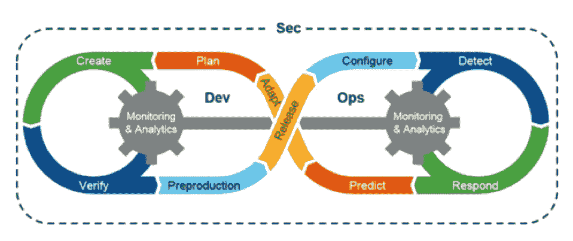
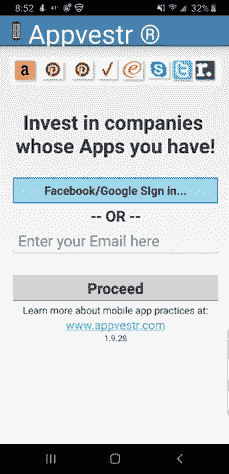
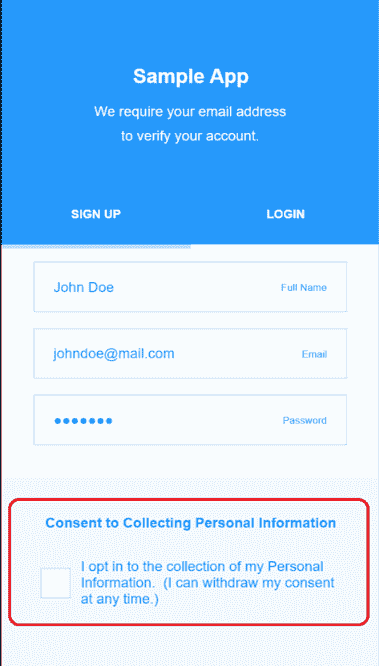

# 打造安全、私密的移动应用体验

> 原文：[`developer.ibm.com/zh/articles/building-a-secure-and-private-mobile-app-experience/`](https://developer.ibm.com/zh/articles/building-a-secure-and-private-mobile-app-experience/)

自 20 世纪 90 年代以来，从内在安全的大容量事务专用大型机系统到当今以开源解决方案为基础的增值安全性，“安全至上”一直是 IBM 始终践行的工作模式。隐私远不只是遵循法律那么简单。IBM 坚信我们的标准远远高于隐私法规的要求，因为我们始终珍视客户给予我们的那份信任。

隐私和安全是当今移动领域的两大难题，因为我们在设备上携带的个人信息，要比我们在其他任何地方存放的个人信息都要多（包括家里）。

本文中，我将介绍一些最佳实践以及工具、服务和框架，您应考虑将它们用于访问或处理个人信息的移动应用程序。

## DevSecOps 即 DevOps

每个应用都不是静态的，因此设备上的移动应用会定期更新，这种情况我们都再熟悉不过了。移动应用发布者会定期添加新功能或修复缺陷，持续改进令人惊艳的体验。这种创建代码、发布应用并根据反馈加以调整的连贯生命周期就是 DevOps。与传统的大型遗留系统工作相比，DevOps 的执行速度通常要快得多。

作为移动开发者，我们必须尽早在任何 DevOps 工具链中植入适当的安全措施。不管是称之为 DevOps，还是为了凸显安全性而称之为 DevSecOps，“适当的安全措施”很大程度上都取决于您的应用所使用数据的敏感程度。

我将带大家浏览一遍 DevOps 生命周期，并会着重讲述扩大移动应用中安全功能的部分。

## 移动用户身份验证

首先，在移动应用上添加用户身份验证，我们可以在安全性方面先声夺人。当今的许多移动应用通过接入您的社交网络就能让您快速登入。IBM Cloud 仅通过几行代码就能提供 App ID 服务，轻松处理这项任务。

我将用我的 Android 应用 [Appvestr®](https://play.google.com/store/apps/details?id=com.appvestr2) 进行演示，Google Play 上提供了此应用。第一印象很重要。无需输入或导入电子邮件地址，而是如此处所示从可用帐户中进行选择，减少了任何不必要的注册步骤，改进了初始应用体验：

[将 IBM Cloud App ID 服务](https://cloud.ibm.com/docs/services/appid?topic=appid-mobile-apps)添加到您的应用（可能是像我给出的 Android 应用，也可能是 iOS 或 Web 应用）中十分简单。首先，必须初始化 SDK。初始化 App ID SDK 后，调用资源来激活 App ID UI。您可以使用任何定制徽标，并可以选择任何身份提供程序，包括任何 SAML（安全断言标记语言），或者定制提供程序，这意味着您可以与现有记录系统集成，或者提供单点登录 (SSO) 体验。

如果使用 SSO 系统，那么您可能会搭建 B2E（企业对员工/企业对企业）应用为公司员工提供支持。对于这些应用，一种广泛采用的运营安全（DevSecOps 中的“Ops”）和隐私解决方案就是，在组织的已注册设备丢失或被盗时，支持擦除其内容或将其禁用。[IBM MaaS360 with Watson](https://www.ibm.com/security/mobile/maas360) 是一款移动设备管理 (MDM) 服务产品，可实现对 iOS、macOS、Android 和 Windows 设备以及物联网 (IoT) 设备的可视性和可控性。MaaS360 可限制设备访问隐私数据，或限制设备未经授权访问企业资产。

## 移动隐私和安全

从早期 UX 设计和用户识别到生产设备的全面安全性，隐私和安全涉及诸多方面，包括：

*   隐私法规
*   数据安全
*   应用程序真实性

### 遵循隐私法规

您将自己的电子邮件地址向各个网站提交了多少次？问问自己：“他们要拿我的个人信息做什么？” 输入一次或多次后，您可能还会收到越来越多的垃圾电子邮件。

最近出台的最重要法律之一便是欧盟通用数据保护条例 (GDPR)，其中说明了哪些类型的信息较为重要，以及如何处理此类信息。（您可以在此[针对 GDPR 的开发者指南](https://developer.ibm.com/articles/s-gdpr1/)中了解有关 GDPR 的更多信息。）IBM 早在 GDPR 正式发布之前就规划并实施了 GDPR 安全和隐私标准，并始终遵照此重要的隐私标准对员工进行认证。

有关 GDPR 要求的更全面信息，可查看[欧盟 GDPR 合规要求](https://gdpr.eu/gdpr-consent-requirements/)。

作为移动开发者，我们需要面向移动应用用户支持以下用例：

*   “选择性加入”- 默认情况下，用户看到的此选项应处于*未选中*状态，以免用户无意间绕过这一重要检查点。我们必须在应用中确定这样是否完全取消将用户数据作为个人信息 (PI) 的资格，如果这对应用的运行至关重要，那么退出应用。如果用户拒绝收集和使用其 PI 数据，那么您的应用必须对用户身份数据进行模糊处理。

    

*   “撤回许可权”- 用户有权在选择性加入后撤回许可权。这样一来，您获取的该用户的所有 PI 数据都应删除，因为即使不再收集此类数据，它也会存储在某个位置，归入“已处理”数据。

*   “数据主体请求 (DSR)”- 用户还有权请求其数据。作为移动开发者，我们必须将此功能植入移动应用安全性。

    

您还必须定义其他两个隐私角色：控制者和处理者。对于移动开发者，您的 UI 和数据库可能需要更改：

*   “控制者”可控制数据处理活动的原因和方式。也就是说，控制者制定规则，而您必须在应用中明确显示这些规则。这种透明度让用户能够根据您现在或未来应用数据的方式来决定选择性加入或选择性退出。

*   “处理者”按控制者确定的方式来处理个人信息 (PI)。如果计划向处理者提供数据，处理者必须要沿用控制者的规则及操作。例如，快餐连锁店可能要与配送服务团队合作。这种情况下，快餐应用公司作为控制者，定义并呈现规则，并可能与配送合作伙伴共享 PI，这样就避免了二次登录或认证，简化了订餐体验。

控制者应该跟踪 PI 数据元素，确保保留使用目录，最简单的形式就是，只用另一个简单数据库列出字段和向其提供这些字段的处理者，这样的话，如果数据需要撤回，所有下游处理者都可以相应采取操作。

这些 UI 设计可利用 [IBM Mobile Foundation 的 Digital App Builder](https://mobilefirstplatform.ibmcloud.com/tutorials/en/foundation/8.0/digital-app-builder/) 轻松拟定，这是一款快速应用开发工具，可跨 Android、iPhone、Web 和 PWA（渐进式 Web 应用）构建具有多种体验的应用。

### 安全地规划和存储数据

既然我们已经规划了要收集的数据，下面我们就来规划如何以安全的方式来存储数据。

IBM Hyper Protect DBaaS 是高度安全的企业云服务中数据存储方式的又一次进化，也是包含敏感数据的工作负载的理想之选。它使您无需具备专业技能，即可将自己的数据保留在完全加密的客户端数据库中。它可在 NoSQL 和 SQL 变体中提供。[Hyper Protect DBaaS](https://cloud.ibm.com/catalog?search=hyper%20protect%20DBaaS&cm_sp=ibmdev-_-developer-articles-_-cloudreg) 利用 LinuxONE 普遍加密、可扩展性、性能和 IBM Secure Service Container 技术的优势，防范数据泄露和数据操纵威胁。

创建服务实例时，利用一个主要数据库实例及两个辅助数据库实例作为副本来创建数据库集群。每个 [IBM Cloud Hyper Protect DBaaS for MongoDB](https://cloud.ibm.com/catalog/services/hyper-protect-dbaas-for-mongodb?cm_sp=ibmdev-_-developer-articles-_-cloudreg) 集群均包含一个 DBaaS Manager，可使用 Web UI、CLI 或一组 RESTful API 进行访问。要使用此 API，可在您的 API 请求中包含 IBM Cloud IAM 访问令牌和用户 ID，对您的应用或服务进行认证。在检索访问令牌时，您可以先创建一个 API 密钥，然后用 API 密钥换取 IBM Cloud IAM 令牌和 IBM Cloud 用户 ID。

对于我这个简单的应用 Appvestr，一个更简单的 noSQL NoSQL 选项就已足够，因为 IBM Cloudant（与 Apache CouchDB 兼容）是一个完全托管的 JSON 文档数据库，其中的所有数据均经过静态加密和传输加密。[Cloudant](https://cloud.ibm.com/docs/services/Cloudant?topic=cloudant-security) 可通过面向 Web、移动、无服务器和 IoT 应用程序的 HTTPS API 进行访问。Cloudant 符合 [SOC2](https://www.aicpa.org/interestareas/frc/assuranceadvisoryservices/aicpasoc2report.html) 和 [ISO27001](https://www.iso.org/isoiec-27001-information-security.html) 标准，对于专用硬件环境，可选择符合 HIPAA 标准。[IBM Cloudant](https://cloud.ibm.com/catalog/services/cloudant#about?cm_sp=ibmdev-_-developer-articles-_-cloudreg) 还推出精简/免费套餐，支持您快速启动并运行。

对于较简单的应用来说，访问一两个数据库可能就足够，而大部分企业级移动应用则要连接到企业服务来提供用户相关的关键功能。例如，零售应用程序仍然要使用门店的现有电子商务平台来处理或查询订单相关事宜。因此，为了将移动应用与企业平台整合，仅使用像 [IBM Mobile Foundation](https://mobilefirstplatform.ibmcloud.com/tutorials/en/foundation/8.0/application-development/) 这样的中间件与这些后端服务通信会更加方便。

### 保护您的应用程序

尽管移动开发者严防死守，仍有一些冒充的应用开发者试图充当移动后端服务的前端。一个臭名远扬的例子就是某国家或地区的一款列车售票应用，它有一个看似相仿实则假冒的“信息窃取器”应用，会盗用您的信用卡，增加一点费用，然后传递给真正的购票服务。

作为 IBM 面向移动的安全方法的一部分，在网络基础架构或应用程序服务器的安全层之外，[IBM Mobile Foundation 中的 MobileFirst Server](https://mobilefirstplatform.ibmcloud.com/tutorials/en/foundation/8.0/authentication-and-security/application-authenticity/) 提供了额外的安全层。这些安全功能包含应用程序真实性控制以及服务器端资源的访问控制。

为保护您的应用程序及其适配器，可启用 IBM Mobile Foundation 中预定义的 MobileFirst [应用程序真实性安全检查](https://mobilefirstplatform.ibmcloud.com/tutorials/en/foundation/8.0/authentication-and-security/#security-checks) (`appAuthenticity`)。启用后，此检查会先验证应用程序的真实性，然后再向其提供任何服务。安全检查一般会提出安全问题，需要客户在特定时间段内按特定方式回答才能通过检查。生产环境中的应用程序应启用此项功能。

根据移动应用的特性和所需的安全级别，您可以配置已认证令牌的有效时长。默认情况下是一小时，因为大多数应用都是“事务性的”，这表示我们会就简单用例与其交互，然后就会转向下一任务。

## 移动应用安全性的对象、内容和惊艳的体验

安全与合规是整个 DevOps（如果您喜欢，也可以称为 DevSecOps）流程的主旋律。面对客户的业务关键型应用，IBM 始终慎重对待安全问题。由于移动应用位于安全周边，全栈安全性的需求只会有增无减。而功能强大的[安全参考架构](https://www.ibm.com/cloud/garage/architectures/securityArchitecture/reference-architecture)与企业设计思维的结合，则会为您的支持用户带来令人惊艳的安全体验。

由于移动创新似乎也与一些 IBM 客户的微服务实现了很好地融合，正如我们关注前端的安全与合规一样，我们的后端微服务也应该是安全的。作为微服务容器产品服务的一部分，[IBM Kubernetes 服务](https://www.ibm.com/cn-zh/cloud/container-service/)内置漏洞扫描，在典型的持续集成和部署工具链活动中会自动调用。

## 结束语

现如今，若避开移动安全性这一话题去讨论移动应用开发最佳实践，结论必然是片面的。因为随着越来越多的人通过移动设备访问他们的信息和服务，网络安全黑客已将攻击的矛头转向移动计算领域，这种情况是前所未有的。

我们通常都是从 IT 管理的角度来讨论移动安全性，但移动开发者还必须要考虑如何将安全性植入他们的应用程序设计中。移动应用程序开发相比传统开发速度更快，升级换代也更加频繁，另外，开发者还必须要应对多个设备平台和多种方法。他们必须安全地集成到后端企业服务和云交付平台中，并能相应地扩展，即便面对难以预测的突发需求也能从容回应。此外，他们通常还要应对独特的移动需求，比如由于屏幕大小，用户界面受到严重限制。

移动应用开发中与移动应用安全性相关的方面包括：

*   为移动应用提供分析功能、风险检测、防篡改和管理控制。
*   通过使用漏洞分析工具自动扫描应用程序并识别风险，对移动应用进行测试。
*   跨移动设备和应用程序类型（Web、原生和混合）设计最优的最终用户体验。
*   管理移动应用的身份验证、强制更新和版本控制。
*   对业务关键型事务进行基于风险的分析。
*   与后端数据、系统和云服务安全集成。
*   使用内部和外部应用商店，安全分发应用。

移动应用安全性涉及若干方面，而这些都在某种程度上影响着移动应用开发团队。开发者必须保护设备，管理对设备及其数据的访问，保护个人信息安全，同时保护移动设备上的内容和协作。

正如本文所述，我的 Android 应用 [Appvestr®](https://play.google.com/store/apps/details?id=com.appvestr2) 展示了其中一些移动安全性最佳实践，您可以在 Google Play 上找到该应用。现在就轮到你们自己去探索移动应用安全性问题了。

本文翻译自：[Build a secure and private mobile app experience](https://developer.ibm.com/articles/building-a-secure-and-private-mobile-app-experience/)（2020-03-11）