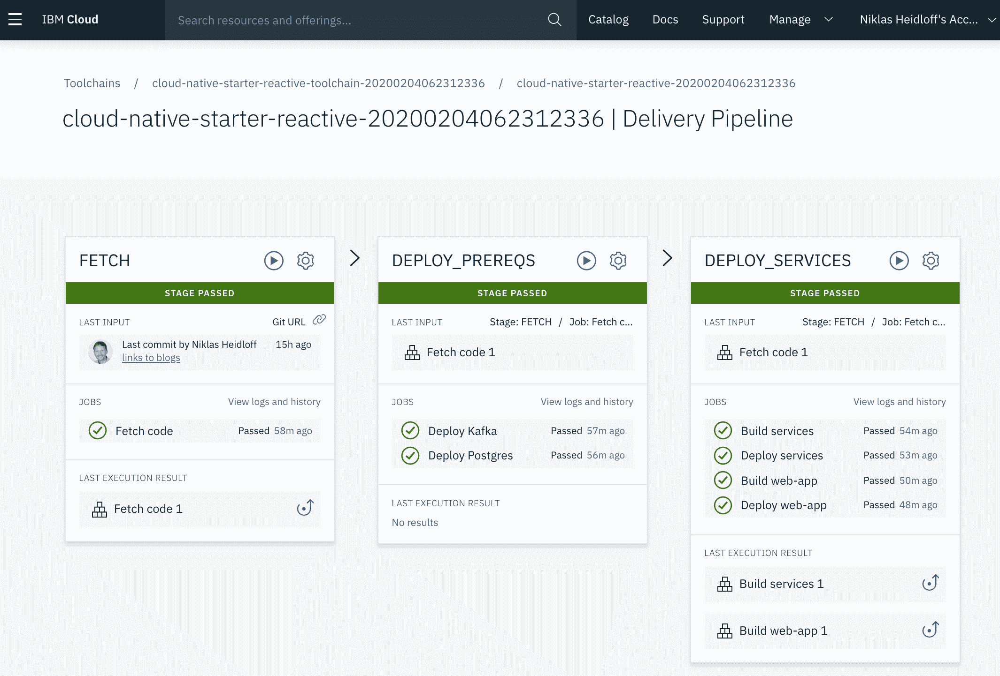

# 使用反应式 Java 技术构建更高效的应用程序

> 原文：[`developer.ibm.com/zh/articles/deploy-reactive-quarkus-microservices-on-ibm-cloud-kubernetes-service/`](https://developer.ibm.com/zh/articles/deploy-reactive-quarkus-microservices-on-ibm-cloud-kubernetes-service/)

# 简介

在本文中，学习如何在客户端无需进行任何设置的情况下在 [IBM Cloud Kubernetes Service](https://cloud.ibm.com/kubernetes/catalog/cluster?cm_sp=ibmdev-_-developer-articles-_-cloudreg) 上部署云原生应用程序。使用 IBM Cloud 中包含 CD/CI 流水线的工具链来构建和部署所有微服务。

本文中使用的应用程序样本在 GitHub 中已经作为 [cloud-native-starter 项目](https://github.com/IBM/cloud-native-starter/tree/master/reactive)的一部分进行开源，该项目介绍如了如何开始使用基于 Java 的微服务。您可以在不到一个小时（30 到 60 分钟）内自行部署样本。

## 反应式应用程序的优势

在云原生应用程序中，“反应式”这一主题变得越来越重要，因为这种模型可以构建更高效的应用程序并提升用户体验。

反应式模型的一个优点是能够通过发送消息来更新 Web 应用程序，而不是拉取更新（pull request），从而提升用户体验。下图显示了如何使用 REST API 调用创建新对象时自动更新 Web 应用程序。

反应式系统的另一个优点是效率。例如，反应式 REST 端点可以提供更快的响应时间。特别是在成本依赖 CPU、RAM 和计算时间的公共云中，这个模型可以节省费用。在 cloud-native-starter 样本中，与同步 REST 端点相比，响应时间减半。

## Quarkus：超音速亚原子 Java 体验

该样本充分利用了 [Quarkus](https://quarkus.io/)，这是“基于最佳 Java 库和标准打造的 Kubernetes 原生 Java 堆栈 […]”（“[Quarkus：Kubernetes 原生 Java 堆栈快速入门](https://developers.redhat.com/articles/quarkus-quick-start-guide-kubernetes-native-java-stack/)”，Red Hat Developer，2019 年 10 月）。此外，还使用了 Eclipse MicroProfile、Eclipse Vert.x、Apache Kafka、PostgreSQL、Eclipse OpenJ9 和 Kubernetes。

查看本系列博客（英文），了解如何使用 Quarkus 构建反应式应用程序的更多信息：

*   “[使用 Quarkus 开发反应式应用程序](http://heidloff.net/article-development-reactive-applications-quarkus/)”
*   “[在 Kubernetes 上部署 Apache Kafka](http://heidloff.net/article/accessing-apache-kafka-from-quarkus/)”
*   “[在 Kubernetes 上部署 PostgreSQL](http://heidloff.net/article/accessing-postgresql-from-quarkus/)”
*   “[Quarkus 的反应式消息传递示例](http://heidloff.net/article/reactive-messaging-examples-quarkus/)”
*   “[使用 Quarkus 开发反应式 REST API](http://heidloff.net/article/developing-reactive-rest-apis-with-quarkus/)”
*   “[使用 Quarkus 异步调用 REST API](http://heidloff.net/article/invoking-rest-apis-asynchronously-with-quarkus/)”
*   “[PostgreSQL 的同步和异步访问之比较](http://heidloff.net/article/comparing-synchronous-asynchronous-access-postgresql/)”
*   “[部署到 Red Hat OpenShift](https://haralduebele.blog/2020/02/03/cloud-native-and-reactive-microservices-on-red-hat-openshift-4/)”
*   “[将 OpenJ9 JVM 用于 Quarkus 应用程序](http://heidloff.net/article/openj9-jvm-for-quarkus-applications/)”

## 在 IBM Cloud Kubernetes Service 上部署

为了尽可能轻松地部署样本应用程序，我们已经创建了一个工具链。不需要进行客户端安装和配置。工具链安装了以下组件：

*   PostgreSQL 和管理客户端
*   Kafka
*   微服务：文章，作者，web-api
*   Web 应用程序
*   Eclipse Orion Web IDE

要能够触发工具链，您需要具备三个[先决软件](https://github.com/nheidloff/cloud-native-starter-reactive-toolchain/blob/master/README.md)，当然这三个条件都可免费获得：[IBM ID](https://cloud.ibm.com/registration?cm_sp=ibmdev-_-developer-articles-_-cloudreg)、[IBM Cloud Kubernetes Service](https://cloud.ibm.com/kubernetes/catalog/cluster?cm_sp=ibmdev-_-developer-articles-_-cloudreg) 和 [IBM Container Registry](https://cloud.ibm.com/kubernetes/catalog/registry?cm_sp=ibmdev-_-developer-articles-_-cloudreg)。

满足所有先决条件后，只需单击一个按钮即可部署应用程序。查看下面这个 GitHub 代码库以了解分步[操作说明](https://github.com/nheidloff/cloud-native-starter-reactive-toolchain/blob/master/README.md#step-1)。

下一个屏幕截图展示了流水线。最后一个作业 “Deploy web-app” 的日志显示了访问应用程序所需的所有 URL。

工具链和流水线的[定义](https://github.com/nheidloff/cloud-native-starter-reactive-toolchain)也已经在 GitHub 中开源提供，您可以使用这些定义作为自己的工具链的起点。

编码愉快！

本文翻译自：[Build more efficient applications with reactive Java technologies](https://developer.ibm.com/articles/deploy-reactive-quarkus-microservices-on-ibm-cloud-kubernetes-service/)（2020-02-18）