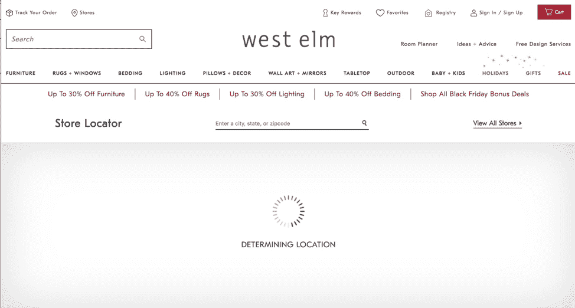
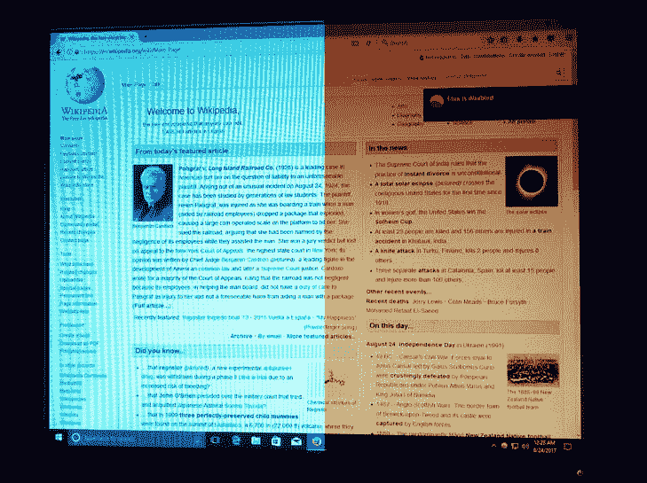
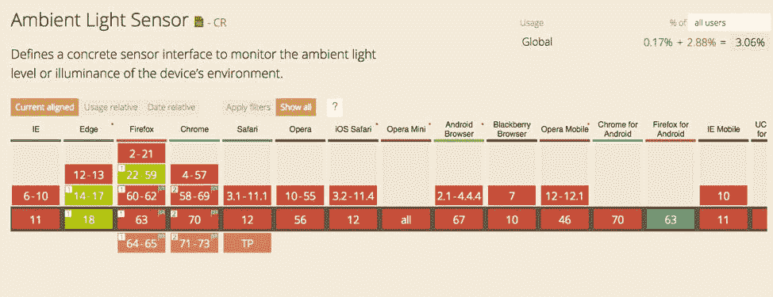
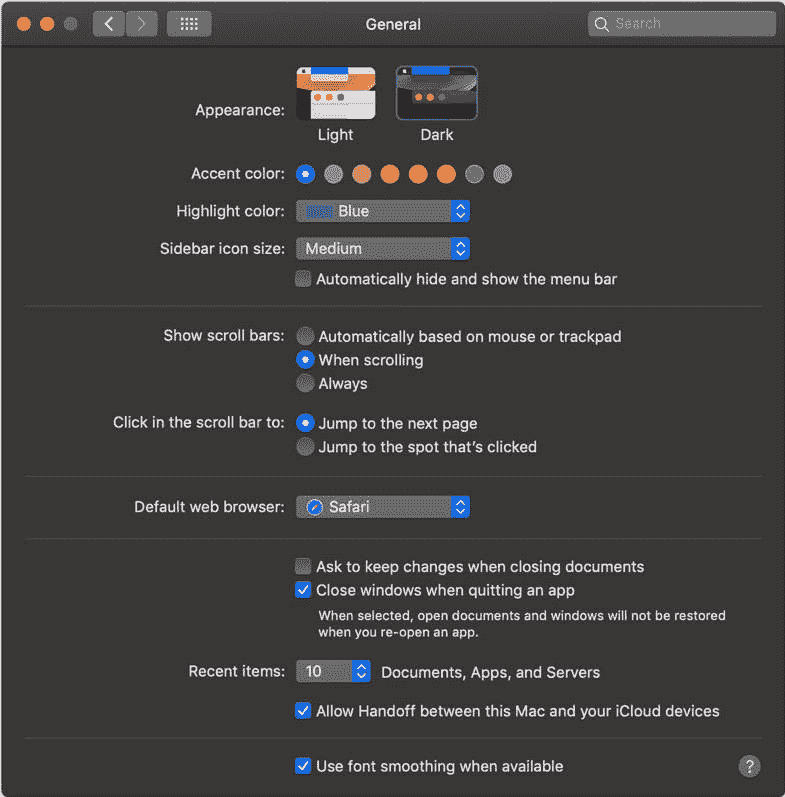
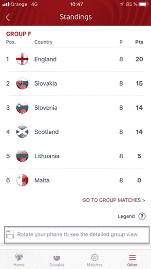
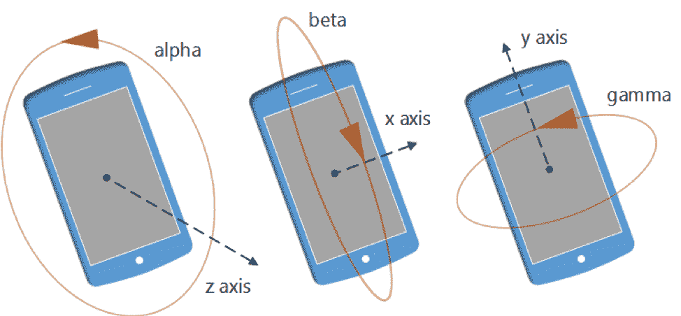

# 响应式设计的未来

> 原文：[`developer.ibm.com/zh/articles/responsive-design-future/`](https://developer.ibm.com/zh/articles/responsive-design-future/)

看到“响应式设计”一词时，您会想到什么？移动设备还是台式设备？它的设计方式能否适应各种屏幕尺寸？使用移动触控还是使用鼠标？组件是否会根据其在页面上的位置而改变形状？这些可能是我们过去对响应式设计的认知，但肯定不是全部。考虑响应式设计时，我们可以（也应该）考虑响应式设计如何影响用户的使用背景，以及如何根据用户需求和体验作出最快的响应。

这里所提到的“背景”远远不止是屏幕尺寸；当用户访问应用程序时，还需要考虑以下因素：

*   用户所在的位置
*   光线强度和噪声级别
*   用户当地时间（包括时区）
*   用户握持设备的方式以及用户访问设备的最佳方式（该设备的个人设置）

未来的响应式设计需要考虑用户的时空背景、用户设备的时空背景以及用户在指定设备上的时空偏好。基本上都是围绕这些方面展开。我们目前访问和开发的 Web 浏览器使我们能够在设计中利用这些输入。我们现在可以访问设备的位置、光线强度或光线偏好、方向和电量，并围绕这些元素做出设计选择。

## 位置检测

位置检测（也称为“地理定位”）是网上目前最常见的基于浏览器的检测机制之一。如果您想要购买家具，并正在寻找最近的 West Elm 商店，那么 [West Elm 网站](http://westelm.com/)可以为您提供帮助，它可通过您的确切位置来找到最近的商店：



对于提供最佳用户体验，这是默认行为。West Elm 首先试着帮助用户以最少的工作量找到最近的商店。在这种情况下，“工作量”是指在字段中输入数据或在地图上执行搜索。但是，West Elm 希望浏览器将您的位置发送到服务器来完成这项工作，这样他们就可以知道结果了。

### 远不止商店定位器

尽管这是最常见的用例，但是还有许多其他原因会导致位置检测影响产品的用户界面（UI）和用户体验。可以将“位置”表示为与任何对象的接近度。在商店定位器中，“位置”是指距离商店的远近，但是“位置”也可以用于整理距离某一活动的远近。

如果您要构建一个涉及位置的调度应用程序，则可以告诉用户他们离目的地有多远（例如，步行 5 分钟）。如果用户要去参加聚会，那么可以更改 UI 以提醒用户聚会时间就快到了。如果用户始终朝着某个位置走但转错了方向，那么该应用程序可以向他们发出警报。Facebook 使用位置信息让发生伤亡事件的位置附近的人们能够将自己标记为“安全”。如果您是一家媒体公司，那么可以使用位置信息向用户分享有关他们所在城市的相关动态。我敢肯定，您还能想到位置信息在移动应用程序中的其他用途。

开发移动应用程序时，原生 Java 和 Swift 也提供了用于检测位置的接口。您会发现许多不同类型的应用程序中都使用了这些接口：从用于追踪随时间变化的距离以计算速度的健身应用程序（例如 [MapMyFitness](https://www.mapmyfitness.com/us/)），到社交分享应用程序（例如 [Snapchat](https://www.snapchat.com/)）中基于位置的过滤器，再到可帮助您导航到某个位置的地图（例如 [Google Maps](https://maps.google.com/)）。

在许多因素的共同推动下，使用位置检测，可以在各种不同类型的产品（原生和基于 Web）中设计更好的用户体验。让我们来深入了解如何通过一个 Web 示例来实际完成这一任务。

### 使用 HTML5 地理定位应用程序

如果我们只想获取用户所在的国家/地区，则可以使用 ipinfo.io 之类的服务来执行 IP 查找。通过使用 IP，我们可以访问用户的所在城市、区域、国家/地区、区号、邮编等。

如果要获取用户的实际位置，则需要使用 JavaScript，如 Adeyinka Adegbenro 在她的 Medium 文章 “[How to detect the location of your website’s visitor using JavaScript](https://medium.com/@adeyinkaadegbenro/how-to-detect-the-location-of-your-websites-visitor-using-javascript-92f9e91c095f)” 中所示：

```
if ("geolocation" in navigator) {
  // check if geolocation is supported/enabled on current browser
  navigator.geolocation.getCurrentPosition(
   function success(position) {
     // for when getting location is a success
     console.log('latitude', position.coords.latitude,
                 'longitude', position.coords.longitude);
   },
  function error(error_message) {
    // for when getting location results in an error
    console.error('An error has occured while retrieving
                  location', error_message)
  }  
});
} else {
  // geolocation is not supported
  // get your location some other way
  console.log('geolocation is not enabled on this browser')
} 
```

出于安全考虑，浏览器或设备必须请求用户提供其位置访问权限：


如果授予了权限，则可以使用计算出的纬度和经度，并通过代码创建更具体的位置（如下所示，来自 Medium 文章）：

```
function success(position) {
  // for when getting location is a success
  console.log('latitude', position.coords.latitude,
             'longitude', position.coords.longitude);
  getAddress(position.coords.latitude, position.coords.longitude)
} 
```

您可以试用一个基本的 [HTML5 地理定位演示（由 Johan Sundström 在 codepen.io 中提供）](https://codepen.io/johan/pen/kenBj)。

有了这些数据，我们可以在地图上实现可视化，并且可以处理不同地点之间的距离数据。具体要在哪里使用地理定位，完全取决于您的创造力。

## 时间

时间也可以被视为“衡量接近度的主要标准”。就像位置一样，您应该考虑与用户有关的时间以及他们使用应用程序的体验。距离某个活动还剩多少时间？距离打折销售结束还剩多少时间？距离新产品销售开始还剩多少时间？制定许多决策时，都需要考虑时间因素，而为了尽可能满足用户的需求，也需要考虑时间因素。

我喜欢这款[手表 UI](https://dribbble.com/shots/3440639-Swiss-watch-face-design-with-artificial-intelligence-by-Gleb)，它是由 [Glev Kuzenstov](https://dribbble.com/glebich) 设计的，他想象有这样一款手表：它不仅可以为用户提供时间，还可以与用户的日程安排紧密配合，以清晰地显示与日程安排相关的时间。他们将在 X 分钟后参加会议，并且界面上可以反映从黑夜到白天的相应变化：


### 使用地域（locale）字符串

[Moment.js](https://momentjs.com/) 等软件包可帮助您解析时间并将其与用户的时区和需求相关联。Web 浏览器本身也为我们提供了许多不同的选项来解析日期字符串，其中一个就是 `toLocaleString`。

`toLocaleString()` 方法将返回一个表示对象（与特定于地域的用户需求有关）的字符串。与货币和价格的本地化一样，`LocaleString` 允许将某个数字或日期戳解析为用户自己的数字或时间表示形式。思考以下[来自 MDN Web 文档的 JavaScript 代码](https://developer.mozilla.org/en-US/docs/Web/JavaScript/Reference/Global_Objects/Date/toLocaleString)：

```
var event = new Date(Date.UTC(2012, 11, 20, 3, 0, 0));

// British English uses day-month-year order and 24-hour time without AM/PM
console.log(event.toLocaleString('en-GB', { timeZone: 'UTC' }));
// expected output: 20/12/2012, 03:00:00

// Korean uses year-month-day order and 12-hour time with AM/PM
console.log(event.toLocaleString('ko-KR', { timeZone: 'UTC' }));
// expected output: 2012.12.20.오전 3:00:00 
```

## 光线强度

[Flux](https://justgetflux.com/) 等应用程序使用基于时间的维度来影响 UI。例如，Flux 可以减弱夜间屏幕上的蓝光以帮助您入睡。


维基百科([`en.wikipedia.org/wiki/F.lux#/`](https://en.wikipedia.org/wiki/F.lux#/)) 中 [Flux](https://justgetflux.com/) 的拼接式截屏 – [Creative Commons 许可](https://creativecommons.org/licenses/by-sa/3.0)

Apple 公司在 iOS 11 中发布了名为[夜间模式](https://lifehacker.com/how-to-activate-night-shift-and-apples-secret-invert-1818590859)的功能，此功能实际上就是用于减弱蓝光以防止深夜使用设备的用户失眠。

在不同的环境中，阅读能力会受到光线强度的影响，就像 Flux 一样，我们可以更改应用程序或网站的 UI，并根据用户周围的光线强度或用户设置的偏好来调整其需求。

那么，这在哪里可以派上用场呢？主要在清晰度方面。

这里的想法是使光线与用户环境匹配。 在光线较强的场合下，由于与屏幕周围的亮度相比，屏幕上的对比度和鲜艳度都降低了，因此难以阅读屏幕上的内容。在光线较暗的场合下，由于眩光与环境相比强度太大，因此难以阅读过于明亮或对比度过高的内容。在这种情况下，较暗的 UI 更易于阅读屏幕上的内容，而我们可能希望 UI 在光线较强的场合下具有更高的对比度和更大的文字。它可能看起来如此：


移动设备会自动完成此操作。当手机检测到光线较强的场合时会提高亮度（使屏幕更亮），在光线较暗的场合中则会降低亮度。这是大多数移动设备上的默认设置。但是，当尝试在 Web 上实现这一点时，需要做的工作会更多一些。

### 环境光（ambient light）查询

过去，开发者仅可以用 JavaScript 通过环境光查询来检测光线。这种方法一度时期在特定浏览器上是可行的，但存在安全隐患，硬刺在 Firefox 中已弃用此功能。

您可以在 [caniuse.com](https://caniuse.com/#search=ambient%20light%20sensor) 上检查各种浏览器的功能，例如，检查哪些版本的浏览器支持环境光传感器：



如果正在使用 Edge 或早期版本的 Firefox，则您可以看到一个有效演示（无标志）；否则，您可以通过 Chrome 中的标志来启用此功能。参阅[环境光事件演示（由 Tomomi Imura 在 codepen.io 上提供）](https://codepen.io/girliemac/pen/pvmBs/)。

### 亮色和暗色外观设置

但是，在新版的 MacOS 中发布了一种[新方法](https://support.apple.com/en-us/HT208976)，可以让用户来控制光线强度，同时还允许开发者根据这些选择来自定义样式。Safari 浏览器将此功能与 CSS 媒体查询相结合，让开发者在启用暗黑模式时可以更好地控制其 Web 应用程序的样式。已在 [W3C Media Queries Level 5](https://drafts.csswg.org/mediaqueries-5/#prefers-color-scheme) 中注册这项新标准。



现在，如果要为明亮和暗黑模式设置样式，则可以使用新的媒体查询：

```
/* Light mode */
@media (prefers-color-scheme: light) {
  body {
    background: white;
    color: black;
  }
}

/* Dark mode */
@media (prefers-color-scheme: dark) {
  body {
    background: black;
    color: white;
  }
} 
```

这会导致在明亮模式下白色背景主体使用黑色文字，在暗黑模式下黑色背景主体使用白色文字。为用户构建 UI 时，它可以让我们对用户偏好做出更快的响应。

## 设备屏幕朝向

通过改变设备朝向，也可以增强和改善用户体验。设计 UI 时，需要确保应用程序能够适应所有屏幕尺寸（包括各种朝向）。由于可以根据 Web 上的视口高度 (vh) 和视口宽度 (vw) 来设置样式，因此可以考虑在设备旋转后使 UI 变宽和变短。我们还可以使用 CSS 来检测朝向：

```
@media (orientation: portrait) {
  /*...*/
}

@media (orientation: landscape) {
 /*...*/
} 
```

我们可以使用这些 CSS 属性，根据朝向来设置相应的样式。以一个体育应用程序为例，在这个应用程序中，可以竖屏查看结果，但使用横屏模式时可以查看更多信息。


来源：[`ux.stackexchange.com/questions/112457/visually-indicating-user-to-change-orientation-of-device`](https://ux.stackexchange.com/questions/112457/visually-indicating-user-to-change-orientation-of-device)

我们不仅可以帮助创建针对朝向量身定制的 UI，还可以使用屏幕朝向来通过手势和小触摸来发挥创意。我曾经开发了一个鸡尾酒配方应用程序，您可以摇晃设备（最好在手机上使用，但也可以在平板电脑上使用）以获取随机配方。


来源：[`github.com/una/portfolio-2014/blob/master/images/proofessor/proofshake1.gif`](https://github.com/una/portfolio-2014/blob/master/images/proofessor/proofshake1.gif)

我还见过针对 404 页面和加载屏幕的创造性用法。

### 调整设备朝向

您可以使用 JavaScript 来非常精确地调整设备朝向。但是，只需检查视口的宽度和高度，就可以轻松地确定朝向，如 David Walsh 在他的博客文章 “[Detect Orientation Change on Mobile Devices](https://davidwalsh.name/orientation-change)” 中所示：

```
if(window.innerHeight > window.innerWidth){
  console.log('vertical')
} 
```

您还可以添加事件以观察屏幕朝向的变化：

```
// Listen for orientation changes
window.addEventListener("orientationchange", function() {
  // Announce the new orientation number
  alert(screen.orientation);
}, false); 
```

以更精确的方式调整朝向时，可以使用设备的 alpha、beta 和 gamma 旋转角。alpha 角表示围绕 z 轴的旋转。beta 角是围绕 x 轴，gamma 角是围绕 y 轴。如下所示：


来源：[`github.com/guilhermefarias/device-orientation`](https://github.com/guilhermefarias/device-orientation)

我们可以像 MDN Web 文档 “[Detecting device orientation](https://developer.mozilla.org/en-US/docs/Web/API/Detecting_device_orientation)” 中所显示的那样调整设备朝向：

```
function handleOrientation(event) {
  var x = event.beta;  // In degree in the range [-180,180]
  var y = event.gamma; // In degree in the range [-90,90]
} 
```

在未来的 UI 中使用设备朝向无疑是一个有趣的想法，虽然我们现在经常在游戏中看到这个功能，但是在日常应用程序中正不断增加这种创意用法。

## 电池检测

现在，我们可以在浏览器 UI 中查看电池电量，因此可以从这方面着手改善用户体验。谣传这会用于邪恶目的（提供顺风车服务的公司针对电量不足的客户提高价格），但您完全可以（也应该）将其用于善意目的。例如，当在用户设备上检测到电量不足时，可以关闭动画或其他耗电的操作。甚至可以提供 UI 的简化版本，在这种版本下没有高分辨率图像和必须下载的不必要数据。

### 电池状态 API

Chrome 38+、Android 版的 Chrome 以及 Firefox 31+ 目前都支持[电池状态](https://w3c.github.io/battery/)。它提供了一个事件侦听器，可以基于主机设备来更新电池状态。

w3c 提供的示例如下：

```
window.onload = function () {
  function updateBatteryStatus(battery) {
    document.querySelector('#charging').textContent = battery.charging ? 'charging' : 'not charging';
    document.querySelector('#level').textContent = battery.level;
    document.querySelector('#dischargingTime').textContent = battery.dischargingTime / 60;
  }

  navigator.getBattery().then(function(battery) {
    // Update the battery status initially when the promise resolves ...
    updateBatteryStatus(battery);

    // .. and for any subsequent updates.
    battery.onchargingchange = function () {
      updateBatteryStatus(battery);
    };

    battery.onlevelchange = function () {
      updateBatteryStatus(battery);
    };

    battery.ondischargingtimechange = function () {
      updateBatteryStatus(battery);
    };
  });
}; 
```

在这里，不仅可以查看电池电量，还可以查看电池是否正在充电，并相应地更新电池状态。[Guille Paz](http://pazguille.me/) 创建了一个很棒的基础性[电量演示（已在 GitHub 中发布）](http://pazguille.github.io/demo-battery-api/)。

## 结束语

有了这些新的浏览器 API 和原生应用程序功能，不仅可以让应用程序开发者大受裨益，还可以通过一种更全面的方式来考虑用户体验。响应式设计不再局限于“适应屏幕尺寸”这一项功能，而是可以扩展为考虑用户使用过程中的方方面面，从而帮助根据用户的需求和情况来提供最佳的应用程序。

本文翻译自：[The future of responsive design](https://developer.ibm.com/technologies/mobile/articles/responsive-design-future)（2018-12-17）