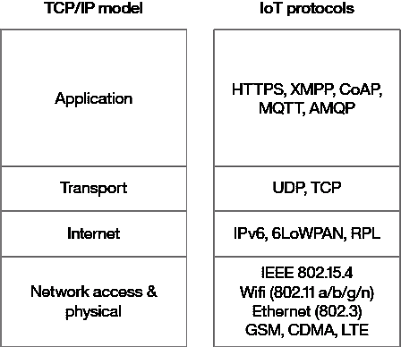

# 连接物联网中的所有事物

> 原文：[`developer.ibm.com/zh/articles/iot-lp101-connectivity-network-protocols/`](https://developer.ibm.com/zh/articles/iot-lp101-connectivity-network-protocols/)

##### 学习路径: 开始使用物联网开发

本文是 IoT 101 学习路径的一部分，是物联网开发人员的快速入门指南。

*   物联网概念和技能
*   物联网硬件指南
*   物联网网络指南（本文）
*   物联网平台
*   教程：构建一个简单的家庭自动化系统

通信对物联网极为重要。网络技术使得 IoT 设备不仅能与其他设备进行通信，还能与在云中运行的应用程序和服务进行通信。互联网依靠标准化的协议来确保能够在各种各样的设备之间安全可靠地进行通信。标准协议指定了设备用来建立和管理网络，以及在这些网络间传输数据的规则和格式。

我们通常认为，网络是由堆栈技术构建的，堆栈底部的技术（比如蓝牙低功耗）与物理连接设备相关，而堆栈中更靠上的技术（比如 IPv6）与逻辑设备寻址和网络流量路由相关。堆栈顶部的技术（如消息排队技术）由运行在这些层之上的应用程序使用。

在本文中，我将介绍一些被广泛采用的 IoT 网络技术和标准。还将解释你将如何选择哪种网络协议。然后我将讨论与 IoT 中的网络相关的关键考虑因素和挑战，包括传输距离、带宽、电量使用、间歇连通性、互操作性和安全性。

## 网络标准和技术

开放式系统互联 (OSI) 模型是一种 ISO（国际标准化组织） 标准抽象模型，它描述了一个包含 7 层的协议栈。这些层从上往下依次是：应用层、表示层、会话层、传输层、网络层、数据链路层和物理层。TCP/IP 或[互联网协议套件](https://en.wikipedia.org/wiki/Internet_protocol_suite)支撑着互联网，提供了 OSI 模型中各层的简化的具体实现。

##### OSI 和 TCP/IP 网络模型

TCP/IP 模型仅包含 4 层，并合并了 OSI 模型的一些层（参见 OSI 和 TCP/IP 网络模型）：

*   **网络接入和物理 层**

    这个 TCP/IP 层包含 OSI 的第 1 和第 2 层。物理 (PHY) 层（OSI 的第 1 层）负责如何通过硬件将每个设备以物理方式连接到网络，例如通过光缆、电线或在 wifi 等无线网络中通过无线电 (IEEE 802.11 a/b/g/n) 连接。在链路层（OSI 的第 2 层），设备由 MAC 地址标识，这一层上的协议负责物理寻址，比如交换机如何将帧传送到网络上的设备。

*   **互联网层**

    这一层对应于 OSI 的第 3 层（网络层），它关系到逻辑寻址。这一层上的协议定义了路由器如何在 IP 地址所标识的源和目标主机之间传送数据包。IoT 设备寻址通常采用 IPv6。

*   **传输层**

    传输层（OSI 中的第 4 层）专注于端到端通信，提供的特性包括可靠性、避免拥塞，并且保证将包按照被发送的相同顺序送达。出于性能原因，IoT 传输常常采用 UDP（用户数据报协议）。

*   **应用层**

    应用层（OSI 中的第 5、6 和 7 层）负责应用级消息传递。HTTP/S 是互联网上被广泛采用的应用层协议的一个例子。

尽管 TCP/IP 和 OSI 模型抽象的提供了有用的用于讨论的网络协议，以及实现每种协议的具体技术，但实际上，一些协议无法恰当地归入这些分层模型中。例如，使用加密来确保网络流量的隐私和数据完整性的传输层安全 (TLS) 协议，可能被认为是跨 OSI 的第 4、5 和 6 层而运行。

## IoT 网络协议

IoT 中被广泛采用且能归入 TCP/IP 层的一些网络协议如与 TCP/IP 模型对应的 IoT 网络协议所示。

##### 与 TCP/IP 模型对应的 IoT 网络协议

IoT 领域正在采用许多新兴且有竞争性的网络技术。许多技术由不同的供应商提供或针对不同的垂直市场，比如家庭自动化、医疗保健或工业 IoT，它们通常为相同的标准协议提供了替代性实现。例如，[IEEE 802.15.4](https://en.wikipedia.org/wiki/IEEE_802.15.4) 描述了低速率无线个域网 (LR-WPAN) 的工作原理，并且由多种竞争性技术实现，包括 ZigBee、Z-Wave、EnOcean、SNAP 和 6LoWPAN。

例如，用于连接互联网的技术（比如以太网）通常可应用在 IoT 中；但是，人们正在开发新的技术来专门解决 IoT 的挑战。越朝物理传输技术方向考虑协议栈，面临的特定于 IoT 设备和 IoT 上下文的挑战就越多。

网络的结构被称为网络的拓扑结构。IoT 中采用的最常见[网络拓扑结构](https://en.wikipedia.org/wiki/Network_topology)是星型和网状拓扑结构。在星型拓扑结构中，每个 IoT 设备直接与一个中央集线器（网关）相连，该集线器会传输来自上游连接设备的数据。在网状拓扑结构中，设备与传输距离内的其他设备以及网络中的节点相连，这些设备可充当简单的传感器节点，也能充当路由流量的传感器节点，或者充当网关节点。网状网络比星型拓扑结构的网络更为复杂，但优势在于故障恢复能力更强，因为它们不依赖于单个中央网关。

### 网络接入层和物理层 IoT 网络拓扑结构

需要知道的靠近协议栈底部的 IoT 网络技术包括蜂窝技术、wifi 和以太网，以及更专业的解决方案，比如 LPWAN、蓝牙低功耗 (BLE)、ZigBee、NFC 和 RFID。

根据 Gartner 报告，NB-IoT 正在成为 LPWAN 网络的标准，要了解关于 NB-IoT 的更多信息，请阅读这篇 [IoT for All 文章](https://iot-for-all.com/what-is-narrowband-iot-nb-iot/)。

*   **LPWAN**

    （[低功耗广域网](https://en.wikipedia.org/wiki/LPWAN) 是一种专为低功耗、长距离无线通信而设计的技术类别，所以它们非常适合用在无线传感器等低功耗 IoT 设备的大规模部署中。LPWAN 技术包括 LoRa（LongRange 物理层协议）、Haystack、SigFox、LTE-M 和 NB-IoT（窄带 IoT）。

*   **蜂窝技术**

    LPWAN [NB-IoT](https://en.wikipedia.org/wiki/NarrowBand_IOT) 和 [LTE-M](https://www.link-labs.com/blog/what-is-lte-m) 标准旨在使用现有的蜂窝网络提供低功耗、低成本的 IoT 通信选择。NB-IoT 是这些标准中的最新标准，专注于大量主要在户内的设备之间的长距离通信。LTE-M 和 NB-IoT 是专为 IoT 开发的，但是长距离无线通信中也经常采用现有的蜂窝技术。这些技术包括 2G (GSM)，主要用在遗留设备中，该技术目前正被逐渐淘汰，CDMA、3G 和 4G 也是如此。

*   **蓝牙低功耗 (BLE)**

    [BLE](https://en.wikipedia.org/wiki/Bluetooth_low_energy) 是流行的蓝牙 2.4 GHz 无线通信协议的低功耗版本。它专为短距离（不超过 100 米）通信而设计，通常用在星型配置中，有一个控制多个辅助设备的主要设备。蓝牙跨 OSI 模型的第 1 层 (PHY) 和第 2 层 (MAC) 而运行，如 OSI 和 TCP/IP 网络模型所示。BLE 最适合突发性传输少量数据的设备，因为这些设备被设计为在不传输数据时休眠，以节约用电。可穿戴健康和健身跟踪器等个人 IoT 设备常常使用 BLE。

*   **ZigBee**

    [ZigBee](https://zigbeealliance.org/) 也在 2.4GHz 无线通信频谱上运行，但它的传输距离比 BLE 的最长 100 米更长。与 BLE（270 kbps）相比，它的数据传输速率稍微低一些（最高 250 kbps）。ZigBee 是一种网状网络协议，不同于 BLE，不是所有设备都能在没有突发性传输数据时休眠，这取决于它们在网格中的位置以及是否需要充当网格中的路由器或控制器。ZigBee 专为建筑和家庭自动化应用而设计，比如控制照明。另一种与 ZigBee 紧密相关的技术是 Z-Wave，它也基于 IEEE 802.15.4 MAC。Z-Wave 也是专为家庭自动化而设计，它曾经是一种专用技术，最近才[作为一种公共领域规范发布](http://www.sigmadesigns.com/news/sigma-designs-releases-z-wave-interoperability-layer-into-the-public-domain/)。

*   **NFC**

    [近场通信 (NFC)](https://en.wikipedia.org/wiki/Near_field_communication) 协议用于非常短距离的通信（最远 4 厘米），比如手持一张 NFC 卡或标签靠近读卡器。NFC 常常用于支付系统，但它对签到系统和工业 IoT 应用中用于跟踪资产的智慧标签也很有用。

*   **RFID**

    [RFID](https://en.wikipedia.org/wiki/Radio-frequency_identification) 表示射频识别。RFID 标签存储标识符和数据，并将它们附加到设备上供 RFID 读取器读取。RFID 的典型传输距离小于 1 米。RFID 标签可以采用有源、无源或辅助无源形式。无源标签非常适合没有电池的设备，因为 ID 由读取器被动读取。有源标签会定期广播其 ID，而辅助无源标签在 RFID 读取器出现时会变为有源。[**Dash7**](http://www.dash7-alliance.org/) 是一种通信协议，它使用了专为在工业 IoT 应用中使用而设计的有源 RFID，以便执行安全的长距离通信。类似于 NFC，RFID 的典型用例是在零售和工业 IoT 应用中跟踪库存商品。

*   **Wifi**

    [Wifi](https://en.wikipedia.org/wiki/Wi-Fi) 是基于 IEEE 802.11a/b/g/n 规范的标准无线网络技术。802.11n 提供了最高的数据吞吐量，但代价是功耗很高，所以出于节能原因，IoT 设备可能仅使用 802.11b 或 g。尽管许多原型和最新一代 IoT 设备中都采用了 wifi，但随着长距离和低功耗解决方案变得更加普遍，wifi 可能会被这些低功耗替代方案所取代。

*   **以太网**

    [以太网](https://en.wikipedia.org/wiki/Ethernet)采用了 IEEE 802.3 标准，被广泛部署在局域网内，以便建立有线连接。不是所有 IoT 设备都必须是设计小巧的无线设备。例如，安装在建筑自动化系统内的传感器装置可使用以太网这样的有线网络技术。电力线通信 (PLC) 是一种替代性的硬线解决方案，它使用现有的电线代替专门的网线。

### 互联网层 IoT 网络拓扑结构

互联网层技术（OSI 第 3 层）负责识别和路由数据包。与这层相关且 IoT 通常采用的技术包括 IPv6、6LoWPAN 和 RPL。

*   **IPv6**

    在互联网层，设备由 IP 地址标识。IPv6 通常用于 IoT 应用，而不是传统的 IPv4 寻址。IPv4 被限定为 32 位地址，总共仅能提供约 43 亿个地址，这少于目前连网的 IoT 设备数量，而 IPv6 采用了 128 位地址，所以能提供 2¹²⁸个地址（约 3.4 × 10³⁸或 340 x 10 亿 x 10 亿 x 10 亿 x 10 亿个地址）。实际上，并不是所有 IoT 设备都需要公共地址。在预计未来几年内连接到 IoT 的数百亿个设备中，许多设备将部署在私有网络中，这些网络将使用私有地址范围，而且仅使用网关与外部网络上的其他设备或服务进行出站通信。

*   **6LoWPAN**

    [IPv6 低功耗无线个域网 (6LoWPAN)](https://en.wikipedia.org/wiki/6LoWPAN) 标准允许在 802.15.4 无线网络上使用 IPv6。6LoWPAN 常常用于无线传感器网络，而且用于家庭自动化设备的 [Thread](http://threadgroup.org/) 协议也在 6LoWPAN 上运行。

*   **RPL**

    互联网层还负责路由。[IPv6 低功耗和有损网络路由协议 (RPL)](https://tools.ietf.org/html/rfc6550) 专为在低功耗网络（比如在 6LoWPAN 上实现的网络）上路由 IPv6 流量而设计。RPL（发音为“ripple”）被设计用于在受限的网络中路由数据包，比如无线传感器网络，在这些网络中，不是所有设备都始终可达，而且存在很高或无法预测的包丢失量。RPL 能基于动态指标和约束条件（比如最低能耗或延迟）来构建网络中的节点图，从而计算最佳路径。

### 应用层 IoT 网络拓扑结构

HTTP 和 HTTPS 在互联网应用中随处可见，在 IoT 中也是如此，IoT 中广泛部署了 RESTful HTTP 和 HTTPS 接口。CoAP（受限应用协议）就像一种轻量级 HTTP，常常与基于 UDP 的 6LoWPAN 结合使用。MQTT、AMQP 和 XMPP 等消息协议也常常用在 IoT 应用中：

*   **MQTT**

    [消息队列遥测传输 (MQTT)](http://mqtt.org/) 是一种基于发布/订阅的消息协议，专为在低带宽情况下使用而设计，特别适合不可靠网络上的传感器和移动设备。

*   **AMQP**

    [高级消息排队协议 (AMQP)](https://en.wikipedia.org/wiki/Advanced_Message_Queuing_Protocol) 是一种用于面向消息的中间件的开放标准消息协议。很显然，AMQP 由 [RabbitMQ](https://www.rabbitmq.com/) 设计。

*   **XMPP**

    [可扩展消息和状态协议 (XMPP)](https://en.wikipedia.org/wiki/XMPP) 最初是为包括即时消息在内的实时人类间通信而设计的。此协议针对机器间 (M2M) 通信进行了调整，以实现轻量级中间件和路由 XML 数据。XMPP 主要用于智慧家电。

这一层上选择的技术将取决于 IoT 项目的具体应用需求。例如，对于涉及多个传感器的经济型家庭自动化系统，MQTT 是一个不错的选择，因为它非常适合在没有太多存储或处理能力的设备上实现消息功能，而且该协议的实现既简单又轻便。

## IoT 网络考虑因素和挑战

考虑在 IoT 应用中采用哪些网络技术时，一定要留意以下限制：

*   传输距离
*   带宽
*   功耗
*   间歇连通性
*   互操作性
*   安全性

### 传输距离

网络可通过附加到网络的 IoT 设备的典型数据传输距离来描述：

*   **PAN（个域网）**

    PAN 是一种短距离网络，其中的距离是以米为单位来衡量的，比如通过 BLE 与手机上的应用通信的可穿戴健身跟踪器设备。

*   **LAN（局域网）**

    LAN 是一种短到中等距离的网络，其中的距离最长可达数百米，比如家庭自动化或安装在工厂生产线中的传感器，它们通过 wifi 与安装在同一建筑中的网关设备进行通信。

*   **MAN（城域网）**

    MAN 是一种长距离（城市级）网络，其中的距离可达数千米，比如通过网状网络拓扑结构相连的遍及全城的智能停车传感器。

*   **WAN（广域网）**

    WAN 是一种长距离网络，其中的距离可达数千米，比如安装在大型农场中用于监视整个农场上的微气候环境条件的农业传感器。

您的网络应该设计为，从 IoT 设备中获取数据，并将数据用于这些设备中。所以请确保您选择的网络协议与您的用例所需的传输距离相匹配。例如，不应为需要跨数千米距离运行的 WAN 应用选择 BLE。如果在所需的距离内传输数据存在挑战，可考虑边缘计算，它可以将数据分析转移到设备上，而不是将数据转移到别处进行处理。

### 带宽

带宽，或在特定时间段内能传输的数据量，限制了可从 IoT 设备收集数据并传输到上游的速率。考虑以下因素：

*   每个设备生成的数据量
*   部署在网络中的设备数量
*   数据是源源不断地发送还是间歇性地突发性发送，因为需要使用可用的带宽来应对高峰时段

您选择的网络协议的包大小应与通常传输的数据大小相匹配。发送填满空数据的包是一种低效操作，但另一方面，将更大的数据块拆分为太多小包也会产生开销。数据传输速率并不总是对称的（也就是说，上传速率可能低于下载速率）。因此，如果设备间存在双向通信，则需要考虑数据传输。无线和蜂窝网络通常具有较低的带宽，所以需要考虑对高数据量应用选择无线技术是否妥当。

另外，考虑是否所有原始数据都需要传输。一个解决方案可能是通过降低采样频率，捕获更少的变量，或者在设备上执行某种过滤来丢弃不重要数据，从而捕获更少的数据。如果在传输数据前对其进行聚合，有助于减少要传输的数据量，但是此过程会影响上游分析的灵活性和粒度。聚合和突发性发送并不总是适合时间敏感或延迟敏感的数据。所有这些技术还会增加 IoT 设备的数据处理和存储需求。

### 功耗

从设备传输数据会消耗电力，长距离传输数据需要的电力比短距离更多。必须考虑依靠电池运行的设备，以节约用电，从而延长电池寿命和减少操作成本。要延长电池寿命，可以在设备空闲时让其进入休眠模式。一个不错的主意是对设备在不同负载和不同网络条件下的能耗进行建模，确保设备的电源供应和存储容量与使用特定网络技术传输必要数据所需的电量相匹配。

### 间歇连通性

IoT 设备并不总是处于连接状态。在某些情况下，设备被设计为定期连接，以节省用电或带宽。但是，有时不可靠的网络可能导致设备由于连接问题而掉线。有时会出现服务质量问题，比如处理使用共享频谱的无线网络上的干扰或信道争用。

### 互操作性

有如此多不同设备连接到 IoT，互操作性可能是一大挑战。采用标准协议是在互联网上维护互操作性的传统方法。但是，对于 IoT，标准化流程有时很难跟上快速的变化节奏，而且发布的技术基于即将出现的标准版本，而这些标准仍可能发生变化。在这些情况下，可以考虑围绕这些技术的生态系统；也就是说，询问以下问题：它们是否被广泛采用？它们是开放的还是专用的？有多少实现可用？

### 安全性

安全始终是优先考虑事项，所以一定要选择实现端到端安全的网络技术，包括身份验证、加密和开放端口保护。例如，IEEE 802.15.4 包含的一种安全模型提供了许多安全特性，包括访问控制、消息完整性、消息机密性和重放保护，这些特性是由基于此标准的技术（比如 ZigBee）实现的。

*   **身份验证**

    采用安全协议来支持设备级的网关、用户、应用和服务身份验证。例如，考虑采用 X.509 标准来执行设备身份验证。

*   **加密**

    如果使用 wifi，那么可以使用 WPA2（Wireless Protected Access 2，无线保护接入第 2 代）来执行无线网络加密，或者可以采用 PPSK（Private Pre-Shared Key，私有预共享密钥）方法。要确保应用之间的通信的隐私和数据完整性，一定要采用 TLS 或基于 TLS 的 DTLS（数据报传输层安全），但要针对在 UDP 上运行的不可靠连接进行调整。TLS 会加密应用数据并确保其完整性。

*   **端口保护**

    端口保护确保只有与网关、上游应用或服务通信所需的端口是保持对外部连接开放的。所有其他端口都应被禁用或受防火墙保护。例如，在通用即插即用 (UPnP) 漏洞被利用时，设备端口可能被公开，所以应在路由器上禁用 UPnP。

## 结束语

选择要采用的 IoT 网络技术的整个过程中都涉及到折中考虑。您选择的网络技术会影响 IoT 设备的设计，而且我在本文中讨论的大部分考虑因素都是相互依赖的。例如，网络传输距离、数据速率和功耗都是直接相关的。如果增加网络传输距离或速率和传输的数据量，IoT 设备几乎肯定需要额外的电力来在这些条件下传输数据。

对于基本的家庭自动化项目，电源考虑标准可能不太重要，因为设备很可能直接通过壁式插座供电。带宽限制和连接丢失具有更高的优先级，所以您可以采用 wifi，因为它提供了合理的带宽，而且使得该项目更容易使用商用硬件进行构建。但是，wifi 没有针对低功耗设备进行优化，所以对于通过电池供电的设备，该选择可能不是一个好的选择。

在本文中，我概述了一些最常用于 IoT 的网络协议和技术。您需要根据这些 IoT 网络挑战来考虑您的需求，找到最适合您的 IoT 应用的技术。

本文翻译自：[Connecting all the things in the Internet of Things](https://developer.ibm.com/articles/iot-lp101-connectivity-network-protocols/)（2020-01-31）