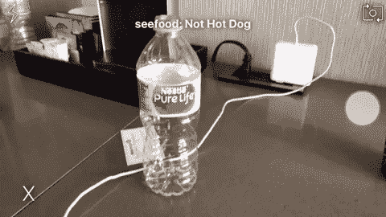
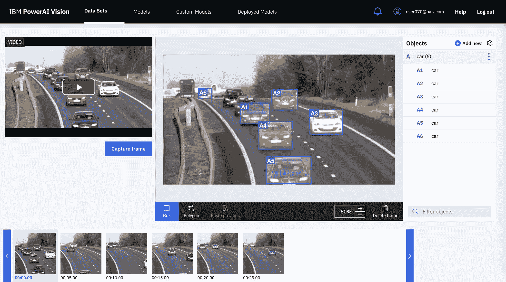

# 计算机视觉简介

> 原文：[`developer.ibm.com/zh/articles/introduction-computer-vision/`](https://developer.ibm.com/zh/articles/introduction-computer-vision/)

**本文已纳入 [IBM Maximo Visual Inspection 入门](https://developer.ibm.com/zh/series/learning-path-powerai-vision)学习路径**。 | 级别 | 主题 | 类型 | | — | — | — | | **100** | **[计算机视觉简介](https://developer.ibm.com/zh/articles/introduction-computer-vision)** | 文章 | | 101 | [IBM Maximo Visual Inspection 简介](https://developer.ibm.com/zh/articles/introduction-powerai-vision) | 文章| | 201 | [构建并部署 IBM Maximo Visual Inspection 模型并在 iOS 应用中使用](https://developer.ibm.com/zh/tutorials/build-and-deploy-a-powerai-vision-model-and-use-it-in-ios/) | 教程 | | 202 | [通过对象检测定位并统计物体](https://developer.ibm.com/zh/patterns/locate-and-count-items-with-object-detection/) | Code Pattern | | 203 | [使用 OpenCV 和深度学习对视频中的对象进行跟踪](https://developer.ibm.com/zh/patterns/detect-track-and-count-cars-in-a-video/) | Code Pattern | | 301 | [验证计算机视觉深度学习模型](https://developer.ibm.com/zh/patterns/validate-deep-learning-models/) | Code pattern | | 302 | [使用 IBM Maximo Visual Inspection 针对 AI 项目开发分析仪表板](https://developer.ibm.com/zh/patterns/develop-analytical-dashboards-for-ai-projects-with-powerai-vision) | Code Pattern | | 303 | [自动化视觉识别模型训练](https://developer.ibm.com/zh/patterns/upload-datasets-for-training-models-in-ibm-visual-insights/) | Code Pattern | | 304 | [在仪表板中加载 IBM Maximo Visual Inspection 推断结果](https://developer.ibm.com/zh/patterns/generate-dashboards-of-insights-from-inferred-results) | Code Pattern | | 305 | [构建对象检测模型以从汽车图像中识别车牌](https://developer.ibm.com/zh/patterns/custom-inference-script-for-reading-license-plates-of-cars) | Code Pattern | | 306 | [自动化视频分析](https://developer.ibm.com/zh/patterns/derive-insights-from-asset-on-a-transmission-tower/) | Code Pattern | | 307 | [通过 AI 对实时摄像头流和视频收集洞察](https://developer.ibm.com/zh/patterns/glean-insights-with-ai-on-live-camera-streams-and-videos/) | Code Pattern |

## 概述

摄像头无处不在。视频和图像已成为人工智能领域中最有趣的数据集之一。特别是，使用深度学习技术来创建计算机视觉模型，然后训练这些模型，从而使应用程序能够识别图像（或视频）的内容。

## 学习目标

本文介绍了计算机视觉的基础知识，并说明了如何在应用程序中使用计算机视觉。您将学习以下内容：

*   图像分类
*   对象检测
*   视频中的对象跟踪
*   创建自定义模型
*   使用模型
*   示例用例

## 常用术语的定义

| 术语 | 定义 |
| --- | --- |
| 数据集 | 在我们的例子中，数据集是图像和视频的集合。例如，众多汽车的图像就是一个数据集。 |
| 模型 | 模型是一套可产生预测输出的调整算法。模型将根据数据集所提供的输入进行训练，以便能够对图像或视频帧进行分类，或在图像或视频帧中找到对象。 |
| 类别 | 类别可用于对图像进行分类。一幅图像只能属于一个类别。示例中包含汽车图像的数据集的类别是汽车制造商（例如丰田、本田、雪佛兰或福特）。 |
| 对象 | 对象可用于标识图像或特定视频帧中的具体物品。您可以在图像或视频帧中标记多个对象。汽车图像中的对象示例可以是车轮、前灯或挡风玻璃。 |

## 计算机视觉基础知识

要了解计算机视觉，您首先要了解图像分类，然后再了解对象检测。在这两种情况下，关于使用自定义模型在应用程序中应用这些功能的方式，您有无数种选择。某些高级应用程序（例如，用于检测动作或跟踪视频中的对象的应用程序）都是根据这些基础知识来构建的。

### 图像分类

想要构建一个图像分类解决方案，用于检查图像并根据模型对图像进行正确分类。模型可以很简单，比如著名的热狗/非热狗模型，这是一个二元模型，您只想知道图像是否是热狗的图像。您可能会认为二元模型的应用很有限，虽然的确如此，但是如果考虑到应用程序可能根据简单二元模型做出的所有 if/else 决策，您会发现很多二元模型用例。即使是像医学检验这样复杂的事情，往往也会得出简单的肯定/否定答案，而这可以通过图像分类来实现。

下面的示例展示了如何处理视频和简单模型。注意，它是使用视频（而不是图像）构建的，视频就是一系列连续图像（帧）。当前帧是否被识别为热狗。

*二元图像分类示例应用程序*

有许多图像分类用例都不是使用二元分类。对于这些用例，您可以训练模型来识别多个类别。除了返回所选类别外，还会返回置信度百分比。利用此置信度百分比，可以选出最可能的类别，但是当置信度太低而无法被信任时，也可以使用阈值来选出最可能的类别。

例如，在此[图像分类教程](https://developer.ibm.com/zh/tutorials/build-and-deploy-a-powerai-vision-model-and-use-it-in-ios/)中训练了一个模型，用于对鸟类图像进行分类。以下 Swift 应用程序示例是在 iPhone 上运行，并根据 100% 的置信度将海鸥图片分类为鸥属。

*多类别分类示例应用程序*

#### 对象检测

对象检测与图像分类十分相似，不同之处在于，当图像包含多个对象时，对象检测可以对这些对象进行定位并对图像进行分类。在此[对象检测 Code Pattern](https://developer.ibm.com/zh/patterns/locate-and-count-items-with-object-detection/) 中训练了一个模型，它不仅可以对可口可乐的图像进行分类，还可以对图像中的各个瓶子进行定位。

在下图中，您会看到已识别出三种不同类别的可口可乐产品。除了返回标签和置信度外，它还提供了相应的坐标，让应用程序可以在每个标识的对象周围绘制边框。

*对象检测示例应用程序*

对象检测可用于各种各样的用例，它不是只有一个分类来描述整张图像，而是可以检测出图像中多个不同类别的对象。它让应用程序能够识别对象、定位对象并统计对象数量，从而扩大了这种计算机视觉的应用范围。

### 视频中的对象跟踪

在视频中使用对象检测时，您通常希望逐帧跟踪对象。通过从视频中提取帧并检测帧中的对象，可以初步完成对象检测。除了统计对象数量和定位每个对象外，还可以逐帧跟踪对象。

以下示例展示了[对象跟踪 Code Pattern](https://developer.ibm.com/zh/patterns/detect-track-and-count-cars-in-a-video/) 如何使用对象检测和对象跟踪来为视频添加注释并统计汽车数量。

*对象检测和跟踪示例应用程序*

## 创建自定义模型

我已经介绍了图像分类和对象检测（和跟踪）的基础知识，现在我们来讨论如何使用深度学习技术来创建这些应用程序以及适合于自己用例的应用程序。实际上，做起来比听起来还要容易得多。

为了使用深度学习和卷积神经网络来识别图像中的对象，前期已经做了很多的准备工作。现有的模型已经知道如何识别边缘、形状、图案等。通过所谓的*迁移学习*，我们可以充分利用现有模型，并使用自己的数据集来重新训练这些模型。

### 提供示例

对于示例鸟类分类器，我们只需提供一个包含各种鸟类示例图像的完善数据集即可。利用迁移学习和包含已知预期结果的新数据集，我们可以创建一个新的鸟类*图像分类*模型。

如果使用 Maximo Visual Inspection，则可以通过用户界面上传图像并对其进行分类，然后按一下按钮即可训练模型。就是这样简单。也可以使用其他框架，通过编写少量代码来做到这一点。虽然复制他们的示例代码、换成自己的数据集并将图像映射到自定义类别这些操作都不难，但拥有易于使用的 UI 却可以帮助您更快入门。

虽然*对象检测*与图像分类十分相似，但是对象必须包含在用于训练的数据集中。要创建对象检测模型，必须提供图像以及每个对象在图像中的位置（例如，坐标）。

另外，Maximo Visual Inspection 还提供了一个可以简化该操作的 UI，我们将在以下示例中使用这个 UI。无论使用哪种框架，都需要上传图像并提供图像中每个对象的标签和坐标。对象检测的标记工作通常要比图像分类更加耗时。而且，训练对象检测模型所需的计算时间通常会更长一些。通过使用 GPU 和最新的算法，可以缩短训练时间（这样便可以使用更完善的数据集来创建更精确的模型）。

下图展示了对象检测的标记方法。在此示例中，利用 Maximo Visual Inspection，通过从视频中提取帧来创建数据集。然后，在所选帧中通过拖拽在每辆汽车周围绘制一个框，以手动标记这些汽车。在完成一些手动标记后，可以通过自动标记和数据扩充来加快完成标记工作。

*手动标记*

在幕后，Maximo Visual Inspection 是基于开源技术构建的。无论您是想利用易于使用的 UI 还是更喜欢编写一些代码并更直接地使用开源 API，都可以在具有 GPU 的 Power Systems 上运行，以便缩短训练时间并更快地创建更完善的模型。

### 训练、验证和测试

训练模型本质上是迭代示例图像并调整权重以提高预测算法准确性的过程。在这里，我不会详细介绍深度学习和卷积神经网络，但是您可以通过迁移学习来使用深度学习，而不必过多考虑内部算法。但是，要创建和维护精确的模型，您需要注意一些事项。

对数据集进行拆分，从而将训练与验证分开。此操作可以自动完成（例如，使用 Maximo Visual Inspection 时）。您需要记住这一点：训练会导致过度拟合。随着不断地训练数据来提高准确性，模型最终可能变得“非常精确”。它在识别用于训练的图像时的准确性几乎可达到 100%，但并不擅长识别新图像中的物体。这种情况称为过度拟合。您需要一个比这个模型更健壮的模型，因此需要使用验证集来验证训练结果，从而避免过度拟合。

在指定数量的区间上运行训练和验证后（如果准确性没有提高，则可能提前取消），您将获得一个模型。通常，您还会获得模型准确性报告。切记，此准确性只与提供的数据有关。

虽然验证也是训练工作的一部分，但是最好另外提供一些测试数据，以了解模型在处理不属于训练（或验证）数据集的图像时的准确性。通常，您会发现需要不断用新数据来评估模型，并在需要时使用改进数据集来重新训练模型。

## 使用模型

前面的示例展示了各种应用情况，用于说明如何获取输入图像并使用自定义模型来生成结果（图像分类或对象检测）。*推理*是指获取输入并*推断*其类别或对象的过程。可以使用模型来完成此过程。虽然训练花费的时间很长，但是在完成训练后，模型会得到优化，并且可以用于推理。虽然具体细节因框架、语言和平台而异，但是都会部署（或加载）模型，并提供可供应用程序代码调用的 API。使用这个 API，应用程序代码可以获取图像，生成推理结果，并选择结果的显示方式。

## 示例用例

虽然我已经展示了一些示例并表明有无数种选择，但还是有必要列出一些示例用例，帮助您了解如何应用计算机视觉。

*   **汽车：**监控繁忙的十字路口，防患于未然
*   **消费品：**监控货架上的产品质量或数量
*   **医疗保健：**检测皮肤镜图像中的黑色素瘤
*   **制造业：**统计传送带上的物品数量并对其进行分类
*   **媒体：**分析广告投放的成效
*   **能源：**使用无人机远程检查基础设施

## 结束语

本文是 [IBM Maximo Visual Inspection 入门](https://developer.ibm.com/zh/series/learning-path-powerai-vision)学习路径的第一部分。继续完成此学习路径，通过实践教程和示例代码来提高您自己的技能水平。要继续完成 Maximo Visual Inspection 学习路径，可阅读下一篇文章：[IBM Maximo Visual Inspection 简介](https://developer.ibm.com/zh/articles/introduction-powerai-vision)。

本文翻译自：[Introduction to computer vision](https://developer.ibm.com/articles/introduction-computer-vision/)（2019-07-18）