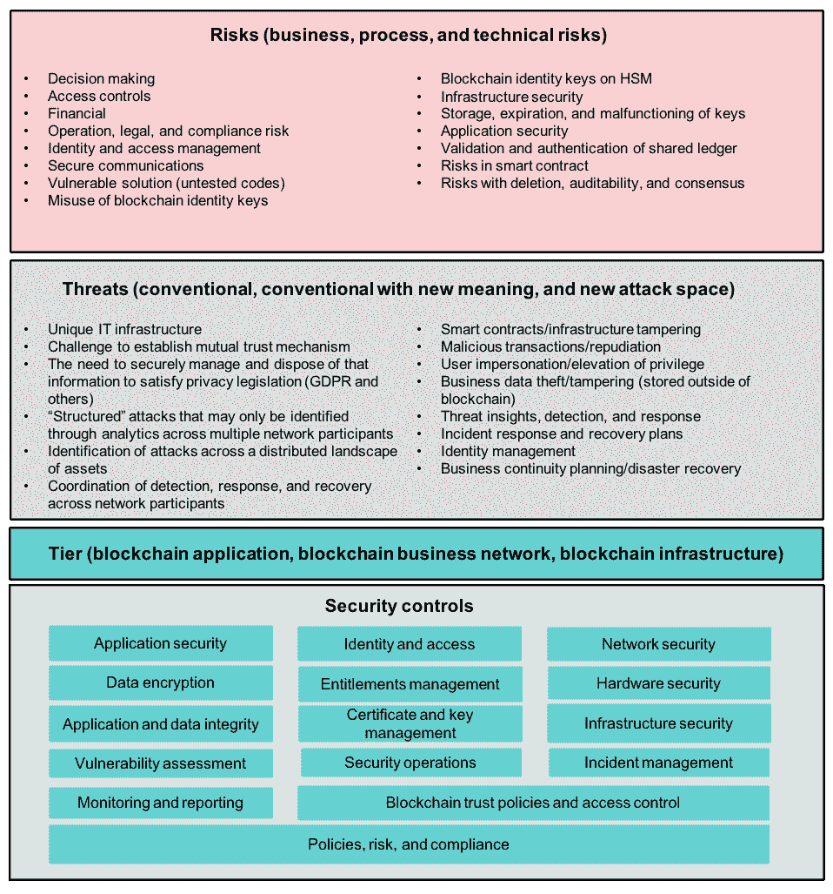

# 保护您的区块链解决方案

> 原文：[`developer.ibm.com/zh/articles/how-to-secure-blockchain-solutions/`](https://developer.ibm.com/zh/articles/how-to-secure-blockchain-solutions/)

本文着重介绍了可广泛应用于各种区块链项目和解决方案的区块链安全参考架构，此架构适用于各行各业的内部部署和软件即服务 (SaaS) 环境内的用例与部署。它审视了区块链所特有的安全风险与威胁，然后介绍了主要的区块链安全控制措施，以及其他业务控制措施和传统的安全控制措施。最后，本文还展示了一个可用于保护任何区块链解决方案的区块链安全参考架构和安全模型。

我们强烈建议您根据此区块链安全模型审查自己设计和架构的解决方案，确保已妥善采取所有措施为自己的区块链解决方案提供充分的保护。

## 区块链同样也会遭受网络攻击

区块链是一个经过许可和复制的共享账本，具备共识性、可证明性、永恒性和最终性这些特征。共享账本可以确保参与者能够决定要共享的资产，并能够掌握作为交易对象的其他参与者的身份。区块链还为参与者提供可证明的背书，并附带有保密性，即只能在“需要知道”的基础上共享信息。

区块链和区块链应用程序同样也会遭受网络攻击和欺诈，这早已不是什么秘密。以下是几个示例：

*   [去中心化自治组织 (DAO)](https://www.nytimes.com/2016/06/18/business/dealbook/hacker-may-have-removed-more-than-50-million-from-experimental-cybercurrency-project.html) 是一个风险投资基金，通过受比特币启发而产生的去中心化区块链来开展业务，它因代码惨遭不良利用而被盗取价值超过 6000 万美元的以太数字货币（约占其价值的三分之一）。

*   总部位于中国香港特别行政区的全球最大加密货币交易所之一 [Bitfinex](https://www.reuters.com/article/us-bitfinex-hacked-hongkong-idUSKCN10E0KP) 曾发生一起价值近 7300 万美元的客户比特币失窃案，由此证明此类货币仍然存在巨大风险。发生此类失窃案的原因可能是密钥失窃。

*   全球最大的以太坊和比特币加密货币交易所之一 [Bithumb](https://www.coindesk.com/crypto-exchange-bithumb-hacked-for-13-million-in-suspected-insider-job) 最近遭到黑客入侵，30,000 名用户数据惨遭泄露，价值 870,000 美元的比特币不幸失窃。即使遭到黑客入侵的只是一名员工的计算机，而不是核心服务器，该起事件仍引发了人们对于整体安全性的担忧。

应对和检验区块链的密钥安全问题或风险有助于确保区块链解决方案的安全。

## 与基于区块链的解决方案相关联的安全风险

安全关乎风险管理，因此首先务必要认清与区块链解决方案关联的风险。区块链解决方案的特定风险取决于所使用的区块链类型。让我们来了解一下以下各种不同类型的区块链，它们的风险程度逐步降低，安全程度则逐步增加：

*   **公共区块链**是任何人都可参与并验证交易的公开型区块链。此类区块链通常风险较高（例如，加密货币）。这包括任何人都可以参与区块链且缺乏任何级别的控制或限制措施这样的风险。

*   **私有区块链**为受限型区块链，通常仅限于业务网络范围内，通过单一实体（监管机构）或联盟机构来控制成员资格。

*   **无许可区块链**对于处理商无任何限制。

*   **许可区块链**允许对账本进行加密，仅限相关参与者才能查看，并且只有满足“需要知道”条件的人才能对其进行解密。

区块链解决方案还存在许多其他风险，这些风险大体上可归为以下三个方面：

*   **业务与监管：**业务风险包括财务影响、声誉因素与合规风险。监管风险主要源自于区块链解决方案的去中心化本质，需要严格控制决策条件、监管策略、身份和访问管理。

*   **流程：**这些风险与区块链解决方案在其架构和运作中所需的各种流程有关。

*   **技术：**用于实现各种流程和业务需求的底层技术并不一定就是最佳选择，这最终可能会导致出现安全风险。

表 1 中展示了上述风险的部分示例。

**表 1\. 风险类别和关联风险及描述**

| 类别 | 风险 | 风险描述及示例 |
| --- | --- | --- |
| 业务与监管 | 决策制定 | 区块链解决方案具有去中心化的监管流程，该流程因缺乏策略合规与决策制定控制措施而产生相应的风险。 |
| 访问控制 | 缺乏集中监管还可能导致降低了对平台访问者以及为每个用户所提供访问级别的控制能力。如果成员在各自组织内采用不同的用户分类方法，那么这可能导致更严重的问题。 |
| 财务 | 区块链解决方案中的财务风险主要来自于因可能出现的安全违规而导致欺诈交易和关键数据丢失的风险。  |
| 审计、法律与合规风险 | 平台上的某些操作可能依赖于区块链上存储的数据或者需由链上数据进行验证的某些数据。这可能会在法规合规性以及系统与应用程序审计合规性方面带来一些挑战。它还可能引发存疑数据定责方面的法律风险。 |
| 流程 | 身份和访问管理 (IAM) | 未经授权访问平台可能会为相关成员带来极为严重的后果，包括关键数据丢失、运作暂停以及拒绝访问。缺乏 IAM 还可能导致错误调用某些智能合约功能。 |
| 安全通信 | 解决方案内不同节点之间或者解决方案与外部组件之间不安全的通信可能会导致错误导向，从而引发传输级别的安全问题。这还可能引发与访问许可权限以及来自内部攻击的威胁相关的挑战。 |
| 易受攻击的解决方案（代码未经测试） | 通过未经 DLT 认证的流程或方法传入的未经测试的代码或解决方案可能易于遭受黑客攻击，从而影响整体业务和解决方案的可操作性。  |
| 硬件安全模块 (HSM) 上的区块链身份密钥 | 使用共享 HSM 来存储区块链身份密钥时，某一组织的一组密钥可能会与其他组织的密钥混在一起。 |
| 基础架构安全 | 为架构区块链解决方案而部署的底层基础架构可能具有多种问题，包括不必要的访问权限以及试图进入网络的不需要的程序包。 |
| 技术 | 密钥的存储、到期和故障 | 区块链身份和交易令牌是解决方案的重要组成部分。伴随证书和密钥到期、续订、归档与撤销的挑战可能会给平台的正常运行带来巨大的风险。 |
| 应用程序安全性 | 区块链本身不可变且防篡改，但使用网络的应用程序会在各个层面带来挑战。 |
| 共享账本的校验和身份认证 | 了解共享账本的有效性和真实性至关重要。这同样也是一门新兴技术，随之而来的风险有时也是未知数。 |
| 智能合约中的风险 | 智能合约是区块链解决方案的重要组成部分，而在实现这些合约或者其交易过程中存在的任何逻辑缺陷都可能导致验证的合约或交易发生错误。 |
| 与删除、可审计性和共识相关的风险 | 当某一方退出联盟时，考虑删除相关参与方的风险以及采取相应的操作流程至关重要。区块链中的分布式网络设置容易在可审计性和共识性方面引发风险。 |

通过分析上述着重介绍的风险，然后衍生出基于区块链的解决方案的风险模型，这是至关重要的。设计区块链解决方案时，主要考虑的因素包括：

*   哪些特定功能是区块链所独有的？
*   对参与组织/成员采用何种监管模型？
*   在每个区块内将捕获哪些数据？
*   相关法规要求有哪些？如何通过区块链来满足这些要求？
*   如何管理身份详细信息？是否加密区块有效负载？如何管理和撤销密钥？
*   区块链参与方的灾难恢复计划是什么？
*   区块链参与客户的最低安全状况如何？
*   采用何种逻辑来解决区块链的区块冲突？

## 区块链安全威胁模型

解决方案的安全性也应在其威胁模型环境内进行评估。区块链究其本质，具备强大的记录完整性保证，但在基于区块链的应用程序的其他部分中仍可能会出现各种错误，从而导致泄露和损失。部分示例包括访问控制力度较弱、密钥和证书管理保护措施宽松，以及通信安全不足。为此类应用程序提供适当保护的关键在于，为其开发全面的威胁模型并弥补已识别的漏洞。

身份假冒、篡改、抵赖、信息泄露、拒绝服务攻击和特权提升 (STRIDE) 模型是一个著名的模型，用于研究参与者与资产之间的关系，审查与这些关系相关的威胁和漏洞，并提供相关缓解建议。

区块链应用程序通常整合参与者所有和管理的各种外部组件，包括身份和访问管理 (IAM) 系统、多因子认证 (MFA)、公共密钥基础架构 (PKI) 以及监管与审计系统。这些系统需要经过仔细审查后方可成为整体解决方案的一部分，因为它们是由第三方开发或控制的。对于区块链解决方案中的威胁模型，这些都应考虑在内。

图 1 考虑了多种因素，并衍生出了可在基于区块链的实现中应用的威胁模型。

**图 1\. 区块链解决方案中的威胁模型**

图 1 中所展示的威胁可分为三大类：

1.  全新威胁态势 – 这些是区块链特有的威胁。
2.  传统威胁有了新的含义 – 随着区块链的加入，传统威胁产生了新的含义，也带来了新的威胁。
3.  传统威胁管理 – 这些是任何解决方案都需要应对的常见威胁。

1

### 全新威胁态势

*   在此独特的 IT 基础架构中，区块链引入了尚未被充分理解的新范式。大部分漏洞都存在于各种独立组件以及这些组件的连接方式之中。
*   系统包含大量参与者，每个参与者都可能采用自己的身份管理机制，因此，为适当管理共识建立必要的互信机制并不容易。
*   在为了正确识别系统参与方而收集的详细信息与安全管理和处置此类信息以满足隐私法规（GDPR 等）的需求之间，务必要找到平衡点。
*   需要在分布式资产环境中有效识别攻击行为。
*   必须在所有网络参与方之间协调检测、响应和恢复操作。
*   “结构化”攻击只能通过在多个网络参与方之间开展分析加以识别。针对区块链的攻击指向支持应用程序和基础架构时，成功的可能性最大。必须仔细统筹安排参与方与系统不同部分之间的关系。攻击者可能会尝试利用系统复杂性，以不易察觉的方式利用这些关系展开攻击。

2

### 传统威胁有了新的含义

*   区块链基础架构中的新漏洞以及篡改智能合约可能会引发新的威胁。
*   在去中心化的区块链解决方案中，用户假冒他人的行为和特权的不当提升可能会引发新的威胁。
*   区块链解决方案中的外部数据可能会被篡改或不幸失窃，从而给整体区块链解决方案带来威胁。
*   密钥和证书惨遭泄露或篡改会给区块链解决方案带来威胁。
*   服务中断同样也可能成为一种威胁。
*   恶意交易/抵赖会额外带来更多威胁。

3

### 传统威胁的管理

*   渗透测试是所有解决方案的关键，它同样适用于区块链解决方案。
*   对整个解决方案进行漏洞扫描可以缓解大量已知威胁。
*   必须适当制定相应的威胁洞察、检测和补救流程。
*   应妥善制定事件响应与恢复计划。
*   应妥善设置身份管理最佳实践机制。
*   业务连续性规划/灾难恢复是所有区块链解决方案的关键。

由于基于区块链的不同应用程序之间存在显著差异，构建通用威胁模型因此行不通。但这些应用程序通常会与多个相似的参与者、资产和用例存在关联。在本文中，我们推荐了一种适用于这些常见元素的威胁模型，它可用作模板，充当特定项目中更详尽安全分析的起点。

## 安全的区块链解决方案需要具备哪些要素？

对于安全的区块链解决方案，首先应开发一个可以应对所有业务、监管、技术和流程风险的风险模型。

接下来，评估区块链解决方案面临的威胁并开发威胁模型，如图 1 中所示。

定义安全控制措施，根据以下三个类别来缓解风险和威胁：

*   强制实施区块链特有的安全控制措施。
*   应用传统安全控制措施。
*   为区块链强制实施业务控制措施。

### 区块链特有的安全控制措施

1.  将区块链解决方案的底层基础架构作为关键基础架构来处理。

    *   这样可以确保所有必要的安全实践都各就各位。采用并强制实施行业标准认证。
2.  适当分区并采用命名空间最佳实践来规范访问。

    *   解决方案应通过通道和命名空间进行划分，以便它可以托管所有平台成员的数字资产。划分命名空间使其能够规范对平台上托管的数字资产的访问。提前完成此操作同样有助于节省成本，因为后续再更改可能会需要返工重做。利用在网络内部、网络外部和组织内部进行分区的最佳实践。
3.  根据商业合约定义并强制实施相应的背书策略。

    *   区块链解决方案使用背书策略来定义必须满足的条件，以便确认已提交的交易是有效的。示例包括所需签名数量以及提供签名的组织。这些策略应与智能合约绑定，以便将业务网络以及与合约关联的所有数字资产和数据的安全性一并纳入考量范围。最佳做法是限定这些策略的范围，并在名称空间级别（对于整个智能合约）以及账本密钥级别（对于全局数据库中的单个条目）指定这些策略。
4.  强制实施用于访问区块链解决方案和数据的身份与访问控制措施。

    *   定义策略，确保出于适当用途为适当人员设置正确的访问级别。新成员应通过相应的身份和访问机制加入区块链平台。同时还应定义退出流程，以防任何信息外泄（通过各种不同方法执行的恶意活动）。需设置相应的审计日志和访问流程，用于向运营团队发送所有恶意活动的警报，以便有效规避此类活动。
    *   如果组织使用内部 IAM 系统并且担任身份提供商 (IDP) 角色，那么应使用相应的令牌（如 OAUTH、OIDC 和 SAML2）来执行身份验证、认证和授权。这同样也适用于其他联盟成员。围绕联盟成员是 IDP 还是服务提供商 (SP)，应提前制定相关决策。
5.  强制实施硬件安全模块 (HSM)。

    *   使用 HSM 保护区块链身份密钥至关重要。同样重要的是，确保每个组织在 HSM 中都有各自的分区用于存储密钥。使用 HSM 存储区块链身份密钥可确保密钥的安全性。HSM 分区流程可确保每个组织都有独立分区，并具有独立管理权限和角色（加密主管、加密用户、超级管理员等），用于对每个不同分区执行分区操作。
6.  对已上报的操作使用特权访问管理 (PAM) 解决方案。

    *   使用 PAM 解决方案可确保具备相应特权的相应用户能够访问组件，执行管理或变更管理操作。由于平台可能具有保密信息（包括用户和成员的支付交易数据），这显得尤为重要。
    *   PAM 解决方案应配合密码轮换和有效职责分离一起实施。配置端到端的日志记录以捕获从入口到出口的整个流程同样至关重要。对密钥的访问应链接到通知单系统，并且每次发布密钥时都应有相应的复审者。每个管理访问实例都应加以跟踪，直至通知单或变更获得核准为止。
7.  使用 API 安全性最佳实践来保护基于 API 的交易。

    *   API 是区块链解决方案不同部分之间主要的通信形式。API 需要保护，以免遭到任何不当使用，并且仅限在交易范围内使用。虽然 API 安全性由多种因素构成，但所有 API 都应实施三大控制措施：标识、身份验证和授权。利用 OAUTH 之类的行业标准来实现交互标准化并为 API 提供保护至关重要。
8.  对于应用程序和特权访问，充分利用密钥库。

    *   区块链解决方案具有多个组件，开展基于用户和基于 API 的交易时，这些组件会彼此进行交互。其中部分交易基于静态密钥，例如，密码、令牌或证书。这些密钥必须存储在密钥库（在此对密钥进行加密）中，并在运行时需要根据用途来限制访问权。密钥库需支持详细审查，以便保障合规和控制威胁。
9.  采用数据分类方法来保护数据和信息。

    *   对业务、法律和技术问题相关数据进行识别并分类，以便应用相应的信息安全控制措施来保护数据和隐私。对于区块链解决方案的所有成员，必须持续性地强制实施数据分类。
10.  对敏感信息使用隐私保护技术。

    *   充分利用以隐私为设计主体的许可账本技术，并提供相关控制措施来保护成员的隐私信息。此外，强制实施隐私保护安全控制措施来隐藏交易信息，例如，交易创建者的身份和交易详情。
11.  避免应用程序出现漏洞并保护数据。

    *   在开发生命周期内，利用 DevOps 自动执行应用程序漏洞扫描。根据数据分类分析结果在各个级别（例如，应用程序级别和数据库级别）实现数据安全性，同样也十分关键。
12.  在智能合约中强制实施访问控制。

    *   智能合约是区块链解决方案的关键组成部分，用于实施符合业务目标的策略，因此，应全面保护智能合约的方方面面。应重点关注对于智能合约生命周期管理、智能合约内的细化访问以及与智能合约协同工作的流程或应用程序的访问控制。
13.  利用可信平台模块 (TPM) 执行敏感代码。

    *   某些解决方案组件比其他组件更为重要，这些关键组件应使用可信平台模块。这有助于存储 HSM 启用的加密材料。这些模块还支持执行隐私保护链码，这样节点管理员就无法暗中操纵执行情况。
14.  从内部和外部全方位保护通信安全。

    *   确保在内部和外部交互的组件之间，通过高度安全的通道在平台上进行所有通信。这可使用共同的或标准的传输层安全性 (TLS) 解决方案来实现。此外，还可利用更高级别的安全措施，包括 IP 白名单和频繁的密钥轮换。

### 传统安全控制措施

1.  使用公司安全标准和系统来确保安全的软件开发生命周期、应用程序扫描和相应安全策略。

    *   应使用所有公司策略、标准和通用安全平台。这样可以保障一致性、可靠性、熟悉性以及运作效率。
2.  对于用户加入强制实施身份和访问管理功能。

    *   使用企业标准的身份和访问管理 (IAM) 工具来执行身份验证、访问控制和身份数据存储。
3.  强制要求多因子认证。

    *   强制要求采用多因子认证 (MFA) 和标准 IAM 工具来控制对区块链的访问。用户和管理员必须使用 MFA，无一例外。
4.  使用强大的加密密钥或证书管理。

    *   使用强大且可靠的密钥管理解决方案来管理区块链解决方案中所使用的多个密钥，包括区块链身份密钥、内部 TLS 证书、外部 TLS 证书和域证书。
    *   使用有效的内部 PKI 解决方案来管理内部 TLS 证书。
    *   对于外部 TLS 证书，就认证机构制定相应的决策。
5.  充分利用安全事故与事件管理。

    *   对于成员之间选定的事件信息，组织需要建立从平台到成员的安全事件订阅源。在架构中的所有组件之间，关键是要进行安全事故与事件管理 (SIEM)。
6.  充分利用硬件安全性。

    *   利用硬件安全模块 (HSM) 来存储关键密钥数据。由于建议的平台具有多个成员，因此建议的架构需评估 HSM 及其影响。需要一项与 HSM 的使用有关的公共开放协议才能在平台上继续操作。
    *   将密钥存储在相应的分区内，并对成员访问权加以控制。
7.  实施应用程序安全性。

    *   对单独的组件应用安全措施可确保整体解决方案不存在安全违规情况。
8.  实施基础架构安全性。

    *   网络和平台上所存储数据的基础架构安全性是关键。用于部署区块链解决方案的底层基础架构（包括所有软件和硬件组件）应得到保护。
9.  执行全面的渗透测试和漏洞评估。

    *   务必在解决方案部署的每个阶段都执行全面的渗透测试。重要的是在个别组织组件级别以及为整个系统执行漏洞评估，从而确保妥善解决所有问题。

### 业务控制措施

1.  定义并实施安全监管。

    *   确保通过各种策略、访问控制机制和报告来设置安全监管措施。
    *   为平台定义排他性监管法律（与节点位置无关），确保客户明确了解管辖争议与合法要求的法律并保障安全性。
2.  确保设置适当的合规和法律控制措施。

    *   责任是重要因素，每个组织都可能有自己的独特要求，这些要求受到其法律部门的影响。因此，关键是在出现安全违例或违规的情况下，明确定义每个成员和供应商的责任。确认符合系统和应用程序审计要求，进而确保规避这种风险。
3.  定义、限定并实施操作控制措施。

    *   区块链解决方案需要完整的安全流程列表，完成设计和构建阶段并部署解决方案后，应编译并遵循该流程列表。每个参与者、每个操作流程以及所有工作说明都应落实到位，确保项目正常运行，避免出现任何安全漏洞。

## 区块链安全参考架构

由于缺乏公认的安全标准和法规，区块链应用程序开发显然还处于萌芽状态。从安全保障的角度来看，即将实现的区块链业务网络生态系统需要全面的风险管理方法，通过利用网络安全风险框架、最佳实践和网络安全保障服务来有效规避风险。

大部分基于企业的区块链系统都需要评估和授权 (A&A) 以及操作授权 (ATO) 流程来确定是否符合法规和隐私要求，正是由于认识到这一点，我们的方法强调区块链生态系统、参与方节点和参与者共同承担安全责任。

在上一部分中您可以看到，为了构建安全的区块链解决方案，关键是要评估风险与威胁，并由此制定相应的安全控制措施。通过在区块链架构中运用安全控制措施最终可生成区块链安全参考模型，进而应用于所有区块链解决方案中。

**图 2\. 区块链安全参考架构**

图 3 所示的区块链安全模型概括了本文的重要结论，此图着重展示了保护区块链解决方案的几个最重要的部分。具体包括：

1.  仔细审查导致产生风险模型的各项风险（业务、监管、流程和技术风险）
2.  分析威胁，并衍生出威胁模型
3.  衍生出安全控制措施，规避风险和威胁，从而保护区块链解决方案

**图 3\. 基于区块链的解决方案的安全模型**

## 结束语

本文介绍了保护区块链解决方案所需的基本组件。接下来，我们强烈建议您根据此区块链安全参考架构和区块链安全模型来复查自己正在设计和架构的解决方案，进而保障您的区块链解决方案的安全性。

如需更多区块链安全资源，请参阅以下“相关内容”链接以及右侧栏中的“资源”链接。

**致谢：**下列同事也为本文做出了贡献，本文作者特此表示感谢：Adewale Omoniyi、Dmitriy Beryoza、Kapil Singh、Jeff Tennenbaum 和 Alessandro Sorniotti。

## 相关内容

*   [IBM Blockchain Platform on Cloud](http://www.ibm.com/developerworks/cn/cloud/library/cl-lo-ibm-blockchain-platform-on-cloud/index.html)
*   [学习路径：开始使用区块链](https://developer.ibm.com/cn/blog/2019/blockchain-learning-path/)

本文翻译自：[Secure your blockchain solutions](https://developer.ibm.com/technologies/blockchain/articles/how-to-secure-blockchain-solutions)（2019-07-18）