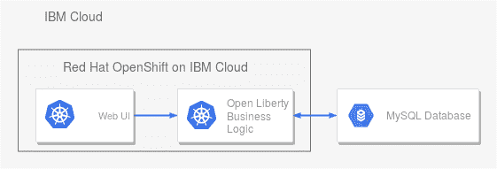
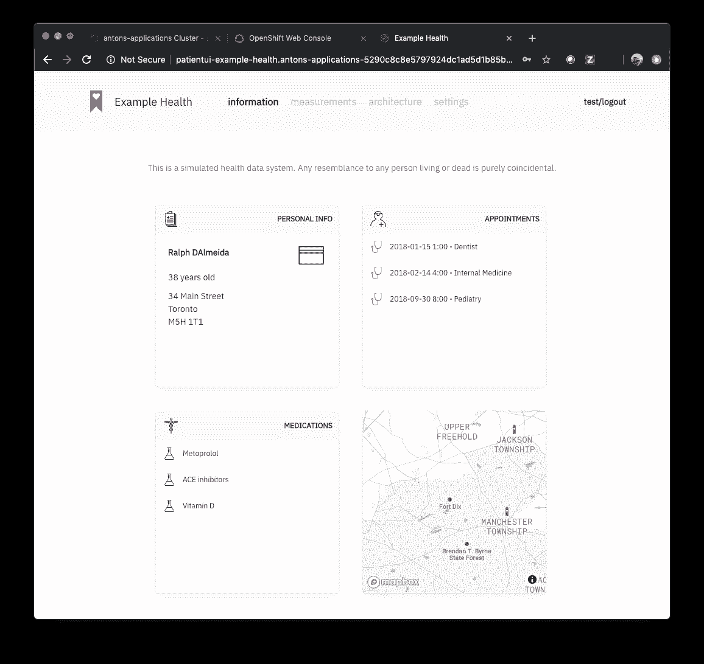
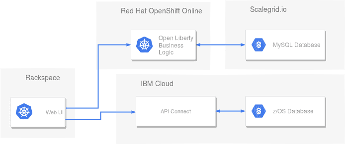

# 云原生应用程序的后端可移植性

> 原文：[`developer.ibm.com/zh/articles/back-end-portability-cloud-native-openshift/`](https://developer.ibm.com/zh/articles/back-end-portability-cloud-native-openshift/)

许多开发人员担心被锁定在一个云供应商。您的所有代码可能都托管在一个云环境中，然后当价格结构或其他方面发生变化，云就不再满足您的需求。

对于使用云产品的开发人员来说，在 Kubernetes 供应商之间迁移工作负载是必需的。但其可行性究竟如何？怎样才能轻松将各种应用迁入和迁出像 IBM Cloud 这样的云平台？对于其中的可移植性，我想要一探究竟，因此我着手寻找答案。

我发现，通过 Red Hat OpenShift 您可以使用其他云供应商，并以比我预期更简单的方式将应用程序移植到这些新的提供商。我从 Red Hat OpenShift on IBM Cloud 上的示例医疗保健应用程序开始，然后移至其他三个不同的云：Rackspace、OpenShift Online 和 Scalegrid。

**免费试用 IBM Cloud**

利用 [IBM Cloud Lite](https://cocl.us/IBM_CLOUD_GCG) 快速轻松地构建您的下一个应用程序。您的免费帐户从不过期，而且您会获得 256 MB 的 Cloud Foundry 运行时内存和包含 Kubernetes 集群的 2 GB 存储空间。[了解所有细节](https://www.ibm.com/cloud/blog/announcements/introducing-ibm-cloud-lite-account-2)并确定如何开始。

## 利用示例医疗保险应用进行试验

首先我需要一个应用程序来进行尝试，因此我选择了一个 Code Pattern：即 [Example Health](https://developer.ibm.com/cn/blog/2019/systems-example-health-series/) 用例。Example Health 正如其名，是一个虚构医疗保健和保险公司的示例应用程序。此示例用例由三个主要部分组成：用户界面 (UI)、Java 主应用本身以及数据源。下图显示了 IBM Cloud 上设置的完整应用程序版本：

为了证明可移植性，我提取了 Example Health Code Pattern 的业务逻辑部分，将其安装在另一个云平台 – 我使用的是 Red Hat OpenShift Online。（您可在[此处](https://manage.openshift.com/accounts/auth/keycloak)获取一个月试用版）。

就像许多其他应用程序一样，Example Health Code Pattern 也需要数据源。 最初，我连接到 MySQL 数据库的现有实例，我将数据库复制到托管服务 Scalegrid（同样使用的是免费试用版本），并将应用程序指向该服务。

最后一项任务是在另一个 OpenShift 提供商上设置患者 UI，这次采用的是 Red Hat OpenShift on IBM Cloud。部署 UI 后，我可以将其连接到应用程序其余部分，从而生成类似于如下截屏的结果：

## 全盘整合

我组织中优秀的伙伴们创建了 Example Health 应用程序以展示各种技术和实践。我们希望通过 [Example Health](https://developer.ibm.com/cn/patterns/app-modernization-s2i-openshift/) 展示的主要功能之一是动态切换数据源。首次打开此应用程序的患者 UI 时，缺省情况下，它使用千篇一律的响应，但您可以通过 API Connect 或 OpenShift 上的 Java Liberty 将其与 z/OS 数据库集成，如前一节所示。要指定任一响应，请在 UI 中选中 **settings** 选项卡：

在后端之间进行切换可以演示如下图所示的架构：

## 结束语

这些示例演示了如何完全地将示例应用程序迁入和迁出 IBM Cloud。[Example Health](https://developer.ibm.com/cn/blog/2019/systems-example-health-series/) 还具有一些其他用户界面。您可以想象将其中任一界面放置在任何其他云上所实现的结果…

本文翻译自：[Back-end portability for cloud-native applications](https://developer.ibm.com/articles/back-end-portability-cloud-native-openshift/)（2019-09-19）