# 构建基于容器 PaaS 平台的分布式缓存

> 原文：[`developer.ibm.com/zh/articles/cl-lo-building-distributed-cache-based-container-paas-platform/`](https://developer.ibm.com/zh/articles/cl-lo-building-distributed-cache-based-container-paas-platform/)

## 缓存在分布式系统中的作用

随着数字化时代的到来、互联网业务的发展，企业线上业务系统越来越多。线上业务有时会面临突发大业务量访问，如银行发行纪念币、节假日的旅游景点购票系统等。在面临业务量突增时，传统集中式 IT 架构与分布式架构处理方式不同，我们下面进行说明。

### 传统 IT 架构

在传统集中式的 IT 架构中，Web/APP/DB 层都使用高端的服务器作为支撑，当遇到业务量访问，可以为 APP 所在的虚拟机进行纵向扩展（增加虚拟机的 CPU、内存），如下图 1 所示。但如果业务量的增加超过预期，现有应用实例的处理能力不足以满足需求，就会造成业务系统出现问题。

##### 图 1\. 纵向扩展

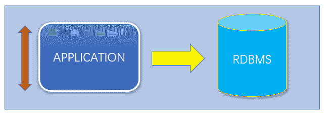

### 分布式 IT 架构

在分布式架构中面对业务量突增，App 可以进行横向扩展、通过动态增加应用实例的数量提供更强业务的处理能力，这种方式显然比横向扩展的效果更好，如下图 2 所示。横向扩展需要较快的速度，否则不能及时应对突发的大流量。目前应用的秒级弹性横向扩展，需要借助基于容器的 PaaS 平台实现。

##### 图 2\. 横向扩展

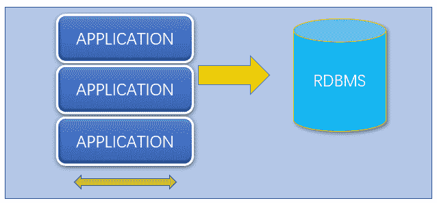

### 分布式 IT 架构下的缓存

分布式架构中，PaaS 为 App 层提供了秒级弹性横向扩展的能力。为了保证客户端的良好体验，降低数据库端的压力，通常还需要设置应用层缓存或分布式缓存。

许多应用程序在关系数据库中查询数据，这为数据库带来了很大的负载。对于许多重复的、相对静态的查询，则可以通过在缓存中缓存查询的结果来减少开销，缓存会设置到期功能用于在设定的一段时间后删除过时的查询。应用层缓存指的是在应用服务器本地上部署一套缓存，称之为 local cache。本地缓存适用于数据量访问不是特别大的情况。如果数据量特别大，需要将缓存部署成分布式集群，部署到应用服务器外部，即分布式缓存，如下图 3 所示：

##### 图 3\. 分布式缓存


为应用提供本地缓存或分布式缓存的技术，我们称之为内存数据网格（In-Memory Data Grid，简称 IMDB）。数据网格通常与传统数据存储（例如关系数据库）协同工作，通过在内存中缓存数据以便更快地访问。数据网格也作为主要数据存储而出现，其中内存中包含最新的相关数据，而较旧的、相关性较低的数据被丢弃或存储在磁盘上。

### 内存数据网格的应用场景

数据网格在企业客户有大量使用场景，例如：

*   运输和物流：运输业务通常需要实时的全球路线、跟踪和物流信息。存储在数据网格中的数据包括地理位置、目的地、来源、交付优先级等。
*   零售：在零售应用程序中，需要为数百万并发用户提供即时、最新的目录。存储在网格中的数据可以包括库存水平、价格、仓库位置、用户跟踪、用户个性化、销售、折扣和促销。
*   金融服务：金融服务应用程序包括通过股票交易模拟检查选项、使用实时准确信息进行计算。
*   媒体和娱乐：在线娱乐行业向数百万并发用户提供大量数据。数据网格可用于缓存按需流视频，同时管理安全性、用户数据和后台集成。

在介绍了缓存在分布式系统中的作用后，接下来我们来看内存数据网格的技术实现。

## 内存数据网格技术实现-Infinispan

在开源社区，Infinispan 和 Redis 是常用的内存数据网格技术，我们对此展开介绍。在本文的最后，我们将对两种方案进行对比。

### Infinispan 开源项目

Infinispan 是 Red Hat 开发的分布式缓存和键值 NoSQL 数据存储软件。它既可以用作嵌入式 Java 库，也可以用作通过各种协议 TCP / IP 远程访问的与语言无关的服务（Hot Rod，REST，Memcached 和 WebSockets）。

Infinispan 提供诸如事务、事件、查询和分布式处理等高级功能。Infinispan 可以与 JCache API 标准，CDI、Hibernate、WildFly、Spring Cache、Spring Session、Lucene、Spark 和 Hadoop 等框架的大量集成。

Infinispan 在业务系统中的所处的位置，如下图 4 所示：

##### 图 4\. Infinispan 在业务系统中的位置


Infinispan 包含如下组件：

*   Client/Server and library modules：提供 Infinispan 被调用的接口。
*   in-memory store：内存存储是存储和检索键值条目的主要组件。
*   persistent cache store：持久性缓存存储，用于永久存储缓存条目以及数据网格异常关闭后的数据恢复。
*   Amin Console：提供图形化管理工具，用于部署单点控制、管理和监控 Infinispan。

### Infinispan 的两种部署模式

Infinispan 有库模式和客户端/服务器两种部署模式。在库模式下，Infinispan（JAR 文件）随应用应用一起部署到应用服务器（如 JBoss EAP），如下图 5 所示：

##### 图 5\. 库模式

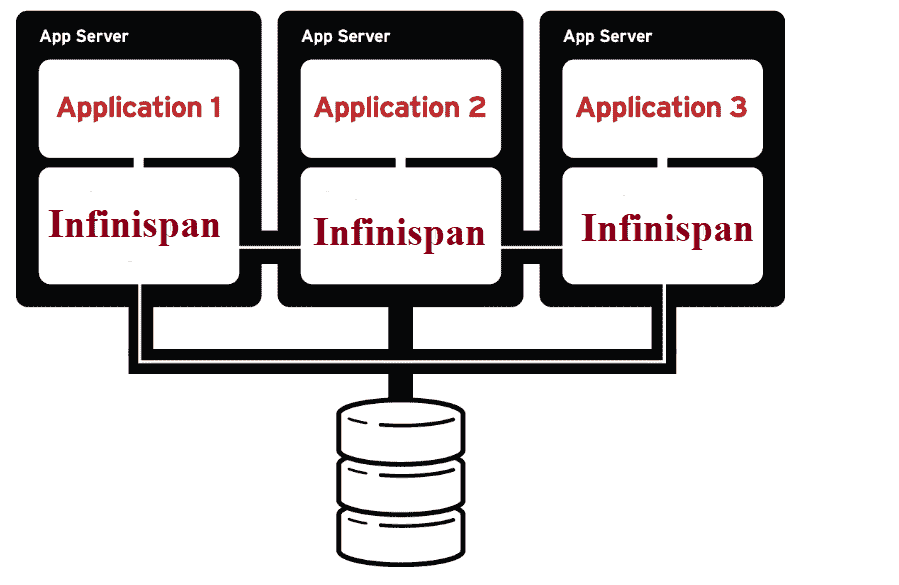

在库模式下，Infinispan 与应用程序在相同的 JVM 中运行。用户应用程序调用 InfinispanCache API 来创建缓存管理器。高速缓存管理器根据其配置参数管理高速缓存实例的创建和操作。

客户端/服务器模式将应用程序与缓存分开，这有利于 Infinispan 弹性扩展和独立维护。JBoss Data Grid 支持 Hot Rod、REST 和 Memcached 协议，供客户端调用。在客户端/服务器部署模式下，客户端仅部署给定协议和核心 API 所需的库即可，如下图 6 所示：

##### 图 6\. 客户端/服务器模式


客户端/服务器模式下，客户端是一个单独的应用程序，使用 Cache API 远程访问服务器上维护的缓存，如下图 7 所示：

##### 图 7\. 客户端/服务器客户端访问模式

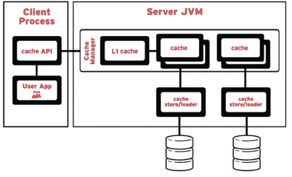

在介绍了 Infinispan 的两种部署模式后，接下来我们介绍 Infinispan 的三种配置模式。

### Infinispan 三种配置模式

Infinispan 有三种配置模式：本地缓存（Local cache）、复制缓存（Replicated cache）和分布式缓存（Distributed cache）。Infinispan 的两种部署模式都支持这三种配置模式。

本地缓存只有一个缓存副本，架构如下图 8 所示。本地缓存适合如下应用场景：

*   单个流程。
*   流程特有的数据。
*   非共享数据。

##### 图 8\. 本地缓存

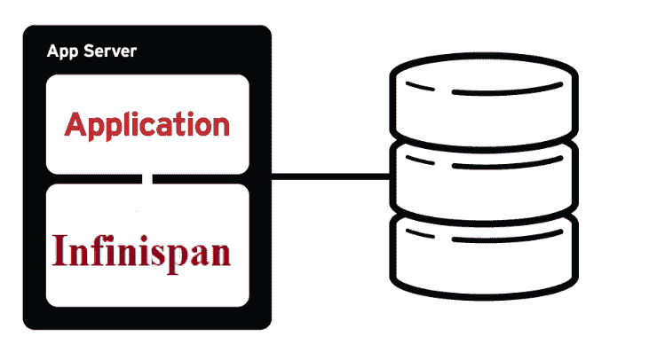

在复制缓存中，数据存储在集群中的每个节点上。复制缓存提供故障转移保护的功能，如果一个节点发生故障，则可以从另一个节点检索缓存值。

复制缓适合如下场景，架构如下图 9 所示：

*   小型固定数据集。
*   需要极高容错能力的场景。
*   多个应用程序的实时读取访问权限。

##### 图 9\. 复制缓存

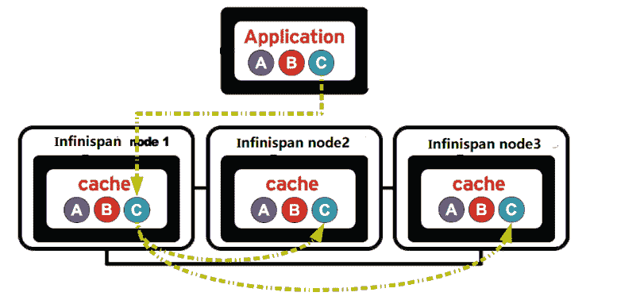

分布式缓存使用一致性散列的分布算法将数据存储在集群中的几个节点上，如下图 10 所示。分布式缓存适合如下场景：

*   跨全球数据中心管理和海量数据集处理
*   具有大波动、周期性或不可预测性的弹性数据集
*   承载从本地缓存和传统数据库转移出来的事务负载

##### 图 10\. 分布式缓存


在介绍了 Infinispan 的三种配置方式后，我们通过测试验证 Infinispan 的功能。

### Infinispan 功能验证

JBoss Data Grid 集群的模式配置，通过修改配置文件进行编辑。复制模式分为同步复制和异步复制。异步复制可以使用复制队列，更新存储在队列中定期或当队列达到大小阈值时批量传输到其他集群成员，如清单 1 所示：

##### 清单 1\. Infinispan 集群配置

```
< clustering ...
    < async
        useReplQueue="true"
        replQueueInterval="10000"
        replQueueMaxElements="500"
    /> 
```

Infinispan 分布式模式配置如下图 11 所示。配置分布式缓存的名称为 team、数据同步为异步复制、每份数据的副本是 2。在分布式的模式下，多个 Infinispan 实例可以实现双向复制。也就是说，在 Infinispan 分布式模式下，我们可以同时连接 Infinispan 的多个实例，同时向缓存中插入数据，Infinispan 实例会向其它 Infinispan 实例进行数据复制。

##### 图 11\. 分布式缓存


由于篇幅有限，本文不进行 Infinispan 的详细部署介绍。Infinispan 部署以后，可以通过 Admin Console 进行管理，登录到图形化管理界面后，查看 Infinispan 集群的 Cache containers，如下图 12 所示：

##### 图 12\. 查看 Infinispan 集群的 Cache containers


可看到上文配置的名为 teams 的分布式缓存，如下图 13 所示：

##### 图 13\. 查看分布式缓存

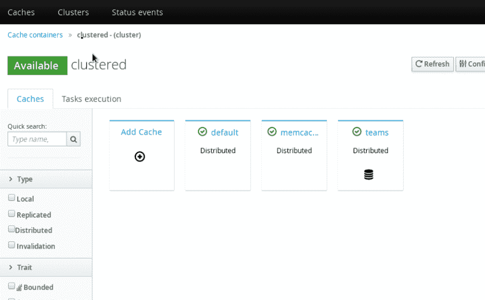

查看分布式缓存 teams 的三个节点，如下图 14 所示，此时 Total entries 的数量为 0：

##### 图 14\. 查看分布式缓存条目


接下来，我们配置客户端程序来连接缓存。

在客户端配置连接 Infinispan 的配置文件，书写 Infinispan 的 IP 地址和 hotrod 端口号，如清单 2 所示：

##### 清单 2\. Infinispan 连接配置

```
#cat jdg.properties
jdg.host=10.0.0.1
jdg.hotrod.port=11222 
```

在客户端源码中配置对 Infinispan 的访问，首先加载 Infinispan 配置文件，如下图 15 所示：

##### 图 15\. 客户端源码加载配置


代码定义了客户端 addTeam 的方法，我们可以看到代码中定义了应用与 Infinispan 的交互，如下图 16 所示：

##### 图 16\. 客户端源码调用缓存

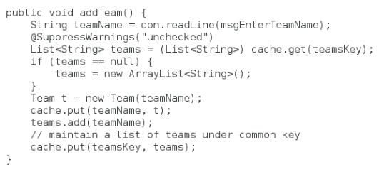

客户端编译后运行，如下图 17 所示，增加两个 team。

##### 图 17\. 运行客户端

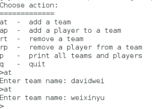

此时，再次查看分布式缓存的信息，Total entries 已经有了两条数据，分别在 server-two 和 server three 上，如下图 18 所示：

##### 图 18\. 查看分布式缓存条目


查看 Infinispan 日志可以看到 Cache 的 rebalance 记录，如下图 19 所示

##### 图 19\. 查看日志

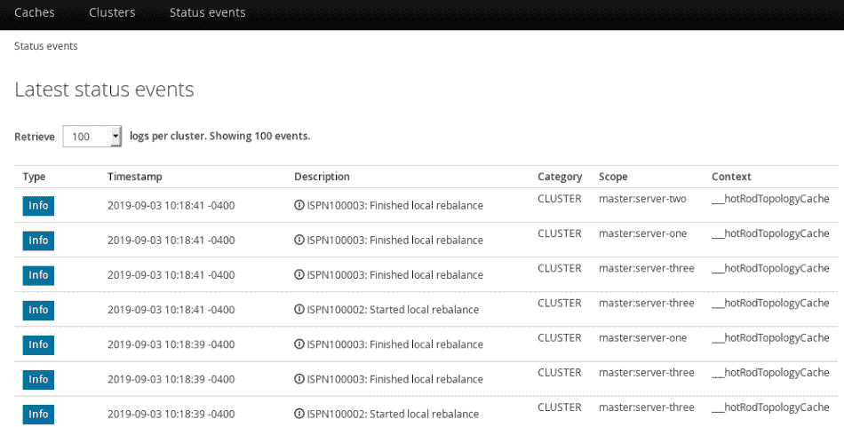

通过 Infinispan 的图形化管理界面，还可以观察 Cache 的性能数据，如下图 20 所示：

##### 图 20\. 查看性能数据

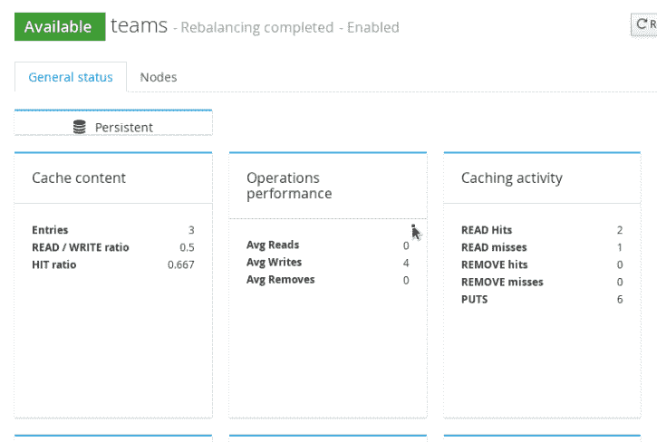

截止到目前，本文验证了 Infinispan 分布式缓存的功能。随着在 OpenShift 上部署的应用种类越来越多，如何为 OpenShift 上的应用提供分布式缓存也是很多企业客户面临的问题。如果将分布式缓存部署到物理机或者虚拟机，那么从 OpenShift 上的容器化应用调用分布式缓存的网络开销将会比较大，将分布式缓存和容器化应用部署到相同 OpenShift 集群是更好的方案。接下来，本文介绍 Infinispan 在 OpenShift 上的实现。

## 在 OpenShift 上实现 Infinispan

针对 OpenShift 3.11 和 4.2，我们可以通过 Operator 的方式，在 OpenShift 上部署 Infinispan。

首先，为 Infinispan Operator 添加自定义资源定义（CRD）和基于角色的访问控制（RBAC）资源。

```
[root@master ~]# oc apply -f https://raw.githubusercontent.com/infinispan/infinispan-operator/master/deploy/crd.yaml
customresourcedefinition.apiextensions.k8s.io/infinispans.infinispan.org configured 
```

安装 RBAC 资源：

```
[root@master ~]# oc apply -f https://raw.githubusercontent.com/infinispan/infinispan-operator/master/deploy/rbac.yaml
role.rbac.authorization.k8s.io/infinispan-operator created
serviceaccount/infinispan-operator created
rolebinding.rbac.authorization.k8s.io/infinispan-operator created 
```

通过模板部署 Infinispan Operator：

```
[root@master ~]# oc apply -f https://raw.githubusercontent.com/infinispan/infinispan-operator/master/deploy/operator.yaml
deployment.apps/infinispan-operator created 
```

截止到目前，Infinispan Operator 已经创建成功，如下图 21 所示：

##### 图 21\. 查看部署成功的 infinispan operator


接下来，我们在 OpenShift 中创建包含凭证的 secrets，以便应用程序访问 Infinispan 节点时，可以进行进行身份验证。

```
[root@master ~]#  oc apply -f https://raw.githubusercontent.com/infinispan/infinispan-operator/master/deploy/cr/auth/connect_secret.yaml
secret/connect-secret created 
```

创建 Infinispan 部署的 yaml，如清单 3 所示。配置文件中定义了 Infinispan 集群名称为：david-infinispan、集群节点数为 2、指定包含身份验证 secret 为 connect-secret（上文创建的）。

##### 清单 3\. Liveness 检查脚本

```
[root@master ~]# cat > cr_minimal_with_auth.yaml< < EOF
> apiVersion: infinispan.org/v1
> kind: Infinispan
> metadata:
>   name: david-infinispan
> spec:
>   replicas: 2
>   security:
>     endpointSecret: connect-secret
> EOF 
```

应用配置，

```
[root@master ~]# oc apply -f cr_minimal_with_auth.yaml
infinispan.infinispan.org/david-infinispan created 
```

Infinispan 集群创建成功后，pod 如下图 22 所示：

##### 图 22\. 查看部署成功的 infinispan 集群


查看两个 Infinispan pod 的日志，如清单 4 所示，确认两个 pod 可以获取到集群视图的信息。

##### 清单 4\. Infinispan pod 日志

```
[root@master ~]# oc logs david-infinispan-0 | grep ISPN000094
07:10:05,536 INFO  [org.infinispan.CLUSTER] (main) ISPN000094: Received new cluster view for channel infinispan: [david-infinispan-0-59271|0] (1) [david-infinispan-0-59271]

[root@master ~]# oc logs david-infinispan-1 | grep ISPN000094
07:09:35,541 INFO  [org.infinispan.CLUSTER] (main) ISPN000094: Received new cluster view for channel infinispan: [david-infinispan-1-62958|0] (1) [david-infinispan-1-62958] 
```

至此，我们可以确认 Infinispan 集群创建成功。

我们知道，为了保证 OpenShift 上应用的正常运行，OpenShift 可以对容器化应用进行容器检查（liveness）和应用健康检查（readiness）。Infinispan 的容器化镜像为 OpenShift 提供了检查脚本，并且已经自动配置。登录到 Infinispan pod 中，可以查看 liveness 和 readiness 脚本。

Liveness 健康检查脚本如下清单 5 所示：

##### 清单 5\. Liveness 检查脚本

```
sh-4.4$ cat /opt/infinispan/bin/livenessProbe.sh
#!/bin/bash
set -e

source $(dirname $0)/probe-common.sh
curl --http1.1 --insecure ${AUTH} --fail --silent --show-error --output /dev/null --head ${HTTP}://${HOSTNAME}:11222/rest/v2/cache-managers/DefaultCacheManager/health 
```

Readiness 健康检查脚本如清单 6 所示：

##### 清单 6\. Readiness 检查脚本

```
sh-4.4$ cat /opt/infinispan/bin/readinessProbe.sh
#!/bin/bash
set -e

source $(dirname $0)/probe-common.sh
curl --http1.1 --insecure ${AUTH} --fail --silent --show-error -X GET ${HTTP}://${HOSTNAME}:11222/rest/v2/cache-managers/DefaultCacheManager/health \
 | grep -Po '"health_status":.*?[^\\]",' \
 | grep -q '\"HEALTHY\"' 
```

Infinispan Operator 会自动创建服务来处理网络流量，我们查看 Infinispan 的 Service，共有三个，如下图 23 所示：

##### 图 23\. 查看 Service


三个 Service 的作用如下：

*   david-infinispan：提供与 david-infinispan 同一个 OpenShift 项目中应用对 infinispan 的访问；
*   david-infinispan-ping：提供 infinispan 集群服务发现；
*   david-infinispan-external：提供与 david-infinispan 不同 OpenShift 项目中应用对 infinispan 的访问。

截止到目前，我们已经验证了基于 OpenShift 实现 Infinispan。接下来，我们介绍另外一种内存数据网格技术：Redis。

## 内存数据网格技术实现-Redis

Redis 是一个基于内存的（in-memory）、键值（Key-value）数据库。Redis 将可以将数据保留在内存中以提升读写速度，还可以将数据以键值对的方式持久化存储，为应用缓存、用户会话、消息代理、高速交易等场景提供持久数据存储。

Redis 支持多种开发语言，如：Java、Python、Go、Node.js 等。Redis 最重要的使用场景是分布式缓存。在基于 OpenShift 的微服务中，Redis 可以保存微服务 Session 数据、状态数据。

单实例的 Redis 存在单点故障。Redis 的集群实现模式有 Redis Sentinel(HA) 模式和 Redis cluster 两种。

| 集群实现模式 | 数据高可用实现 |
| --- | --- |
| Redis Sentinel | 一主多从：异步复制 |
| Redis Cluster | 多主多从：Redis Sharding+异步复制 |

Redis Sentinel(HA)与 Redis 的主从复制配合，实现 Redis 的一主多从。Redis Cluster 可以实现 Redis 的多主多从，我们在下文展开说明。

### Sentinel + Redis 的一主多从

Redis 主从复制（Master-Slave）采用异步复制的模式，当用户往 Redis 的 Master 节点写入数据时，会通过 Redis Sync 机制将数据文件发送至 Slave 节点，Slave 节点也会执行相同的操作确保数据一致。Redis 主从模式下，每个 Redis 节点可以有一个或者多个 Slave。在主从复制模式下，Redis Master 数据可读写、Slave 数据可读。有利于实现使程序的读写分离，避免 IO 瓶颈，如下图 24 所示：

##### 图 24\. Redis 的一主多从

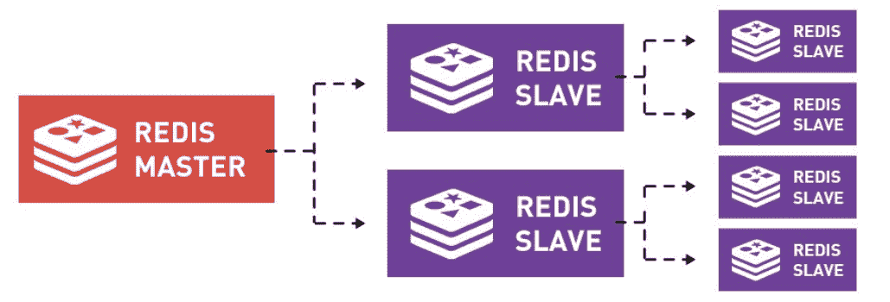

Redis Sentinel 用于管理 Redis 的多实例，如 Redis 一主多从。Sentinel 监控 Redis 实例的状态。当 Redis Master 出现问题时，Sentinel 会将一个 Slave 提升为 Master 并向客户端返回新 Master 的地址。

由于 sentinel 本身也存在单点故障，生产环境 Sentinel 至少使用三个节点组成集群的方式，这样即使一个 sentinel 进程宕掉，其它 Sentinel 依然可以对 Redis 集群进行监控和主备切换。在一个一主双从的 redis 中，每个 Redis 实例所在节点都部署一个 sentinel 实例，如下图 25 所示：

##### 图 25\. Redis 的一主多从与 sentinel 的配合

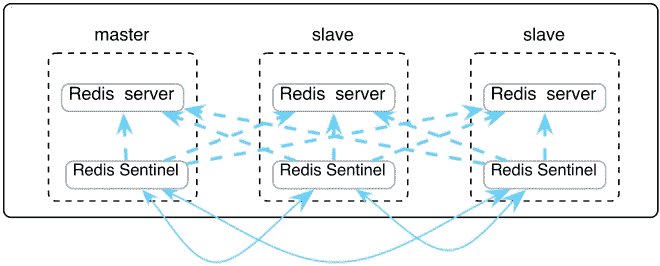

Sentinel + Redis 一主多从的模式，在 Redis 的早期版本（Redis3 之前）使用案例较多。这种方案存在一些劣势，主要包括：

*   应用端必须采用 Sentinel 的接入方式，接口 API 部分需要进行调整；
*   此模式如果想实现 Redis 数据分片（sharding），需要前置 Codis 或 Twemproxy 等组件，这进一步增加了配置的复杂度。

随着 Redis 3 版本中，Redis Cluster 技术的成熟，Redis sentinel + Redis 一主多从的模式已经不被官方所推荐。

### Redis Cluster + Redis 多主多从

Redis 的主从复制中，只有一个 Master。当数据量较大时，单一 Redis Master 无法承载，这就要求进行数据分片。前文提到的 Sentinel + Redis 一主多从模式，通过配置可以实现的客户端分片，但配置步骤较为复杂。Redis Cluster 可以通过较为便捷的方式实现 Redis Server 端的数据分片。

Redis 3 已经自带了 Redis Cluster 功能。Redis 除了可以实现 Redis Service 端的数据分片，还提供了 sentinel 中主从检测切换的功能。Redis cluster 使用哈希槽 (hash slot)的方式来分配数据，实现数据分片。Redis cluster 默认分配了 16384 个 slot，当执行 set 设置 key 操作时，会对 key 使用 CRC16 算法取模得到所属的 slot，然后将这个 key 分到哈希槽区间的节点上。架构如下图 26 所示：

##### 图 26\. Redis 的多主多从


相比于第一种方案，Redis Cluster+ Redis 多主多从有如下优点：

*   应用端对调用 Redis 的 API 接入不需要进行调整；
*   Redis 的主从切换有 Redis Cluster 直接完成，极大地简化了部署架构，这为 Redis 容器 PaaS 平台如 OpenShift 的实现提供了基础。

如前文所述，随着 OpenShift 上承载的业务种类越来越多，如何基于 OpenShift 实现 Redis 受到了很多企业用户的关注，接下来我们介绍 Redis 在 OpenShift 上的实现。

### Redis 在 OpenShift 上的实现

OpenShift 提供 Redis 的单实例部署模板，如下图 27 所示：

##### 图 27\. OpenShift 上的 Redis 模板


通过模板创建 redis，如下图 27 所示：

##### 图 28\. 通过模板创建 redis

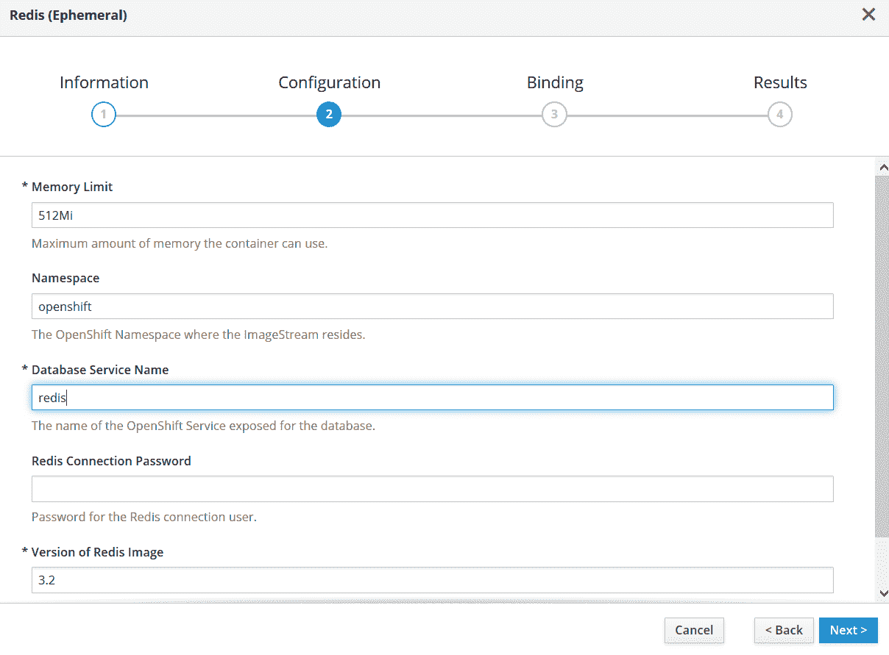

查看 redis 部署成功。

```
# oc get pods
NAME           READY     STATUS    RESTARTS   AGE
redis-1-v98sn      1/1       Running   0          8m 
```

登录 pod，连接 redis。

```
# oc rsh redis-1-v98sn
sh-4.2$  redis-cli -c  -h 10.1.8.17 -p 6379
10.1.8.17:6379> 
```

前文我们展示了通过 OpenShift 实现 Redis 的单实例部署方式。如果想在 OpenShift 上实现 Redis Sentinel 部署，需要进行容器镜像的定制化，对此本文展开介绍。

为了简化配置、便于管理，Redis Labs 公司针对 OpenShift 推出了 Operator 的部署方式。Redis Enterprise Operator 充当自定义资源 Redis Enterprise Cluster 的自定义控制器，它通过 Kubernetes CRD（客户资源定义）定义并使用 yaml 文件进行部署。

Redis Enterprise Operator 针对 Redis Cluster 进行如下操作：

*   验证部署的 Cluster 规范（例如，需要部署奇数个节点）
*   监控资源
*   记录事件
*   提供 yaml 格式部署集群的入口

Redis Enterprise Operator 会在 OpenShift 上创建如下资源，架构如下图 29 所示：

*   Service account
*   Service account role
*   Service account role binding
*   Secret：用户保存 Redis 集群的用户名、密码。
*   Statefulset：保证 Redis Enterprise nodes 正常运行
*   Redis UI 管理工具 service
*   The Services Manager deployment
*   REST API + Sentinel Service
*   The Services Manager deployment
*   可选: Service Broker Service（包含一个 PVC）

##### 图 29\. OpenShift 上的 Redis Enterprise 架构

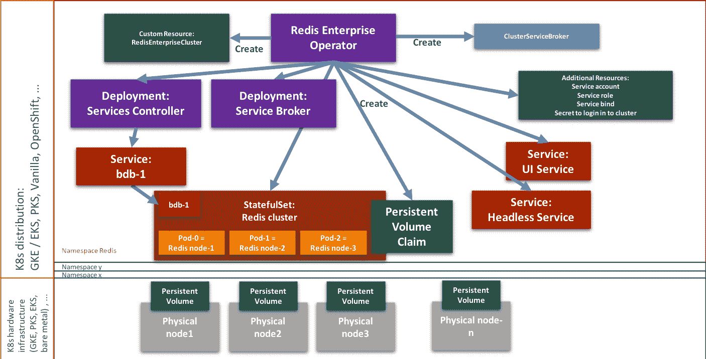

由于篇幅有限，本文不进行基于 Redis Enterprise Operator 在 OpenShift 上的 [部署](https://docs.redislabs.com/latest/platforms/openshift/) 。

Operator 部署要求 OpenShift 至少有三个 Node，我们以实验中使用的模板为例，如清单 7 所示：

##### 清单 7\. 查看 redis cluster 部署模板

```
# cat redis-enterprise-cluster.yaml
apiVersion: "app.redislabs.com/v1alpha1"
kind: "RedisEnterpriseCluster"
metadata:
  name: "david-redis-enterprise"
spec:
  nodes: 5
  uiServiceType: ClusterIP
  username: "weixinyu@david.com"
  redisEnterpriseNodeResources:
    limits:
      cpu: "4000m"
      memory: 4Gi
    requests:
      cpu: "4000m"
      memory: 4Gi 
```

部署完的 redis pod 如清单 8 所示：

##### 清单 8\. 部署成功的 redis

```
# oc get pods
NAME                                                         READY     STATUS    RESTARTS   AGE
david-redis-enterprise-0                                     1/1       Running   0          4h
david-redis-enterprise-1                                     1/1       Running   0          4h
david-redis-enterprise-2                                     1/1       Running   0          4h
david-redis-enterprise-3                                     1/1       Running   0          4h
david-redis-enterprise-4                                     1/1       Running   0          4h
david-redis-enterprise-services-rigger-5f85564c66-2w7td      1/1       Running   0          4h 
```

查看部署的 Service，如清单 9 所示：

##### 清单 9\. Redis 的 service

```
# oc get svc
NAME          TYPE        CLUSTER-IP       EXTERNAL-IP   PORT(S)                      AGE
david-redis-enterprise         ClusterIP   None             <none>        9443/TCP,8001/TCP,8070/TCP   1d
david-redis-enterprise-ui      ClusterIP   172.30.135.160   <none>        8443/TCP                     1d 
```

我们为 david-redis-enterprise-ui 创建路由后，可以通过图形化配置 Redis，如下图 30 所示。

##### 图 30\. Redis 图形化配置公户

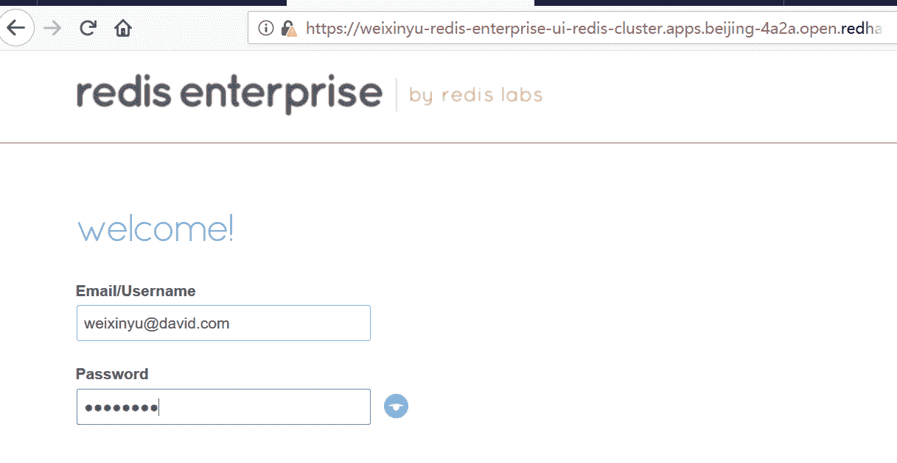

我们可以创建单区域或多区域的 redis 数据库，如下图 31 所示：

##### 图 31\. 选择数据库的部署模式


我们输入 redis 的相关参数，创建单实例 redis，如下图 32 所示：

##### 图 32\. 创建 redis


创建成功以后，可以获取到登录方式等信息，如下图 33 所示：

##### 图 33\. 创建 redis 的信息

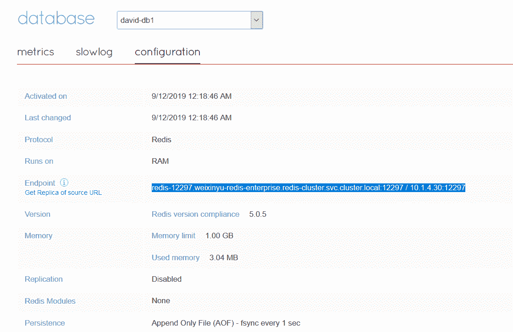

使用命令行连接创建好的 redis 数据库：

```
# oc rsh weixinyu-redis-enterprise-0
$ redis-cli -c -h  10.1.4.30 -p 12297
10.1.4.30:12297> auth 111111
OK 
```

设置 key 并查询，返回正常。

```
10.1.4.30:12297> set rh 111
OK
10.1.4.30:12297> get rh
"111" 
```

接下来，我们使用 redis 图形化配置工具创建 redis 的双主双从，如下图 34 所示：

##### 图 34\. 配置双主双从数据库

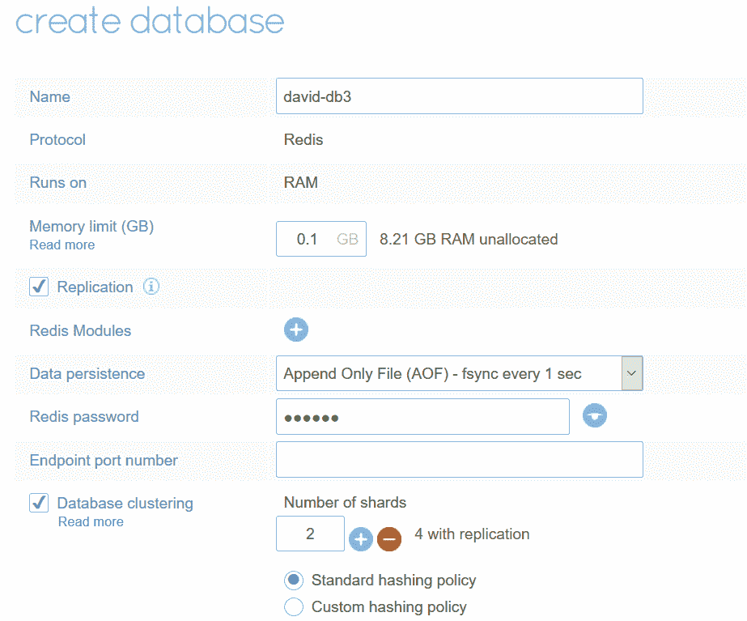

创建成功后，查看数据库信息，如下图 35 所示：

##### 图 35\. 创建数据库的信息


Redis 的图形化界面可以监控性能，如下图 36 所示：

##### 图 36\. 查看数据库的性能数据

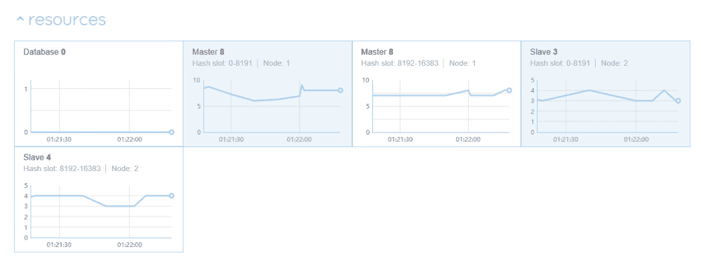

至此，我们验证了 redis 在 OpenShift 上的实现。

## Infinispan 和 Redis 的对比

我们在上文已经针对 Infinispan 和 Redis 进行了较为详细的介绍，接下来我们从数据保护和配置管理两方面对其进行对比。

*   数据保护：Infinispan 和 Redis 都可以为应用提供分布式缓存，两者都支持复制模。Infinispan 的复制有同步和异步两种，Redis 目前只支持异步复制。因此，在数据的强一致的场景下，Infinispan 变现要强于 Redis。

*   配置管理：目前 Infinispan 可以很方便地通过 Operator 在 OpenShift 上实现集群模式部署和管理（Infinispan 开源项目和 OpenShift 对应的开源项目 [OKD](https://www.okd.io) 均为红帽主导，因此集成性很好）。我们可以通过 OpenShift 中的 redis 模板部署 Redis 单实例模式，但无法配置主备复制、数据分片等高级功能。Sentinel + Redis 的一主多从的 HA 模式在 OpenShift 管理和使用的复杂度较高，虽然开源社区也提供了这种部署模式的 Kubernetes [Operator](https://github.com/spotahome/redis-operator) ，但出于管理和使用的便捷性以及稳定性，不推荐这种方案。Redis Enterprise Operator 极大简化了 Redis Cluster 在 OpenShift 上的部署和配置复杂度，通过 UI 管理界面管理很便捷。但需要注意的是，Redis 的 Enterprise 版本并不是完全开源的。

因此，针对于企业越来越多的分布式缓存的需求，基于 OpenShift 的 Infinispan 的整体可管理性、可配置性要高于 Redis。

## 结束语

通过本文，相信您对 Infinispan 和 Redis 的架构以及在 OpenShift 上的实现有了较为清晰的了解。随着微服务在 OpenShift 集群上的大量部署，Infinispan 必将会在 OpenShift 上发挥重要的作用。

## 参考资源

*   [Infinispan 社区](https://github.com/infinispan/infinispan)
*   [Redis 社区](https://github.com/redis)