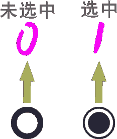
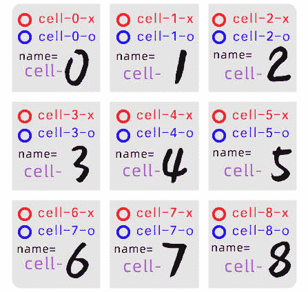

# 纯 CSS 井字棋：并不神秘的 CSS AI 编程之旅

> 原文：[`developer.ibm.com/zh/articles/wa-css-ai-coding-tic-tac-toe-game/`](https://developer.ibm.com/zh/articles/wa-css-ai-coding-tic-tac-toe-game/)

CSS 是什么？CSS 是 Cascading Style Sheets 的缩写，中文叫做层叠样式表。或许，在大部分程序员的印象中，CSS 一点也不 “高大上”，但慢着，可能您有点小看它了。为什么这么说呢？让我们从一场井字棋游戏说起吧。

*注：AI 是一个很宽泛的概念，本文中的出现的 AI 是非常狭窄的代指，是整个游戏在取胜策略上的规则表达。*

## 一场井字棋游戏

解压缩文后所附的文件，在任何的浏览器打开其中的 `index.html` ，或者直接访问它的 在线版本(URL:`https://game.esitee.cn/tic-tac-toe`) ，在游戏的高级模式下，不管你是选择玩家先走，还是计算机先走，结果都是相同的，那就是：您毫无胜算。

如果去看一看这个小游戏的源代码，可能会更让你吃惊不小：游戏一共就包含两个文件： `index.html` 和 `style.css` ，而且找来找去，在这两个文件中，你只会发现以下两种代码：

*   HTML
*   CSS

**没有任何的 JavaScript！**

是不是觉得有些奇怪？没有了 JavaScript，该怎样来实现变量、分支……这些大部分程序语言所”**标配**“拥有的基本要素，又怎样在 Web 页 面上，来控制业务流转，实现游戏 AI 所依赖的逻辑呢？

情况当然没你想的那么糟糕，否则的话，井字棋游戏也没法顺利出炉。不用什么特殊的浏览器，也无需提出什么新的 HTML 或者 CSS 规 则，仅仅是一点点的”魔法”，游戏就能变得神奇而疯狂起来。

## 存储变化

现代的计算机以 **二进制为基础** ！这几乎成为了一种不言自明的共识，因此，面对 HTML 和 CSS，我们首先要问的，当然也是这样的一个问题，即：在 HTML 和 CSS 当中，存在二进制，以及对应的存储和操作的手段么？

答案是令人满意的。在 HTML 中，不仅已经天然为我们准备好了二进制，而且还同时准备好了两种不同的 **二进制存储（即输入** 方式： **单选框（radiobox）** 和 **多选框（checkbox）** 。

### 单选框

基本上，我们可以把单选框，视为是一个 **最多只能变化一次** 的二进制存储单元。当它处于未选中状态时，其值为 0；点击选中后，即更改为 1。

##### 图 1\. 单选框未选中/选中状态与 0/1 对应



### 多选框

和单选框不同，借由用户不断的点击操作，通过多选框所实现的二进制变量存储模式，可以在 0 和 1 之间进行反复的切换，而不是像单选框那样，在整个程序生命周期中，最多只能从 0 到 1，进行唯一的一次改变。

##### 图 2\. 每按一次，多选框就在 0/1 之 间进行一次切换


## 表达状态

好了，现在 HTML 已经为我们准备好了单个的二进制变量存储和输入的手段，如何有效的组合他们，就是程序员的工作了。

比如，在我们的井字棋的游戏中，它的每一个棋格，实际上都存在有三种可能的落子状态，因此，如果只是希望用一个二进制位，来陈述这一事实的话是不行的。一个显而易见的方案，则是可以考虑通过使用 2 个二进制位形成的组合，来表达它们，就像下表所示这样：

##### 表 1\. 棋格状态表达表

| **状态值（二进制模式）** | **表达含义说明** |
| --- | --- |
| 00 | 什么也不放 |
| 01 | 放 X （在这里代表人类玩家在此下子） |
| 10 | 放 O （在这里代表计算机玩家） |
| 11 | 多余状态，无意义 |

对应到具体的存储实体，可以使用 2 个 radiobox 来完成（分别对应是/否在该棋格上放置 X 和 O）。根据这样的原则，井字棋一共 9 个棋格，一共只要 18 个 radiobox，就能完美表示所有的状态了：

##### 图 3\. 棋格和对应的 radiobox 逻 辑绑定关系



### 为什么采用 radiobox，而不是 checkbox

有两个原因，促使我们在这里使用 radiobox：

1.  如上文所述，radiobox 的核心特性，就是一旦选中，不能再次通过手动”点击”，转变为未选中状态，这其实正好暗合井字棋”落子后无法变更”的规则表达。
2.  对于每一个棋格所拥有的状态而言，不能既放置 X，也放置 O，也就是 11 这样的状态是不允许出现的。这和同一 `name` 属性下的多个 radiobox，最多只能有 1 个 radiobox 被选中的特性是一致的。

## 棋盘构建

厘清了如何表示和存储每个棋格可能落子状态的原则和方法后，下面的问题，则是如何将他们展现到具体的棋盘上。

如果不考虑人机操作界面的 **美观性** 和 **可读性** ，我们当然可以直接就把这 18 个 radiobox，一股脑的放置到界面上，但显然，这是不符合游戏用户对游戏的界面期望的。而在另一方面，CSS 自身在这一方面，却存在着一个非常突出的问题，即： **对处于 `<input />` 标记下的 radiobox 和 checkbox，CSS 语言的修饰的能力是严重不足的** 。

简单地来说，就是我们没有一个方法，可以直接把 radiobox 和 checkbox，”装扮”成任意我们希望的样子。

解决这个问题的诀窍，则在于一个特殊的 HTML 标签： `label` ，和它的一个特别的属性： `for` 。

### 神奇的 label 标记和 for 属性

**首先**，和 radiobox 或者 checkbox 不同，在 CSS 的强大修饰能力下，用 `label` 来 “模拟”大多数的 **有意义** 的游戏界面元素，毫无障碍可言，比如每一个棋格，当其未被放置任何的 X 或 O 时 ，基本上，只需要在对应的 `label` 上，加上几条简单的 CSS 规则，就可以很好的表达出来，如下代码所示：

##### 清单 1\. 用 label 模 拟棋格的缺省未放置棋子状态

```
#.btn {
  display: block;
  background: rgba(0,0,0,0.1);
 ......
} 
```

**其次**，最为特别的，通过在 `label` 记的 `for` 属性中指定相关的 `id` 值，可以实现了和该 `id` 所对应的 `radiobox` 或 `checkbox` 之间的操作绑定！

也就是说，此时，当用户在 `label` 记上进行点击操作时，其效果就等同于在对应 `id` 的那个 radiobox 或 checkbox 上，进行相关的点击操作。

**最后**，它还有一个特别的性质，那就是： **同一个** radiobox 或者 checkbox 上，可以被多个 `label` 记所绑定。

借助于这三个特性（这里其实只使用了前面的两个），我想您是不难构建出如图 3 那样的棋盘来的。

**注意** ：在我们的游戏中， **人类玩家** 选手在棋盘上落子的行为，正是通过点击对应的棋格来实现的!所以，作为一个技巧，在我们的棋盘实现中，每个棋格 `label` 所绑定的，实际上就是表示人类玩家 X 在该棋格上落子状态的那个 radiobox。

以图 3 中所显示棋盘的第 0 棋格为例，其所应该对应绑定的，就是 `cell-0-x` ，如下代码所示：

##### 清单 2\. 第 0 棋格设计

```
<input type=”radio” name=”cell-0” id=”cell-0-x” />
<div class="tile" id="tile-0">
  <label for="cell-0-x"></label>
  <div></div>
</div> 
```

这样一来，当人类玩家点击该 `label` 时，就等同于实施了将 `cell-0-x` 这一 radiobox 置为选中状态的操作。

那么，又如何在棋盘上，将人类选手落子在该 `label` 上的信息也”一并表现”出来呢？稍微多了解一些 CSS，相信都应该不难猜到。对的，这时，我们可以利用： `:checked` 伪类选择器。

### :checked 伪类选择器

`:checked` 伪类选择器的神奇之处在于：它可以将任何处于选中状态的 radiobox 或者 checkbox 元素标示出来！

##### 清单 3\. 选中状态

```
Input#cell-0-x:checked ~ #board #tile-0 div::before {
    content: "X";
    background: #004974;
} 
```

如上清单就表示，当 `cell-0-x` 为选中状态时（ `:checked` ），在 `id` 为 `title-0` 的标签下的 `div` 标签前（通过 `:before` 伪类选择器），输出内容 `X` （通过 `content` 风格），并重绘整体背景颜色。

## 表达规则

或许你并不相信，但事实上，刚刚我们已经很自然的写下来了第一句”有用”的程序。而之所以你并未觉得，在很大程度上，则是受现在的很多语言，比如 Java、Python 所 给予你的印象之干扰，以至于你可能忘记了，程序其实也能这样写。

事实上，在某种程度上，我觉得，CSS 在程序设计上的表现和标准的单向图灵机的一些基础的设计理念非常接近，如下表所示：

##### 表 2\. 图灵机和 CSS 对比

| **图灵机** | **CSS** |
| --- | --- |
| 存在内部状态，并可进行读取。 | 借助于使用或不使用 `:checked` 伪类，可以表达存储于 radiobox 和 checkbox 中的二进制值。 |
| 可以写入（即改变）内部状态。 | 可以通过点击 radiobox 和 checkbox，改变对应的二进制值。 |
| **程序即规则表** ，每条规则都具有固定的输出。 | 程序即 CSS 选 择器组合列表，每一个 CSS 选择器组合，就是一条规则，该组合下所对应的最后页面渲染，即该规则对应的输出。 |
| 程序执行的过程，就是在规则表中，选择并执行与当前所有状态皆吻合的规则。 | 元素渲染的过程，就是在当前 CSS 选择器组合列表中，挑选出和各项状态皆吻合的规则，并将这些规则的具体风格表达，渲染到该元素上。 |

还是以才刚 `cell-0-x` 在选中状态下的页面渲染规则为例，实际上，当我们同时将 CSS 中，针对该棋格的页面渲染业务，包含有 `:checked` 和不包含该伪类选择器，放到一起观察，我们几乎可以马上识别出来，这不就是我们在其他程序语言上，非常常见的一种分支结构么？

事实上，熟悉 CSS 这种 **程序即规则表** 的表达方式，正是构建纯 CSS 井字棋所需要跨越的最重要的障碍。

## 第一条 AI 规则

下面所剩下的，其实只有一个问题了，那就是：除了像 `cell-0-x` 这样显而易见的渲染规则外，那些代表着程序的 AI 的规则，又该怎么来写呢？

不妨先来考虑一个棋局：

##### 图 4\. 第一个棋局


下面轮到计算机走，显然的，计算机的最优策略，是走在棋格 6 上。好，假如这时候你是程序的编写者，你会怎样来写呢？

### 描述棋格状态

首先要做的，当然如何来有效的描述当前的棋局状况。结合前面的说明，显然的，棋局的每个状况，是等价于这一棋局下，各个棋格的状态的总和的，如下表所示。

##### 表 3\. 第一个棋局下的棋格状态

| **棋格** | **人类选手** | **值** | **机器人选手** | **值** |
| --- | --- | --- | --- | --- |
| cell-0 | cell-0-x | **1** | cell-0-o | 0 |
| cell-1 | cell-1-x | **1** | cell-1-o | 0 |
| cell-2 | cell-2-x | 0 | cell-2-o | **1** |
| cell-3 | cell-3-x | **1** | cell-3-o | 0 |
| cell-4 | cell-4-x | 0 | cell-4-o | **1** |
| cell-5 | cell-5-x | 0 | cell-5-o | 0 |
| cell-6 | cell-6-x | 0 | cell-6-o | 0 |
| cell-7 | cell-7-x | 0 | cell-7-o | 0 |
| cell-8 | cell-8-x | 0 | cell-8-o | 0 |

当然，在技巧上，在这里，我们可以选择忽略掉其中的 0 值 ，因此，当前的棋局也可以就此简化为：有且仅有 `cell-0-x` 、 `cell-1-x` 、 `cell-3-x` 、 `cell-2-o` 、 `cell-4-o` 同时为 `1` 。

与此对应，此时，程序的正常理性行为则应该是（其实也仅此 1 个）： **置 `cell-6-o` 为 `1`** ，以实现最后的胜利。

<h3 id=”-” # 计算机走”的奥秘>”计算机走”的奥秘

那么，怎样置 `cell-6-o` 为 `1` 呢？如果有前文的经验，则不难知道，在仅允许使用 CSS 的 情况下，实际上，只有唯一的一种办法可以实现这个目标，那就是点击 `id` 为 `cell-6-o` 的那个 radiobox 或者它的等价 `label` 。

这正是 图 4\. 第一个棋局 中，”计算机走”这一按钮的全部秘密所在。如下代码所示，在”计算机走”这一按钮中，以 `label` 绑定的方式，从 `cell-0-o` 到 `cell-8-o` ，绑定了表征相关棋格计算机选手落子与否的全部 8 个 radiobox。

##### 清单 4\. 绑定全部的计算机选手对应棋格状态

```
<div id="label-computer" class="btn">
   计算机走！
   <label for="cell-0-o"></label>
   <label for="cell-1-o"></label>
   <label for="cell-2-o"></label>
   <label for="cell-3-o"></label>
   <label for="cell-4-o"></label>
   <label for="cell-5-o"></label>
   <label for="cell-6-o"></label>
   <label for="cell-7-o"></label>
   <label for="cell-8-o"></label>
</div> 
```

与此同时，如果我们能建立起相关的规则，保证在出现”计算机走”这一按钮时， **有且仅有一个”合适”的 `label` ，可以被用户点击** ，比如在 `cell-0-x` 、 `cell-1-x` 、 `cell-3-x` 、 `cell-2-o` 、 `cell-4-o` 同时被选中的情况下，只有 `for` 为 `cell-6-o` 的那个 `label` 显示在”计算机走”这一按钮上，那么，当用户点击”计算机走”时，自然就等同于了选中 `cell-6-o` 这一 radiobox，我们的目的实现了！

### 波浪线选择器

答案实际上已经呼之欲出了。如果在 CSS 下，逐句翻译我们刚刚分析，所获得的结果，我们几乎可以不假思索的写下如下清单 5 所示的选择器来：

##### 清单 5\. 设定第一个棋局时的 AI 规则

```
#cell-0-x:checked ~ #cell-1-x:checked ~ #cell-2-o:checked ~ #cell-3-x:checked ~ #cell-4-o:checked ~ #label-computer label[for='cell-6-o'] {
    z-index: 99!important
} 
```

可以看到，这里，我是通过指定 `z-index` 值，来保证 `for` 为 `cell-6-o` 的 `label` ，成为”机器人走”下，当前唯一可被点击的标记的。还有其他的风格指定方法当然也没问题，比如可以通过 display 来 控制，这些并不是本文的重点。

**注意** ：在这里，我使用了 `~` 作为主要的选择器连接符，实际上，如果在我们的 HTML 中 ，如果精心的设计相关标记元素的出现顺序，我们也完全可以使用更为精确的 `+` 等选择器来书写这一规则，但我仍然还是推荐使用 `~` ，毕竟当我们使用 `~` 分割两个 CSS 选择器时，第二部分选择器可以匹配到 **所有** 不是第一个选择器，且不是第一个选择器的后代的元素。其自由度显然较 `+` 要大很多。

理解了这一条规则的制定流程后，我相信，您对于其他的规则制定所使用的那些原则和技巧，也就基本掌握了。比如，还是以 图 4\. 第一个棋局 所 表示的棋局为例，当用户点击”计算机走”后， `cell-6-o` 将被选中，而根据井字棋的规范，此时的棋局，就应该导向计算机赢这个结局。

而如果我们从规则表的角度来看，这一规范就等价于，我们需要为 `cell-2-o` 、 `cell-4-o` 、 `cell-6-o` 同时为 `1` 这一状态，来创作一条特殊的规则，以显示（ `display: block` ）我们事先所准备好的”计算机赢”的游戏界面，如下代码所示：

##### 清单 6\. 2-4-6 格 均被计算机选手占据后的胜利宣告

```
#cell-2-o:checked ~ #cell-4-o:checked ~ #cell-6-o:checked ~ #end{
    display: block
} 
```

实际效果也的确如此。当 `cell-6-o` 被置为 `1` 时，棋局立即如下图所示样，宣告了”计算机赢”。

##### 图 5\. 棋局结束宣告


## 更进一步

至此，整个使用纯 CSS，来制作井字棋的核心秘密，应该已经是昭然若揭了，只要我们认真分析每一个可能的棋局，并将这一棋局下，最优的那个 `cell-?-o` 所对应的 `label` ，推送到”计算机走”上，成为此刻唯一可以点击的 `label` ，那么，井字棋程序就可以完美的执行下去，直到结束为止。

当然，这个过程有时候会显得不是那么的简单，再举一个例子，如下图 6，当人类选手在第 4 个棋格上落子后，计算机选手的策略是什么？

##### 图 6\. 第二个棋局


这时候，计算机选手的正确策略，则是应该落子在第 0、2、6、8 中 的任意一个棋格上，这在理论上都能确保计算机选手不会落败。

在这种情况下，我们当然可以硬性的通过规则，为其指定一个”唯一”的解法，比如推送 `cell-0-o` 到”计算机走”上，但这则无异于是抹杀了其他的可能性。

一个更好的解决方案，则是可以在规则制定中，引入”**或者**“这一逻辑运算来体现对全体可能落子棋格的支持，在 CSS 中 ，这可以简单地借助于 **逗号** 来实现，比如像这样：

##### 清单 7\. 通过逗号选择器实现 OR 逻 辑

```
##cell-0-o:not(:checked) ~ #cell-2-o:not(:checked) ~ #cell-4-x:checked ~ #cell-6-o:not(:checked) ~ #cell-8-o:not(:checked) ~ #label-computer label[for='cell-0-o'],
#cell-0-o:not(:checked) ~ #cell-2-o:not(:checked) ~ #cell-4-x:checked ~ #cell-6-o:not(:checked) ~ #cell-8-o:not(:checked) ~ #label-computer label[for='cell-2-o'],
#cell-0-o:not(:checked) ~ #cell-2-o:not(:checked) ~ #cell-4-x:checked ~ #cell-6-o:not(:checked) ~ #cell-8-o:not(:checked) ~ #label-computer label[for='cell-6-o'],
#cell-0-o:not(:checked) ~ #cell-2-o:not(:checked) ~ #cell-4-x:checked ~ #cell-6-o:not(:checked) ~ #cell-8-o:not(:checked) ~ #label-computer label[for='cell-8-o'] {
  z-index: 75;
  animation: miniAnimation 0.4s infinite linear;
} 
```

如果翻译成对应的逻辑表达，这段代码则表示，当 `cell-4-x` 为 `1` ，且 `cell-0-o` 、 `cell-2-o` 、 `cell-6-o` 、 `cell-8-o` 均在未选中状态下时，绑定 `cell-0-o` 、 `cell-2-o` 、 `cell-6-o` 、 `cell-8-o` 的 `label` 都被将推送到”计算机走”上。

但显然的，虽然现在在逻辑上，这 4 种可能的情况都将有相同的机会，可以被成为下一步计算机选手的选择，但根据 CSS 渲染的规则，如果这时候我们不加任何特殊的处理，那么，最后被实际使用的，将永远是 `cell-8-o` 所对应的那个 `label` 。这里，我们则将借助于 CSS 属 性： `animation-delay` ，来玩一个小小的把戏。

这一 CSS 属性的意思是：可以指定相关的动画渲染，在延迟多长时间后开始，注意下清单 7 中的 animation，在这里，我们指定的默认 `animation-delay` 为 0.4 秒 ，而如果我们为逻辑或所涉及的每一条规则，都指定一个特殊的有异于其他的 `animation-delay` 的话，那就意味着，它们将有各自不同的被渲染的时间。

就此，我们即变相的获得了一种”**伪随机选择**“的形式，最后使用 `cell-0-o` 、 `cell-2-o` 、 `cell-6-o` ，还是 `cell-8-o` 所绑定的 `label` 上 ，将由用户点击”**计算机走**“的时间而决定。

如果您有兴趣，可以通过研读附件中的 `style.css` 快速掌握到其中的奥秘所在，所以在此我就不一一赘述了。

而整个编程过程，最大的挑战则来自于我们要穷尽全部可能的状态，并写出对应的规则，因此，编程的工作量是巨大的。

比如说，单单就计算机赢的状态的判断，就涉及到有全横（3），全纵（3），交叉（2），共计 8 种棋局之多。哪怕漏写其中哪怕一种，都意味着当计算机获得胜利后，系统将有可能无法弹出”计算机赢”的宣告来。

但这并不是 CSS 的问题，反而，我觉得，这正是像 Sass 这样的语言，得以产生并发展壮大的动力所在。

对于开发者而言，需要调整的，则仅仅是自己看待 CSS 的态度，如果你将 CSS，也视为一种有效的表达逻辑和进行运算的工具，那么，你就拥有了一个异常强大的武器。下表则给出了常见的几种逻辑运算，和 CSS 选 择器之间的对应关系，以供您参考。

#### 表 4\. 逻辑运算关系和 CSS 对应表达对照表

| **逻辑运算符** | **CSS** | **附加说明** |
| --- | --- | --- |
| A **OR** B | A, B {} | 无 |
| A **AND** B | AB {} 或 A B {} 或 A **>** B {} 或 A **+** B{} 或 A **~** B{} 等 | 不同的组合方式，反应了 A 、B 两 元素不同的层级关系，如父子关系、兄弟关系等，在 CSS 选 择器规范中，其内容丰富异常，这里仅仅列出其中一小部分。 |
| **NOT** A | **:not(** A **)** {} | 当前规范下，A 只 允许使用简单选择器，因此，诸如 :not(:not(A)){} 这样的选择器设定为非法。 |
| A **NOR** B | **:not(** A, B **)** {} 或 **:not(** A **):not(** B **)** {} | :not(A, B) {} 的表达仅在 CSS Level4 下 有效（原因参见 **NOT** A 的 说明）。 |
| A **NAND** B | **:not(** A **), :not(** B **)** {} | 等价于 CSS Level4 下 的 :not(AB) {}。 |
| A **XOR** B | A **:not(** B **),** B **:not(** A **)** {} | 无 |

## 结束语

记住，CSS 是一种可以表达”逻辑”的语言！

当然，它的最主流的应用方向，不应该是用来开发类似井字棋这样的游戏。在我看来，这样的一个特性，更应该放到用来帮助我们的前端开发团队，去更好的实现日常工程开发的”松耦合”化上来。

随着前端交互的日益复杂，现在一个在很多开发团队中都存在着的，非常尴尬的问题是：很多 JavaScript 的开发者，不仅要专注于业务规则的实现，还需要同步的去考虑业务实现后，相关的页面表现规则。

于是我们就看到了，各种通过对 CSS 风格、CSS 选择器的直接调用，来实现页面渲染效果的代码，都统统混杂在一堆业务代码中，其维护的难度，是可想而知的。

因此，如果我们可以借助 CSS 在 逻辑表达方面的能力，并且再加上在 CSS3 中，大幅扩展的那些新规范，比如计算（ `calc()` 等）、动画（animation 系 列等）……那么，构建出一种新型的、以数据流为核心的、”接口通知”型开发模式出来是没有问题的。

在这种开发模式下，JavaScript 开发者也将不再需要去考虑业务实现后的页面渲染问题。而仅仅需要向 CSS 开发者，所对外暴露的那些 radiobox 和 checkbox 数 据接口中，注入正确的数据即可，后面的工作，就完全可以由 CSS 开发者来一手包办了。

或许在不远的将来，我们就能看到有更多的这方面的工程实践。

## 下载游戏源代码

[获取代码](https://github.com/zhaohuazhu/pure-css-tic-tac-toe.git)