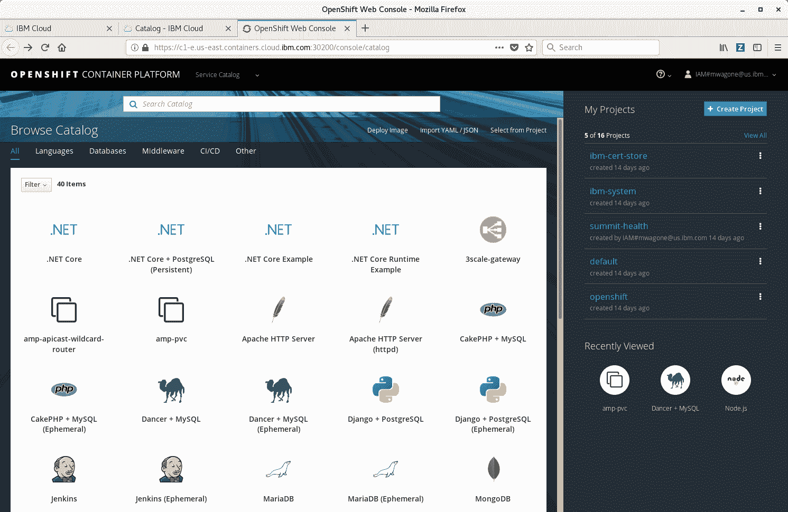

# 如何将模板生成与 Podman、Kubernetes 和 Red Hat OpenShift 配合使用

> 原文：[`developer.ibm.com/zh/articles/templating-and-podman-openshift/`](https://developer.ibm.com/zh/articles/templating-and-podman-openshift/)

Red Hat OpenShift 是一个企业 Kubernetes 环境，其 Source-to-Image 功能非常方便实用。只需将您所选的运行时镜像（例如，Node.js）指向包含您的代码的 GitHub 存储库。简单点击几次后，您生成的应用程序便会启动并正常运行。但对于较复杂的应用程序，生成模板可使包含多个组件的部署启动过程变得同样非常简单。生成模板从基本镜像开始，基于基本镜像创建一致的应用程序。

本文介绍了模板生成方式，并提供了 Red Hat OpenShift on IBM Cloud™ 相关示例。它还介绍了 [Podman](https://podman.io/)，作为创建模板所依赖镜像的一种途径。

Podman 这一名称可能听上去与原先用来播放 MP3 的设备很相似。但实际上，它是一种软件，可用于创建或管理 pod、容器和容器镜像，并且全都无需使用容器守护程序。

下图显示了 pod、容器和镜像的协同工作方式： 

在 Kubernetes 中，您在特定节点上创建 pod 用于托管自己的应用程序。根据需求，该 pod 包含一个或多个容器。您从单一镜像运行容器，此镜像是您根据说明创建的，提供了应用程序的可执行版本。Podman 作为镜像构建器而发挥作用。

## 历史背景

[Open Container Initative (OCI)](https://www.opencontainers.org/) 对于 Podman 的发展历史至关重要。OCI 是 Linux 基金会的一个项目，目的在于为容器镜像格式和运行时环境制定正式的规范。此计划于 2015 年 6 月确立，最初（目前仍然）主要由 Docker 给予支持。

Podman 技术是通过与 OCI 协作完成开发的。Podman Alpha V0.6.1 发布于 2018 年 6 月，距离本文写作时间刚好一年。

## 使用 Podman 的优势

Podman 主要理解以下两类镜像：`docker` 和 `oci`。

使用 Podman 的主要优势之一在于增强安全性。对于新用户，无需 root 权限即可运行 Podman，并且几乎保留所有功能。Podman 还使用传统的分叉/执行模型，与 Docker 使用的客户端/服务器模型截然相反。该模型允许从 `systemd` 向下传递连接的套接字，并通过堆栈向上返回通知，在此堆栈中，Podman 已准备好接收任务。

## Podman 明确不具备的功能

Podman 不支持 `docker-compose` 功能。它同样无法处理 [Kubernetes 容器运行时接口 (CRI)](https://github.com/kubernetes/kubernetes/blob/242a97307b34076d5d8f5bbeb154fa4d97c9ef1d/docs/devel/container-runtime-interface.md) 适用的容器运行时守护程序。要处理此类守护程序，可使用另一种工具：[CRI-O](https://github.com/cri-o/cri-o)。

## Podman 的发布里程碑及未来

Podman 1.2 引入了运行状况检查。

在后续版本中，Podman 将允许使用 [varlink](https://varlink.org/) 后端通过命令行界面连接到远程 Podman 实例。

## Podman 基本设置步骤和常见任务

Podman 是作为 `libpod` 库的一部分提供的实用程序。通过 `yum install podman` 直接进行安装，但要了解特定于您的操作系统的信息，或者要获取自行构建的相关信息，可参阅[安装说明](https://github.com/containers/libpod/blob/master/install.md)。

运行容器为 `podman run`（对于分离模式使用 `-d` 开关）。`podman ps` 可显示正在运行的容器和正在创建的容器列表。添加 `-a` 开关可提供 `/all/` 容器的列表。

您可对容器执行 `inspect` 以获取其相关元数据，例如，IP 地址：

```
$ podman inspect -l | grep IPAddress\":
            "SecondaryIPAddresses": null,
            "IPAddress": "", 
```

（注意：如果容器在无 root 模式下运行，那么不会分配 IP 地址。）

如果您熟悉 Docker，那么应该不会对 Podman 的命令行界面感到陌生，因为它实际上是基于 Docker 的。镜像已准备就绪可供运行？`podman build` 命令的作用与 `docker build` 相同，您可以在模板中使用生成的镜像。

## Red Hat OpenShift 中的模板是什么？

通过生成模板，您可将镜像或应用程序导入 Red Hat OpenShift 容器平台 Web 控制台中显示的服务目录。以下截屏显示了 IBM Cloud 的 Red Hat OpenShift Web 控制台中所显示的服务目录：



目录中的每个图标都表示一个模板。模板可以非常简单，只包含单个镜像，也可以包含整个应用程序，由多个构建、镜像和部署组成。

模板通常包含以下资源：

*   Red Hat OpenShift 镜像：用于构建容器的基本镜像。
*   构建：从应用程序或 Dockerfile 的源代码生成的镜像。
*   镜像：构建生成的结果。
*   部署：部署的镜像及其部署方式的定义。
*   您的应用程序可能需要的其他资源：存储、网络和其他类型的资源。

在 IBM Cloud 中首次创建 Red Hat OpenShift 集群时，须注意这里已为您创建了多个项目。`openshift` 项目用于存储集群的现有模板。默认情况下，这些模板设置为使用 Github 上公开可用的存储库进行构建。它们包含样本应用程序的代码。

例如，`nodejs-mongodb-example` 模板的示例代码托管在 [github.com/sclorg/nodejs-ex/](https://github.com/sclorg/nodejs-ex/) 上。您可在存储库的 `openshift\templates` 目录中看到用于创建模板的文件。模板文件开头提供了有关模板的部分常规信息，包括唯一的用户友好名称和描述：

```
 "kind": "Template",
  "apiVersion": "v1",
  "metadata": {
    "name": "nodejs-mongodb-example",
    "annotations": {
      "openshift.io/display-name": "Node.js + MongoDB (Ephemeral)",
      "description": "An example Node.js application with a MongoDB database.For more information about using this template, including OpenShift considerations, see https://github.com/sclorg/nodejs-ex/blob/master/README.md.\n\nWARNING: Any data stored will be lost upon pod destruction.Only use this template for testing.",
      "tags": "quickstart,nodejs",
      "iconClass": "icon-nodejs",
      "openshift.io/long-description": "This template defines resources needed to develop a NodeJS application, including a build configuration, application deployment configuration, and database deployment configuration.  The database is stored in non-persistent storage, so this configuration should be used for experimental purposes only.",
      "openshift.io/provider-display-name": "Red Hat, Inc.",
      "openshift.io/documentation-url": "https://github.com/sclorg/nodejs-ex",
      "openshift.io/support-url": "https://access.redhat.com",
      "template.openshift.io/bindable": "false"
    }
  },
  "message": "The following service(s) have been created in your project: ${NAME}, ${DATABASE_SERVICE_NAME}.\n\nFor more information about using this template, including OpenShift considerations, see https://github.com/sclorg/nodejs-ex/blob/master/README.md.",
  "labels": {
      "template": "nodejs-mongodb-example",
      "app": "nodejs-mongodb-example"
  },
  "objects": [
    {
      "kind": "Secret",
      "apiVersion": "v1",
      "metadata": {
        "name": "${NAME}"
      },
      "stringData": {
        "database-user": "${DATABASE_USER}",
        "database-password": "${DATABASE_PASSWORD}",
        "database-admin-password" : "${DATABASE_ADMIN_PASSWORD}"
} 
```

再往下可找到模板的另外两个主要部分：对象和参数。在参数部分中，可为应用程序设置值，如内存使用限制和服务名称。对象部分显示了有关模板所使用镜像的具体信息。在对象部分中，可以看到指定了以下 `nodejs` 镜像：

```
"strategy": {
  "type": "Source",
  "sourceStrategy": {
    "from": {
      "kind": "ImageStreamTag",
      "namespace": "${NAMESPACE}",
      "name": "nodejs:${NODEJS_VERSION}"
    } 
```

Then `mongo`:

```
"type": "ImageChange",
"imageChangeParams": {
  "automatic": true,
  "containerNames": [
    "mongodb"
  ],
  "from": {
    "kind": "ImageStreamTag",
    "namespace": "${NAMESPACE}",
    "name": "mongodb:${MONGODB_VERSION}"
} 
```

## 结束语

如果要将其中任一镜像替换为您自己的某一个镜像（例如，用于替换数据库引擎），可以复制之前部分中的文件，并替换 `'mongodb'`。 或者，可以从头开始创建完全不同的应用程序！[模板文档](https://docs.openshift.com/container-platform/3.7/dev_guide/templates.html#writing-templates)提供了更多详细信息。

您可以通过 [Red Hat OpenShift on IBM Cloud](https://cloud.ibm.com/kubernetes/catalog/openshiftcluster?cm_sp=ibmdev-_-developer-articles-_-cloudreg) 来自行尝试使用这些模板。

本文翻译自 ：[How templating works with Podman, Kubernetes, and Red Hat OpenShift](https://developer.ibm.com/articles/templating-and-podman-openshift/)（2019-08-01）