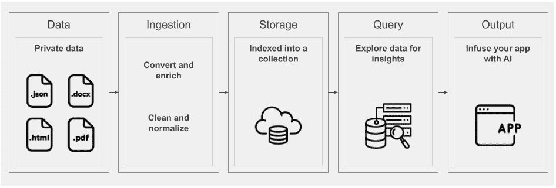

# Watson Discovery 简介

> 原文：[`developer.ibm.com/zh/articles/introduction-watson-discovery/`](https://developer.ibm.com/zh/articles/introduction-watson-discovery/)

**本文纳入 [Watson Discovery 学习路径](https://developer.ibm.com/cn/blog/2019/learning-path-watson-discovery/)**。

| 级别 | 主题 |
| --- | --- |
| **100** | **[Watson Discovery 简介](https://www.ibm.com/developerworks/cn/analytics/library/introduction-watson-discovery/index.html)** |
| 101 | [创建认知新闻搜索应用](https://developer.ibm.com/cn/patterns/create-a-cognitive-news-search-app) |
| 201 | [使用您自己的数据构建功能齐全的 Web 应用](https://developer.ibm.com/cn/patterns/create-an-app-to-perform-intelligent-searches-on-data) |
| 301 | [通过产品评价获取客户情绪洞察](https://developer.ibm.com/cn/patterns/get-customer-insights-from-product-reviews) |
| 401 | [利用智能文档理解改善客服系统](https://developer.ibm.com/cn/patterns/enhance-customer-help-desk-with-smart-document-understanding) |

## 简介

借助 IBM Watson Discovery，您可以快速而准确地对自己的非结构化数据（JSON、HTML、PDF、Word 等）进行采集、归一化、充实和搜索。它将核心 Watson API（如 Natural Language Understanding 和 Document Conversion）随 UI 工具一起打包，这些工具便于您上传和充实大型专用或公用数据集合，并建立索引。

下图显示了组成 Discovery 流程的所有组件的高级视图。



本文是[学习路径](https://developer.ibm.com/cn/blog/2019/learning-path-watson-discovery/)的第一部分，旨在帮助您更准确地了解 Discovery 工作方式，以及如何利用它来构建您自己的人工智能 (AI) 解决方案。

## 术语和概念

### Watson Discovery 服务术语

本部分涵盖了特定于 Discovery 的术语和概念。

| 术语 | 定义 |
| --- | --- |
| [集合](https://cloud.ibm.com/docs/services/discovery?topic=discovery-addcontent#adding-content-with-the-api-or-tooling) | 集合是环境中数据的逻辑分割，并且每个集合都将单独接受查询。 |
| [配置](https://cloud.ibm.com/docs/services/discovery?topic=discovery-configservice) | 配置可分配给集合，并用于对数据进行转换和归一化，以及指定要应用的充实操作。 |
| 充实 | Discovery 包含强大的分析引擎，可提供有关数据的认知充实和洞察。这些充实对象包括实体、类别、概念、关键字和情绪。 |
| [聚合](https://cloud.ibm.com/docs/services/discovery?topic=discovery-query-reference#aggregations) | 这表示 Discovery 返回一组数据值，如选定充实的排名前列的值。例如，它可返回数据集合中显示的前 10 个概念。 |
| [段落](https://cloud.ibm.com/docs/services/discovery?topic=discovery-query-parameters#passages) | 处理大型文档时，可使用段落搜索功能来返回与最佳匹配相关的简短摘录内容。 |
| [Discovery 查询语言](https://cloud.ibm.com/docs/services/discovery?topic=discovery-query-concepts) | 用于搜索结果的查询语法，使用字段名、运算符和关键字。 |
| [自然语言查询](https://cloud.ibm.com/docs/services/discovery?topic=discovery-query-parameters#nlq) | 作为严格的查询语言的替代方法，您还可以使用简单短语（如，“如何保存文件”）来查询语言。 |
| [Watson Discovery News](https://cloud.ibm.com/docs/services/discovery?topic=discovery-watson-discovery-news) | 每个创建的 Discovery 服务包含的集合。它是索引数据集，每天更新超过 300,000 篇新闻文章。 |
| Watson Discovery 工具 | 来自 IBM Cloud 控制台的广泛的 UI 工具集，可用于创建和填充集合、应用充实并对数据进行查询和检验。 |

### 充实

Discovery 具有强大的分析引擎，可提供有关数据的认知充实和洞察。利用内置自然语言处理 (NLP) 功能，它可从各种类型（例如，JSON、HTML、PDF 和 Microsoft™ Word）的文档中提取充实内容。下表显示了关键的充实内容。

| 充实 | 定义 |
| --- | --- |
| 实体 | 人员、公司、组织、城市和地理位置特征 |
| 情绪 | 识别整体正面或负面情绪 |
| 关键字 | 确定重要的关键字，排列其先后顺序并（可选）检测情绪 |
| 概念 | 识别不一定会直接引用的一般概念 |
| 分类 | 分类为深度达五个层级的类别层次结构 |
| 关系 | 将句子解析为主题、操作和操作形式，并返回额外语义信息 |
| 情感 | 分析情感，例如，愤怒、厌恶、恐惧、愉快和悲伤 |

对这些充实内容执行自然语言查询的能力相比于典型的关键字搜索引擎更具优势。

## 架构


Discovery 的常见用法为从应用程序访问 Discovery API。Watson 团队发布的 SDK 支持许多编程语言，因此您可在 Web 应用或移动应用中轻松使用 Discovery。

所有数据内容都在 Discovery 集合中加以存储和充实。数据无需任何特殊结构，可来自于多个公用和专用数据源。每个 Discovery 环境都随附有预先充实的数据集合，名为 Watson Discovery News。

（可选）通过 Watson Knowledge Studio，您可以借助领域专家来帮助定制 Discovery，以便更准确地了解特定行业或组织数据中的独特实体和关系。

Discovery 的部分典型用例包括：

*   *需要立即搜索数千条产品评论*：创建 Discovery 集合并构建 UI 以查询集合，绘制长期情绪变化图。
*   *需要以编程方式查找文档内的文本*：使用 Discovery 的段落检索功能来创建 FAQ 聊天机器人。
*   *存在数千个不同格式的文档，并且您需要以符合逻辑的方式组织这些文档*：使用 Discovery 来提取关键字、概念和关系以对其进行排序。

## 访问 Discovery

### 工具

正如前文所述，Discovery 拥有一整套自己的工具，通过 IBM Cloud 提供，这为手动管理 Discovery 集合提供了 UI。

以下视频显示了如何使用此工具来创建新数据集合，然后采集数据文件来充实内容。


以下演示展示了使用工具来访问服务，创建数据集合和查询数据。

[`www.youtube.com/embed/kwmqJRDbv98`](https://www.youtube.com/embed/kwmqJRDbv98)

[Discovery 入门](https://cloud.ibm.com/docs/services/discovery?topic=discovery-getting-started)教程提供了又一个出色的资源，介绍了所有工具特征的相关信息。

### SDK

为了以编程方式进行访问，Discovery 提供了对大量语言的支持。以下列表显示了现有开发者 SDK。

*   [Node SDK](https://github.com/watson-developer-cloud/node-sdk)
*   [Python SDK](https://github.com/watson-developer-cloud/python-sdk)
*   [Swift SDK](https://github.com/watson-developer-cloud/swift-sdk)
*   [Java™ SDK](https://github.com/watson-developer-cloud/java-sdk)
*   [Go SDK](https://github.com/watson-developer-cloud/go-sdk)
*   [Ruby SDK](https://github.com/watson-developer-cloud/ruby-sdk)
*   [.NET SDK](https://github.com/watson-developer-cloud/dotnet-standard-sdk)
*   [Salesforce SDK](https://github.com/watson-developer-cloud/salesforce-sdk)

### API

参阅 [Discovery API 文档](https://cloud.ibm.com/apidocs/discovery)，获取有关 API 的更多信息。

### 代码样本

以下 Node.js 代码样本展示了如何授权和查询 Discovery 集合。如果需要有关查询概念的更多信息，可查看 Discovery [文档](https://cloud.ibm.com/docs/services/discovery?topic=discovery-query-concepts#query-concepts)。

```
const DiscoveryV1 = require('watson-developer-cloud/discovery/v1');

const discovery = new DiscoveryV1({
  version: '2019-04-02',
  iam_apikey: '{apikey}',
  url: '{url}',
});

const queryParams = {
  environment_id: '{environment_id}',
  collection_id: '{collection_id}',
};

discovery.query(queryParams)
  .then(queryResponse => {
    console.log(JSON.stringify(queryResponse, null, 2));
  })
  .catch(err => {
    console.log('error:', err);
  }); 
```

## 结束语

本文是[学习路径](https://developer.ibm.com/cn/blog/2019/learning-path-watson-discovery/)的第一部分，此学习路径旨在指导您完成基于 Watson Discovery 服务构建功能齐全的 Web 应用的过程。在此学习路径中，您将有机会使用 Discovery 高级功能，以及学习如何将 Discovery 与其他 Watson 服务相集成。

让我们开始吧。[第一步](https://developer.ibm.com/cn/patterns/create-a-cognitive-news-search-app/)是构建简单的应用以访问 Watson Discovery News。