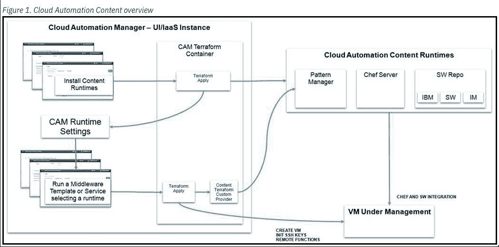
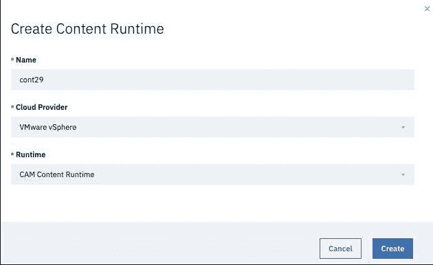
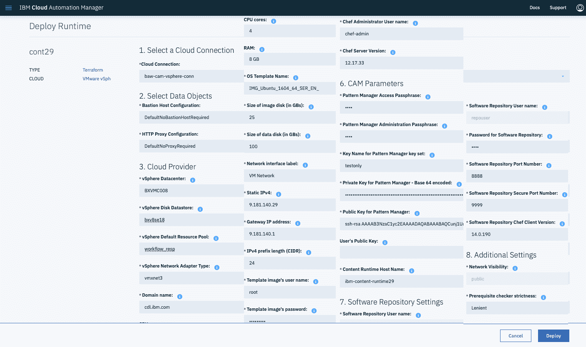
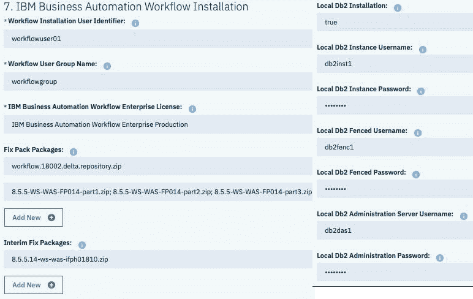
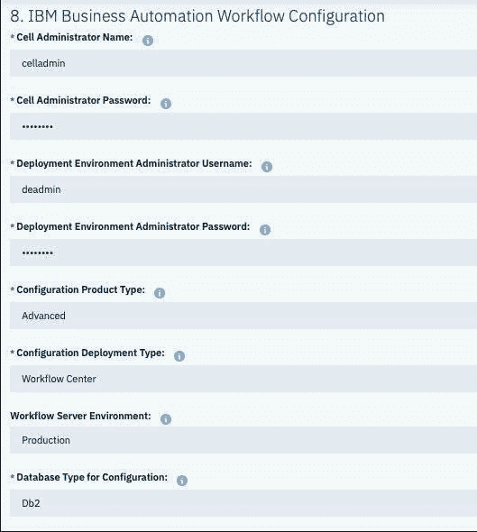
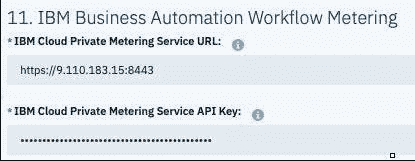
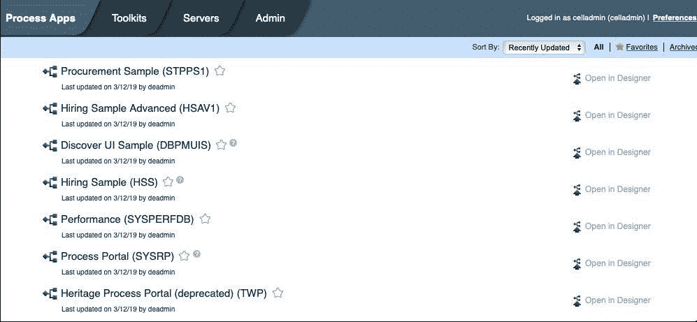

# 使用 IBM Cloud Automation Manager 在 IBM Private Cloud 上自动化部署 IBM Business Automation Workflow

> 原文：[`developer.ibm.com/zh/articles/cl-lo-automate-deployment-of-baw-on-icp-using-cam/`](https://developer.ibm.com/zh/articles/cl-lo-automate-deployment-of-baw-on-icp-using-cam/)

## 前言

万事皆云时代来临，有什么是不能在云上解决的呢？IBM Business Automation Workflow 在 IBM Private Cloud 上等您来。

当您愁眉苦脸安装 IBM Business Automation Workflow 的时候，当您声泪俱下创建 IBM Business Automation Workflow 运行环境的时候，您可能没有想到，我们已经将这个功能庞大的大家伙搬到了云上，不仅如此我们还提供了自动化部署的能力。What？Yes！是不是顿觉万里无云、神清气爽？太好了，快去煮一杯咖啡或者泡一壶清茶，我们带您一起轻装 Workflow。

## 涉及的产品

IBM Cloud Private(ICP)，一个安全可控的容器云平台，提供企业级私有云解决方案，帮助企业打造云原生应用环境，在受防火墙保护的数据中心内尽享公共云带来的安全优势。

IBM Business Automation Workflow(Workflow)，企业级工作流解决方案，它将信息、流程和用户集成在一起，提供全方位的视角，给企业带来更多优化的业务成果。

Workflow 如此优秀的软件也有让人诟病的地方，就是其繁琐的安装配置过程。如何能够快速的将 IBM Business Automation Workflow 部署在 IBM Cloud Private 上，使客户享受到”云”的便捷的同时又能拥有完善的工作流应用，IBM Cloud Automation Manager(CAM) 的出现解诀了这一系列的问题。

这三个产品都集成在 IBM Digital Business Automation for Multicloud(DBAMC) 产品中，客户只要有 DBAMC 的许可文件，就可以一次性简单快捷的获得所有产品。

## 工作流程

如图 1 所示，首先用户需要在 CAM 界面输入虚拟机和 Workflow 产品所必须的参数信息。其次，CAM 根据虚拟机的参数，使用 Terraform 在 vSphere 中将虚拟机创建出来。然后 CAM 会通过 Chef 和 Software Repository 将 Workflow 的产品安装配置到新的虚拟机中。

图 1\. 环境架构



（引用自 [IBM Cloud Automation Manager 文档](https://www.ibm.com/support/knowledgecenter/SS2L37_3.1.2.0/content/cam_content_runtime_overview.html) ）

这篇文章需要用户对于 ICP，CAM 和 Workflow 有基本的知识了解。我们将在已有的 ICP CAM 环境上展示部署 Workflow。

既然食材已经备好，那我们赶紧开始在”云上”烹饪这道著名的 “Workflow” 大餐吧。

## 选择模版

针对不同的客户需求，Workflow 提供了两个模版供选择。第一个模版名字是 IBM Business Automation Workflow Enterprise V18 on a single virtual machine，从名字就可以看出，这个模版只会针对一台虚拟机进行配置，配置完成的虚拟机将会有一个 Deployment manager 和一个 Custom node，拓扑结构为 Single cluster 的运行时环境。在数据库方面可以选择同时安装 Db2，或者选择使用远程的 Db2 或者 Oracle。

和这个模版对应的另一个模版 IBM Business Automation Workflow Enterprise V18 with IBM HTTP Server on multiple virtual machine 则是运行在 3 台虚拟机上，第一台虚拟机上将会运行一个 Deployment manager 和一个 Custom node，第二台虚拟机运行另一个单独的 Custom node，第三台虚拟机运行 IBM HTTP Server，拓扑结构方面为 Single Cluster 环境。在数据库上不支持本地安装 Db2，只支持远程的 Db2 和 Oracle。

在这篇文章里我们以 IBM Business Automation Workflow Enterprise V18 on a single virtual machine 模版为例，为大家展示一下整个安装配置过程。

## 准备材料

在真正开始着手安装之前，有如下材料需要先行准备好：

1.  VMWare ESXi 搭配 ICP 和 CAM 的环境

    最新发布的模版仍旧只支持在 VMWare 的环境上安装 Workflow。因此，我们需要一个已经配置好的 VMWare 环境，并且在它上面配置好 ICP 和 CAM。

    具体 ICP 和 CAM 的配置，可以参考 [ICP 文档](https://www.ibm.com/support/knowledgecenter/SSBS6K_3.1.2/kc_welcome_containers.html) 和 [CAM 文档](https://www-03preprod.ibm.com/support/knowledgecenter/SS2L37_3.1.2.0/kc_welcome.html) ，在这里我们不做细节上的讲解。

    除此之外，还需要在 VMWare 环境中准备一个 Ubuntu 安装镜像模版用来创建新的虚拟机。

2.  创建 vSphere Connection

    创建 vSphere Connection 的目的是为了将 CAM 和 VMWare vSphere 连接起来，使得 CAM 具有访问 vSphere 的能力。这里需要用到的参数有 3 个，可以从上一步中获得：

    *   vCenter server IP 或者主机名
    *   vCenter 用户名
    *   vCenter 用户密码
3.  创建以及配置 Content Runtime

    Content Runtime 是 CAM 重要的组成部分，它是由一台独立的虚拟机构成，它的上面运行有 Chef server 以及两个 Docker container，这两个 Container 一个用来跟 Chef server 进行通信，叫做 Pattern Manager； 另一个作为软件仓库来使用，叫做 Software Repository。

    Content Runtime 支持线上和线下两种配置方式，这里我们选择线上的方式。通过 CAM 提供的 Content Runtime 配置模版，我们来配置一下：

    *   从 CAM 左侧菜单栏进入，选择 Manage，然后点选 Content Runtime，在选择 Create Content Runtime。
    *   给新的 Content Runtime 起一个名字，在 Cloud Provider 下拉菜单选择 VMWare vSphere，在 Runtime 下拉菜单中选择 CAM Content Runtime，点击 Create 按钮。

    图 2\. 创建 Content Runtime

    

    *   第一个部分是 Cloud Connection，默认会选好在上一步中创建好的 Connection。
    *   第二部分是对堡垒机和 HTTP 代理的配置，我们选择默认不使用。
    *   三四部分是 vSphere Provider 的配置，相关的参数值要保持跟 VMWare vSphere 创建时配置的参数一致。
    *   第五部分是 Docker 和 Chef 的配置，保留默认值即可或者选择一个自己想用的 Chef server 的版本。
    *   第六部分是 CAM 参数的配置，前两个参数 Pattern Manager Access Passphrase 和 Pattern Manager Administration Passphrase 是 REST API 调用的时候使用的。中间三个参数 Key Name for Pattern Manager key set、Private key for Pattern Manager – Base 64 encoded 和 Public Key for Pattern Manager 是 Pattern manager 和新生成的虚拟机进行通信用的，这里要注意的是 Private Key 要提供基于 Base64 编码以后的值。

        可以使用命令来生成这一对 key 值：

        ```
         sh-keygen -t rsa -f [output_keyfile] -N "" -C ""; base64 -w 0
           [output_keyfile] > [output_keyfile].enc 
        ```

        其中[output_keyfile].enc 是编码后的 Private Key，[output_keyfile].pub 保存着 Public Key。

    *   最后一个参数可以给 Content Runtime 赋予新的主机名。
    *   第七部分是对 Software Repository 的配置，只需要设置一个新的密码，其他保持默认即可。
    *   最后一部分是扩展设置，使用默认值。
    *   点击 Deploy 按钮，开始 Content Runtime 的部署工作。

    完整的 Content Runtime 的配置如图 3 所示 。

    图 3\. Content Runtime 模版

    

    部署完成以后可以看到一个 Running 状态的 Content Runtime 列表，如图 4 所示。

    图 4\. Content Runtime 列表

    

    打开部署好的 Content Runtime，在 Output Variables 标签里找到 Pattern Manager URL (PM_URL) 和 Pattern Manager Access Passphrase (PM_ACCESS_TOKEN)两个条目，记录下来这两个值，执行下面设置环境变量的命令:

    ```
    export PM_ACCESS_TOKEN=your_pm_passphrase
    export PM_URL=https://your_pm_host:5443 
    ```

4.  下载产品安装包

    打开页面 [IBM Digital Business Automation for Multicloud V18.0 Download Document](https://www-01.ibm.com/support/docview.wss?uid=ibm10730077) ，选择下载 CNTA0ML、CNTA1ML、CNTA2ML、CNY8FML、CNY8GEN、CNY8HEN、CNY8IEN。这几个安装包里包含的产品包括 IBM Business Automation Workflow Enterprise 18.0.0.1、IBM Business Automation Workflow Enterprise 18002 升级包和 IBM WebSphere Application Server Network Deployment 8.5.5.14 升级包。

    将下载好的安装包放置到 Content Runtime 中的对应位置：

    *   BAW_18_0_0_1_Linux_x86_1_of_3.tar.gz BAW_18_0_0_1_Linux_x86_2_of_3.tar.gz BAW_18_0_0_1_Linux_x86_3_of_3.tar.gz：`/opt/ibm/docker/software-repo/var/swRepo/private/workflow`
    *   8.5.5-WS-WAS-FP014-part1.zip 8.5.5-WS-WAS-FP014-part1.zip 8.5.5-WS-WAS-FP014-part1.zip workflow.18002.delta.repository.zip ：`/opt/ibm/docker/software-repo/var/swRepo/private/workflow/fixpacks`
    *   8.5.5.14-ws-was-ifph01810.zip：`/opt/ibm/docker/software-repo/var/swRepo/private/workflow/ifixes`
5.  在 Content Runtime 上面准备好 Chef script。

    *   返回根目录，创建文件 workflow.json 并保存。

    ```
    {
    "source_repos": "github.com"，
    "org": "IBM-CAMHub-Open"，
    "repos": "cookbook_ibm_workflow_multios"，
    "branch": "2.0"
    } 
    ```

    *   在相同的目录下，执行命令更新 Chef script。

    ```
    curl -k -H "Authorization: Bearer $PM_ACCESS_TOKEN" -H "Content-Type:
    application/json" -d @workflow.json $PM_URL/v1/upload/chef 
    ```

    *   验证 Chef script 更新成功，执行命令。

    ```
    curl -k -H "Authorization: Bearer $PM_ACCESS_TOKEN" $PM_URL/v1/info/chef | grep workflow 
    ```

    如果命令返回值包括 workflow 2.0.x，说明脚本已经更新好了。

6.  在 CAM 中导入模版 IBM Business Automation Workflow Enterprise V18 on a single virtual machine。

    打开 CAM 界面，左侧菜单栏选择 Library 里面的 Templates。点击 Create template 按钮，选择从 Github 导入的标签。在显示出来的输入框里分别填入下边的内容，点击 Create，再点击保存。

    GitHub Repository URL: [`github.com/IBM-CAMHub-Open/template_ibm_workflow_singlenode`](https://github.com/IBM-CAMHub-Open/template_ibm_workflow_singlenode)

    `GitHub Access Token: your_personal_access_token`

    `GitHub Repository sub-directory: vmware/terraform`

    `GitHub Reference (branch or tag): 3.0`

    完成以后就可以在左侧导航条里面点击 VMWare vSphere 查看新创建的模版了。

    所有准备好的材料都是环保，可重复循环使用的，也就是说准备一次，可以支持后面重复无数次的部署使用，惊不惊喜？高不高兴？

## 部署 IBM Business Automation Workflow 环境

烹饪的过程永远都是准备饭食过程中最重要的环节，无论准备的多充分，好厨师的好手艺，食材的新鲜与否都是在这一刻体现出来的。展现手艺的时候就从打开模版开始吧。

1.  填充模版

    打开上一章节第 6 步中创建好的模版，首先展示出来的页面是对于整个模版的介绍，有一点需要注意的是这个模版现阶段只能在 VMWare vSphere 上面使用。点击模版右下角的 **Deploy template** 按钮，进入模版的用户输入界面。

    用户的输入界面分成了 11 个功能部分，如图 5，每个功能部分负责不同的功能参数的输入。

    图 5\. Workflow 模版总览

    

    第一部分需要填入的是即将创建的新 Instance 名字，在这里我们给它起名 “sample_instance”。第二部分是选择 Connection，如果只创建了一个 Connection，CAM 会自动选择并显示出来，如果 CAM 选择的不是所需的 Connection，可以从下拉列表里面重新选择。第三部分选择 Content Runtime，选择一个创建并且部署好的 Content Runtime。在完成了前三部分填充以后，后面的部分就会显示出来，新显示出来的部分我们下面分别介绍：

    *   Cloud Input Variables: vSphere Cloud 相关参数，包括 vSphere Datacenter，Cluster、Resource Pool、Folder Name。这些参数值在创建 vSphere Cloud 的时候就能够获得。

    图 6\. Cloud Input Variables 部分

    

    *   SSH Keys: 这里的 key 用来连接新生成的虚拟机，我们简单起见，后续使用密码登陆虚拟机，这里使用模版默认值。

    图 7\. SSH Keys 部分

    

    *   Virtual Machine Input Variables: 用来配置新的虚拟机相关参数。其中 “Operating System ID / Template” 需要填入的是 准备材料 里面准备好的 Ubuntu 镜像模版的名字。虚拟机 CPU，Memory 等的推荐值就是模版自带的默认值，也可以根据实际使用的情况更改其大小。这里需要考虑的一点是，Db2 也将同时安装在这一台新创建的虚拟机上，所以建议分配稍大一些的 CPU，Memory 和 Disk space 等参数。

    图 8\. Virtual Machine Input Variables 部分

    

    *   IBM Business Automation Workflow Installation: Workflow 产品安装相关的参数。”Fix Pack Packages” 默认参数为 “workflow.18002.delta.repository.zip” 和 “8.5.5-WS-WAS-FP014-part1.zip; 8.5.5-WS-WAS-FP014-part2.zip; 8.5.5-WS-WAS-FP014-part3.zip”，部署完成的最终产品将是 IBM Business Automation Workflow 18.0.0.2。

    这里需要注意的是 “Local Db2 Installation”，有 “true” 和 “false” 两个选项，如果选择 “true”，则说明将会在新的虚拟机上面安装 Db2，需要客户将下面 3 个 Db2 相关的用户信息补充完整；如果选择 “false”，则说明 Workflow 配置过程中将会使用远程的数据库，则后面的用户信息可以忽略。

    图 9\. IBM Business Automation Workflow Installation 部分

    

    *   IBM Business Automation Workflow Configuration: Workflow 产品配置的相关参数。我们选择默认的 Advanced Workflow Center 的配置环境，使用本地安装的 Db2 数据库。其他还可以选择 Advanced Workflow Server，以及 Advanced Only Workflow Center 或者 Worklfow Server 的配置环境。数据库除了 Db2 还可以选择使用远程 Oracle 数据库。

    图 10\. IBM Business Automation Workflow Configuration 部分

    

    *   IBM Business Automation Workflow Configuration – Db2: Db2 数据库的配置，Db 数据库的支持方式有两种，第一种是本地 Db2 数据库，也就是在安装 Workflow 产品的同时在同一台机器上安装 Db2 产品，另一种方式是使用远程已经安装好的 Db2 数据库。无论使用哪种都需要在这一部分进行相关配置。区别是如果使用的是远程的 Db2 数据库，则需要在使用 Template 部署 Workflow 产品之前创建好相应的数据库，然后将对应的数据库名字填写到这一部分。如果使用的是本地 Db2 数据库，则只需要在本部分填写需要用到的数据库名字即可，创建过程会在 Workflow 产品配置过程中自动完成。

    图 11\. IBM Business Automation Workflow Configuration – Db2 部分

    

    *   IBM Business Automation Workflow Configuration – Oracle: Oracle 数据库的配置，这一部分在这个实例里面并没有用到，在这里简单的展示给大家。如果没有兴趣的话可以直接跳到下一部分的配置。这一部分跟使用远程 Db2 十分类似，也需要在使用前创建好需要用到的 Schema。这里唯一需要注意的是新版本的 Workflow 已经不在提供默认的 Oracle JDBC driver，所以在使用之前需要先行下载好 Oracle JDBC driver 并放置到 Content Runtime 的相应位置。

    图 12\. IBM Business Automation Workflow Configuration – Oracle 部分

    

    *   IBM Business Automation Workflow Metering: 计量部分，这部分使用的是 WAS 自带的 Metering 功能，在 CAM 注册以后可以查看相应的参数。

    Metering 有两个参数，Metering URL 和 Metering API Key，这两个参数可以通过 [配置 ICP Metering Service](https://www.ibm.com/support/knowledgecenter/SSBS6K_3.2.0/manage_metrics/metering_service.html) 获得。

    图 13\. IBM Business Automation Workflow Metering 部分

    

2.  运行模版

    完成了上一步中各项用户参数的配置，点击页面右下角的 Deploy 按钮，CAM 就会帮助我们在 ICP 上面部署 Workflow 产品了。主要完成的工作包括：Workflow 产品的安装，Db2 产品的安装以及 Workflow 产品的基本配置。整个运行过程中不在需要人为的参与，配置过程中的日志可以通过点击左侧 Deployed Template，选择 Template，然后选择新创建的 Instance 的名字，打开新创建的 Instance 页面。在页面的左上角有三个标签，最右侧标签为 LogFile，点击即可看到配置过程中的实时日志。

## 部署成功了？

想要知道部署的结果可以通过 CAM 界面获取，点击左侧 Deployed Template，选择 Template，所有部署的 Instance 列表就会显示出来。

如果显示为绿色原点 “Running” 状态，表示部署成功，如果显示红色圆点 “Failed”，表示部署失败。除此之外还有黄色圆点 “Destroyed”，表示资源已经删除，但是实例的配置保留。圆点位置正在转圈 “In Progress” 则表示正在配置过程中的实例。

点击新生成的 Instance，如下图所示，”Running” 表示部署成功，除此之外还可以在 Overview 标签下查看配置参数，以及可以访问的链接，比如 ProcessCenter。

图 14\. instance 列表


图 15\. Process Center



因为 vSphere 的特殊性，我们还可以通过登陆虚拟机查看部署的产品。如下图所示（versioninfo），在命令行执行如下命令可以获取安装产品列表：

`/home/BAW User/IBM/Workflow/bin/versionInfo.sh`

图 16\. 产品安装报告


到此，一个 Workflow 产品就部署好了，并且正在运行，客户可以直接开始使用了。

如果这时您忽然发现一套产品不够用，需要多套测试环境？太容易了，只需要重新执行上一步部署 IBM Business Automation Workflow 环境就可以了。

如果觉得这套环境太简单？那就试试我们的另一个模版 IBM Business Automation Workflow Enterprise V18 with IBM HTTP Server on multiple virtual machines 吧。

## 结束语

结合了 ICP 和 CAM，在云上部署 Workflow 变成了简单易行的事情，如果您还在苦恼那些繁冗的步骤，不停重复的工作，不妨来试试这一套新方法吧。

## 参考资源

*   参考 [IBM Business Automation Workflow 文档](https://www.ibm.com/support/knowledgecenter/SS8JB4_18.0.0/com.ibm.wbpm.workflow.main.doc/kc-homepage-workflow.html)，了解更多使用中注意事项及更多功能配置方法。
*   参考 [IBM Cloud Private 文档](https://www.ibm.com/support/knowledgecenter/SSBS6K_3.1.2/kc_welcome_containers.html)，了解更多配置和使用方法。
*   参考 [IBM Cloud Automation Manager 文档](https://www-03preprod.ibm.com/support/knowledgecenter/SS2L37_3.1.2.0/kc_welcome.html)，了解更多相关功能。