# Git 进阶：比较、回滚、撤销、分支合并和冲突解决

> 原文：[`developer.ibm.com/zh/articles/os-cn-git-and-github-4/`](https://developer.ibm.com/zh/articles/os-cn-git-and-github-4/)

## 前言

本系列的 [第三篇](https://www.ibm.com/developerworks/cn/opensource/os-cn-git-and-github-3/index.html) 介绍了使用 Git 和 GitHub 进行日常操作。在这篇文章中，我将介绍 Git 在日常工作中的经常使用的进阶操作，包括比较操作、回滚、撤销、分支合并和冲突解决。这些操作也都是在实际项目中我们会经常遇见同时相信也是很多读者经常感到头疼和容易混淆的操作。Git 针对这些操作也提供了很好的支持。

2018 年初，我所在的项目组考虑到之前使用的 Perforce 代码管理系统太多笨重且将其集成进 DevOps 工具栈具有诸多不便，经讨论之后，决定将代码库从 Perforce 迁移到 GitHub 上。本人负责整理调研和领导 GitHub 迁移工作。目前已成功将项目代码库迁移并且将其集成进了日常构建。在迁移过程中，我积累诸多宝贵经验，故此借此机会编写一个系列技术文章，来介绍 Git 和 GitHub 基础知识、使用技巧和到最后如何实施的迁移。

本系列将会围绕 Git 和 GitHub 全面涵盖并介绍 Git 原理、Git 和 GitHub 使用、分支管理策略、权限控制策略、代码评审和 pull request、将 GitHub 集成进持续集成，最后会集中介绍代码迁移的整个过程，向有兴趣的读者分享这一过程中所遇到的各种问题和解决办法。

—— 曹志

## 比较

比较操作是开发过程中最常用的操作之一，场景包括通过比较来查看本地修改了哪些代码，比较特定分支之间的代码，或者 Tag 与 Tag 之间、Tag 与分支之间的比较。Git 中比较操作可以通过 diff 操作和 log 完成，diff 主要用于比较文件内容的差异，而 log 操作主要比较 commit 的差异。在本系列的第三篇文章中 Diff 操作中已经简单介绍了工作区、暂存区和代码库之间的比较。这里我将会详细介绍其它各种对象之间的比较。

Diff 命令的基本格式是 `git diff <src> <dst>` 。其作用是相比 `src` ，列出目标对象 `dst` 的差异。例如图 1 和图 2 所示，分别执行 `git diff dev master` 和 `git diff master dev` 来查看 dev 分支和 master 分支的差异，两次执行结果显示的是相反的结果。

##### 图 1\. 执行 git diff dev master

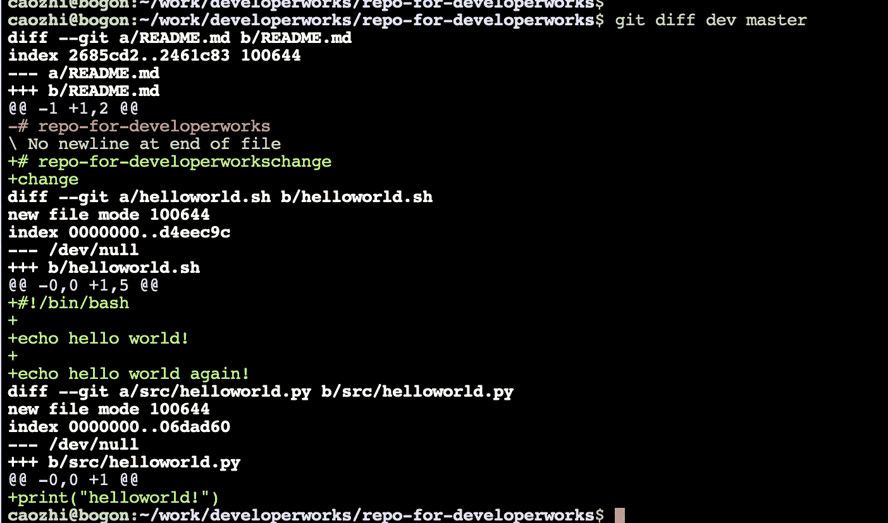

##### 图 2\. 执行 git diff master dev

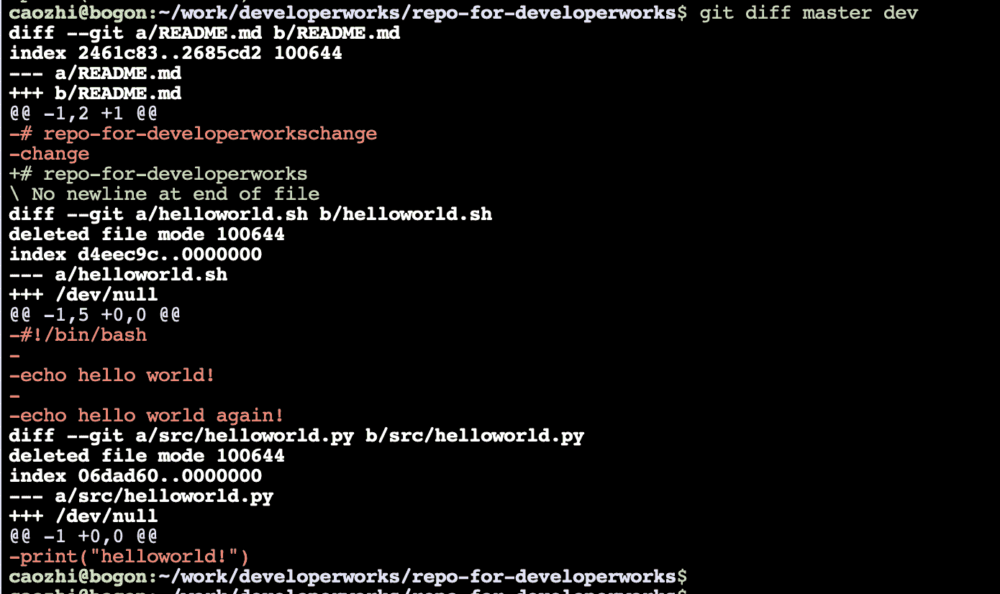

Git 中 Tag 和分支本质上都是指向对应 commit 的指针。因此 Tag、分支、commit 三者之间可以很平滑的进行比较操作。例如图 3 进行了 tag 和分支之间的比较、图 4 进行了 Tag 和 Tag 之间的比较、图 5 进行了分支和 commit 之间的比较。

##### 图 3\. tag 和分支的比较

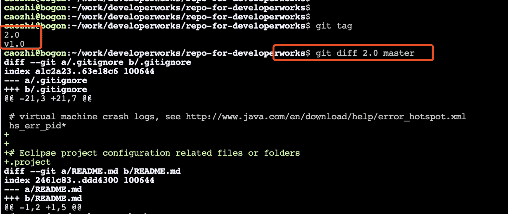

##### 图 4\. Tag 和 Tag 之间的比较

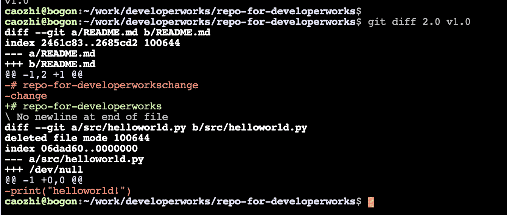

##### 图 5\. 分支和 Commit 之间的比较

使用 `git diff` 也可以查看单个文件的差异。例如图 6 所示：

##### 图 6\. 比较单个文件的差异

在实际项目中，只通过命令行的方式来展示差异在某些场景下可能不是特别友好，比如想要比较两个相隔时间较远、差异特别多的分支，通过命令行的方式可能较难定位到我们关心的修改。因此我在实际项目中也会使用 IDE 或其它图形化 Git 客户端进行比较。例如图 7 展示了如果在 Eclipse 的 EGit 插件中比较两个 commit：

##### 图 7\. Eclipse EGit 中比较两个 commit

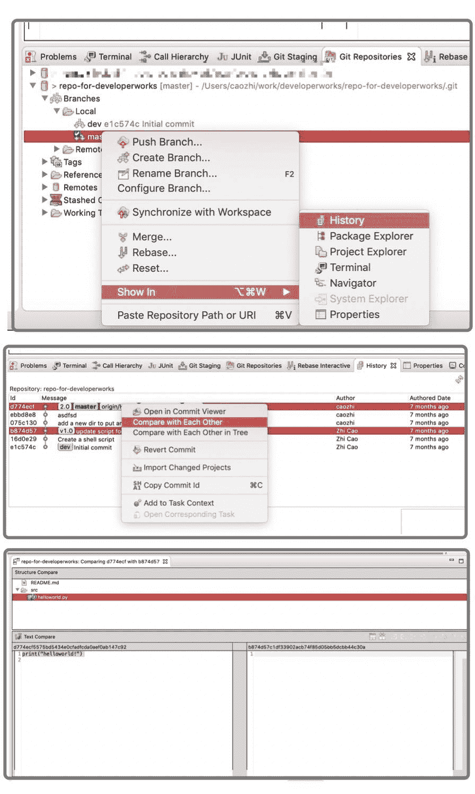

## 回滚和撤销

### 回滚

回滚（Rollback）操作指的是将已经提交到代码库的 commit 生成一个与对应 commit 完全相反的 commit，相当于是对目标 commit 进行一次代码修改的逆向操作。在实际项目中，经常用于进行版本的回滚或对某些错误提交进行回滚。Git 中是使用 revert 命令进行回滚操作，它会生成一条新的反向 commit，同时保留目标 commit。下面我将演示进行 revert 的一个小实验。

首先我先进行了一些代码修改并进行了提交。提交的 commit 包含新增文件、删除文件以及代码修改，如下图 8 所示：

##### 图 8\. 提交 commit

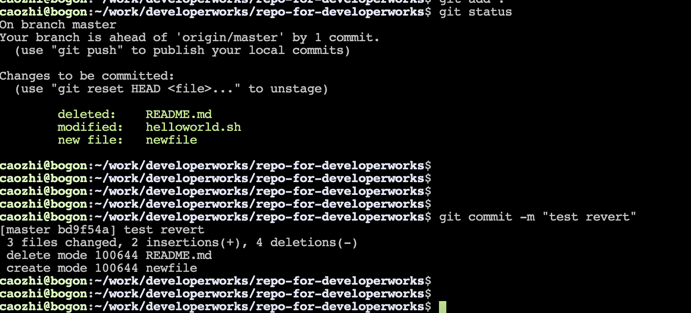

然后我们再利用 `git revert` 进行回滚，如图 9 所示。可以看到回滚之后，Git 生成了一条新的 commit，这条 commit 的提交内容与被回滚的 commit 完全相反：

##### 图 9\. 执行 revert 操作

### 撤销

撤销操作指的是丢弃我们的代码修改。实际开发中撤销通常包含多种情况：

*   撤销未保存至暂存区的代码。
*   撤销已保存至暂存区但是还未提交到代码库的代码。
*   撤销已提交到本地代码库但还未 push 到远端进行同步的代码。
*   撤销已提交到远端的代码。

不同的情况可能采取不同办法来解决。

#### 撤销未保存到暂存区的代码

当我们只需要撤销并丢弃到某个文件的修改时，我们可以使用 `git checkout -- filepath` 命令来进行撤销。如图 10 所示：

##### 图 10\. 撤销单个文件的修改

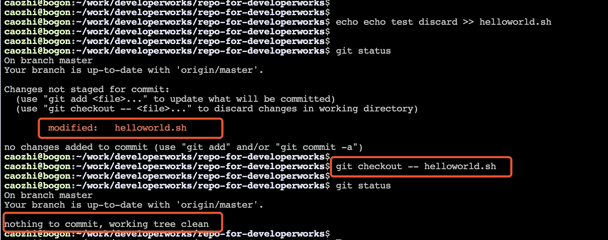

本地修改太多，我们又想完全丢弃掉本地修改时，使用 `git checkout -- filepath` 命令会显得十分麻烦。此时可以使用 `git reset -- hard HEAD` 命令来丢弃本地所有修改，如图 11 所示：

##### 图 11\. 丢弃本地修改

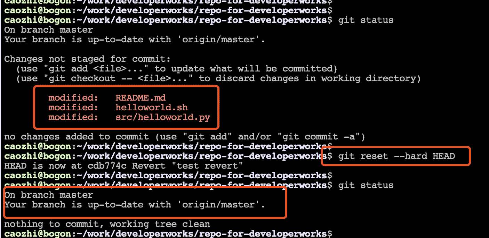

对于下面两种情况，我们也都可以使用 `git reset` 命令结合不同的选项来进行操作。

#### 撤销已保存至暂存区但是还未提交到代码库的代码

当我们不想完全丢弃掉代码修改，而只是想将暂存的修改撤销到工作区，我们可以使用 `git reset HEAD` 命令来完成。由图 12 可以看到，此时暂存区的修改被恢复到了工作区。

##### 图 12\. 从暂存区恢复到工作区

#### 撤销已提交到本地代码库但还未 push 到远端进行同步的代码

例如我们已经将修改 commit 到了本地代码库，如图 13 所示，可以看到 HEAD 指针已经指向了本地最新的修改。当我们想要撤销掉该 commit 时，可以使用 git reset [–hard] commit_id 命令来操作。同样的，如果我们只是想保留修改，我们可以使用 `git reset commit_id` 命令来使得 HEAD 指针指向对应的 commit，这样在其之后 commit 的代码修改会被撤销到工作区，如图 13 所示：

##### 图 13\. 将已提交 commit 恢复到工作区

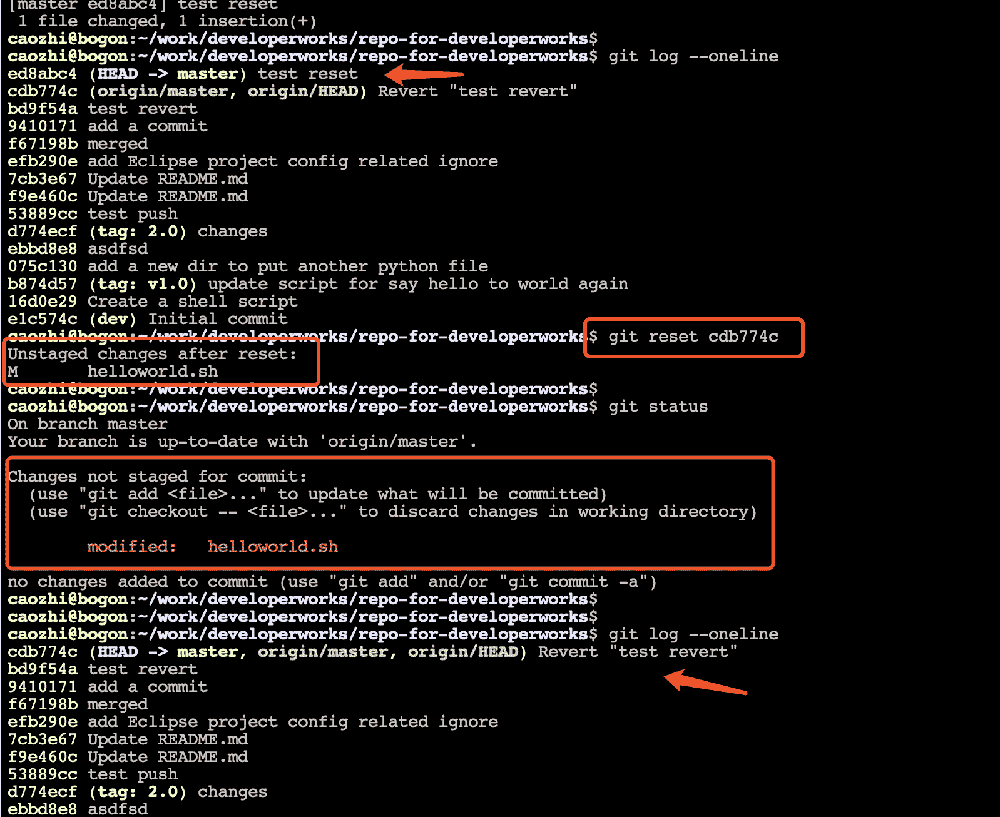

当我们不需要保留修改，而想要完全丢弃掉 commit 时，我们可以使用 `git reset --hard commit_id` 命令，这样对应 commit 之后的 commit 将会完全被丢弃。如图 14 所示：

##### 图 14\. 完全丢弃已提交 commit

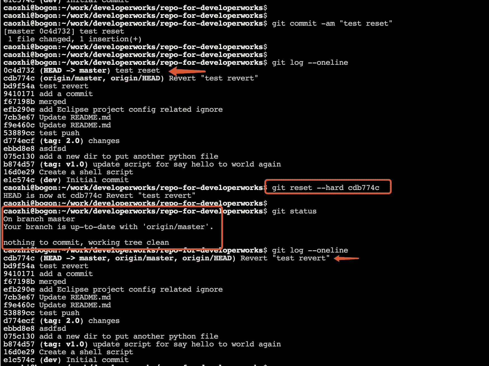

#### 撤销已提交到远端的代码

而对于已经提交到远端的 commit，此时我们没有办法再使用 reset 命令撤销掉原先的 commit，即使在本地用 reset 进行了撤销，再进行同步拉取代码时，仍然会将远端的 commit 拉回本地。因此这种情况我们只有通过 revert 进行回滚。

由此我们也可以看到，revert 和 reset 命令都可以用于撤销 commit，它们最大的不同在于 revert 会生成一条与之前完全相反的 commit 同时保留原先的 commit，而 reset 则是抛弃掉原先的 commit。

### Reset 命令的本质

Reset 命令本质上是重置工作区的 HEAD 指针使其指向对应位置，当重置 HEAD 指针之后，会将 HEAD 指针之后的 commit 丢弃掉从而也达到了撤销修改的目的。reset 命令有三个参数：

*   `--soft` 选项：重置 HEAD 之后，将重置 HEAD 之后的 commit 的代码变更还原到暂存区。
*   `--hard` 选项：重置 HEAD 之后完全丢弃 HEAD 之后的代码。
*   `--mixed` 选项：默认选项。重置 HEAD 之后，将重置 HEAD 之后的 commit 的代码变更还原到 **工作区** 。

理解 reset 命令的三个选项的本质不同，需要理解 Git 的三个工作区的不同：工作区、暂存区和代码库。您可以参考本系列的 [第三篇](https://www.ibm.com/developerworks/cn/opensource/os-cn-git-and-github-3/index.html) 文章的相关简介来了解这三个工作区。下列实验（图 15 到图 18）演示了使用 reset 命令三个选项重设 head 到 e6ea793 时，commit b772c6e 中的代码的不同状态。如果您想要自己尝试重现该实验，那么在两次 reset 之间为了恢复到相同的状态，需要执行 `git reset --hard e6ea793 && git pull` 来进行代码同步。

##### 图 15\. 执行 reset 前的两个 commit

##### 图 16\. 使用 –mixed 选项执行 reset

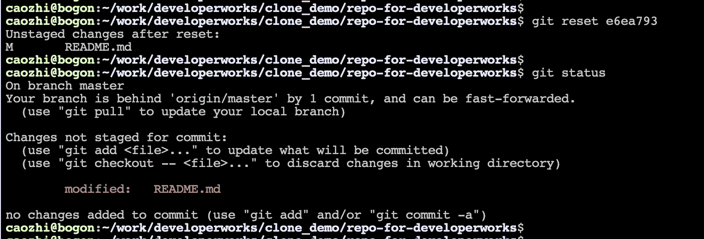

##### 图 17\. 使用 –soft 选项执行 reset

##### 图 18\. 使用 –hard 选项执行 reset

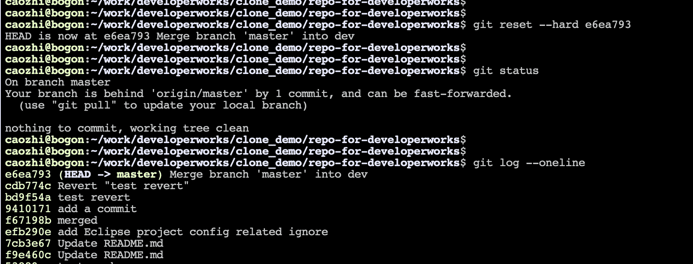

## 合并分支

在本系列 [第三篇](https://www.ibm.com/developerworks/cn/opensource/os-cn-git-and-github-3/index.html) 文章中已经介绍了分支的基本操作，包括创建分支、删除分支等。本节将会介绍实际开发中分支的另一个重要操作：合并分支。

合并分支是将目标分支的 commit 合并到当前分支的操作。一般使用 `git merge` 命令来完成。在进行 merge 实验之前，首先我将 master 分支和 dev 分支的代码进行了同步，并切换到了 dev 分支，如图 19 所示：

##### 图 19\. 同步 master 和 dev 代码

然后我在 dev 分支上进行一次提交，如图 20 所示：

##### 图 20\. 在 dev 分支进行一次提交

接下来我们切换到 master 分支使用 `git merge branchname` 命令进行合并，如下图 21 所示：

##### 图 21\. 将 dev 分支合并到 master

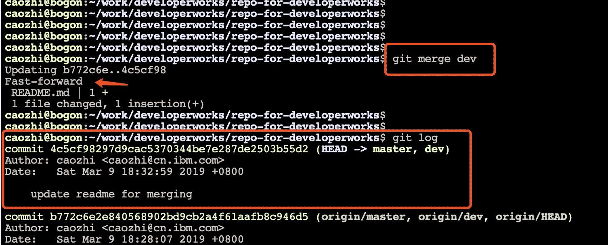

可以看到 master 分支成功合并了 dev 分支的那条 commit。

### Fast-forward

观察可以看到上面的实验 Git 是以 Fast-forward 方式进行的合并。Fast-forward 是指快进合并，它是直接将 master 分支指针直接指向了 dev 分支的 commit，而并没有在 master 分支上产生新的 merge commit。我们再执行一次相同的操作来演示非快进合并模式的效果。执行 git merge 命令时通过加上 `--no-ff` 选项来禁止 Fast-forward。如图 22 示，可以看到非快进合并模式下，git 会产生一条新的 `merge commit` 。使用 Fast-forward 模式的好处是可以快速的进行合并且不会产生 merge commit，但其缺点在于它不会保留合并分支的信息，因此当合并分支被删除时，也就不知道对应的提交是来自于哪个分支。

##### 图 22\. 非快进方式合并

### Squash 选项

有时候我们实际项目中在自己的开发分支上可能会提交很多跟业务意义关系不大的 commit，例如格式修改、删除空格、撤销前次提交等等，执行 `git merge` 操作时默认情况下会将合并分支上这些原始 commit 直接合并过来，在目标分支上保留了详细的提交历史，往往这些无意义的提交历史会导致主分支的历史显得杂乱。这种情况下我们可以使用 squash 选项将待合并的所以 commit 重新替换成一条新的 commit。如图 23-24 所示，我们将 dev 分支的三条 commit 合并成了一条 commit。

##### 图 23\. Dev 分支上的三个 commit

##### 图 24\. 将 dev 分支使用 Squash 方式合并到 master

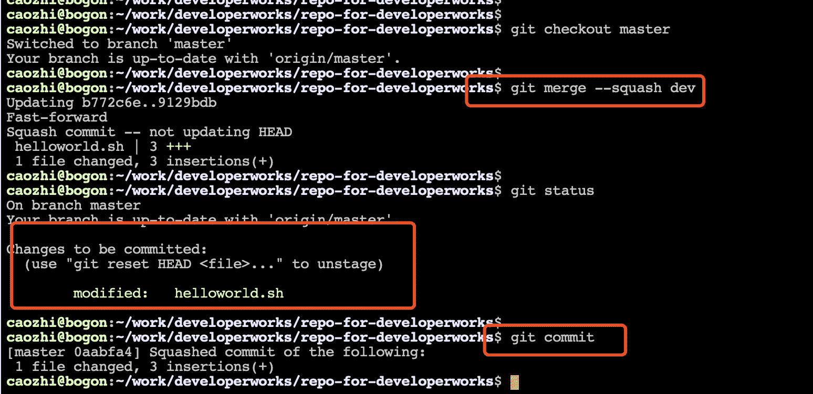

##### 图 25\. 查看 master 上的 squashed commit

## Cherry-pick

除了使用 `git merge` 命令来合并分支之外，我们还可以通过 cherry-pick 命令来检出特定的一个或多个 commit 进行合并。首先我们先在 dev 分支上提交 3 条 commit，如图 26 所示：

##### 图 26\. Dev 分支上的三个 commit

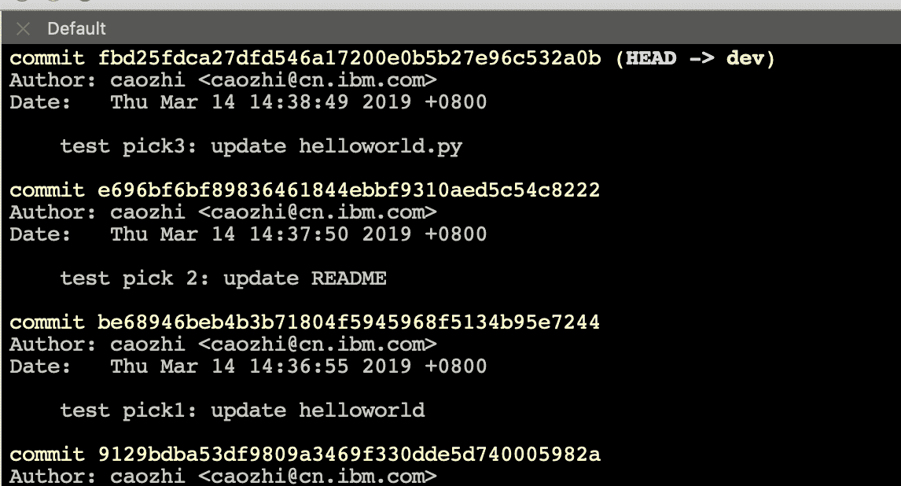

然后我们切换到 master 分支使用 cherry-pick 来合并第二个 commit，如图 27 所示：

##### 图 27\. 在 master 上 cherry-pick dev 分支的 commit

查看 log 发现第二个 commit 被合并到了 master 分支，如图 28 所示：

##### 图 28\. 查看 cherry-pick 结果

## 冲突的产生与解决冲突

### 冲突的产生

在实际项目中，冲突是不可避免的问题。冲突可能出现在很多情况下，例如使用 pull 去同步代码时、多个分支之间进行合并时，甚至在进行 cherry-pick 时都可能产生冲突。例如下面实验（图 29-31）中，我们分别在 dev 和 master 分支上同时修改了 helloworld.sh 的同一段代码，然后从 dev 分支往 master 上进行合并，Git 会提示我们产生了冲突同时无法自动合并。

##### 图 29\. dev 分支中的代码修改

##### 图 30\. master 分支中的代码修改

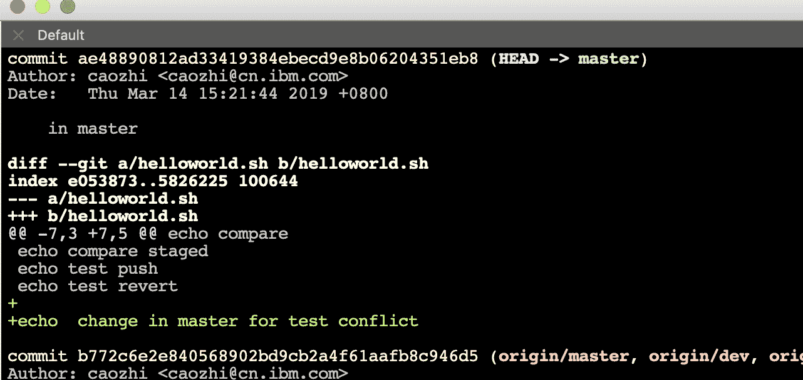

##### 图 31\. 合并时产生冲突

### 解决冲突

无论是什么情况下产生的冲突，Git 一般会直接将冲突信息输出到冲突文件中，并使用 `<<<<<<` 、 `=====` 、 `>>>>>>` 符号来标注产生冲突的位置以及两个分支的冲突代码。我们需要解决冲突再进行下一步合并或者代码提交的操作，如图 32 所示：

##### 图 32\. 源文件中显示冲突位置

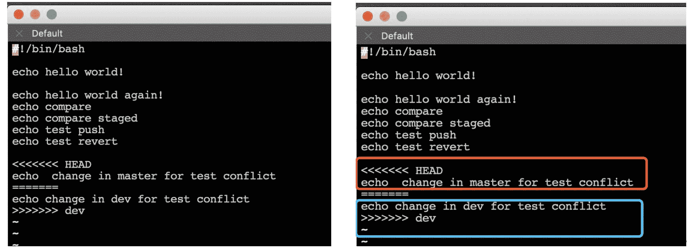

我们可以直接编辑该冲突文件，保留我们感兴趣的内容，同时删除 Git 自动生成的标识行 `<<<<<<` 、 `=====` 、 `>>>>>>` 。也可以借用 GUI Git 客户端、IDE 或者其它合并工具进行冲突解决。下图展示了 Eclipse（图 33）、VSCode（图 34）和 GitHub Desktop（图 35）的冲突解决。=

##### 图 33\. Eclipse 里解决冲突

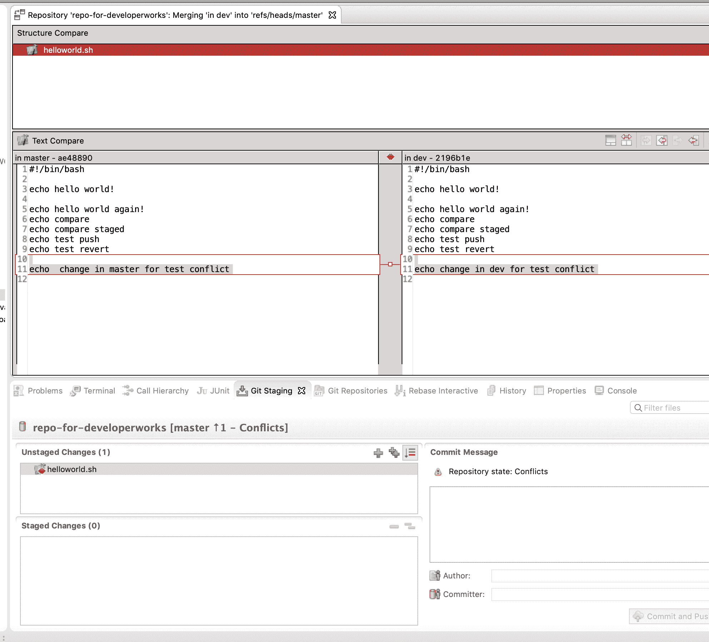

##### 图 34\. VSCode 里解决冲突

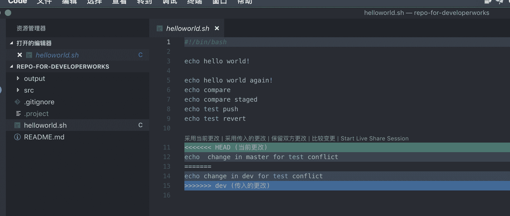

##### 图 35\. GitHub Desktop 里解决冲突

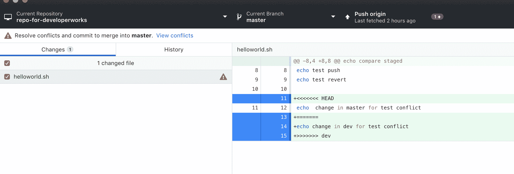

当在代码中解决了冲突之后，我们需要将修改后的代码重新使用 `git add/rm/mv` 提交到暂存区，并重新 commit 到代码库中。

### 避免产生冲突

现代软件开发项目中，代码冲突是不可避免的，但我们应该尽量减少冲突的产生，避免不必要的冲突。下面列举一下实践经验：

*   工作在不同的分支上，并经常性的同步主代码，如果由于项目要求，比如长期开发一个功能使得该功能代码在开发完成之前合并到主分支，此时我们虽然没有办法经常合并代码到主分支，也至少需要经常性的同步主分支代码到开发分支上，避免在最终合并到主分支上时产生过多冲突。
*   尽量使用短生命周期分支而非长期分支。

除了技术层面的手段，也可以通过项目管理上的手段来尽量避免，例如：

*   不要同时将相同组件开发的不同任务分给不同的开发者，否则在合并代码时该组件将会产生过多的冲突。
*   各组件开发小组之间经常性的沟通，互相了解各自的开发状态，在可能产生冲突的时候及时采取手段。

## 结束语

本篇文章通过一些演示讲解了 Git 在日常项目中的常用进阶操作，包括使用 diff 命令进行比较，使用 revert 命令进行回滚，使用 reset 进行撤销以及分支之间的合并等。本篇文章的思路并没有从 Git 命令本身出发，而是从使用场景出发进行讲解，旨在结合实际项目场景来解决开发者经常遇到的问题。当然这种思路也使得有些操作的介绍不尽详实。对此建议您在了解了具体场景如何进行操作的同时，也可翻阅 Git 的官方文档来查看各个命令更详细的参数及其作用。