# 使用 Camel 实现分布式企业应用集成

> 原文：[`developer.ibm.com/zh/articles/os-using-camel-for-distributed-integration/`](https://developer.ibm.com/zh/articles/os-using-camel-for-distributed-integration/)

## 概述

随着第三平台的到来、微服务的普及和应用的种类大幅增加，应用集成就显得尤为重要。针对应用集成，传统的 ESB（企业系统总线）显得太重，而且不够灵活。那么，在微服务时代，我们如何构建分布式应用集成系统呢？本文将通过一些具体的业务需求展开讨论，然后看如何通过 Camel 解决实际的问题。

ESB 是从 SOA 发展而来。它解决的是不同应用程序的不同功能单元相互通讯和协作的问题，传统 ESB 是面向系统的集中集成，如图 1 所示：

**图 1\. 传统集中式集成**

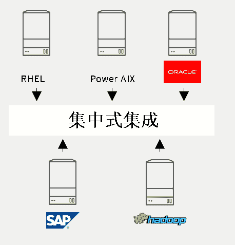

这种集中式的集成方式，对于传统的应用大有裨益。但在第三平台时代，这种集成方式存在不足之处。在微服务时代，一个应用本身就包含多个微服务，我们很难将多个微服务体系中的成百上千个基于容器的应用集中到一个 ESB 上，集中式集成会破坏微服务的稳定性。在微服务时代，我们需要分布式集成。而在分布式集成方案中， [Apache Camel](http://camel.apache.org/) 就是一个很好的开源项目。

Apache Camel 是一个基于规则路由和中介引擎，提供企业集成模式（EIP）的 Java 对象(POJO) 的实现，通过 API 或 DSL（Domain Specific Language）来配置路由和中介的规则。

目前 Camel 支持多种运行时，如 Apache Karaf、Spring Boot、JBoss EAP。其中，Spring Boot 组件为 Camel 提供自动配置。Camel 上下文的自动配置会自动检测 Spring 上下文中可用的 Camel 路由，并将关键的 Camel 实用程序（如生产者模板，使用者模板和类型转换器）注册为 bean。目前在 Spring Boot 上运行 Camel 是业内的主流。本文的案例，也是基于 Spring Boot 运行 Camel。

接下来，我们通过三个实际的企业集成需求案例，介绍 Camel 的作用和用法。在实验中，将 Camel 路由创建好以后，先在本地通过 Spring Boot 运行，验证路由的正确性；然后通过 Fabric8 将包含 Camel 配置的 Spring Boot 部署到 Kubernetes 集群上。Camel 在 Kubernetes 集群上运行，大幅提升了 Camel 的应用场景，也在容器化应用的集成领域发挥重要的作用。

文中涉及大量的源代码，由于篇幅有限，下文三个业务场景中只列出关键代码，相关完整代码请参照 Github：

*   [场景 1 源码地址](https://github.com/gpe-mw-training/agile_integration_advanced_labs/tree/master/code/fuse/01_file-split-and-transform/file-split-transform-lab)

*   [场景 2 源码地址](https://github.com/gpe-mw-training/agile_integration_advanced_labs/tree/master/code/fuse/02_rest_split_transform_amq/rest-split-transform-amq-lab)

*   [场景 3 源码地址](https://github.com/gpe-mw-training/agile_integration_advanced_labs/tree/master/code/fuse/03_rest-publish-and-fix-errors/rest-publish-and-fix-errors-lab)

## 场景 1：通过 Camel 实现文件的转换

某企业的业务系统 A（简称 A 系统）以 CSV 的格式生成客户的信息（文件名为 customers.csv）。业务系统 B（简称 B 系统）要求将 A 系统生成的 CSV 文件按照每个用户（每一行是一个用户信息）进行拆分，并且进行内容格式转换，以 JSON 格式存储到文件系统上，以便 B 系统可以直接读取生成的 JSON 文件。此外，如果 A 系统生成的客户信息条目中出现格式错误，则需要将这条客户信息单独保存出来，并且触发系统的 error 告警。

A 系统生成的 customers.csv 文件内容如下：

**清单 1\. customers.csv 内容**

```
Rotobots,NA,true,Bill,Smith,100 N Park Ave.,Phoenix,AZ,85017,602-555-1100
BikesBikesBikes,NA,true,George,Jungle,1101 Smith St.,Raleigh,NC,27519,919-555-0800
CloudyCloud,EU,true,Fred,Quicksand,202 Barney Blvd.,Rock City,MI,19728,313-555-1234
ErrorError,,,EU,true,Fred,Quicksand,202 Barney Blvd.,Rock City,MI,19728,313-555-1234 
```

根据上述需求描述，绘制通过 Camel 的路由实现的流程图，如图 2 所示：

**图 2\. 场景 1 路由流程图**


整个流程是：

1.  Camel 读取 A 系统生成 customers.csv 文件。
2.  然后按照行进行拆分（customers.csv 文件中每条客户信息是一行）。
3.  如果格式正确，那么先将拆分的报文进行数据转换，转化为 JSON 格式存储文件（account.json）；如果格式不正确，生成 error.csv 文件（不进行数据转化）。

数据转化通过 Java 类实现。因此，此流程中存在序列化和反序列化，如图 3 所示：

**图 3\. 反序列化与序列化**


上图中，A 系统生成的 customers.csv 文件先被读取、拆分；如果格式正确，那么被拆分的报文将会被反序列化成 Java 对象。然后 Java 类进行对象数据转换、序列化操作，以 JSON 格式保存到文件中。

下面通过 IDE 工具 JBDS（JBoss Developer Studio）创建一个 Maven 项目，作为构建 Camel 路由的基础：

**图 4\. 创建 Maven 项目**


接下来，根据该企业 IT 部门提供的两个 Schema 文件 customer.csv 和 account.json，创建两个 POJO、一个 XML 数据转换规则文件以及 Camel 路由 XML 文件。

第一个 Schema 文件 customer.csv 定义了针对 A 系统生成的 CSV 文件被反序列化时每个字段。我们需要根据 Schema 的内容书写 POJO: Customer.csv，这个 Java 类用于反序列化操作。customer.csv 内容如下：

**清单 2\. customer.csv**

```
companyName,region,active,firstName,lastName,streetAddr,city,state,zip,phone
string,string,boolean,string,string,string,string,string,string,string 
```

第二个 Schema 文件 account.json 定义了数据转化后的字段格式，如清单 3 所示：

**清单 3\. account.json**

```
{
  "type": "object",
  "properties": {
    "company": {
      "type": "object",
      "properties": {
        "name": {
          "type": "string"
        },
        "geo": {
          "type": "string"
        },
        "active": {
          "type": "boolean"
        }
      },
      "required": [
        "name",
        "geo",
        "active"
      ]
    },
    "contact": {
      "type": "object",
      "properties": {
        "firstName": {
          "type": "string"
        },
        "lastName": {
          "type": "string"
        },
        "streetAddr": {
          "type": "string"
        },
        "city": {
          "type": "string"
        },
        "state": {
          "type": "string"
        },
        "zip": {
          "type": "string"
        },
        "phone": {
          "type": "string"
        }
      }
    }
  },
  "required": [
    "company",
    "contact"
  ]
} 
```

### 创建 POJO 和 transfermation.xml

可以根据 [Flatpack DataFormat](http://camel.apache.org/flatpack-dataformat.html) 的语法来配置 Customer.java 和 Account.java。

1.  根据 Schema 文件 customer.csv 编写 Customer.java **，** 如清单 4 所示：

    **清单 4\. Customer.java（部分内容）**

    ```
    @CsvRecord(separator = ",")
    public class Customer {
        @DataField(pos = 1)
        private String companyName;
        @DataField(pos = 2)
        public String getCompanyName() {
            return companyName;
        }

        public void setCompanyName(String companyName) {
            this.companyName = companyName;
        }
    } 
    ```

    Customer.java 负责将拆分（Camel 调用 Splitter EIP 按照换行符拆分）后的格式正确的报文进行反序列化操作，从 CSV 映射成 Java 对象。

2.  编写 Account.java，如清单 5 所示：

    Account.java 的作用是将 Java 的对象进行数据转换、序列化操作（@JsonProperty），以 JSON 格式保存到文件中。

    **清单 5\. Account.java（部分内容）**

    ```
    @JsonInclude(JsonInclude.Include.NON_NULL)
    @Generated("org.jsonschema2pojo")
    @JsonPropertyOrder({
        "company",
        "contact"
    })
    public class Account {

        /**
         *
         * (Required)
         *
         */
        @JsonProperty("company")
        private Company company;
        /**
         *
         * (Required)
         *
         */

        @JsonProperty("company")
        public Company getCompany() {
            return company;
        }

        /**
         *
         * (Required)
         *
         * @param company
         *     The company
         */
        @JsonProperty("company")
        public void setCompany(Company company) {
            this.company = company;
    } 
    ```

3.  使用 JBDS 的 Data Transformation 调用 Dozer （负责序列化和反序列化）来生成格式转换规则的配置文件 transformation.xml。

    首先，在 JBDS 中创建一个 Transformation。

    **图 5\. 新建 Transformation**

    

    然后选择 Souce Java，也就是 Customer.java。

    **图 6\. 选择 Source Java**

    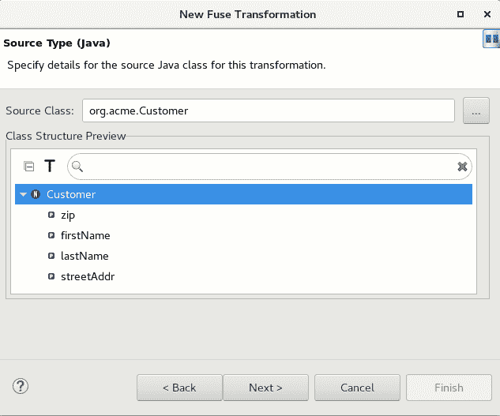

    然后选择 Schema account.json 文件：

    **图 7\. 选择 Schema**

    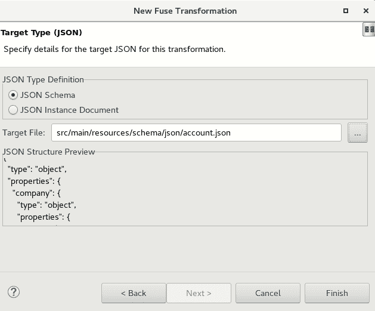

    最后点击 **完成** ，生成 transformation.xml。

4.  手工添加映射规则（两个 Java 类对象的映射）来配置生成的 transformation.xml。映射规则添加后，效果如下：

    **图 8\. Mapping 规则配置完毕**

    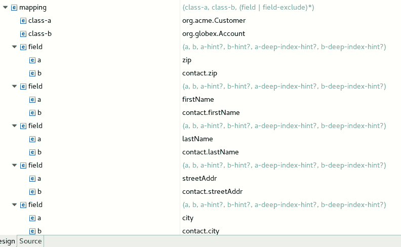

配置后的 transformation.xml 的源码如下：

**清单 6\. transformation.xml 内容**

```
<mapping>
        <class-a>org.acme.Customer</class-a>
        <class-b>org.globex.Account</class-b>
        <field>
            <a>zip</a>
            <b>contact.zip</b>
        </field>
        <field>
            <a>firstName</a>
            <b>contact.firstName</b>
        </field>
        <field>
            <a>lastName</a>
            <b>contact.lastName</b>
        </field>
        <field>
            <a>streetAddr</a>
            <b>contact.streetAddr</b>
        </field>
        <field>
            <a>city</a>
            <b>contact.city</b>
       </field>
        <field>
            <a>phone</a>
            <b>contact.phone</b>
        </field>
        <field>
            <a>state</a>
           <b>contact.state</b>
        </field> 
```

### 创建路由

接下来，创建 Camel XML File 文件，书写路由配置：

**图 9\. 新建 Camel XML File**

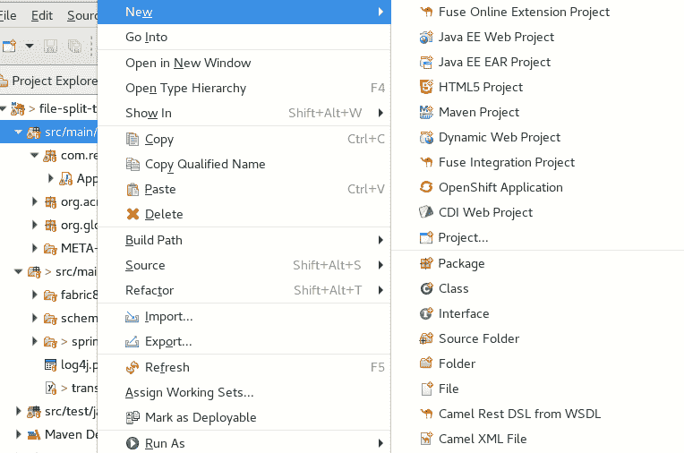

选择文件名和运行架构：

**图 10\. 选择 Spring 运行架构**

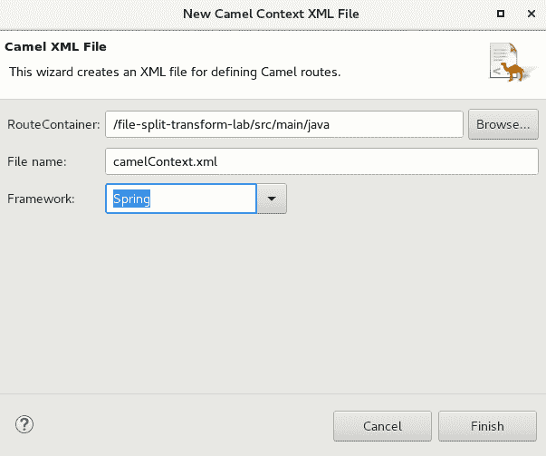

然后书写路由配置，我们通过拖拽的方式或者直接修改 XML 方式均可。书写完毕后生成的效果：

**图 11\. Camel 路由规则**

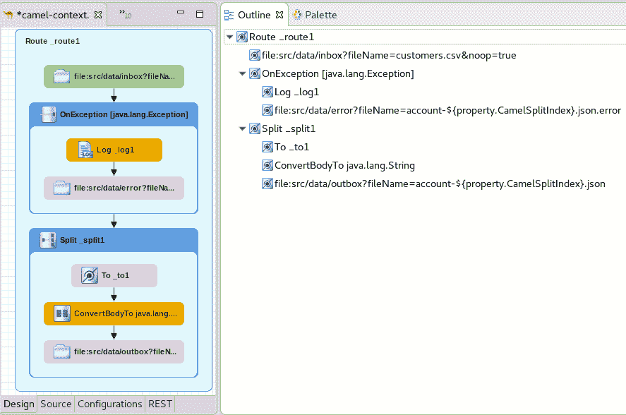

查看源代码：

**清单 7\. 路由源码**

```
fabric8/route.properties
 <propertyPlaceholder id="properties" location="fabric8/route.properties"/>
        <endpoint id="csv2json" uri="dozer:csv2json?sourceModel=org.acme.Customer&targetModel=org.globex.Account&marshalId=json&unmarshalId=csv&mappingFile=transformation.xml"/>
        <dataFormats>
            <bindy classType="org.acme.Customer" id="csv" type="Csv"/>
            <json id="json" library="Jackson"/>
        </dataFormats>
        <route id="_route1">
            <from id="_from1" uri="file:src/data/inbox?fileName=customers.csv&noop=true"/>
            <onException id="_onException1">
                <exception>java.lang.Exception</exception>
                <handled>
                    <constant>true</constant>
                </handled>
                <log id="_log1" loggingLevel="ERROR" message="error-msg: ${exception.message}"/>
                <to id="_to3" uri="file:src/data/error?fileName=account-${property.CamelSplitIndex}.json.error"/>
            </onException>
            <split id="_split1">
                <tokenize token="\n"/>
                <to id="_to1" ref="csv2json"/>
                <convertBodyTo id="_convertBodyTo1" type="java.lang.String"/>
                <to id="_to2" uri="file:src/data/outbox?fileName=account-${property.CamelSplitIndex}.json"/>
            </split>
        </route>
    </camelContext>
</beans> 
```

### 路由代码分析

下面，我们对路由的源代码进行分析。

**第一部分代码** （清单 7 中第 1-2 行）的作用是指定运行的路由时的参数配置文件为 route.properties。查看参数配置文件 route.properties，文件定义了输入和输出的位置。

```
fileInput=src/data/inbox
fileOutput=src/data/outbox
fileError=src/data/error 
```

**第二部分代码** （清单 7 中第 3-7 行）定义了 Dozer 的配置。其中 `sourceModel` 和 `targetModel` 是两个 Java 类： `Customer.java` 和 `Account.java` 。 `Customer.java` 是拆分后、格式正确的报文进行反序列化操作，按照一定数据转换为 Java 对象。 `Account.java` 将 `Customer.java` 反序列化后的对象进行数据转换，转化时，参照 transformation.xml 中定制的规则。数据转换完毕后的 Java 对象，被进行序列化操作，以 JSON 格式存储到文件中。

我们在代码中还为 DataFormat 定义了一下两个 ID：

*   csv：指定了 bindyType 为 csv，也就是将被拆分后的、且格式正确 .csv 源文件内容报文反序列化成 Java 对象。
*   json：指定了 JSONLibrary 为 Jackson。Jackon 是 Java 的标准 JSON 库，它将完成格式转换后的 Java 对象序列化成 JSON 格式。

**第三部分代码** （清单 7 中第 8-26 行）正式进入路由部分。读取源文件 customers.csv 内容，以换行符为单元进行拆分（`<tokenize token="\n"/` ）。由于 customers.csv 源文件有四行内容，因此 customers.csv 会处理四次。

*   如果被拆分的报文格式错误，则将内容传递到 account-${property.CamelSplitIndex}.json.error 文件, 并且触发系统 messages 日志 error 告警。

*   如果被拆分的报文格式正确，则调用 csv2json endpoint（第二部分代码）。对被拆分后的报文进行反序列化、格式转换、序列化，最终以 JSON 格式保存到 account-${property.CamelSplitIndex}.json 文件中。

综上所述，Route1 Camel 路由实现的功能有：

1.  Route1 读取 A 系统生成的源文件 customers.csv，然后调用 Splitter（EIP）对报文（customers.csv）进行拆分。拆分的标志是换行符。因为 customers.csv 是四行，所以会被处理四次。每次生成包含一行内容的报文。
2.  customers.csv 中前三行由于格式正确。因此前三次处理，会调用代码中定义的 csv2json endpoint，也就是 Dozer。Dozer 先对被拆分的报文进行反序列化，从 CSV 转化为 Java 对象，然后按照 tranfermation.xml 中定义的规则进行转换。具体而言，Dozer 会调用第一个 Java 类 Customer.java 中的 CsvRecord 方法，将被 Splitter 拆分后的内容映射到 Java 对象的内存中。然后，调用第二个 Java 类 Account.java 按照 tranformation.xml 的映射规则，对 Java 对象中的对象进行格式转换、进行序列化操作，以 JSON 的形式储存到文件中。
3.  customers.csv 中第四行由于格式不正确，不会调用 Dozer，而是直接保存到另一个文件中（.json.error），并且触发系统错误日志产生。

### 执行路由

以 Spring Boot 方式运行 Camel。Spring Boot Application.java（代码如清单 8 所示）的作用就是运行 CamelContext.xml。

**清单 8\. Application.java**

```
import org.springframework.boot.SpringApplication;
import org.springframework.boot.autoconfigure.SpringBootApplication;
import org.springframework.boot.web.servlet.ServletRegistrationBean;
import org.springframework.context.annotation.Bean;
import org.springframework.context.annotation.ImportResource;
@SpringBootApplication
// load regular Spring XML file from the classpath that contains the Camel XML DSL
@ImportResource({"classpath:spring/camel-context.xml"})
public class Application {

    /**
     * A main method to start this application.
     */
    public static void main(String[] args) {
        SpringApplication.run(Application.class, args);
    }
} 
```

运行路由：

**图 12\. 运行路由**

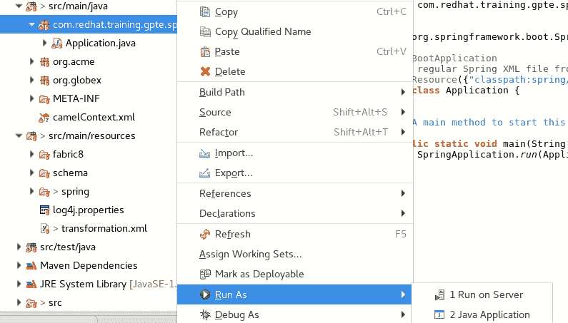

选择运行刚路由配置 camelContext.xml 文件。开始运行后，Sring Boot 会先加载，接下来日志中提示路由配置已经被加载：

**清单 9\. 路由 xml 文件加载日志**

```
[           main] o.a.camel.spring.SpringCamelContext      : Route: _route1 started and consuming from: file://src/data/inbox?fileName=customers.csv&noop=true
[           main] o.a.camel.spring.SpringCamelContext      : Total 1 routes, of which 1 are started
[           main] o.a.camel.spring.SpringCamelContext      : Apache Camel 2.21.0.fuse-720050-redhat-00001 (CamelContext: _camelContext1) started in 0.839 seconds
[           main] b.c.e.u.UndertowEmbeddedServletContainer : Undertow started on port(s) 8080 (http)
[           main] c.r.t.gpte.springboot.Application        : Started Application in 12.442 seconds (JVM running for 13.211)
[/src/data/inbox] o.a.c.c.jackson.JacksonDataFormat        : Found single ObjectMapper in Registry to use: com.fasterxml.jackson.databind.ObjectMapper@72543547 
```

路由运行完毕后，在对应的目录中，生成文件：

**图 13\. 查看生成文件**


customers.csv 就是初始文件，其内容如下。我们可以直观地看到，文件中前 3 行的格式是正确的，第 4 行的合适是错误的。

**清单 10\. customers.csv 内容**

```
 Rotobots,NA,true,Bill,Smith,100 N Park Ave.,Phoenix,AZ,85017,602-555-1100
BikesBikesBikes,NA,true,George,Jungle,1101 Smith St.,Raleigh,NC,27519,919-555-0800
CloudyCloud,EU,true,Fred,Quicksand,202 Barney Blvd.,Rock City,MI,19728,313-555-1234
ErrorError,,,EU,true,Fred,Quicksand,202 Barney Blvd.,Rock City,MI,19728,313-555-1234 
```

三个被拆分的文件的内容分别是：

**清单 11\. account-0.json**

```
{"company":{"name":"Rotobots","geo":"NA","active":true},"contact":{"firstName":"Bill","las
tName":"Smith","streetAddr":"100 N Park
Ave.","city":"Phoenix","state":"AZ","zip":"85017","phone":"602-555-1100"}} 
```

**清单 12\. account-1.json**

```
{"company":{"name":"BikesBikesBikes","geo":"NA","active":true},"contact":{"firstName":"Geor
ge","lastName":"Jungle","streetAddr":"1101 Smith
St.","city":"Raleigh","state":"NC","zip":"27519","phone":"919-555-0800"}} 
```

**清单 13\. account-2.json**

```
{"company":{"name":"CloudyCloud","geo":"EU","active":true},"contact":{"firstName":"Fred","
lastName":"Quicksand","streetAddr":"202 Barney Blvd.","
city":"Rock City","state":"MI","zip":"19728","phone":"313-555-1234"}} 
```

我们再查看 error 文件的内容：

`ErrorError,,,EU,true,Fred,Quicksand,202 Barney Blvd.,Rock City,MI,19728,313-555-1234`

至此，场景 1 业务集成需求已经实现。

## 场景 2：通过 Camel 实现从 Rest API 到消息队列的集成

在场景 1 中，客户的需求是将 A 系统生成的 customers.csv 进行拆分，然后进行数据转换、以 JSON 格式存储文件，以便 B 系统读取。在场景 2 中，客户的需求发生了变化。路由需要能够响应客户端以 Rest 方式发送过来消息进行处理。格式正确的记录，被发送到 accountQueue；格式错误的记录，被发送到 errorQueue。如图 18 所示:

**图 14\. 场景 2 路由流程图**


Camel 提供 REST 风格的 DSL，可以与 Java 或 XML 一起使用。目的是允许最终用户使用带有动词的 REST 样式定义 REST 服务，例如 GET、POST、DELETE 等。针对本场景的需求，我们将使用 [camel-servlet](http://camel.apache.org/servlet.html) ，消息队列使用 activemq。

### 创建路由

由于场景 2 是建立在场景 1 基础上进行的完善，因此场景 1 中已经介绍的步骤不再赘述。

创建路由及效果展示如下：

**图 15\. 查看路由**

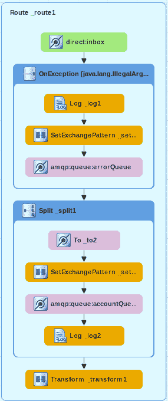

查看路由源码，我们将分析不同与场景 1 中逻辑不相同部分。

**清单 14\. 路由源码（部分内容）**

```
uri="dozer:csv2json2?sourceModel=org.acme.Customer&targetModel=org.globex.Account&marshalId=json&unmarshalId=csv&mappingFile=transformation.xml"/>

        < dataFormats>
            < bindy classType="org.acme.Customer" id="csv" type="Csv"/>
            < json id="json" library="Jackson"/>
        < /dataFormats>
        < restConfiguration bindingMode="off" component="servlet" contextPath="/rest"/>
        < rest apiDocs="true"
            id="rest-130579d7-1c1b-409c-a496-32d6feb03006" path="/service">
            < post id="32d64e54-9ae4-42d3-b175-9cfd81733379" uri="/customers">
                < to uri="direct:inbox"/>
            < /post>
        < /rest>
        < route id="_route1" streamCache="true">

            < from id="_from1" uri="direct:inbox"/>
            < onException id="_onException1">
               < exception>java.lang.IllegalArgumentException< /exception>
                < handled>
                    < constant>true< /constant>
                < /handled>
                < log id="_log1" message=">> Exception : ${body}"/>
                < setExchangePattern id="_setExchangePattern1" pattern="InOnly"/>
                < to id="_to1" uri="amqp:queue:errorQueue"/>
            < /onException>
            < split id="_split1">
                < tokenize token=";"/>
               < to id="_to2" ref="csv2json"/>
                < setExchangePattern id="_setExchangePattern2" pattern="InOnly"/>
                < to id="_to3" uri="amqp:queue:accountQueue"/>
                < log id="_log2" message=">> Completed JSON: ${body}"/>
            < /split>
            < transform id="_transform1">
                < constant>Processed the customer,david< /constant>
            < /transform>
        < /route>
    < /camelContext>
< /beans> 
```

### 路由代码分析

**第一部分代码** （清单 18 中第 7-13 行）定义了基于 Spring Boot 的 Camel 路由运行以后，/rest/service/customers 将会对外暴露。客户端这个端点发送消息。而 rest/service/customers 收到消息后，将会被转到 direct:inbox。

**第二部分源码** （清单 18 中第 14-38 行）是路由的主体部分。下面先介绍代码中的主要参数，然后再整体介绍代码逻辑。

*   `streamCache="true"：Servlet` 提供基于 HTTP 的端点，用于使用 HTTP 请求。Servlet 是基于 stream 的，也就是说，消息只能被读一次。为了避免这种情况，就需要启动 streamCache。即将消息在内存中进行缓存。

*   `Exchange` ：在 Camel 中，Exchange 是一个容器。在 Camel 的整个路由中, 在 Consumer 收消息之前，Exchange 这个容器会保存消息。

*   `pattern="InOnly`**:** ExchangePattern 类型 InOnly。

消息的类型如单向的 Event Message（模式见图 16），其 ExchangePattern 默认设置为 InOnly。如果是 Request Reply Message（模式见图 17）类型的消息，其 ExchangePattern 设置为 InOut。

**图 16\. Event Message**


**图 17\. Request Reply Message**


综上所述，整体代码的逻辑是：

1.  Camel 路由运行在 Spring Boot 上，rest/service/customers 作为 Rest API Endpoint 对外提供服务。
2.  我们通过 HTTP POST 方法向 rest/service/customers API 发送信息，一共 4 行，用分号隔开。
3.  rest/service/customers 读取到信息后，转到 direct:inbox。
4.  Camel 路由读取信息后，以分号为分隔符进行拆分。
5.  格式正确的信息，将会被进行数据转换（方法与场景 1 相同），生成 JSON 格式的内容后，设置 exchange InOnly，发送到 accountQueue；格式错误的信息，设置 Exchange InOnly，被发送到 errorQueue。
6.  路由执行完毕后，前台提示 `Processed the customer data,david!`

### 执行路由

在环境中，先部署并启动 AMQ:

**图 18\. 启动 AMQ**


AMQ 启动成功后，将路由配置打包并安装到本地仓库：

**图 19\. 本地安装**


打包成功后，通过 Spring Boot 本地运行 Camel：

**图 20\. 通过 Spring Boot 运行 Camel**

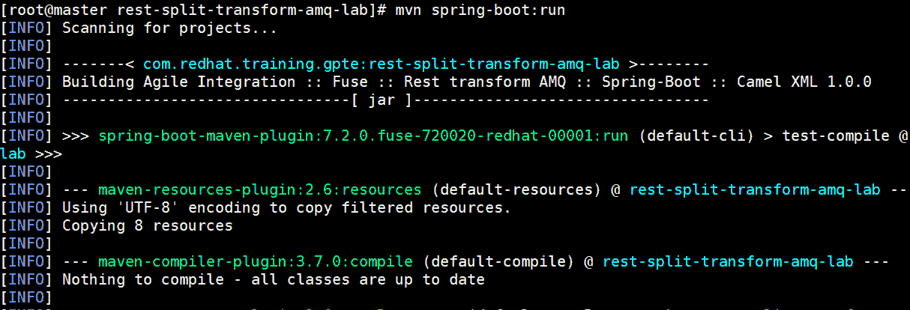

命令会在本地运行加载 Spring Boot：

**图 21\. 本地启动 Spring Boot**


我们关注关键的日志，在下面的日志中，路由配置文件被加载：

**清单 15\. 路由加载日志**

```
23:48:29.321 [main] INFO  org.dozer.DozerBeanMapper - Using URL [file:/root/ai_advanced_labs/agile_integration_advanced_labs/code/fuse/02_rest_split_transform_amq/rest-split-transform-amq-lab/target/classes/transformation.xml] to load custom xml mappings
23:48:29.477 [main] INFO  org.dozer.DozerBeanMapper - Successfully loaded custom xml mappings from URL: [file:/root/ai_advanced_labs/agile_integration_advanced_labs/code/fuse/02_rest_split_transform_amq/rest-split-transform-amq-lab/target/classes/transformation.xml]
23:48:29.736 [main] INFO  o.a.camel.spring.SpringCamelContext - Route: _route1 started and consuming from: direct://inbox
23:48:29.740 [main] INFO  o.a.camel.spring.SpringCamelContext - Route: 32d64e54-9ae4-42d3-b175-9cfd81733379 started and consuming from: servlet:/service/customers?httpMethodRestrict=POST
23:48:29.743 [main] INFO  o.a.camel.spring.SpringCamelContext - Total 2 routes, of which 2 are started
23:48:29.744 [main] INFO  o.a.camel.spring.SpringCamelContext - Apache Camel 2.21.0.fuse-720050-redhat-00001 (CamelContext: MyCamel) started in 1.914 seconds
23:48:29.859 [main] INFO  o.s.b.c.e.u.UndertowEmbeddedServletContainer - Undertow started on port(s) 8081 (http)
23:48:29.868 [main] INFO  o.s.c.s.DefaultLifecycleProcessor - Starting beans in phase 0
23:48:29.883 [main] INFO  o.s.b.a.e.jmx.EndpointMBeanExporter - Located managed bean 'healthEndpoint': registering with JMX server as MBean [org.springframework.boot:type=Endpoint,name=healthEndpoint]
23:48:29.966 [main] INFO  o.s.b.c.e.u.UndertowEmbeddedServletContainer - Undertow started on port(s) 8080 (http)
23:48:29.972 [main] INFO  c.r.t.gpte.springboot.Application - Started Application in 16.088 seconds (JVM running for 23.041) 
```

接下来，在客户端通过 curl 对 Rest API 发送信息。

**图 22\. 通过 curl 对 Rest API 发送信息**


查看路由运行日志，显示了 Rest API 接受的信息，并进行了拆分：

**清单 16\. 路由运行日志**

```
23:53:37.044 [AmqpProvider :(1):[amqp://localhost:5672]] INFO  org.apache.qpid.jms.JmsConnection - Connection ID:b4938c3e-2007-                           4993-93c4-cc5721ea77c5:1 connected to remote Broker: amqp://localhost:5672
23:53:37.180 [XNIO-3 task-1] INFO  _route1 - >> Completed JSON: {"company":{"name":"Rotobots","geo":"NA","active":true},"contac                           t":{"firstName":"Bill","lastName":"Smith","streetAddr":"100 N Park Ave.","city":"Phoenix","state":"AZ","zip":"85017","phone":"6                           02-555-1100"}}
23:53:37.189 [XNIO-3 task-1] INFO  _route1 - >> Completed JSON: {"company":{"name":"BikesBikesBikes","geo":"NA","active":true},                           "contact":{"firstName":"George","lastName":"Jungle","streetAddr":"1101 Smith St.","city":"Raleigh","state":"NC","zip":"27519","                           phone":"919-555-0800"}}
23:53:37.197 [XNIO-3 task-1] INFO  _route1 - >> Completed JSON: {"company":{"name":"CloudyCloud","geo":"EU","active":true},"con                           tact":{"firstName":"Fred","lastName":"Quicksand","streetAddr":"202 Barney Blvd.","city":"Rock City","state":"MI","zip":"19728",                           "phone":"313-555-1234"}}
23:53:37.203 [XNIO-3 task-1] INFO  _route1 - >> Exception : ErrorError,,,EU,true,Fred,Quicksand,202 Barney Blvd.,Rock City,MI,1                           9728,313-555-1234 
```

查看 accountQueue，有三条消息。这三条信息就是三条格式正确的客户信息：

**图 23\. 查看 accountQueue**


查看 errorQueue，有一条消息。这是格式错误的客户信息：

**图 24\. 查看 errorQueue**

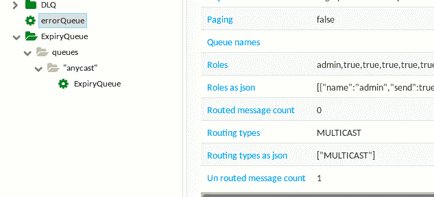

接下来，我们通过 Fabric8，将 Camel 部署到 Kubernetes 集群中。

**图 25\. 部署到 Kubernetes 集群**


部署成功后查看 pod, 第一个是提前部署好的 AMQ pod；第二个是运行 Camel 的 pod。

**图 26\. 查看 pod**


查看 Camel pod 的日志，其中显示 Spring Boot 启动成功：

**图 27\. 查看 Camel 所在 pod 运行日志**


查看 AMQ pod 运行日志：

**图 28\. 查看 AMQ Pod 运行日志**


接下来，在客户端通过 curl，对 Camel pod 的路由发送信息：

**图 29\. 通过 curl 向 Rest API 发送信息**


查看 accountQueue 和 errorQueue，消息的数量和在本地运行路由是一样的，符合我们的预期：

**图 30\. 查看 accountQueue**

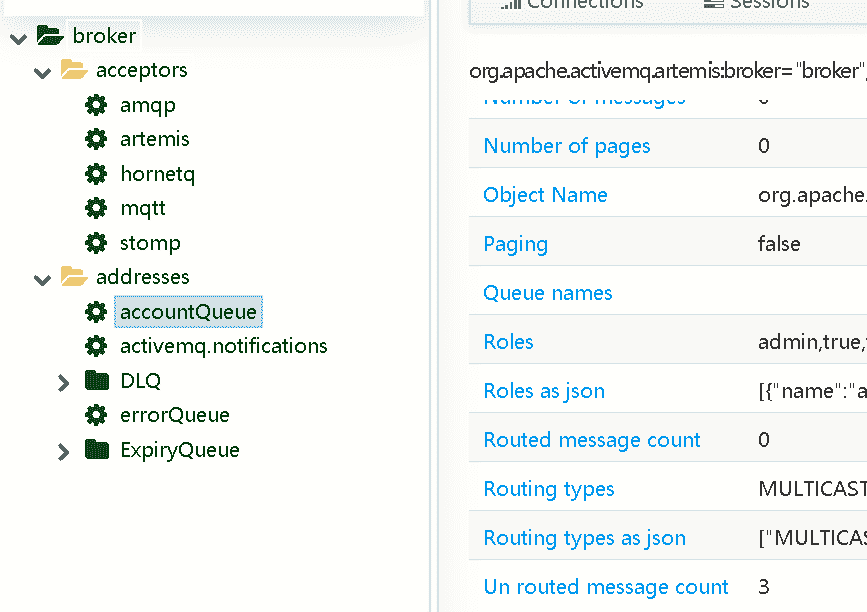

**图 31\. 查看 accountQueue**


## 场景 3：通过 Camel 实现从 Rest API 到数据库的集成

在实现了场景 1 和场景 2 的集成需求后，该公司提出了新的要求：将源文件中格式错误的客户信息，保存到一个数据库中，以便其合作伙伴的应用读取，对格式错误的信息进行修正，修正完毕后，将内容发送到消息队列。根据该公司的需求，设计路由流程图如下：

**图 32\. 场景 3 路由流程图**

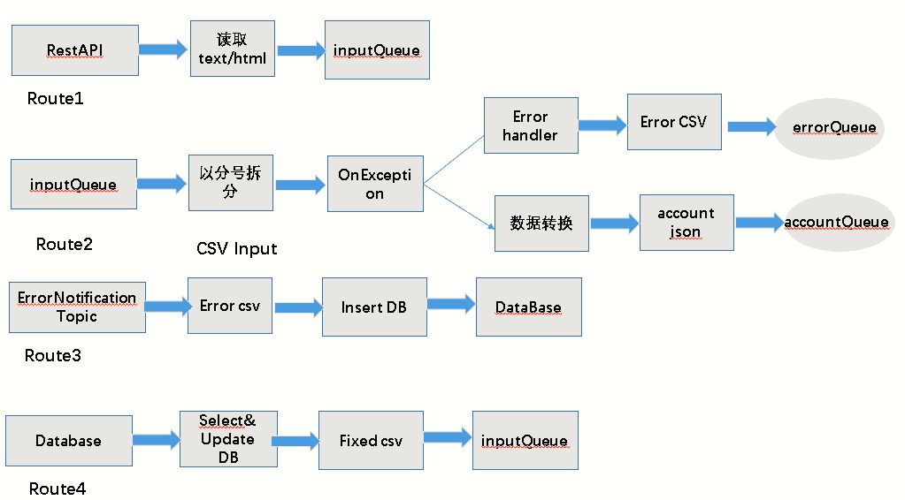

在上图中，一共有四条路由。

*   Route1 实现了读取客户端发过来的 Rest 消息，放到 inputQueue 中。
*   Route2 实现了从 inputQueue 读取信息，以分号进行拆分，如果格式正确，进行数据转换，发送到 accountQueue 中；如果格式错误，发送到 errorQueue 中。
*   Route3 配置了 ErrorNotification Topic，实现了将 errorQueue 中的信息 insert 到一个数据库中。
*   Route4 实现了从数据库读取信息，然后进行修正，修正完毕后，发送到 inputQueue 中。

### 创建路由

根据需求，创建路由如下：

**图 33\. 场景 3 路由**


由于很多代码逻辑我们在场景 1、2 和前文已经做了介绍，因此不再赘述。

路由配置好以后，先本地打包并部署：

**图 34\. 本地打包部署**


打包成功后，本地运行：

**图 35\. 本地通过 Spring Boot 运行**

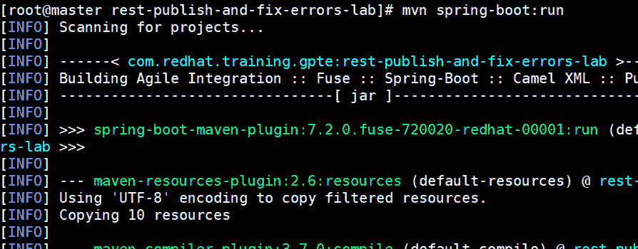

Spring Boot 启动成功后，把路由部署到 Kubernetes 集群上进行验证：

**图 36\. 部署到 Kubernetes 集群上**

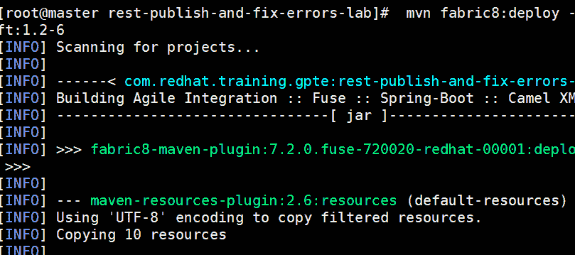

Kubernetes 集群中有事先部署好的 AMQ 和 Postgres pod，以及刚部署好的运行 Camel pod。

**图 37\. 查看 Kubernetes 集群 pod**


在客户端，通过 curl 向 Rest API 发送信息：

**图 38\. 通过 curl 向 Rest API 发送信息**


发送完毕以后，此时 accountQueue 的 messages count 是 3。这是因为客户端发送的消息中，三个客户信息格式是正确的（用分号拆分）。第一个客户信息格式是错误的。而只有格式正确的三个客户信息，才会被转到 accountQueue。

**图 39\. accountQueue 中 Message 数量为 3**

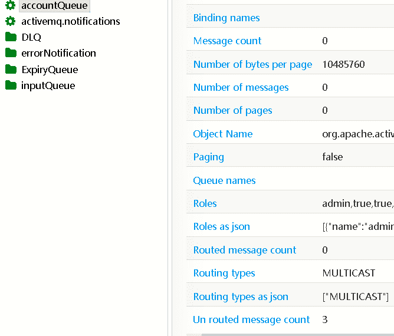

查看 Postgres 数据中中是否记录了格式错误的那一条信息：

**图 40\. 查看 Postgres 格式错误记录**


而在此前，Postgres 中的记录是空的。

接下来，手工修改数据库中的记录（模拟被合作伙伴应用修复），让它的格式正确，并且将记录的状态修正为 FIXED。

**图 41\. 手工修改数据库中格式错误的记录**


然后，再度查询 accountQueue 中的 message 数量，从 3 增加到 4：

**图 42\. accountQueue 中 Message 数量从 3 增加到 4**


说明格式修正后的记录被发送到 inputQueue 以后，最终被发送到 accountQueue（route2）。

至此，场景 3 中的需求已经被满足。

## 结束语

通过本文，相信您对 Camel 的应用场景有了一些了解。随着微服务、云计算的普及，Camel 与 Kubernetes 结合愈发紧密，分布式集成也必然会有更多的用武之地。