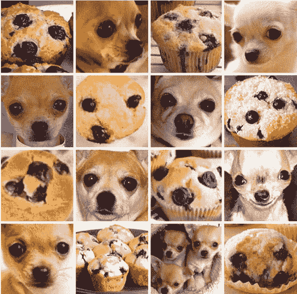

# 使用 TensorFlow 和 Keras 进行图像识别

> 原文：[`developer.ibm.com/zh/articles/image-recognition-challenge-with-tensorflow-and-keras-pt1/`](https://developer.ibm.com/zh/articles/image-recognition-challenge-with-tensorflow-and-keras-pt1/)

由于 [AlexNet](http://papers.nips.cc/paper/4824-imagenet-classification-with-deep-convolutional-neural-networks)、[VGG](https://arxiv.org/abs/1409.1556)、[GoogleNet](https://arxiv.org/abs/1409.4842) 和 [ResNet](https://arxiv.org/abs/1512.03385) 等方面的研究取得了突破性进展，深度神经网络和深度学习在过去几年里日渐盛行。2015 年，通过利用 ResNet，大规模图像识别的准确性得到显著提升，这促进了深度神经网络的进一步普及。

本文讨论了如何使用基本的深度神经网络来解决图像识别问题。这里着重关注整体技术和库的使用，而不是完善模型。[第 2 部分](https://www.ibm.com/developerworks/cn/cognitive/library/image-recognition-challenge-with-tensorflow-and-keras-pt2/index.html)解释了如何改进结果。

我想使用深度神经网络解决除 “hello world” 版本图像识别（例如，MNIST 手写字母识别）之外的其他问题。在完成 TensorFlow 和 Keras 库的第一个教程之后，我开始挑战分类问题：在一组类似的图像中，识别给定的图像是吉娃娃狗（狗的品种）还是玛芬蛋糕。

本文中包含的数据集是通过组合此[来源](https://github.com/ieee8023/deep-learning-datasets/tree/master/chihuahua-muffin)、搜索互联网并应用一些基本的图像处理技术而形成的。此数据集中的图像是根据 [Creative Commons 公平使用政策](https://guides.library.stonybrook.edu/copyright)收集、使用和提供的。预期用途是使用 TensorFlow 和 Keras 库（使用人工神经网络进行图像识别的科学研究）。此解决方案采用 [`www.tensorflow.org/tutorials/keras/basic_classification`](https://www.tensorflow.org/tutorials/keras/basic_classification) 中提供的技术。

基本上，本文没有什么先决条件，但如果您想要执行代码，那么掌握 Python 和 `numpy` 的基础知识并浏览 eTensorFlow 和 Keras 库会很有帮助。



## 导入数据

### 克隆 Git 存储库

```
$ git clone https://github.com/ScrapCodes/image-recognition-tensorflow.git
$ cd image-recognition-tensorflow
$ python
>>> 
```

### 导入 TensorFlow、Keras 和其他助手库

我使用 TensorFlow 和 Keras 运行机器学习，使用 Pillow Python 库进行图像处理。

通过使用 pip，可以如下所示将这些项安装在 macOS 上：

```
sudo pip install tensorflow matplotlib pillow 
```

*注意：是否需要使用 sudo 取决于如何在系统上安装 Python 和 pip。配置了虚拟环境的系统可能不需要 sudo。*

导入 Python 库。

```
# TensorFlow and tf.keras
import tensorflow as tf
from tensorflow import keras

# Helper libraries
import numpy as np
import matplotlib.pyplot as plt
import glob, os
import re

# Pillow
import PIL
from PIL import Image 
```

### 加载数据

用于预处理输入图像的 Python 函数。要将图像转换为 `numpy` 数组，它们必须具有相同的尺寸：

```
# Use Pillow library to convert an input jpeg to a 8 bit grey scale image array for processing.
def jpeg_to_8_bit_greyscale(path, maxsize):
        img = Image.open(path).convert('L')   # convert image to 8-bit grayscale
        # Make aspect ratio as 1:1, by applying image crop.
    # Please note, croping works for this data set, but in general one
    # needs to locate the subject and then crop or scale accordingly.
        WIDTH, HEIGHT = img.size
        if WIDTH != HEIGHT:
                m_min_d = min(WIDTH, HEIGHT)
                img = img.crop((0, 0, m_min_d, m_min_d))
        # Scale the image to the requested maxsize by Anti-alias sampling.
        img.thumbnail(maxsize, PIL.Image.ANTIALIAS)
        return np.asarray(img) 
```

用于将数据集从图像加载到 `numpy` 数组中的 Python 函数：

```
def load_image_dataset(path_dir, maxsize):
        images = []
        labels = []
        os.chdir(path_dir)
        for file in glob.glob("*.jpg"):
                img = jpeg_to_8_bit_greyscale(file, maxsize)
                if re.match('chihuahua.*', file):
                        images.append(img)
                        labels.append(0)
                elif re.match('muffin.*', file):
                        images.append(img)
                        labels.append(1)
        return (np.asarray(images), np.asarray(labels)) 
```

我们应该将图像缩放到比实际图像分辨率小的标准尺寸。这些图像超过了 170×170，因此我们将它们全部缩小到 100×100 以进一步处理：

```
maxsize = 100, 100 
```

要加载数据，可执行以下函数并加载训练和测试数据集：

```
(train_images, train_labels) = load_image_dataset('/Users/yourself/image-recognition-tensorflow/chihuahua-muffin', maxsize)

(test_images, test_labels) = load_image_dataset('/Users/yourself/image-recognition-tensorflow/chihuahua-muffin/test_set', maxsize) 
```

*   train_images 和 train_lables 是训练数据集。
*   test_images 和 test_labels 是测试数据集，用于根据看不见的数据验证模型的性能。

最后，我们定义数据集的类名。由于此数据只有两个类（图像可以是 Chihuahua 或 Muffin），因此我们具有的 `class_names` 如下所示：

```
class_names = ['chihuahua', 'muffin'] 
```

## 探索数据

在此数据集中，我们有 26 个吉娃娃和玛芬蛋糕图像的训练示例：

```
train_images.shape
(26, 100, 100) 
```

每个图像都有各自的标签 – `0` 或 `1`。`0` 表示 `class_names[0]`，即 `chihuahua`；`1` 表示 `class_names[1]`，即 `muffin`：

```
print(train_labels)
[0 0 0 0 1 1 1 1 1 0 1 0 0 1 1 0 0 1 1 0 1 1 0 1 0 0] 
```

对于测试集，我们有 14 个示例，每个类有 7 个示例：

```
test_images.shape
(14, 100, 100)
print(test_labels)
[0 0 0 0 0 0 0 1 1 1 1 1 1 1] 
```

### 可视化数据集

通过使用 `matplotlib.pyplot` Python 库，我们可以实现数据可视化。确保您已安装 matplotlib 库。

以下 Python 帮助函数可帮助我们在屏幕上绘制这些图像：

```
def display_images(images, labels):
        plt.figure(figsize=(10,10))
        grid_size = min(25, len(images))
        for i in range(grid_size):
                plt.subplot(5, 5, i+1)
                plt.xticks([])
                plt.yticks([])
                plt.grid(False)
                plt.imshow(images[i], cmap=plt.cm.binary)
                plt.xlabel(class_names[labels[i]]) 
```

如下所示使训练数据集可视化：

```
display_images(train_images, train_labels)
plt.show() 
```


**注意：加载时，在图像的预处理步骤中会对图像进行灰度设置和裁剪。**

同样，我们可以使测试数据集可视化。这里的训练和测试集都相当有限，您可以随意使用 Google 搜索并添加更多示例，查看如何改进或执行。

## 预处理数据

### 将图像缩放到 0 与 1 之间的值

```
train_images = train_images / 255.0
test_images = test_images / 255.0 
```

## 构建模型

### 设置层

我们总共使用了四层。第一层是简单地将数据集平铺到单个数组中，而不是进行训练。其他三层是密集层，使用 sigmoid 作为激活函数：

```
# Setting up the layers.

model = keras.Sequential([
    keras.layers.Flatten(input_shape=(100, 100)),
        keras.layers.Dense(128, activation=tf.nn.sigmoid),
        keras.layers.Dense(16, activation=tf.nn.sigmoid),
    keras.layers.Dense(2, activation=tf.nn.softmax)
]) 
```

### 编译模型

优化器是随机梯度下降 (SGD)：

```
sgd = keras.optimizers.SGD(lr=0.01, decay=1e-5, momentum=0.7, nesterov=True)

model.compile(optimizer=sgd,
              loss='sparse_categorical_crossentropy',
              metrics=['accuracy']) 
```

## 训练模型

```
model.fit(train_images, train_labels, epochs=100) 
```

将显示三个训练迭代：

```
....
Epoch 98/100
26/26 [==============================] - 0s 555us/step - loss: 0.3859 - acc: 0.9231
Epoch 99/100
26/26 [==============================] - 0s 646us/step - loss: 0.3834 - acc: 0.9231
Epoch 100/100
26/26 [==============================] - 0s 562us/step - loss: 0.3809 - acc: 0.9231
<tensorflow.python.keras.callbacks.History object at 0x11e6c9590> 
```

## 评估准确性

```
test_loss, test_acc = model.evaluate(test_images, test_labels)
print('Test accuracy:', test_acc) 
```

```
14/14 [==============================] - 0s 8ms/step
('Test accuracy:', 0.7142857313156128) 
```

测试准确性低于训练准确性。这表示模型已经过度拟合数据。可以采用一些技术克服这个问题，我们稍后会讨论这些内容。这个模型是一个良好的 API 使用示例，但远非完美。

借助图像识别技术最近取得的进步，通过使用更多的训练数据，我们可以在解决这一数据集挑战方面表现得更出色。

## 预测结果

为了预测结果，我们只需在生成的模型上调用 predict：

```
predictions = model.predict(test_images) 
```

```
print(predictions)

[[0.6080283  0.3919717 ]
 [0.5492342  0.4507658 ]
 [0.54102856 0.45897144]
 [0.6743213  0.3256787 ]
 [0.6058993  0.39410067]
 [0.472356   0.5276439 ]
 [0.7122982  0.28770176]
 [0.5260602  0.4739398 ]
 [0.6514299  0.3485701 ]
 [0.47610506 0.5238949 ]
 [0.5501717  0.4498284 ]
 [0.41266635 0.5873336 ]
 [0.18961382 0.8103862 ]
 [0.35493374 0.64506626]] 
```

最后，显示图像并查看模型在测试集上的执行情况：

```
display_images(test_images, np.argmax(predictions, axis = 1))
plt.show() 
```


## 结束语

在本文中，我们的结果中存在一些错误的分类，上图已标示出来。所以这远非完美。在[第 2 部分](https://www.ibm.com/developerworks/cn/cognitive/library/image-recognition-challenge-with-tensorflow-and-keras-pt2/index.html)中，我们将学习如何改进训练过程。

本文翻译自：[Image recognition with TensorFlow and Keras](https://developer.ibm.com/articles/image-recognition-challenge-with-tensorflow-and-keras-pt1/)（2019-02-19）