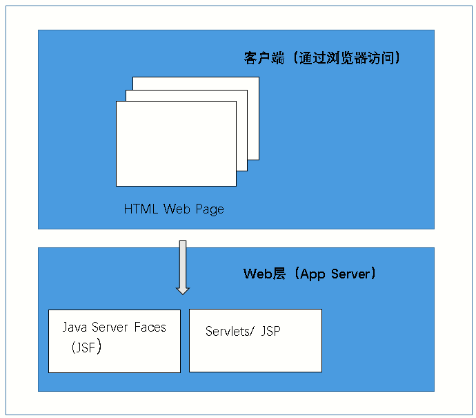
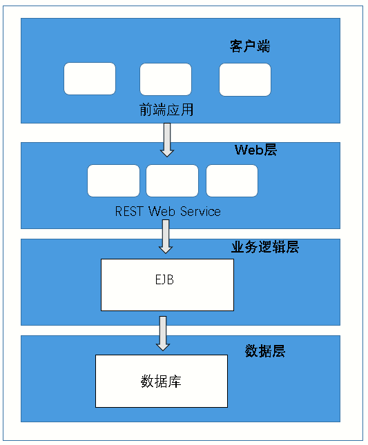
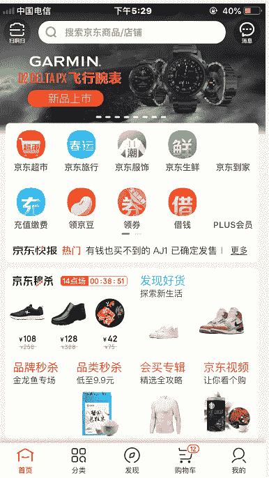
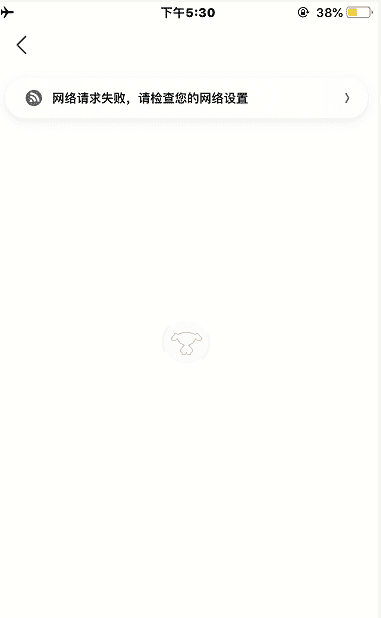
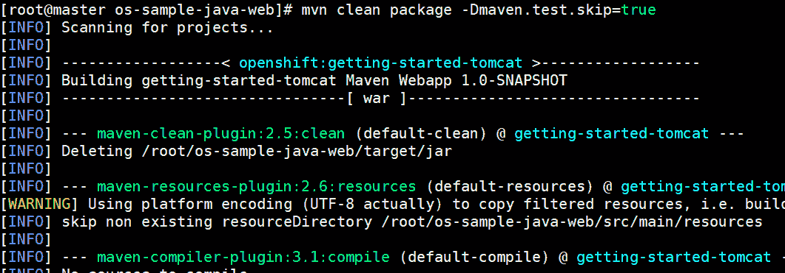
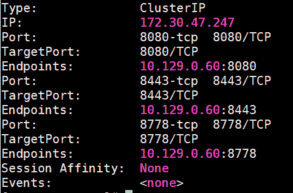
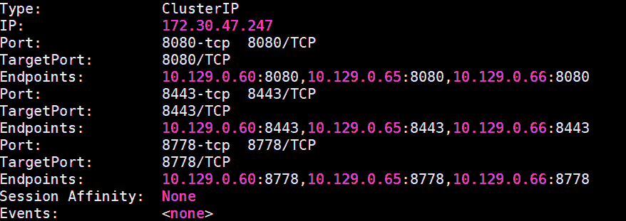

# 基于 Jakarta EE 的企业应用进阶之路

> 原文：[`developer.ibm.com/zh/articles/j-jakarta-ee-enterprise-application/`](https://developer.ibm.com/zh/articles/j-jakarta-ee-enterprise-application/)

## 概述

企业级应用 (企业应用)，主要指的是如金融、能源、制造等行业的重要生产应用，如 ERP、CRM 等。Jakarta EE (前身 Java EE) 是大量企业应用的标准，本文将结合实验，让您对以下内容有更深入的理解：

*   基于 Jakarta EE 的企业应用架构
*   基于 Web Services 构建企业应用
*   现代企业应用与 Kubernetes 的结合

## Jakarta EE 介绍

截至到目前，绝大多数企业应用都是基于 Jakarta EE 开发的。2018 年初，Eclipse 将 Java EE 更名为 Jakarta EE。Java EE 最新的版本是 8，也是 Jakarta EE 的初始版本。为了统一描述，本文均采用最新的 Jakarta EE 叫法。

### Jakarta EE 的优势

那么，对于企业应用而言，Jakarta EE 的优势是什么？主要有以下几点：

*   绝大多数应用服务器（Application Server）都遵循 Jakarta EE 标准，因此应用可以跨不同符合 Jakarta EE 标准应用程序服务器之间移植。
*   Jakarta EE 规范提供了大量通常由企业应用程序使用的 API，例如 Web 服务、异步消息传递、事务、数据库连接、线程池、批处理实用程序和安全性。这省去了应用开发者手动开发这些组件的时间。
*   金融、电信的行业的大量应用遵循 Jakarta EE 标准，可以与遵循 Jakarta EE 应用程序服务器集成。
*   围绕着 Jakarta EE 生态，有大量的工具：如集成开发环境（IDE）、监控系统、企业应用程序集成（EAI）框架和性能测量工具。

### Jakarta EE 的两个 Profile

为了适应不用类型的应用架构，Jakarta EE 有以下两个配置文件（profile），其中 Web profile 所纳管的 API 是 Full profile 的真子集：

*   Web profile：专为 Web 应用程序开发而设计，并支持由 Jakarta EE 相关的基于 Web 的技术定义的 API 的一部分。
*   Full profile：包含由 Jakarta EE 定义的所有 API（包括 Web profile 中的所有项目）。在开发 EJB、消息传递应用程序和 Web 服务时，应使用 Full profile。

### MicroProfile

IBM 使用 Liberty 作为 [IBM Cloud](https://cloud.ibm.com/registration?cm_sp=ibmdev-_-developer-articles-_-cloudreg) 平台的 Java 应用环境, 将 Liberty 对 MicroProfile 功能比如 Health Check、Metrics 和 Fault Tolerance 的支持与 IBM Cloud 平台的基础 Kubernetes 和 Istio 子系统进行了集成。

MicroProfile 则是 Jakarta EE 针对于微服务推出的配置文件。MicroProfile 规范是 Eclipse 基金会和几个主流 IT 厂商如 IBM、Redhat 一起推出的。这套规范可针对基于微服务的体系结构优化 Jakarta EE，并提供跨多个运行时的基于 MicroProfile 的应用程序的可移植性。

截至到 2018 年第四季度，MicroProfile 最新的版本是 2.1，基于 Java EE 8。MicroProfile 包含的功能组件有很多：例如 Config，OpenAPI 和 OpenTracing，您可以在 [microprofile.io 上](http://microprofile.io/) 找到相关介绍，本文不再赘述。

截至到目前，微服务市场各种架构势均力敌，还没有一种微服务架构占据绝对主导地位。但对于传统 Jakarta EE 应用而言，通过使用 MicroProfile 来实现微服务，其可操作性要高于其他微服务架构。

### 应用服务器

应用程序服务器（Application Server）是一个软件架构，它提供必要的运行时环境和基础结构来托管和管理 Jakarta EE 企业应用程序。应用程序服务器提供如并发性、分布式组件架构、多平台可移植性、事务管理、Web 服务、数据库对象关系映射（ORM）、异步消息传递以及企业应用程序安全性等功能。

应用服务器中的容器负责安全性、事务处理、JNDI 查找和远程连接等；容器还可以管理运行时服务，例如 EJB 和 Web 组件生命周期、数据源池、数据持久性和 JMS 消息传递。

Jakarta EE 应用程序服务器中有两种主要的容器类型：

*   Web 容器：部署和配置 Web 组件，例如 Servlets、JSP、JSF 和其他 Web 相关资产。
*   EJB 容器：部署和配置与 EJB，JPA 和 JMS 相关的组件。

目前主流的应用服务器如 IBM WebSphere Application Server 和 Red Hat JBoss Enterprise Application Platform 都支持 Jakarta EE 标准。

## 基于 Jakarta EE 的企业应用架构

Jakarta EE 应用程序在设计时考虑了多层体系结构。该应用程序被分割成组件，每个组件都服务于特定的目的并按逻辑排列在一个层中。某些层在单独的物理机器或服务器上运行。应用程序的业务逻辑可以在托管在一个数据中心中的应用程序服务器上运行，而数据库的实际数据可以存储在单独的服务器上。

使用分层体系结构的优势在于，随着应用程序扩展以处理越来越多的最终用户，每个层可以独立扩展以通过添加更多服务器（称为”扩展”）来处理增加的工作负载。另外还有一个额外的好处，即跨层的组件可以独立升级而不影响其他组件。

在经典的基于 Web 的 Jakarta EE 应用程序体系结构中，共有四个层级：

*   客户端层：在 PC 上，大多数客户端是浏览器；在移动智能手机上，较多的是 Native 和 Web APP 混合模式的应用（这点后面会详细介绍）。
*   Web 层：Web 层组件在 Application Server 内部运行，并生成可由客户端层中的组件呈现或使用的 HTML 或其他方式；Web 层还可以通过 SOAP 或具象状态传输 REST Web Services 等协议为非交互式客户端提供服务。
*   业务逻辑层：业务逻辑层中的组件包含应用程序的核心业务逻辑。这些通常是企业 Java Bean（EJB）、POJO、实体 Bean、消息驱动 Bean 和数据访问对象（DAO）的混合体，它们访问持久性存储系统（如 RDBMS，LDAP）。
*   企业信息系统（EIS）层：许多企业应用程序存储和处理组织内多个系统和应用程序使用的持久性数据。例如关系数据库管理系统（RDBMS）、轻量级目录访问协议（LDAP）目录服务、NoSQL 数据库等后端系统。

接下来，我们分别看一下常见的三类企业应用架构：

### 第一类：以 Web 为中心的架构

这种架构（如图 1 所示）适用于基于浏览器的前端和由 Servlets、Java Server Pages（JSP）或 Java Server Faces（JSF）提供支持的简单后端的简单应用程序。不使用诸如事务、异步消息传递和数据库访问等功能。

##### 图 1\. 以 Web 为中心的架构

### 第二类：经典三层架构应用

在此体系结构（如图 2 所示）中，客户端层中的浏览器与由 Servlet、JSP 或 JSF 页面组成的 Web 层进行交互，负责呈现用户界面、控制页面流和安全性。核心业务逻辑托管在独立的业务逻辑层中，该层具有 Jakarta EE 组件，如 EJB、实体 Bean（JPA）和消息驱动 Bean（Message Driven Beans，MDB）。 业务逻辑层组件与企业信息系统集成，例如关系数据库和后台应用程序，这些应用程序公开用于管理持久数据的 API，并为应用程序提供事务性功能。

##### 图 2\. 经典三层架构应用

由于大多数应用服务器都集成 Web Server，因此在上图的这种架构中 Web 层和业务层都运行在应用服务器上。

### 第三类：Web Services 应用架构

现代应用程序体系结构通常设计为基于 Web 服务。 在此体系结构（如图 3 所示）中，应用程序提供了一个 API，可通过基于 HTTP 的协议（如 SOAP 或 REST）通过与应用程序的业务功能对应的一组服务（端点）进行访问。 这些服务由非交互式应用程序（可以是内部或第三方）或交互式 HTML/JavaScript 前端使用，如使用 AngularJS、Backbone.js、React 等框架。

##### 图 3\. Web Services 应用架构

现代应用主要是 Web Services 应用。接下来的章节，我将详细介绍 Web Services 和它的实现方式。

## 基于 Web Services 构建企业应用

### Web Services 简介

近年来，基于 Web Services 构建的企业应用程序越来越受欢迎，主要有以下几个原因:

*   应用程序需要支持多种终端设备，如桌面和移动设备。在桌面终端，有 Windows、MacOS 和 Linux 的系统；在移动设备中，有 pad、手机等；手机又有不同的系统，如 iOS、安卓。由于终端系统种类繁多，要求应用以 Web 这种统一的方式进行访问。
*   市场竞争的现状，要求开发部门缩短开发时间以支持各种应用程序。通过抽象出特定于设备的表示层，数据层成为服务层。这种分离允许开发团队在各种平台上快速开发应用程序，同时重用使用 Web Services 构建的共享后端。

Web Services 通过 HTTP 将标准的通讯方式暴露出来，来实现不同应用组件的互联互通。通过将应用抽取成独立的组件，并让这些组件通过 Web Service 方式互相通讯，组件之间实现了松耦合。这种拆分方式将大幅提升为应用增加新功能组建的便捷性。客户端 Web Services 使用标准的数据传输格式,如 JSON 或 XML。客户端向 Web Services 服务发出 HTTP 请求，Web Services 处理服务的响应并以 JSON 或 XML 格式返回结果。

以一个银行的 Web 应用为例。银行业务部门希望将银行 Web 应用程序推广移动应用市场。为了移动端的 App 能够访问应用的数据，开发人员的第一步是公开 API。通过将银行的后端暴露给 Web Service 层，实现 Web 应用程序的前端与应用程序的业务逻辑分离。

因此，银行应用程序的开发人员可以使用 Web Services 创建移动应用程序前端，而不会影响现有的前端应用程序。

### 现代应用客户端开发方式

具体到前端应用的开放方式，大多数应用开发商采用 WebApp 的方式或 NativeApp 和 WebAPP 混合的方式。

所谓 WebApp，指应用通过 HTML 开发，不需要下载和安装。常见于各种触屏版的网页应用。

NativeApp 指操作系统的原生应用，是软件开发商为专门操作系统甚至操作系统某一版本开发的应用。显然这样模式现在不是主流。

目前很多移动端的应用，采用的是混合模式。也就是开发人员将基于 HTML5 的 WebApp 嵌入到嵌入到一个轻量级 NativeApp 中。以京东手机 App 为例。在手机可以访问网络时，点击 App 到首页，如图 4 所示：

##### 图 4\. 京东手机 App 首页

点击 **京东超市** ，可以看到相应的产品，如图 5 所示：

##### 图 5\. 京东手机 App 京东超市

接下来，让手机断网，点击京东手机 App，虽然首页显示内容，但已经提示 “`网络请求失败，请检查您的网络`“，如图 6 所示：

##### 图 6\. 京东手机 App 报错

我们再访问”京东超市”，出现同样报错且内容无法访问，如图 7 所示：

##### 图 7\. 京东手机 App 京东超市报错

以上这个例子说明，京东手机 App 的外壳，是 NativeApp。而 App 里面的模块，如”京东超市”是 WebApp。

### Web Services 的两种类型

Web Services 有以下两种类型，这两种实现都秉承了 Web Services 松散耦合和标准化协议的优点，但 JAX-WS 和 JAX-RS 的实现方式有区别：

*   JAX-WS Web Services：使用简单对象访问协议（SOAP）、基于 XML 的 Web 服务的 Java API。为应用程序之间的通信定义标准协议，JAX-WS 服务使用 Web 服务描述语言（WSDL）编写的 XML 定义文件。
*   JAX-RS RESTful Web Services: 用于创建轻量级 RESTful Web 服务的 Java API。开发人员可以使用注释，将某些类和方法标记为端点来构建 RESTEasy Web 服务。每个端点表示客户端应用程序可以调用的 URL，并根据注释的类型指定 HTTP 请求的类型。

与其他 Web Services 方法相比，RESTful Web 服务可以使用较小的消息格式如 JSON。RESTful Web 可以对每个端点进行注释，以确定接收数据的格式和返回给客户端的数据格式。此外，RESTful Web 服务不需要使用 WSDL 或类似于使用 JAX-WS 服务时所需的任何内容。客户端可以简单地向服务中的各个端点发出请求，这使得使用 RESTful Web 服务变得更加简单。

现代 Web Services 应用的开发，更多地是采用 JAX-RS 的模式。

## 现代应用与 Kubernetes 的结合

随着容器和 Kubernetes 的出现，越来越多的应用被迁移到 Kubernetes 集群上。无论是以 Web 为中心的架构、三层架构还是 Web Services 架构，显然都要跟上时代的发展。

Kubernetes 集群对于应用调度和高可用保护能力很强，因此本身消除了应用的单点故障。因此，对于不太重的 Web Services 应用，很多时候跑运行容器化的 tomcat pod 中即可。Tomcat 本身属于 Apache 基金会，隶属于 Jakarta EE 项目开发中的一个 Servlet 容器，实现了对 Servlet 和 JavaServer Page（JSP）的支持。

接下来，我们运行编译一个简单的页面，将生成的 WAR 部署到 Tomcat 的 pod 中，然后进行访问。图 8 展示了已经部署好的 Kubernetes 集群：

##### 图 8\. Kubernetes 集群

查看 Web 页面的源码，页面的首页将会显示 `Hello World Weixinyu！`

##### 图 9\. 查看 Web 页面的源码

接下来，用 Maven 编译源码：

##### 图 10\. 编译源码

编译成功后，生成 ROOT.war:

##### 图 11\. 编译成功

查看编译成功后生成的 ROOT.war:

##### 图 12\. 查看编译成功的 WAR 包

接下来，把 ROOT.war 注入到 Tomcat 的 Docker Image 中，然后在 Kubernetes 集群中与运行这个 pod,然后运行 Docker Image。

##### 图 13\. 查看 Kubernetes 集群

通过浏览器访问应用对外公布的路由，可以看到源码中定义的内容：

##### 图 14\. 浏览器访问 Web 应用

接下来，我们对应用进行横向扩展。查看应用的 ServiceIP：

##### 图 15\. 查看应用的 ServiceIP

查看 ServiceIP 对应的 pod：

##### 图 16\. 查看 ServiceIP 对应的 pod

在 Kubernetes 集群中，一个 ServcieIP 对应多个 pod。

查看 deployment config：

##### 图 17\. 查看应用的 deployment config

增加 deployment config 的副本数：

##### 图 18\. 增加 deployment config 的副本数

查看扩展成功后，pod 的数量是三个：

##### 图 19\. 查看扩容后成功的应用

查看横向扩展后，ServiceIP 对应的 pod，是三个：

##### 图 20\. 查看应用对应的 pod

由此，我们可以看出，Web 应用与 Kubernetes 相结合，很大程度提升了应用的可扩展性，也使用应用更易于维护。

## 结束语

本文从 Jakarta EE 出发，介绍了现代应用的发展和架构的变更。随着 Kubernetes 和容器越来越普及，Web Services 应用必然会焕发新的生命力。