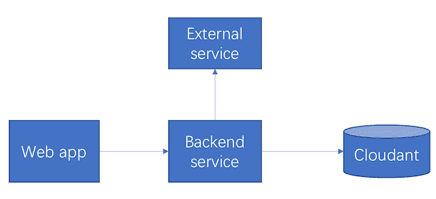
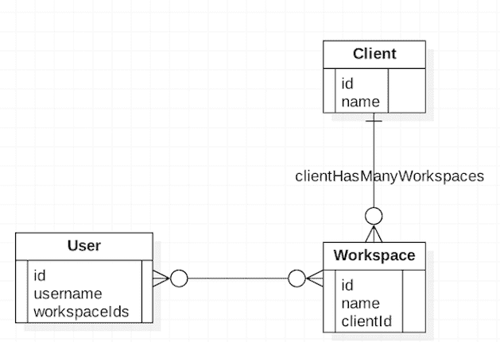
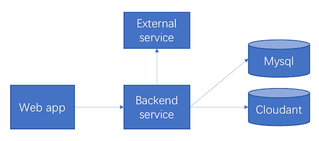
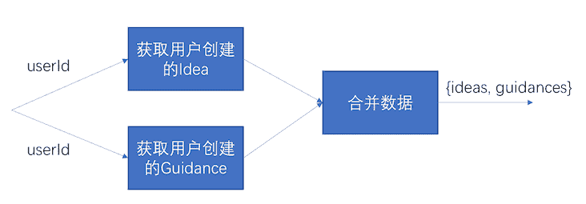
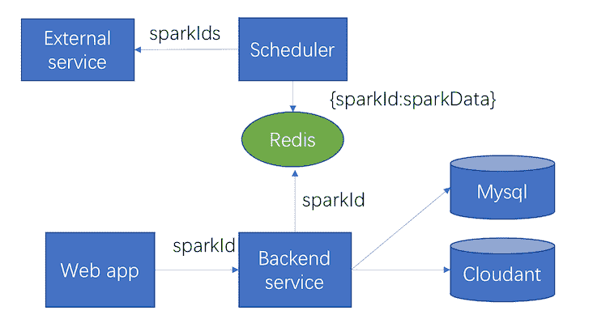
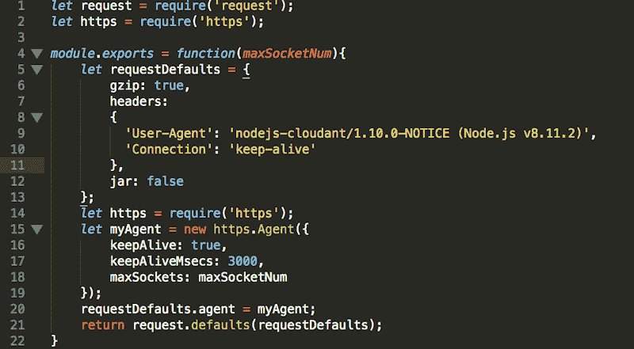
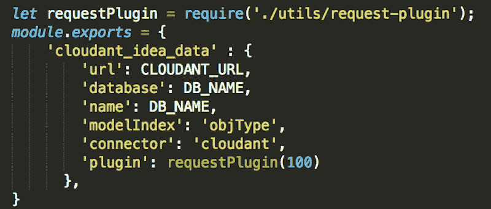

# Node.js 项目性能调优小结

> 原文：[`developer.ibm.com/zh/articles/wa-node_js-project-performance-tunning/`](https://developer.ibm.com/zh/articles/wa-node_js-project-performance-tunning/)

## 前言

我们的一个 Node.js 项目已经开发近两年了，在这个项目中，服务端经历了很大的变化，从单服架构转变为微服务架构，从 Express 框架转变为 Loopback 框架，从 Cloudant 数据存储转变为 Cloudant+Mysql 存储。在转变过程中，我们踩了很多坑，也积累了一些经验，在此对性能调优方面的经验做一下小结，希望新的项目组采用 Loopback 或 Cloudant 等技术时，能够获得一些参考。在这篇文章中，我会将我们项目的需求和架构进行简化，以期能够简单直接地说明问题。

## 项目背景

我们的系统是给销售人员使用的。在此系统中，销售人员可以创建群（我们称之为 Workspace），在群里面，组员可以发表自己的销售建议（我们称之为 Idea），同时其他组员可以给这些建议进行评分，以选出最好的建议。为了能够使得销售们方便地获取灵感，我们集成了一些第三方系统，并将第三方系统的数据以 Spark 的形式在我们的系统中呈现出来，供销售借鉴。项目最初的架构如图 1 所示：

图 1\. 系统框架



## 问题发现

系统功能开发到一定阶段以后，我们就开始对系统进行压力测试。系统的压力测试十分关键，因为平时在开发和测试过程当中，往往只有少数几个人在系统上操作，因此很多问题并没有暴露出来。为了更好地进行压力测试，首先项目组会定一个合格标准，比如在 160 并发条件下，响应时间 3s 以内算作合格。之后开发和测试会相互沟通好，开发提供页面用到的 API 和输入参数，测试在 JMeter 中编写好脚本进行测试。用 JMeter 进行压力测试之后，系统的性能问题就很容易暴露出来。在我们的项目中，我们发现有几个 API 的响应时间在 160 并发，10 loop 的情况下，已经超过了 6s，这是明显不符合我们的预设目标的，于是，针对这些有问题的 API，我们就可以深入分析，然后通过不同手段进行优化。具体的优化策略在下文中详细论述。

## 数据库层面优化

通过对测试结果的重现和分析，我们发现之前设计的数据模型是性能的瓶颈之一，于是第一步，我们先在 Cloudant 上想办法，具体采用了如下手段。

### 关联性很强的数据移到关系型数据库中

我们开始时把所有数据存储在 Cloudant 中，Cloudant 作为数据存储，有它的优势，比如它能够很方便地存储非结构化数据，但是像非关系型数据库普遍存在的问题一样，它对联表查询的支持比较弱，因此一个 API 如果涉及到多表联查，它的性能往往不好，比如遇到如下的情况：

图 2\. 关联示例



在上图中，一个 User 有多个 Workspace，一个 Workspace 有多个 User，一个 Client 有多个 Workspace。要求提供通过 `userId` 查询该 user 拥有的 Client 的 API。为了解决这个需求，在 Cloudant 中，一般需要三个查询：

1.  通过 `userId` 查到 User，获取 `workspaceIds`。
2.  通过 `workspaceIds` 查到所有的 Workspace，获得 `clientIds`。
3.  通过 `clientIds` 查到所有的 Client。

以上三个查询通过一定的手段，可以优化为两个查询，这个在下面会讲到。

我们的 Cloudant 建在 [IBM Cloud](https://cloud.ibm.com/catalog/services/cloudant?cm_sp=ibmdev-_-developer-articles-_-cloudreg) 上，如果进行本地查询，一次查询大概会耗时 500ms，因此这个 API 总共会耗时 1.5s，类似的 API 如果多的话，就会影响系统的性能。因此我们把这类关联性很强的数据移到了 Mysql 中，在 Mysql 中，只要通过一次简单的联表查询，就能够得到想要的结果了，一个 API 至少可以节省 1s 的时间。通过数据迁移，我们的系统的架构就变成如下形式了：

图 3\. 数据库拆分后的架构



### 创建 view 进行查询

跟很多非关系型数据库一样，Cloudant 对于三表以上的联查比较无力，但是对于两表联查，可以通过创建 view 来解决。这里两表联查的情况，分为两表之间存在一对多的关系和两表之间存在多对多的关系，下面分别举例进行说明。

首先是一对多的关系，数据模型如下图所示：

图 4\. 一对多示例


对于该数据模型，在 Cloudant 中的数据存储是这样的：

清单 1\. 一对多 Cloudant 中数据存储

```
{"_id": "client0_id","name": "client0","type": "client"}
{"_id": "workspace0_id","name": "workspace0","type": "workspace","clientId": "client0_id"} 
```

现在要求通过 workspaceId 获取对应的 client 信息，为了通过一次查询解决问题，可以建立这样的 view:

清单 2\. 一对多联查 view

```
function (doc) {
    if("workspace" == doc.type){
      emit(doc._id, {"_id": doc.clientId})
    }
} 
```

在查询时，带上 `include_docs=true` 参数，就能够通过 `workspaceId` 获取相应的 `client` 了，查询 URL 和查询结果如下所示：

```
https://$ACCOUNT.cloudant.com/hello_db/_design/demo_view/_view/get_client_by_workspaceId?include_docs=true&key="workspace0_id" 
```

一对多联查结果如清单 3 所示：

清单 3\. 一对多联查结果

```
{
    "total_rows": 2,
    "offset": 0,
    "rows": [
        {
            "id": "workspace0_id",
            "key": "workspace0_id",
            "value": {
                "_id": "client0_id"
            },
            "doc": {
                "_id": "client0_id",
                "_rev": "1-7673a039c72395618e09bdac2b917b36",
                "name": "client0",
                "type": "client"
            }
        }
    ]
} 
```

接着是多对多的关系，数据模型如下图所示：

图 5\. 多对多示例


对于该数据模型，Cloudant 中的数据存储是这样的：

清单 4\. 多对多 Cloudant 中数据存储

```
{"_id": "user0_id","username": "user0","type": "user"}
{
    "_id": "user_workspace_rel0_id","userId": "user0_id",
    "workspaceId": "workspace0_id","type": "user_workspace_rel"
}
{
    "_id": "user_workspace_rel1_id","userId": "user0_id",
    "workspaceId": "workspace1_id","type": "user_workspace_rel"
}
{"_id": "workspace0_id","name": "workspace0","type": "workspace","clientId": "client0_id"}
{"_id": "workspace1_id","name": "workspace1","type": "workspace","clientId": "client1_id"} 
```

现在要求通过 `userId` 获取 `user` 信息和该 `user` 的 `workspace` 信息，为了通过一次查询解决问题，可以建立这样的 view：

清单 5\. 多对多联查 view

```
function (doc) {
    if("user" == doc.type){
      emit([doc._id, 0], null);
    }
    if("user_workspace_rel" == doc.type){
      emit([doc.userId, 1], {"_id": doc.workspaceId})
    }
} 
```

在查询时，带上 `include_docs=true` 和 `startKey`，`endKey` 参数，就能够通过 `userId` 获取 `user` 信息和对应的 `workspace` 信息了。查询 URL 为： `https://$ACCOUNT.cloudant.com/hello_db/_design/demo_view/_view/get_workspaces_by_userId?in`。

查询结果如清单 6 所示：

清单 6\. 多对多联查结果

```
clude_docs=true& startKey=["user0_id"]& & endKey=["user0_id", 1]
{
    "total_rows": 3,
    "offset": 0,
    "rows": [
        {
            "id": "user0_id",
            "key": [
                "user0_id",
                0
            ],
            "value": null,
            "doc": {
                "_id": "user0_id",
                "_rev": "3-2fe2e52c774d29d57dd1dbefdd9c3ffa",
                "username": "user0",
                "type": "user"
            }
        },
        {
            "id": "user_workspace_rel0_id",
            "key": [
                "user0_id",
                1
            ],
            "value": {
                "_id": "workspace0_id"
            },
            "doc": {
                "_id": "workspace0_id",
                "_rev": "2-2a3967ca3ceef9fa660f38dde426a144",
                "name": "workspace0",
                "type": "workspace",
                "clientId": "client0_id"
            }
        },
        {
            "id": "user_workspace_rel1_id",
            "key": [
                "user0_id",
                1
            ],
            "value": {
                "_id": "workspace1_id"
            },
            "doc": {
                "_id": "workspace1_id",
                "_rev": "1-a6de8988c6d8547040cdc884a4d45857",
                "type": "workspace",
                "name": "workspace1",
                "clientId": "client1_id"
            }
        }
    ]
} 
```

通过建立特定的 view，一定程度上能够解决两表联查的问题，但是在查询时，需要带上 `include_docs=true` 参数，因此查询返回的结果会是整个文档。返回的文档中，往往会携带多余的信息，比如在我们的示例中，返回的结果带了版本号 `_rev` 。在实际应用中，文档结构会更复杂，因此返回的不必要的信息就更多了，不必要的信息越多，数据的体积就越大，就会影响传输速度。相比于关系型数据库中可以指定返回的字段，通过 view 的联表查询有返回数据过多的劣势。在具体应用中，对于两表联查的情况，我们需要通过测试决定是否采用通过 view 查询的方式，如果关联的文档结构简单，文档体积对数据传输的影响不大，那么建议采用 view 查询。

### 常用字段建立索引

在 Cloudant 中创建文档，文档的 `_id` 字段会被自动索引，因为我们通过文档的 id 查询该文档，速度会比较快，但是在实际应用中，我们经常需要通过文档的其他字段查询文档，比如在对于如下的文档：

`{"_id": "user0_id","username": "user0","type": "user"}`

在实际项目中，通过 `username` 进行查询的情况非常多，这时候我们就应该为 `username` 建立索引，在文档数量非常多的时候，建立索引能够大大加快文档的查询速度。在 Cloudant 中，建立索引的方式可以参考：[Creating an IBM Cloudant Query](https://cloud.ibm.com/docs/services/Cloudant?topic=cloudant-creating-an-ibm-cloudant-query?cm_sp=ibmdev-_-developer-articles-_-cloudreg) 。

## 代码层面优化

数据库层面优化之后，系统的性能得到了一定的提升，但是还是不符合我们的要求，于是，我们便深入代码进行分析，力图通过改善代码以使得性能进一步提升。我们在代码层面的工作如下所述。

### 空间换时间，减少时间复杂度

Node.js 是单进程的，不会像 Java Web 服务器一样，每个请求都会起一个线程（当然线程数量有一个上限），因此在 Node.js 的业务逻辑中，要尽量避免耗时的逻辑运算，因为一个耗时的逻辑运算会阻塞新来的请求，使得 Node 服务器的性能大大降低。对于不可避免的逻辑运算，尽量降低它的时间复杂度。比如在我们的项目中，遇到过类似这样的一段逻辑：

清单 7\. 高时间复杂度代码示例

```
for(let workspace of workspaces){
    let clientId = workspace.clientId;
    for(let client of clients){
        if(client.id == clientId){
            workspace.clientName = client.name;
        }
    }
} 
```

这段逻辑的目的是为每一个 `workspace` 加上 `clientName`, 但是它通过两层循环进行处理，时间复杂度就是 `O(n²)`，如果有 3000 个 `workspace`，7000 个 `client`，那么这段逻辑就要运行 21，000，000 次，效率非常低，而且会随着 `workspace` 和 `client` 数量的增加，效率会不断地显著降低。对于这种 O(n²) 的算法，可以优化成这样：

清单 8\. 空间换时间代码示例

```
let clientIdNameDict = {};
for(let client of clients){
    clientIdNameDict[client.id] = client.name;
}
for(let workspace of workpaces){
    workspace.clientName = clientIdNameDict[workspace.clientId];
} 
```

这个算法，实现相同的需求，时间复杂度为 `O(n)`, 可以大大提高 API 的性能。

在 Node.js 中，对于有两层以上循环的逻辑，需要考察它是否有通过增加空间消耗降低时间复杂度的可能，一般来说现在硬件便宜，通过增加内存来提升系统性能的尝试是值得的。

### 串行改并发

Node.js 虽然是单进程的，但是在很多情况下，它的服务器性能非常优秀，因为它有强大的异步回调机制，使得它在处理强 I/O 业务时，非常得心应手。对于开发者来说，我们要善用异步回调机制，在处理具体业务时，尽量提高业务逻辑的并发性。比如图 6 的数据模型：

图 6\. 串行改并发数据模型


需要提供一个通过 `userId` 查询该用户创建的 Idea 和 Guidance 的 API，一种做法是串行查询，如图 7 所示：

图 7\. 串行查询


API 耗时=获取 Idea 耗时+获取 Guidance 耗时+合并数据耗时。因为 Idea 和 Guidance 之间并没有关联性，所以这两个的查询可以并发进行，以此减小 API 的总耗时。并发的处理如图 8 所示：

图 8\. 并发查询



采用并发处理后，`API 耗时=MAX(获取 Idea 耗时，获取 Guidance 耗时) + 合并数据耗时`。一般对 Cloudant 的一次查询需要耗时 500ms，因此改为并发处理后，API 的耗时能够减少 500ms。

为了方便编写并发逻辑，Node 提供了相应的库和方法，对于 7.6 以前的版本，可以使用 async 库，伪代码如下：

清单 9\. async 代码示例

```
let async = require('async');
async.parallel([
    function(next){
        //get ideas
        next();
    },
    function(next){
        //get guidances
        next();
    }
], function(err, results){
    if(err){
        //handle err;
    }else{
        let ideas = results[0];
        let guidances = results[1];
        //merge data;
    }
}) 
```

对于 7.6 以后的版本，并发处理就更加方便了，伪代码如下所示：

清单 10\. async/promise 代码示例

```
let fetchData = async function(){
    let p1 = getIdeaPromise();
    let p2 = getGuidancePromise();
    let [ideas, guidances] = await Promise.all([p1, p2]);
    return {'ideas': ideas, 'guidances': guidances};
} 
```

### 使用 Redis Cache

在实际项目中，会不可避免地遇到需要通过请求第三方服务获取数据的情况，而向三方请求数据，响应时间取决于网络和第三方服务的性能。在我们的项目中，需要向一个第三方服务请求 Spark 的信息。在实际测试中，我们发现第三方服务的响应速度比较影响整个 API 的性能，于是我们把 Spark 信息在自己的服务端做了缓存。我们的解决方案如下图所示：

图 9 . Cache 方案



Scheduler 定时往第三方服务请求数据，并把请求回来的数据放到 Redis 中。前端通过 `sparkId` 请求 Spark 数据时，后端服务直接从 Redis 中获取数据，并返回给前端。

通过将 Spark 信息存到自己的 Redis，并从 Redis 获取数据的方式，大大提高了 API 的响应速度，同时也可以避免第三方服务宕机导致服务不能使用的情况。当然这种处理方式也有一定的局限性，就我们的项目而言：

1.  需要缓存的数据不能太大。否则，对存储会形成比较大的压力
2.  第三方服务对于数据的更新不能很频繁。否则，缓存的数据会经常落后于第三方数据，那么用户的使用体验不会很好。

## 配置层面优化

最后，我们进一步检查了配置，发现在配置层面也有一定的优化空间。

我们做项目时，通常会引入一些第三方库，而第三方库往往会提供一些默认配置，这些默认配置在大多数情况下会工作的比较好，但是对于一些高并发的场景，默认配置就不能胜任了。在我们的项目中，就遇到了这样的情况。我们项目通过 cloudant 库对 Cloudant 进行数据操作，深入 cloudant 库的代码，会看到该库的默认最大 socket 数为 6，如图 10 所示（cloudant.js, 66-74 行）：

图 10 . Cloudant 默认 Socket


因为最多只会起 6 个 socket，所以当查询 Cloudant 的并发量大时，socket 会不够用，导致大量请求排队，严重影响系统的响应速度。我们可以通过增加 socket 数量，来提高系统的响应速度。具体的配置如图 11 所示，配置方法：`request-plugin.js`。

图 11\. request-plugin 代码



对 Cloudant 的配置：

图 12\. Cloudant 配置



通过增加 socket 的数量，对于 Cloudant 查询性能的提升有很明显的影响。我们用 JMeter 进行本地测试，结果是 160 个并发请求，10 次循环，一个特定 API 平均响应时间从 15s 下降到了 3s。

## 结束语

我们的项目采用了 Node+Cloudant 的技术，这对于很多用惯了 Java 全家桶的开发者来说，是一种全新的体验。在此，我们把遇到的性能问题和解决方案呈现了出来，希望能够对采用类似技术的项目组有所帮助，也希望寄此抛砖引玉，引起更多对于 Node 和 Cloudant 的技术讨论。