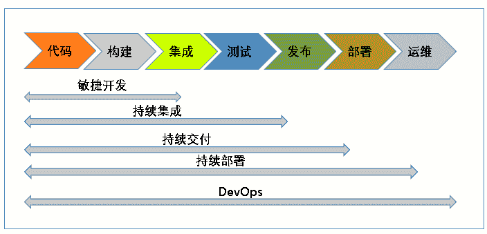
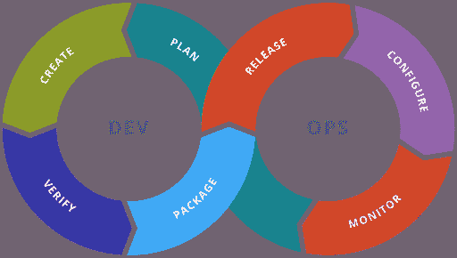
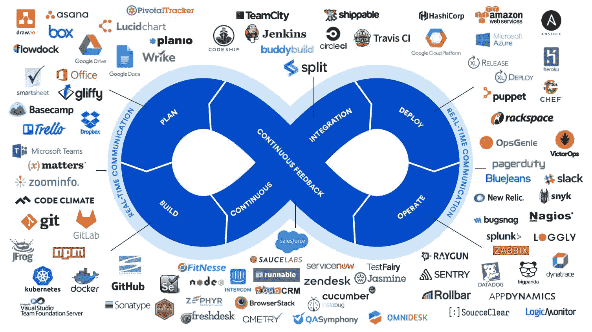
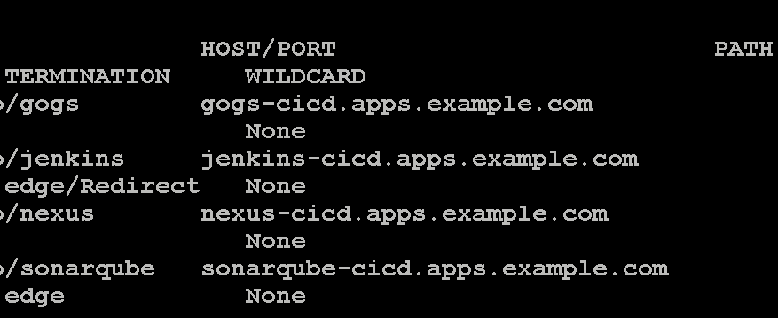
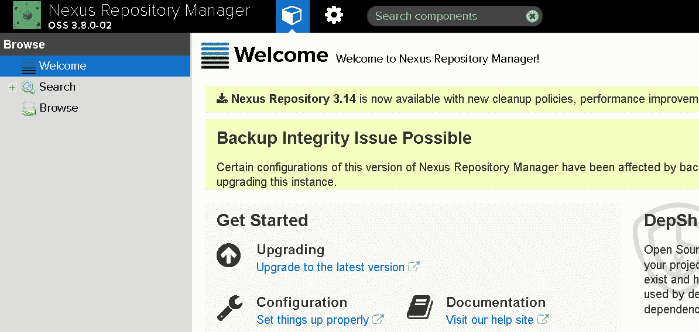
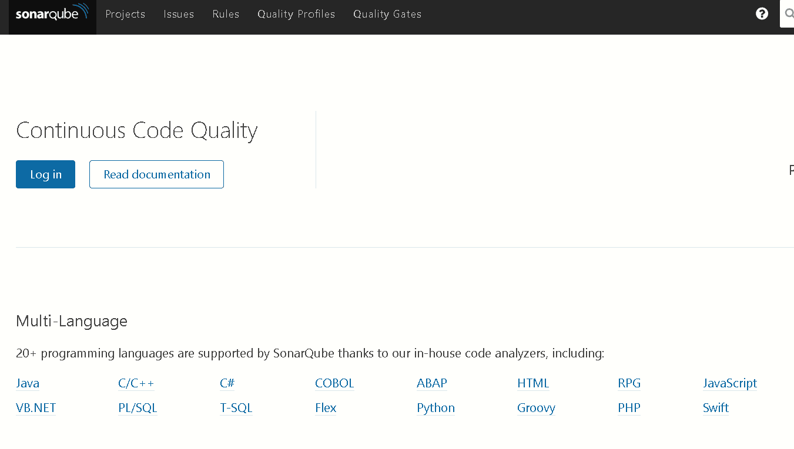
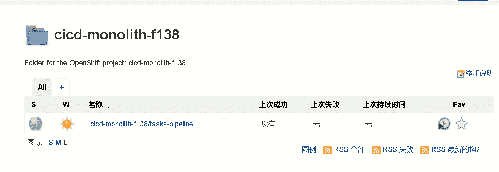
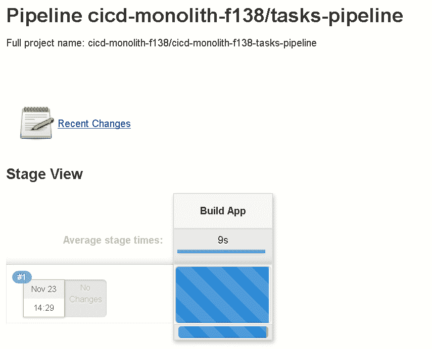
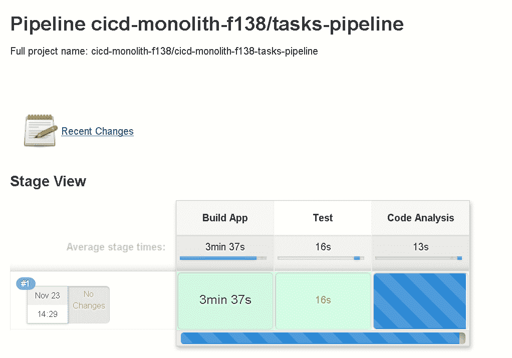
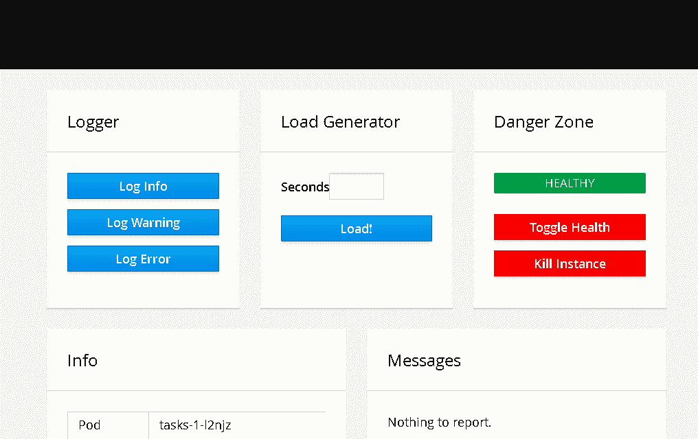

# 通过 Kubernetes 和容器实现 DevOps

> 原文：[`developer.ibm.com/zh/articles/cl-lo-devops-via-kubernetes-and-containers/`](https://developer.ibm.com/zh/articles/cl-lo-devops-via-kubernetes-and-containers/)

近两年，随着容器、Kubernetes 等技术的兴起，DevOps 这个概念被广泛提及并被大量使用。 本文将会从以下几个方面着手，结合实验展现的方式，让读者真正理解 DevOps 的含义。

*   DevOps 产生的背景
*   DevOps 与容器、Kubernetes 之间的关系
*   DevOps 的技术实现方式

## DevOps 是什么

DevOps 中的 Dev 指的 Development，Ops 指的是的 Operations，用一句话来说 DevOps 就是打通开发运维的壁垒，实现开发运维一体化。

### 从瀑布式开发到敏捷开发

谈到 DevOps 的发展史，我们需要先谈一下敏捷开发。

首先，敏捷开发是面向软件的，而软件依赖于计算硬件。我们知道，世界上第一台计算机是在 1946 年出现的。因此，软件开发相对于人类历史而言，时间并不长。相对于软件开发方法论的掌握，人们更擅长于工程学，如盖楼、造桥等。为了推动软件开发，1968 年，人们将工程学的方法应用到软件领域，由此产生了软件工程。

软件工程的方式有其优点，但带来了不少问题。最关键一点是：软件不同于工程。通过工程学建造的大桥、高楼在竣工后，人们通常不会对大桥高楼的主体有大量使用需求的变更；但软件却不同。对于面向最终用户的软件，人们对于软件功能的需求是会不断变化的。在瀑布式开发的模式下，当客户对应用有变化的需求时，软件厂商得重新开发软件。这将会使企业的竞争力大幅下降。

传统的软件开发流程是：产品经理收集一线业务部门和客户的需求，这些需求可能是新功能需求，也可能是对产品现有功能做变更的需求。然后进行评估、分析，将这些需求制定为产品的路线图，并且分配相应的资源进行相关工作。接下来，产品经理将需求输出给开发部门，开发工程师写代码。写好以后，就由不同的部门的人员进行后续的代码构建、质量检验、集成测试、用户验收测试，最后给生产部门。这样带来的问题是，开发周期比较长，并且如果有任何变更，都要重新走一遍开发流程，在商场如战场的今天，软件一个版本推迟发布，可能到发布时这个版本在市场上就已经过时了；而竞争对手很可能由于在新软件发布上快了一步，而迅速抢占了客户和市场。

正是由于商业环境的压力，软件厂商需要改进开发方式。

2001 年初，在美国滑雪胜地 snowbird，17 位专家聚集在一起，概括了一些可以让软件开发团队更具有快速工作、相应变化的能力的价值观原则。他们称自己为”敏捷联盟”。

敏捷开发的主要价值观如下：

##### 表 1\. 敏捷开发的核心价值观

|  |  |  |
| --- | --- | --- |
| 个体和互动 | 高于 | 流程和文档 |
| 工作的软件 | 高于 | 详尽的文档 |
| 客户合作 | 高于 | 合同谈判 |
| 相应变化 | 高于 | 遵循计划 |

有了敏捷联盟，有了敏捷开发价值观，必然会产生开发的流派。主要的敏捷开发流派有：极限编程（XP）、Scrum、水晶方法等。

至此，敏捷开发有理念、有方法、有实践。随着云计算概念的兴起，云计算的不断落地，敏捷开发不仅实现了工具化，也得到了升华。

### 从敏捷开发到 DevOps

谈到了敏捷开发，那么敏捷开发和 DevOps 有什么关系呢？

敏捷开发是开发域里的概念，在敏捷开发基础之上，有如下阶段：

**敏捷开发->持续集成->持续交付->持续部署->DevOps**

从敏捷开发到 DevOps，前一个阶段都是后一个阶段的基础；随着阶段的推进，每个阶段概念覆盖的流程越来越多；最终 DevOps 涵盖了整个开发和运维阶段。正式由于每个阶段涉及的范围不同，因此所以每个概念所提供的工具也是不一样的。具体内容我们参照下图：

##### 图 1\. 从敏捷开发到 DevOps 的进阶



**持续集成（Continuous Integration）** 指的是：代码集成到主干之前，必须全部通过自动化测试；只要有一个测试用例失败，就不能集成。持续集成的要实现的目标是：在保持高质量的基础上，让产品可以快速迭代。

**持续交付（Continuous Delivery）** 指的是：开发人员频繁地将软件的新版本，交付给质量团队或者用户，以供评审。如果评审通过，代码就被发布。如果评审不通过，那么需要开发进行变更后再提交。

**持续部署（Continuous Deployment）** 指的是：代码通过评审并发布后，自动部署，以交付使用。

**DevOps** 是一组完整的实践，可以自动化软件开发和 IT 团队之间的流程，以便他们可以更快、更可靠地构建、测试和发布软件。

##### 图 2\. DevOps 示意图



## DevOps 的技术实现

DevOps 的技术实现，需要三个方面：标准交付物、容器调度平台、DevOps 工具链。接下来，我们详细看一下这个三个方面的内容。

### DevOps 的技术实现 1：标准交付物

DevOps 的目的在于让开发和运维一体化、让开发和运维相互之间的沟通更加顺畅、迅捷，从而使企业更能适应市场的变化。

当然，真正实现开发运维一体化，并非只是让开发和运维的人坐在一起那么简单。从技术角度，DevOps 首先需要有一个包含了”操作系统+Runtime+应用”的标准交付物。除此之外，还需要通过整个 DevOps 流程来打通。

在 IT 早期，厂商硬件和系统平台的差异化过大，在不同硬件和系统平台进行应用的无缝迁移几乎是不可想象的。随着 X86 服务器以及 vSphere 等虚拟化技术的普及，操作系统（包括操作系统上的应用）可以在不同 X86 服务器厂商的硬件平台上在线无缝迁移。硬件差异化不断缩小甚至消失，软件的重要性不断提升，IT 界真正进入软件定义一切的时代。在这个背景下，业务提出了更高的要求，如何将应用在不同操作系统之间实现无缝迁移，将开发和生产统一，做到”构建一次，到处运行”。

容器技术的概念最初出现在 2000 年，当时称为 FreeBSD jail，这种技术可将 FreeBSD 系统分区为多个子系统。

但直到 Docker 的出现（2008 年），容器才真正具备了较好的可操作性和实用性。因为 Docker 提供了容器的镜像构建、打包等技术，使容器具备了一次打包，到处运行的能力。

对于客户而言，Docker 只能在一个 Linux 上运行，是”单机版”，很难符合企业对高可用的需求。此外，docker 也缺乏和持久存储、虚拟网络相关的功能。

### DevOps 的技术实现 2：容器调度平台

2014 年 Kubernetes 的出现，奠定了今天容器调度平台的事实标准的基础。

因为通过 Kubernetes，我们不仅实现了容器在多个计算节点上的统一调度，还可以将容器对接持久存储、对接虚拟网络等。换句话说，Kubernetes 使容器具备企业级的功能。

##### 图 3\. Kubernetes 架构


### DevOps 的技术实现 3：DevOps 工具链

在有了容器和 Kubernetes 以后，我们还需要相关的 DevOps 工具链。

目前在 IT 界，DevOps 相关的工具很多，其中大多数是开源的工具，如下图。

##### 图 4\. DevOps 工具链



在后面的文章中，我们会选择几种常用的 DevOps 工具，然后进行试验展现。

### 总结：DevOps 与容器和 Kubernetes 的关系

PaaS、DevOps 的概念，在容器和 Kubernetes 普及之前就存在了。广义上的 PaaS、DevOps 的建设，会包含：人、流程、工具等多方面内容。IT 厂商提供的 PaaS、DevOps 以指工具层面的落地为主、以流程咨询为辅。

在 Kubernetes 和容器普及之前，我们通过虚拟机也可以实现 PaaS、CI/CD，只是相对速度较慢，因此普及性不高（想象一下通过 X86 虚拟化来实现中间件集群弹性伸缩的效率）。而正是容器的出现，为 PaaS、DevOps 工具层面的落地提供非常好的承载平台，使得这两年容器云风生水起。这就好比 4G（2014 年出现）和微信（2011 年出现）之间的关系：在手机网速 3G 时代，流量按照兆收费的时候，（即使有）大家对于微信语音聊天、微信视频也不会太感兴趣。

所以说， Docker 使容器具备了较好的可操作性、可移植性，Kubernetes 使容器具备企业级使用的条件。而 IT 界众多基于 Kubernetes 和 Docker 企业级的容器平台，又成为了 Devops 工具落地的新一代基础架构。

## DevOps 工作流展示

### 常用 DevOps 工具介绍

*   Kubernetes 集群：包含 Docker 和 Kubernetes。
*   Gogs: 通过 Go 编写的本地代码仓库，功能与 github 类似。
*   Jenkins/Jenkins Slave Pods：持续集成工具。
*   Nexus :工件管理器，能够解决本地缓存构建依赖项。
*   SonarQube：开源代码分析工具，它可以分析常见编程错误的源代码。

以上的 DevOps 工具，都可以以容器方式部署到 Kubernetes 集群中。在实验环境中，有一个两个节点的 Kubernetes 集群，用于进行实验展现。

##### 图 5\. Kubernetes 集群


在 Kubernetes 集群中创建三个 Namespace：cicd、dev、stage。其中 cicd Namespace 存放的是 DevOps 相关工具链。dev、stage 是模拟开发和生产两个环境。

##### 图 6\. Kubernetes 集群的 Namespaces


接下来，我们看一下在 cicd Namespace 中部署的 DevOps 工具链：

##### 图 7\. Kubernetes 集群中部署的 DevOps 工具



在工具链部署成功以后，我们分别登录工具的 UI 界面进行查看。

我们首先查看代码仓库 Gogs 中的源代码：

##### 图 8\. Gogs 中的源码


接下来，我们登录 Jenkins（后续的主要操作将会基于 Jenkins）：

##### 图 9\. Jenkins 界面


Nexus 用于存放构建成功、并经过 Code Review 的 war 包，我们查看 Nexus 的界面：

##### 图 10\. Nexus 界面



SonarQube 负责 Code review：

##### 图 11\. SonarQube 界面



### Jenkins Pipeline 工作流分析

整个 Devops 的流程，通过 Jenkins 的 Pipeline 串接起来。在 Jenkins 中，我们可以通过编写 Jenkins File，或者通过 Jenkins 浏览器页面的操作来完成 Pipeline 的定制。两者的实现效果是一样的，本文以书写 Jenkins File 方式展现。通过一个 Jenkins File，打通整个 DevOps 流程。

我们查看 Jenkins File 的内容并进行解释。

第一步，从 Gogs 拉取源代码，然后调用 maven 进行代码编译：

##### 清单 1\. Pipeline 第一阶段

```
pipeline {
  agent {
    label 'maven'
  }
  stages {
    stage('Build App') {
      steps {
        git branch: 'eap-7', url: 'http://gogs:3000/gogs/openshift-tasks.git'
        script {
            def pom = readMavenPom file: 'pom.xml'
            version = pom.version
        }
        sh "${mvnCmd} install -DskipTests=true"
      }
    }
  }
} 
```

第二步，构建成功以后，调用 mvn 进行测试。

##### 清单 2\. Pipeline 第二阶段

```
stage('Test') {
  steps {
    sh "${mvnCmd} test"
    step([$class: 'JUnitResultArchiver', testResults: '**/target/surefire-reports/TEST-*.xml'])
  }
} 
```

第三步，调用 SonarQube 进行代码 review。

##### 清单 3\. Pipeline 第三阶段

```
stage('Code Analysis') {
  steps {
    script {
      sh "${mvnCmd} sonar:sonar -Dsonar.host.url=http://sonarqube:9000 -DskipTests=true"
    }
  }
} 
```

第四步，将测试成功的代码存档到 Nexus:

##### 清单 4\. Pipeline 第四阶段

```
stage('Archive App') {
  steps {
    sh "${mvnCmd} deploy -DskipTests=true -P nexus3"
  }
} 
```

第五步，Pipeline 会将构建成功的 war 包，以二进制的方式注入到 JBoss EAP 的 docker image 中。

##### 清单 5\. Pipeline 第五阶段

```
stage('Build Image') {
    steps {
      sh "rm -rf oc-build && mkdir -p oc-build/deployments"
      sh "cp target/tasks.war oc-build/deployments/ROOT.war"
    }
} 
```

接下来，Pileline 先将这个 docker image 部署到 dev 环境，然后引入审批工作流，批准后部署到生产。

##### 清单 6\. Pipeline 中的审批流

```
stage('Promote to STAGE?') {
      steps {
        timeout(time:15, unit:'MINUTES') {
            input message: "Promote to STAGE?", ok: "Promote"
        }
      }
} 
```

### DevOps 工具链演示

首先，登录到 Jenkins 上，查看已经创建好的 Pipeline。

##### 图 12\. Jenkins 的 Pipeline



点击”开始构建”，触发工作流（工作流也可以通过提交代码自动触发）：

##### 图 13\. 触发工作流


Pipeline 的第一个阶段是 Build App。

##### 图 14\. 工作流第一个阶段



Build App 成功的 logs 如下，我们可以看到生成了 war 包：

##### 清单 7\. 构建应用成功的日志

```
[INFO] Installing /tmp/workspace/cicd-monolith-f138/cicd-monolith-f138-tasks-pipeline/target/tasks.war to /home/jenkins/.m2/repository/org/jboss/quickstarts/eap/jboss-tasks-rs/7.0.0-SNAPSHOT/jboss-tasks-rs-7.0.0-SNAPSHOT.war
[INFO] Installing /tmp/workspace/cicd-monolith-f138/cicd-monolith-f138-tasks-pipeline/pom.xml to /home/jenkins/.m2/repository/org/jboss/quickstarts/eap/jboss-tasks-rs/7.0.0-SNAPSHOT/jboss-tasks-rs-7.0.0-SNAPSHOT.pom 
```

Pipeline 继续执行，在 Test 成功以后，开始进行 Code Analysis：

##### 图 15\. 工作流阶段 2-3



Test 阶段执行成功的 log：

##### 清单 8\. 测试成功的日志

```
-------------------------------------------------------
 T E S T S
-------------------------------------------------------
Running org.jboss.as.quickstarts.tasksrs.service.UserResourceTest
Tests run: 1, Failures: 0, Errors: 0, Skipped: 1, Time elapsed: 1.798 sec - in org.jboss.as.quickstarts.tasksrs.service.UserResourceTest
Running org.jboss.as.quickstarts.tasksrs.service.TaskResourceTest
Tests run: 3, Failures: 0, Errors: 0, Skipped: 0, Time elapsed: 0.604 sec - in org.jboss.as.quickstarts.tasksrs.service.TaskResourceTest

Results :

Tests run: 4, Failures: 0, Errors: 0, Skipped: 1 
```

Code Analysis 阶段执行成功的日志，我们看到日志显示代码分析成功，并建议通过浏览器访问 SonarQube：

##### 清单 9\. 代码分析成功的日志

```
[INFO] ANALYSIS SUCCESSFUL, you can browse http://sonarqube:9000/dashboard/index/org.jboss.quickstarts.eap:jboss-tasks-rs
[INFO] Note that you will be able to access the updated dashboard once the server has processed the submitted analysis report
[INFO] More about the report processing at http://sonarqube:9000/api/ce/task?id=AWc_R_EGIPI_jn5vc3mt
[INFO] Task total time: 18.918 s 
```

我们登录 SonarQube，查看结果：

##### 图 16\. SonarQube 执行结果


接下来，Pilepine 进入到 Create Image Builder 阶段，其关键的步骤是将构建成功的 war 包以二进制的方式注入到 docker image 中：

##### 清单 10\. 构建镜像的日志

```
[cicd-monolith-f138-tasks-pipeline] Running shell script
+ rm -rf oc-build
+ mkdir -p oc-build/deployments
[Pipeline] sh
[cicd-monolith-f138-tasks-pipeline] Running shell script
+ cp target/tasks.war oc-build/deployments/ROOT.war 
```

Create Image Builder 执行成功以后，会生成包含应用的 docker image。接下来是 Create Dev 和 Deploy Dev，即在 dev 环境部署包含应用的 docker image。当 Deploy Dev 成功以后，会引入工作流，提示是否批准将应用部署到 Stage，如下图：

##### 图 17\. 工作流审批流程


选择 Promote，应用会部署到 Stage，Pipeline 流程走完。

##### 图 18\. 工作流执行完毕


最后，通过浏览器访问成功部署到 Dev/Stage Namespace 中的应用：

##### 图 19\. 应用 UI 访问



至此，您可以看到应用访问结果，说明 DevOps 全流程已经打通。

## 结束语

通过本文，相信读者对 DevOps 的概念和工具链已经有了大致的了解。也对通过 Kubernetes 集群和容器实现 DevOps 有了一定的理解。