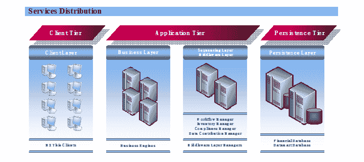
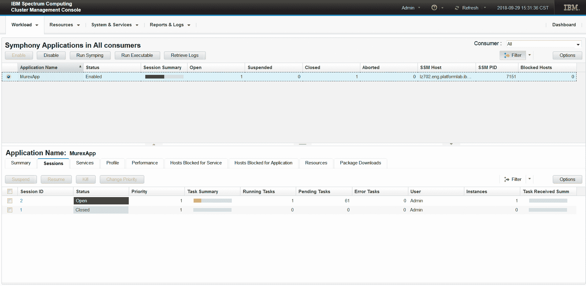
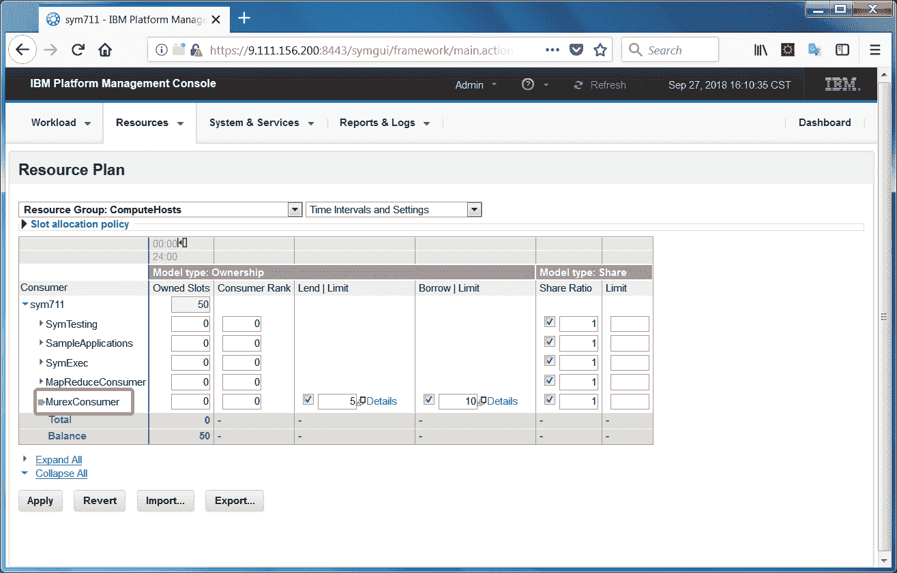

# Murex 快速风险分析引擎

> 原文：[`developer.ibm.com/zh/articles/ba-lo-murex-fast-risk-engine/`](https://developer.ibm.com/zh/articles/ba-lo-murex-fast-risk-engine/)

## 简介

**Murex** ：在风险分析和预测分析领域，Murex 是一家为金融市场提供交易、资金、风险和交易后操作技术解决方案的公司，Murex 的平台 MX.3 被银行、资产管理公司、养老基金和保险公司使用。 其客户包括瑞银、加拿大国家银行、中国银行、华侨银行、招商银行和 ATB 金融等。Murex 的核心产品 MX.3，于 2013 年在澳大利亚国民银行上线并支持其外汇交易和处理，对其交易业务进行了全面改革。2017 年，Murex 与亚马逊网络服务公司合作，在亚马逊的云平台上推出 MX.3。云上的 MX.3 可用于开发和测试、运行生产流程、灾难恢复和访问基于云的托管服务等应用程序。Murex 是金融行业软件的领导厂商，有很多世界顶级金融机构选择 Murex 作为金融解决方案。

**IBM Spectrum Symphony** ：IBM Spectrum Symphony 是企业级运算服务管理软件，简单来说，IBM Spectrum Symphony 是一个提供数据分发、任务调度以及资源管理的企业级分布式计算框架，并且支持异构化的 IT 环境。用于在可扩展、共享、异构的大规模计算机集群中运行分布式应用程序。它能够充分利用各种计算资源，提高并行应用的运行速度并快速得到计算结果，充分的满足了数据密集型与计算密集型应用的计算要求，全面提升系统性能。在全球范围内，IBM Spectrum Symphony 正在为世界众多的金融机构提供服务，其中，世界排名前 20 的银行中有 15 家银行正在使用 IBM Spectrum Symphony（以下简称 IBM Spectrum Symphony 为 Symphony）。

## 如何运用 Murex 和 Symphony 帮您将运算时间减少 80%

在金融领域，风险分析和风险预测是非常重要的金融业务，需要强大的计算能力。Murex 作为金融软件的领导厂商，在现有的技术下，风险分析的计算能力已经发挥到了极限，急需一个可以增强 Murex 风险计算能力的平台。IBM Spectrum Symphony 是高并发计算的平台，恰好可以解决 Murex 的计算瓶颈。Murex 与 Symphony 的集成在全球有很多成功的案例。比如在一家知名投资银行，由于集成了 Symphony，Murex 运行相同任务的时间减少了约 80%，这得益于 Symphony 的高并发能力和资源调度能力，使计算任务能够在整个集群中高并发运算，从而节省用户的时间，也不需要购买额外的硬件资源。本文将会对 Murex 和 Symphony 的集成以及集成后的优点进行详细介绍。

##### 图 1\. IBM Spectrum Symphony 系统架构

Symphony 由两个主要模块组成， EGO 模块负责资源管理和资源调度，SOAM 模块负责任务管理和任务调度。在 Symphony 的集群中，用户需要根据 Symphony 提供的 API 实现基于 SOA 的客服端和服务端应用程序。

客户端程序提交任务到 Symphony 集群，Symphony 通过 EGO 模块为应用程序申请资源（CPU、内存、GPU），SOAM 模块将任务分发到集群中的机器上并启动服务端应用程序，服务端接收任务数据并进行计算，最终会通过 Symphony 将任务计算结果返回给客户端。

Symphony 还提供了一些命令行工具的集合和 WEB 操作界面，方便用户查看任务的运行情况和资源使用情况。Knowledge Center 是 Symphony 产品文档的 WEB 接口，用户可以在其中找到 Symphony 各个功能的介绍和使用方法。

## Murex 与 IBM Spectrum Symphony 的集成原理和工作模式

Murex 作为世界金融商品交易管理及风险管理的领导厂商，其主要产品 MX.3 是为全球交易、风险管理和资料处理量身定做的金融工具，不论您的业务是包含高交易量还是具有复杂的结构，您都会发现 MX. 3 可以满足您的需要。Murex 为多种资产类别的金融交易提供金融软件交付集成的跨资产解决方案。金融服务企业希望通过运行更多并发场景、支持更多用户、更快速的运算来最大化 Murex 的价值，这一切将通过与 Symphony 的集成得以实现，Symphony 是高并发运算的引擎，对于上层应用完全透明。Murex 与 Symphony 的集成将提高应用的运算速度，加速 Murex 的风险分析，最终使金融投资者获得及时准确的数据，提高投资决策的正确性和准确性，使金融机构获得更高的收益。

Murex 拥有无与伦比的产品覆盖范围和在每个资产类别中的领先功能，支持利率、外汇、股票、信贷和大宗商品工具的整个交易、风险管理和处理生命周期。该应用程序提供了卓越的能力和灵活性，从大量交易到奇异的产品结构。

对 Murex 来说，并行计算的速度对于支持日益复杂的金融分析及其不断增加的应用非常重要。金融分析需要一个简单通用的 API 来优化并行计算的效率。这些分析必须有一个单独的实现，而且透明地与主要的并行计算平台一起工作，以避免多次，高成本和复杂的维护工作。

## Murex 的系统架构

下面先介绍一下 Murex 软件的系统架构以及 Murex 和 Symphony 如何集成。

##### 图 2\. Murex 系统概览

Murex 的系统结构主要有 3 个层次：

*   Client Tier 通过压缩的增量消息与应用层程序进行通信。它提供了访问整个应用程序功能的入口。
*   Application tier 遵循面向服务的原则，是基于业务层、序列层、中间件层 3 个不同的层次。

    *   Business Layer 公开业务引擎包括定价任务、风险任务、会计任务、交易生命周期任务、清算任务等。
    *   Sequencing Layer 是一组服务，处理系统中任务之间的对象的序列化。
    *   Middleware Layer 负责服务生命周期。它由一个带远程的服务目录组成，能够根据要求启动和停止服务的代理商具有无状态服务的负载平衡机制。
*   Persistence Tier 专注于所有业务对象的交易存储。它构建在标准的关系数据库上：包括 SybaseASE 和 Oracle 数据库。Persistence Tier 部署在两个单独的服务器上，以实现可伸缩性和故障转移。每个节点托管不同的数据库：

    *   Financial Database 托管所有 MX.3 业务对象的数据模型。
    *   Datamart Database 是一个”客户定义”数据库，用于报告和批量接口活动。

##### 图 3\. Murex 和 Symphony 集成逻辑示意图

Murex 和 Symphony 进行集成的主要考虑：

*   Murex 是金融类管理软件，相比于其他的企业级应用系统需要更高更快的计算能力。
*   越来越多的金融类客户选择 Murex 来进行风险分析和风险预测。
*   Symphony 是面向服务体系结构应用计算的平台，是并行计算的专家，提供了强大的并行计算能力、资源调度及资源管理能力。
*   两者的集成可以显著提高 Murex 的风险计算速度和计算能力，使客户可以更快的得到风险分析计算的结果，为金融投资提供更快速、更及时的数据作为决策依据。
*   通过集成可以运行更高保真度的模拟预交易，以更准确地量化风险。
*   通过快速和准确的运算结果确保交易遵守法规并避免过多的财务储备。
*   通过对 LOB 和资产类别的风险敞口的准确计算，提高盈利能力并更好地管理风险。

Murex 开发了一套通用的应用程序接口（MxGrid Interface）用来和 Symphony 产品进行集成。MxGrid Interface 和 Symphony 的交互对于分析集成专家是隐藏的，因此他们的程序具有独立性和可移植性，MxGrid 提供了一个到 Symphony 的驱动，这使依赖 MxGrid 进行计算服务的分析程序能够与领先的并行计算平台协同工作。MACS（Murex Analytics）财务模块依靠 MxGrid 提供集中并行化风险计算。所有的 MACS 模块都适合并行化，与 Symphony 的集成可以极大的提高并行计算的能力。

Murex 的客户，从小型金融机构到领先的地区和全球金融机构，都可以通过 Murex Flex 将专有的第三方金融分析集成到 Murex 平台，这些扩展依赖于 MxGrid API 来并行化它们的计算。反过来，MxGrid 引擎透明地与 Symphony 交互，以提供并行计算服务。

Murex 与 Symphony 集成的优势在于:

**快速结果和竞争优势：** Murex 抽象了并行计算 API 的固有复杂性，为分析集成人员提供了一个通用的、简单的 API，以便快速投入市场。使用 Symphony 作为并行计算的平台，可以使原有的应用程序任务运行时间减少大概 80%。Symphony 集群可以支持超过 20000 个 CPU，使服务器和集群资源的利用率达到 97%，并且拥有高可用的基础架构。

**可伸缩，可靠的基础设施：** 当客户使用云上的 Murex 和 Symphony 时，Symphony 帮助构建了一个高度可伸缩、可靠的并行计算基础设施，这个过程可以很容易地扩展到其他应用程序。然后，整个集群可以充当一个虚拟化的内部云计算环境，不仅可以降低 SOA 应用程序的计算成本，还可以降低其他应用程序的成本。

**基于策略的资源分配：** Symphony 是一个可扩展的企业级计算平台的软件层，平台 EGO 模块提供了一个虚拟的资源池，为多个应用程序或用户组提供资源服务，并为应用程序编排基于需求和策略的资源分配。有了 EGO 的强大功能，您的共享计算基础设施可以运行其他应用程序，并进一步提高经济规模，不用关心应用程序本身是否支持并行计算的。

## Symphony 的作用

如前面分析的那样，提高 Murex 计算性能最直接的方法就是提高其并行计算的速度和资源利用率，这正是 Symphony 最擅长解决的问题。

Symphony 是资源调度和高性能计算方面的专家，Symphony 会将其管理的计算机集群当成一个整体，统一管理和调度整个集群的所有资源，根据客户端提交的作业和资源请求来分配计算资源（CPU, GPU, 内存），将客户端提交的作业分配在集群里多台机器上进行并行计算，并将计算结果返回给客户端，这就保证了任务执行的并行度，提高作业的计算速度，并充分利用了整个集群中的有效资源。除此之外，Symphony 支持用户配置各种资源计划来应对资源不足和资源空闲的情况，使整个集群的资源得以充分利用。当存在计算资源竞争时，计算资源会优先分配给优先级较高且拥有的资源未满足的任务，暂时得不到资源的任务会等待，当有空闲资源出现时此类任务会立刻获得资源进行运算，这些措施保证了资源能够得到最充分的利用。

Symphony 也支持资源的共享，暂时不需要资源的用户可以将资源放入共享池中，或者出借给其他用户，当作业请求到达时，出借资源的用户可以在规定时间内收回资源，这极大的提高整个集群的资源利用率和运算的效率。

Symphony 中资源管理和任务调度的逻辑可以简单表示为图 4，图中的任务可以根据其优先级获得对应的资源，多个任务可以同时在不同的资源上并行运行。

##### 图 4\. Symphony 任务示意图

## 目前的集成方案及发生问题后的处理方法

Symphony 目前已经与 Murex 软件进行了集成，并通过了正式的官方测试，最新的测试版本是 Murex MX.3 v3.1.37 和 Symphony 7.1.1。用户通过 Symphony 和 Murex 提供的 API，自己编写应用程序，并将应用程序作业提交到 Symphony 集群进行计算，并在运算结束后得到运算结果，就可以使得此两种软件在一起工作。Symphony 的 Knowledge Center 提供了 Symphony 的所有信息，包括如何安装，管理，使用 Symphony，以及 Symphony 提供的 API 的介绍。

在 Murex 与 Symphony 进行的集成中，Symphony 主要针对 Murex 软件应用层（Application tier）中的中间件层（Middleware Layer）进行了优化。Murex 软件利用 Symphony 可以将多个任务并行的特性，将 MACS（Murex Analytics）财务模块的多个实例同时运行在 Symphony 的计算机集群里来帮助用户更快的得到结果。

Symphony 还可以通过每个 MACS（Murex Analytics）财务模块实例自定义的资源分配规则（资源分配策略，任务优先级，资源需求量，借入资源/还回资源配置等）动态的分配资源，提高资源使用率。

图 5 所示的是 Symphony 的软件操作界面。Symphony 使用 session 来作为管理任务的容器，每个 session 中包含一个或者多个任务。Murex 软件中的作业与 Symphony 中的 session 是一一对应的关系。Symphony 界面中的 session 页面的信息包括任务总数、当前运行任务数、错误任务数、取消任务数等等，这些信息便于用户对于作业状态获得直观的感受，也有利于问题的调查。

对于发生问题的作业，用户可以在 Symphony 的界面上点击对应 session 来查看其中每个任务的信息，如启动时间，发生错误原因，发生错误的计算机名等，然后进行进一步的分析。也可以通过图.6 Symphony Performance 界面查看各种任务的数量。

##### 图 5\. Symphony session 界面

##### 图 6\. Symphony Performance 界面

在如图.7 所示的 Symphony 界面中，用户可以根据自己的需求来定义资源分配的形式（例如，从哪个计算机群组中获得资源，按什么比例在应用程序之间分配资源，每个应用程序可获得资源的最大数目，可以向哪个应用程序借出资源等），这些配置把用户从琐碎的具体操作中解放出来，同时最大化了资源利用率。

如果某些任务很容易在某些计算机上面出错，用户可以把这些计算机单独组成一个群组，然后通过配置阻止这些任务在这些计算机上获得资源，这样就能保证这些任务顺利的在其他计算机上完成。

##### 图 7\. Symphony 资源分配界面

## Symphony 解决方案的优点

Symphony 作为企业级资源管理与任务调度软件，拥有良好的性能与可靠性，同时广泛支持各种基于 SOA 应用的并行运算，在实时性要求高和计算体量庞大的金融领域，Symphony 满足了高性能和高可靠性的严苛要求。

通过与 Symphony 的集成，Murex 的用户可以获得的优势如下：

*   提高性能：

    *   并行计算使得用更少的时间完成更复杂的计算。
    *   更高的 CPU 利用率（最高达到 97%）。
    *   更高优先级的任务可以优先得到执行。
    *   更低的延迟和开销。
    *   任务的实例进程能被重用，不需要重新启动，减少资源开销。
*   增强可靠性：

    *   计算机集群完善的的错误处理和故障转移机制使得运算对于错误的容忍度更高。
    *   计算机集群资源的灵活调度保证了有足够的资源进行运算。
*   简化资源管理：

    *   能够实现灵活主动的资源管理和资源调度。
    *   自适应的资源管理，资源可以在不同计算任务之间共享。
    *   计算机集群的资源能够得到充分利用，可以用更少的资源得到期望的结果
*   资源扩展：

    *   当本地集群资源不够时，可以从各种云平台上获得资源来支持任务的运算。
    *   提供多种资源管理方案，充分利用闲暇计算终端实现任务计算。
*   响应更快：

    *   实时动态的基于任务优先级变化的资源分配使得高优先级的任务能够更快速的得到响应。
    *   可以有选择的中断短任务来响应高优先级任务，从而避免中断长任务造成资源浪费。

## 将来可能进行的集成优化

Symphony 目前与 Murex 进行了集成和测试，也对其他知名软件 Algorithmics、Calypso、MATLAB、Mesos 提供集成解决方案，随着 Murex 和 Symphony 新版本的不断研发，未来还会考虑更多的集成工作，这些将根据市场的需求逐步得到实现。

## Symphony 的其他集成解决方案

Symphony 作为业界领先的高性能计算和资源管理与任务调度平台，除了可以与 Murex 进行集成外，还与其他知名软件如 Algorithmics、Calypso、Matlab、Mesos 进行了集成，这些集成已经在全球范围内得到广泛应用。Murex 与 Symphony 的集成可以使金融客户受益，与其他知名金融软件的集成也会使使用其产品的金融客户受益，如需要进一步的信息，请与 IBM 联系。

## 参考资源

*   IBM Spectrum Symphony Knowledge Center ：这里提供了更全面的官方文档。
*   Murex 官方网站： [`www.murex.com/`](https://www.murex.com/)