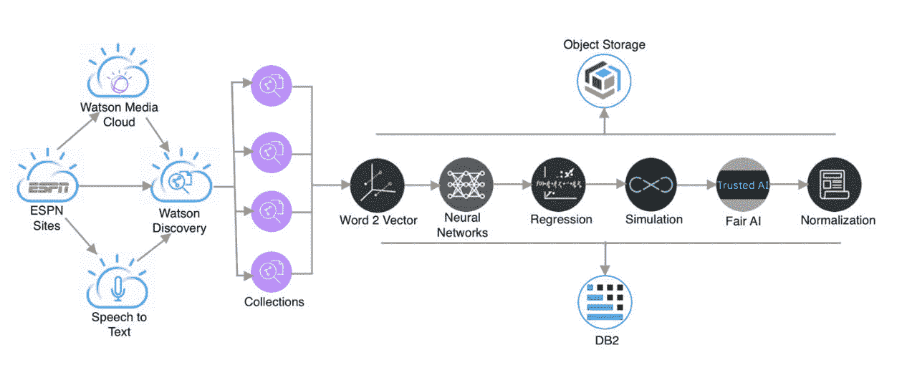
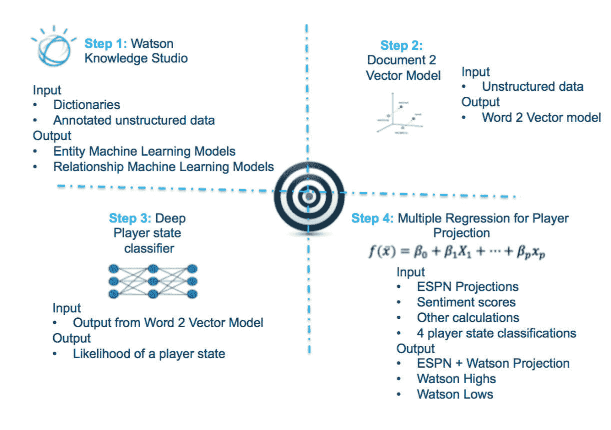
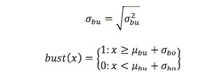

# 代码的背后：用于获取 Fantasy Football 洞察的机器学习管道

> 原文：[`developer.ibm.com/zh/articles/watson-behind-the-code-fantasy-football-2018-part4/`](https://developer.ibm.com/zh/articles/watson-behind-the-code-fantasy-football-2018-part4/)

**免费试用 IBM Cloud**

利用 [IBM Cloud Lite](https://cocl.us/IBM_CLOUD_GCG) 快速轻松地构建您的下一个应用程序。您的免费帐户从不过期，而且您会获得 256 MB 的 Cloud Foundry 运行时内存和包含 Kubernetes 集群的 2 GB 存储空间。[了解所有细节](https://www.ibm.com/cloud/blog/announcements/introducing-ibm-cloud-lite-account-2)并确定如何开始。

ESPN 和 IBM 携手合作，为 Fantasy Football 球队所有者带来了全新的洞察：Watson AI。#FantasyFootballFace。Watson 基于一个企业级的机器学习管道来读取、理解和领悟有关 Fantasy Football 的数百万份文档和多媒体来源。ESPN Fantasy Football with Watson 系统是一个包含许多组件的庞大系统。

此文章[系列](https://developer.ibm.com/zh/series/watson-behind-the-code-fantasy-football-2018/)分 8 部分，本文是第 4 部分，将带您了解每个组件，展示我们如何使用 Watson 构建世界级的 AI 解决方案。

## 通过机器学习管道获取 AI Fantasy Football 洞察

Watson 深入分析数据，使您能够精心挑选您的 Fantasy Football 阵容。球队经理可以挑选可能会升级的球员，避免选择会降级的球员。但是，可能降级的高风险球员有可能具有更高的上升空间。ESPN Fantasy Football with Watson 提供了 AI 洞察，以便您能“全垒打”。高风险可能意味着高回报。或者，您可以打安全牌，用场上得分潜力换取上升概率。机器学习管道利用大量数据进行推理，以配合您每周的战略转变。

该系统的机器学习架构由多个应用程序、几十个模型，以及数千个数据源和数据科学环境组成。首先，该系统必须学会读取 Fantasy Football 内容。语言模型是通过自定义实体和关系来设计的，以适应人们用来描述 Fantasy Football 领域中的球员和球队的独特语言。为了读取内容进行领悟，我们定义了 13 种实体类型的本体，涵盖了以球员为中心的理解。这些实体包括身体部位、教练、球迷、装备、伤病、位置、球员、球员状态、治疗、积极语气、消极语气、球队和表现指标。1,200 个文档创造了一种均匀的文档分布，包含来自 5,568,714 篇文章的每种实体类型。

3 位人工注释员组成的团队使用了一个名为 [Watson Knowledge Studio](https://www.ibm.com/watson/developer/) 的工具将文本标注为 13 种实体类型中的一种。通过在 10 个字典中搜索单词并自动创建注解，预先对这些文档进行了注解。注释员添加缺少的注解的同时也一边更正预先注解。每一天，该团队都会开会讨论彼此为每种实体类型给出的 kappa 或协议分数。在 3 周内，该团队生成了一个统计实体模型，该模型的准确率为 79%，召回率为 73%，F1 分数为 76%。即使所有文档的实体单词密度只有 14%，注释员的整体协议分数也达到了 70%，大部分差异都表现为短语中缺少一些单词。

我们训练了一个检测器并将其部署到名为 Watson Discovery 的系统中，该检测器不断从 50,000 多个来源摄入数据。Watson Discovery 系统能根据我们训练的统计实体模型，从不断更新的语料库中发现 Fantasy Football 实体、关键词和概念。

接着，该系统使用一个文档矢量化模型来了解查询中的自然语言文本。如[第 3 部分](https://developer.ibm.com/zh/articles/watson-behind-the-code-fantasy-football-2018-part3/)所述，我们最初向 Watson Discovery 信任的来源发出了一个非常具体的查询，比如 “Tom Brady and Patriots and NFL and Football”。如果查询没有返回至少 50 个经过实验确定的文档，那么该查询就会被扩展，直到它只有 “Tom Brady and NFL”。如果仍未得到至少 50 条证据，则会按从精确到宽泛的顺序向 Watson Discovery 中性来源发出查询。从查询结果中，将每个文档的实体、关键词和概念组成的列表转换为数值特征矢量。对每个特征矢量组（即实体、概念和关键词）求平均值，以表示该内容的语义摘要。将来自每个文档的所有特征矢量组平均分配到每个文档中。

使用两种不同类型的语义含义来测试文本矢量模型。首先，对该模型执行一次类比测试。如果提供给模型的 Travis Kelce 与队长的关系与 Coby Fleener 与 X 的关系相同，那么正确答案将会是 Saints。在球员到球队的类比测试中，正确答案始终在前 1% 的数据中。球队到位置类比的准确率稍低一点，为 93.48%，因为自然查询的关注点不在球队上。第二个测试为模型提供了一组关键词，并期望获得一个相关的单词。例如，如果将 Coby Fleener 输入模型中，我们期望将 Saints 视为输出。该模型在球员关键词测试中实现了 80% 的准确率，而正确答案在前 0.1% 的数据中。球队和位置关键词测试的执行情况上述测试类似，具有 74% 的准确率，其中正确答案在前 1% 的数据中。

接着，将 3 个特征矢量和球员生物信息图一起输入到管道的深度学习部分。

深度学习管道包含 4 个深度超过 98 层的模型。神经网络中的节点组合使用了直线、双曲正切和 S 形激活函数。这些模型是每个球员的分类器，用于确定升级、降级、带伤上场的概率或上场分钟数。概率分数提供了球员状态的置信度级别，以便球队所有者可以决定自己的风险容忍度。

降级比赛分类器的准确率为 83%，具有适度的类别分离，而升级分类器的准确率非常低，只有 39%。有很高概率突围的球员的得分远远超出平均预测分数。遗漏和标记错误的升级球员非常接近于 0.5 的二值化阈值。此外，升级模型的负面预测值准确率为 85.5％，而且它生成的升级球员的现实比例为 12％。过度预测升级可能比高准确率更糟糕。与负面预测值和预计将升级的球员比例相比，准确率数值不是一个有意义的评估指标。

带伤上场分类器的准确率为 67%，正面预测值为 68.1%。正面预测值对此分类器非常重要，它使我们能够知道球员是否会积极面对伤病或隐性伤病。上场分钟数模型提供的准确率为 61.7%。每个深度学习模型都为球员状态提供了宝贵的自然语言文本摘要。

最后，将深度学习球员数据和结构化 ESPN 数据输入到由多个回归模型组成的集合中。多次回归集合基于球员位置为每个球员提供了一个预测分数。深度学习球员状态数据和 ESPN 统计数据的线性组合生成了 6.78 分的最佳 RMSE 分数。平均而言，每个预计在所有位置上具有显著高分的球员，都将获得一个与真实值相差 6.78 分的预测分数。

为了生成概率分布函数 (PDF)，机器学习管道的末端将 25 个不同的 PDF 与球员的历史表现相拟合。一些示例分布包括 alpha、anglit、beta、bradford、chi、wald、vonmises、person、normal、Rayleigh 等。如果球员没有足够多的历史数据，则会检索类似的球员数据。在为每个球员创建一个 PDF 后，在一次模拟中对该分布进行 10,000 个点的采样，以便提供用于在用户界面上绘制曲线形状的离散点。

通过结合使用自然语言证据与传统统计，生成每位球员的预测分数。平均而言，结构化和非结构化数据的组合产生了比单独采用两种数据更好的 RMSE。我们在 Jupyter Notebooks 和 IBM SPSS 软件中进行了大量的数据探索。通过试验，我们为项目选择了一些模型超参数和算法。

在 Watson 能够通过核心机器学习管道读取、理解和领悟数据后，将一组后处理器应用于输出。通过使用 IBM Fair 360 库，我们开发了一个后处理器，以确保每个球队都得到公平对待。例如，根据预测，New England Patriots 的球员的升级频率比不同球队的其他球员更高。实际上，每次升级的球员数量之间的差异非常小。我们使用回归输出和事实库数据构建了一个公平的后处理器模型。这个公平的后处理器的输出更正了 50,000 个来源对特定球队的总体偏差。

第二个后处理器修改了深度学习方程的置信度值。用于分类的每个深度学习阈值各不相同。为了使升级、降级、带伤上场或上场分钟数据具有可比性，每个值都被标准化。现在，每个置信度值都以 0.5 为中心，以便采用相同的标准。

## 训练 Fantasy Football 机器学习管道

在整个项目中，我们使用了 Fantasy Football 2015 和 2016 赛季中与球员相关的历史新闻文章、博客等。一个名为 Webhose 的第三方来源提供了大量内容。我们使用自定义实体模型将总计超过 100 GB 的数据摄入到 Watson Discovery 中。我们将这些文章日期与来自 ESPN 的结构化球员数据相关联，以生成带标签的数据。ESPN 球员数据包含多项统计数据，其中包括每周结果、预测值、实际值、拥有百分比等。

将从星期二到星期一的一周时间跨度与每个球员的状态相关联，以便可以运行时间范围查询来检索相关的新闻文章。升级标签是通过分析实际分数和预测分数，以及拥有球员的球队经理比例来确定的。如果球员的实际分数比球员 *p* 的预测分数高 1 个标准偏差以上，则使用实际分数与预测分数之差除以征用百分比 *perowned[p]^(0.1)*，再计算加权平均值，来确定升级标准偏差。但是，在所有联盟中，球员必须拥有至少 10% 的征用百分比。

升级的标准偏差 *σ[bo]* 通过对升级方差 *σ[bo]²* 求平方根来确定。

如果球员的实际分数 *x* 比球员的升级均值高 1 个升级标准偏差以上，则对球员应用升级标签。

降级标签是通过以下等式来计算的。平均降级分数 *μ[bu]* 是通过以下方式来确定的：将实际分数与预测分数之差除以同一个球员的预测分数，再计算加权平均值。但是，采样集合中仅使用了比预测分数低 1 个标准偏差 *σ[p]* 的实际分数。

降级方差 *σ[bu]²* 的平方根提供标准差阈值，以便用分数 *x* 为球员添加标签。

当球员实际分数超过预测分数的 15%，而且他们在伤病报告中显示为“存在问题（50% 退场可能性）”或“可能带伤（25% 退场可能性）”时，才会生成“带伤上场”标签。当球员分数超过其预测分数的 15%，而且球员为“可能带伤”或不出现在伤病报告中时，才会生成“上场分钟数”标签。在 Fantasy Football 2015 和 2016 赛季中，每周会为每位球员生成全部 4 种标签。

Watson 为全球的 Fantasy Football 经理提供了公平且专业的 AI 洞察。训练和评估机器学习管道的科学流程可以创造高度准确的预测，从而帮您取得成功。#WinWithWatson

下次当我讨论如何通过移动体验来提供 AI 洞察时，可以回顾一下这里的内容。要了解更多信息，请在 Twitter 上关注 Aaron Baughman：@BaughmanAaron。

ESPN Fantasy Football 徽标是 ESPN, Inc. 的商标。经 ESPN, Inc. 许可使用。

本文翻译自: [Behind the code: Machine learning pipeline for Fantasy Football insights](https://developer.ibm.com/articles/watson-behind-the-code-fantasy-football-2018-part4/)（2018-11-19）