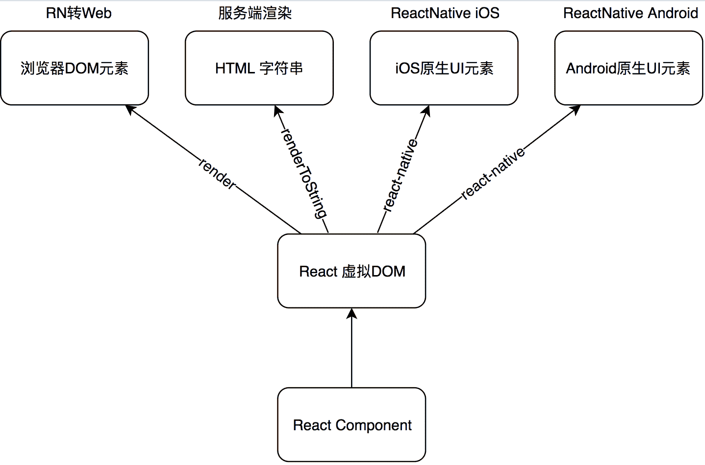
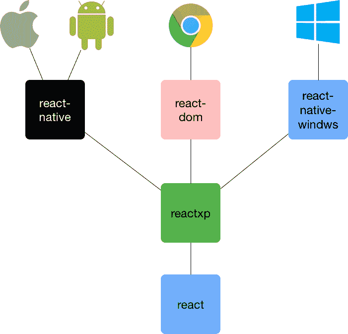
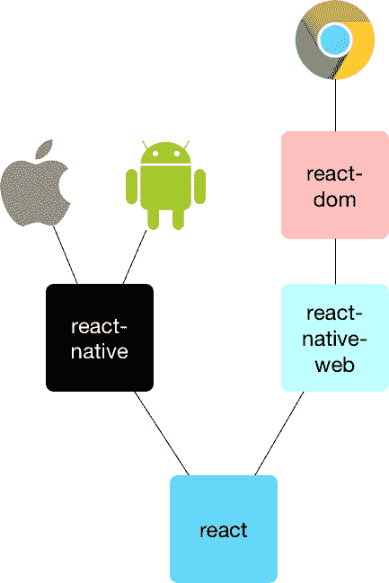

# React Native 三端同构实战

> 原文：[`developer.ibm.com/zh/articles/wa-universal-react-native/`](https://developer.ibm.com/zh/articles/wa-universal-react-native/)

React Native 三端（Web、iOS、Android）同构是指在不改动原 React Native 的代码下，让其在浏览器中运行出和在 React Native 环境下一样的页面。对于使用 React Native 开发的页面，如果又单独为 Web 平台重复写一份代码代价是极其大的，而 React Native 三端同构能以零花费快速做到一份代码三端复用。

React Native 三端同构的应用场景包括：

*   在 React Native 页面崩溃时用对应的 Web 页兜底，以保证用户可以正常使用页面。
*   对于需要分享到社交网络如微信朋友圈、微博的页面，不可避免地需要 Web 网页。

## React Native 三端同构基础原理

React Native 就像一套新的浏览器标准，它提供了大量内置的原生 UI 元素和系统 API，对应着浏览器中的 div、img 等标签以及 BOM API；但是 React Native 目前只专注于移动 App 平台，只适配了 iOS 和 Android 两大系统，而浏览器则是适配了各种操作系统。由于 React Native 需要适配的平台更少所以性能会比浏览器要好。

React Native 是基于 React 实现的，编写 React Native 应用和编写 Web 应用一样需要编写大量 React 组件。我们编写的 React 组件经过 render 后会以虚拟 DOM 的形式存储在内存中，React 只负责 UI 层面的抽象和组件的状态管理，各平台都可用虚拟 DOM 去渲染出不同的结果，React 架构如图 1 所示：

##### 图 1\. React 架构



由此可见，虚拟 DOM 这层中间抽象在实现 React 渲染到多端时发挥了很大的作用。

## ReactNative 三端同构方案对比

目前社区中已经有多个 React Native 三端同构方案，比较成熟的有 [reactxp](https://github.com/Microsoft/reactxp) 和 [react-native-web](https://github.com/necolas/react-native-web) ，下面分别介绍这两种方案并从多方面对比二者以帮助你做出合适的选择。

### 认识 reactxp

reactxp 是一个跨平台的开源 UI 库，由微软 Skype 团队维护，Skype 产品中就大量使用了它来实现写一份代码运行在多个平台上。目前 reactxp 支持以下平台：

*   iOS/Android：基于 React Native 渲染。
*   Web：基于 react-dom 渲染。
*   [UWP](https://en.wikipedia.org/wiki/Universal_Windows_Platform) ：基于 [react-native-windows](https://github.com/Microsoft/react-native-windows) 渲染。
*   其他平台 （如 Mac、Windows10 以下系统、Linux 桌面）：基于 Web 渲染的 [Electron](https://electron.atom.io/) 。

### reactxp 实现原理

reactxp 充份发挥了 React 虚拟 DOM 的优势，它其实只是充当胶水的作用，把各个平台的渲染引擎整合起来，对外暴露平台一致的接口，reactxp 架构如图 2 所示：

##### 图 2\. reactxp 架构



reactxp 为各个平台都实现了一份代码，在构建的过程中构建工具会自动选择平台相关的代码进行打包输出。

### reactxp 的优缺点

**优点**

1.  写一份代码就可实现多端渲染，对于有多端需求的产品可以减少代码量和人力。
2.  由微软 Skype 团队维护并且用于 Skype 产品中，有大公司投入资源支持。
3.  基于 TypeScript 编写，对 IDE 友好。

**缺点**

1.  为了抹平多端平台差异导致灵活性降低，暴露的组件和 API 较 react-native 要少很多。
2.  需要兼容 UWP 平台导致包袱更重，而目前会针对 Windows 桌面或手机开发应用的产品在渐渐减少，大多数产品不需要支持 Windows 平台。
3.  需要多导入 reactxp 这个库，导致打包输出的 bundle 会变大；并且由于多了一层适配，运行时性能肯定不如直接使用 React Native。

其中最为致命的缺点可能在于目前 reactxp 支持的组件和 API 相当匮乏，一些比较细的操作无法控制。如果你的项目中确实有超出 reactxp 的能力范围的需求，可以通过导入和使用 React Native 实现，但这会导致整个项目脱离 reactxp 体系而无法实现多端同构。reactxp 只保证在它的体型内实现多端同构，但在其体系内却有很多 API 不可用。

### reactxp 和 React Native 的异同点

从使用层面来说它们最大的区别在于：用 reactxp 写的一份代码可以在多个平台运行，而 React Native 是学会它后可多个平台编写原生应用但还得为不同平台编写不同代码。

这一点从 reactxp 和 React Native 暴露出的 API 就可以看出来：React Native 中有大量诸如 SegmentedControlIOS、PermissionsAndroid 这样针对特定平台的 API，而 reactxp 中所有的 API 在所有端中都可以正常调用。

事实上 React Native 也在为多端接口统一做努力，React Native 中的大多数接口是可以在多端运行一致的，但为了保证灵活性 React Native 也提供了平台相关的接口。而 reactxp 抹平了多端接口的差异，但这也导致 reactxp 灵活性降低。

二者的相同点是都采用了 React 框架编程的思想，由于 reactxp 是基于 React Native 封装的导致两者大多数 API 的使用方式都是一致的。

### 认识 react-native-web

react-native-web 是由 Twitter 工程师 Nicolas Gallagher 实现并维护的开源项目，目前已用在 Twitter、Flipkart、Uber 等项目中，它支持把 React Native 编写的项目转换成 Web 应用。

为 React Native 项目接入 react-native-web 成本极低：react-native-web 对原项目没有侵入性，无需改动原来的代码，只需在项目中加入一些 webpack 构建配置即可构建出运行出和 React Native 应用一致效果的 Web 应用。

### react-native-web 实现原理

react-native-web 实现了在不修改 React Native 代码的情况下渲染在浏览器里的功能，其实现原理如下：

在用 webpack 构建用于运行在浏览器里的代码时，会把 React Native 的导入路径替换为 react-native-web 的导入路径，在 react-native-web 内部则会以和 React Native 目录结构一致的方式实现了一致的 React Native 组件。在 react-native-web 组件的内部，则把 React Native 的 API 映射成了浏览器支持的 API。react-native-web 架构如图 3 所示：

##### 图 3\. react-native-web 架构



### react-native-web 和 reactxp 异同点

react-native-web 和 reactxp 的目的都是为了实现多端同构，但 react-native-web 只专注于 Web 平台的适配，而 reactxp 则还需要适配 UWP 平台。

在实现 Web 平台的适配过程中它们都采用了类似的原理：把对外暴露的 API 或组件映射到 Web 平台去。但在实现 Web 平台的样式适配时二者有细微区别：

*   reactxp 全部通过内联样式实现。
*   react-native-web 通过为每条不同的样式生产一个 className，对于重复出现的样式则通过复用 className 实现。

对于这两种不同的实现方式，我更看好 react-native-web 的实现方式，原因有两个：

1.  通过复用 className 节省网络传输字节，如果你需要做服务端渲染这个优势会凸显出来。
2.  通过 className 的方式浏览器渲染性能更好，因为浏览器有做样式计算缓存优化，有人专门写了 [性能对比测试页面](https://jsperf.com/inline-style-vs-css-class) 。

表 1 列出了 reactxp 和 react-native-web 在其他方面的对比：

##### 表 1\. react-native-web 和 reactxp 的对比

| **对比项** | **reactxp** | **react-native-web** | **对比 结果** |
| --- | --- | --- | --- |
| 维护人 | 微软 Skype 团队和 GitHub 社区 | 来自 Twitter 的个人 [Necolas](https://github.com/necolas) 和 GitHub 社区 | reactxp 小胜 |
| 服务端渲染支持 | [官方没有明确要支持](https://github.com/Microsoft/reactxp/issues/201) | 完全支持 | react-native-web 胜 |
| Web 端包大小 | 435KB | 354.4KB | react-native-web 胜 |
| 写代码效率 | 针对 reactxp 暴露的 API 去实现多端适配 | 需要自己去验证代码在多端的表现是否一致 | reactxp 胜 |
| 学习成本 | 除了需要学习 reactxp 外，不可避免的还需要学习 React Native | 只需学习 React Native 即可 | react-native-web 胜 |
| Github 数据 | start=2017 年 4 月 star=6521 issues=23/739 commits=814 | start=2017 年 7 月 star=10151 issues=45/1034 commits=1248 | react-native-web 用户更多，代码变动频率更大。reactxp 问题响应速度更快。 |

### 如何选择

如果你开发的产品有适配 UWP 平台的需求就选择 reactxp，否则选择 react-native-web，因为 reactxp 相比于 react-native-web 除了多支持 Windows 平台外，并无其它明显优势。

## reactxp 接入

由于 reactxp 所有暴露的 API 都支持在 Web 平台和 React Native 平台同时正常运行，因此为 reactxp 应用转 Web 的方法非常简单，只需为项目加入 webpack 构建和运行 Web 页面的 `index.html` 文件。

reactxp 的 webpack 配置文件如清单 1 所示：

##### 清单 1\. reactxp 的 webpack 配置文件 `webpack.config.js`

```
module.exports = {
  entry: "./src/index.tsx",
  mode: "development",
  output: {
    filename: "bundle.js",
    path: __dirname + "/dist"
  },
  resolve: {
    // 优先加载 web.js 后缀的文件
    extensions: [".web.js", ".ts", ".tsx", ".js"]
  },

  module: {
    rules: [
           // 转换 TypeScript 文件
      { test: /\.tsx?$/, loader: "awesome-typescript-loader" }
    ]
  }
}; 
```

再写一个运行 Web 页面的 `index.html` 文件，内容如清单 2 所示：

##### 清单 2\. reactxp 平台启动入口文件 `index.html`

```
<!doctype html>
<html>
<head>
  <meta charset='utf-8'>
  <style>
    html, body, .app-container {
      width: 100%;
      height: 100%;
      padding: 0;
      border: none;
      margin: 0;
    }
    *:focus {
        outline: 0;
    }
  </style>
</head>
<body>
  <div class="app-container"></div>
  <script src="dist/bundle.js"></script>
</body>
</html> 
```

完整的例子可以参考 reactxp 的 [官方例子](https://github.com/Microsoft/reactxp/tree/master/samples/hello-world) 。

## react-native-web 接入

为了给你现有的 ReactNative 接入 react-native-web，实现 ReactNative 三端同构的能力，你需要做以下事情：

第一，安装新的依赖，按照依赖的命令如下：

```
 # 运行时依赖
   npm i react react-dom react-native-web react-art
   # 构建工具
   npm i -D webpack webpack-dev-server webpack-cli babel-loader babel-plugin-transform-runtime 
```

第二，为 Web 平台写一份 `webpack` 配置文件 `webpack.config.js` ，内容如清单 3 所示:

##### 清单 3\. webpack 配置文件 webpack.config.js

```
 module.exports = {
     module: {
       rules: [
         {
           // 支持图片等静态文件的加载
           test: /\.(gif|jpe?g|png|svg)$/,
           use: {
             loader: 'file-loader'
           }
         },
         {
           // React Native 包中有很多 es6 语法的 js，需要用 babel 转换后才能在浏览器中运行
           test: /\.js$/,
           use: {
             loader: 'babel-loader',
             options: {
               cacheDirectory: false,
               presets: ['react-native'],
               plugins: [
                 // 支持 async/await 语法
                 'transform-runtime'
               ]
             }
           }
         }
       ]
     },
     resolve: {
       // 优先加载以 web.js 结尾的针对 web 平台的文件
       extensions: {
           '.web.js',
           '.js',
           '.json',
       },
       alias: {
          // 把 react-native 包映射成 react-native-web
         'react-native$': 'react-native-web'
       }
     }
   } 
```

第三，写一个针对 Web 平台启动入口文件 `index.web.js` ，内容如清单 4 所示：

##### 清单 4\. Web 平台启动入口文件 index.web.js

```
 import { AppRegistry } from 'react-native';

   // 注册组件
   AppRegistry.registerComponent('App', () => App);

   // 启动 App 组件
   AppRegistry.runApplication('App', {
     // 启动时传给 App 组件的属性
     initialProps: {},
     // 渲染 App 的 DOM 容器
     rootTag: document.getElementById('react-app')
   }); 
```

第四，写一个 `index.html` 文件，引入 webpack 构建出的 JavaScript，以在 Web 平台运行，内容如清单 5 所示：

##### 清单 5\. Web 平台启动入口文件 index.html

```
<html>
<head>
    <meta charset="UTF-8">
    <meta name="viewport"
          content="width=device-width, user-scalable=no, initial-scale=1.0, maximum-scale=1.
0, minimum-scale=1.0">
    <meta http-equiv="X-UA-Compatible" content="ie=edge">
    <!--以下是正常运行所需的必须样式-->
    <style>
        html,body,#react-root{
            height: 100%;
        }
        #react-root{
            display:flex;
        }
    </style>
</head>
<body>
<div id="react-root"></div>
<script src="main.js"></script>
</body>
</html> 
```

完成以上步骤后重新执行 webpack 构建，再在浏览器中打开 `index.html` 你就可以看到 React Native 转出的 Web 网页了。

完整的例子可以参考 react-native-web 的 [官方例子](https://github.com/necolas/react-native-web/tree/master/packages/react-native-web) 。

## 适配自定义的 Native Modules

React Native 开发的 App 中经常会出现 React Native 官方提供的 Native Modules

够用的情况，这时你会在项目中开发自己的 Native Modules，然后在 JavaScript 中去调用自己的 Native Modules。这在 ReactNative 环境下运行没有问题，但转成 Web 后执行时会报错说 Native Modules 上找不到对应的模块，这时因为在浏览器环境下是不存在这些自定义的 Native Modules。为了让页面能正常在浏览器中运行，需要为 Web 平台也实现一份自定义的 Native Modules，实现方法可以在 Web 平台的执行入口的最开头注入以下 polyfill，内容如清单 6 所示：

##### 清单 6\. NativeModules polyfill.js

```
import { NativeModules } from 'react-native';
import MyModule from './MyModule'; // 实现自定义 Native Modules 的地方

NativeModules.MyModule = MyModule; // 挂载 MyModule 
```

这段代码的作用是把针对 Web 平台编写的自定义原生模块挂载到 Native Modules 对象上成为其属性，以让 JavaScript 代码在访问自定义 Native Modules 时访问到针对 Web 平台编写模块。

## 编写特定平台的代码

为了让 React Native 三端同构能正常的运行，在有些情况下你不得不编写平台特定的代码，因为有些代码只能在特定平台下才能运行，编写特定的 Web 平台代码有以下三种方法：

1.  ReactNative.Platform.OS：所有端的代码都在一个文件中，通过以下代码来写 Web 平台专属代码:

    ```
    import { Platform } from 'react-native';

    if(Platform.OS==='web'){
      // web 平台专属代码
    } 
    ```

2.  process.env.platform：通过 webpack 注入的环境变量来区分:

    ```
    if (process.env.platform === 'web') {
      // web 平台专属代码
    } 
    ```

    这段代码只会在 Web 平台下被打包进去，这和 `ReactNative.Platform` 的区别是：后者的代码会打包进所有的平台。

    要使用这种方法需要你在 `webpack.config.js` 文件中注入环境变量：

    ```
    plugins: [
        new webpack.DefinePlugin({
            'process.env': {
                platform: JSON.stringify(platform),
                __DEV__: mode === 'development'
        }),
    ] 
    ```

3.  `.web.js`: 在 Web 模式下会优先加载 `.web.js` 文件，当 `.web.js` 文件不存在时才使用 `.js` 文件。

## 结束语

React Native 三端同构在理论上虽然可行，并且有现成的方案，但实践是还是会遇到一些问题，例如：

*   在 Web 平台运行出的样式和 React Native 平台不一致，针对这种情况一般是 react-native-web 库的适配问题，可以在 Github 上提 issue 或 Pull Request。
*   有些 React Native 提供的 API 在 Web 平台不可能实现适配，例如调摄像头、振动等，对于这种问题可以在 Web 平台裁剪掉这些功能或使用其他交互方式替代。

React Native 三端同构虽然无法实现 100% 和 React Native 环境运行一致，但能快速简单的转换大多数场景，以低成本的方式为你的项目带来收益。