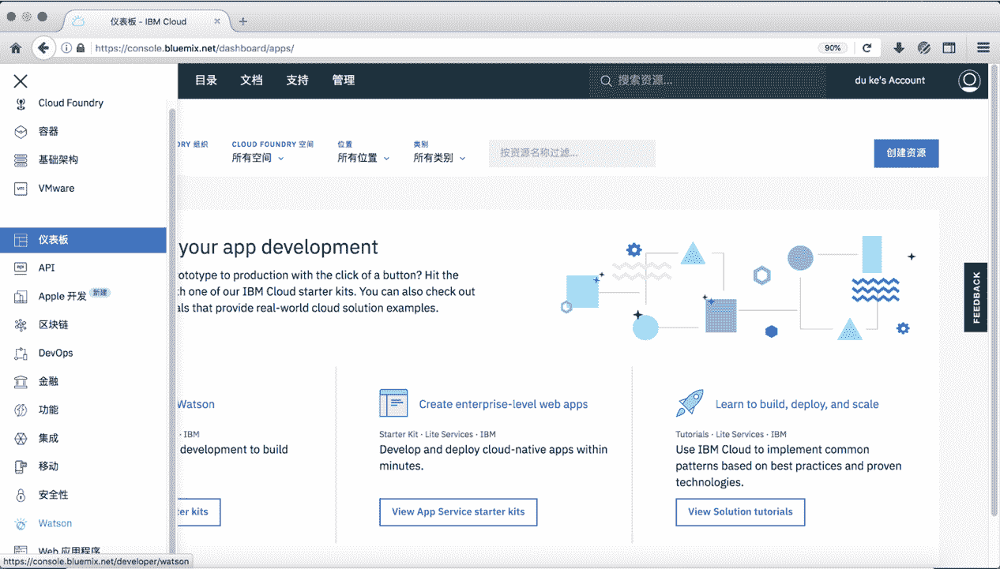
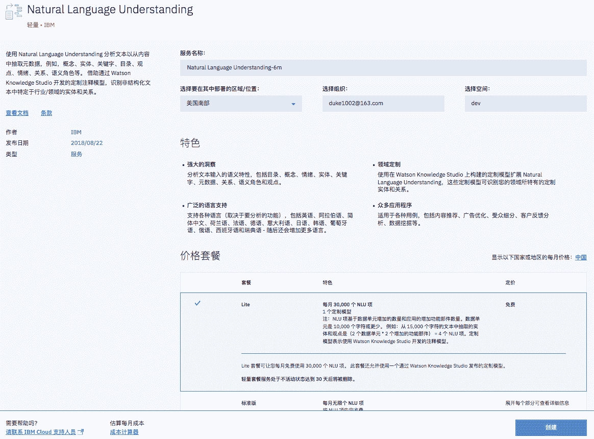
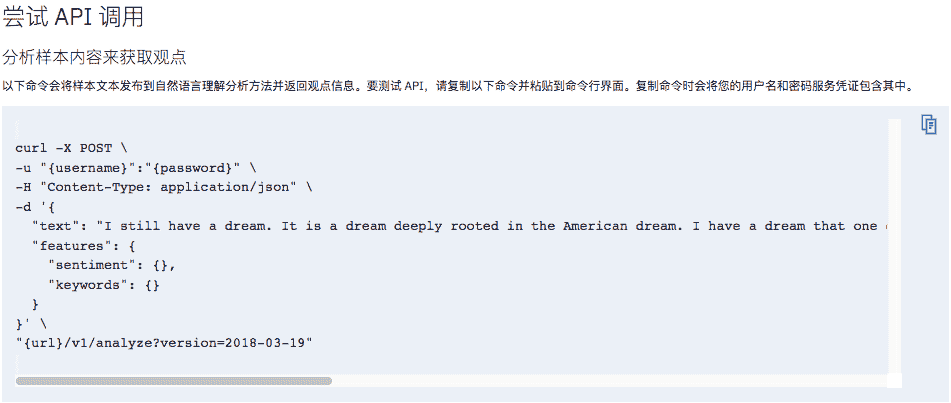
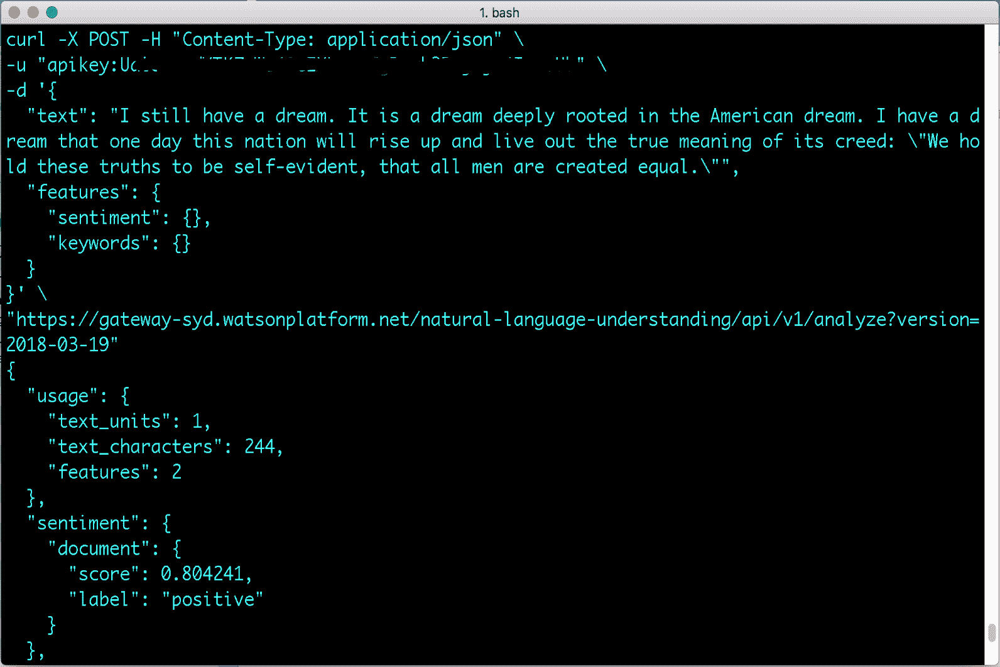
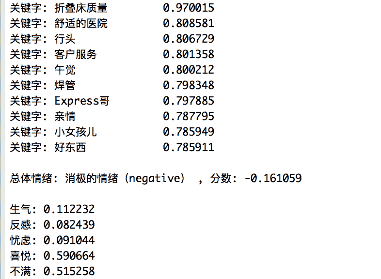
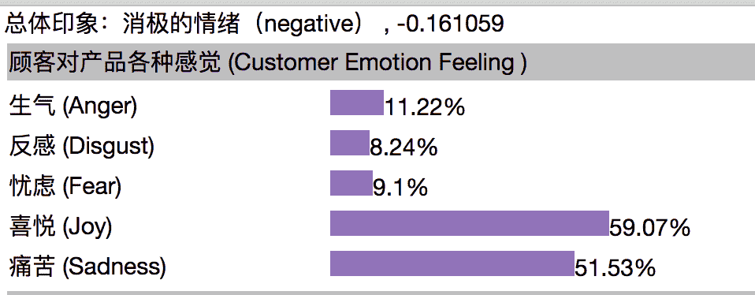
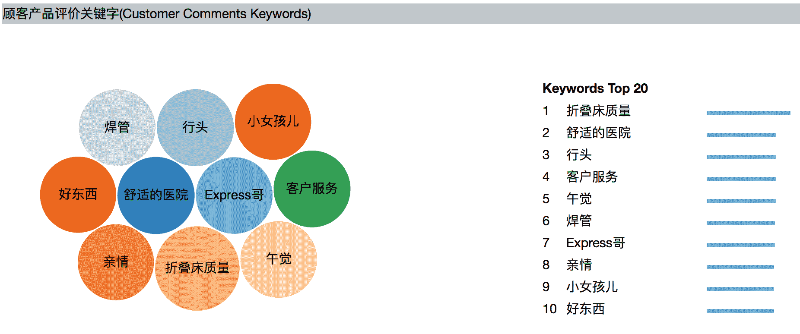
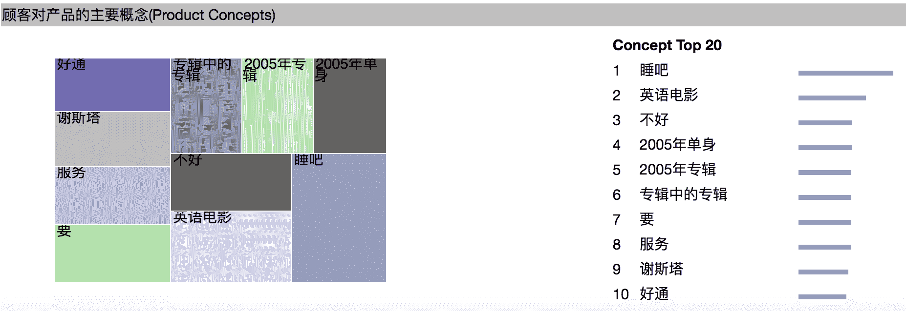

# 使用 IBM Watson API 分析淘宝用户评论

> 原文：[`developer.ibm.com/zh/articles/cl-lo-analyze-user-reviews-using-ibm-watson/`](https://developer.ibm.com/zh/articles/cl-lo-analyze-user-reviews-using-ibm-watson/)

本文使读者了解和基本掌握如何使用 IBM Watson API 开发具体的商业应用，了解如何使用 Watson API SDK 编程，对在线商品的用户评论数据进行分析，并且通过图形化的方式展现出来。

## 应用场景

现在许多应用平台都会有用户评价的功能，一般的计算机程序只能对商品评论区中的评级打分进行汇总分析，如顾客对商品的评价 1 到 5（坏到好）这样的固定数值，这样的汇总非常简单，无法更深入的了解顾客对产品切身使用感受。而通过 IBM Watson 自然语言处理 API 编程，可以从客户的评论话语中提炼出顾客对产品的各种感受，找出关键词组和关注点，甚至可以洞察顾客的性格特征。这将能够为商家或厂商带来以下的好处：

*   了解顾客对这个产品的总体感觉如何。
*   了解什么样类型的顾客喜欢这个产品。
*   通过总结出的关键字和概念标签，了解顾客对产品最主要和直接的感受有哪些。
*   通过各个产品之间的比较，从顾客角度了解各种产品之间的差异是什么。
*   帮助营销人员更加深入的了解他们的顾客特征，以及对顾客类型的分析。
*   了解客服人员与客户沟通的不足之处并加以改善。

## 设计思路

为实现对在线商品评论信息的分析，我们主要使用 3 个 Watson API：

*   [Natural Language Understanding](https://cloud.ibm.com/catalog/services/natural-language-understanding?cm_sp=ibmdev-_-developer-articles-_-cloudreg) ：自然语言理解 API，这个 API 的输入是一段文本，输出是对这段文本的分析结果，如情感，情绪，关键词，主要概念等信息。
*   [Tone Analyzer](https://cloud.ibm.com/catalog/services/tone-analyzer?cm_sp=ibmdev-_-developer-articles-_-cloudreg) ：语调分析 API，这个 API 分析和识别语言中的各种语调，它可以检测出三种语调：情绪、社交倾向性以及语言风格，其中社交倾向性分为开放性、尽责性、外倾性、随和性和情绪程度，这可以帮助分析商品评论的回复内容或者在线客服回复的文字内容，针对每个客服的语气分析，可以优化和改进沟通效果。
*   [Language Translator](https://cloud.ibm.com/catalog/services/language-translator?cm_sp=ibmdev-_-developer-articles-_-cloudreg) ：由于 Natural Language Understanding API 的输入是英文，所以使用这个 API 将评论翻译为英文再分析。

IBM Watson 与 IBM Cloud 云平台集成，所以 IBM Watson 的 API 通过云的方式提供给开发人员使用，只需要在 IBM Cloud 云平台开通相应的 Watson 服务，就可以通过 REST，Java SDK 等方式调用。

**免费试用 IBM Cloud**

利用 [IBM Cloud Lite](https://cocl.us/IBM_CLOUD_GCG) 快速轻松地构建您的下一个应用程序。您的免费帐户从不过期，而且您会获得 256 MB 的 Cloud Foundry 运行时内存和包含 Kubernetes 集群的 2 GB 存储空间。

本文主要介绍 Watson API，所以商品评论内容的抓取不在讨论范畴，读者可以通过网页读取程序自动或手动的将某商品评论信息保存到文本文件中即可。

我们将程序分为三个模块：

1.  评论翻译模块，调用 API 将翻译的结果作为下一步评论分析模块的输入。
2.  评论分析模块，调用 API 分析这些数据，获取顾客的感受，评价关键字，性格类型等信息，然后将返回结果封装。
3.  通过 Web 页面展示分析结果，本文使用 D3.js 可视化组件展现分析的结果数据。

## 配置 IBM Watson 服务

Watson API 通过 IBM Cloud 平台以云的方式提供服务，所以要首先设置 IBM Cloud 账户，登录 [IBM Cloud](https://cocl.us/IBM_CLOUD_GCG) 注册账户（如果已经有账户则直接登录），登录后如图 1：

##### 图 1\. 登录 IBM Cloud



点”目录”，会显示所有 IBM Cloud 的服务列表，进入 “AI” 类别，里面包含了所有的 Watson 服务。如图 2 所示：

##### 图 2\. AI 目录中的服务


### 创建 Natural Language Understanding 服务

从 AI 目录中选择 “Natural Language Understanding”，打开界面，可以查看说明和开发文档，并且按照需求选择开通。如图 3 所示：

##### 图 3\. Natural Language Understanding 服务面板



开通后，系统会给出该服务的远程调用信息，包括调用地址（即 End Point）、用户名和密码（根据账户的地址不同，有时候不是提供用户名和密码，而是一个 API 连接密钥，两种方式都可以正常连接 API），如图 4 所示，默认为了安全用户名和密码隐藏了，点”显示”按钮则可以显示出实际内容。

##### 图 4\. 远程调用参数


系统也会给出直接调用 REST API 的 curl 命令示例，该命令直接通过 REST 访问 API，如下图 5 所示：

##### 图 5\. 通过 REST 调用 API



在命令终端通过 curl 命令访问，返回 JSON 格式的结果，如下图 6 所示：

##### 图 6\. REST 调用 API 示例



具体 REST 说明可以点 [入门教程](https://cloud.ibm.com/docs/services/language-translator/getting-started.html#gettingstarted) 和 [API 参考资料](https://www.ibm.com/watson/developercloud/language-translator/api/v2/curl.html?curl)查看。

### 创建 Tone Analyzer 服务

从 AI 目录中选择 “Tone Analyzer”，打开 Tone Analyzer 界面，可以查看说明和开发文档，并且按照需求选择开通。详细说明与 REST 调用方法与 Natural Language Understanding 服务类似，不在阐述。详细介绍请点[这里](https://cloud.ibm.com/catalog/services/tone-analyzer?cm_sp=ibmdev-_-developer-articles-_-cloudreg)查看。

### 创建 Language Translator 服务

从 AI 目录中选择 “Language Translator”，打开 Language Translator 界面，可以查看说明和开发文档，并且按照需求选择开通。详细说明与 REST 调用，与 Natural Language Understanding 服务类似，不再阐述。详细介绍请点[这里](https://cloud.ibm.com/catalog/services/language-translator?cm_sp=ibmdev-_-developer-articles-_-cloudreg)查看。

## 使用 Java SDK 开发

IBM Wason 提供了 Android、Java、Node.js、Python 和.NET 等十多种类型的软件开发工具包（SDK），可以支持很多开发语言以及移动和桌面应用开发，具体可以打开[这里](https://cloud.ibm.com/docs/services/watson?topic=watson-using-sdks#sdks)查看。

本文使用 Java 语言开发，所以首先要配置 IBM Watson 的 Java SDK，配置方法这里介绍常用的两种：

1.  通过 Maven 的方式将 IBM Watson Java SDK 的 Jar 包引入 Java 项目中，如清单 1 中所示：

    **清单 1\. 通过 Maven 引入 Java SDK 包**

    ```
    <dependency>
    <groupId>com.ibm.watson.developer_cloud</groupId>
    <artifactId>java-sdk</artifactId>
    <version>6.8.0</version>
    </dependency> 
    ```

2.直接下载已经包含依赖的 Java SDK Jar 包并导入到 Java 项目中，下载地址为： [`github.com/watson-developer-cloud/java-sdk/releases/download/java-sdk-6.8.0/java-sdk-6.8.0-jar-with-dependencies.jar`](https://github.com/watson-developer-cloud/java-sdk/releases/download/java-sdk-6.8.0/java-sdk-6.8.0-jar-with-dependencies.jar)

更多 IBM Watson Java SDK 的安装方式和说明，请点 [这里](https://github.com/watson-developer-cloud/java-sdk) 查看。

每个 Watson 服务的 Java SDK API 使用方法大致相同，只是根据不同的服务会有一些不同的参数，代码大致分为以下三部分：

*   配置远程调用参数，如认证信息（用户名密码或者密钥）、云端调用地址、版本等。
*   创建响应的 Watson 服务对象。
*   设置每个服务自身的参数或输入数据，调用服务返回结果。

下面介绍如何使用 Language Translator 和 Natural Language Understanding API 的 Java SDK 来处理和分析商品评论。

## 使用 Language Translator API 翻译评论

开通 Language Translator 服务后，可以从服务页面中得到版本，认证信息（用户名密码或者密钥）和云端调用地址三个远程调用参数信息，然后将这些调用参数集中配置到 IamOptions 对象中，如下清单 2 中代码所示：

##### 清单 2\. 配置远程调用信息

```
// API 版本,参考 API 手册
String version = "2018-05-01";

// 密钥，此处代码隐藏了实际的密钥值，应该填写你开通这个服务后分配的密钥
String api_key = "......................................." ;

// API 调用地址，系统分配
String end_point = "https://api.au-syd.language-translator.watson.cloud.ibm.com/api";

// 将参数集中放置到 IamOptions 对象中
IamOptions options = new IamOptions.Builder().apiKey(api_key).build(); 
```

接着，在代码清单 3 中，创建 Watson Language Translator 服务对象

##### 清单 3\. 配置 Watson Language Translator 服务

```
// 创建 Language Translator Service
LanguageTranslator languageTranslatorService = new LanguageTranslator(version, options);

// 设置 API 调用地址，填写系统分配给你的 end point
languageTranslatorService.setEndPoint(end_point); 
```

创建一 LanguageTranslator 类型的 Service 对象，创建的时候要将 API 版本和上面的 IamOptions 对象实例作为对象创建参数，然后再给服务分配远程调用地址 end_point。接下来，就可以使用这个服务了。

注意，如果采用用户名密码登陆，则按照代码清单 4 中的方式配置：

##### 清单 4\. 调用翻译服务

```
LanguageTranslator languageTranslatorService=new LanguageTranslator ("{version}","{username}","{password}"); 
```

将保存到文件中的商品评论信息读出，作为 Watson Language Translator 服务的输入，如清单 5 所示：

##### 清单 5\. 读取评论内容

```
StringBuffer text= new StringBuffer("");
File commentfile = new File("/data/comments_demo.txt");
BufferedReader reader = new BufferedReader(new FileReader(file));
String tempString = null;
while ((tempString = reader.readLine()) != null) {
text.append(tempString);
}
reader.close(); 
```

从保存的某商品评论文件”商品编号.txt”中读取内容到一个 StringBuffer 对象中，作为接下来的翻译输入文字。接着设置 Language Translator 服务自身的参数和输入，调用服务返回结果。如清单 6 所示：

##### 清单 6\. 翻译结果返回

```
// 翻译选项：数据源类型、源语言与目标语言等
TranslateOptions translateOptions = new TranslateOptions.Builder()
          .addText(text.toString())
          .modelId("en-zh")
          .build();

// 调用 Service 开始翻译并且得到结果对象 result
TranslationResult result = languageTranslatorService.translate(translateOptions).execute();

//翻译结果
TranslationResult result = languageTranslatorService.translate(translateOptions).execute();
String output = result.getTranslations().get(0).getTranslationOutput();
System.out.println("output: "+output);

// 将结果转化为 JSON 格式的字符串
System.out.println(result.toString()); 
```

对于翻译服务 API，要创建一个 TranslateOptions 对象作为服务的参数，在 TranslateOptions 对象实例 translateOptions 中，主要调用 2 个方法设置输入和语言参数：

*   addText(text.toString())：输入要翻译的文本，这里是之前从文件中读取的内容。
*   modelId(“en-zh”)：设置翻译的语种，这里是 en-zh，即英文翻译为中文。

然后，调用 LanguageTranslator 服务的 execute() 方法开始翻译并且得到返回结果，返回结果是一个 TranslationResult 类型的对象，从这个对象的 getTranslationOutput() 方法得到翻译结果文本。也可以通过 toString() 方法得到和用 REST 调用返回结果一样的 JSON 格式的字符串。

## 使用 Natural Language Understanding 理解商品评论

### Natural Language Understanding 介绍

Natural Language Understanding API 是本文主要使用的 API，通过这个 API，开发人员能够分析文本输入的语义特征，包括类别、概念、情感、实体、关键字、元数据、关系、语义角色和情感。它的输入可以是文本、HTML 或公共 URL，并指定以下一个或多个要分析的特征：

*   类别（Categories）

使用五级分类层次结构对内容进行分类。点[这里](https://cloud.ibm.com/docs/services/natural-language-understanding?topic=natural-language-understanding-categories-hierarchy)可以查看完整的类别列表。例如： 输入新闻网址：`www.cnn.com`，则 API 的响应类别如下：

/news

/art and entertainment

/movies and tv/television

/news

/international news

API 能识别出网站或者文本的分类信息，可以实现一些自动分类和检索的任务。

*   情感（Emotion）

分析短语或文档整体所传达的情感。这里会把情感分为 5 种类型：生气（anger）、反感（disgust）、忧虑（fear）、喜悦（joy）和不满（sadness），这种分析可以帮助我们分析顾客的商品评论来洞察顾客对商品和服务的态度。并且每种情感有评分，评分越高，代表该情感越强烈。比如输入”这个商品的质量令人很满意，但是快递太慢了”，指定特定短语”产品”和”快递”，返回结果为：”产品”: joy，”快递”: anger。说明这个顾客对产品比较满意，但对快递运输不是很满意。

*   情绪（Sentiment）

分析具体目标短语的情感和文档的整体情感。这里和情感不同的是，它通过文字检测出整体所表达的态度，如是积极的、消极的或者中立的。例如还是输入”这个商品的质量令人很满意，但是快递太慢了”这句话，返回结果为：消极的（negative），分数: -0.603192，分数越高，表示这个态度越强烈。如下图 7 所示：

##### 图 7\. 情绪 API REST 返回结果


*   实体（Entities）

查找您的内容中提到的人、地点、事件和其他类型的实体。例如：输入: “IBM 是一家总部设在美国纽约阿蒙克的美国跨国公司，业务遍布 170 多个国家”，则返回结果为：

IBM: 公司

Armonk: 地点

New York: 地点

United States: 地点

这样的实体识别，能够帮助实现语义分析，然后进一步实现文本自动分类、人机交互等应用。

*   关键词（Keywords）

搜索文本内容以获取相关关键词。例如输入文字：”这个商品的质量令人很满意，但是快递太慢了”，返回结果为：

快递: 0.981768

质量: 0.570591

产品: 0.566909

通过关键词分析，能够识别一段文本中的要点关键词，可以进一步帮助分析情绪产生的原因。

*   概念（Concepts）

识别文字中的高级概念，并且有的概念不一定在文本中直接引用的。

*   元数据（Metadata）

对于 HTML 和 URL 输入，获取网页的作者、页面标题和发布日期。也可以实现自动文本网页分类。

*   语义角色（Semantic Roles）

将句子解析成对象动作对象形式，并识别作为动作的对象或对象的实体和关键字。例如：

输入: “去年，王小明买了一辆雪佛兰牌的车”，返回结果为：

主体: 王小明

动作: 购买

对象: 雪佛兰车

这样的分析能够帮助我们实现语义分析与人机交互程序如机器人等小程序。

### 分析商品评论

Natural Language Understanding 是专门理解自然语言的认知程序 API，由于它可以对商品评论信息做出深入和多个维度的洞察，用户可以自由选择分析维度和深度，所以相比语言翻译接口的使用要稍微复杂些。但总体还是包含上面说的三个部分，下面我们介绍如何使用这个接口来处理商品评论信息。

首先，如清单 7 所示先配置远程调用参数：

##### 清单 7\. 配置 NLU 服务的远程调用参数

```
// API 版本,参考 API 手册
String version = "2018-03-19";

// 密钥，此处代码隐藏了实际的密钥值，应该填写你开通这个服务后分配的密钥
String api_key = "......................................." ;

// API 调用地址，系统分配
String end_point = "https://api.au-syd.natural-language-understanding.watson.cloud.ibm.com/api";
IamOptions options = new IamOptions.Builder().apiKey(api_key).build(); 
```

接着，如清单 8 所示创建 Natural Language Understanding 服务对象，并且设置调用参数和调用地址：

##### 清单 8\. 创建 Natural Language Understanding 服务对象

```
NaturalLanguageUnderstanding service = new NaturalLanguageUnderstanding(version,options);
service.setEndPoint(end_point); 
```

Natural Language Understanding 接口能够分析文本输入的多种语义特征，所以，还需要根据业务需要指定一个或多个要分析的特征。这里，由于我们要分析商品评论，所以本例从情绪、情感、概念和关键字这 4 个维度分析，就要设置这 4 个维度特征的参数，具体代码如清单 9 所示：

##### 清单 9\. 配置特征参数

```
// 设置情绪（Emotion）参数
EmotionOptions emotionOptions = new EmotionOptions.Builder().build();

// 设置情感（Sentiment）参数
SentimentOptions sentimentOptions = new SentimentOptions.Builder().build();

// 设置概念（Concepts）参数
ConceptsOptions conceptsOptions = new ConceptsOptions.Builder().limit(10).build();

// 设置关键字（Keywords）参数
KeywordsOptions keywordsOptions = new KeywordsOptions.Builder()
          //.emotion(true).sentiment(true)
          .limit(10).build(); 
```

本例中，每个参数根据其自身的特征，有不同的设置方法：

*   情绪（Emotion）参数：只需要创建一个 EmotionOptions 对象。
*   情感（Sentiment）参数：只需要创建一个 SentimentOptions 对象。
*   概念（Concepts）参数：创建一个 ConceptsOptions 对象，并且可以设置返回概念最大数量。
*   关键字（Keywords）参数：创建一个 KeywordsOptions 对象，并且可以设置返回关键字最大数量，该参数也可以设置是否为每个实体返回情绪（Emotion）特征数值或情感（Sentiment）特征数值。

然后，为了使最终服务调用的参数简单，还需要将上面这些参数集中加入到一个 Features 对象中，如清单 10 所示：

##### 清单 10\. 配置 Features 对象

```
Features features = new Features.Builder()
          .concepts(conceptsOptions)
          .emotion(emotionOptions)
          .keywords(keywordsOptions)
          .sentiment(sentimentOptions)
          .build(); 
```

最后，如清单 11 所示，用要分析的商品评论文本和上面包装后的参数，创建一个 AnalyzeOptions 对象，再调用 NaturalLanguageUnderstanding 服务的 analyze 方法进行分析，得到返回结果是一个 AnalysisResults 对象。

##### 清单 11\. 开始分析并返回结果

```
// 参数
AnalyzeOptions parameters = new AnalyzeOptions.Builder()
          .text(text)
          .features(features)
          .build();

// 结果
AnalysisResults result = service.analyze(parameters).execute();

Double anger1 = result.getEmotion().getDocument().getEmotion().getAnger();
Double joy1 = result.getEmotion().getDocument().getEmotion().getJoy();
String sentiment1 = result.getSentiment().getDocument().getLabel();
Double sentiment1Value = result.getSentiment().getDocument().getScore();
String categories1 = result.getCategories().get(0).getLabel();
String keyword1 = result.getKeywords().get(0).getText(); 
```

用要分析的商品评论文本和上面包装后的参数，创建一个 AnalyzeOptions 对象 parameters，再调用 NaturalLanguageUnderstanding 服务的 analyze 方法进行分析，返回结果是一个 AnalysisResults 对象实例，可以得到设置的各个特征的返回值：

*   情绪（Emotion）：getEmotion().getDocument().getEmotion()能得到五种情绪的分值，如 getAnger()得到生气的分值，getJoy()得到喜悦的分值，数值越大，该情绪的比重越高。
*   情感（Sentiment）：getSentiment().getDocument()得到情感结果，getLabel()返回情感类型，getScore()返回该情感的分数，分数越大，该情感越强烈。
*   概念（Concepts）：getCategories()得到概念列表。
*   关键字（Keywords）：getKeywords()得到关键字列表。

## 使用 Tone Analyzer API 分析评论回复特征

使用 Tone Analyzer API 分析评论中的回复人员的语气特征，不仅能分析出与 Natural Language Understanding 一样的情绪特征，还能识别出文字的社交倾向性，即开放性、尽责性、外倾性、随和性这些 [人格五因素](https://baike.baidu.com/item/五因素人格) ，这可以帮助分析商品评论的回复内容或者在线客服回复的文字内容，针对每个客服的语气分析，可以优化和改进沟通效果。这个 API 的 Java SDK 的使用与前面的 Natural Language Understanding 类似，本文就不再阐述了。读者可以在[这里](https://cloud.ibm.com/catalog/services/tone-analyzer?cm_sp=ibmdev-_-developer-articles-_-cloudreg)开通 Tone Analyzer API 以及查看的详细介绍。以及查看[使用文档](https://cloud.ibm.com/docs/services/tone-analyzer?topic=tone-analyzer-gettingStarted)和在查看 [SDK 使用参考](https://www.ibm.com/watson/developercloud/tone-analyzer/api/v3/) 。

## 商品评论分析示例

现在，我们来具体举个例子分析一段商品评论信息，拷贝一段关于某件折叠床商品的评论信息保存到文件中，清单 12 展示了部分评论内容，完整内容请见本文附件中的 comments_demo.txt 文件。

##### 清单 12\. 商品评论内容片段

```
......
真心无语,而且收到配件才发现，原来管子这么薄。
很好不错。躺着舒服。这个划算
纸箱破损，折弯不对称掉漆，坐了一会步就打皱了
使用焊管子做产品也就算了，管子居然不到 1.5mm。最多 1.2mm
收到货啦，打开非常满意，同事看到也想要买一个，已经分享链接给同事啦
买来公司值班用的
挺满意的 小巧方便
好坑啊 刚买两天就坏了 让给补发个床布 都好几天了 也没有影
...... 
```

然后通过上面介绍的代码分析这段评论，经过程序分析，我们看看输出的关键字、情绪和情感特征结果，如图 8 所示：

##### 图 8\. 商品评论文本分析返回结果



从结果看,顾客的总体情绪为消极的，顾客对这款折叠床总体满意度不是很高，从情绪特征值也可以更加体现出来，生气和不满的比例相对较多，而满意的也有，但比例不高。然后进一步从关键字分析，顾客的情绪来源主要体现在折叠床的质量、客户服务和焊接等方面，而满意的方面体现在适合在医院使用、方便午休和小巧等方面。如果再结合 Tone Analyzer API 分析顾客和客服人员回复语言的性格特征，就又能分析哪种类型顾客更愿意购买，以及反之哪种类型顾客偏少。从上面的分析，可以帮助商家改进商品定位、找到服务质量的薄弱环节、扩大商品销售人群以及如何规范与改进客服服务流程等。

## 图形展示数据

最后，上面直接输出的结果太过枯燥不直观，最好用图形的方式展现出来。比如用类似 D3.js 这样的可视化库展现。首先，我们要将上面的内容封装起来传送到客户浏览器端的 Web 页面展示。封装一个 ProductCommentAnalysis 类供 Web 端的 JSP 调用，该类根据产品编号读取对应的评论文件，然后调用 Watson API 执行分析，将结果放入一个 HashMap 中，如清单 13 所示：

##### 清单 13\. 传送结果到 Web 端

```
HashMap result = new HashMap();
result.put("nluResult", nluResult);
result.put("conceptResults", conceptResults);
result.put("keywordResults", keywordResults);
result.put("sentimentLabel", sentimentLabel); 
```

然后，在 Web 端读取 HashMap 中的这些返回结果，再用 D3.js 可视化组件展现出来，如于情绪的展现如图 9 所示：

##### 图 9\. 图形化展示情绪与情感分析结果



对于关键字，使用如下图 10 中的圆圈图形展示，圆圈越大表示关键字出现的频率越高。

##### 图 10\. 图形化展示关键字分析结果



对于主要概念，使用方块图展示，同样也是面积越大，其表示的概念越突出，如图 11 所示：

##### 图 11\. 图形化展示主要概念分析结果



以上图形展示代码这里不作为重点讲述，读者可以在本文附件中 WebContent 目录中查看。

## 结束语

本文介绍了几种 IBM Watson API 来分析商品评论，可以帮助商家从自然语言认知的角度去理解客户和自身的服务，如果再结合商家自己的相关数据以及如大数据，深度学习等技术，会得到更加有用的数据。同时，IBM Cloud 提供了丰富的 Watson 认知服务，很多都可以用来帮助商家开发出更有用的商业应用，本文仅是起个抛砖引玉的作用了。本文作者通过自身对 IBM Watson 的学习、理解与应用而书写，肯定会有一些不足之处，欢迎读者批评指正，谢谢。

本文的解决方案和示例代码，仅代表作者个人观点。

## 参考资源

*   参考 [IBM Watson 全球主页](https://www.ibm.com/watson/) （英文）了解更多 Watson 的信息
*   参考 [Natural Language Understanding API 说明](https://www.ibm.com/watson/developercloud/natural-language-understanding/api/v1/) 了解 Natural Language Understanding API 开发详情
*   查看 [Tone Analyzer API 使用文档](https://cloud.ibm.com/docs/services/tone-analyzer?topic=tone-analyzer-gettingStarted) 和 [Tone Analyzer SDK 使用参考](https://www.ibm.com/watson/developercloud/tone-analyzer/api/v3/curl.html?curl) 。

## Download

[code.zip](http://www.ibm.com/developerworks/cn/cloud/library/cl-lo-analyze-user-reviews-using-ibm-watson/code.zip)