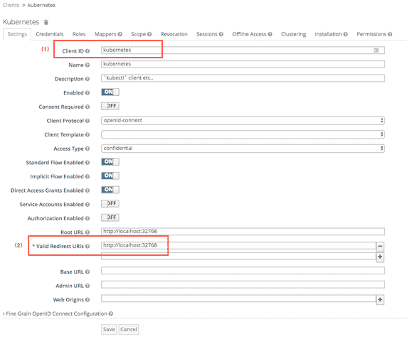
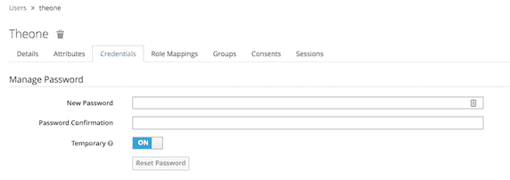
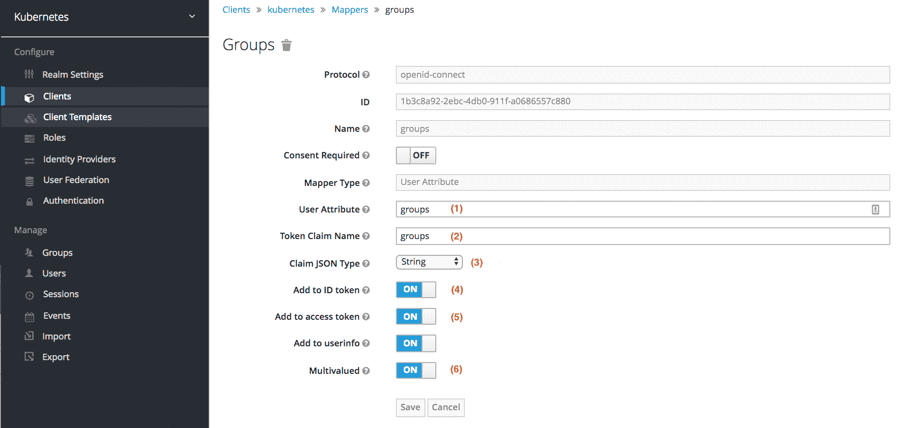

# 使用 OpenID Connect Token 进行 Kubernetes 身份认证和授权

> 原文：[`developer.ibm.com/zh/articles/cl-lo-openid-connect-kubernetes-authentication2/`](https://developer.ibm.com/zh/articles/cl-lo-openid-connect-kubernetes-authentication2/)

## 前言

Kubernetes 本身几乎不提供任何**用户身份管理**和**认证功能**（Authentication）。除了服务账户（Service Account）外，所有的用户信息都依赖外部的用户管理系统来存储，使用相应的认证插件来进行认证。基于 OpenID Connect（OIDC）Token 的认证和授权是 Kubernetes 支持的、适用于严肃生产环境的认证解决方案。

在本文第一部分 [“为 Kubernetes 搭建支持 OpenId Connect 的身份认证系统”](http://www.ibm.com/developerworks/cn/cloud/library/cl-lo-openid-connect-kubernetes-authentication/index.html) 中，我们对基于 OIDC 协议的身份认证的基本原理和典型工作流程做了介绍，并亲手搭建了一个基于 Keycloak 的 Identity Provider（IdP）。在第二部分中，我们将对 Kubernetes 部分的配置原理进行介绍，并通过一个示例系统介绍 Kubernetes 和 IdP 的集成步骤。同时，我们将结合 Keycloak 用户管理，对 Kubernetes 授权做简要介绍。

## 在 Keycloak 中进行用户和客户端（Client）管理

本质上来讲，Keycloak 能够实现的功能包括：用户管理、客户端（Client）管理和提供身份认证服务。Kubernetes 本身并不维护任何 User Account 的信息，在本示例系统中，所有的用户管理都委托给 Keycloak。因此，我们需要先在 Keycloak 中创建几个示例 Resource，如 User，Client Id 等 。

## 注册 Client

如在第一部分中介绍的，任何希望使用 Identity Provider（IdP）进行身份认证的应用程序都需要事先在该 IdP 上注册自己，获取一个 Client Id，IdP 仅接受那些注册过的 Client 向其发起认证请求。Client Id 仅在 Kubernetes API Server 中需要，无论我们通过什么客户端来向 IdP 请求获取 Id Token，都要出示合法的 Client Id。

因此，我们要先在 Keycloak 中注册一个合法的 Client。过程非常简单，在 Keycloak 中进入我们之前创建的 “kubernetes realm” 管理界面，选择左侧的 “Clients” 管理界面，通过 “Create” 操作创建一个新的 Client，如下图 1 所示。我们给新 Client 起名叫做 “kubernetes”。创建 Client 时我们需要特别注意以下几个信息：

##### 图 1\. 在 Keycloak 中创建 Client，一些我们需要输入的关键信息



*   ***Client Id* ：** Client Identification，在注册 Client 时，可以由用户自己提供，在上图配置页面中位置 (1) 处设置。
*   ***Valid Redirect URL：*** 在第一部分中，我们已经详细介绍了 Redirect URL 的重要性，它是 OIDC 安全性保证的一个重要环节。特别是对于 web 应用来说，Keycloak 只会把各种 token 返还给 Client 和 Keycloak 预先约定好的 URL，防止有人冒用 Client 的身份来诱导客户进行认证操作并套取 token。Redirect URL 在上图位置 (2) 处设置。对于非 web 应用来说，OAuth2 协议还提供了另外一个直接获取 token 的授权模式，那就是 Password Grant Type，使用的是 IdP 的 “token/” endpoint，可以通过提供 User 和 Client 的双重用户名密码来直接获取 token，不用像 web 应用一样通过跳转到 IdP 的 身份认证界面来引导客户手动认证（用户名密码）。这种方式非常适用于像 Kubernetes kubectl 这样的非 web 应用。在本文的示例系统中，我们就采用 Password Grant Type 的认证流程，因此这里设置的 Redirect URL 的有效性并不十分重要，但是其作为创建 Client 的必选项，它的存在很重要，我们这里顺带对它进行一下介绍。
*   ***Client Secret：*** Client 本身也需要认证，向 IdP 证明自己的合法性。Keycloak 支持多种认证形式，在 Client 创建界面的第二个 tab 页面 “Credentials” 里，您可以选择不同的认证形式，如下图 2 所示。这里我们选择 “Client Id and Secret”，也就是用户名密码认证。记下这个 credential，我们会在之后获取 token 的过程中用到它。

##### 图 2\. 在 Keycloak 中设置 Client 认证方式，获取 Client secret


## 创建一个 User

我们在 “Kubernetes realm” 下创建一个测试用户（User）”theone”。除了用户名之外，全部使用默认属性即可。之后，我们可以在管理界面 “Manage -> Users” 里面，点击 “view all users”，找到新创建的 User，点开它来设置初始密码，如下图 3 所示。

##### 图 3\. 在 Keycloak 中修改用户密码



需要特别注意的是，用户创建完成后要先激活才能使用。默认激活的方法是，打开 “kubernetes realm” 的控制台:`https://1.2.3.4:8443/auth/admin/kubernetes/console`，使用新创建的用户 “theone” 和我们刚刚重置的密码进行登录，您就能看到下图 4 所示的再次修改密码并激活用户的提示。

##### 图 4\. 激活 Keycloak 用户


## 配置 kubernetes API Server

在 Keycloak 中创建好用户和客户端相关资源后，我们可以开始配置 Kubernetes 了 。关于 Kubernetes 使用 OpenID Connect Token 的 [官方使用说明](https://kubernetes.io/docs/reference/access-authn-authz/authentication/) 非常简略，相关的工作原理已经在第一部分中介绍了，这里我们先对 API Server 端的各配置参数做一个解释。本示例系统中使用的 Kubernetes Server，Kubectl 版本均为 “v1.9.3″。

##### 表 1\. Kubernetes API Server OIDC 相关配置参数

| **参数** | **描述** | **例子** | **必须** |
| --- | --- | --- | --- |
| –oidc-issuer-url | IdP (本例子中为 Keycloak) 提供的 URL，用于获取对来自该 IdP 的 JWT token 进行签名的证书。像前面反复提到的，URL 必须使用 SSL 协议 https:// 进行访问。通常来说，这个 URL 就是 IdP 的 [Discovery URL](https://auth0.com/docs/protocols/oidc/openid-connect-discovery) ，但是去掉所有的 Path 部分，例如： [`accounts.google.com`](https://accounts.google.com) 或者 [`login.salesforce.com`](https://login.salesforce.com) 。 这个 URL 设置为 .well-known/openid-configuration 的下一级 URL 即可。 | 下面是官方文档给出的例子： 如果 Discovery URL 是 `https://accounts.google.com/.well-known/openid-configuration`。那么本参数应该设置为 [`accounts.google.com`](https://accounts.google.com) 。 在本文示例中本参数应设置为：`https://1.2.3.4:8443/auth/realms/kubernetes`。 您一定会有兴趣看看 Keycloak 的 Discovery URL：`https://1.2.3.4:8443/auth/realms/kubernetes/.well-known/openid-configuration`。 | 是 |
| –oidc-client-id | 这里需要设置的就是我们之前在 Keycloak 中创建的 Client Id。 | kubernetes | 是 |
| –oidc-username-claim | Claim 是 OIDC 中的概念，本参数和下面三个参数其实是一组参数，我们将在下文中详细介绍。 | sub | 非 |
| –oidc-username-prefix | 我们将在下文中详细介绍。 | oidc: | 非 |
| –oidc-groups-claim | 我们将在下文中详细介绍。 | groups | 非 |
| –oidc-groups-prefix | 我们将在下文中详细介绍。 | oidc: | 非 |
| –oidc-ca-file | 本参数设置为签发 IdP Certificate 的 CA Certificate 的全路径。对私有 CA 签发的 Certificate 来说，本参数可以设置为以下任一种证书： *签发 IdP Certificate 的私有 CA Certificate。* IdP Certificate。 | 本示例系统中，可选用以下任意一种设置： */etc/kubernetes/ssl/ca.pem* /etc/kubernetes/ssl/keycloak.crt | 非 （如果不指定，默认将使用 api-server 所在系统的 root CA。对于使用私有 CA 的情况并不适用。） |

在第一部分中我们介绍过，用户在通过身份认证后，IdP 会授予用户一组 token，包括 acccess_token，refresh_token (可选)，id_token 等。任何持有这些 token 的客户端应用都可以以该用户的身份获取资源了。这其中，我们重点要关注的是 id_token，Kubernetes 正是通过验证 id_token 来判断访问是否合法，并鉴别是哪个用户发起的访问请求。之所以能实现这些功能，是因为 id_token 中存放着很多格式化信息，这些信息会被 Kubernetes 作为”用户名（Username）”或者” 用户分组（Group）” 信息，而之后这些信息也是进行 **授权** （ **Authorization** ）的基础依据。那么，id_token 具体长什么样子呢？

id_token 是一种 [JSON Web Token (JWT)](https://jwt.io/introduction/) 。JWT 是 一个开放标准 ([RFC 7519](https://tools.ietf.org/html/rfc7519))，是通过一种紧凑、自洽的方式定义了在多点间以安全协议传输 JSON 对象的方法。这种 JSON 对象是经过数字签名的，因此是可被验证的、可信的。JWT 可以使用对称加密算法（算法 HMAC）加密，或者更常见地使用 RSA 算法——Public/Private 秘钥对来加密。JWT 由三个部分组成：

*   Header — 记录加密算法。
*   Payload — 记录了各种 RFC 7519 规定的或用户自定义的信息域，称为 “Claim”。
*   Signature — 对整个 token 的签。

我们随后会去获取一个 id_token，您可以去解码看一下里面究竟存了什么样的信息。JWT 使用 base64url 编码，但是比较特殊的是，它的三个部分被分别编码并且会有一些 padding，您可以在 [jwt.io](http://jwt.io) 上解码您的 token。我们这里给出用户 “theone” 的 id_token 解码后的 Payload 部分作为示例：

##### 清单 1\. JWT 示例

```
{
 "jti": "77895213-afea-4ba3-aec1-eeafc53d8d40",
 "exp": 1525158711,
 "nbf": 0,
 "iat": 1525158411,
 "iss": "https://1.2.3.4:8443/auth/realms/kubernetes",
 "aud": "kubernetes",
 "sub": "547cea22-fc8a-4315-bdf2-6c92592a6e7c",
 "typ": "ID",
 "azp": "kubernetes",
 "auth_time": 0,
 "session_state": "150df80e-92a1-4b0c-a5c5-8c858eb5a848",
 "acr": "1",
 "name": "the one",
 "preferred_username": "theone",
 "given_name": "the",
 "family_name": "one",
 "email": "theone@mycorp.com"
} 
```

如上所示，其中每一项数据就叫一个 Claim，而这些奇奇怪怪的 Claim 名称都有其固定的含义，他们一部分是 jwt [Registered Claims](https://tools.ietf.org/html/rfc7519#section-4.1) 中定义的, 一部分是 jwt 的 [Public Claim](https://www.iana.org/assignments/jwt/jwt.xhtml) 中定义的。了解了 Claim 的含义和内容之后，让我们再回过头来看到上面表 1 中的一些未解之谜：

##### 表 2\. Kubernetes API Server OIDC 配置参数中 JWT Claim 相关参数

| **参数** | **描述** | **例子** | **必须** |
| --- | --- | --- | --- |
| –oidc-username-claim | 该参数表示哪个 JWT Claim 被 Kubernetes 解析为 User name。默认使用 sub，它是一个 jwt Register Claim，应该被设置为终端用户唯一的 identifier。根据 IdP 的不同，我们也可以选择 name 或者 email。但是，如果这里我们选择了 email 之外的其它 Claim，为了保证 user name 的唯一性，username 前面会自动被添加上 IdP 的 issuer URL 作为前缀，构成一个唯一用户名。 | 从上面解码的 Keycloak 生成的 id_token 中，preferred_username Claim 中记录了用户名信息，在本示例中，我们选择它作为本参数值。 | 非 |
| –oidc-username-prefix | 用户名前缀，用来避免用户名冲突。比如说，将这个参数设置为”oidc:”，Keycloak 中通过认证的用户是 theone，Kubernetes 则会认为真正的用户为 oidc:theone。如果这个参数未被设置并且 –oidc-user-claim 被设置为 email 之外的其它值，那么系统会自动添加 issuer URL 作为用户名前缀，issuer URL 是在参数 –oidc-issuer-url 中指定的值。最后，我们可以通过指定参数”-”来禁止 Kubernetes 添加任何前缀。 | 本示例中，我们只创建了一个用户，不存在命名冲突。我们把本参数设置为”-”。 | 非 |
| –oidc-groups-claim | 同 –oidc-username-claim，该参数指定哪个 Claim 被作为用户分组（Group）信息。用户分组信息涉及到用户的授权管理，您可以看到，在上面的 Keycloak id_token 中并没有 Claim 明用户分组信息，那是因为我们没有在 Keycloak 端为新用户添加任何分组。我们稍后会在授权管理的部分介绍如何添加分组信息。本参数必须是一个数组。 | 我们先把该参数设置为 groups，稍后我们会介绍如何在 id_token 中建加上这个 Claim。 | 非 |
| –oidc-groups-prefix | 同 –oidc-username-prefix，Group name 的前缀，但没有默认值。 | 本示例中，该项可不设置。 | 非 |

在了解所有 Kubernetes API Server OIDC 相关配置参数的含义和示例值之后，我们可以着手在 Kubernetes server 上修改 API Server 的配置文件，具体修改内容如下：

##### 清单 2\. Kubernetes API Server 配置文件

```
# Configuration Path
/etc/kubernetes/manifests/kube-apiserver.yaml
|--------10--------20--------30--------40--------50--------60--------70--------80--------|
...
spec:
 containers:
 - command:
  ...
  - --oidc-issuer-url=https://1.2.3.4:8443/auth/realms/kubernetes
  - --oidc-client-id=kubernetes
  - --oidc-username-claim=preferred_username
  - --oidc-username-prefix=-
  - --oidc-ca-file=/etc/kubernetes/pki/ca.pem
  ... 
```

保存修改后的 Kubernetes API Server 配置文件，如果一切设置正确，api-server 会自动重启，并启用相应设置。

## 认证用户，获取 id_token

我们在第一部分中已经详细讲解了 OAuth 2.0 的身份认证流程，并举了一个 Implicit Grant Flow 的例子。但 Kubernetes 并不像 Web Browser 一样提供用户代理的功能，不存在将用户引导至 Auth Server 进行认证的功能，因此我们使用的是 OAuth 2.0 的 [Password Grant](https://www.oauth.com/oauth2-servers/access-tokens/password-grant/) 认证流程，这个流程完全发生在用户和 Auth Server 之间，Kubernetes 并不会参与其中。Password Grant 利用的是 OAuth 2.0 中 定义的 “/token” 服务端口，通过 User 和 Client Id 的双重用户名密码认证来获取 token。该端口的调用方法如下：

##### 清单 3\. OAuth 2.0 token 服务端口的调用方法定义

```
POST /oauth/token HTTP/1.1
Host: authorization-server.com
grant_type=password
&password=1234luggage
&client_id=xxxxxxxxxx
&client_secret=xxxxxxxxxx
&scope=opened 
```

对于 Keycloak 来说，最后一个 scope 参数是我们要特别指定的，它用来显式的要求 Keycloak 在认证成功后返回 id_token。让我们用 curl 来尝试这一认证过程：

##### 清单 4\. 使用 curl 进行 Password Grant 方式的身份认证

```
> curl -k 'https://1.2.3.4:8443/auth/realms/kubernetes/protocol/openid-connect/token' -d "client_id=kubernetes" -d "client_secret=c8a1ea7c-94
d4-440b-bb2e-1ad2ad5d3a12" -d "response_type=code token" -d "grant_type=password" -d "username=theone" -d "password=password" -d "scope=openid"

# Result

{
 "access_token": "eyJhbGci......x4qvsCXw",
 "expires_in": 300,
 "refresh_expires_in": 1314000,
 "refresh_token": "eyJhbGci......obvXhLTg",
 "token_type": "bearer",
 "id_token": "eyJhbGci......PVmK6uYw",
 "not-before-policy": 0,
 "session_state": "cd354a87-ec23-49f8-85ad-2d03d0dd3590",
 "scope": ""
} 
```

记下上面的 id_token，它就是您开启 Kubernetes 的钥匙。但不幸的是，它的有效期非常短，所以另一个真正关键的 token 是：refresh_token，在 id_token 过期后，使用 refresh_token，Client Application 可 以自动去获取新的 id_token 。您可以在 Keycloak 管理界面中设置 id_token 和 refresh_token 的有效期，这里不再赘述。

## 在 kubectl 中使用 tokens 访问 Kubernetes API Server

获取 token 的目的就是要在各种 Kubernetes Client Application 中使用它，让您能通过这些 Client 来访问 Kubernetes API Server。kubectl 显然是首选 Client，让 kubectl 以我们创建的用户 “theone” 的身份来访问 Kubernetes，并通过身份认证，我们需要对您的 kubectl 进行配置。编辑您的 kube config 文件，完成下面几项任务：

*   创建一个 kubeconfig user：”theone”。
*   为 “theone” 配置上我们之前生成的 client-id，client credential，id-token，refresh-token，certficaite 等等属性。
*   为 “theone” 创建的一个 user context。
*   将它设置为当前 user context。

kubectl 提供下面几个命令来实现新上述的任务，具体操作如下：

##### 清单 5\. 修改 kubeconfig，添加新 User

```
|--------10--------20--------30--------40--------50--------60--------70--------80--------|
# 创建 user
> kubectl config set-credentials theone \
 --auth-provider=oidc \
 --auth-provider-arg=idp-issuer-url=https://169.60.23.35:8443/auth/realms/kubernetes \
 --auth-provider-arg=client-id=kubernetes \
 --auth-provider-arg=client-secret=c8a1ea7c-94d4-440b-bb2e-1ad2ad5d3a12 \
 --auth-provider-arg=refresh-token=eyJh......hLTg \
 --auth-provider-arg=idp-certificate-authority=/Users/theone/.kube/ca.pem \
 --auth-provider-arg=id-token=eyJh......6uYw

# 创建 context
> kubectl config set-context theone@kubernetes --cluster=kubernetes --user=theone --namespace=default

# 启用 context
> kubectl config use-context theone@kubernetes 
```

需要特别注意的是 idp-certificate-authority 这一参数，我们既可以使用私有 CA 证书，也可以使用 Keycloak 证书，但是需要保证这里使用的证书和 API Server 使用的证书是一致的，也就是我们前面讲到的 –oidc-ca-file 参数中所设置的证书。

在正确设置了 kubeconfig 后 ，运行下面的 kubectl 命令应该得到如下的结果。

##### 清单 6\. kubectl 运行结果

```
> kubectl get pods
Error from server (Forbidden): pods is forbidden: User "theone" cannot list pods in the namespace "default" 
```

上面的 Error 信息是正常的，它提示您，我们已经通过了用户 “theone” 的认证，获得了入场资格。但是 “theone” 并没有访问 Kubernetes 任何资源的权限，甚至连基本的 pods list 权限都没有。那么究竟谁在控制每个用户的权限呢？那就是 Kubernetes 授权管理模块（Authorization）。

## 为新用户授权

**授权（Authorization）** 是 Kubernetes 另一个庞大的主题，详细细节请参考 [Kubernetes Authorization – 授权](https://kubernetes.io/docs/reference/access-authn-authz/authorization/) 。本文中仅仅使用 Role Based Access Control（RBAC）——基于角色的访问控制机制，简单对授权做一个介绍。重点介绍如何在 Keycloak 端为用户角色添加角色属性。

### Kubernetes RBAC

为了让我们的新用户 “theone” 具有 Kubernetes 资源的访问权限，需要在 Kubernetes 中为其授权。RBAC 是将 Kubernetes resources 和 Kube API 的访问权限赋予一些”角色”（Role），然后通过 “User RoleBinding” 给单个用户赋予某个角色，或通过 “Group RoleBinding” 给一组用户赋予某个角色。用户获取角色后，就能相应获取该角色所具有的权限。其原理如下图 5 所示。

##### 图 5\. Kubernetes Role Based Access Control（RBAC）


User、RoleBinding、Role 都是 Kubernetes 的 Object，Resource 是我们要访问的 Kubernetes 中的 Object 或 API。而 Group 则是 User 的一个属性，在用户访问 Kubernetes Server API 的时候，Group 属性会作为 “Request Attribute” 传入，并被作为授权的重要依据。

我们假设有一个叫 “manager” 的 Group，我们要给这个 Group 赋予集群管理员（cluster-admin）的角色，这是通过在 Kubernetes 中创建如下的 ClusterRolebinding 来实现的。注意，下面的命令必须是由另一个具有相应权限的用户执行。

##### 清单 7\. 创建 ClusterRoleBinding

```
|--------10--------20--------30--------40--------50--------60--------70--------80--------|
kubectl create -f - -o yaml <<EOF
kind: ClusterRoleBinding
apiVersion: rbac.authorization.k8s.io/v1
metadata:
  name: managers-role-binding
subjects:
- kind: Group
  name: manager # Name is case sensitive
  apiGroup: rbac.authorization.k8s.io
roleRef:
  kind: ClusterRole
  name: cluster-admin
  apiGroup: rbac.authorization.k8s.io
EOF 
```

上例中，cluster-admin 是一个 Kubernetes 系统默认的 Role，它拥有对平台的的超级用户访问权限，可以在任何 Resource 上执行任何操作。

完成了上面的操作后，我们拥有了一个逻辑上的用户分组 “manager”，下一步就是把 “theone” 放入这个分组中。如上所述，分组并不是一个 Kubernetes 中真实的对象，它只是 User 的一个属性，我们只需要给 User 添加一个分组属性即可，而用户信息都是由 Keycloak 来管理的，因此我们需要在 Keycloak 端给 “theone” 用户添加分组属性。

### 在 Keyclock 中为用户添加分组属性

在 Keycloak “kubernetes realm” 的管理界面中，我们选择 “Users” 子界面，点开 “theone” 管理界面，在 “Attributes” tab 中，可以给用户添加任意的 attribute，形式为 Key-Value。如下图 6 所示，我们为用户 “theone” 添加了一个叫 “groups” 的属性，值设置为 “manager”。

##### 图 6\. 在 Keycloak 中为用户 theone 添加 groups 属性


仅仅为 User 添加属性是不够的，我们必须让该属性被包含在 id_token 中，才能在 Kubernetes 端使用它。这一步是通过创建一个[OIDC Token Mapping](https://www.keycloak.org/documentation.html)来实现的。操作在下图 7 所示的控制界面上进行，通过创建一个新的 Mapper，将 User 的 groups 属性自动植入 id_token 中 。

##### 图 7\. 为用户属性设置 mapper



创建 Mapper 时，需要注意上图中标注的几个域。

1.  User Attribute：我们在上一步中为 “theone” 添加的新 attribute——groups。
2.  Token Claim Name：新属性在 jwt（也就是 id_token）中的 Claim。该名字至关重要，在”配置 kubernetes API Server”一节中，我们介绍过了，这个代表分组的 Claim 称需要被设置到 Kubernetes API Server 的 –oidc-groups-claim 参数中。这里使用 “groups” 作为 Claim。
3.  Claim JSON Type：Attribute 的数值类型。
4.  Add to ID token：该选项必须设置为 ON，保证把新属性插入 id_token 中 。
5.  Add to access token：同上，是否将该属性插入 access_token 中 。
6.  Multivalued：本选项必须设置为 ON，保证 “groups” Claim 的值为一个 String 数组，其中每个值代表 User 所属的一个分组，一个 User 可以同时属于多个分组，每个值之间使用逗号分隔。Kubernetes API Server 要求 –oidc-groups-claim 所指定的 Claim 值必须为数组类型，因此该选项也必须设置为 ON。

添加完 Attribute，创建完 Mapper，我们再次向 Keycloak 进行认证请求，检视获取的 User “theone” 的 id_token，您会发现，jwt 中出现了新的 Claim：groups。如下列表 8 所示。

##### 清单 8\. 包含 groups claim 的 id_token

```
{
  "jti": "d2ea3388-fcd9-4d3a-bce1-cce34e6e81e0",
  "exp": 1537441479,
  "nbf": 0,
  "iat": 1537441179,
  "iss": "https://1.2.3.4:8443/auth/realms/kubernetes",
  "aud": "kubernetes",
  "sub": "547cea22-fc8a-4315-bdf2-6c92592a6e7c",
  "typ": "ID",
  "azp": "kubernetes",
  "auth_time": 0,
  "session_state": "2ab288ef-65ad-43ae-98a8-d176aabf1677",
  "acr": "1",
  "name": "the one",
  "groups": [
    "manager"
  ],
  "preferred_username": "theone",
  "given_name": "the",
  "family_name": "one",
  "email": "theone@mycorp.com"
} 
```

让我们在 kubectl 中使用新生成的 id_token 执行之前 list pod 的命令，您会得到如下所示的结果，这表示 “theone” 已经完全具备了 get 资源的权利，当然，在默认 namespace 下没有任何 pod 资源存在。

##### 清单 9\. kubectl 运行结果

```
> kubectl get pod
No resources found. 
```

回顾一下之前的内容。我们使用 Keycloak 创建了一个能被 Kubernetes 使用的 Id Provider，在其中创建了一个用户实例并设置了他的 group 属性。在 Kubernetes 端我们配置使用该 IdP，采用 OIDC 插件，通过验证 OIDC Token 的方式进行用户身份认证，并使用 RBAC 权限管理模块赋予了新用户 cluster-admin 的访问权限。至此，我们对 Kubernetes 使用 OIDC Token 进行身份认证的介绍结束了。想了解更多关于 Kubernetes 认证和授权的信息，参考资源中为您列出了一些有用的内容。

## 参考资源

*   参考 [Kubernetes Authenticating](https://kubernetes.io/docs/reference/access-authn-authz/authentication/) 官方文档，了解 Kubernetes 关于身份认证的技术细节。
*   参考 [Kubernetes Authroization Overview](https://kubernetes.io/docs/reference/access-authn-authz/authorization/) 官方文档，了解 Kubernetes 用户授权的相关技术细节。
*   参考 [Keycloak Documentation](https://www.keycloak.org/documentation.html)，了解 Keycloak 的安装、配置、管理等技术细节。
*   参考 [OAuth 2.0](https://oauth.net/2/)官方文档，和 [Digital Ocean An Introduction to OAuth2](https://www.digitalocean.com/community/tutorials/an-introduction-to-oauth-2)，了解更多 OAuth 2.0，OpenID Connect 协议细节。
*   参考[RF7519](https://tools.ietf.org/html/rfc7519)，了解 Json Web Token 的详细标准。
*   [jwt.io](https://tools.ietf.org/html/rfc7519) 上有众多 Json Web Token 实用资源，并提供 jwt 的解码功能。