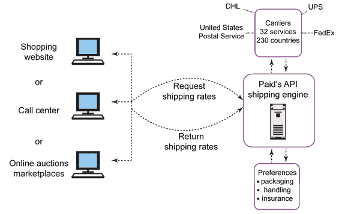

# 云中的 REST

> 原文：[`developer.ibm.com/zh/articles/cl-restfulapisincloud/`](https://developer.ibm.com/zh/articles/cl-restfulapisincloud/)

## 简介

许多人认为 API 是组织访问云计算供应商提供的服务的最佳方法。云使用者使用 API 作为软件接口，以各种方式连接和使用资源，但最优或现代的途径是使用基于 RESTful 协议的 API。请继续阅读，理解 API 的概念，以及它们在 REST API 和云计算服务中如何使用。本文提供了多个用例来演示如何在真实世界中使用此技术。

## API 入门

API 是一些软件接口，它们针对数据处理而优化了应用程序或服务的开发。开发人员常常通过头文件将 API 导入或集成到现有代码库中。但是，随着 Web 服务的诞生，开发人员开始创建 API，将发布或使用基于 Web 的服务的能力与第三方系统软件相结合。

随着技术的不断成熟，科技公司和职能部门已开始转移（或者至少已经在尝试转移）到面向服务的体系架构 (SOA) 模型。该模型允许使用面向对象的编程语言来开发 Web 服务，开发人员可适当地调用和重用这些服务。Google Maps API 就是一个基于 Web 的 API 的示例，它允许开发人员在其应用程序或网站中适当地调用和使用此服务。

### API 的结构

开发人员需要遵循最佳实践和标准来正确地开发、发布和使用 API。这些最佳实践和标准依赖于 API 针对的编程语言所规定的基本结构，这些语言包括 Java™ 、Microsoft®.NET、Objective-C、JavaScript Object Notation (JSON) 或可扩展标记语言 (XML)。图 1 和图 2 给出了基于 XML 的 API 的一些示例。

图 1 是 PAID 的运送 API，它允许组织将此功能捆绑到其电子商务站点中。

##### 图 1\. 用于运送和物流用途的 API（该图的使用已获得 AuctionInc 的许可）



图 2 是 Instra 的 API，它允许组织出于基础架构用途而直接连接到他们的域名注册商。

##### 图 2\. 用于域名托管用途的 API（该图的使用已获得 Instra Corporation 的许可）


除了使用的编程语言之外，API 还需要考虑服务本身的性质。换句话说，如果 API 是为客户端创建的，不是为服务器端使用而创建的，则需要遵循不同的规则。

无论 API 是为客户端用途而构建还是为服务器端用途而构建，开发人员面临的事实是，构建服务时都需要考虑高性能和安全处理。客户端 API 的开发人员会关注应用程序的用户界面、审美学和外观。服务器端 API 的开发人员要处理原始应用程序的高级功能或服务，考虑功能效用。无论 API 将用于何处，如今的开发人员都倾向于使用 RESTful API，这源于这些 API 的灵活性和通用性。

### REST API

RESTful API 遵循 SOA 模型，因此基于 Web 服务的软件架构通常会通过 XML 或 JSON 将它用于集成用途。这意味着，它们被 Internet 浏览器或 Web 服务器使用。前面已经提到过，RESTful API 是一种相对较新的技术，需要开发人员拥有当前的 Web 2.0 技术的全面知识。因此，许多缺乏更新其技术栈的动力的组织可能无法使用此产品。可能目前未重视 RESTful API 的组织一定未考虑成为云使用者。这些组织可能包括法律事务所、高等教育机构和非营利集团。但是，RESTful API 已是一个既成事实。

主要的处理和存储资源已逐渐原理终端设备，从这种意义上讲技术已兜了一圈之后又回到了原位，与大型机和哑终端盛行的时期很相像。这源于全球化、越来越远程或移动化的员工、无处不在的 Internet 连接，以及 SOA 和 Web 2.0 技术（比如 RESTful API）的成熟。随着用于数据处理任务的云计算通过 API 加入战团，此趋势正在接近临界值。

## 云计算与 API

云计算服务在本质上是分布式的。所以，用户对基于 Web 的 RESTful API 的使用是远程使用数据处理服务的合理解决方案。此外，考虑到经济低迷、新兴市场和更低的竞争门槛，很容易理解为什么技术会作为一种竞争优势再次得到重视。

随着企业尝试进入行业或市场或在其中立足、信息处理的全球化、愈加远程或移动的员工以及无处不在的 Internet 连接，REST API 变得不可或缺。这些事实制造了大量需要满足的不同最终用户需求。云计算正在帮助企业认识到这些新的优势。但是，对于组织而言，要恰当使用云，技术人员应理解云计算的细节，以及使用云或云服务提供商 (CSP) API 解决方案的一些常见用例。

### 云计算概述

对于 RESTful API，一些云服务交付模型拥有更多的 RESTful API，比如 SaaS 和 PaaS 模型。这些交付模型专注于为用户提供软件解决方案，而基础架构即服务 (IaaS) 专注于基础架构服务（例如计算或存储功能）。大多数 RESTful API 都倾向于 SaaS 解决方案，但也有许多适用于 PaaS 用户的 RESTful API 解决方案。

PaaS 模型允许在现有服务（例如数据库即服务或 DBaaS）上开发应用程序，而 SaaS 解决方案专注于某个具体的应用程序类型。PaaS 示例包括 Amazon Web Services (AWS) Relational Database Service (RDS) 和 Salesforce.com 的 Force.com 产品。SaaS 解决方案的示例包括 Zoho Writer 和 Microsoft Dynamics CRM。

尽管 REST API 在 SaaS 和 PaaS 解决方案中更加普遍，但也有一些针对 IaaS 解决方案的 RESTful API。大多数著名的云供应商（AWS、Rackspace 等）都提供了 RESTful API 来管理他们的 IaaS 环境，RightScale 等云代理可将它们用于其实例监视仪表板。

### 云 REST API 示例

本节提供一些基于云的 RESTful API 的示例来帮助您更好地理解 CSP 如何发布其 RESTful API 供云用户使用。

清单 1 是一个来自 AWS S3 的基于 IaaS 的 RESTful API 示例，用于域名系统 (DNS) 重定向（例如将 bigblue.com 重定向到 ibm.com）。您可在专注于 Java、.NET 或 XML 的集成开发环境 (IDE) 中利用此 API。

##### 清单 1\. RESTful API 示例（来自 AWS 文档）

```
HTTP/1.1 307 Temporary Redirect
Location: http://johnsmith.s3-gztb4pa9sq.amazonaws.com/photos/puppy.jpg?rk=e2c69a31
Content-Type: application/xml
Transfer-Encoding: chunked
Date: Fri, 12 Oct 2007 01:12:56 GMT
Server: AmazonS3

<?xml version="1.0" encoding="UTF-8"?>
<Error>
  <Code>TemporaryRedirect</Code>
  <Message>Please re-send this request to the specified temporary endpoint.
  Continue to use the original request endpoint for future requests.</Message>
  <Endpoint>johnsmith.s3-gztb4pa9sq.amazonaws.com</Endpoint>
</Error> 
```

清单 2 是一个使用超文本标记语言 (HTML) 从 Netflix 调用一个 RESTful API 来执行目录搜索的示例。此解决方案可用作 PaaS 解决方案，您可以使用它创建一个调用 Netflix API 来执行目录搜索的应用程序。用例示例包括用于游戏的娱乐仪表板或佣金服务。

##### 清单 2\. 通过 HTML 调用 Netflix 的 RESTful API（来自 *Netflix API Programmer’s Guide: Common Rest API Tasks*）

```
<html>
<head><title>Simple Search Page</title></head>
<body>
...
<%
  //callback
  Response resp = null;
  Strong sTerm = request.getParameter("term"); ← Get search term
  if( sTerm != null ) {
   String sRequest = ← Build request
    DemoApp.getService().buildRequestURI("/catalog/titles?term="+sTerm);
    resp = DemoApp.getService().call(
        sRequest, Method.GET, null);
  }
 %>
<table>
 <tr><form action="simplesearch.jsp"><td></td>
  <input type="text" name="term" />
  <input type="submit" /></form></tr>
<%
  if( resp != null ) {
   DomRepresentation rep = resp.getEntityAsDom();
   Document doc = rep.getDocument(); ← Get the response
   XPath xpath = XPathFactory.newInstance().newXPath();
   NodeList nodes = ← Evaluate the response
   (NodeList) xpath.evaluate(
                          "/catalog_titles/catalog_title", doc, XPathConstants.NODESET );
   for( int i=0, n=nodes.getLength(); i<n; i++ ) {
    Node node = nodes.item(i);
       Retrieve the data of interest:
       String sTitle = (String) xpath.evaluate(
                                         "title/@regular", node, XPathConstants.STRING );
    String sImage = (String) xpath.evaluate(
                                         "box_art/@large", node, XPathConstants.STRING );
    String sID = (String) xpath.evaluate( "id/text()", node, XPathConstants.STRING );
...
   }
  }
%>
<tr><table>tr align="center">
 " /><br />
  <%=sTitle%><br />
  <form action="addToQueue.jsp">
   <input type="hidden" name="title_ref" value="<%=sID%>" />
   <input type="submit" value="ADD" />
  </form><br /></tr></table>
</tr>
...
</table></body></html> 
```

## 云和 API 用例

云用户可在多种不同的情形中有效利用基于云的 RESTful API。本节提供一些示例来展示组织如何使用 SaaS、PaaS 和 IaaS RESTful API。

Google Maps Coordinate 是一个基于 SaaS 的 RESTful API 服务，可用于移动员工。组织可原封不动地利用 Google Maps Coordinate 或以一种与其他应用程序聚合的方式（称为 mash-up）来为驾驶员提供路线，协调集运或投递。任何需要调度程序的企业都可通过平板电脑或智能电话使用此服务来提高生产力。

尽管谈论的是生产力，拥有更多专门用于应用程序和系统开发的经验和资源的组织会很高兴听到 Amazon 的 DBaaS (AWS RDS) 平台也支持 RESTful API。此功能使开发人员能够调用和管理 Oracle、Microsoft 和基于 Amazon 的关系和非关系数据库解决方案，无需使用管理控制台。希望从操作系统角度讲拥有更多操作控制权的组织可考虑基于 IaaS 的 RESTful API。

对于使用 IaaS CSP 的用户，可以确信大多数 IaaS CSP 也为这种交付模型提供了 RESTful API。IBM® 、Fujitsu、Amazon 和其他一些公司在此功能上走在前列。这些服务允许用户和云代理以真正弹性且随需应变的方式监视和自动化服务的配置。

## 结束语

云计算和 RESTful API 就在我们面前，您的组织可确定如何利用这些技术从资本开支角度或通过提高处理效率来节省成本。为此，您的组织必须采用 Web 2.0 或 SOA 技术、部分或所有云交付（SaaS、PaaS 和 IaaS）以及部署（公共、私有、混合、社区）模型。通过安全地采用这些新范例，企业将会提高灵活性和适应能力。

经济低迷、新兴市场、更低的进入门槛、全球化、越来越远程或移动化的员工，以及无处不在的 Internet 连接是新的事实。要在如今的市场中参与竞争和大力发展，组织需要适当利用这些新技术。大多数公司可从使用云和 REST API 入手。

本文翻译自：[REST in the cloud](https://developer.ibm.com/articles/cl-restfulapisincloud/)（2018-10-20）