# 功能架构和数据的收集组织

> 原文：[`developer.ibm.com/zh/articles/ba-lo-hands-on-icp-for-data1/`](https://developer.ibm.com/zh/articles/ba-lo-hands-on-icp-for-data1/)

## 功能和架构

IBM Cloud Private for Data 是一个基于私有云的现代化数据和分析平台，有助于简化数据科学家，数据工程师和开发人员的工作。 该平台以企业数据资产目录为中心，包含数据联合/虚拟化、数据仓库、数据集成、数据科学/机器学习和嵌入式仪表板的服务。

IBM Cloud Private for Data 具有以下功能：

*   收集：混合数据管理。收集每种类型的数据，不管它在哪里，自由管理。
*   组织：统一治理与整合。将数据组织成值得信赖的真实来源，提供灵活性，使数据以新的方式工作。
*   分析：数据科学与商业分析。使所有团队能够以更智能的方式分析数据，从而获得先前无法获得的见解。

图 1\. 用户主页

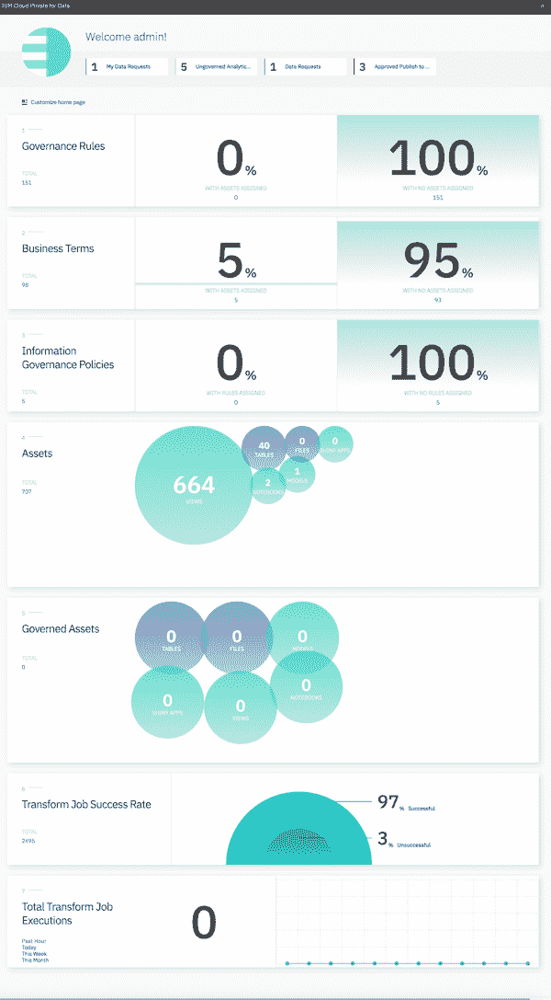

Kubernetes 是 IBM Cloud Private for Data 的基础，旨在满足企业在自己的受控数据中心的安全性中实现灵活性和云类经济效益的期望。它使我们能够更好地管理资源，并强化微服务的最佳实践，以及服务发现和弹性的可整合性。Helm 作为 Kubernetes 的软件包管理解决方案，可确保有效的模块化，版本管理，实现软件即服务。

IBM Cloud Private for Data 提供了完全预先集成的一组分析功能，这些功能成为 Kubernetes 服务并利用 Pod 复制实现弹性和负载平衡。Docker 镜像的使用以及部署的滚动升级使得分析中的单个服务的持续交付更为现实。用户将能够实现分析系统在线系统升级，而不会对业务产生影响。

IBM Cloud Private for Data 最新版本是 2018 年 7 月 12 日更新的 1.1.0.1，计划每个季度都会有新版推出。

IBM Cloud Private for Data 支持的操作系统是 Red Hat Enterprise Linux (RHEL) Server 7.5，可以独立部署在 x86 集群上或者基于已有的 IBM Cloud Private version 2.1.0.3 进行部署。

*   主节点：提供管理服务并控制集群中的工作节点。 主节点负责资源分配，状态维护，调度和监控。 初次部署可以用 3 个主节点来实现高可用性，每个主节点最小配置是 8 cores，16 GB 内存，750 GB 以上本地存储。
*   工作节点：为运行任务提供容器化环境的节点。 随着需求的增加，可以轻松地将更多工作节点添加到群集中，以提高性能和效率。 初次部署可以用 3 个工作节点，每个工作节点最小配置是 16 cores，32 GB 内存，1250 GB 以上本地存储。
*   代理节点：代理节点是将外部请求传输到集群内创建的服务的节点。 初次部署可以不需要独立的代理节点，而将代理的服务部署在主节点上。IBM Cloud Private for Data 需要在与服务器相同的网段两个未使用的静态 IP 地址。 安装程序将它们设置为虚拟 IP 地址以实现高可用性。 IBM Cloud Private for Data 使用 HA 代理检测主节点故障，并将此 IP 地址重新分配给另一个主节点，而无需用户干预。
*   Db2 Warehouse 数据库节点： 1.1.0.1 版本支持在 IBM Cloud Private for Data 中创建集成的 Db2 Warehouse SMP 数据库，该数据库中的数据会自动与 IBM Cloud Private for Data 的治理功能集成。Db2 Warehouse 需要专用工作节点，每个数据库实例建议配置 8 cores，64 GB 内存和 1T 数据存储。

图 2 是 7 节点部署架构图，其中有 3 个主节点（包含代理节点服务），3 个工作节点和 1 个专用 Db2 Warehouse 数据库节点。

图 2\. 部署架构图

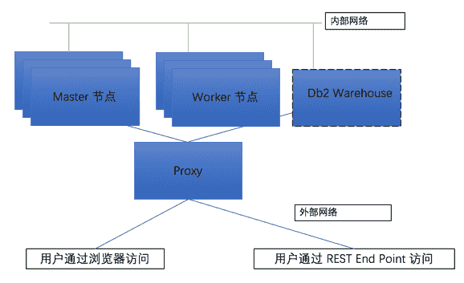

## 用户协作和统一用户体验

### 用户和角色

IBM Cloud Private for Data 统一平台为多种用户角色提供了用来管理和分析数据的集成体验：

*   数据管家：管理整个组织的数据质量。

    *   创建一个通用词汇表（业务词汇表）
    *   构建数据目录
    *   创建治理规则和策略
    *   确保遵守法规
    *   发现和分类数据源
    *   查找和探索受管数据和分析资产
    *   标记和注释资产和数据集
    *   分析资产的审批
*   数据工程师：准备使用和分析数据。

    *   创建与数据源的连接
    *   创建数据的虚拟化视图
    *   自动化元数据提取，列分析和数据质量评估
    *   自动化规则，业务术语分配和数据质量分析
    *   构建数据 ETL 流程进行数据准备和清理
*   数据科学家：从数据中获取洞察力和分析资产分享。

    *   在数据目录中查找相关数据
    *   数据探索和可视化
    *   数据变形和特征预处理
    *   算法模型构建
    *   开发和培训机器学习和深度学习模型
    *   开发自定义模型评分脚本
    *   评估模型
    *   部署模型
    *   监控生产中的模型健康状况
    *   模型再训练和版本控制
    *   数据集发布
    *   发布 Notebook，Shiny Web 应用和机器学习模型
    *   发布机器学习模型，以便其他人可以使用模型进行预测
*   业务分析师：业务分析见解

    *   创建分析仪表板实现可视化数据
    *   与同事共享仪表板
*   管理员：系统和应用管理

*   管理用户和用户权限

*   LDAP 集成
*   Hadoop 集群连接
*   为分析项目添加数据源的 JDBC 驱动程序
*   监控和管理活动分析环境
*   监视和管理计算资源的消耗
*   部署模型，包括分配计算资源、负载均衡和发布 URL 管理
*   将模型部署的链接公开给 Web 服务和应用程序
*   批量模型评分和评估
*   监控已部署模型的运行状况

以管理员身份登录 IBM Cloud Private for Data，从菜单中，选择管理 > 用户管理，可以进行用户和角色管理，并支持与企业 LDAP 集成，如图 3 所示。

图 3\. 用户和角色

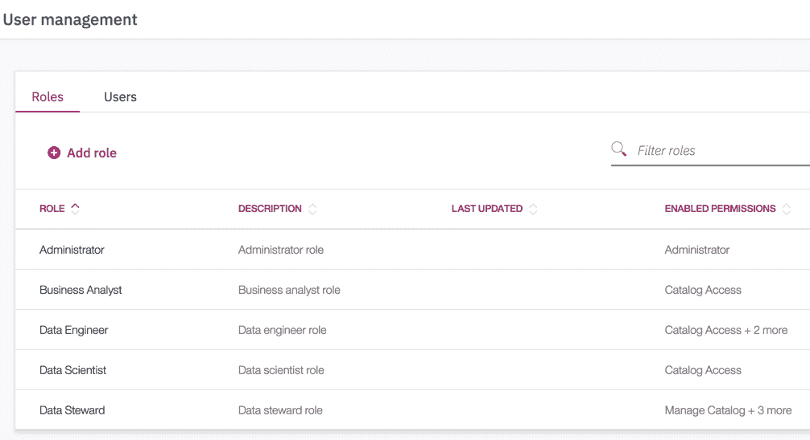

### 项目协作

IBM Cloud Private for Data 以项目为纽带来进行团队合作，分为数据分析项目和数据转换项目。数据分析项目资产包括：Jupyter notebooks、Zepplin notebooks、RStudio 资产、数据集和模型等。数据转换项目资产包括 ：数据源连接、表定义和数据转换任务。

图 4\. 项目

在创建数据分析项目时候可以选择团队协作的方式：

*   项目资产由 IBM Cloud Private for Data 内置的 Git 主存储库中管理
*   项目资产由 GitHub 管理
*   不需要协作，作为 Library 项目

项目管理员可以在不同阶段添加不同角色的协作者，并赋予团队成员权限：

*   查看：可以查看项目并接受更改。
*   编辑：可以控制项目资产，接受更改并提交更改。
*   管理员：可以控制项目资产，管理项目成员，接受并提交更改。

图 5\. 协作

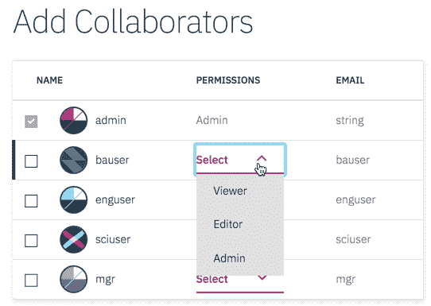

Git 集成提供了灵活的源代码管理方法，可以跟踪、备份和协作多个用户的项目。协作者可以将更改提交到存储库，以便每个人都可以访问更改。从项目操作栏中的 Git Actions 图标，可以看到 Git 提交历史记录，并为每个提交添加多个标记。

图 6\. Git 集成

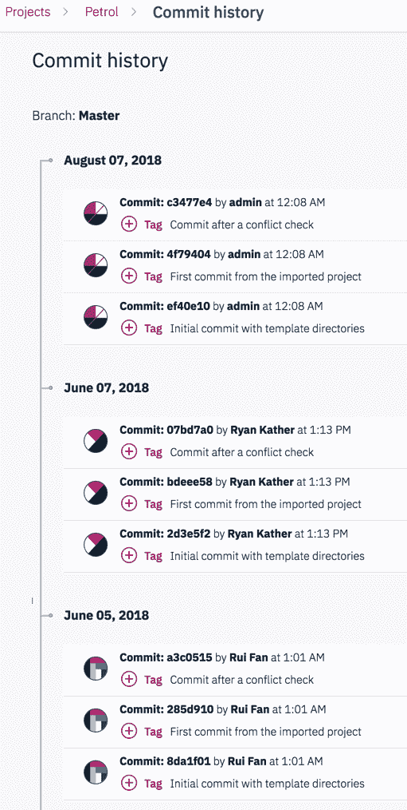

### 管控流程

IBM Cloud Private for Data 内置数据管控流程，数据管理员的主页会显示待处理请求选项，如发布请求或批准请求。 数据管理员可以选择批准或者拒绝。通过添加评论来解释拒绝请求的原因。如果没有足够的有关请求的信息，可以要求更多信息。

数据科学家在进行数据分析的时候发现企业数据资产目录没有需要的数据，可以关联到项目并提交数据申请，如图 7 所示。数据工程师可以看到这个申请，并进行处理。

图 7\. 数据申请

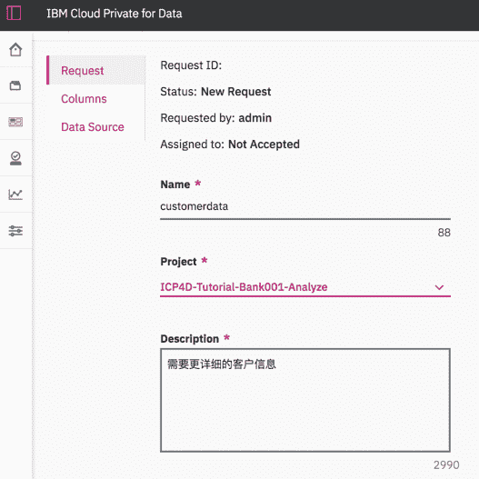

数据科学家的分析资产可以申请发布到企业数据资产目录中，如图 8 所示。如果数据管家审批通过，则这个分析模型资产就可以被企业数据资产目录检索。

图 8\. 分析资产发布

## 数据收集

### 我的数据

登录 IBM Cloud Private for Data，从菜单中，选择收集 > 我的数据，可以看到数据和项目关联，如图 7 所示。

图 9\. 我的数据

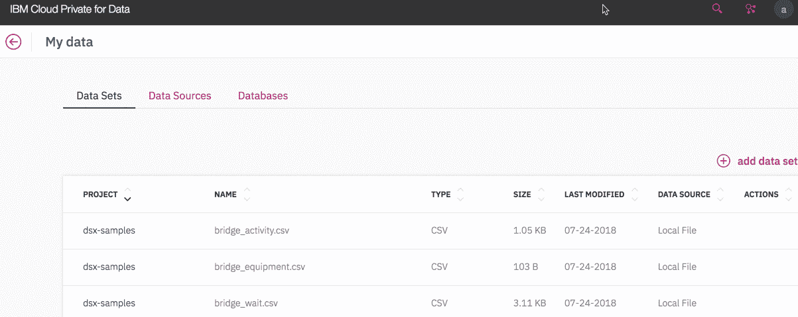

我的数据分为：

*   本地数据资产（如 CSV 文件）可以上传到 IBM Cloud Private for Data 项目中。
*   数据源提供了一种安全机制来存储和管理数据库的凭证，包括 Db2、Hive、HDFS、Informix、Netezza、Oracle、Custom JDBC 等。
*   数据集是添加到数据源上的，数据集直接连接到 Schema 和 Table。

在项目上进行协作时，我的数据不需要写代码就可以自动加入到机器学习模型和流程中。以 Notebook 为例，单击工具栏中后找到所需的数据集，然后单击”插入代码”，如图 10 所示。

图 10\. 我的数据使用方式

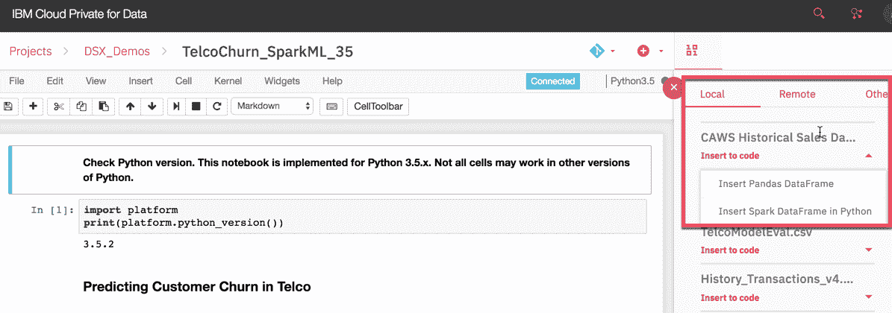

### Db2 Warehouse

IBM Cloud Private for Data 已经集成 IBM Db2 Warehouse 数据库。Db2 Warehouse 是一种高性能的分析引擎，它将内存处理与集成的库内分析相结合，可用于私有云的分析数据仓库。数据库中的数据会自动与 IBM Cloud Private for Data 的治理功能集成，如图 11 所示。

图 11\. 管理 Db2 Warehouse

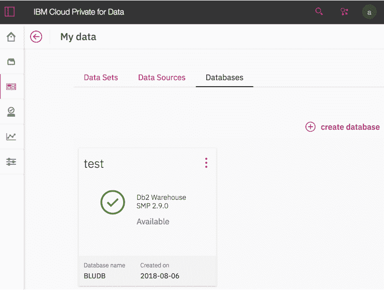

IBM Cloud Private for Data 有独立的数据库工作节点，通过选择 CPU、内存和存储资源来创建数据库，如图 12 所示。当数据库显示为 Available 时，数据库准备就绪，可以从操作菜单中选择发布到企业数据资产目录。

图 12\. 创建 Db2 Warehouse 数据库

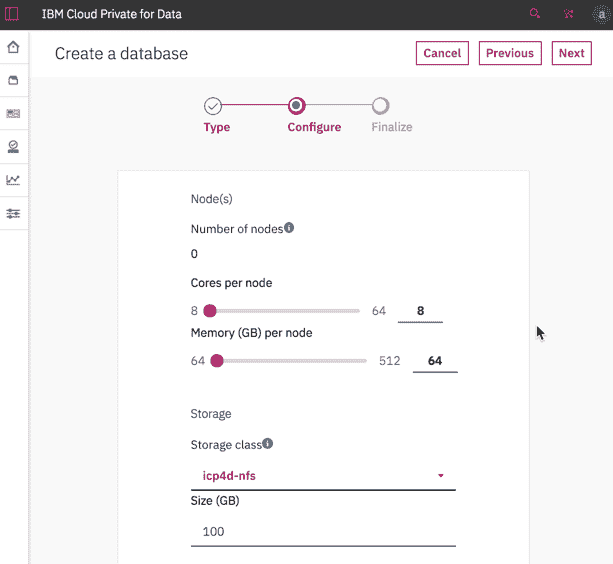

数据库运行时，IBM Cloud Private for Data 可以完成以下任务：

*   访问数据库
*   从另一个应用程序连接到数据库
*   监控数据库
*   加载数据
*   探索数据库
*   运行 SQL
*   删除数据库

图 13 是通过 IBM Cloud Private for Data 控制台来监控数据库的界面，可以清楚看到数据库可用性，以及相关警报。

图 13\. 数据库监控

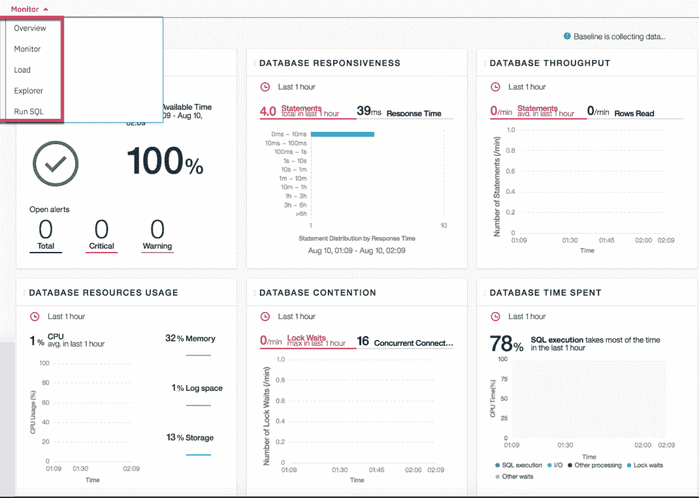

### 数据联邦

使用 IBM Cloud Private for Data 进行数据联邦，可以跨多个数据源透明访问数据。它为跨多个不同来源分发的数据提供了一致的界面。这些源不仅包括不同的数据库和存储库，还包括不同类型的数据库和存储库，例如 Db2 和 Oracle。该功能可帮助打破孤岛并实现数据资产的全部价值。

首先在企业数据资产目录搜索数据，通过单击”添加到购物车”，将搜索结果中的两个表添加到购物车，如图 14 所示。

图 14\. 数据购物车

打开购物车并单击联邦，可以对每张表进行过滤和列筛选，并选择连接条件，预览后创建数据联邦。

图 15\. 数据联邦

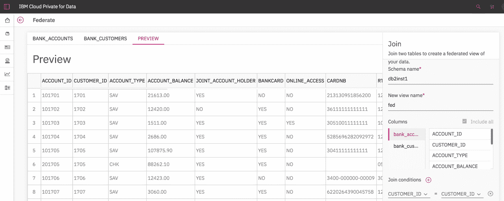

数据联邦创建好以后，可以跟数据管控流程结合，把它应用到数据科学家提交的数据申请，这样数据科学家就能在项目里看到管理员数据联邦后的数据了。

图 16\. 数据联邦应用到数据请求

## 数据组织

### 企业数据资产目录

IBM Cloud Private for Data 通过企业数据资产目录构建企业信息，发现数据资产之间的关系。数据管家可以使用通用业务词汇创建数据字典，创建信息治理规则和策略。企业数据资产目录还包含分析资产，例如模型，Notebook 和 RShiny 应用程序，然后关联到业务定义，策略和规则。

数据字典中的数据业务词汇表是定义企业特征的资产目录，包含类别和术语。 类别层次结构反映了用户搜索信息的方式。登录 IBM Cloud Private for Data，从菜单中，选择组织 > 业务词汇表，创建逻辑结构的业务类别，并分配术语以构建词汇表，如图 17 所示。

图 17\. 业务词汇表

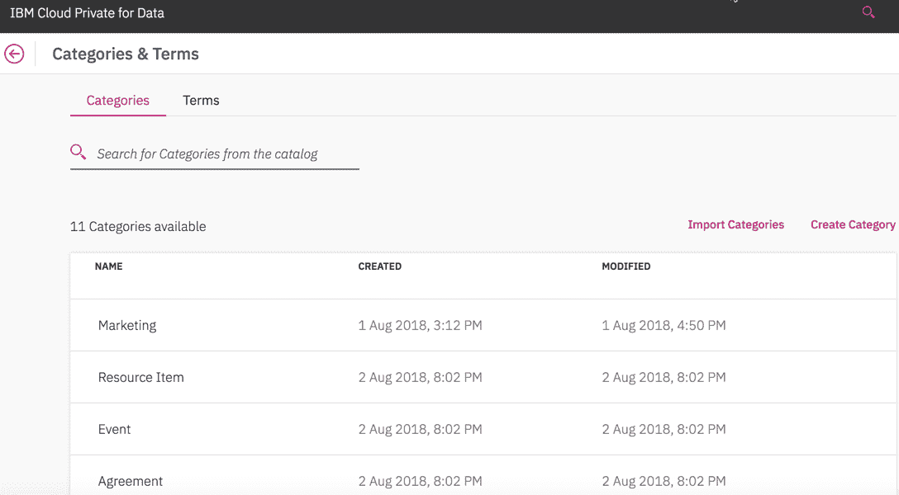

信息治理策略和信息治理规则描述了怎样使信息资源符合企业目标，包括信息安全，信息隐私或法规遵从性。信息治理策略是治理主题领域的自然语言描述。每个信息治理策略都可以包含多个信息治理子策略或引用一个或多个信息治理规则。信息治理规则是用于确定信息资产是否符合业务目标的标准的自然语言描述。规则定义了为实施信息治理策略而采取的操作。登录 IBM Cloud Private for Data，从菜单中，选择组织 > 治理策略和规则，创建信息治理规则和策略，如图 18 所示。企业已有的术语，类别，信息治理策略和规则的词汇表，则可以将其导入到企业数据资产目录。

图 18\. 策略和规则

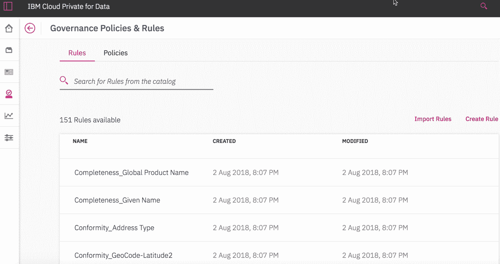

如图 19 从菜单中，选择组织 > 数据目录，可以检索数据目录。检索时可以使用过滤器缩小结果范围。

图 19\. 数据资产目录

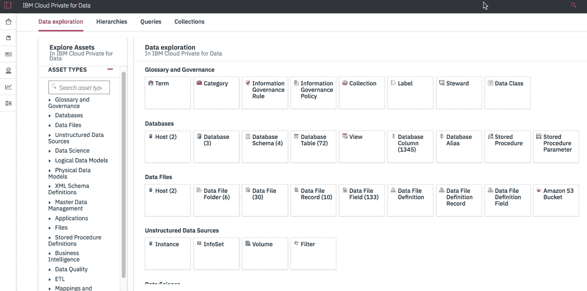

数据目录包含所有可以查找和探索企业中资产之间的关系，如图 20，可以评估资产并添加评论以分享并识别最有价值的资产。IBM Cloud Private for Data 内置机器学习模型进行自动数据分类和术语分配。

图 20\. 数据血缘

### 数据发现和数据质量

在 IBM Cloud Private for Data 中探索和分析数据质量。如图 21 从菜单中选择组织 > 发现资产就可以进行数据自动发现。自动发现的结果如图 22，后台执行以下操作：

*   注册数据集并将数据连接中的元数据添加到数据目录中。
*   对数据集运行列分析，以识别数据类，数据类型和格式等属性。
*   对数据集运行质量分析，以扫描数据质量的常见维度，如缺失值或数据违规。
*   根据聚类，相似性和其他因素为导入的资产分配业务术语。

图 21\. 自动发现

IBM Cloud Private for Data 使用机器学习来执行数据分类，把企业的业务术语和技术元数据关联。IBM Cloud Private for Data 使用面向行业的数据集和标签对模型进行预训练，在自动发现时提供匹配。如果匹配满足阈值要求，则该术语自动分配给元数据，如果不匹配，则系统将其视为重新训练机器学习模型的知识输入。这种动态反馈循环使数据管家能够在自动发现中获得更高效的匹配结果。

图 22\. 数据质量和数据分类

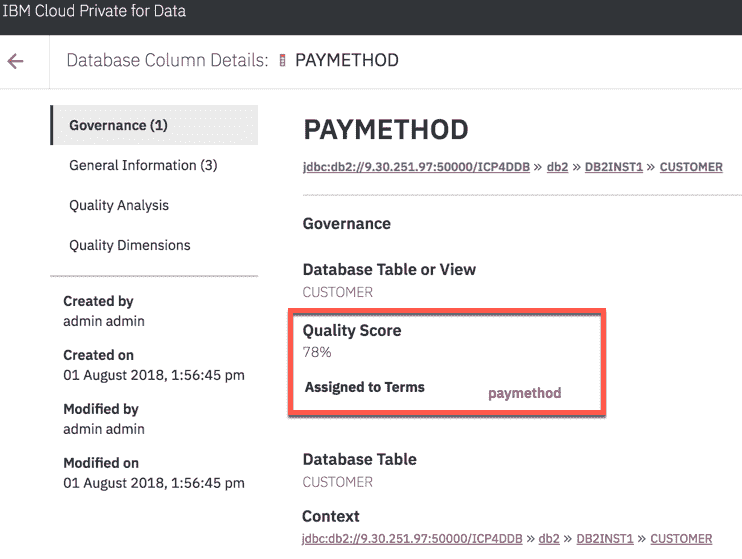

### 数据转换和清洗

借助 IBM Cloud Private for Data，您可以创建，编辑，加载和运行转换作业。 IBM Cloud Private for Data 具有内置搜索，自动元数据传播等功能，开发人员可以使用这些功能提高工作效率：

*   搜索：使用灵活的搜索功能快速查找所需内容。
*   自动元数据传播：会自动将元数据从作业中的前面处理阶段传播到后一个阶段，从而提高工作效率。
*   突出显示所有编译错误：提供了一种在每个阶段快速悬停查看问题的方法，可以在作业重新编译之前同时修复多个问题。

数据工程师搜索到数据源，通过添加到购物车，然后单击购物车中的转换就可以创建 ETL 作业，也可以直接从菜单中，选择组织 > 转换数据。

转换数据页面包含以下选项卡，您可以使用这些选项卡快速访问基本操作：

*   项目
*   连接
*   表定义
*   作业

数据转换和清洗作业不需要编码，可以使用连接器访问数据库，使用数据处理控件转换数据。通过将它们从控件面板拖到画布，将连接器和数据处理控件添加到作业中，如图 23 所示。

图 23\. 数据转换

## 总结

通过功能和架构的内容，可以了解 IBM Cloud Private for Data 是作为私有云平台开发的，通过构建在把功能和数据暴露成微服务和 API 的容器体系结构实现的，平台的配置管理由 Kubernetes 自动进行。

用户协作和统一用户体验的内容让您了解到 IBM Cloud Private for Data 的用户体验是具有基于角色，使用不同功能但通过企业数据资产目录在统一平台进行协作。

数据收集实现了 IBM Cloud Private for Data 混合数据管理的能力，可以收集每种类型的数据，不论数据来源而自由管理。

数据组织体现 IBM Cloud Private for Data 统一治理与整合，将数据组织成值得信赖的真实来源，提供灵活性，使数据以新的方式工作。

在本系列的第二部分中，会介绍 IBM Cloud Private for Data 如何进行数据科学与商业分析，并体验平台的管理和运维。

## 参考资源

*   参考 [IBM Developer 中国](http://developer.ibm.com/zh/) 首页，查看 IBM 软件和开放技术的最新信息。
*   查看 [IBM Cloud Pak for Data](https://www.ibm.com/products/cloud-pak-for-data/) 官网
*   免费试用 [IBM Cloud](https://cloud.ibm.com/login?cm_sp=ibmdev-_-developer-articles-_-cloudreg)