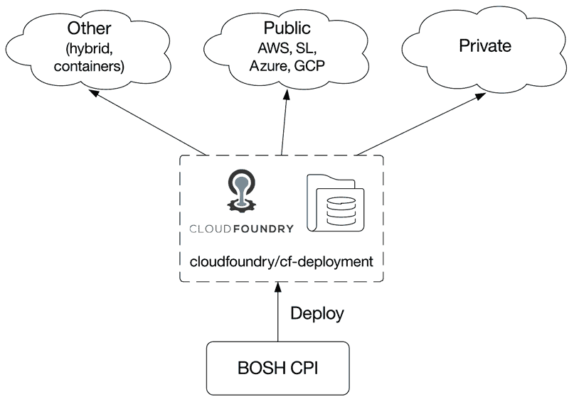
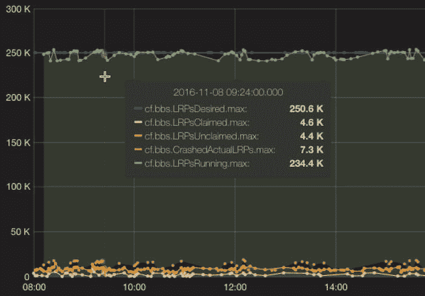
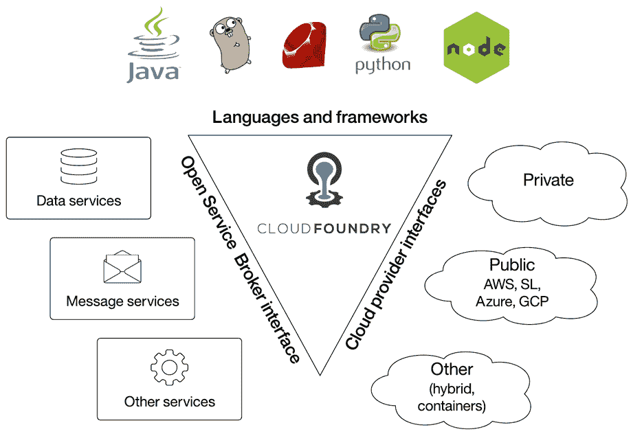

# 关于 Cloud Foundry 您可能不知道的 5 个事实

> 原文：[`developer.ibm.com/zh/articles/cl-5-facts-about-cloud-foundry/`](https://developer.ibm.com/zh/articles/cl-5-facts-about-cloud-foundry/)

随着云技术的使用日渐成熟，一些公司发现需要进一步发展来获取价值。具体来讲，平台即服务 (PaaS) 为云提供了一站式的完整操作系统。

使用 Cloud Foundry (CF) 等 PaaS 解决方案的企业不需要担心如何管理云资源来运行其应用程序的细节。平台会为他们完成这些工作。他们唯一需要关注的是应用程序代码以及对服务目录的访问。平台会完成剩余工作：扩展、修复、HA/DR 等。

由于不断的创新，像 Cloud Foundry 这样的早期平台才得以继续在这一领域保持领导地位。然而，跟上采用新方法来解决容器编排（如 Docker Swarm 和 Kubernetes）挑战的创新也同样重要 ，与他们共享令人激动的成果。

尽管 CF 等平台在最近几年取得了巨大的成功，但也有人抨击它们。具体来讲，通过强制采用一种云世界视图（应用程序、服务、组织、用户等），这些平台可能对您可以部署的应用程序类型施加了一些限制。

例如，CF 不是很适合部署数据库这样的服务。在 CF 中，可以直接使用 [BOSH](https://bosh.io/)（一个可扩展的多云发布工程工具）来完成此工作，并使用 VM 或 VM 上运行的容器集群部署到基础架构即服务 (IaaS) 上。这些限制导致一些替代平台出现，比如 Kubernetes 和 Docker Swarm，它们为开发人员提供了充分的自由，允许他们直接管理容器集群，并在集群上运行自己的应用程序。

CF 的替代平台很受欢迎，因为它们全面鼓励创新。但是，关于 CF 云操作系统，有一些谣言或误解值得澄清一下。本文将探讨关于 CF 您可能不知道的 5 件事。

我们强调这些问题不是为了全面比较或对比 CF 与其他平台，而是为了确保误解得到纠正，事实得到公开。我们希望阐明当前的 CF 架构和设计重点，使尝试使用 PaaS 的企业用户能制定最佳决策。

## 事实 1：Cloud Foundry *一直*都在使用容器

随着 Docker 和 Kubernetes 出现，人们对容器的兴趣达到了狂热的程度，因此理解 CF 与这些技术的关系对我们很重要。首先，像其他许多 PaaS 环境一样，CF 也使用容器。从最开始就是如此，比当前所有的容器编排平台还要早。如果考虑到容器的用途，您就会了解为什么容器始终对 CF 至关重要。

容器是 UNIX/Linux 系统中的一种隔离方法。通过使用各种内核特性，可以在 Linux 容器中运行应用程序，使应用程序拥有自己独立的系统资源视图，以及资源使用限制。

CF 从一开始就在使用容器。在最新的版本中，CF 中的容器层 (Garden runC) 已经升级，通过采用 CNCF-led runC 标准，不仅能遵从容器技术中的新兴行业标准，而且可以为容器技术贡献新的行业标准。因此，每次运行 CF 应用程序，都是在一个 runC 容器中运行它。

CF 添加的独特功能是对这些容器的管理，利用容器向最终用户隐藏了复杂性。CF 中的 Diego 运行时是一种高效的容器调度程序。该调度程序的（部分）目的是最大限度提高实例化 CF 时所使用的底层虚拟机的利用率。

为什么需要像这样的调度程序？因为 IaaS 中的资源是依据谨慎原则（discreet capacity）来提供容量的。例如，您可以创建包含 10 GB 内存、64 个 CPU 和 10 GB 以太网络的 VM。将 CF 安装在类似这样的 VM 上时，您最终可能得到 4 个专门运行最终用户的应用程序的 VM。CF Diego 调度程序的部分工作是确定应该如何和在何处放置应用程序，以及应该为任何一个应用程序分配多少可用资源。该调度程序尝试以最大化使用率的方式完成此工作，并使最大数量的应用程序能在环境限制内高效运行。

具体来讲，Diego 调度程序在分配用户应用程序实例时会保持后者可用。它还会在应用程序失败或升级后恢复和重新配备应用程序。Diego 利用了所有 CF 应用程序都无状态的事实（所以只要至少有一个实例保持运行，就能随时将它们安全转移到另一个主机）；这使 Diego 在核心上保持简单的同时，能为用户应用程序提供灾备能力、健康管理和高效安排。这是 Diego 与其他更通用的调度程序的不同之处。

## 事实 2：Cloud Foundry 能在超过 10 个 IaaS 上运行（相同的代码，不同的云）

最初发布 CF 时，它就能在少数云上运行（比如 VMware 和 AWS），这足以让早期的多云用户感到满意。随着时间的推移，当第一个 BOSH 版本出现并发展成熟时，还添加了其他云 — 主要包括 VSphere、VCloud 和 OpenStack。BOSH 支持一种明确的云提供商接口 (CPI)，但添加新的 CPI 可能很困难，因为这些不同的 CPI 都嵌入在 BOSH Director 代码中。

##### CPI 是与云无关的

2015 年，BOSH 团队通过清理并外部化 BOSH Director 代码库中的 CPI，开始扭转这种状况。CPI 现在打包为 BOSH 版本，而且可以与 Director 分开部署和更新。另外，CPI 现在可以使用任何语言和任何所需的技术来针对目标云进行开发。

一旦所有现有 CPI 都转换为它们自己的存储库，并建立了一个单独的 CPI 团队，CF 社区就会注意到。作为这种新扩展机制的后果，其他许多云（甚至容器平台）都可以用来部署 CF。这些平台包括 SoftLayer、Azure 和 GCP，以及 Docker 和 Kubernetes，等等。

##### 可用的 CPI

借助超过 15 种不同的可用 CPI，包括裸机 SSH CPI 和允许您针对多种云进行开发的多 CPI，CF 轻松成为当今能跨最多平台使用的 PaaS。

## 事实 3：Cloud Foundry 可扩展到成千上万个应用程序

随着 Cloud Foundry 发展成熟，它面临的一个最大挑战就是可扩展性。IBM、SAP、Pivotal 和 GE 等公司已将 CF 代码库用作其应用程序服务公有云战略的核心元素。该平台的多个部分都是用 Golang 重写的，并通过 Diego 添加了更现代化的分布式系统技术，为 CF 提供了一个更现代、更稳定的运行时。但这是否也提供了一个更可扩展的环境？

2016 年，Diego 团队花费了一大半时间来调优运行时，以实现线性扩展特征。通过重新审视并优化各种组件选择和运行扩展试验，他们能配置 1,250 个 Diego 单元，每个单元对应于一个用来运行应用程序的基础 VM，而且可以将该平台扩展为运行 250,000 个容器。

##### 250,000 个容器

考虑到应用程序实例与容器之间的一对一映射关系，Diego 可扩展性测试证明了 CF 可以管理 250,000 个应用程序，同时在整个可扩展性测试期间保持它们可路由和响应迅速。而且这还没有考虑 CF 目前能在包含成千上万个应用程序的实际生产环境中运行的事实。

我们实际上并不知道 CF 扩展的极限，因为执行如此大规模的试验需要很高的成本，而且 Diego 团队并未尝试挑战极限。所以从理论上讲，CF 能够扩展到 500,000 甚至一百万个应用程序。有关如何执行可扩展性测试的更多细节，请参阅“[生产中的 25 万个容器：真实世界中的真实测试](https://content.pivotal.io/blog/250k-containers-in-production-a-real-test-for-the-real-world)”。

## 事实 4：Cloud Foundry 适用于任何语言和框架

CF 从一开始就设计为可用于任何语言和框架。这个设计点得到了保持，所以现在 CF 中支持的语言和框架不仅广泛可用，而且还可以自定义。Java 支持是一个很好的例子，因为有许多运行 Java 应用程序的方法；无论您想要使用 OpenJDK 还是 IBM Liberty Java VM，都有一个受支持的 Java buildpack。

##### Cloud Foundry 核心设计点（云、框架/语言、与服务无关）

不是只有已得到公认的语言和框架才能在 CF 生态系统中高效运行。新的和难懂的语言也能在 CF 生态系统中高效运行。例如，在 Apple 于 2015 年 12 月发布其 Swift 语言 OSS 后，用于 Swift 的 CF buildpack 很快就开始出现。如今，至少可以通过社区获得两个版本。

此外，buildpack 保持着与 Heroku 的兼容性，所以社区中发布的版本都可以用在 CF 安装中。此外，CF 社区还在 buildpack 中开展了创新，探索如何支持将多个 buildpack 用于需要多个运行时的应用程序，以及如何支持私有 buildpack，在您需要为一种语言的运行时或一种框架建立分支来解决无法通过其他途径解决的深奥应用程序问题时，就会用到该私有 buildpack。

## 事实 5：Cloud Foundry 是可扩展的

有人批评 Cloud Foundry 缺乏可扩展性和扩展点。尽管该平台是完全开放的，从理论上讲，任何提交 Github PR 的人都可以修改它，但无法采用系统的方式扩展该平台 — 即一种允许所有人在平台的所有部分查看并创建探索成果的方式。换句话说，如何本着“百花齐放”的战略精神来支持创新？

为了解决这个问题，2016 年末，指导平台发展方向的项目管理委员会 (PMC) 决定将构成 CF 的所有项目拆分为 3 个子 PMC：运行时、BOSH 和扩展。新的扩展 PMC 的任务是鼓励扩展该平台，并在允许社区探索各种富有成效或成效不大的选项的同时，将某种结构融入到这些扩展的演化过程中。

在前 6 个月对符合条件的现有项目进行组织并将它们改造为各种扩展，以及考虑新项目后，CF 现在已经有一个建立好的扩展流程和方法，以供社区中的任何人扩展该平台。这些扩展包括 API、工具、CPI、连接其他平台的连接器、buildpack、服务等。

随着社区不断添加更多扩展，一些扩展会消失，一些扩展会发展为核心。无论如何，我们的主要目的是确保该平台保持开放并充满生机，而且社区中的任何人都能通过自己下一个绝妙的想法来扩展该平台。

## 结束语

平台即服务将继续改进。随着不断的创新，像 Cloud Foundry 这样的早期平台得以继续在这一领域保持领导地位。然而，跟上采用新方法来解决容器编排（如 Docker Swarm 和 Kubernetes）挑战的创新也同样重要 ，与他们共享令人激动的成果。

在许多方面，容器编排不是一种零和博弈，我们期望许多平台能取得成功，因为这些平台尝试解决的问题空间包含所有 IT 应用程序和服务管理。

在本文中，我们重点介绍了 5 个重要事实（一些是众所周知的，一些不是），当需要在 CF 和其他 PaaS 环境之间做出选择时，它们可以帮助企业 IT 管理人员制定正确的决策。

本文翻译自：[Five facts you might not know about Cloud Foundry](https://developer.ibm.com/articles/cl-5-facts-about-cloud-foundry/)（2018-08-13）