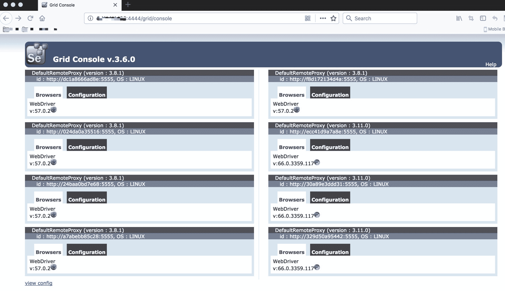
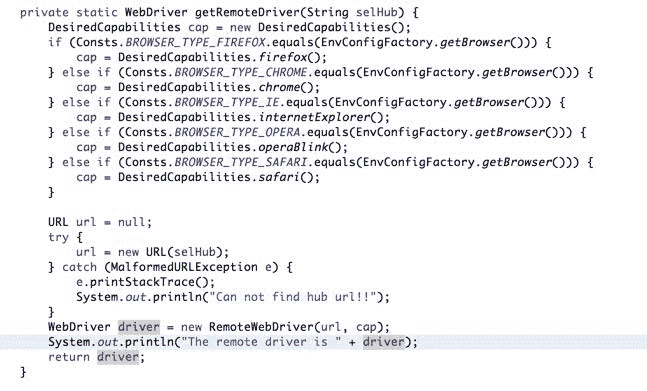

# Docker Swarm 在持续集成测试中的应用

> 原文：[`developer.ibm.com/zh/articles/d-docker-swarm-ci-test-application/`](https://developer.ibm.com/zh/articles/d-docker-swarm-ci-test-application/)

## 背景

敏捷（Agile）模式被广泛应用，测试显得尤为重要。由于需要频繁发布新的版本，我们需要更加频繁的执行测试用例，以确保没有新的 bug 被引入到版本中。

一个完整的测试流程所需要占用的时间和资源也不可忽视，包括对测试结果的分析都要占用大量的资源。如何在更短时间内，提供完整、全面的测试以保证质量，是我们急于解决的问题，也是保证敏捷开发能顺利进行的关键。

Jenkins 实现了无人值守的测试流程，开发结束后，一旦在测试环境部署成功，下游的测试任务就会即刻执行。

Jenkins 的应用在一定程度上节省了人力资源，而 Docker 技术可以实现容器 (Container) 快速的拓展，从而节省了大量的设备资源和时间，快速的完成测试。这在 Jenkins Pipeline（代码流水线管理）中是非常重要的一个环节，如图 1 所示：

图 1\. Jenkins Pipeline


本文主要介绍如何利用 Docker Swarm 集群功能和 Selenium Grid 脚本分发功能，来搭建一个可以动态扩容的 Selenium 自动化脚本执行环境。相比于用真实的机器作为 Selenium 自动化脚本执行环境，使用此套环境可以极大的减少对执行环境的维护工作，比如各种浏览器类型的管理和版本的管理。也能极大的减少对脚本执行环境的物质投入，节省各类资源。

## 搭建 Docker Swarm 集群

### Swarm 简介

Swarm 是 Docker 官方提供的一款集群管理工具，用来管理 Docker 集群，它将若干台 Docker 主机抽象为一个整体，并且通过一个入口统一管理这些 Docker 主机上的各种 Docker 资源。

Swarm 只是一个调度器（Scheduler）加路由器 (Router)，Swarm 自己不运行容器，它只是接受 Docker 客户端发送过来的请求，调度适合的节点来运行容器，这意味着，即使 Swarm 由于某些原因挂掉了，集群中的节点也会照常运行，当 Swarm 重新恢复运行之后，它会收集重建集群信息。

Swarm 和 Kubernetes 比较类似，但是更加轻，具有的功能也较 Kubernetes 更少一些。

### 环境准备

为了搭建 Docker Swarm 集群环境，我在示例中准备了两台机器。一台作为 manager 节点，同时也作为一个 worker 节点，另一台只作为一个 worker 节点。

这里假设我们的两个机器 IP 信息如下:

M1：`10.13.181.1`

M2：`10.13.181.2`

Docker Engine 从 V1.12.0 版本开始，原生集成了 Docker Swarm，所以只要在每台机器上安装 Docker，就可以直接使用 Docker Swarm。在这里，关于 Docker 的安装不再详细介绍，请按照官方 [Docker Swarm 文档](https://docs.docker.com/swarm/) 进行安装。安装完成后，在每台机器上将 Docker 服务启动。

提示:

注意：最好关闭机器上的防火墙，否则可能会出现 Swarm 集群网络连接问题。

关闭防火墙的命令： `systemctl stop firewalld.service`

禁止防火墙开机启动命令： `systemctl disable firewalld.service`

### 步骤

1.  创建管理节点。

    我们将机器 M1 作为 manager 节点，在这台机器上执行命令来初始化集群环境。命令如下：

    `sudo docker swarm init --advertise-addr 10.13.181.1`

    执行此命令后，会返回一个用于加入集群的令牌（Token），以便其他 worker 加入此集群。

    清单 1\. 加入集群令牌示例

    ```
    docker swarm join --token SWMTKN-1-5p3kzxhsvlqonst5wr02hdo185kcpdajcu9omy4z5dpmlsyrzj-
    3phtv1qkfdly2kchzxh0h1xft 10.13.181.1:2377 
    ```

    如果想再次获取加入集群的命令，可以通过执行以下命令获取：

    `sudo docker swarm join-token worker`

2.  将机器 M1 也作为 worker 节点添加到集群。

    在 manager 节点机器上运行清单 1 的命令，即可将机器 M1 也作为 worker 加入 swarm 集群当中。

3.  将另一台机器 M2 作为 worker 节点添加到集群。

    在机器 M2 上执行上述清单 1 中的命令，即可实现 M2 加入集群的功能。

4.  运行如下命令创建集群网络：

    `sudo docker network create -d overlay seleniumnet`

    这里，seleniumnet 即是我们所创建的集群网络名称。

5.  在新建的集群网络上创建 Selenium Grid 服务。

    a. 创建 Selenium Grid Hub 服务。基于集群网络 seleniumnet，将 4444 端口映射到集群的 4444 端口. 将 timeout 时间设置为 120 秒，可以增大或减少 timeout 时间。如清单 2 所示：

    清单 2\. 创建 Selenium Grid Hub 服务

    ```
    sudo docker service create --name selenium-hub --network seleniumnet -p 4444:4444 -e
    GRID_TIMEOUT=120 selenium/hub 
    ```

    b. 创建 Selenium Grid Firefox 节点服务并连接到刚创建 Hub 服务。如清单 3 所示:

    清单 3\. 创建 Selenium Grid Firefox 节点服务 {: #清单-3-创建-selenium-grid-firefox-节点服务}

    ```
    sudo docker service create \
      --name node-firefox \
      --replicas 5 \
      -p 7900:5900 \
      --network seleniumnet \
      -e HUB_PORT_4444_TCP_ADDR=selenium-hub \
      -e HUB_PORT_4444_TCP_PORT=4444 \
      selenium/node-firefox-debug bash -c 'SE_OPTS="-host $HOSTNAME" /opt/bin/entry_point.sh' 
    ```

    参数说明：

    `-p: 7900:5900` 将 Docker 内部 VNC5900 暴露到宿主机的 7900 端口，使得用户可以通过 VNC 从外面监控 Docker 内部的执行情况。

    c. 创建 Selenium Grid Chrome Node 服务并连接到刚创建 Hub 服务。如清单 4 所示:

    清单 4\. 创建节点服务 {: #清单-4-创建节点服务}

    ```
    sudo docker service create \
      --name node-chrome \
      --replicas 3 \
      -p 7901:5900 \
      --network seleniumnet \
      -e HUB_PORT_4444_TCP_ADDR=selenium-hub \
      -e HUB_PORT_4444_TCP_PORT=4444 \
      selenium/node-chrome-debug bash -c 'SE_OPTS="-host $HOSTNAME"
      /opt/bin/entry_point.sh' 
    ```

    参数说明：

    `-p: 7901:5900` 将 Docker 内部 VNC5900 暴露到宿主机的 7901 端口，使得用户可以通过 VNC 从外面监控 Docker 内部的执行情况。

6.  检查环境搭建是否成功。在机器 M1 上执行以下命令，查看每个服务是否启动成功：

    `sudo docker service ls`

    可以看到 Selenium Hub 和 Firefox 节点、Chrome 节点都已经成功启动。Firefox 的节点副本是 5，Chrome 的节点副本是 3。如图 2 所示：

    图 2\. Docker 服务清单

    

    我们再通过任意一台机器的 IP 加 4444 端口来打开 Selenium Hub URL 来查看已启动的 Firefox 和 Chrome 节点是否已经成功挂载到 Hub 节点上。如图 3 所示：

    `Hub url: 10.13.181.1:4444`

    图 3\. Selenium Hub 的界面图

    

    从图 3 可以看出，5 个 Firefox 节点和 3 个 Chrome 节点都已经成功挂载到 Hub 节点上。说明此时 Docker Swarm 环境里已经提供了 5 个 Firefox 节点和 3 个 Chrome 节点可以用来执行 Selenium 自动化测试脚本。

### 扩容方法

用户可以根据脚本执行数量，随时动态的扩容各个节点的数量，提高自动化脚本的执行效率，例如我们需要 10 个可以运行 Firefox 浏览器的 Container，对应的命令如下：

`sudo docker service scale node-firefox=10`

## 在 Docker Swarm 运行 Jenkins Job

用户在 Docker Swarm 中运行 Jenkins Job，并不需要在 Jenkins 做多余的配置，而是需要在对应的自动化脚本中调用 Selenium Hub，从而以远程的方式调用 WebDriver。这样就实现了在 Docker Container 中运行 Selenium 脚本。

以本文中的场景为例，只需要在自动化脚本中调用远程 Selenium Hub 即可，如下所示：

`http://9.111.139.104:4444/wd/hub`

## 在 Selenium Grid 中运行自动化脚本

### 基本概念

Selenium Grid，用于分布式自动化测试，也就是说一套 Selenium 代码可在不同的环境上运行，这样做可以方便的将应用运行在 Docker 所提供的不同 Container 中。

Selenium Grid 有两个概念：

*   Hub：主节点，你可以看作总调度中心。
*   Node：分支节点，你可以看作是真正执行任务的 worker。

也就是说在 Selenium Grid 中只能有一个主 Hub，但可以在本地或远程建立 N 多个分支节点，测试脚本指向主 Hub，由主 Hub 分配给本地/远程节点运行测试用例。

### 实现方式

要实现在 Selenium Grid 中运行自动化脚本，首先我们要创建一个 remote driver 的对象，可以通过图 4 源码实现，截图中所对应的输入参数 selhub 是 Selenium hub 的 URL：

`http://9.111.139.104:4444/wd/hub`

图 4\. 自动化脚本的代码截图



通过调用上述的 driver，就可以实现将自动化脚本运行在 Docker Container 中。

## 结束语

在持续集成测试中，将测试部署到 Docker Swarm 中，通过 Selenium Grid 自动分配执行测试的节点，可以提升测试效率，增大测试的范围，在快速迭代中能够更好的保证所交付的产品质量，节省测试资源。