# 业务分析和数据处理

> 原文：[`developer.ibm.com/zh/articles/ba-lo-spss-failure-prediction1/`](https://developer.ibm.com/zh/articles/ba-lo-spss-failure-prediction1/)

## 工业 4.0 概述

2010 年德国联邦政府制定的《高技术战略 2020》中提出了“工业 4.0” 战略，2013 年 6 月在德国汉诺威国际工业博览会上德国联邦教研部与联邦经济技术部首次提出了“工业 4.0” 的概念。2014 年“工业 4.0” 再次成为德国汉诺威国际工业博览会的中心话题。

“工业 4.0” 的核心就是信息物联网和服务互联网与制造业的融合创新，即工业 4.0 等于“互联网+制造”。

智能工程机械是典型的“互联网 +”产品，它运用工业 4.0 的创新技术，将智能硬件、嵌入式软件，以及大数据、云计算、通信等移动互联技术有机结合的产物。

## 项目背景

张先生是一名风场业主，他拥有很多家风场。作为业主最为关心的是风场的投入产出比。除了发电量以外，张先生最关注的就是日常运营中的消耗。在运营中消耗最大的是由于风机故障导致停机造成的损失。一旦风机发生故障，就会导致停机维修，停机期间所带来的维修消耗，以及停机期间内损失的发电量。

为了解决滞后风机维修的问题，张先生想到工业 4.0 框架下指导下，集合历史大数据的积累，实现故障预测性维护。实现风机的故障的预测，来减少停机带来的损失。张先生找到 IBM 来帮助他实现这个目标。IBM 了解到情况后，介绍了 IBM 的 SPSS 套件的作用以及如何解决张先生所面临的问题。

经过讨论，首先针对风机重要部件齿轮箱轴承作为突破点。齿轮箱轴承是旋转设备的一个重要部件，它提供重要的负载承受能力，以支撑转子系统抵抗静态与动态的外力。轴承构件，由于它的使用寿命长、负载能力高、能量损失低而被广泛应用于工业和公用设施。高速运转的大型机械设备，其轴承的载荷重且为交变载荷，而且工作环境恶劣，经常发生轴承性能劣化和损坏，影响整个装置的安全可靠性。

经过沟通，发现齿轮箱轴承的摩擦性质分为滑动摩擦与滚动摩擦。在高速重载之下，能正常工作，精度高，寿命长，有效的吸收振动和缓和冲击，因此齿轮箱轴承的故障预测优势在于能够早期预报故障，防止事故发生，降低故障爆发率，从而提升维护质量，达到预测性维护的目的。

目前调研，当前齿轮箱轴承故障的监测，往往通过现场收集故障数据，带回研究所进行故障原因分析，形成分析报告。该方法主要为“手工采集，经验分析”，虽然为故障诊断提供一定地判别依据，但是分析周期长，仅凭借经验判别缺乏有效地大量地实际数据支撑。有些风场虽然具备在线震动检测设备，但实时性和准确性不能保证。因此，建设齿轮箱轴承故障预测势在必行。

## 业务理解

齿轮箱轴承故障预测是通过 Scada 系统中有关变量的现状的观测，预测齿轮箱轴承未来发生故障的可能性。通过对 Scada 数据的观察，可以了解到所有的齿轮箱轴承故障均为超温故障。在模型开发过程中，通过模型渐变量的观测，在齿轮箱发生超温故障前预测出齿轮箱发生故障的几率。

风机轴承温度异常升高的原因有三类：润滑不良、冷却不够、轴承异常。若是由于轴承疲劳磨损出现脱皮、麻坑、间隙增大引起的温度升高，一般可以通过听轴承声音和测量振动等方法来判断，如是润滑不良、冷却不够的原因则是较容易判断的。

对于轴承异常，需要 CMS 数据或者其他采集系统的振动数据。本期项目无法获得这部分数据。本期项目关注于由于润滑不良和冷却不够产生的故障问题。同时关注热量如何产生因素。

综上：本期引起齿轮箱轴承故障的原因如下：润滑不良，冷却不够，以及热量产生过大三个原因来分析。 根据“业务理解”对数据进行选取，如表 1 所示：

##### 表 1\. 变量选取表

| **变量名称** | **选取原因** |
| --- | --- |
| 齿轮箱测量出前端温度 | 冷却系统相关观测数据 |
| 齿轮箱测量出后端温度 | 冷却系统相关观测数据 |
| 齿轮箱润滑油温度 | 润滑系统相关观测数据 |
| 机舱内部湿度 | 引发齿轮箱腐蚀的因素 |
| 塔筒内部湿度 | 引发齿轮箱腐蚀的因素 |
| 塔基测量温度 | 引发齿轮箱腐蚀的因素 |
| 轮毂测量出温度 | 引发齿轮箱腐蚀的因素 |
| 发电机转动时转矩 | 引起发热原因的可能因素 |
| 发电机运行的无功功率 | 引起发热原因的可能因素 |
| 发电机运行时转速 | 引起发热原因的可能因素 |
| 发电机有功功率 | 引起发热原因的可能因素 |
| 发电机运行时绕组最大温度 | 引起发热原因的可能因素 |
| 风机有功功率 | 引起发热原因的可能因素 |
| 发电机 10s 平均有功功率 | 引起发热原因的可能因素 |
| 风机感应器测量出瞬时风速 | 引起发热原因的可能因素 |
| 风机感应器测量出 10s 平均风速 | 引起发热原因的可能因素 |
| 风机感应器测量出环境温度 | 引起发热原因的可能因素 |
| 风场外界环境空气密度 | 引起发热原因的可能因素 |
| 风机机舱温度 | 引起发热原因的可能因素 |
| 风机机舱前端温度 | 引起发热原因的可能因素 |
| 风机机舱振动有效值 | 引起发热原因的可能因素 |
| 风机机舱 X 方向振动 | 引起发热原因的可能因素 |
| 风机机舱 Y 方向振动 | 引起发热原因的可能因素 |
| 风机是否处于限功率运行状态 | 引起发热原因的可能因素 |

根据进一步的业务理解。添加如下变量作为观测量，如表 2 所示：

##### 表 2\. 变量添加表

| **变量** | **计算公式** |
| --- | --- |
| 齿轮箱后轴前轴温差 | 齿轮箱测量出后端温度-齿轮箱测量出前端温度 |
| 齿轮箱后轴油池温差 | 齿轮箱测量出后端温度-齿轮箱润滑油温度 |
| 齿轮箱前轴油池温差 | 齿轮箱测量出前端温度-齿轮箱润滑油温度 |

## 数据处理

发齿轮箱轴承故障预测模型主要依据上述模型设计思路进行模型开发。

### 找出故障风机

读入所有样本数据，并追加到一起：

##### 图 1\. 追加所有数据

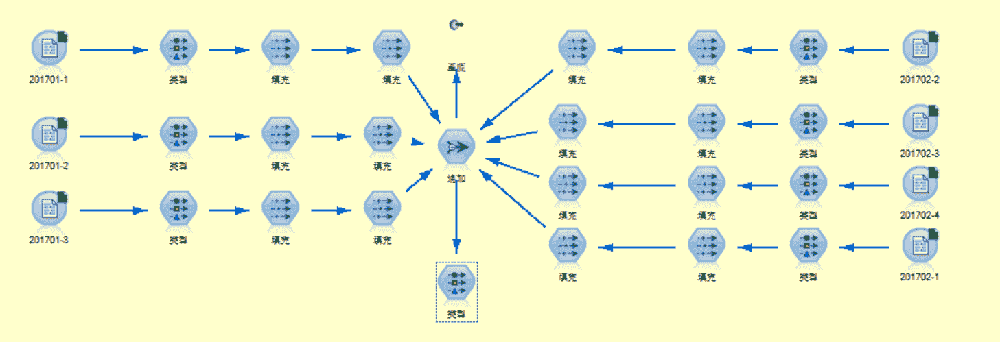

提取并输出正常以及故障风机的信息并输出：

##### 图 2\. 找出正常和故障风机

##### 图 3\. 找出正常和故障风机的代码

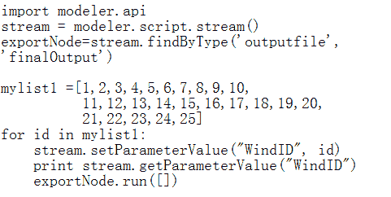

### 确定故障时长

取得 11 号风机，1 月 26 号和 2 月 5 号的故障数据。观测不同的值随时间的变化。同时对数据波动和相关性做一定的感性分析。发现一般故障前三天数据有波动和表现。

##### 图 4\. 平均风速各个变量随时间变化

##### 图 5\. 发电机转矩各个变量随时间变化

##### 图 6\. 发电机转速各个变量随时间变化

有些变量，故障前没有任何表现，例如发电机转速，故障前是没有明显的表现，但是仍然保留，由于本次故障样本数据有局限，与发电机转速没有关系。但是为了模型以后的扩展，仍然保留。

### 数据源读入与集成

由前几章节的分析可以确定，故障发生前 3 天的数据为故障数据。取得风机数据如下表所示：

##### 表 3\. 故障风机

| **风机** | **数据** |
| --- | --- |
| 11 号风机 | 2017-01-15 2017-01-162017-01-172017-01-18 |
| 11 号风机 | 2017-02-05 2017-02-042017-02-032017-02-02 |
| 11 号风机 | 2017-01-23 2017-01-24 2017-01-25 2017-01-26 |
| 23 号风机 | 2017-01-23 2017-01-24 2017-01-25 2017-01-26 |

##### 表 4\. 正常风机

| **风机** | **数据** |
| --- | --- |
| 1 号风机 | 2017/1/21 |
| 1 号风机 | 2017/1/22 |
| 1 号风机 | 2017/1/23 |
| 2 号风机 | 2017/1/16 |
| 2 号风机 | 2017/1/17 |
| 2 号风机 | 2017/1/18 |
| 2 号风机 | 2017/1/19 |
| 2 号风机 | 2017/1/20 |
| 2 号风机 | 2017/1/22 |
| 2 号风机 | 2017/1/23 |
| 2 号风机 | 2017/1/24 |

读入样本数据，根据上表选取的数据进行风机的选取。同时把所有的数据进行整合，用于后续的工作。

##### 图 7\. 合并所有数据

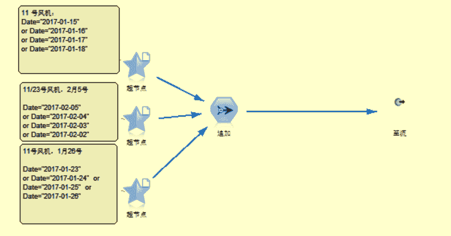

### 数据清洗

读入数据并观测数据质量。通过基本观测去除掉质量较低，冗余的变量。对数据进行相应的处理，提高数据质量。

#### 去除冗余变量

根据业务理解，发电机有功功率，10s 平均功率，有功功率对于齿轮箱轴承预测模型来说，数据上代表类似的意思。通过数据分析，说明数据分析也有很高的耦合性。由于功率有波动，所以选择 10s 功率作为模型的变量。同理处理瞬时风速与 10s 平均风速。

##### 图 8\. 风速数据相关性观测

##### 图 9\. 发电机功率数据相关性观测

##### 图 10\. 风速时间相关性观测

##### 图 11\. 发电机功率时间相关性观测

##### 图 12\. 风速相关性分析

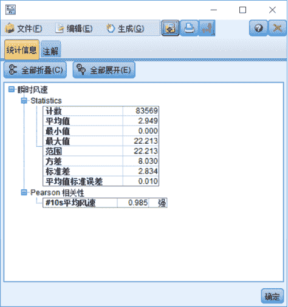

##### 图 13\. 功率相关性分析

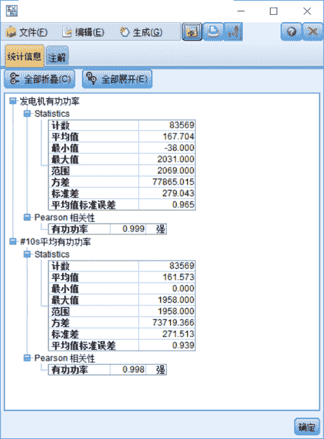

#### 去掉低质量变量

通过观察可得，以下数据均为空。为无效字段。所以全部去除。

##### 图 14\. 去除低质量变量

#### 缺失值填充

观测数据质量，数据没有缺失值，不需要填充。

##### 图 15\. 数据填充

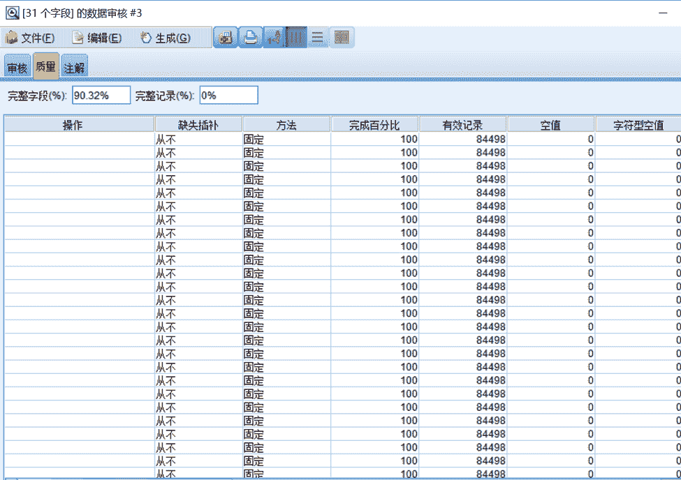

原始数据中存在比较明显的不合理值，例如”齿轮箱高速轴后端温度”高达 5000 多度。需要剔除不合理的值。

##### 图 16\. 观察异常值

##### 图 17\. 去除异常值

### 变量处理

#### 添加业务相关变量：

基于业务理解，增加如下字段用来观测，故障发生前的风机齿轮箱轴承升温相关指征。

##### 图 18\. 增加字段

#### 处理时间

在源数据中，时间信息存储在一个字段，下面对时间进行离散将年月日，时分秒，存储在不同的字段。以备后期处理数据使用。

##### 图 19\. 处理时间

#### 生成趋势和波动变量

针对每个字段生成趋势和波动数据。对数据进行观测。本模型中波动和观测时间段为设置为 12 小时。采用标化线性参数作为趋势表现量。采用标准差作为衡量波动的指标。

##### 图 20\. 生成趋势和波动变量

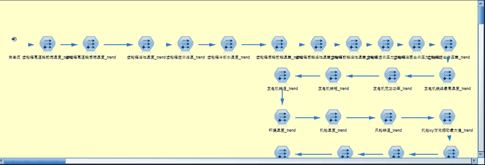

#### 生成统计衍生量

为了表征每个指标的特点，提取每个时间阶段的最大值，最小值和平均值作为观测指标：

##### 图 21\. 生成衍生变量

#### 观测功率与风速间关系

功率作为引起发热的主要原因，与风速有这密切关系。通过观测 V-P 之间的线性趋势。利用制图器，描绘 V-P 之间的关系，可以观测到，V-P 间有较明显的线性关系。

##### 图 22\. 功率与风速关系

分析线性关系，可得三次线性关系能较好的描述 V-P 之间的关系。如下表所示：

##### 表 5\. 模型摘要和参数估计值表

通过 DW 指数可得，V-P 之间的残差具有较好的独立性。 DW 取值范围在 0~4。大于上界：残差独立。小于上界：残差自相关。通过 p-p 描述可得 x 任何一个线性组合，y 服从正太分布。e 服从正太分布。

##### 表 6\. D-W 指数

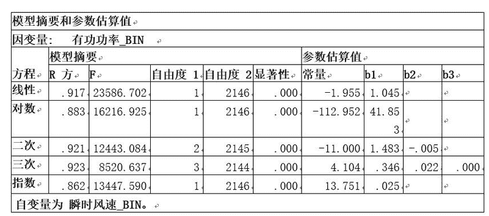

##### 图 23\. 实际累计 P-P 图

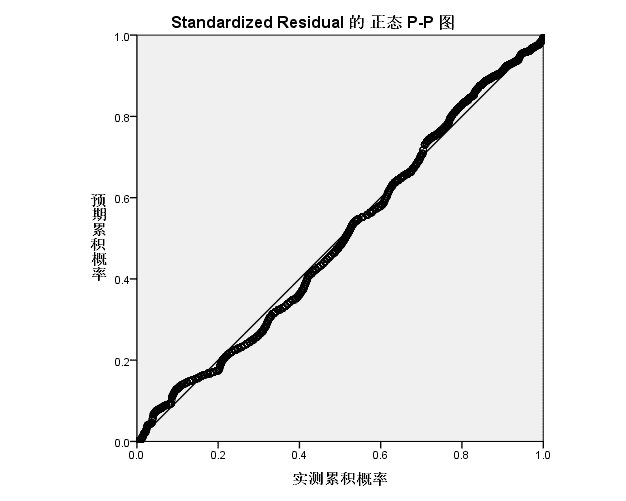

##### 图 24\. 偏差正态 P-P 图

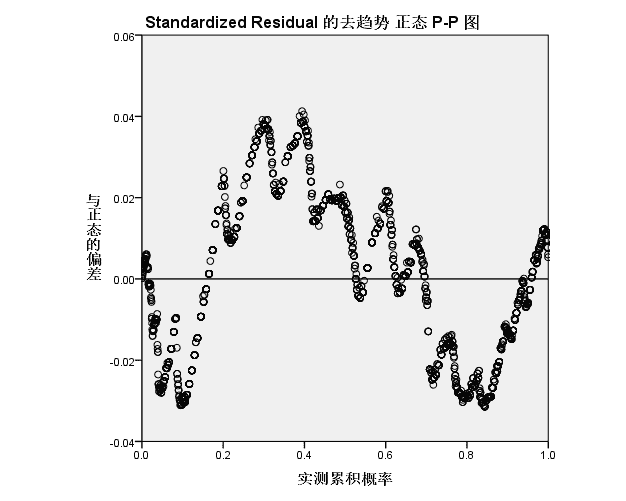

为 V-P 建立线性函数，通过 v 来预测 p 的值，并且与目前的实测值相比较，得到差异值。来观测风机运行的状态。

### 相关性分析

观察每组温度量与是否发生故障之间的关系，例如：环境温度，通过观测可得，发生故障与温度环境有较大关系：

##### 图 25\. 环境温度与故障相关性分析

通过对发电机转矩的分析可得，与发电机转矩相关性不大，但是我们依然保留相关变量。因为本次建模过程所提供的样本量不足，相关性受到样本的平衡性的局限。本次分析只做感性分析，作为后续模型更新的思路。

##### 图 26\. 发电机转矩与故障相关性分析

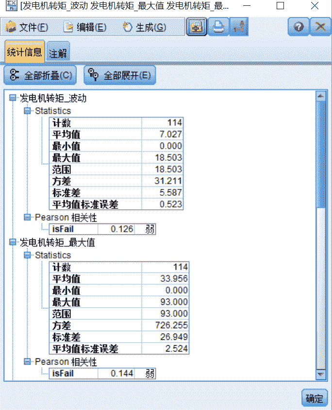

## 项目总结

本项目结合某风场实际采集系统采集回来的数据，经过对业务的深入理解。经过业务的理解得到数据加工的基本思路。通过观察数据的特点，对数据进行处理。提高数据质量为第二部分的数据建模打下良好的基础。