# 几种流行的大数据分析产品模型预测功能介绍

> 原文：[`developer.ibm.com/zh/articles/ba-lo-popular-big-data-analytics-product/`](https://developer.ibm.com/zh/articles/ba-lo-popular-big-data-analytics-product/)

## 引言

随着大数据分析在实际生产中的广泛应用，越来越多的大数据分析产品在市场中出现，有在传统数据分析中占据重要市场地位的 SPSS 一族产品，也有新兴的一些快速发展的数据分析产品，那么对于数据科学家，熟悉目前市场上主流或者说流行的产品，称为必备的技能。

本文以支持导出标准的模型标记语言（PMML）的模型为例，利用产品试用版对时下三个行业领导者厂商的几款主流产品（IBM SPSS Modeler, RapidMiner, KNIME）进行了介绍，包括对模型构建和预测功能进行详细介绍，并对结果进行了简单分析和比较，使用户能够快速了解并使用产品。

## 数据分析平台的选取

随着大数据分析方法技术在实际生产和生活中的应用越来越广泛，各个相关厂商分别都提供了类型繁多的数据分析平台和产品，由此带来的第一个问题就是在众多产品中我们该如何选择，对于开源平台，我们知道流行度比较高的有 R、Scikit-learn、SparkMllib 等，那么对于商业产品我们该怎么去评价和选择，本文选取的是美国 IT 调研机构 Gartner 发布的调研报告。

### Gartner 和魔力象限

Gartner 是全球最具权威的 IT 研究与咨询公司，其研究范围覆盖全部 IT 产业，为客户提供客观公正的论证报告及市场调研报告，协助客户进行市场分析、技术选择等。魔力象限是在某一时间内依据标准从产品出发对市场内的厂商进行分析，魔力象限的四个象限分别是领导者、挑战者、有远见者和特定领域者，其中位于第一象限的领导者在技术实力、市场占有以及前瞻性等方面都非常出色。

2017

### 数据科学魔力象限

在 Gartner 2017 对数据科学平台的魔力象限报告中，包括了 16 个厂商，如图 1 所示，其中位于第一象限的领导者分别是 IBM、SAS、RapidMiner、KNIME。IBM 主要是基于 SPSS Modeler 和 SPSS Statistics 在数据分析方面的优质表现。SAS 因为没有免费试用版所以本文暂且不谈。KNIME 提供的是开源的 KNIME 分析平台，为高级分析师提供强大的数据分析功能。RapidMiner 则拥有良好的图形可视化界面，可以使初学者易于上手，而且提供了免费版供初级用户使用。

本文将对第一象限厂商的几款主要产品进行介绍，分别是 IBM SPSS Modeler、RapidMiner 免费版、KNIME。

##### 图 1\. 2017 数据科学魔力象限

## 几种流行产品介绍以及对预测模型标记语言导出的支持

### IBM SPSS Modeler

IBM SPSS Modeler 是一组数据挖掘工具，通过这些工具可以采用商业技术快速建立预测性模型，并将其应用于商业活动，从而改进决策过程。IBM SPSS Modeler 参照行业标准 CRISP-DM 模型设计而成，可支持从数据到更优商业成果的整个数据挖掘过程。提供了各种借助机器学习、人工智能和统计学的建模方法。

IBM SPSS Modeler 支持多种格式的数据文件导入，包括自由格式和固定格式的文本文件、SPSS 数据文件、SAS 数据集、excel 文档以及数据库文件等。

IBM SPSS Modeler 建模方法分为受监督、关联、细分三种类别：

1.受监督模型使用一个或多个输入字段的值来预测一个或多个输出（或目标）字段的值。如决策树（C&R 树、QUEST、CHAID 和 C5.0 算法）、回归（线性、logistic、广义线性和 Cox 回归算法）、神经网络、支持向量机和贝叶斯网络。

2.关联模型查找您数据中的模式，其中一个或多个实体（如事件、购买或属性）与一个或多个其他实体相关联，如 Apriori 、Carma、序列、关联规则。

3.细分模型将数据划分为具有类似输入字段模式的记录段或聚类。细分模型只对输入字段感兴趣，没有输出或目标字段的概念。细分模型的示例为 Kohonen 网络、K-Means 聚类、二阶聚类和异常检测等。

IBM SPSS Modeler 的主界面非常简洁实用，如图 2 所示。

##### 图 2\. IBM SPSS Modeler 主界面

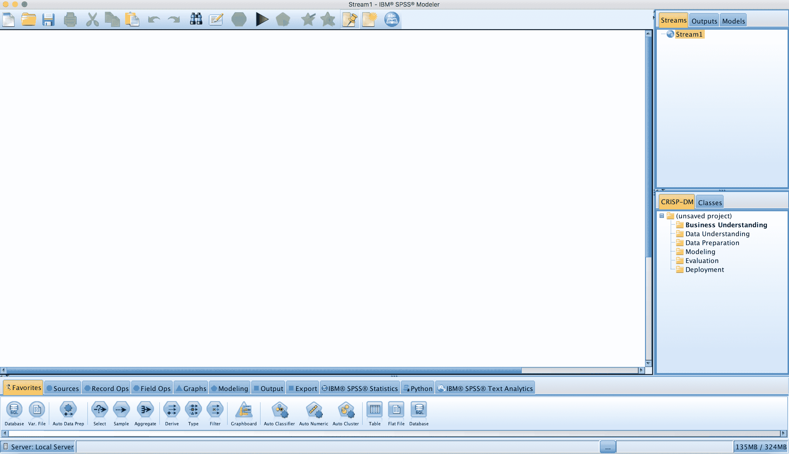

### RapidMiner

RapidMiner 是由同名公司开发的一款数据分析产品，它提供了包括数据准备、机器学习、深度学习、文本分析和模型预测的一个集成环境，并且产品中的每个功能操作都实现了可视化，方便操作，易于上手。RapidMiner 提供了 RapidMiner Studio 免费版，和收费版的区别在于只支持单逻辑处理器，数据规模也仅支持一万行。本文中的所有测试都是使用了 RapidMiner Studio 免费版，安装包可以从官网下载，目前支持 Windows32、Windows64, Mac OS 10.8+和 Linux 操作系统，安装过程非常简单，完成之后打开应用，其主界面如图 3 所示。

##### 图 3\. RapidMiner 主界面

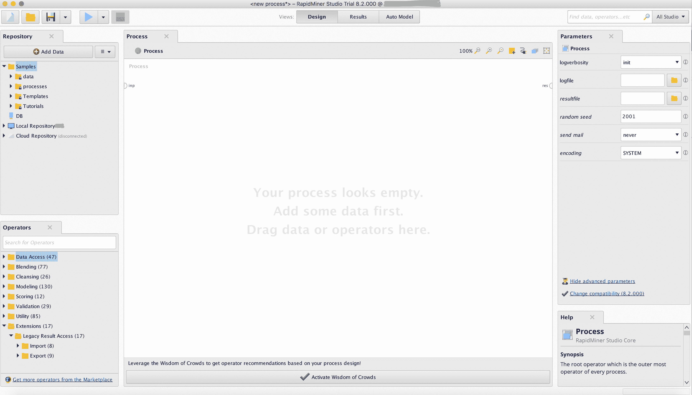

### KNIME

KNIME 分析平台是行业领先的以数据驱动创新的开放解决方案。它能帮助用户发现数据中的潜在信息，探索新的发现或者对将来作出预测。该平台能够快速部署、容易扩展，可以通过其中包括的上百个现成的例子对上千个模型进行学习，该平台还包括一系列模型的集成工具，以及模型选择的算法。KNIME 的主界面如图 4 所示。

##### 图 4\. KNIME 主界面

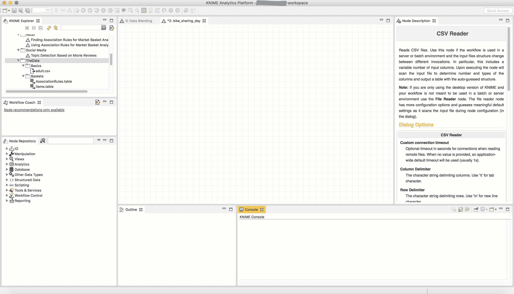

### 预测模型标记语言（PMML）

预测模型标记语言是对数据挖掘模型的文本描述，是模型构建的产物，也是利用模型进行评分或者预测的输入。预测模型标记语言主要是 xml 格式，主要包括数据词典、数据转换、挖掘架构、模型信息等元素，每个元素又包含了很多相关的详细信息。目前，PMML 的最新版本是 4.3。

预测模型标记语言的最大应用除了模型存储之外，可以使不同厂家或者平台的模型构建输出统一化，不同产品的输出模型可以通用。例如，用 IBM SPSS Modeler 构建的模型，导出成标准预测模型标记语言之后，可以利用 RapidMiner 进行评分和预测，所以先进的数据分析产品都会对标准 PMML 的输出进行支持。

对于本文要描述的三款产品，它们分别支持很多算法模型，但并不是所有的模型构建都支持标准 PMML 的导出，下面列出了三款产品对标准 PMML 导出的支持列表，如表 1 所示。当然，也并不是每款产品都支持相同版本的 PMML 导出，不过 PMML 的版本是向下兼容的，所以版本信息不是那么重要。对于不同产品对标准 PMML 导出的支持，可以从 PMML 官网查询。

##### 表 1\. 三种产品对 PMML 的支持

| **Company** | **Software** | **PMML Producer** | **Supported Model Type** |
| --- | --- | --- | --- |
| IBM | IBM SPSS Modeler 17 | PMML2.0 through 4.1 | Produces: Association Model Clustering Models Decision Trees k-Nearest Neighbors Mining Model Naïve Bayes Neural Networks Regression & General Regression Models Ruleset Models Support Vector Machines Consumes (scores): all of the above except Association. |
| RapidMiner | RapidMiner with PMML Extension | PMML 3.2, 4.0 | Linear Regression Logistic Regression ModelsDecision TreesRulesK-MedoidsK-MeansNaïve Bayes |
| KNIME | KNIME 2.10 | PMML 4.2 | Neural Networks Regression & General Regression ModelsClustering ModelsDecision TreesNaïve BayesRule Set EditorRule Set PredictorSupport Vector Machines including support for Transformation elementsModel EnsemblesAnd support for Transformation elements |

在本文中，为了方便介绍和比较，选取了三个产品都支持的线性回归模型，然后分别从数据的选取和加载、模型的构建导出、模型预测等过程对产品的使用进行介绍。

## 以 LinearRegression 模型为例进行模型构建和预测

本章首先介绍数据的选取和加载，然后以 LinearRegression 模型为例对各产品的模型构建和预测功能进行简单介绍。

### 数据的选取和加载

每个产品都支持不同的数据源，一般都会有自带的示例数据。因为本文所使用的模型是线性回归的，所以选取了一个适用于该模型的单车租赁真实数据。共享单车系统是新一代的单车租赁系统，租赁的整个流程，注册、租车、还车环节均可在这个系统中进行。通过这个系统，用户可以很简单的在一个地点借车，然后在城市内其他地点还车。在 2012 年，世界上存在五百多个单车共享系统，五十万以上的共享单车。今天，共享单车业务在中国、美国等国家发展如火如荼，在绿色公共出行、环境保护和市民身体素质提高方面起着巨大的作用。该数据取自 UCI，其各列具体情况如下：

*   dteday : 日期

*   season : 季节 (1:春季, 2:夏季, 3:秋季, 4:冬季)

*   yr : 年份(0: 2011, 1:2012)

*   mnth : 月份( 1 to 12)

*   hr : 小时(0 to 23)

*   holiday : 是否假日

*   weekday : 是否周内

*   workingday : 是否工作日，1：是, 0：不是

*   weathersit : 天气情况

*   1: 晴，少云

*   2:雾，多云

*   3: 小雨，小雪

*   4: 大雨，冰雪，雷阵雨

*   temp : 归一化的温度信息，计算公式：测量值/41

*   atemp: 归一化的体感温度信息，计算公式：测量值/50

*   hum: 归一化的湿度信息，计算公式，·测量值/100 (max)

*   windspeed: 归一化的风速信息，计算公式，·测量值/67 (max)

*   casual: 临时用户的租赁数量 s

*   registered: 注册用户的租赁数量

*   cnt: 用户数，临时和注册用户的租赁数量之和。

除了单车租赁系统，共享单车的数据，包括租赁市场、借还地点等对于人们出行方式的研究非常有意义，这些数据可以通过单车上的芯片由租赁公司实时获取。该数据包含 2011 年和 2012 年 Captial 单车共享系统基于小时和天的单车租赁数据，以及对应的天气数据，如温度、风速。

接下来我们介绍一下各个产品的数据加载和设置：

1.IBM SPSS Modeler 数据加载和设置

从主界面选择 Sources 页，里面包括了所有支持的数据源类型，除了常规的数据格式的支持，其中还包括了很多 IBM 数据源。由于本文的数据格式是 csv 格式，所以我们选择 Var.File。双击或者拖拽至操作面板，都会创建一个新的数据源，如图 5 所示。

在 File 里面选取需要加载的本地数据的路径，就会看到数据被读入，其他选项均为数据的相关设置，没有特殊要求全部选择默认即可。另外，在 Data 页面可以选择数据的存储类型，Filter 页面可以选择哪些 field 被过滤掉不参与后续处理。Types 页面可以设置数据每一列的 role，即在后续模型构建中作为输入变量还是目标变量，或者既是输入又是输出。Annotations 页面是一些补充说明，或者叫注释。

##### 图 5\. IBM SPSS Modeler 数据加载

2.RapidMiner 数据加载和设置

RapidMiner 导入数据有两种方法，一种是通过 Repository 工具栏中的 “Add Dada” 添加本地数据到 “Local Repository” 下，然后通过拖拽将其放到操作窗口中，如图 6 所示。

##### 图 6\. RapidMiner 数据加载方法一

另一种方法是通过算子载入数据集，双击或者拖拽 “Read CSV” 将其放到操作窗口中，如图 7 所示。数据加载过程中可以进行具体列的选择和设置，如去掉建模不需要的列、设置 label 变量等，如图 8 所示。

##### 图 7\. RapidMiner 数据加载方法二

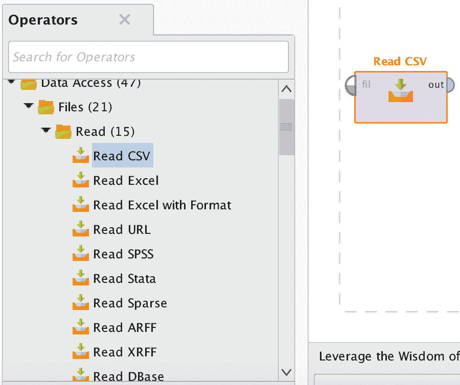

##### 图 8\. RapidMiner 数据列选择和设置

3.KNIME 数据加载和设置

在 KNIME 主界面左下角节点仓库中 “IO” 的 “Read” 下提供了加载多种数据类型的节点，此处我们选择 “CSV Reader”，双击或者拖拽均可将其放到操作窗口。在操作窗口的 “CSV Reader” 图标上双击点开便可进行本地数据的加载设置，如图 9 所示。

##### 图 9\. KNIME 数据加载

### 模型的构建和预测

1.IBM SPSS Modeler

此例中我们使用 “Var.File” 加载外部数据 “bike_sharing_day.csv”，使用 “Filter” 过滤掉对建模具有负面影响的 instant、dteday、casual、registered 四列，使用 “Sample” 选择前 700 条数据（2011 年全部和 2012 年 1-11 月的数据）作为训练数据用于建模，后 31 条数据（2012 年 12 月的数据）作为测试数据用于后续评分，使用 Linear 以 cnt 为 target 基于日期（season, yr, mnth, holiday, weekday, workingday）和天气信息(weathersit, temp, atemp, hum, windspeed)建立线性回归模型，如图 10 所示。

##### 图 10\. IBM SPSS Modeler 模型构建

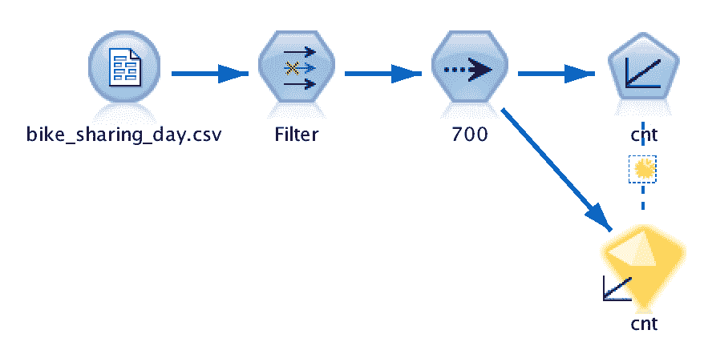

“Linear” 默认会使用 “Automatically prepare data” 对数据进行自动优化处理，比如去除一些异常值，经过自动数据处理的数据更有益于模型构建。另外 “Model selection method” 默认会使用 “Forward stepwise”。此例中为了三种产品的可比性我们让 Modeler 不使用数据自动优化处理，如图 11 所示，并且选择 “Include all predictors” 作为模型选择方法，如图 12 所示。

##### 图 11\. Automatically prepare data

##### 图 12\. Model selection method

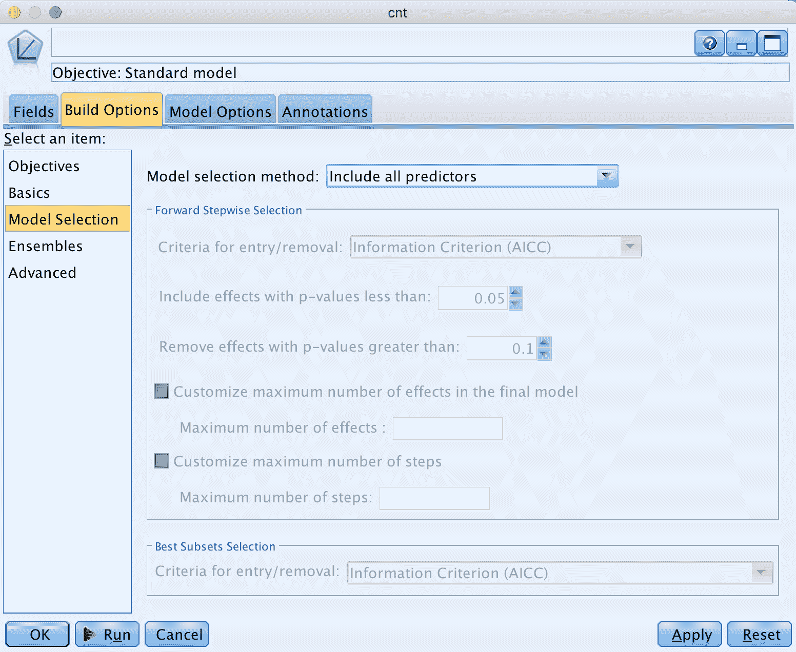

其他参数我们采用默认值，在 “Linear” 图标上右键执行 “Run” 后会看到生成一个新的黄色图标（Models 窗口也会出现此图标）即为建模输出结果，如图 10 所示。可以双击图标查看具体信息，“File” 下 “Export PMML” 或者在 “Models” 窗口右键 “Export PMML” 可导出 PMML 文件。

Modeler 的建模结果提供了多达十个窗口的众多信息。比如，“Predictor Importance” 直观的显示出年份（yr）、天气（weathersit）和风速（windspeed）是对单车租赁影响最大的三个因素，与之相反，是否工作日（workingday）、月份（mnth）、温度（temp）对租赁业务影响不是很大，如图 13 所示。

##### 图 13\. Predictor Importance

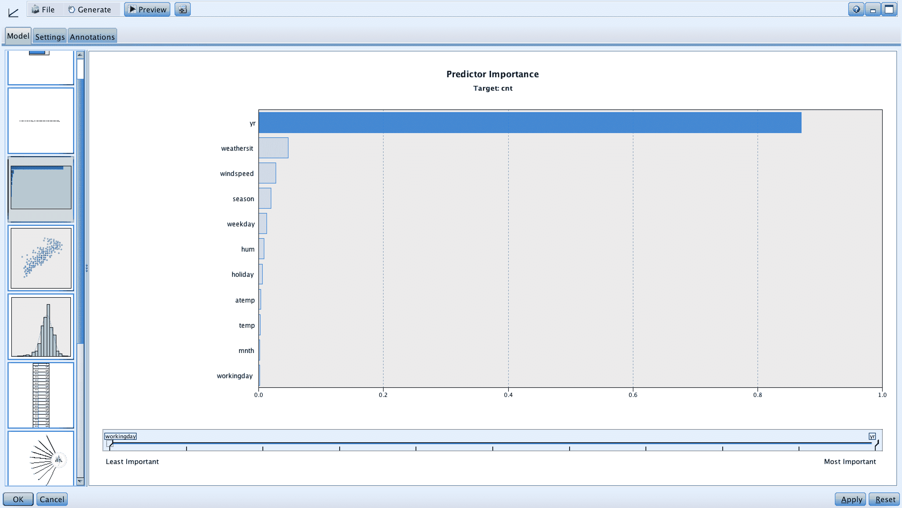

“Coefficients” 列出了模型系数的值、显著性检验以及置信区间，也可以看到按照预测变量重要性的降序从上到下对效应进行了排序（依次为 yr、season、weathersit 等），与 “Predictor Importance” 是一致的，如图 14 所示。

##### 图 14\. Coefficients

接下来我们使用模型生成的 PMML 对将来的租赁业务进行预测，可以直接使用建模生成的结果图标也可以通过在 “Models” 空白处点右键加载已导出到本地的 PMML 文件，此例为了方便介绍我们采用第二种方法重新建立了一个新的 stream。

我们依然使用建模的数据源并且通过 “Filter” 过滤掉四列，只是此时使用的是 “Sample” 的 “Discard sample” 选项丢弃前 700 条数据，在 PMML 之后使用 “Table” 用于存储预测结果，如图 15 所示。

##### 图 15\. IBM SPSS Modeler 模型预测

在”Table”上点击运行后会弹出预测结果，最后一列”$L-cnt”即为预测结果，如图 16 所示。

##### 图 16\. IBM SPSS Modeler 模型预测结果

2.RapidMiner

使用 “Read CSV” 加载外部数据 bike_sharing_day.csv，在加载数据过程中过滤掉 instant、dteday、casual、registered 四列，使用 “Split Data” 将数据划分为训练集（前 700 条）和测试集（后 31 条），即将 “Split Data” 的 “ratio” 设置为 0.957 和 0.043，使用 “Set Role” 设置 cnt 为 label，使用 “Linear Regression” 以 cnt 为目标变量基于日期（season, yr, mnth, holiday, weekday, workingday）和天气信息(weathersit, temp, atemp, hum, windspeed)建立线性回归模型，最后通过 “Apply Model” 进行模型检验和预测，如图 17 所示。

##### 图 17\. RapidMiner 模型构建

点击运行按钮执行成功后，在自动切换到的 “Results” 界面下可以看到具体的统计信息，如图 18 所示。

##### 图 18\. LinearRegression

在另一个界面 “ExampleSet” 中可以看到使用测试集数据得到的预测值，如图 19 所示。

##### 图 19\. ExampleSet

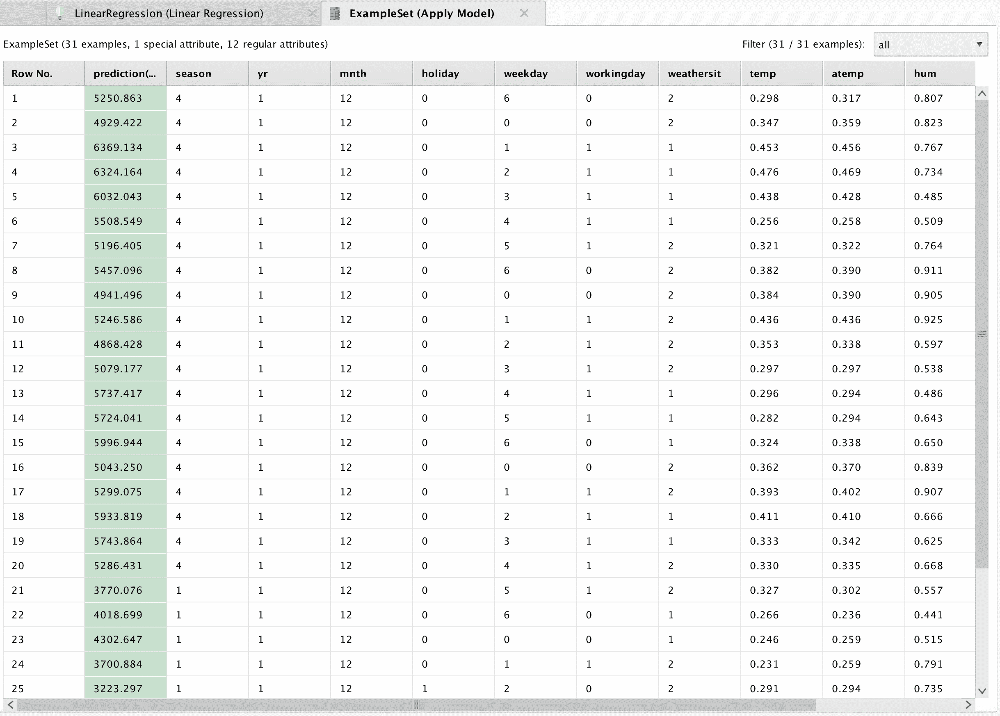

3.KNIME

KNIME 使用 Partitioning 模块，将数据分为训练数据和测试数据（数据条数与前两种产品一致），使用训练数据基于日期（season, yr, mnth, holiday, weekday, workingday）和天气信息(weathersit, temp, atemp, hum, windspeed)建立线性回归模型，如图 20 所示。

##### 图 20\. KNIME 模型构建

模型训练成功后（状态指示灯为绿），可以在 Linear Regression Learner 右键菜单上查看模型的系数和统计信息（如图 21），以及该模型的散点图（如图 22）。

从模型可以看出，年份、天气和风速对单车租赁数量影响最大，是否工作日、月份、温度对租赁业务影响很小。

##### 图 21\. Statistics on Linear Regression

另一个对了解模型有帮助的是模型散点图，如图 22 所示，是租赁数量相对于月份的散点图，从中可以看到单车夏季的租赁业务明显好于冬季。

##### 图 22\. 散点图

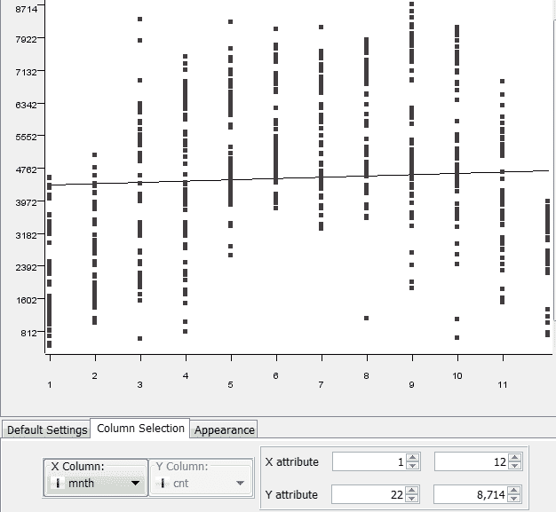

接下来我们通过 PMML READ 节点和 CSV READER 节点，将前面保存的 PMML 和测试数据加载起来，然后通过 “Regresion Predictor” 进行预测，如图 23 所示。

##### 图 23\. KNIME 模型预测

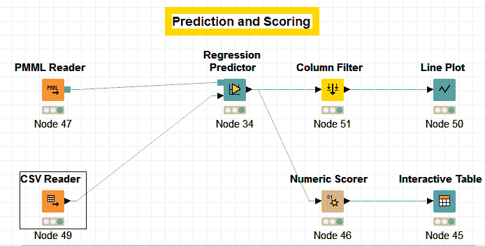

在输出结果 “Interactive Table” 的最后一列可以看到使用测试集数据得到的预测值，如图 24 所示。

##### 图 24\. KNIME 模型预测结果

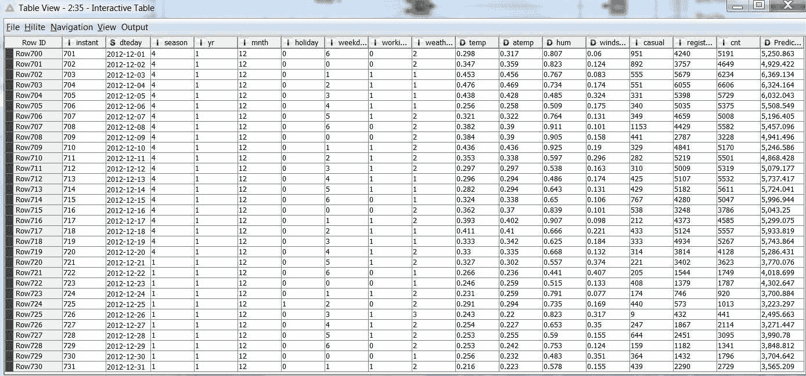

由于三种产品的预测值基本相同，我们在此只使用 KNIME 的可视化节点（另外两种产品也有各种可视化节点）查看模型分别对训练数据和测试数据的预测值，如图 25 所示。可以看到模型有些欠拟合，即模型对训练数据拟合很好，但对测试数据的表现差些，这与测试数据的样本数目比较少，以及训练数据中 12 月份的数据样本较少有关系。

##### 图 25\. 训练数据和测试数据的预测值

通过以上介绍可以看出三种产品都可以通过界面简单便捷地进行建模和预测，虽然个别节点存在各种各样的差异，功能的多样性也各有不同，但是在此例中得出了非常相似的结果，无论是建模结果中各个变量对模型的贡献度大小还是各种统计信息的值都基本相同，还有对测试数据的预测值也基本相同。在实际使用时大家可以基于自己的实际情况和使用习惯进行选择。

## 总结

在实际的数据分析场景或者实验中，我们往往会用到各种产品，通过本文的介绍，让读者对目前流行的数据分析产品有一个基础的认识，让大家了解如何使用这几种产品进行建模和预测，希望为后面的深入了解和使用起到一些帮助作用。

## 参考资源

*   [PMML 官网](http://dmg.org/pmml/products.html)
*   [获取数据网站](http://archive.ics.uci.edu/ml/datasets/Bike+Sharing+Dataset)
*   [spss-modeler 官网](https://www.ibm.com/products/spss-modeler)
*   [Rapidminer 官网](https://rapidminer.com/)
*   [KNIME 官网](https://www.knime.com/)