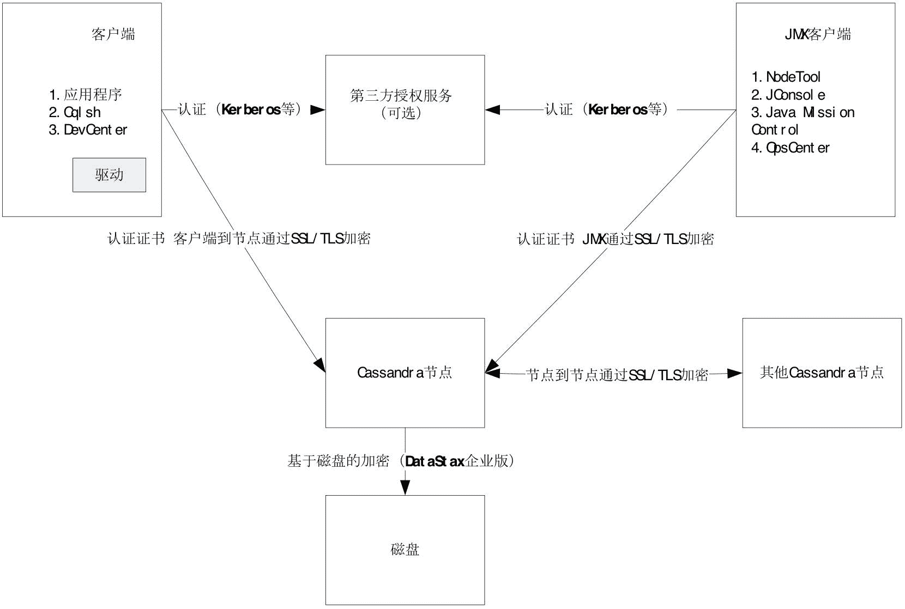

# Cassandra 安全篇

> 原文：[`developer.ibm.com/zh/articles/os-cn-apache-cassandra3x5/`](https://developer.ibm.com/zh/articles/os-cn-apache-cassandra3x5/)

NoSQL 数据库的安全性一直被业界诟病，早在 2012 年就有媒体提出了”为什么 NoSQL 等同于无安全”这样的言论，今天，我们的话题就是 Cassandra 的安全特性。

## 安全特性概述

对于一个安全的 Cassandra 集群来说，Cassandra 的安全特性包括认证（Authentication）、基于规则的授权（Role-Based Authorization）、以及加密（Encryption），如图 1 所示。

*   **认证** ：如何允许应用程序和用户访问集群。
*   **授权** ：授予访问数据库或者数据库内部对象（例如表、物化表）的权限。
*   **加密** ：参考安全套接字层（Secure Socket Layer，SSL）的使用方式，在客户端和 Cassandra 服务端之间，以及各个 Cassandra 工作节点之间，通过加密方式确保通信安全。

##### 图 1\. Cassandra 安全特性总体架构图



## 认证

我们来看看很多其他的数据库，基本上大家都会采用诸如 users、roles 这样的实体方式来描述用户信息、角色信息，而这些实体方式又被用于封装一系列的对象权限。

Cassandra 是基于角色进行所有的认证和授权行为的：

*   对于数据库角色/账户，Cassandra 提供了通过执行 `CREATE ROLE` 命令创建数据库角色，也提供了通过 `CREATE USER` 命令创建新的数据库账户。
*   对于访问集群方式，Cassandra 默认不需要针对某一个用户的认证，我们可以通过 `cqlsh` 命令直接访问，不需要额外的凭证或者访问授权即可进入集群。

### 基于角色的认证

通过执行以下步骤配置基于角色的认证：

1.  `修改 cassandra.yaml` 文件的授权选项 authenticator，具体值修改为 `PasswordAuthenticator` ，这个选项强制要求访问集群时需要角色的名字和密码。
2.  重启数据库。
3.  登录 `cqlsh` 。
4.  授权系统 `keyspace system_auth` 存储角色。 注意：默认情况下这个角色授权表只会存在一个文件，也就是说它没有副本，我们可以通过修改 `system_auth` 表的 `REPLICATION` 字段的值增加副本数量，例如清单 1 所示。

##### 清单 1\. 修改字段值

```
 ALTER KEYSPACE "system_auth" WITH REPLICATION
   ={'class':'NetWorkTopologyStrategy','dc1':5,'dc2':3} 
```

1.  在集群内启动副本因素，运行针对 `system_auth keyspace` 的 `nodetool` 修复命令，如清单 2 所示。

##### 清单 2\. 针对 `system_auth keyspace` 的 `nodetool` 修复命令

```
 $ nodetool repair system_auth 
```

6.重启数据库。

另外，如果你的数据库服务访问请求并发量很高，这个时候可以通过将 `cassandra.yaml` 文件里的 `credentials_validity_in_ms` 和 `credentials_update_interval_in_ms` 的值（默认 2 秒）适当降低，从而可以减少同一时间的访问请求（实际上就是把认证过程时间拉长，这样在某一时间点看起来认证请求数量减少了）。

### 创建角色

Cassandra 内置了一个 Cassandra 角色（密码也是 `cassandra` ），注意，这个角色具备管理员权限，所以最好提前做一些保护，例如修改密码，其实很多资深数据库管理员建议不要使用这个账户，永远封存它，因为权限太大了。如果你使用 `cassandra` 账户访问服务端，那么你会看到如清单 3 所示。

##### 清单 3\. 访问服务端

```
$cqlsh 192.168.1.2 –u Cassandra –p Cassandra
Connected to Test Cluster at 192.168.1.2:9042.
[cqlsh 5.0.1 | Cassandra 3.10 | CQL spec 3.4.4 | Native protocol v4]
Use HELP for help. 
```

如果这种情况下尝试创建一个新的角色，你会收到错误，如清单 4 所示。

##### 清单 4\. 错误输出

```
Cassandra@cqlsh>create role newrole with password 'newrole';
SyntaxException: line 1:20 mismatched input 'withpassword' expecting EOF(create user
newuser [withpassword]...) 
```

为什么会有这个错误呢？因为 `cassandra` 账户的默认授权选项配置是 AllowAllAuthenticator，不需要任何的授权认证，你可以将 `cassandra.yaml` 里面的 `authenticator: AllowAllAuthenticator` 对应的值改为 authenticator:PasswordAuthenticator 来允许密码设置。另外，你的所有关于账户的修改都会保存在 `system_auth.credentials` 表里。

如果想要让某一个用户拥有所有的权限，只需要使用超级用户登录服务端后执行以下命令，如清单 5 所示。

##### 清单 5\. 授予 newsuper 权限

```
grant all permissions on all keyspaces to newsuper; 
```

### 密码认证

Cassandra 允许任何客户端连接集群，但是这并不意味着连接过程中就没有安全保护了，而是 Cassandra 被配置使用认证机制允许所有的客户端不需要提供认证凭证连接。Cassandra 的安全机制是可插拔方式的，也就是说你完全可以自己写一套认证逻辑。

默认的认证类是 `org.apache.cassandra.auth.AllowAllAuthenticator` ，如果你想要要求客户端提供认证凭证，可以使用 `org.apache.cassandra.auth.PasswordAuthenticator` 。如果你想要配置认证器，可以这样操作：

1.  首先关闭集群。
2.  然后打开 `cassandra.yaml` 文件并且搜索 `authenticator` 关键词，将 `authenticator:AllowAllAuthenticator` ，改成 `authenticator:PasswordAuthenticator` 。
3.  最后，启用 Cassandra 授权机制部分的 CassandraRoleManager。

除了密码认证方式以外，你也完全可以自己编写一个认证机制，例如 Kerberos ticket，或者如果你想要在不同的位置存储密码，例如 LADP 目录。为了创建自己的授权方案，你可以申明 Authenticator 接口。

Cassandra 也在节点之间的认证机制上提供了可插拔组件方式，你可以通过实现 InternodeAuthenticator 接口方式重写包含认证的方法。默认的实现 AllowAllInternodeAuthenticator 没有包含认证内容。

接下来我们会保存 `cassandra.yaml` 文件并且重启集群，然后尝试登陆 cqlsh，如清单 6 所示。

##### 清单 6\. cqlsh 输出

```
$bin/cqlsh
Connection error: ('Unable to connect to any servers',
       {'127.0.0.1': AuthenticationFailed('Remote end requires
Authentication.' ,)}) 
```

以上错误提示我们需要用户名和密码，我们可以尝试使用默认的 cassandra 用户名，密码也是一样的，尝试通过认证，如清单 7 所示。

##### 清单 7\. 尝试认证

```
$bin/cqlsh –u Cassandra –p Cassandra
Connected to Test Cluster at 127.0.0.1:9042
[cqlsh 5.0.1 | Cassandra 3.0.0-rc1 | CQL spec 3.3.1| Native protocol v4]
Use HELP for help.
cassandra@cqlsh> 
```

默认密码肯定是很危险的，我们可以通过以下命令修改用户 cassandra 的默认密码，如清单 8 所示。

##### 清单 8\. 修改用户 cassandra 的默认密码

```
Cassandra@cqlsh>ALTER USER Cassandra WITH PASSWORD '82dicw223w' 
```

我们可以通过 cqlsh 的命令 `LIST USERS` 查看所有的用户，返回结果，如清单 9 所示。

##### 清单 9\. 通过 cqlsh 的命令 `LIST USERS` 查看所有的用户

```
name    | super
cassandra| True 
```

你可以看到 cassandra 这个用户是一个超级用户（superuser），只有超级用户才能创建其他用户。

## 基于规则的访问控制

在一个大型的 Cassandra 集群里，可能存在大量的 `keyspace` 和表，以及很多潜在的用户，这样用户和 `table` 之间的关联关系就变得很复杂了。为了让使用更容易，从 CassandraV2.2 开始，Cassandra 提供了基于规则的访问控制（RBAC）机制，允许我们创建角色并且对这些角色赋予权限，角色和用户之间是一对多的关系，角色和角色之间可以是包含关系。

1.尝试创建一个名叫 `house_management` 的角色，然后将 `house` 这个角色的 `keyspace` 下的所有表赋予这个角色，如清单 10 所示。

##### 清单 10\. 赋予角色

```
GRANT ROLE house_management;
GRANT ALL ON KEYSPACE house TO house_management; 
```

2.赋予角色给某一个用户， `GRANT ROLE house_management TO zhou;` 。

角色本身是具有一定权限的，如果你把这个角色给了某个用户或者表，那么意味着该角色所拥有的所有权限也被相应传导给了某个用户或者表。

Cassandra 把用户和角色存储在 `system_auth` 的 `keyspace` 里面，如果我们为自己的集群配置了授权，那么只有管理员账号才能访问这个 keyspace。

3.我们需要配置 `org.apache.cassandra.auth.CassadraAuthorizer` （默认的实现是 `org.apache.cassandra.auth.AllowAllAuthorizer` ），让基于规则的访问控制生效：

*   先关闭集群。
*   搜索 `cassandra.yaml` 文件里的关键词 `authorizer` ，将 `authorizer:AllowAllAuthorizer` 改为 `authorizer:CassandraAuthorizer` 。
*   重启集群，我们可以登入 `cqlsh` ，你会发现我们有权查看所有的 keyspace 和表。

但是当我们尝试查询某一张未经授权的表时，错误出现了，如下所示：

`Unauthorized: code=2100 [Unauthorized] message="User zhou has no SELECT permission on <table a.b> or any of its parents`

我们可以通过授权访问解决这个问题， `GRANT SELECT ON a.b TO zhou`; 当然，你需要使用超级用户运行这条命令。

## 加密

Cassandra 通过客户端和服务器，以及节点之间的加密方式达到保护数据的目的。

Cassandra 使用传输层安全（Transport Layer Security，TLS）加密数据。建立连接之前，每一个终端必须保存认证的一对公钥和密钥。公钥是在通信中用于交换的，密钥是不会分享给其他人的。

### TLS

Cassandra 使用 TLS 作为机密数据。TLS 在客户端和服务器端之间使用公钥加密。每次建立连接之前，终端（客户端和服务端）都需要保留一对公钥和密钥，公钥用于两端交换，密钥是自己独享的。

### 内部节点加密

这里我们以一个三个节点通过 SSL 组建集群的示例作为案例，注意，为了更快速地管理集群，我们这里使用了 CCM 工具，您可以在搜索引擎上搜索 cassandra ccm，就会知道这个工具了。

1.创建一个叫做 `sslverify` 的 Cassandra 集群，第一步创建集群，命令如清单 11 所示。

##### 清单 11\. 创建集群

```
ccm create -n 3 -v 2.1.9 sslverify
ccm start 
```

2.使用 gen_ca_cert.conf 创建授权认证，如清单 12 所示。

##### 清单 12\. 使用 gen_ca_cert.conf 创建授权认证

```
[ req ]
distinguished_name     = req_distinguished_name
prompt                 = no
output_password        = mypass
default_bits           = 2048

[ req_distinguished_name ]
C                      = US
ST                     = TX
L                      = Austin
O                      = TLP
OU                     = TestCluster
CN                     = TestClusterMasterCA
emailAddress           = info@xxx.com 
```

3.运行 OpenSSL 命令创建认证授权：

`openssl req -config gen_ca_cert.conf -new -x509 -keyout ca-key -out ca-cert -days 365`

解释一下上面的这些参数：

*   `req` ：一个 OpenSSL 子命令，以下所有的参数都会隶属于这个 req 命令。
*   `-config` ：配置文件，用于避免在 STDIN 上提供信息。
*   `-x509` ：我们可以用来作为 root 角色的授权认证。
*   `-keyout` ：写入 key 的文件名。
*   `-out` ：写入授权的文件名。
*   `-days` ：授权的有效天数。

4.使用内置的 keytool 工具生成公钥/密钥，如清单 13 所示。

##### 清单 13\. 生成 `key`

```
keytool -genkeypair -keyalg RSA -alias node1 -keystore node1-server-keystore.jks -
storepass awesomekeypass -keypass awesomekeypass -validity 365 -keysize 2048 -dname
"CN=node1, OU=SSL-verification-cluster, O=TheLastPickle, C=US"

keytool -genkeypair -keyalg RSA -alias node2 -keystore node2-server-keystore.jks -
storepass awesomekeypass -keypass awesomekeypass -validity 365 -keysize 2048 -dname
"CN=node2, OU=SSL-verification-cluster, O=TheLastPickle, C=US"

keytool -genkeypair -keyalg RSA -alias node3 -keystore node3-server-keystore.jks -
storepass awesomekeypass -keypass awesomekeypass -validity 365 -keysize 2048 -dname
"CN=node3, OU=SSL-verification-cluster, O=TheLastPickle, C=US" 
```

里面有些参数需要解释，如下所示:

*   `-genkeypair` ：keytool 命令用于指明生成公钥/密钥。
*   `-keyalg` ：此例使用 RSA 算法。
*   `-alias` ：生成的公开/私有 key 的别名。
*   `-keystore` ：存放 key 的路径。
*   `-storepass` ：存放 key 密码的路径。
*   `-keypass` ：key 的密码。
*   `-validity` ：key 的有效日期数。
*   `-keysize` ：key 生成的大小。

5.在每一个节点上建立互相的信任，这样在集群内访问就可以正常进行了，命令如下：

`keytool -keystore generic-server-truststore.jks -alias CARoot -importcert -file ca-cert -keypass mypass -storepass truststorepass –noprompt`

6.把 key 移动到 CCM 工具可以找到的地方，命令如清单 14 所示。

##### 清单 14\. 移动 key

```
cp node1-server-keystore.jks ~/.ccm/sslverify/node1/conf/server-keystore.jks
cp node2-server-keystore.jks ~/.ccm/sslverify/node2/conf/server-keystore.jks
cp node3-server-keystore.jks ~/.ccm/sslverify/node3/conf/server-keystore.jks 
```

7.在 Cassandra 的配置文件里增加加密选项，如清单 15 所示。

##### 清单 15\. 增加加密选项

```
server_encryption_options:
  internode_encryption: all
  keystore: /Users/zznate/.ccm/sslverify/$NODE/conf/server-keystore.jks
  keystore_password: awesomekeypass
  truststore: /Users/zznate/.ccm/sslverify/$NODE/conf/server-truststore.jks
  truststore_password: truststorepass
  protocol: TLS
  algorithm: SunX509
  store_type: JKS
  cipher_suites: [TLS_RSA_WITH_AES_256_CBC_SHA]
  require_client_auth: true 
```

## 结束语

本文是 Apache Cassandra 3.X 系列文章的第五篇，主要对 Cassandra 安全认证的三个方式，即认证、基于规则的访问控制、加密等三种方式进行介绍，这三种方式用于确保集群内部的通信安全，这里针对三个特性进行了逐一解释，并通过一些示例进行了讲解，示例包括创建角色、密码认证、生成公钥/密钥等。