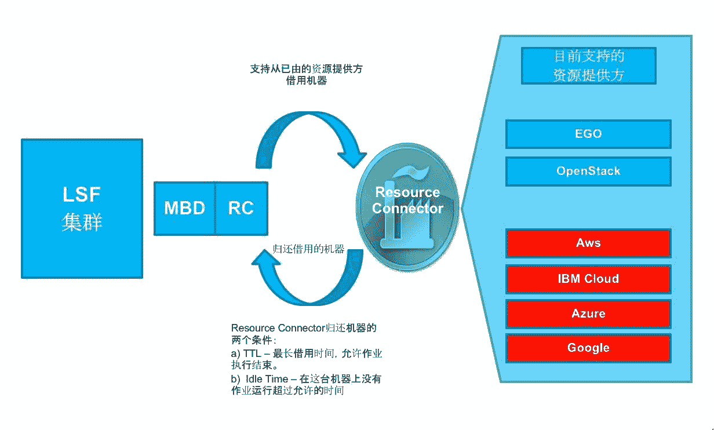
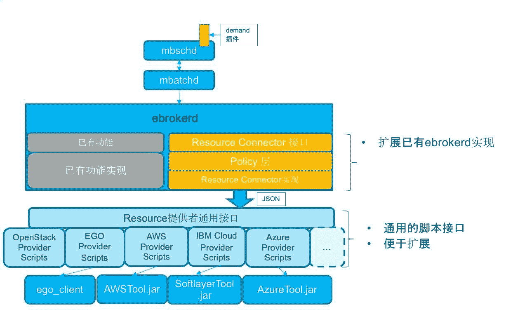

# IBM Spectrum LSF 的混合云解决方案 – LSF Resource Connector

> 原文：[`developer.ibm.com/zh/articles/cl-lo-ibm-spectrum-lsf-hybrid-cloud-solution/`](https://developer.ibm.com/zh/articles/cl-lo-ibm-spectrum-lsf-hybrid-cloud-solution/)

Platform Load Sharing Facility（简称 LSF）是一个用于作业调度的管理平台，主要应用于高性能计算领域，近年来又广泛应用于金融、工业设计和电子设计自动化（Electronics Design Automation，简称 EDA）等领域。LSF 主要用于处理批处理作业的调度，并且支持不同架构平台的 Unix 和 Windows 操作系统。在 2012 年 1 月，Platform 被 IBM 收购，LSF 也被赋予了新的品牌名称 – IBM Spectrum LSF。

IBM Spectrum LSF 采用的是典型的 Master-Salve 网络架构。Master 节点负责接收用户请求和作业调度。Salve 节点作为计算节点提供计算资源，运行计算作业。LSF Master 节点能够根据集群当前的资源使用情况，将作业调度到满足作业要求的计算节点上去。

## 场景介绍

IBM Spectrum LSF 宣称其管理的集群规模目前已经能够支持多达六千个计算节点。从广义上来讲，LSF 管理的集群就相当于一个小型的企业内部私有云。但是，企业拥有的计算资源毕竟有限，当企业在研发或者业务高峰时期，几千个的计算节点也有可能无法满足大量的用户作业需求。公有云概念的兴起，使得 LSF 的企业用户自然而然的联想，是否可以从各种公有云平台中临时租用虚拟机，作为计算节点加入到 LSF 集群，来满足企业的高峰作业需求。LSF Resource Connector 正是为了满足这一特性需求，设计并实现的一个混合云计算解决方案。

## LSF Resource Connector 介绍

LSF Resource Connector 是 LSF 在 2016 年 7 月发布的最新版本 10.1 里的的一个新特性，该特性使得 LSF 能够根据集群的作业负载情况，从各种外部计算资源管理系统或者公有云平台借用计算资源（虚拟机或者物理机），将其加入 LSF 集群，然后 LSF Master 就可以把作业调度到借用的资源上。目前，LSF 支持的外部资源管理系统有 EGO（Platform Enterprise Grid Orchestrator）和各种公有云平台，如 Openstack、AWS。从 LSF 10.1.0.3 开始，最新开始支持 IBM Cloud（原 Softlayer）和 Azure。如图 1 所示：

##### 图 1\. Resource Connector 架构



### LSF 如何从 Resource Provider 借用机器

LSF Resource Connector 主要涉及到如下几个 LSF 组件：mbschd， mbatchd， ebrokerd。在 ebrokerd 内部，定义了一组通用的 Resource Connector 接口，可以调用不同的外部资源借用和删除接口。例如 SoftlayerTool.jar 作为 IBM Cloud 的 plugin，实现了对 IBM Cloud 的资源借用和删除接口，包括申请创建虚拟机、删除虚拟机和查询虚拟机状态等一系列的接口，如图 2 所示：

##### 图 2\. Resource Connector 组件



在介绍如何配置 Resource Connector 之前，我们先来了解一下 LSF Resource Connector 的组件以及 Resource Connector 如何从外部资源提供方借用资源的，如图 2 所示：

1.  用户像往常一样提交一个 LSF 作业。作业会产生一个对计算资源的需求（demand），但是集群中并没有足够的计算资源来处理作业，这时候就需要从外部资源提供方借用资源了。
2.  mbatch 守护进程会首先检查是否已经有机器被分配并且能够满足这个需求，如果没有，它会根据外部资源模板（template）的定义，计算针对每个模板需要几台机器，然后生成一个具体的资源请求（request），然后把这个 request 发给 ebrokerd 守护进程。
3.  管理员需要事先配置一些 template 来定义外部的机器类型。每个外部资源提供方都需要定义自己的 template 配置文件。template 是 LSF 内部的资源请求和外部机器的映射桥梁。每个 template 代表一组具有相同属性的机器，比如具有同样的 cpu，相同的内存，相同的操作系统和软件等。
4.  根据作业的 demand，LSF Resource Connector 请求外部资源提供方来分配机器。例如，如果资源提供方是 EGO，Resource Connector 就会请求 EGO 分配机器。
5.  对于 EGO 管理的资源，如果有足够的机器在共享的资源组中可用，那么就会成功的从中借到资源。
6.  ebrokerd 守护进程会监控请求的状态，直到它检测到资源提供方成功的分配了机器，并在新分配的机器上作为 LSF Slave 节点启动 LSF 守护进程。这时，ebrokerd 就会通知 LSF，这台机器可以加入 LSF 并且可以使用了。
7.  机器加入到 LSF 集群以后，作业就会被调度到这台机器上。
8.  当没有新的资源需求的时候，LSF 会通知 Resource Connector，同样通过 ebrokerd 守护进程把资源返回给资源提供方。

## 项目背景以及配置文件

IBM Spectrum LSF 在 10.1.0.2 就已经支持了 IBM Cloud 和 AWS。在项目实施过程中，应客户要求，我们为 IBM Spectrum LSF 新增支持了 Azure。接下来本文就以笔者最新参与并实现支持的 Azure 为例，说明我们需要在资源提供方和 LSF Master 节点上都需要做哪些配置。文件的配置方式和原理与 AWS 和 IBM Cloud 基本一致。

### 1\. 配置 Azure 鉴权文件

首先我们需要创建一个 Azure 应用程序的鉴权文件，使得 Azuretool.jar 能够访问 Azure 的虚拟机、存储和网络资源等，具体创建步骤参见如下链接：

[`github.com/Azure/azure-libraries-for-java/blob/master/AUTH.md`](https://github.com/Azure/azure-libraries-for-java/blob/master/AUTH.md)

### 2\. 提供 SSH 公钥

其次要提供一个 SSH 的公钥文件，这个公钥文件会注入到 Azure 上动态创建虚拟机的用户目录下，然后我们就可以用 SSH 私钥登陆虚拟机了。如果没有，在 linux 下可以使用命令 `ssh-keygen` 生成。

### 3\. 创建 Vnets 和 subnet

我们还需要在 Azure 上创建虚拟网络 (Virtual Network – Vnets) 和子网 (Subnet)。这样，新创建的虚拟机就可以使用子网内的 IP 地址进行通信。

### 4\. 创建 Network Security Group

在各种公有云平台，出于安全考虑，都会建议用户创建自己的网络安全组（Network Security Group）。网络安全组就像一道网络防火墙，你可以自定义网络的输入规则 (inbound rules) 和输出规则 (outbound rules)。输入规则定义了外部网络可以通过哪些端口访问网络内的虚拟机。输出规则定义了虚拟机可以通过哪些端口访问外部网络。在网络安全组的输入规则定义里，必须要打开 LSF 用到的端口。这样 LSF 的 Master 节点才能访问到 Azure 上动态创建的虚拟机。默认 LSF 用到的端口如下：

*   LSF_LIM_PORT=7869 (TCP and UDP)
*   LSF_RES_PORT=6878 (TCP)
*   LSB_SBD_PORT=6882 (TCP)

除了上述端口外，对于用户应用里可能用到的端口，都需要在网络安全组中打开。例如，如果你的应用还需要用到 nios 等，还需要额外打开 nios 端口。

### 5\. 创建 LSF Slave 镜像

创建 LSF Slave 节点镜像，首先需要在 Azure 上手工的创建一个虚拟机，具体如何在 Azure 上创建虚拟机请参考：

[`docs.microsoft.com/en-us/azure/virtual-machines/linux/quick-create-portal`](https://docs.microsoft.com/en-us/azure/virtual-machines/linux/quick-create-portal)

虚拟机创建好之后，我们就可以用 ssh 登陆虚拟机，安装 LSF。具体如何安装 LSF Slave 节点，本文不再赘述。安装完 LSF 之后，需要对 `lsf.conf` （清单 1 所示）的默认配置进行修改，必须要添加 azurehost 作为本地资源。

##### 清单 1\. lsf.conf

```
$ cat /opt/lsf/conf/lsf.conf
LSF_GET_CONF=lim
LSF_CONFDIR=/opt/lsf/conf
LSF_LIM_PORT=7869
LSF_SERVER_HOSTS="master.myserver.com"
LSF_VERSION=10.1
LSF_LOCAL_RESOURCES="[resource azurehost]"
LSF_TOP=/opt/lsf/
LSF_LOGDIR=/opt/lsf/log
LSF_LOG_MASK=LOG_WARNING
LSF_ENABLE_EGO=N
LSB_ENABLE_HPC_ALLOCATION=Y
LSF_EGO_DAEMON_CONTROL=N 
```

最后我们可以启动 LSF 的守护进程，来测试这台虚拟机是否能够成功以 “dynamic host” 的形式加入 LSF 集群。如果失败，可以检查一下防火墙或者 DNS 的配置，或检查这台 VM 和 Master 之间是否能够互相 ping 通等。

测试成功，退出 LSF 守护进程，然后在 VM 上执行如下命令：

`$ sudo waagent -deprovision+user -force && halt`

最后，使用 Azure CLI 执行以下命令，创建镜像：

```
$ az vm deallocate -g "RC_RG" -n "lsfSlaveVM"
$ az vm generalize -g "RC_RG" -n " lsfSlaveVM "
$ az image create -n "slaveimage" -g "RC_RG" --os-type Linux --source "lsfSlaveVM" 
```

镜像创建过程中如有任何问题，请参考：

[`docs.microsoft.com/en-us/azure/virtual-machines/linux/capture-image`](https://docs.microsoft.com/en-us/azure/virtual-machines/linux/capture-image)

## 配置 LSF

Azure 上的配置一切完成之后，我们就需要开始修改 LSF Resource Connector 相关的配置文件了。如果你还没有使用过 LSF，请参考： [LSF 的安装文档](https://www.ibm.com/support/knowledgecenter/SSWRJV_10.1.0/lsf_welcome/lsf_kc_install_upgrade.html) 。

### LSF Resource Connector 相关配置文件

对于 Resource Connector Azure 来说，我们会用到如下几个 json 格式的配置文件。

##### 清单 2\. Json 格式配置文件列表

```
${LSF_TOP}/conf/resource_connector/providers.json
${LSF_TOP}/conf/resource_connector/azure/conf/azureprov_config.json
${LSF_TOP}/conf/resource_connector/azure/conf/azureprov_templates.json 
```

如果上述列表中的文件在 `${LSF_TOP}/conf/` 下不存在，我们可以从 `${LSF_TOP}/10.1/ resource_connector` 下面拷贝示例。注意，拷贝后需要修改文件的权限和其他配置文件一致。LSF 的管理员用户必须是这些配置文件的 owner。

首先，修改 `hostProviders.json` 如下：

##### 清单 3\. hostProviders.json

```
{
    "name": "azure",
    "type": "azureProv",
    "confPath": "resource_connector/azure",
    "scriptPath": "resource_connector/azure"
} 
```

有关这个配置文件的更多信息，请参考: [IBM Knowledge Center](http://www.ibm.com/support/knowledgecenter/SSWRJV_10.1.0/lsf_resource_connector/lsf_rc_hostproviders.dita) 。

接下来，修改 `azureprov_config.json` ：

##### 清单 4\. azureprov_config.json

```
{
  "LogLevel": "INFO",
  "AZURE_CREDENTIAL_FILE": "/home/lsfadmin/.azure/credentials",
  "AZURE_REGION": "southeastasia"
} 
```

`AZURE_CREDENTIALS_FILE` 就是在配置 Azure 第一步时生成的鉴权文件。 `AZURE_REGION` 是使用的 Azure 区域。

最后为 Azure 创建 template，修改 `azureprov_templates.json` ：

##### 清单 5\. azureprov_templates.json

```
 {
    "templates": [
        {
            "templateId": "TemplateA",
            "maxNumber": 10,
            "attributes": {
                "type": ["String", "X86_64"],
                "ncores": ["Numeric", "4"],
                "ncpus": ["Numeric", "4"],
                "mem": ["Numeric", "8192"],
                "azurehost": ["Boolean", "1"],
                "zone": ["String", "southeastasia"]
            },
            "imageId": "slaveimage",
            "storageAccountType": "STANDARD_LRS",
            "vmType": "Standard_A4_v2",
            "resourceGroup": "lsf_rg",
            "virtualNetwork": "lsf_vnet",
            "subnet": "lsf_compute_subnet",
            "securityGroup": "lsf_rg",
            "sshPubKeyFile": "/home/lsfadmin/lsf.pub",
            "customScriptUri": "http://10.1.0.4/user_data.sh",
            "instanceTags": "group=project1"
        }
    ]
} 
```

`ImageId` ， `virtualNetwork` ， `subnet` ， `securityGroup` ， `sshPubKeyFile` 等，都需要填写在配置 Azure 过程中创建的 LSF Slave 镜像名称、虚拟网络、子网、网络安全组、SSH 公钥文件路径等。 `ResourceGroup` 就是在 Azure 上创建上述资源所在的资源组名称。

对于 `customScriptUri` ，指的是在 Azure 上启动 Linux VM 时的自定义脚本的 URI。它会在虚拟机创建完成后，启动过程中第一时间以 root 身份在虚拟机上运行。LSF Resource Connector 需要用这个脚本在虚拟机启动过程中启动 LSF 的 Slave 守护进程。用户当然也可以修改这个脚本，添加一些自定义的操作。在 `${LSF_TOP}/10.1/ resource_connector/azure/scripts` 下面有一个示例 `user_data.sh` 。我们可以修改它，并把它放到一个 web 服务器上，使得动态创建的虚拟机能够以 URI 的形式访问到。

##### 清单 6\. user_data.sh

```
#!/bin/bash
LSF_TOP=/opt/lsf
source $LSF_TOP/conf/profile.lsf
lsadmin limstartup
lsadmin resstartup
badmin hstartup 
```

### LSF Master 节点的配置

除了 LSF Resource Connector 相关的配置文件外，我们还需要更新 LSF Master 节点的一些配置文件，使得 LSF Resource Connector 生效。

首先，需要修改 `lsb.modules` ，添加 “schmod_demand” 这个 Plugin 模块，这是 mbschd 在调度时需要用到的。

##### 清单 7\. lsb.modules

```
Begin PluginModule
SCH_PLUGIN          RB_PLUGIN     SCH_DISABLE_PHASES
...
schmod_demand       ()            ()
End PluginModule 
```

修改 `lsf.shared` 文件，添加一个新的 boolean 类型的资源 azurehost。这和我们在配置 清单 5\. azureprov_templates.json 中定义的 template 的 attributes 配置项一致。同样，也和创建的 LSF Slave 镜像中 `lsf.conf` 中配置的本地资源一致。

##### 清单 8\. lsb.shared

```
RESOURCENAME    TYPE   INTERVAL  INCREASING  DESCRIPTION
...
azurehost       Boolean ()       ()          (instances from Azure)
End Resource 
```

修改 lsf.queues，修改或者新加一个名为 “test” 的 queue，配置 RC_HOSTS 同样为 azurehost。这样，所有向这个队列提交的 LSF 作业，就可以触发 LSF Resource Connector 在 Azure 上创建虚拟机。

##### 清单 9\. lsb.queues

```
begin queue
queue_name = test
RC_HOSTS     = azurehost
HOSTS = others+1 lsfmaster
end queue 
```

最后，我们需要在 `lsf.conf` 里配置 `LSB_RC_EXTERNAL_HOST_FLAG` 为 `azurehost` ，使得 LSF Resource Connector Azure 生效。

##### 清单 10\. lsb.conf

```
LSB_RC_EXTERNAL_HOST_FLAG=azurehost 
```

如果之前在安装 LSF Master 节点时，没有在 `install.config` 里打开 “ENABLE_DYNAMIC_HOSTS = Y”，那么我们还需要打开 “dynamic host” 相关参数：

```
LSF_DYNAMIC_HOST_WAIT_TIME = <<seconds>> in lsf.conf
LSF_HOST_ADDR_RANGE=*.*.*.* in lsf.cluster.<clustername> 
```

最后，重启 LSF 的守护进程，使得配置生效。

```
$ lsadmin limrestart
$ badmin mbdrestart。 
```

## 示例

Azure 和 LSF 的配置终于全部配置完成了。终于到了激动人心的时刻了，下面我们向 LSF 提交一个作业，看看 LSF 是否会在 Azure 上动态的创建一台虚拟机。

### 资源借用

提交一个作业，在作业的资源需求里指定这个作业需要运行在具有 azurehost 资源的机器上：

`# bsub -q test -R "select[azurehost]" sleep 60`

可以在 Azure 的 Portal 上查看虚拟机的创建状态。如图所示，新创建了一个主机名为 host-10-1-2-4 的虚拟机，其状态为 “Creating”。

##### 图 3\. 在 Azure 上新创建的虚拟机


等到其状态变为 “Running” 以后，我们也可以使用 `bhosts` 命令监控，查看虚拟机是否加入了 LSF 集群。如下可以看到 “host-10-1-2-4” 已经加入了 LSF 集群，并且有一个运行作业在上面运行。

```
# bhosts -a
HOST_NAME          STATUS       JL/U    MAX  NJOBS    RUN  SSUSP  USUSP    RSV
lsfmaster          ok              -      4      0      0      0      0      0
host-10-1-2-4      ok              -      1      1      1      0      0      0 
```

使用 bjobs 命令查看作业运行在刚刚创建的虚拟机 “host-10-1-2-4” 上。

##### 清单 11\. 查看作业运行

```
# bjobs -l 1
Job <1>, User <lsfadmin>, Project <default>, Status <DONE>, Queue <test>, Comma
                     nd <sleep 60>, Share group charged </lsfadmin>
Mon Aug 28 14:13:30: Submitted from host <lsfmaster>, CWD </usr/local/lsf/work/
                     cluster1>, Requested Resources <azurehost>;
Mon Aug 28 14:18:06: Started 1 Task(s) on Host(s) <host-10-1-2-4>, Allocated 1
                     Slot(s) on Host(s) <host-10-1-2-4>, Execution Home </home/
                     lsfadmin>, Execution CWD </usr/local/lsf/work/cluster1>;
Mon Aug 28 14:19:06: Done successfully. The CPU time used is 0.1 seconds.

 MEMORY USAGE:
 MAX MEM: 2 Mbytes;  AVG MEM: 2 Mbytes

 SCHEDULING PARAMETERS:
           r15s   r1m  r15m   ut      pg    io   ls    it    tmp    swp    mem
 loadSched   -     -     -     -       -     -    -     -     -      -      -
 loadStop    -     -     -     -       -     -    -     -     -      -      -

 RESOURCE REQUIREMENT DETAILS:
 Combined: select[(azurehost) && (type == any)] order[r15s:pg]
 Effective: select[(azurehost) && (type == any)] order[r15s:pg] 
```

### 资源删除

我们可以配置借用资源的删除策略，例如，当借用的虚拟机空闲 10 分钟以后，LSF 就会将其删除。

`LSB_RC_EXTERNAL_HOST_IDLE_TIME=10`

当 host-10-1-2-4 空闲 10 分钟以后，可以在 Azure 的 Portal 上看到，这台 VM 的状态变成了 “Deleting” 状态。同时，使用 bhost 命令也可以看到 LSF 已经将其移除 LSF 集群。

##### 图 4\. 创建虚拟机被自动从 Azure 删除


## 问题与解决技巧

*   我们可以监控 ebrokerd 进程的 log 来第一时间确认在 Azure 上创建虚拟机是否成功。

##### 清单 12\. ebrokerd.log – requestMachines

```
# tail -f ebrokderd.log.lsfmaster
Aug 28 14:13:32 2017 2500 7 10.1 triggerAllocate: Start to call interface
[azure:requestMachines] command
[/usr/local/lsf/10.1/resource_connector/azure/scripts/requestMachines.sh -f
/tmp/lsf_dc_in_yjtU85 < /tmp/lsf_dc_out_gBeGaG 2<&1], input json [{ "template":
{ "templateId": "AzureTemplate-VM-1", "machineCount": 1 }, "rc_account": "default",
"userData": { } }]
Aug 28 14:13:46 2017 2387 10 10.1 readTextFromFile: Entering this function
Aug 28 14:13:46 2017 2387 10 10.1 readTextFromFile: Exiting this function
Aug 28 14:13:46 2017 2387 7 10.1 triggerAllocate: Succeed to call interface
[azure:requestMachines] command [], input json [{ "template": { "templateId":
"AzureTemplate-VM-1", "machineCount": 1 }, "rc_account": "default", "userData": { } }],
exit status [0], output json [{ "message": "Request VM success from azure.", "requestId":
"req-688ff0ac-083b-46a2-8b82-9f5439684737" }]
Aug 28 14:13:46 2017 2387 10 10.1 triggerAllocate: Exiting this function 
```

同样，我们可以监控 ebrokerd 进程的 log 来第一时间确认在 Azure 上创建虚拟机是否删除成功。

##### 清单 13\. ebrokerd.log – requestReturnMachines

```
 # tail -f ebrokderd.log.lsfmaster
Aug 28 14:21:55 2017 3762 7 10.1 triggerDeallocate_list: Start to call interface
[azure:requestReturnMachines] command
[/usr/local/lsf/10.1/resource_connector/azure/scripts/requestReturnMachines.sh -f
/tmp/lsf_dc_in_ZIPd4O < /tmp/lsf_dc_out_ORmoHJ 2<&1], input json [{ "machines": [ { "name":
"host-10-1-2-4" } ] }]
Aug 28 14:22:22 2017 2387 10 10.1 readTextFromFile: Entering this function
Aug 28 14:22:22 2017 2387 10 10.1 readTextFromFile: Exiting this function
Aug 28 14:22:22 2017 2387 7 10.1 triggerDeallocate_list: Succeed to call interface
[azure:requestReturnMachines] command [], input json [{ "machines": [ { "name": "host-10-
1-2-4" } ] }], exit status [0], output json [{ "message": "Delete VM success.",
"requestId": "ret-ae033713-6e0a-407d-ab73-3f2a873a67bc" }]
Aug 28 14:22:22 2017 2387 10 10.1 triggerDeallocate_list: Exiting this function 
```

*   如果 VM 创建失败，可以在 `Azuretool.jar` 的日志文件 `azure-provider.log` 中查找具体的失败原因。
*   在 `${LSF_TOP}/work/<clustername>/resource_connector` 下，有 LSF Resource Connector 维护的机器和请求等持久化文件，例如 `hosts.json` ， `requests.json` 和 `azure-db.json` 。

## 结束语

本文简要介绍了 LSF Resource Connector 的基本工作原理，并以最近项目中实现并支持的 Azure 公有云为例详细介绍了如何配置 LSF Resource Connector。从中可以看出，LSF 作为一个 25 年历史的集群作业调度软件，也在积极的拥抱公有云，为客户提供了自己的弹性混合云计算方案。LSF Resource Connector 不仅为客户提供了价值，也为自己提供了活力。

## 参考资源

*   [EGO 简介](https://www.ibm.com/developerworks/cn/analytics/library/ba-cn-ego-intro-whitepaper/index.html)
*   [IBM LSF Resource Connector 功能介绍](https://www.ibm.com/support/knowledgecenter/SSWRJV_10.1.0/lsf_welcome/lsf_kc_resource_connector.html)
*   [IBM LSF Resource Connector 配置参考](https://www.ibm.com/support/knowledgecenter/SSWRJV_10.1.0/lsf_resource_connector/lsf_rc_reference.html)
*   [如何在 Azure 上创建虚拟机](https://docs.microsoft.com/en-us/azure/virtual-machines/linux/quick-create-portal)
*   [如何创建 Azure 虚拟机镜像](https://docs.microsoft.com/en-us/azure/virtual-machines/linux/capture-image)
*   [如何创建 Azure java 应用的鉴权文件](https://github.com/Azure/azure-libraries-for-java/blob/master/AUTH.md)