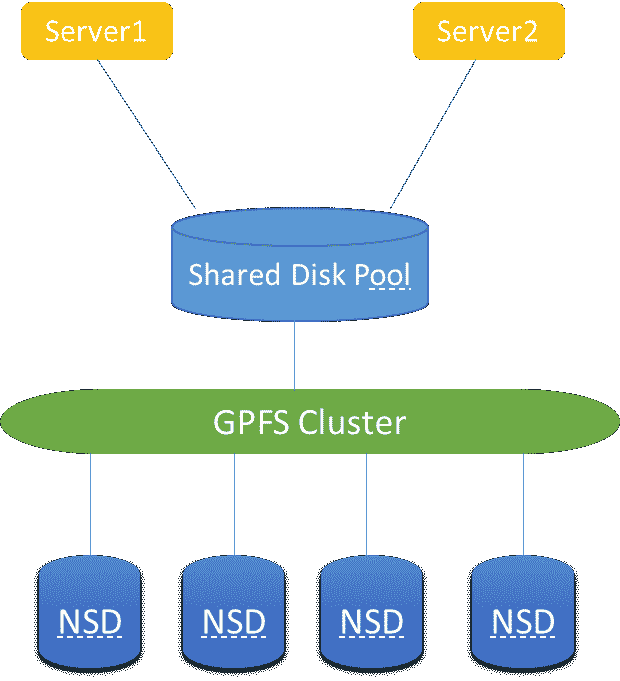
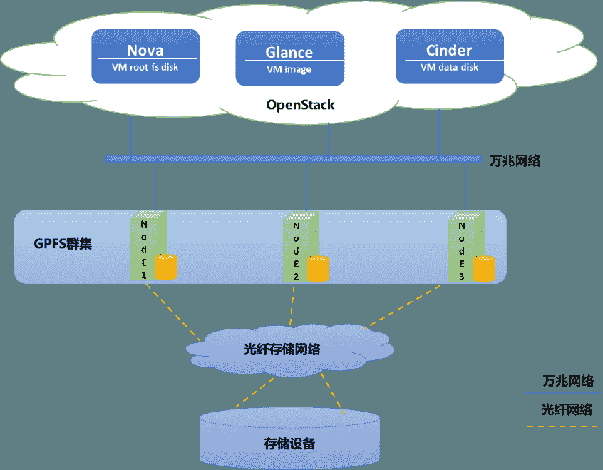
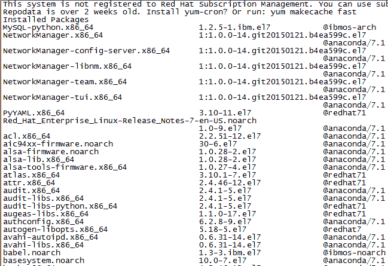
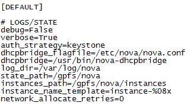

# IBM Spectrum Scale 在云计算环境中的实践

> 原文：[`developer.ibm.com/zh/articles/cl-lo-practice-ibm-spectrum-scale/`](https://developer.ibm.com/zh/articles/cl-lo-practice-ibm-spectrum-scale/)

随着技术的不断发展，大规模的并行计算方式越来越多的激发有关对高性能计算机的需求，如大数据挖掘、高性能计算处理等。同时由于云计算技术的快速普及与发展，如何将高速并行计算应用到企业的私有云平台就成了很多企业探讨和实践的话题。

本文主要介绍 IBM Spectrum Scale 软件如何与当下最流行的开源云管理平台 OpenStack 结合，完成企业私有云平台的构建，既满足计算、存储、网络资源被充分利用，又保证高并发、低开销的需求。该文章主要涉及到三个部分，分别是 Spectrum Scale 的部署、配置和实践。OpenStack 的部署与配置不在本文讨论范围内，具体安装与配置方法请参考 [OpenStack 官方手册](https://www.openstack.org/) 。

*   在部署 Spectrum Scale 之前，一定要先正确配置安装环境，建立必要的 Yum 源，避免依赖包安装失败。
*   在各个节点正确开启时间同步服务 ntp，确保云环境的时间同步。
*   修改各个节点上的 Host 文件，并开启 ssh 免密码登陆功能。
*   关闭各个节点的 selinux，并适当调整本地防火墙策略，避免部署时造成失败。

IBM Spectrum Scale 以前名为 IBM General Parallel File System (GPFS)。下面我将详细介绍 IBM Spectrum Scale 软件的概念与工作机制，本文主要介绍 4.2.3.8 版本，其余版本介绍，可以参考 [IBM Support 官方网站](http://www-01.ibm.com/support/docview.wss?uid=isg400003820) 。

## 基本概念与工作原理

Spectrum Scale 是 IBM 公司一款优秀的分布式文件系统集群软件，其易扩展性、高可靠性得到了业界的一致好评。本章节将着重介绍它的基本概念、特性与工作原理。

### Spectrum Scale 简介与特性

Spectrum Scale 是一款并行的文件系统，它保证在资源组内的所有节点可以并行访问整个文件系统，而且针对此文件系统的服务操作，可以同时安全地在此文件系统的多个节点上实现。它允许客户共享文件，而这些文件可能分布在不同节点的不同硬盘上，保证了数据的一致性和完整性。Spectrum Scale 支持多种平台的部署，如 Windows、Linux、AIX，每种环境部署方式相同，降低了软件部署的复杂度。

通过部署在云环境中部署 Spectrum Scale，可以提升磁盘 I/O，消除存储层面单点故障，保证数据的安全性和一致性，降低 IT 管理成本。

Spectrum Scale 具有以下特性，帮助企业 IT 更好的部署和管理分布式文件系统。

1.  Spectrum Scale 自动在各个节点间同步配置文件和文件系统信息，而且在同一个节点内，对 Spectrum Scale 的管理可以在任一个节点上进行，实现简单管理。
2.  支持大部分的操作系统，如 AIX/Linux/Windows 环境，并支持混合部署，达到不同客户端访问相同存储的目的。
3.  Spectrum Scale 通过一套复杂的信令管理机制（令牌管理机制）保证数据一致性。通过这套机制允许任意节点通过各自独立的路径到达同一个文件。即使节点无法正常工作，Spectrum Scale 也可以找到其它的路径。
4.  Spectrum Scale 也是一种日志文件系统，为不同节点建立各自独立的日志。日志中记录 metadata 的分布，一旦节点发生故障后，可以保证快速恢复数据。
5.  Spectrum Scale 支持超大文件或文件系统，理论上支持 2 的 99 次方字节大小（超过 100TB）的文件系统，每个文件系统支持 2 Billion 个文件。
6.  Spectrum Scale 能够有效的将集群上所有的磁盘负载的 I/O 进行均衡，这样就避免了热点磁盘出现竞争问题，从而提高性能。

### Spectrum Scale 的工作原理

Spectrum Scale 采用 C/S 结构来对集群内的节点进行管理。为了更好的理解它的工作方式及管理模型，本章将通过图形方式对其原理进行阐述。

Spectrum Scale 客户端（Client）是在软件安装后人为指定的，因为无论是服务器端和客户端，采用的软件及安装方式都是相同的。主要是通过在不同的节点上利用本地磁盘建立 NSD 共享盘，并将其通过 Spectrum Scale 统一管理生成共享池，提供给不同的终端使用，同时借助锁机制达到多终端同时读写的需求。具体通信原理图，如图 1 所示，命令执行如图 2 所示：

##### 图 1.Spectrum Scale 通信原理图



专业术语说明：

*   NSD 是网络共享盘，一个虚拟的磁盘子系统，提供对 Spectrum Scale 内共享磁盘全局命名的功能。
*   Cluster 是多个节点的集合，它们共享同一个或者多个并行文件系统，集群里的节点可以并发访问这些文件系统内的数据。
*   失败域是一个磁盘的集合，一个单点故障会引起集合内部的所有磁盘同时失效。
*   仲裁是保障 Spectrum Scale 资源可用和完整性的机制，在 Spectrum Scale 中，如果半数以上节点 Spectrum Scale 守护进程正常工作，次机制就被激活，Spectrum Scale 系统处于正常工作状态。

##### 图 2.Spectrum Scale 操作执行原理图


原理图说明：

*   本地磁盘将被发现并添加到全局的命名空间中，形成网络共享盘（NSD），供集群调用。
*   NSD 将保存数据分为多种类型，主要是用于检索的元数据（meta）和用于存储的 data 数据。
*   集群将生成的 NSD 盘按照不同的需求生成多个或单个共享磁盘，供上层服务器挂载。
*   最后上层服务器可以利用 mount 将多个或者单个共享磁盘挂载到本地，进行数据存储，同时保证并发操作。

本章使大家了解了什么是 Spectrum Scale 以及它的通信及执行原理，下一章节将主要介绍本次实例部署的架构设计。

## 架构设计

为了让大家更好的理解在企业私有云环境中部署 Spectrum Scale 的优势，根据项目的实际经验绘制了部署架构图，并在文中对架构图进行了详细说明。如图 3 所示：

##### 图 3.Spectrum Scale 部署架构图



说明：

*   在本文中，我们将采用以上架构设计完成 Spectrum Scale 对 OpenStack 云平台的融合。
*   为了更好的理解架构用意，以下为详细说明。

*   通过光纤存储网络划分三块大盘分别挂载到不同的 Spectrum Scale 节点中，充当共享存储盘，供 VM 的存储。

*   采用三台服务器作为 Spectrum Scale 集群节点，分别挂载来自存储的三块物理存储卷到本地文件系统。
*   通过 Spectrum Scale 初始化操作，将三块数据卷进行 NSD 格式化，确保可以被 Spectrum Scale 集群统一调用。
*   通过 Spectrum Scale 集群划分三块共享卷给 OpenStack 云环境，分别挂载到 Nova 节点，作为 VM 的存储，Glance 节点作为镜像的存储，Cinder 节点，作为实例数据盘的存储。
*   多个 Nova 节点之间可以同时读写共享存储池，便于实现 VM 的动态迁移。

## 安装与配置

对 Spectrum Scale 有了一个初步的了解之后，您将在本章通过实际案例操作进一步熟悉 Spectrum Scale。本章节一共分为三个部分，分别介绍安装环境的说明，具体安装及安装后的相关配置。

### 环境说明

由于受到硬件资源限制，测试环境将采用三台服务器进行部署，并且每台服务器上已经挂载从 SAN 划分的物理卷，每台服务器角色均为 Spectrum Scale 的存储节点，同时一台是主配置服务器，一台是辅助配置服务器，详细信息如表 1 所示:

##### 表 1.Spectrum Scale 环境说明

| **主机名** | **IP 地址** | **角色** | **操作系 统** |
| --- | --- | --- | --- |
| GPFS-SERVER01 | 9.*.*.* | Pconfig server\quorum-manager | Redhat 7.1 |
| GPFS-SERVER02 | 9.*.*.* | Sconfig server\quorum-manager | Redhat 7.1 |
| GPFS-SERVER03 | 9.*.*.* | Quorum-manager | Redhat 7.1 |

### Spectrum Scale 的安装

目前 Spectrum Scale 支持在多种平台的部署，具体到每个平台的安装部署，可以参考官方文件。本实例中将主要介绍基于 Linux 平台的安装部署与配置。

#### 依赖组件的安装

由于 Spectrum Scale 的安装过程需要其它软件包的支持，所以我们建议安装主要的 YUM 源，之后再安装 Spectrum Scale。在此之前需要先将下表 2 中的依赖软件包安装到主机上，避免因为缺少依赖关系而产生错误。

##### 表 2\. 依赖软件包

| **软件名** | **功能** |
| --- | --- |
| Gcc 软件包 | 代码编译包 |
| Cpp 软件包 | 一种计算机的编程语言 |
| Automake | Makefile 文件编辑器 |
| Kernel-devel | 内核文件开发包 |
| Kernel-headers | 系统内核头文件包 |
| Binutils | 一组开发工具包 |
| Python | Python 主安装文件 |
| Make | Linux 系统的编译及安装工具 |
| Ksh | 一种交互式的命令 [解释器](https://baike.baidu.com/item/%E8%A7%A3%E9%87%8A%E5%99%A8) 和命令编程语言 |
| Gcc-c++ | 针对 C++的代码编译包 |

由于现场环境不能连接到 Redhat 的公共 YUM 源，因此采用 ISO 方式使用本地的 YUM 源。

```
# vi /etc/yum.repos.d/local.repo
[rhel-7-server]
name=RHEL 7 SERVER packages
baseurl=file:///mnt
enabled=1
gpgkey=file:///mnt/RPM-GPG-KEY-redhat-release
gpgcheck=1 
```

运行 `yum clean all` 来清除 yum 缓存，防止不正确的 yum 缓存的影响。运行 `yum repolist` 查看配置的 yum 源信息，并通过 `Yum list` 命令来校验安装源是否生效，如出现图 4 所示，则表明 Yum 源已经生效。

##### 图 4.Spectrum Scale 安装源



建立好安装源及解决了软件包依赖关系之后，下一步将介绍如何在各个主机上完成系统基本环境的配置，包括 host 文件修改、SSH 的配置、防火墙及 NTP 的配置。

#### 系统基本环境准备

修改三个节点的 `/etc/hosts` 文件，应包含组内的节点 `IP` 和 `hostname` 。

##### 清单 1\. 修改 Host 文件

```
127.0.0.1   localhost localhost.localdomain localhost4 localhost4.localdomain4
::1         localhost localhost.localdomain localhost6 localhost6.localdomain6

9.*.*.* GPFS-SERVER01
9.*.*.* GPFS-SERVER02
9.*.*.* GPFS-SERVER03 
```

为了方便实验，我们将关闭系统防火墙与 Selinux。

##### 清单 2\. 修改防火墙配置

```
#systemctl status firewalld
#systemctl stop firewalld
#systemctl disable firewalld
#systemctl status firewalld

#setenforce 0      #临时生效
#getenforce
vim /etc/selinux/config，修改 SELINUX= disabled 参数 
```

注意：该操作需要重启主机操作系统生效。

推荐用户在所有的系统节点上配置 Network Time Protocol（NTP）服务，确保所有系统节点间时间同步。如果时间不同步，可能引起 debugging 问题或者授权问题。确保系统时区设置正确，如不正确使用如下命令修改。

首先修改配置文件 `vim /etc/ntp.conf` ，加入客户的 ntp server 地址，之后执行 ntpate 服务器 IP 来校验时间。

##### 清单 3\. 修改系统 NTP 配置

```
# ntpdate  <NTP_server_IP>
# systemctl enable ntpd
# systemctl start ntpd
# systemctl status ntpd 
```

管理员使用 ssh-keygen 工具产生 key 文件 `#ssh-keygen -t rsa` ，在每个 `RHEL` 节点生成 `ssh-key` 之后一路回车。

##### 清单 4\. 修改 SSH 免密码登陆配置

```
Generating public/private rsa key pair.
Enter file in which to save the key (//.ssh/id_rsa): 回车
Created directory '//.ssh'.
Enter passphrase (empty for no passphrase): 回车
Enter same passphrase again: 回车
Your identification has been saved in //.ssh/id_rsa.
Your public key has been saved in //.ssh/id_rsa.pub.
The key fingerprint is:
db:0b:23:aa:81:a9:b2:41:33:97:8b:6b:b7:24:fc:2c root@node1 
```

在节点 1 上复制 `rsa.pub` 为 `authorized_keys` ，并将其复制到节点 2 和节点 3。

```
#cp /.ssh/id_rsa.pub /.ssh/authorized_keys
# scp node2:/.ssh/id_rsa.pub /tmp/id_rsa.pub2
# scp node3:/.ssh/id_rsa.pub /tmp/id_rsa.pub3
#cat /tmp/id_rsa.pub2 >>/.ssh/authorized_keys
#cat /tmp/id_rsa.pub3 >>/.ssh/authorized_keys
#scp /.ssh/authorized_keys node2:/.ssh/authorized_keys
#scp /.ssh/authorized_keys node3:/.ssh/authorized_keys 
```

验证所有节点的 ssh 通讯, 如能显示日期则验证通过:

*   在节点 1 `# ssh GPFS-SERVER02 date; ssh GPFS-SERVER03 date；`
*   在节点 2 `# ssh GPFS-SERVER01 date; ssh GPFS-SERVER03 date；`
*   在节点 3 `# ssh GPFS-SERVER01 date; ssh GPFS-SERVER02 date。`

以上配置完成后，重启所有节点，准备进行安装。

#### 安装 Spectrum Scale

如上表 2，已经清晰的列出需要依赖哪些安装包确保 Spectrum Scale 的成功安装。配置好 yum 源之后，只需要输入以下命令 `yum install` 加上表中的软件名，就可以自动安装依赖包 **。** 依赖包安装完成后，将 Spectrum Scale 软件包 `Spectrum_Scale_Advanced-4.2.1.0-x86_64-Linux-install` 上传到所有的节点服务器，通过 `chmod+x` 赋予执行权限。解压安装文件 `./ Spectrum_Scale_Advanced-4.2.1.0-x86_64-Linux-install –text-only` ，根据提示按”1″，并接受 license 协议继续，默认安装文件会被解压到 `/usr/lpp/mmfs/4.2.1.0` 目录下。

之后建立 unused 文件夹，并移动扩展名为 deb、sles、e16、tct 的文件到 unused 文件夹内，最后执行 `mmbuildgpl` 完成 Spectrum Scale 的安装，以上步骤在三个节点上依次执行，如清单 5 所示:

##### 清单 5\. Spectrum Scale 软件安装

```
# ./Spectrum_Scale_Advanced-4.2.1.0-x86_64-Linux-install –text-only
# cd /usr/lpp/mmfs/4.2.1.0
# mkdir -p /usr/lpp/mmfs/4.2.1.0 /unused
# mv *.deb unused/
# mv *sles* unused/
# mv *el6* unused/
# mv *tct* unused/
# /usr/lpp/mmfs/bin/mmbuildgpl 
```

依照本章介绍来看，Spectrum Scale 软件已经安装，下一章将介绍如何验证 Spectrum Scale 是否正确的被安装，符合集群搭建条件。

#### Spectrum Scale 软件验证

在三个节点上，使用 `#rpm –qa | grep gpfs` 命令验证 Spectrum Scale 软件版本符合实验要求。为了系统可以直接识别和调用 Spectrum Scale 命令，我们将 Spectrum Scale 的路径添加到 PATH 环境变量中。执行 `/usr/lpp/mmfs/bin 到/root/.bash_profile` 环境变量文件中，如清单 6 所示:

##### 清单 6\. PATH 环境变量修改

```
# .bash_profile
# Get the aliases and functions
if [ -f ~/.bashrc ]; then
        . ~/.bashrc
fi
# User specific environment and startup programs
PATH=$PATH:$HOME/bin:/usr/lpp/mmfs/bin
export PATH 
```

之后在三个节点上执行以下命令，验证环境变量是否生效，如清单 7 所示:

##### 清单 7.Spectrum Scale 变量验证

```
source  /root/.bash_profile
Mmlscluster 
```

到目前为止，Spectrum Scale 的安装工作已经完成，经过验证，软件符合集群搭建要求。下一章将主要介绍如何配置 Spectrum Scale，使其可以正常的提供集群功能。

### Spectrum Scale 的配置

Spectrum Scale 的配置工作可以在三个节点的任意主机上执行，结果会通过 Spectrum Scale 同步机制自动复制到其它节点。本章将通过配置角色、创建集群、创建 NSD、创建文件系统四大部分来详细介绍。

#### 配置角色

Spectrum Scale 集群中有三个主要的角色需要提前定义，分别是主配置服务器、辅助配置服务器和仲裁服务器。此项目我们需要建一个三节点的 Spectrum Scale CLUSTER。以 `GPFS-SERVER01` 为主配置服务器， `GPFS-SERVER02` 为备用配置服务器，并将三个节点均作为 `quorum` 与 `manager` 节点，分别以 `ssh`, `scp` 作为 `RemoteShell` 和 `RemoteFileCopy` 命令。

在批量创建中，建议通过创建 `nodefile` 的形式创建集群。这样可以实现一次编辑，批量部署，简化配置。在 GPFS-SERVER1 上建立 `/home/gpfs` 目录，并创建节点配置文件 `testnodefile`, 如清单 8 所示:

##### 清单 8.Spectrum Scale 角色配置

```
#mkdir /home/gpfs
#vi /home/gpfs/testNodeFile
#more /home/gpfs/testNodeFile
GPFS-SERVER01:quorum-manager
GPFS-SERVER02:quorum-manager
GPFS-SERVER03:quorum-manager 
```

配置完成后，就可以通过 Spectrum Scale 内置指令创建集群，所有角色将自动按照事先定义的服务器自动推送与设置。

#### 创建集群

Spectrum Scale 集群创建是非常简单的操作，IBM 在创建方面做的很精细，管理员只需要记住一个简单的指令，就可以创建出符合企业规模要求的集群。如清单 9 所示操作，利用 `mmcrcluster` 来创建集群，并如清单 10 所示操作，输入 `mmchlicense server` 接受许可认证。

##### 清单 9.Spectrum Scale 创建

```
# mmcrcluster -N testNodeFile --ccr-disable -p GPFS-SERVER01 -s GPFS-SERVER02 -r /usr/bin/ssh -R /usr/bin/scp 
```

如上指令 `-N` 是制定之前建立的 `nodefile` 文件， `-p` 是指定谁承担主配置服务器角色， `-s` 是指定辅助配置服务器， `-r` 和 `-R` 分别是指定 `RemoteShell` 和 `RemoteFileCopy` 命令的实现方式。

##### 清单 10.Spectrum Scale 接受许可

```
#mmchlicense server --accept -N all 
```

我们可以通过运行 `mmlscluster` 查看集群配置，确认集群配置是否按照之前 `nodefile` 的要求去配置。如清单 11 所示启动集群并验证配置:

##### 清单 11.Spectrum Scale 启动集群

```
# mmstartup -a

# mmgetstate -Lsa 
```

至此我们已经完成 Spectrum Scale 的全部配置，集群服务已经处于激活状态。在下一章中，将添加磁盘作为 Spectrum Scale 的共享存储池介质，供服务调用。

#### 创建 NSD

我们的物理服务器内置磁盘为 SSD 和 SAS 两种。按照如下规则创建 NSD：所有 ssd 磁盘创建为 system 池，容纳 metadata 数据，所有的 SAS 磁盘创建为 fpodata 池，用于容纳 data 数据，每台服务器都是一个单独的失败域。由于内置磁盘数过多，所以我们将通过建立 NSDfile 的方式，批量创建 NSD 盘，自动加入到相应的存储池中。

在 `GPFS-SERVER01` 上创建并编辑 `/home/gpfs/testNSDfile` 文件 (nsdname 命名中不能使用”-“)，如清单 12 所示:

##### 清单 12\. 编辑 NSD 文件

```
%pool: pool=system blockSize=256K layoutMap=cluster allowWriteAffinity=no
%pool: pool=fpodata blockSize=1M layoutMap=cluster allowWriteAffinity=yes writeAffinityDepth=1 blockGroupFactor=1
%nsd: nsd=SERVER01SSD1  device=/dev/sdw servers=GPFS-SERVER01 usage=metadataOnly failureGroup=101 pool=system
%nsd: nsd=SERVER01SSD2  device=/dev/sdx servers=GPFS-SERVER01 usage=metadataOnly failureGroup=101 pool=system
%nsd: nsd=SERVER01SSD3  device=/dev/sdt servers=GPFS-SERVER01 usage=metadataOnly failureGroup=101 pool=system
%nsd: nsd=SERVER01SSD4  device=/dev/sdy servers=GPFS-SERVER01 usage=metadataOnly failureGroup=101 pool=system
%nsd: nsd=SERVER01SSD5  device=/dev/sdv servers=GPFS-SERVER01 usage=metadataOnly failureGroup=101 pool=system
%nsd: nsd=SERVER01SSD6  device=/dev/sdr servers=GPFS-SERVER01 usage=metadataOnly failureGroup=101 pool=system
%nsd: nsd=SERVER01SSD7  device=/dev/sdu servers=GPFS-SERVER01 usage=metadataOnly failureGroup=101 pool=system
%nsd: nsd=SERVER01SSD8  device=/dev/sds servers=GPFS-SERVER01 usage=metadataOnly failureGroup=101 pool=system
%nsd: nsd=SERVER01SAS00  device=/dev/sda servers=GPFS-SERVER01 usage=dataOnly failureGroup=1101 pool=fpodata
%nsd: nsd=SERVER01SAS01  device=/dev/sdb servers=GPFS-SERVER01 usage=dataOnly failureGroup=1101 pool=fpodata
%nsd: nsd=SERVER01SAS02  device=/dev/sdc servers=GPFS-SERVER01 usage=dataOnly failureGroup=1101 pool=fpodata
%nsd: nsd=SERVER01SAS03  device=/dev/sdd servers=GPFS-SERVER01 usage=dataOnly failureGroup=1101 pool=fpodata
%nsd: nsd=SERVER01SAS04  device=/dev/sdf servers=GPFS-SERVER01 usage=dataOnly failureGroup=1101 pool=fpodata
%nsd: nsd=SERVER01SAS05  device=/dev/sde servers=GPFS-SERVER01 usage=dataOnly failureGroup=1101 pool=fpodata
%nsd: nsd=SERVER01SAS06  device=/dev/sdh servers=GPFS-SERVER01 usage=dataOnly failureGroup=1101 pool=fpodata
%nsd: nsd=SERVER01SAS07  device=/dev/sdj servers=GPFS-SERVER01 usage=dataOnly failureGroup=1101 pool=fpodata
%nsd: nsd=SERVER01SAS08  device=/dev/sdk servers=GPFS-SERVER01 usage=dataOnly failureGroup=1101 pool=fpodata
%nsd: nsd=SERVER01SAS09  device=/dev/sdg servers=GPFS-SERVER01 usage=dataOnly failureGroup=1101 pool=fpodata
%nsd: nsd=SERVER01SAS10  device=/dev/sdi servers=GPFS-SERVER01 usage=dataOnly failureGroup=1101 pool=fpodata
%nsd: nsd=SERVER01SAS11  device=/dev/sdm servers=GPFS-SERVER01 usage=dataOnly failureGroup=1101 pool=fpodata
%nsd: nsd=SERVER01SAS12  device=/dev/sdo servers=GPFS-SERVER01 usage=dataOnly failureGroup=1101 pool=fpodata
%nsd: nsd=SERVER01SAS13  device=/dev/sdn servers=GPFS-SERVER01 usage=dataOnly failureGroup=1101 pool=fpodata
%nsd: nsd=SERVER01SAS14  device=/dev/sdp servers=GPFS-SERVER01 usage=dataOnly failureGroup=1101 pool=fpodata
%nsd: nsd=SERVER01SAS15  device=/dev/sdl servers=GPFS-SERVER01 usage=dataOnly failureGroup=1101 pool=fpodata

%nsd: nsd=SERVER02SSD1  device=/dev/sds servers=GPFS-SERVER02 usage=metadataOnly failureGroup=201 pool=system
%nsd: nsd=SERVER02SSD2  device=/dev/sdr servers=GPFS-SERVER02 usage=metadataOnly failureGroup=201 pool=system
%nsd: nsd=SERVER02SSD3  device=/dev/sdv servers=GPFS-SERVER02 usage=metadataOnly failureGroup=201 pool=system
%nsd: nsd=SERVER02SSD4  device=/dev/sdy servers=GPFS-SERVER02 usage=metadataOnly failureGroup=201 pool=system
%nsd: nsd=SERVER02SSD5  device=/dev/sdx servers=GPFS-SERVER02 usage=metadataOnly failureGroup=201 pool=system
%nsd: nsd=SERVER02SSD6  device=/dev/sdt servers=GPFS-SERVER02 usage=metadataOnly failureGroup=201 pool=system
%nsd: nsd=SERVER02SSD7  device=/dev/sdw servers=GPFS-SERVER02 usage=metadataOnly failureGroup=201 pool=system
%nsd: nsd=SERVER02SSD8  device=/dev/sdu servers=GPFS-SERVER02 usage=metadataOnly failureGroup=201 pool=system
%nsd: nsd=SERVER02SAS00  device=/dev/sda servers=GPFS-SERVER02 usage=dataOnly failureGroup=2101 pool=fpodata
%nsd: nsd=SERVER02SAS01  device=/dev/sdd servers=GPFS-SERVER02 usage=dataOnly failureGroup=2101 pool=fpodata
%nsd: nsd=SERVER02SAS02  device=/dev/sde servers=GPFS-SERVER02 usage=dataOnly failureGroup=2101 pool=fpodata
%nsd: nsd=SERVER02SAS03  device=/dev/sdg servers=GPFS-SERVER02 usage=dataOnly failureGroup=2101 pool=fpodata
%nsd: nsd=SERVER02SAS04  device=/dev/sdc servers=GPFS-SERVER02 usage=dataOnly failureGroup=2101 pool=fpodata
%nsd: nsd=SERVER02SAS05  device=/dev/sdb servers=GPFS-SERVER02 usage=dataOnly failureGroup=2101 pool=fpodata
%nsd: nsd=SERVER02SAS06  device=/dev/sdf servers=GPFS-SERVER02 usage=dataOnly failureGroup=2101 pool=fpodata
%nsd: nsd=SERVER02SAS07  device=/dev/sdh servers=GPFS-SERVER02 usage=dataOnly failureGroup=2101 pool=fpodata
%nsd: nsd=SERVER02SAS08  device=/dev/sdk servers=GPFS-SERVER02 usage=dataOnly failureGroup=2101 pool=fpodata
%nsd: nsd=SERVER02SAS09  device=/dev/sdm servers=GPFS-SERVER02 usage=dataOnly failureGroup=2101 pool=fpodata
%nsd: nsd=SERVER02SAS10  device=/dev/sdj servers=GPFS-SERVER02 usage=dataOnly failureGroup=2101 pool=fpodata
%nsd: nsd=SERVER02SAS11  device=/dev/sdp servers=GPFS-SERVER02 usage=dataOnly failureGroup=2101 pool=fpodata
%nsd: nsd=SERVER02SAS12  device=/dev/sdl servers=GPFS-SERVER02 usage=dataOnly failureGroup=2101 pool=fpodata
%nsd: nsd=SERVER02SAS13  device=/dev/sdn servers=GPFS-SERVER02 usage=dataOnly failureGroup=2101 pool=fpodata
%nsd: nsd=SERVER02SAS14  device=/dev/sdi servers=GPFS-SERVER02 usage=dataOnly failureGroup=2101 pool=fpodata
%nsd: nsd=SERVER02SAS15  device=/dev/sdo servers=GPFS-SERVER02 usage=dataOnly failureGroup=2101 pool=fpodata 
```

完成配置后，将通过上述 NSD 文件，创建 NSD 磁盘。（以上配置段可以按照各自的实际情况进行修改。）

在创建 NSD 过程中， `-v` 选项缺省值为 `yes` ，表示创建 NSD 时需验证该 hdisk 是否已被 NSD 格式化，当然对一个全新系统，我们可以确定 hdisk 未被格式化，可以制定 `-v no` 跳过检查。通过 `mmcrnsd` 命令创建 NSD，如清单 13 所示：

##### 清单 13\. 创建 NSD

```
# mmcrnsd -F /home/gpfs/testNSDfile -v yes 
```

NSD 建立完成后，下一步将进行文件系统的创建。通过建立文件系统，可以将其格式化并挂载到系统中，供客户端调用。如清单 14 所示：

##### 清单 14\. 创建文件系统

```
#cd /home/gpfs/
#mmcrfs gpfs -F testNSDfile -A no -Q no  -T /gpfs -r 3 -R 3 -m 3 -M 3 -v
no 
```

通过 `mmcrfs` 我们将建立一个名为 `gpfs` 的文件系统。其主要参数-F 用于指定之前创建的 `nsdfile` ， `–T` 是指定挂载点， `-r` 指定副本数量。Spectrum Scale 文件系统建立后，可以通过 `mmlsfs` 命令对其进行验证，确保没有错误产生。如清单 15 所示：

##### 清单 15\. 验证 Spectrum Scale 系统

```
# mmlsfs gpfs
# mmmount all -a
# df -h  (每个节点都执行) 
```

#### Spectrum Scale 参数调优

Spectrum Scale 集群配置完成后，需要根据企业客户要求，进行相关默认参数的调整，以达到最优化的要求，避免资源浪费和性能瓶颈。清单 16 列出了经常使用的一些参数，可以根据自身需要调整。

##### 清单 16.Spectrum Scale 相关参数

```
mmlsconfig all   #显示所有参数值
mmchconfig pagepool=20g
mmchconfig logBufferCount=64
mmchconfig logWrapThreads=32
mmchconfig nsdMaxWorkerThreads=3072
mmchconfig nsdSmallThreadRatio=2
mmchconfig readReplicaPolicy=local
mmchconfig syncBuffsPerIteration=1
mmchconfig minMissedPingTimeout=60
mmchconfig leaseRecoveryWait=65
mmchconfig maxFilesToCache=100000
mmchconfig maxStatCache=100000
mmchconfig worker1Threads=1024
mmchconfig nsdMinWorkerThreads=48
mmchconfig nsdInlineWriteMax=2M
mmchconfig nsdThreadsPerQueue=10
mmchconfig forceLogWriteOnFdatasync=no
mmchconfig disableInodeUpdateOnFdatasync=yes
mmchconfig unmountOnDiskFail=meta
mmchconfig logBufferSize=1048576
mmchconfig prefetchPct=60
mmchconfig tscCmdPortRange="60000-61000"
mmchconfig autoload=yes
mmchconfig restripeOnDiskFailure=yes 
```

通过 `mmchconfig` 命令修改参数，部分参数修改前，需要先关闭集群服务再重启才能生效。为了安全起见，建议修改前参考 IBM 官方手册，对参数了解后再进行调整，避免对业务的影响。如清单 17 所示:

##### 清单 17.Spectrum Scale 参数修改

```
mmchconfig maxblocksize=2048k
mmumount all -a
mmshutdown –a
mmstartup -a
mmgetstate -a
mmmount all -a
mmlsmount all -L 
```

## Spectrum Scale 客户端挂载

通过上述操作，已经将 Spectrum Scale 集群搭建完成，并且已经生成文件系统和共享磁盘供客户端调用。之前已经介绍过 Spectrum Scale 是 C/S 结构的，为了让 OpenStack 中的 nova、glance 和 cinder 可以使用共享磁盘，本章将通过在 OpenStack 中安装 Spectrum Scale 客户端的方式，将共享磁盘挂载到云环境中的计算节点、镜像节点以及块存储节点。

#### 安装 Spectrum Scale 软件

安装软件可以参考文章开头的操作过程，Spectrum Scale 服务器端的安装和客户端的安装没有任何区别，软件的依赖关系也是一样的。

#### 修改 Host 文件

在客户端修改/etc/hosts，加入 Spectrum Scale 的三台服务器，同时确保所有服务器和客户端可以免密码登陆，具体设置方法可以参考本章 Spectrum Scale 安装与配置 。

#### 创建客户端 `Nodefile`

前面已经介绍，Spectrum Scale 的客户端和服务器的区别主要是靠配置文件中的角色定义所决定。为了批量安装和配置好客户端，本项目将采用 `Nodefile` 方式对客户端进行单独安装。编辑 `addnodefile` 文件，内容如清单 18 所示：

##### 清单 18\. 定义客户端 Nodefile

```
GPFS-OC01:client
GPFS-OC02:client
GPFS-OC03:client
GPFS-OC04:client 
```

#### 添加客户端节点

在 Spectrum Scale 集群的任意节点上执行 `mmaddnode` 命令，将客户端节点加入到现有集群中， `-N` 指定前面创建 `addnodefile` 文件。如清单 19 所示：

##### 清单 19\. 添加客户端

```
mmaddnode -N addnodefile 
```

同样，安装完成后，需要通过 `mmchlicense` 命令同意客户端的许可，并通过 `mmstartup` 启动客户端服务，通过 `mmgetstate` 命令查看集群状态，如清单 20 所示：

##### 清单 20\. 添加客户端

```
mmchlicense client --accept -N GPFS-OC01, GPFS-OC02, GPFS-OC03, GPFS-OC04（注册许可）
mmstartup -N GPFS-OC01, GPFS-OC02, GPFS-OC03, GPFS-OC04（启动客户端节点服务）
mmgetstate –a（查看集群状态） 
```

节点服务启动后，Spectrum Scale 文件系统会自动挂载，可以通过 `df –h` 命令查看。

接下来，我们将修改 nova、cinder 和 glance 配置文件，指定 VM 及镜像文件存储在 Spectrum Scale 集群提供的文件系统内。

#### 修改 OpenStack 配置文件

Spectrum Scale 文件系统挂载后，在 nova、cinder、glance 上将以普通的文件系统被识别，只要将 VM 等数据存储在上面即可实现云计算中的诸多高级功能，如 HA、migration 等。同时通过 Spectrum Scale 并发操作可以提高磁盘 I/O，加速 VM 的创建与事物的处理。如图 5 所示，修改 nova 的配置文件，将其指定到 Spectrum Scale 中。

##### 图 5\. 修改 Nova 配置文件



通过如上操作，Spectrum Scale 集群就与 OpenStack 云计算平台相结合，提供高性能的计算服务和存储资源。

## 结束语

通过在 Redhat 上实现 Spectrum Scale 集群的部署与在云计算方面的应用，可以更多的了解其优秀的特性，提高存储性能及云计算的灵活性、扩展性。同时通过本文，可以让读者对 Spectrum Scale 有一个直观的了解和认识，不仅在 Linux 平台，在 AIX 和 Windows 平台上，Spectrum Scale 也有不俗的表现。

## 参考资源

*   参考 [IBM Spectrum Scale 官方文档](https://www.ibm.com/cn-zh/marketplace/scale-out-file-and-object-storage) ，查看更多的功能介绍。
*   参考 [developerWorks 开发者社区](https://www.ibm.com/developerworks/cn/web/) ，查看更多的使用场景。
*   参考 [IBM 官网](https://www.ibm.com/cn-zh/) ，查看更多产品信息。