# 基于 Spring Boot 和 Watson NLC 创建可运行在 Docker 中的简单应用示例

> 原文：[`developer.ibm.com/zh/articles/cl-lo-spring-boot-watson-nlc-docker/`](https://developer.ibm.com/zh/articles/cl-lo-spring-boot-watson-nlc-docker/)

Spring Boot, Watson, Docker 都是当前很流行的技术。许多软件开发人员都对其很感兴趣。尤其是在微服务相关项目一般会选择 Spring Boot 来开发相关 service 代码。

本文的目的是提供一个简单的参考示例，将这三种技术集成到一起，创建一个简单的应用，该应用将提供一个 restful service 接口，根据用户输入的信息用来判断天气状况。

如果读者朋友恰好有相似的需求，但是不熟悉 Spring Boot 或者 Docker，通过本文的介绍可以快速搭建项目工程。例如，可以将 Natural Language Classifier service（以下简称 NLC service）替换为其它 Watson service，比如 Assistant 或者 Discovery Service 等。

## 前提条件

1.  请提前下载并安装 IntelliJ IDEA。
2.  请确保安装 JDK，最好 1.8 以上。
3.  请确保安装好 Docker，作者使用的是 Docker for Windows。
4.  必须有一个 IBM Cloud 账号才能使用 Watson Service。如果您已经有 IBM Cloud 账号而且知道如何使用 Watson service，请略过；如果您还没有 IBM Cloud 帐户，您可免费注册一个 [IBM Cloud](https://cocl.us/IBM_CLOUD_GCG) 账号。

## 使用 IntelliJ IDEA 创建 Spring Boot 工程

IntelliJ IDEA 是一款非常优秀的 Java 开发工具，功能强大而且使用快捷。如果读者不熟悉，相信通过本文可以使您快速上手并掌握。相当多的企业和个人都在使用它来开发和构建应用。

1.  启动 IDEA。
2.  点击 **Create New Project** ，如图 1 所示：

    ##### 图 1\. 创建新工程

    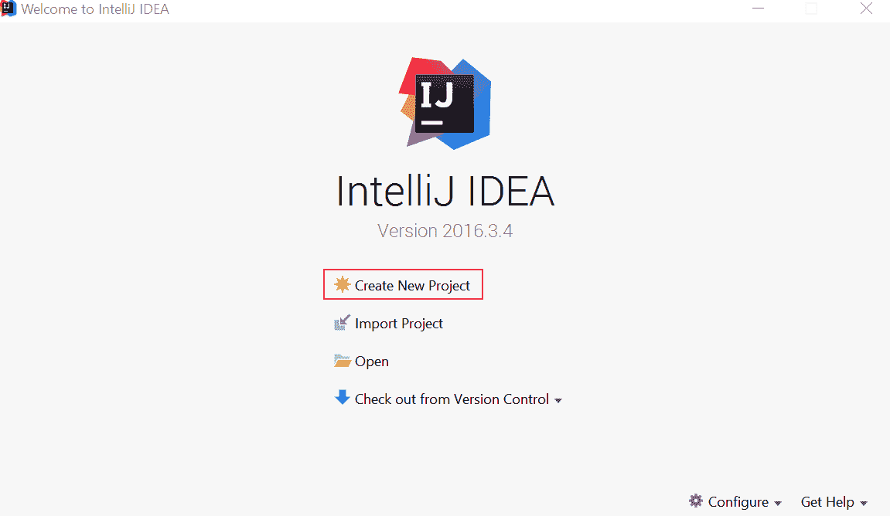

3.  选择 **Spring Initializer**, 并点击 **Next** ，如图 2 所示：

    ##### 图 2\. 选择 Spring Initializer

    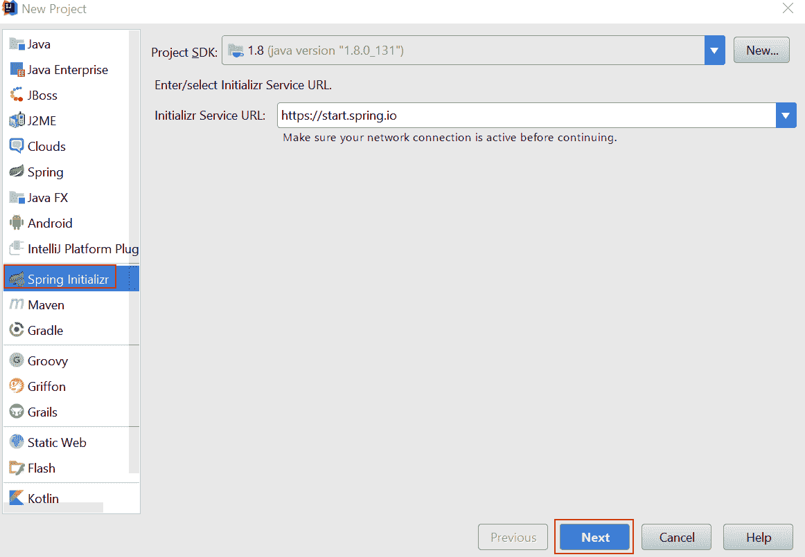

4.  填写 **Group**, **Artifact** 信息，并点击 **Next** ，如图 3 所示：

    ##### 图 3\. 填写相关信息

    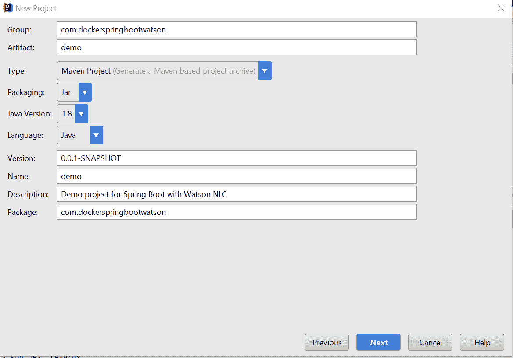

5.  来到 **Dependencies** 页面，由于我们需要创建 RESTful Web 服务，所以选择 **W eb** 依赖，点击 **Next** ，如图 4 所示：

    ##### 图 4\. 选择依赖

    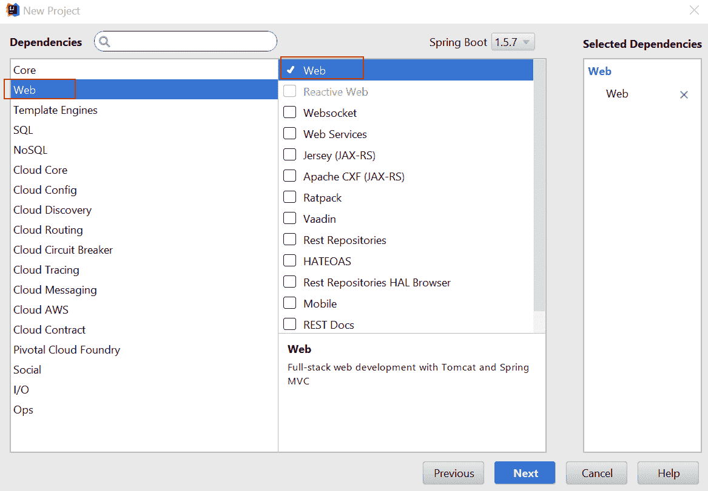

6.  在接下来的页面上，选择项目路径，点击 **Finish** ，如图 5 所示：

    ##### 图 5\. 项目概要

    

7.  Spring Boot 工程已经产生成功，在 IntelliJ IDEA 帮我们生成的工程中，右键单击 **com.dockerspringbootwatson** ，选择 **New->Package** ，在弹出的对话框中输入要创建的 package 名称，本示例中输入 controller。在 controller 包上单击右键，选择 **New->Java Class** ， 此处输入 DemoController。并且在类定义前加上@RestController 注解申明。

类似地，我们创建一个 service 包，并在 service 包中创建一个名为 WatsonNLCService 的类，并且在类定义前加上@Component 注解申明。最终的项目结构，如图 6 所示：

##### 图 6\. 最终项目结构

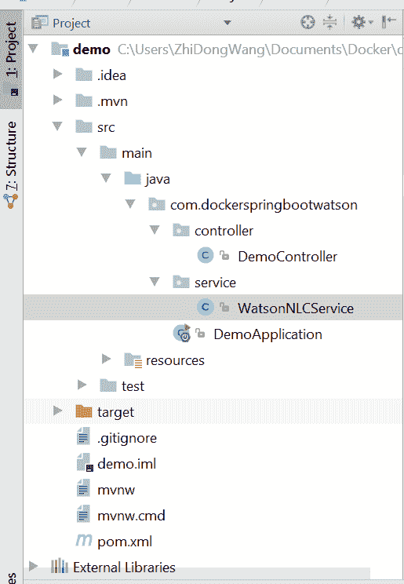

## 在 IBM Cloud 上创建 Watson NLC Service

1.  使用您的账号和密码登录 [IBM Cloud](https://cocl.us/IBM_CLOUD_GCG) 。
2.  在 **Catalog** 中选择 **Natural Language Classifier** ，并单击如图 7 所示图标。

    ##### 图 7\. Natural Language Classifier

    

3.  输入一个 service name 或者使用默认的 service name,并选择相应的 organization 和 space 点击 **Create** 按钮，就创建出一个 Natural Language Classifier，如图 8 所示：

    ##### 图 8\. 创建 NLC Service

    

4.  接下来就需要给这个 service 进行训练并且产生一个可用的 classifier，关于 Natural Language Class 知识，请参考 [IBM Cloud 上相关文档](https://www.ibm.com/watson/services/natural-language-classifier/) 。

5.  进入到刚才创建的 service 页面，点击左导航栏的 **Service credentials** ，就会看到使用这个 service 的 credentials，如图 9 所示：

    ##### 图 9\. 查看 Credentials

    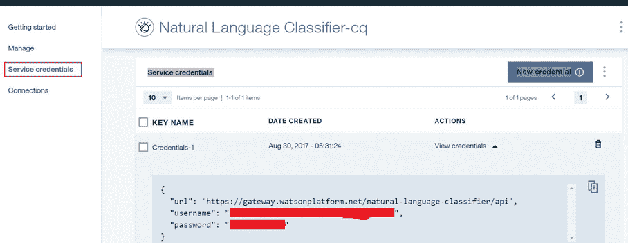

6.  接下来，使用如下命令进行训练刚才创建的 NLC service，命令中的 username 和 password 就是上面 credentials 中看到的。该命令会产生一个新的 classfier ID, 请将这个 classifierId 记录下来以便后续使用，请将该命令放在一行内运行（示例目的，这里仅使用 [IBM Cloud](https://cocl.us/IBM_CLOUD_GCG) 官方提供的数据进行训练，示例工程中亦上传了此数据），如下代码清单 1 和图 10 所示：

    ##### 清单 1\. 创建 NLC Classfier 的命令

    ```
     curl -i --user "yourUsername":"yourPassword" -F
     training_data=@weather_data_train.csv -F training_metadata="{\"language\":\"en\",\"name\":\"sampleClassifier\"}"
     https://api.us-south.natural-language-classifier.watson.cloud.ibm.com 
    ```

    ##### 图 10\. 创建 NLC Classifier

    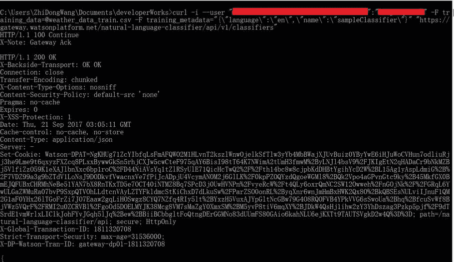

7.  训练一个新创建的 classifier，根据数据量不同，需要的时间也不同，可以使用如下命令来查看状态是否变成 Available,只有变成 Available 才能被用来使用，如下代码清单 2 和图 11 所示：

    ##### 清单 2\. 查看 NLC Classifier 状态的命令

    ```
     Curl --user "yourUsername":"yourPassword"
     https://api.us-south.natural-language-classifier.watson.cloud.ibm.com/youClassifierId 
    ```

    ##### 图 11\. 查看 NLC Classifier 状态

    

8.  一旦训练的 classifier 状态变为 Available,可以使用如下命令进行测试，如下代码清单 3 和图 12 所示：

    ##### 清单 3\. 测试 Classifier 的命令

    ```
     curl -G --user "yourUsername":"yourPassword"
     "https://api.us-south.natural-language-classifier.watson.cloud.ibm.com/youClassifierId/classify" --data-urlencode "text= Should I prepare for sleet? " 
    ```

    ##### 图 12\. 测试 Classifier 结果

    

## 在 Spring Boot 工程中使用 Watson NLC Servcie

1.  为了在 Spring Boot 工程中使用 Watson NLC Service, 首先我们必须先引入相关的 SDK, 双击打开 pom.xml 文件，在 dependencies 中添加如下依赖配置，Watson NLC SDK 就会被加载到工程中。

    ##### 清单 4\. 添加 SDK 依赖

    ```
     <dependency>
             <groupId>com.ibm.watson.developer_cloud</groupId>
             <artifactId>natural-language-classifier</artifactId>
             <version>3.9.1</version>
     </dependency> 
    ```

2.  双击打开 DemoController 这个类，在其中编写如清单 5 所示代码，这将创建一个 rest service 来接收请求传入的数据。

    ##### 清单 5\. Rest Service

    ```
     @Autowired
     private WatsonService watsonService;

     @GetMapping("nlc/{inputText}")
     public Classification getClassification(@PathVariable String inputText){
          return watsonService.getClassification(inputText);
     } 
    ```

3.  双击打开 WatsonNLCService 这个类,编写如清单 6 所示代码，用来调用 Watson NLC service。

    注：本示例中为了方便将用户名密码和 classifierId 作为硬编码，但在实际开发一定不能这样做，最好放在配置文件中。

    ##### 清单 6\. 调用 NLC Service

    ```
     private static NaturalLanguageClassifier service = null;
         static {
             service = new NaturalLanguageClassifier();
             service.setUsernameAndPassword("yourUserName", "yourPassword");
         }

         public Classification getClassification(String text){
             Classification classification = null;
             String classifierId = this.getClassifierId();
             classification = service.classify(classifierId,  text).execute();
             return classification;
         }

         //read value from property file
         private String getClassifierId() {
             return "yourClassifierId";
         } 
    ```

4.  双击打开 resources 目录下的 application.properties, 编写代码如下, 我们的应用就会运行在 9000 端口上。

    ##### 清单 7\. 配置相应端口

    ```
     server.port=9000 
    ```

5.  接下来就可以启动我们的应用了。在 IntelliJ IDEA 主界面的右上角有个绿色的三角形按钮，如图 13 所示。点击这个按钮，我们的应用程序就会被启动。从 console 的 log 中可以看到我们的工程已经运行起来在 9000 端口上，如图 14 所示，相关日志也被显示出来了。

    ##### 图 13\. 启动应用

    

    ##### 图 14.应用启动日志

    

6.  接下来，我们使用 postman 或者类似的工具来测试我们的 service，在地址栏中输入 [`localhost:9000/nlc/How`](http://localhost:9000/nlc/How) hot will it be today，这个将调用 DemoController 中刚刚定义好的 restful service, 其中 How hot will it be today 是参数。使用这个 service 来判断 How hot will it be today 是不是属于 temperature。

    查看 Watson Natural Language Service 给出的结果，可以看到和直接访问 Natural Language Classifier API 返回的结果相同，这表明我们的 Spring Boot 代码已经成功调用 Watson Natural Language Classifier。如图 15 所示：

    ##### 图 15\. Postman 测试结果

    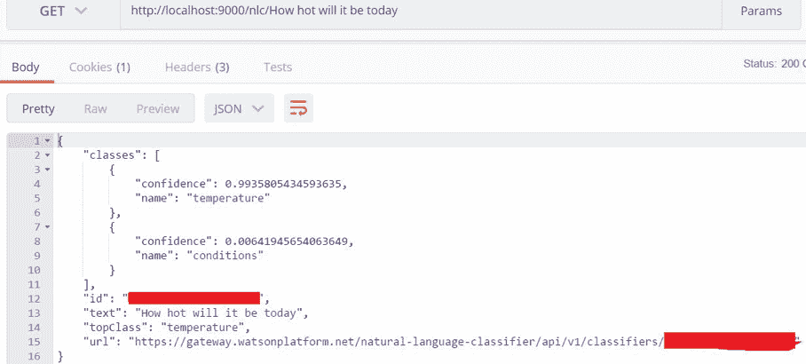

7.  上面的代码是直接运行在 IDEA 中，接下来创建可运行的 jar 包。打开 pom.xml，加入如下代码，给要生成的 jar 包一个名字，这里以 demo 为例,修改结果如图 16 所示：

    ##### 图 16\. 修改 pom.xml

    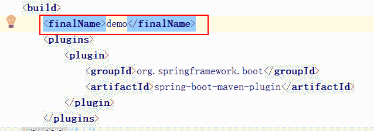

8.  打开 **Maven Projects** 窗口，选择 **clean** 和 **package** ，然后点击 **Run Maven Build** 这个绿色按钮就会生成 demo.jar。

    ##### 图 17\. 执行 Maven Clean 和 Package

    

9.  当运行完成，我们查看 **target** 目录下，会发现已经生成 **demo.jar** ，如图 18 所示：

    ##### 图 18\. 查看生成的结果 jar 包

    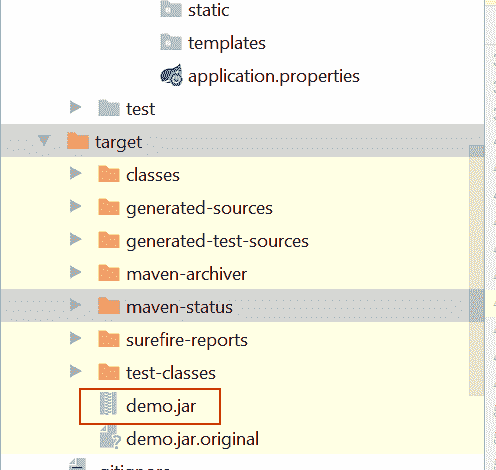

    我们可以直接使用 java -jar demo.jar 来运行这个应用，然后同样使用 postman 进行测试，会取得同样的效果。

读者朋友也可以尝试创建一个漂亮的 UI 来共用户使用。也可以尝试将本工程打成一个 war 包而然后发布到 Tomcat 或者类似的容器中，当然需要对修改一些代码。

## 将应用生成 Docker 镜像

1.  启动 Docker，在 Win10 搜索 doc，在开始菜单中出现 **Docker for Windows** ，点击启动，如图 19 所示：

    ##### 图 19\. 搜索 Docker

    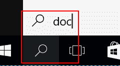

2.  稍等几秒钟，Docker 就会启动，把鼠标放在上面会显示 Docker is running，如图 20 所示：

    ##### 图 20\. Docker 运行

    

3.  在 **demo** 工程根目录下，点击右键，选择 **New->File** ，新建一个名为 Dockerfile 的文件，编辑此文件，输入清单 8 中代码。

    ##### 清单 8\. Dockerfile 代码

    ```
     FROM openjdk:8

     ADD target/demo.jar demo.jar

     EXPOSE 9000

     ENTRYPOINT ["java","-jar", "demo.jar"] 
    ```

    此段代码的意思是使用 openjdk8 作为 base image,生成一个新的 image，并且将 9000 端口暴露出来。

4.  在 IntelliJ IDEA 中打开 **Terminal** 窗口，如图 21 所示：

    ##### 图 21\. Terminal 窗口

    

5.  在 **Terminal** 窗口中输入如下命令并回车（注意别忘记最后一个），来创建一个 docker 镜像，如清单 9 所示：

    ##### 清单 9\. Docker Build

    ```
     docker build -f Dockerfile -t demo . 
    ```

    如果你之前没有运行过，那么 docker 从远程下载 base image，需要花一些时间，请耐心等待一会。

6.  使用 `docker images` 命令，可以看到新的 demo 镜像已经被创建成功，如图 22 所示：

    ##### 图 22\. Docker Images 命令结果

    

7.  使用如下命令运行刚刚创建的 demo image。

    ##### 清单 10\. 在 Docker 中运行镜像

    ```
     docker run -p 9000:9000 demo 
    ```

    在 Console 中观测日志，可以看出我们的应用已经成功运行在 9000 端口上。

8.  打开浏览器或者使用 Postman，在地址栏中输入 url: [`localhost:9000/nlc/How`](http://localhost:9000/nlc/How) hot will it be today。

    可以看到结果返回正常。

相信读者朋友根据本示例已经有了一个初步的感性的认识。如果您的项目需求涉及到更多技术比如数据库，消息队列等，也会轻松在 Spring Boot 项目中集成进来，进一步运行到 Docker 容器中。特别是如果基于微服务的架构的话，使用容器技术会让您的应用更加得心应手。

## 结束语

当今的 IT 界风起云涌，各种新的技术层出不穷，几乎每天都有新的概念、理念和技术出现在我们的视线。作为一名技术人员，我们需要时刻关注着这些新的东西。有时候会顾此失彼。而 Spring Boot, Watson, Docker 都是属于新的热门的技术，可能有些开发人员熟悉其中一种或两种。通过学习本示例，可以学习到如何将它们集成在一起，起到一个入门的作用。当然要精通这三种中的任何一种都需要更多精力去学习。

本示例所有代码在 [github](https://github.com/SpringbootNLCDocker/demo) 上可以下载。

## 参考资源

*   [Spring Boot 基础](https://www.ibm.com/developerworks/cn/java/j-spring-boot-basics-perry/index.html)
*   了解更多有关 [Watson Natural Language Classifier](https://www.ibm.com/watson/services/natural-language-classifier/)
*   [Docker 官方网站](https://www.docker.com/)